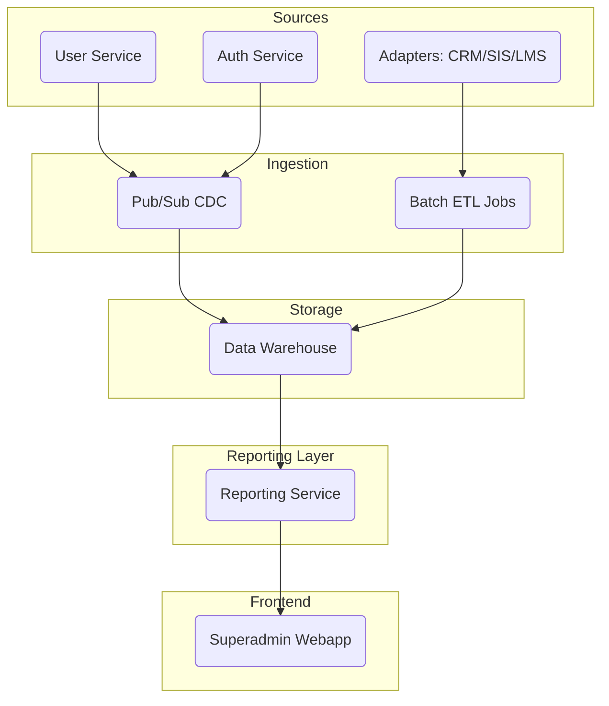

# ADR-028: Kiến trúc hệ thống báo cáo và phân tích đa tenant

## 1. 📌 Bối cảnh (Context)

Hệ thống DX-VAS hiện tại chưa có nền tảng báo cáo tập trung phục vụ cho các yêu cầu vận hành từ Ban Giám đốc (BoD), đặc biệt là báo cáo có tính tổng hợp, đa tenant và khả năng tùy biến linh hoạt. Việc chạy truy vấn phân tích trên hệ thống transactional (OLTP) hiện tại không đảm bảo hiệu năng, bảo mật và khả năng mở rộng.

Trong khi đó, các hệ thống hiện tại như User Service, Auth, CRM/SIS/LMS đều phát sinh nhiều dữ liệu quan trọng cần được tổng hợp, phân tích và trực quan hóa. Đồng thời, lộ trình tích hợp AI Agent hỗ trợ BoD trong tương lai yêu cầu dữ liệu phải được chuẩn hóa, có phiên bản và dễ truy xuất.

Nếu không đưa ra quyết định sớm, toàn hệ thống sẽ đối mặt với nguy cơ:
- Truy vấn báo cáo chậm và ảnh hưởng đến hệ thống chính.
- Không thể tổng hợp và chuẩn hóa thông tin giữa các tenant.
- Không thể mở rộng khả năng tự động hóa / tích hợp AI dashboard.

---

## 2. 🧠 Quyết định (Decision)

Chúng tôi quyết định thiết kế và triển khai một nền tảng báo cáo mới bao gồm:

- Một **Reporting Service** chuyên biệt (microservice mới).
- Một **Data Warehouse** với schema chuẩn hóa, hỗ trợ truy vấn OLAP.
- **Data Pipeline** gồm cả Pub/Sub (streaming) và Batch ETL.
- **Superadmin Webapp** sẽ tích hợp hai module mới: trình xem báo cáo và trình quản lý report template.
- Báo cáo được kiểm soát chặt chẽ qua RBAC, có audit log và xuất hiện trong hệ thống permission toàn cục.

---

## 3. 🧱 Chi tiết Thiết kế / Giải pháp (Design / Solution Details)

### 3.1. Thành phần mới và sơ đồ kiến trúc

- `Reporting Service`:
  - API: `/reports`, `/report-templates`, `/saved-reports`
  - Truy vấn trên predefined views hoặc **validated query templates**: là những cấu trúc truy vấn được định nghĩa trước, cho phép truyền tham số đầu vào nhưng không cho phép thay đổi logic lõi. Các template này được lưu trữ như một phần của Report Template (chi tiết tại ADR-029).
  - Trả dữ liệu theo `ReportEnvelope` chuẩn `ADR-012`
  - Ghi log truy cập theo `ADR-008`

- `Data Warehouse`:
  - Fact tables: `fact_login`, `fact_user`, `fact_permission`
  - Dim tables: `dim_tenant`, `dim_time`, `dim_role`
  - Partition theo thời gian + tenant
  - Hỗ trợ **schema versioning** và **schema evolution** để đảm bảo khả năng mở rộng và bảo trì khi các service nguồn thay đổi dữ liệu.

- `Data Pipeline`:
  - CDC từ Pub/Sub: `vas.auth.login.v1`, `vas.user.created.v1`, `vas.lms.activity.v1`
  - Batch extract từ APIs nếu adapter không hỗ trợ Pub/Sub
  - Cần tích hợp các bước kiểm tra chất lượng dữ liệu (Data Quality checks) trong quá trình ETL/ELT để đảm bảo tính đúng đắn và đáng tin cậy của dữ liệu đầu vào.

- `UI Webapp`:
  - Module 1: Báo cáo (viewer, filter, chart)
  - Module 2: Quản lý mẫu (define, test, assign permission)

### 3.2. Kiến trúc phân quyền và bảo mật

- RBAC áp dụng trên từng API: ví dụ `report.view_usage`, `report.manage_templates`
- Mỗi báo cáo có metadata `required_permission`, `scope`, `tenant_mode` → được lưu như một phần của cấu trúc Report Template (định nghĩa chi tiết tại ADR-029).
- Truy vấn cá nhân hóa cho người dùng (qua `saved-config`)
- Audit log ghi: user, report_id, params, duration

### 3.3. ADR và hệ thống quản lý schema

- Tạo `adr-029-report-template-schema.md` để mô tả chuẩn template
- Tạo `adr-030-event-schema-governance.md` để quản lý versioning Pub/Sub schema
- Chuẩn hóa các sự kiện gửi từ các service hiện tại

---

## 4. ✅ Hệ quả (Consequences)

### 4.1. Ưu điểm
- ✅ Cho phép tổng hợp dữ liệu xuyên tenant mà vẫn đảm bảo phân quyền.
- ✅ Tối ưu hóa hiệu năng truy vấn bằng cách tách biệt OLAP/OLTP.
- ✅ Đặt nền móng cho dashboard AI-ready và automation.
- ✅ Cải thiện tính minh bạch và giám sát qua audit logging.

### 4.2. Nhược điểm / Rủi ro / Lưu ý
- ⚠️ Phức tạp hơn trong triển khai: thêm nhiều thành phần mới
  - *Giải pháp:* Áp dụng roadmap 8 tuần, chia nhỏ module theo milestone
- ⚠️ Chi phí sử dụng warehouse (BigQuery, etc)
  - *Giải pháp:* Theo dõi và tối ưu chi phí qua `ADR-020`, dùng tier cold/hot
- ⚠️ Yêu cầu schema đồng nhất từ các adapter cũ
  - *Giải pháp:* Tạo wrapper services hoặc schema mapping adapters

### 4.3. Tác động đến các thành phần khác
- **User Service Master:** cần expose thêm permission `report.*`
- **Auth Service:** cần phát sự kiện login thành công có dạng chuẩn
- **Superadmin Webapp:** thêm 2 module mới
- **ADR-020:** cần bổ sung phần quản lý cost cho query OLAP

---

## 5. 🔄 Các Phương án Khác đã Cân nhắc

### 5.1. Phương án A: Gọi trực tiếp vào OLTP để tạo báo cáo
- **Lý do không chọn:** Ảnh hưởng hiệu năng hệ thống, khó mở rộng

### 5.2. Phương án B: Sử dụng công cụ BI bên ngoài (Metabase, PowerBI)
- **Lý do không chọn:** Không kiểm soát được RBAC tích hợp, không phù hợp với đặc thù đa tenant và workflow tinh chỉnh

---

## 6. 👎 Tài liệu liên quan

- [ADR-012 - Cấu trúc response chuẩn](./adr-012-response-structure.md)
- [ADR-007 - RBAC và phân quyền động](./adr-007-rbac.md)
- [ADR-008 - Audit Logging](./adr-008-audit-logging.md)
- [ADR-020 - Chiến lược Cost Observability](./adr-020-cost-observability.md)
- [ADR-027 - Chiến lược quản lý dữ liệu](./adr-027-data-management-strategy.md)
- [ADR-029 - Report Template Schema](./adr-029-report-template-schema.md)
- [ADR-030 - Event Schema Governance](./adr-030-event-schema-governance.md)
- [README.md hệ thống DX VAS](../README.md)
- [system-diagrams.md](../architecture/system-diagrams.md)