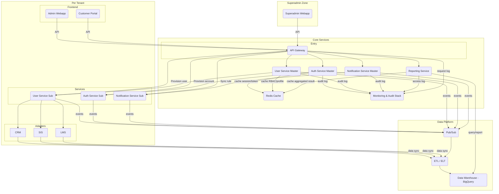

# TÀI LIỆU KIẾN TRÚC CHI TIẾT – HỆ THỐNG CHUYỂN ĐỔI SỐ VAS

## 📚 Mục lục Tài liệu Kiến trúc Chi tiết – Hệ thống dx-vas

| STT | Mục chính | Mô tả | Liên kết |
|-----|-----------|-------|----------|
| 1️⃣ | **Yêu cầu dự án** | Mô hình tổ chức, số lượng người dùng, yêu cầu mở rộng | [Xem mục](#1-yêu-cầu-dự-án) |
| 2️⃣ | **Đăng nhập & Phân quyền động (RBAC)** | Thiết kế RBAC động, template, phân tầng Master/Sub | [Xem mục](#2-đăng-nhập--phân-quyền-động-rbac) |
| 3️⃣ | **Auth Service** | Xác thực người dùng, JWT, xác thực đa kênh | [Xem mục](#3-auth-service) |
| 4️⃣ | **User Service** | Cấu trúc user master/sub, RBAC binding và API quản lý | [Xem mục](#4-user-service) |
| 5️⃣ | **API Gateway** | Quản lý route, kiểm tra phân quyền, cấu trúc response | [Xem mục](#5-api-gateway) |
| 6️⃣ | **Notification Service** | Hệ thống gửi thông báo đa kênh: Zalo, Gmail, WebPush | [Xem mục](#6-notification-service) |
| 7️⃣ | **Superadmin Webapp (SPA)** | Quản lý toàn hệ thống, tenants, templates, global log | [Xem mục](#7-superadmin-webapp-spa) |
| 8️⃣ | **Chiến lược Quản lý Dữ liệu** | Soft delete, anonymization, retention, audit logging | [Xem mục](#8-chiến-lược-quản-lý-dữ-liệu) |
| 9️⃣ | **Hạ tầng triển khai** | Google Cloud Run, Terraform, auto-scaling, mô hình tách stack | [Xem mục](#9-hạ-tầng-triển-khai) |
| 🔟 | **Admin Webapp (per tenant)** | Giao diện quản lý giáo viên, học vụ, tài chính | [Xem mục](#10-admin-webapp-per-tenant) |
| 1️⃣1️⃣ | **Customer Portal (PWA)** | Portal dành cho phụ huynh & học sinh, hỗ trợ offline | [Xem mục](#11-customer-portal-pwa) |
| 1️⃣2️⃣ | **CRM – SuiteCRM** | Adapter tích hợp quản lý học sinh tiềm năng | [Xem mục](#12-crm--suitecrm) |
| 1️⃣3️⃣ | **SIS – Gibbon** | Adapter quản lý hồ sơ, điểm, lớp học | [Xem mục](#13-sis--gibbon) |
| 1️⃣4️⃣ | **LMS – Moodle** | Adapter tích hợp hệ thống học tập | [Xem mục](#14-lms--moodle) |
| 1️⃣5️⃣ | **Zalo OA & Google Chat** | Tích hợp kênh thông báo nội bộ & phụ huynh | [Xem mục](#15-zalo-oa--google-chat) |
| 1️⃣6️⃣ | **CI/CD & DevOps** | Quy trình release, rollback, release approval | [Xem mục](#16-cicd--devops) |
| 1️⃣7️⃣ | **Bảo mật & Giám sát** | IAM, secrets, audit, monitoring, alerting | [Xem mục](#17-bảo-mật--giám-sát) |
| 1️⃣8️⃣ | **Data Migration Plan** | Kế hoạch chuyển đổi dữ liệu thật & test | [Xem mục](#18-data-migration-plan) |
| 1️⃣9️⃣ | **Đào tạo & Chuyển giao** | Hướng dẫn sử dụng, đào tạo vận hành | [Xem mục](#19-đào-tạo--chuyển-giao) |
| 2️⃣0️⃣ | **Tổng kết** | Tóm tắt, khuyến nghị và hướng mở rộng | [Xem mục](#20-tổng-kết) |

---

### 📎 Phụ lục

| STT | Phụ lục | Mô tả | Liên kết |
|-----|--------|-------|----------|
| 🅰️ | **Phụ lục A – ADRs** | Danh sách quyết định kiến trúc chính thức | [Xem mục](#phụ-lục-a–danh-sách-quyết-định-kiến-trúc--adrs) |
| 🅱️ | **Phụ lục B – Nguyên tắc Kiến trúc Cốt lõi** | Nguyên lý nền tảng trong thiết kế dx-vas | [Xem mục](#phụ-lục-b--nguyên-tắc-kiến-trúc-cốt-lõi) |
| 🆑 | **Phụ lục C – Sơ đồ Kiến trúc** | Mermaid diagrams chi tiết các thành phần | [Xem mục](#phụ-lục-c--sơ-đồ-kiến-trúc) |
| 🆘 | **Phụ lục D – Interface Contracts (ICs)** | Định nghĩa ràng buộc giữa các service | [Xem mục](#phụ-lục-d--interface-contracts) |
| 🛠️ | **Phụ lục E – Hướng dẫn đóng góp & phát triển** | Hướng dẫn PR, branch, format tài liệu | [Xem mục](#phụ-lục-e--hướng-dẫn-đóng-góp--phát-triển) |

## 1. Yêu cầu dự án

* **Mục tiêu chính:** Triển khai một hệ thống chuyển đổi số toàn diện cho một công ty giáo dục quản lý nhiều trường thành viên, tích hợp quản lý học sinh, giáo viên, phụ huynh, lớp học, học phí, thông báo, học tập online và quy trình tuyển sinh.

* **Mô hình vận hành:** 
  * Công ty sở hữu và quản lý **3 trường thành viên** (mỗi trường là một tenant riêng biệt).
  * Hệ thống vận hành theo kiến trúc **multi-tenant**, mỗi tenant có stack riêng (frontend, adapters, auth/user sub-service), và dùng chung API Gateway & Tenant Master Services.

* **Thiết kế ban đầu (cho toàn hệ thống):**
  * 1 công ty quản lý 3 tenant (trường thành viên).
  * Tổng số người dùng dự kiến:
    * **100 nhân viên, giáo viên** (toàn hệ thống)
    * **Từ 100 đến 600 học sinh mỗi trường** → tổng cộng **khoảng 1000 học sinh**
    * **Khoảng 1000 phụ huynh**, tương ứng 1:1 với học sinh

* **Khả năng mở rộng tối đa (gấp 2.5 lần):**
  * **250 nhân viên, giáo viên**
  * **Tối đa 2500 học sinh**
  * **Tối đa 2500 phụ huynh**

## 2. Đăng nhập & Phân quyền động (RBAC)

Hệ thống dx-vas sử dụng kiến trúc RBAC động với khả năng multi-tenant. Quyền truy cập được kiểm soát chính xác theo từng tenant (trường thành viên), kết hợp quản trị tập trung từ Master với khả năng tùy biến cục bộ tại từng tenant.

### 🔑 Mô hình phân tầng định danh và RBAC

- **User Service Master**:
  - Quản lý toàn bộ định danh người dùng (`users_global`)
  - Duy trì thông tin `tenants`, `user_tenant_assignments`
  - Cung cấp bộ `global_roles_templates` và `global_permissions_templates`
  - Trạng thái `is_active` toàn cục

- **Sub User Service (per tenant)**:
  - Quản lý RBAC riêng biệt của tenant
  - Tham chiếu `user_id_global`, có `is_active_in_tenant`
  - Cho phép kế thừa hoặc tuỳ chỉnh role/permission riêng
  - Thực hiện gán vai trò, phân quyền, và kiểm tra RBAC trong nội bộ tenant

📘 Mọi chi tiết về schema, bảng, quan hệ được định nghĩa rõ trong:
- [`user-service/master/data-model.md`](./services/user-service/master/data-model.md)
- [`user-service/tenant/data-model.md`](./services/user-service/tenant/data-model.md)

### 🔐 Đánh giá phân quyền tại API Gateway

- JWT do Auth Master/Sub cấp, chứa `user_id`, `tenant_id`, `roles`, `permissions`
- Gateway thực hiện:
  - Xác thực JWT
  - Kiểm tra `is_active` và `is_active_in_tenant`
  - Truy vấn cache RBAC (theo `user_id + tenant_id`)
  - Đánh giá điều kiện JSONB nếu có (VD: xem điểm học sinh nếu cùng lớp)

### 🧭 Tính linh hoạt

- Một user có thể thuộc nhiều tenant với vai trò khác nhau
- Tenant có thể chỉnh sửa RBAC riêng mà không ảnh hưởng các tenant khác
- RBAC cache tại Gateway được đồng bộ qua Pub/Sub hoặc TTL tự động

📘 Đọc thêm mô hình phân quyền chi tiết tại: [`rbac-deep-dive.md`](./architecture/rbac-deep-dive.md)

## 3. Auth Service

Hệ thống dx-vas sử dụng mô hình xác thực đa tầng để hỗ trợ multi-tenant, đồng thời đảm bảo tính linh hoạt trong xác thực Google OAuth2 và Local/OTP.

### 🔐 Auth Service Master
- Chịu trách nhiệm xử lý xác thực thông qua Google OAuth2 cho toàn bộ hệ thống.
- Sau khi người dùng xác thực thành công qua Google, hệ thống sẽ:
  - Xác định danh sách các tenant mà người dùng thuộc về.
  - Nếu người dùng thuộc nhiều tenant, hiển thị giao diện chọn tenant.
  - Gọi User Service Master để kiểm tra `user_id_global`, và xác thực xem người dùng có quyền truy cập tenant đã chọn không.
  - Gọi Sub User Service (của tenant đó) để lấy danh sách roles/permissions trong tenant.
  - Phát hành JWT "đầy đủ" chứa:
    - `user_id`
    - `tenant_id`
    - `roles`, `permissions`
    - `auth_provider`, `exp`, `trace_id`…

### 🔐 Sub Auth Service (per tenant)
- Triển khai riêng biệt trong từng tenant stack.
- Xử lý xác thực cho các user sử dụng:
  - Tài khoản Local (tên đăng nhập/mật khẩu)
  - OTP (SMS/email)
- Sau khi xác thực local thành công:
  - Gọi User Service Master để đăng ký người dùng (nếu lần đầu) và nhận `user_id_global`.
  - Gọi Sub User Service của chính tenant để lấy RBAC tương ứng.
  - Phát hành JWT đầy đủ như Auth Master.

### 🔐 Tính năng bảo mật nâng cao
- Cơ chế CAPTCHA và giới hạn số lần gửi OTP theo IP/user.
- JWT ký bằng key được luân phiên định kỳ (theo chính sách [`ADR-006`](./ADR/adr-006-auth-strategy.md)).
- Hỗ trợ đăng xuất, làm mới token (refresh), kiểm tra trace log đăng nhập.

### 🎯 Lưu ý về triển khai:
- Mỗi tenant có thể dùng Sub Auth Service tùy chọn (bắt buộc nếu có học sinh/phụ huynh không dùng Workspace).
- Tất cả JWT (kể cả từ Sub Auth) đều phải tuân thủ format chuẩn và có thể được xác minh bởi API Gateway.

📘 Xem thêm: [ADR-006 – Auth Strategy](./ADR/adr-006-auth-strategy.md)

## 4. User Service

User Service trong hệ thống dx-vas được chia thành hai cấp độ để hỗ trợ kiến trúc multi-tenant:

### 🧠 User Service Master (Tập trung toàn hệ thống)
- Là nơi **quản lý định danh người dùng toàn cục**:
  - Bảng `users_global`: mỗi user có một `user_id` duy nhất toàn hệ thống, kèm `auth_provider`, `email`, `phone`, `local_auth_tenant_id` (nếu là user local).
  - Bảng `tenants`: danh sách tenant (trường thành viên) đang hoạt động.
  - Bảng `user_tenant_assignments`: ánh xạ user ↔ tenant (người dùng có thể thuộc nhiều tenant).
  - Trạng thái `is_active` toàn cục.
- Quản lý bộ **template role/permission** dùng chung toàn hệ thống (`global_roles_templates`, `global_permissions_templates`).
- Phát sự kiện Pub/Sub (`user_assigned_to_tenant`, `user_info_updated`) để đồng bộ xuống Sub User Service.
- Cung cấp API quản trị cho Superadmin:
  - Tạo tenant, gán user vào tenant, cập nhật thông tin định danh chung.

### 🧩 Sub User Service (Cấp tenant – được triển khai trong từng stack tenant)
- Quản lý RBAC riêng biệt cho từng tenant:
  - Bảng `users_in_tenant`: tham chiếu `user_id_global`, có `is_active_in_tenant`.
  - `roles_in_tenant`, `permissions_in_tenant`: kế thừa từ Master hoặc tự định nghĩa.
  - Mapping RBAC: `user_role_in_tenant`, `role_permission_in_tenant`.
- Truy vấn RBAC tại API Gateway dựa trên `user_id + tenant_id`.
- Đồng bộ hóa dữ liệu từ Master thông qua Pub/Sub.
- Cung cấp API cho Admin tenant để:
  - Gán role cho user trong tenant
  - Cập nhật trạng thái user trong tenant
  - Xem nhật ký phân quyền (nếu bật audit)

### 🔄 Cơ chế hoạt động điển hình:
- Khi Superadmin gán một user vào tenant:
  - User Service Master ghi nhận và phát sự kiện `user_assigned_to_tenant`
  - Sub User Service của tenant nhận sự kiện và tạo bản ghi "shadow user" nếu chưa có
- Khi user login thành công và chọn tenant:
  - Auth Service gọi Master → kiểm tra quyền truy cập tenant
  - Gọi Sub User Service → truy vấn RBAC → trả lại để phát hành JWT

📘 Xem chi tiết cấu trúc bảng và luồng tại: [`rbac-deep-dive.md`](./architecture/rbac-deep-dive.md), [`user-service/data-model.md`](./services/user-service/data-model.md)

## 5. API Gateway

API Gateway đóng vai trò trung tâm điều phối trong kiến trúc dx-vas, đặc biệt trong mô hình multi-tenant. Nó xử lý xác thực, phân quyền động (RBAC), định tuyến đến đúng tenant stack, và bảo vệ các backend nội bộ.

### 🧭 Định tuyến theo Tenant

- Gateway phục vụ nhiều tenant (trường thành viên) trên cùng một entrypoint.
- **Tenant được xác định qua một trong ba cách:**
  1. `tenant_id` trong JWT (ưu tiên)
  2. Domain/subdomain của Frontend App (VD: `abc.truongvietanh.edu.vn`)
  3. Tham số `tenant` trong URL (fallback, dùng trong môi trường phát triển)

- Dựa vào `tenant_id`, Gateway sẽ:
  - Forward request đến **Sub Adapter / Sub Service** đúng tenant.
  - Hoặc đến **Tenant Master Service** nếu request thuộc về Superadmin Webapp.

### 🔐 Kiểm tra RBAC động theo tenant

- Gateway thực hiện xác thực JWT:
  - Do Auth Master hoặc Sub Auth Service phát hành.
  - Phải chứa: `user_id`, `tenant_id`, `roles`, `permissions`, `auth_provider`.

- Kiểm tra trạng thái người dùng:
  - `is_active` toàn cục (từ User Service Master)
  - `is_active_in_tenant` (từ Sub User Service)

- Truy vấn Redis cache để lấy `permissions` gắn theo `tenant_id`.
- Evaluate `condition` (nếu có) theo context request (VD: `student_id`, `class_id`...)

### 📦 Forward request

- Nếu pass: Gateway forward request đến backend service đúng tenant:
  - Gắn các header: `X-User-ID`, `X-Tenant-ID`, `X-Permissions`, `X-Role`, `X-Trace-ID`, `X-Auth-Method`
- Nếu fail: Trả lỗi 403 hoặc 401 tùy trường hợp.

### 🔐 Bảo vệ nội dung & định danh

- Các header định danh được ký (`X-Signature`) hoặc chỉ forward trong nội bộ (mTLS).
- Backend service KHÔNG được chấp nhận header định danh nếu request từ bên ngoài Gateway.

📘 Sơ đồ đánh giá RBAC xem chi tiết tại: 👉 [RBAC Evaluation Flow – System Diagrams](./architecture/system-diagrams.md#4-rbac-evaluation-flow--luồng-đánh-giá-phân-quyền-động)

## 6. Notification Service (Multi-Tenant)

Notification Service trong kiến trúc dx-vas được triển khai theo mô hình phân tầng, hỗ trợ gửi thông báo cách ly theo tenant và broadcast toàn hệ thống bằng kiến trúc bất đồng bộ qua Pub/Sub.

### 🧭 Phân tầng dịch vụ

#### 🔹 Sub Notification Service (per Tenant)
- Mỗi tenant có một instance Notification Service riêng trong stack của mình.
- **Chức năng:**
  - Gửi thông báo nội bộ của tenant (học phí, điểm danh, v.v.)
  - Quản lý template riêng (`notification_templates_in_tenant`)
  - Sử dụng cấu hình kênh riêng: Zalo OA, Gmail API, Google Chat webhook
  - Ghi log theo dõi gửi thông báo (`notification_logs_in_tenant`)
- **Lắng nghe Pub/Sub:** Subscribe vào topic `vas-global-notifications-topic`, lọc và xử lý các thông báo toàn hệ thống nếu phù hợp `tenant_id`.

#### 🔹 Notification Service Master (Shared Core)
- Phục vụ Superadmin Webapp.
- **Chức năng:**
  - Gửi thông báo toàn hệ thống hoặc đến một nhóm trường.
  - Phát sự kiện `global_notification_requested` lên Pub/Sub với:
    - `target_tenant_ids` hoặc tiêu chí lọc (VD: `target_user_roles`)
    - `message_id`, nội dung gốc, `correlation_id`
  - Không can thiệp chi tiết xử lý tại các tenant.
  - Thu thập trạng thái gửi từ các Sub Service thông qua sự kiện phản hồi `tenant_notification_batch_status`.

---

### 🔄 Luồng gửi thông báo toàn hệ thống (Option B – Event-based)

1. Superadmin gửi yêu cầu thông báo → Notification Service Master nhận.
2. Master publish sự kiện lên topic `vas-global-notifications-topic`.
3. Các Sub Notification Service subscribe topic:
   - Lọc theo `tenant_id`, xử lý nếu phù hợp.
   - Gửi thông báo bằng kênh riêng.
   - Gửi sự kiện phản hồi `tenant_notification_batch_status` lên topic `vas-tenant-notification-ack-topic`.

---

### ✅ Cơ chế phòng ngừa rủi ro

| Rủi ro | Phòng ngừa |
|--------|------------|
| Không theo dõi được trạng thái gửi | Sub gửi sự kiện phản hồi, Master hoặc một Monitor Service thu thập & log |
| Gửi trùng thông báo (non-idempotent) | Dùng `message_id` duy nhất + kiểm tra `processed_global_notifications` |
| Sub xử lý nhầm sự kiện không dành cho mình | Payload chứa rõ `target_tenant_ids`, Sub lọc kỹ |
| Sub quá tải khi nhận nhiều sự kiện | Giới hạn Pub/Sub `flow control` + xử lý bất đồng bộ nội bộ |
| Lỗi cấu hình kênh gửi | Sub log lỗi rõ, phát sự kiện phản hồi với trạng thái lỗi cụ thể |
| Dead Letter Topic bị đầy do lỗi lặp lại | Giám sát DLT, có quy trình re-publish sau fix logic |

---

📦 Các thành phần dữ liệu liên quan:

- `notification_templates_in_tenant`
- `channel_configs_in_tenant`
- `notification_logs_in_tenant`
- `global_notification_requested` (Pub/Sub)
- `tenant_notification_batch_status` (Pub/Sub ACK)
- `processed_global_notifications` (DB Sub)

## 7. Superadmin Webapp (SPA)

Superadmin Webapp là ứng dụng quản trị tập trung dành riêng cho đội ngũ quản lý cấp công ty – nơi điều hành toàn bộ hệ thống dx-vas đa tenant.

### 🏛️ Chức năng chính

- Quản lý danh sách tenant (trường thành viên):
  - Tạo/sửa tenant mới, kích hoạt/khóa tenant
  - Cấu hình kết nối CRM/SIS/LMS cho từng tenant
- Gán người dùng vào tenant:
  - Chọn user từ danh sách toàn cục
  - Chọn tenant và gán vai trò ban đầu
  - Gửi lời mời/OTP tới người dùng nếu cần
- Quản lý role/permission toàn hệ thống:
  - Xây dựng **Global Role/Permission Templates**
  - Xem các tenant đang dùng template nào
  - Clone/cập nhật/cảnh báo nếu tenant chỉnh sửa vượt chuẩn
- Quản lý thông tin định danh người dùng:
  - Tìm kiếm user toàn hệ thống
  - Kiểm tra họ thuộc tenant nào, vai trò gì, trạng thái
  - Vô hiệu hóa tài khoản toàn cục hoặc theo từng tenant
- Tổng hợp và theo dõi thống kê toàn hệ thống:
  - Số lượng học sinh/nhân sự theo từng tenant
  - Log hoạt động toàn hệ thống
  - **Truy cập module Báo cáo & Phân tích động** (Xem chi tiết bên dưới)
- Quản lý và cấu hình **Mẫu Báo Cáo (Report Templates)**:
  - Tạo/cập nhật template cho các loại báo cáo hệ thống (xem `ADR-029`)
  - Gán quyền `required_permission` cho từng loại báo cáo
  - Phân loại template theo scope: `global` hoặc `per-tenant`

### 📊 Module Báo cáo & Phân tích

- Giao diện linh hoạt cho phép chọn:
  - Loại báo cáo (từ danh sách `report_templates`)
  - Tham số lọc: khoảng thời gian, tenant, trạng thái, nhóm dữ liệu
  - Cấu hình biểu đồ (dạng cột, đường, bảng, tròn…)
- Hỗ trợ:
  - Truy vấn dữ liệu qua Reporting Service (theo `ADR-028`)
  - Lưu cấu hình báo cáo yêu thích (Dashboard cá nhân)
  - Export báo cáo ra CSV/PDF
- Truy cập theo quyền `report.view_{template_id}` được kiểm tra tại API Gateway

### 🛠 Công nghệ & tích hợp

- SPA chạy trên domain riêng (`superadmin.truongvietanh.edu.vn`)
- Đăng nhập qua Google OAuth2 (yêu cầu quyền `superadmin`)
- Superadmin Webapp gọi API (thông qua API Gateway) đến các Core Services như:
  - **User Service Master**: quản lý user toàn cục, thông tin tenant, cấu hình RBAC templates.
  - **Auth Service Master**: xác thực đăng nhập, định danh Superadmin.
  - **Reporting Service**: truy vấn dữ liệu báo cáo, thống kê toàn hệ thống, quản lý Report Templates.
- Kết nối đến các service quản lý chi phí, logging, audit tập trung

📘 Các API được mô tả trong: [Superadmin Webapp Service](./service/superadmin-webapp/interface-contract.md)
📘 Các Report Templates được định nghĩa chuẩn theo: [`ADR-029`](./ADR/adr-029-report-template-schema.md)  
📘 Luồng báo cáo & Data Warehouse mô tả tại: [`ADR-028`](./ADR/adr-028-reporting-architecture.md)

## 8. Chiến lược Quản lý Dữ liệu

Hệ thống dx-vas áp dụng chiến lược quản lý dữ liệu tập trung để:
- Đảm bảo dữ liệu luôn tuân thủ các quy định pháp lý (FERPA, GDPR...)
- Hỗ trợ audit, phân tích, khôi phục, và truy vết sự kiện
- Tối ưu hoá chi phí lưu trữ và hiệu suất hệ thống

Dữ liệu của hệ thống DX-VAS được chia thành hai nhóm chính:
- **Dữ liệu vận hành (OLTP)**: sử dụng MySQL trên mỗi tenant để lưu trữ dữ liệu người dùng, học sinh, lớp học, v.v.
- **Dữ liệu phân tích (OLAP)**: được lưu trữ trong **Data Warehouse** (dự kiến là BigQuery), phục vụ báo cáo, thống kê và các dịch vụ AI sau này.

**Nguyên tắc chính:**
- ❌ Không hard delete các object có liên kết lịch sử, audit, hoặc cần giữ lâu dài (xem [ADR-026](./ADR/adr-026-hard-delete-policy.md))
- ✅ Luôn sử dụng soft delete (`status`, `is_deleted`, `is_archived`) cho dữ liệu quan trọng
- 🔒 Dữ liệu PII phải được ẩn danh trước khi dùng ở dev/staging (xem [ADR-024](./ADR/adr-024-data-anonymization-retention.md))
- ⏳ Logs, audit, token, OTP có retention rõ ràng và purge định kỳ
- 🔁 Schema migration phải rollback được, theo 3 bước chuẩn (xem [ADR-023](./ADR/adr-023-schema-migration-strategy.md))
- Mọi pipeline nạp dữ liệu vào Data Warehouse đều cần:
  - **Kiểm tra chất lượng dữ liệu (Data Quality)**
  - **Ẩn danh hóa thông tin nhạy cảm** theo [ADR-024](./ADR/adr-024-data-anonymization-retention.md)
- **Schema evolution** được kiểm soát qua version hóa schema và áp dụng [`ADR-030`](./ADR/adr-030-event-schema-governance.md) cho các event phát qua Pub/Sub
- Chính sách lưu trữ (retention) cho dữ liệu phân tích tối thiểu là 1 năm

📎 Xem chi tiết: [ADR-027 - Data Management Strategy](./ADR/adr-027-data-management-strategy.md)

## 9. Reporting Service & Data Warehouse

Hệ thống báo cáo mới được thiết kế để đáp ứng nhu cầu phân tích linh hoạt, phục vụ BoD và chuẩn bị tích hợp AI.

### 🏗 Thành phần chính

- **Data Warehouse (BigQuery)**:
  - Lưu dữ liệu phân tích dạng bảng `fact_*`, `dim_*`
  - Hỗ trợ truy vấn lớn mà không ảnh hưởng đến hệ thống vận hành
  - Quản lý schema theo version (xem [`ADR-030`](./ADR/adr-030-event-schema-governance.md))

- **Data Pipeline (ETL/ELT)**:
  - Dữ liệu được nạp từ các source (User, Auth, LMS, CRM) thông qua:
    - Batch jobs hoặc streaming (Pub/Sub)
  - Đảm bảo:
    - Chất lượng dữ liệu (null checks, reference integrity)
    - Mask dữ liệu nhạy cảm
    - Metadata đầy đủ để hỗ trợ AI

- **Reporting Service**:
  - Trả kết quả báo cáo theo template (xem [`ADR-029`](./ADR/adr-029-report-template-schema.md))
  - Cung cấp các API chính:
    - `GET /report-templates`
    - `POST /reports/{template_id}`
    - `GET /saved-reports`
  - Kiểm soát truy cập qua RBAC ([`ADR-007`](./ADR/adr-007-rbac.md))

- **Report Template**:
  - Xác định truy vấn, tham số đầu vào, quyền truy cập
  - Superadmin có thể tạo/cập nhật các template này
  - Tham chiếu: `ADR-029`

### 🔁 Luồng dữ liệu báo cáo

1. Dữ liệu nguồn phát event hoặc cập nhật DB
2. Data Pipeline nạp vào Data Warehouse
3. Reporting Service sinh truy vấn SQL động dựa trên template
4. Kết quả được hiển thị qua Superadmin Webapp

📎 Tham chiếu: [`ADR-028`](./ADR/adr-028-reporting-architecture.md), [`ADR-029`](./ADR/adr-029-report-template-schema.md), [`ADR-030`](./ADR/adr-030-event-schema-governance.md)

## 10. Định hướng Tích hợp AI (AI Integration Strategy)

### 🎯 Tầm nhìn

Nền tảng dữ liệu đang xây dựng sẽ trở thành bước đệm cho AI Agent có khả năng tự động phân tích, đưa ra gợi ý hoặc hành động hỗ trợ vận hành giáo dục.

### 🔍 Lợi ích của AI

- Dự đoán tình trạng học sinh/giáo viên (vắng học, quá tải,…)
- Tối ưu hóa lịch dạy, lớp học, tài nguyên
- Tư vấn tuyển sinh cá nhân hóa
- Phân tích hiệu suất từng tenant

### 📊 Yêu cầu về dữ liệu cho AI

- Chất lượng cao, đồng nhất giữa tenants
- Đã qua bước ẩn danh (compliant)
- Có metadata đầy đủ: thời gian, người tạo, context domain

### 🤖 Các loại AI Agent tiềm năng

- AI sắp lịch giảng dạy
- AI tư vấn học vụ
- AI tuyển sinh
- AI phân tích rủi ro vận hành
- AI hỗ trợ Superadmin tra cứu nhanh

### 🔧 Các bước chuẩn bị (gợi ý)

- Đảm bảo Data Warehouse "AI-ready"
- Xây dựng Data Prep pipelines
- Thiết kế Data Access Layer riêng (hoặc mở rộng từ Reporting Service)

📎 Ghi chú: Việc phát triển AI Agent cụ thể **nằm ngoài phạm vi CR hiện tại**

## 11. Hạ tầng triển khai

Hệ thống dx-vas được triển khai trên Google Cloud theo mô hình **multi-tenant tách biệt theo stack**, kết hợp với các thành phần dùng chung để tối ưu hoá bảo mật, khả năng mở rộng và quản trị tập trung.

### 🧱 Mô hình triển khai

#### 📌 Shared Core (dùng chung toàn hệ thống)
- **API Gateway:** Trung tâm điều phối request, xác thực, phân quyền động RBAC.
- **Auth Service Master:** Xử lý Google OAuth2, phát hành JWT đa tenant.
- **User Service Master:** Quản lý định danh người dùng toàn cục, tenant registry, RBAC templates.
- **Superadmin Webapp:** Quản trị toàn bộ hệ thống (tenant, người dùng, RBAC templates, báo cáo).
- **Shared Redis Cluster:** Cache RBAC theo `user_id + tenant_id` (theo namespace).
- **Monitoring & Audit Stack:** Logging, tracing, SLO cho toàn bộ hệ thống.
- **Pub/Sub Bus:** Truyền sự kiện từ Master xuống các tenant stack.

#### 🏫 Tenant Stack (triển khai riêng biệt cho từng trường thành viên)
Mỗi tenant (trường) được triển khai dưới dạng **một stack riêng biệt** trên Google Cloud Run, bao gồm:

- **Frontend Apps riêng (PWA + Admin SPA)**:
  - Chạy theo domain của từng trường: `abc.truongvietanh.edu.vn`, `xyz.truongvietanh.edu.vn`
- **Sub Auth Service**:
  - Xác thực Local/OTP (phụ huynh, học sinh) độc lập theo tenant
- **Sub User Service**:
  - Quản lý RBAC riêng, mapping đến `user_id_global`, kiểm soát `is_active_in_tenant`
- **CRM/SIS/LMS Adapter riêng**:
  - Kết nối đến hệ thống legacy của từng trường (SuiteCRM, Gibbon, Moodle)
- **Database riêng hoặc schema phân vùng (nếu dùng chung Cloud SQL)**
- **Logging riêng, giám sát riêng theo `tenant_id` và `env`**

### ⚙️ Cấu trúc Project GCP đề xuất

| Project | Mục đích |
|--------|---------|
| `dx-vas-core` | Shared Core Services (API Gateway, Auth/User Master, PubSub, Redis...) |
| `dx-vas-network` | Shared VPC, NAT, DNS nội bộ |
| `dx-vas-tenant-abc` | Stack riêng cho tenant ABC |
| `dx-vas-tenant-xyz` | Stack riêng cho tenant XYZ |
| `dx-vas-monitoring` | Stack tập trung cho logging, metrics, alerting |
| `dx-vas-data` | Cloud SQL, GCS, BigQuery dùng chung hoặc phân vùng |

### ☁️ Các công nghệ hạ tầng sử dụng
- **Cloud Run:** Triển khai serverless cho tất cả services
- **Cloud SQL:** PostgreSQL (core), MySQL (adapter)
- **Redis (MemoryStore):** RBAC caching
- **Cloud Pub/Sub:** Đồng bộ định danh giữa master ↔ tenant
- **Cloud Monitoring & Logging:** SLO/SLA tracking
- **Terraform:** Mô hình hoá hạ tầng theo module (`core`, `tenant`, `shared`)
- **Data Warehouse**
- **Data Pipeline**

### ☁️ Hạ tầng Dữ liệu & Phân tích (mới)

- **BigQuery** – Data Warehouse chính
- **ETL/ELT Tools** – Airbyte, dbt, hoặc Cloud Function
- **Monitoring chi phí & hiệu năng** – theo `ADR-020`

📎 Tham chiếu: [`ADR-027`](./ADR/adr-027-data-management-strategy.md)

📘 Sơ đồ triển khai xem tại: 👉 [Deployment Overview Diagram](./architecture/system-diagrams.md#9-deployment-overview-diagram--sơ-đồ-triển-khai-tổng-quan)

## 12. Admin Webapp - SPA (cấp độ tenant)

Admin Webapp là ứng dụng quản trị nội bộ dành riêng cho từng trường thành viên (tenant). Đây là giao diện chính để giáo viên, nhân viên và ban giám hiệu quản lý hoạt động học tập, vận hành và phối hợp giữa các bộ phận trong trường.

### 🧩 Đặc điểm

- **Triển khai độc lập cho từng tenant:**
  - Có domain riêng, ví dụ: `admin.abcschool.edu.vn`, `admin.xyzschool.edu.vn`
  - Kết nối với các service backend riêng: CRM/SIS/LMS Adapter, Sub User Service, Sub Auth Service

- **Đăng nhập:**
  - Nhân viên, giáo viên sử dụng Google OAuth2 (qua Auth Master)
  - Một số tenant có thể cho phép Local login (tùy cấu hình Sub Auth Service)

### 🛠 Chức năng chính theo vai trò

- **Giáo viên:**
  - Quản lý lớp giảng dạy, điểm danh, nhập điểm
  - Xem thời khóa biểu, nhận thông báo
  - Gửi phản hồi tới phụ huynh/học sinh

- **Nhân viên học vụ / kế toán:**
  - Quản lý hồ sơ học sinh
  - Cập nhật học phí, tình trạng đóng tiền
  - Thống kê sĩ số, điểm số, báo cáo định kỳ

- **Admin trường (BGH):**
  - Gán vai trò cho nhân sự trong tenant
  - Quản lý phân quyền nội bộ (RBAC tenant)
  - Kết nối CRM/SIS/LMS nếu được phép
  - Theo dõi nhật ký hoạt động của user trong trường

### 🔒 Phân quyền & bảo mật nội bộ

- Dựa trên RBAC từ **Sub User Service**, quyền được cấp theo vai trò trong từng tenant
- Backend chỉ xử lý request có `X-Tenant-ID`, `X-User-ID` và `X-Permissions` do API Gateway cấp phát
- Mọi thao tác quản trị được ghi log và trace theo `tenant_id` để phục vụ audit

📘 Các API backend sử dụng được định nghĩa tại: [`user-service/interface-contract.md`](./services/user-service/interface-contract.md)

## 13. Customer Portal - PWA (cấp độ tenant)

* Giao diện cho phụ huynh và học sinh.
* Hỗ trợ OTP/Zalo login, cài đặt trên mobile, offline với cache gần nhất.
* Chế độ offline chỉ cho phép đọc dữ liệu đã được cache trước đó.
* Đồng bộ lại dữ liệu tự động khi có kết nối mạng.

## 14. CRM – SuiteCRM (cấp độ tenant)

* Quản lý pipeline tuyển sinh.
* Khi phụ huynh đăng ký nhập học thành công → tự chuyển sang SIS.
* Giao tiếp qua API Gateway, kiểm soát RBAC.
* Kế hoạch chuyển đổi cơ chế đồng bộ sang event-driven, dùng Pub/Sub hoặc Redis stream.

## 15. SIS – Gibbon (cấp độ tenant)

* Quản lý học sinh, lớp, điểm danh, học phí.
* Có export API cho LMS, Portal, Admin Webapp.
* Lưu vết lịch sử: học lực, lớp học, học bạ.
* Liên kết phụ huynh – học sinh lưu trong bảng tham chiếu.

## 16. LMS – Moodle (cấp độ tenant)

* Học tập online, giao bài, chấm điểm.
* SSO với OAuth2.
* Tự động đồng bộ học sinh từ SIS.
* Điểm có thể đẩy ngược về SIS.

## 17. Zalo OA & Google Chat

* Gửi thông báo học phí, sự kiện qua Zalo ZNS.
* Gửi nội bộ (giáo viên, nhân viên) qua Google Chat.
* Có xử lý lỗi API, quota, timeout.
* Dự kiến bổ sung cơ chế retry và dashboard kiểm tra trạng thái gửi.

## 18. CI/CD & DevOps

* GitHub Actions / Cloud Build → Cloud Run.
* Staging + production, rollback.
* Test tự động: unit, integration, End-to-End (E2E), và contract testing (Pact).
* Đã áp dụng ADR-003 – secrets được quản lý và rotate định kỳ qua Secret Manager.
* Dự kiến triển khai Chaos Testing cho các dịch vụ quan trọng.

## 19. Bảo mật & Giám sát

* Mã hóa dữ liệu nhạy cảm.
* Chống OWASP Top 10, bao gồm CSRF, XSS, SQL Injection.
* Triển khai xác thực đa yếu tố (MFA) cho các tài khoản quản trị và nhân viên quyền cao.
* Giám sát xác thực phụ huynh (login rate, reset mật khẩu).
* Ghi log chi tiết theo người dùng, endpoint, trạng thái.

## 20. Data Migration Plan

* Nếu có hệ thống cũ, dữ liệu sẽ được di chuyển theo lộ trình Blueprint rõ ràng:

  * Mapping bảng dữ liệu
  * Kiểm tra chất lượng dữ liệu (data quality)
  * Kiểm thử trước và sau khi migrate
  * Rollback plan nếu phát hiện lỗi
  * Hỗ trợ chế độ song song (parallel run)

## 21. Đào tạo & Chuyển giao

* Mỗi nhóm người dùng sẽ có gói đào tạo riêng (nhân viên, giáo viên, học sinh, phụ huynh).
* Tài liệu bao gồm:

  * Video ngắn
  * Handout dạng PDF
  * Demo trực tiếp (live/recorded)

## 22. Tổng kết

Hệ thống chuyển đổi số VAS được thiết kế mở rộng linh hoạt đến 5260 người dùng, hỗ trợ xác thực phân tách giữa người dùng có Workspace (OAuth2) và phụ huynh (Local/OTP), đảm bảo bảo mật, giám sát, phục hồi thảm họa, đào tạo và khả năng phát triển dài hạn.

Toàn bộ các phản hồi chiến lược từ anh Bill đã được đưa vào kế hoạch hành động và roadmap triển khai – đặc biệt các khía cạnh RBAC UI, Data Sync, OTP Security, Offline PWA, DR Planning và Data Migration đã được chuẩn bị cụ thể và ghi nhận trong README.md này như một tài liệu trung tâm sống của dự án.

---

## Phụ lục A – Danh sách Quyết định Kiến trúc - ADR

Dự án dx-vas sử dụng các Quyết định Kiến trúc (Architecture Decision Records - ADRs) để ghi lại những lựa chọn thiết kế quan trọng về mặt kiến trúc, bao gồm lý do, bối cảnh và các phương án đã được cân nhắc.

📘 Để xem danh sách đầy đủ và chi tiết các ADRs đã được phê duyệt, vui lòng truy cập: 👉 [Danh sách ADRs của dự án](./ADR/index.md)

---

## Phụ lục B – Nguyên tắc Kiến trúc Cốt lõi

Hệ thống dx-vas được thiết kế theo các nguyên tắc nền tảng để đảm bảo mở rộng linh hoạt, bảo mật, tối ưu trải nghiệm người dùng và vận hành bền vững:

* **UX-first:** Ưu tiên trải nghiệm người dùng (đặc biệt phụ huynh không rành công nghệ)
* **Modular-first:** Thiết kế hệ thống dạng microservice – dễ thay thế, triển khai riêng rẽ
* **Security-by-Design:** Tích hợp bảo mật từ đầu vào thiết kế (CSRF, RBAC, MFA, ký định danh)
* **Data Consistency > Availability:** Trong môi trường giáo dục, dữ liệu đúng quan trọng hơn phản hồi nhanh
* **Infra-as-Code:** Hạ tầng và CI/CD đều được mô hình hóa, kiểm soát bằng mã nguồn

### ✨ Bổ sung nguyên tắc cho Multi-Tenant

* **Multi-Tenant by Isolation:**
  - Mỗi tenant có frontend, adapters, auth và user service riêng
  - Không chia sẻ database nếu không có cơ chế phân vùng/tenant ID rõ ràng
  - Cho phép mô hình tách stack theo tenant, đồng thời tận dụng tài nguyên shared core

* **Centralized Identity & Governance:**
  - Một User Service Master duy nhất là nơi kiểm soát định danh người dùng
  - Superadmin có toàn quyền điều phối, gán người dùng vào các tenant, quản lý templates RBAC
  - Mọi stack tenant phải tuân theo chuẩn JWT, RBAC schema và audit định danh

* **Pluggable Tenant Stack:**
  - Mỗi tenant là một khối độc lập có thể được bật/tắt/destroy mà không ảnh hưởng hệ thống còn lại
  - Dễ dàng onboarding tenant mới bằng quy trình tự động hóa Terraform + CI/CD

* **Auditability & Traceability Across Tenants:**
  - Mọi action phân quyền, truy cập, login phải được log theo `tenant_id` + `user_id`
  - Các thay đổi RBAC, kích hoạt/deactivate người dùng được trace toàn hệ thống

📘 Các quyết định kiến trúc liên quan được mô tả trong:  
- [ADR-007: RBAC Strategy](./ADR/adr-007-rbac.md)  
- [ADR-006: Auth Strategy](./ADR/adr-006-auth-strategy.md)  
- [ADR-019: GCP Project Layout](./ADR/adr-019-project-layout.md)  
- [ADR-015: Deployment Strategy](./ADR/adr-015-deployment-strategy.md)

---

## Phụ lục C – Sơ đồ Kiến trúc

📁 Các sơ đồ kiến trúc hệ thống được lưu trữ và cập nhật chi tiết tại: 👉 [System Diagrams](./architecture/system-diagrams.md)

Tài liệu này bao gồm:
- Sơ đồ tổng quan hệ thống
- Sơ đồ kiến trúc multi-tenant
- Các luồng nghiệp vụ chính (tuyển sinh, thông báo, phân quyền, xác thực…)
- Sơ đồ vòng đời tài khoản
- Sơ đồ triển khai hạ tầng trên Google Cloud
- Chú giải và hướng dẫn đọc sơ đồ

### 🧭 Sơ đồ tổng quan kiến trúc multi-tenant

📌 **Ý nghĩa sơ đồ**:

* **Gateway** là trung tâm điều phối, phân quyền và định tuyến theo `tenant_id`.
* Mỗi tenant có **stack riêng biệt hoàn toàn**, độc lập về frontend, adapters và phân quyền nội bộ.
* Các khối **Master** là dịch vụ dùng chung, duy trì tập trung danh tính, phân quyền mẫu và điều phối toàn hệ thống.
* Superadmin Webapp tương tác trực tiếp với các dịch vụ Master để điều hành toàn bộ kiến trúc.

📘 Để xem đầy đủ các sơ đồ chi tiết hơn (RBAC, Auth, Lifecycle, Sync...), truy cập: [system-diagrams.md](./architecture/system-diagrams.md)

---

## Phụ lục D – Interface Contracts

Tất cả các dịch vụ trong hệ thống dx-vas đều có tài liệu định nghĩa giao tiếp (Interface Contracts), sử dụng định dạng Markdown mô tả OpenAPI hoặc UI behavior.

📁 Các tài liệu IC được lưu trữ tại thư mục: [`interfaces`](./interfaces/)

| Dịch vụ | Mô tả | File IC |
|--------|-------|---------|
| API Gateway | Cổng vào trung tâm của hệ thống, xử lý xác thực và kiểm tra RBAC | [`ic-01-api-gateway.md`](./interfaces/ic-01-api-gateway.md) |
| Admin Webapp | Ứng dụng quản trị nội bộ cho nhân viên và giáo viên | [`ic-02-admin-webapp.md`](./interfaces/ic-02-admin-webapp.md) |
| Customer Portal | PWA dành cho phụ huynh và học sinh | [`ic-03-customer-portal.md`](./interfaces/ic-03-customer-portal.md) |
| Notification Service | Dịch vụ gửi thông báo đa kênh (Web, Email, Zalo, Chat) | [`ic-04-notification.md`](./interfaces/ic-04-notification.md) |
| CRM Adapter | Giao tiếp với SuiteCRM trong quá trình tuyển sinh | [`ic-05-crm.md`](./interfaces/ic-05-crm.md) |
| SIS Adapter | Giao tiếp với hệ thống Gibbon SIS | [`ic-06-sis.md`](./interfaces/ic-06-sis.md) |
| LMS Adapter | Giao tiếp với hệ thống Moodle LMS | [`ic-07-lms.md`](./interfaces/ic-07-lms.md) |
| Auth Service | Dịch vụ xác thực và phát hành token (OAuth2, OTP) | [`ic-08-auth-service.md`](./interfaces/ic-08-auth-service.md) |
| User Service | Quản lý người dùng, phân quyền động RBAC, trạng thái hoạt động | [`ic-09-user-service.md`](./interfaces/ic-09-user-service.md) |

📌 Mỗi IC có thể bao gồm:
- Mô tả các API endpoint hoặc UI behavior chính
- Các schema (request/response)
- Quy tắc RBAC áp dụng nếu có
- Link tham chiếu đến các ADR hoặc schema dùng chung

---

## Phụ lục E – Hướng dẫn đóng góp & phát triển

* Quy trình pull request & review code tại: `CONTRIBUTING.md`
* Coding style: theo PEP8 + Black (Python), ESLint (JS)
* Test coverage yêu cầu: ≥ 85% unit, ≥ 70% integration
* Luồng CI/CD:

  1. Push code → CI chạy lint/test/scan
  2. Merge vào `dev` → Deploy Staging
  3. Merge vào `main` → Require approval → Deploy Production
