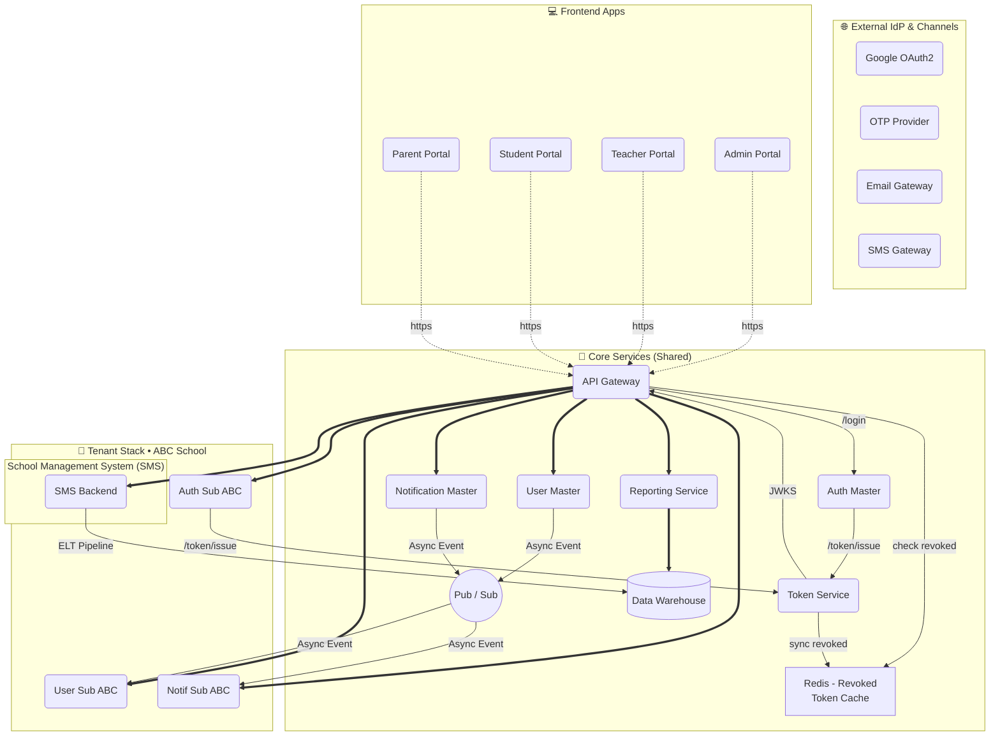
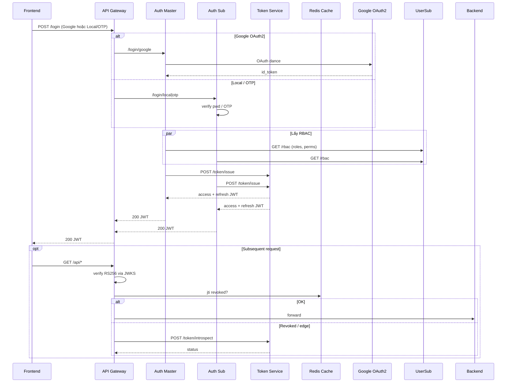
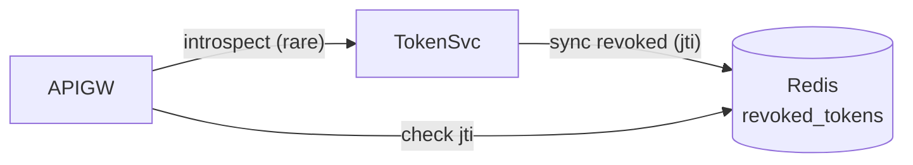
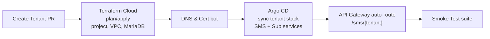
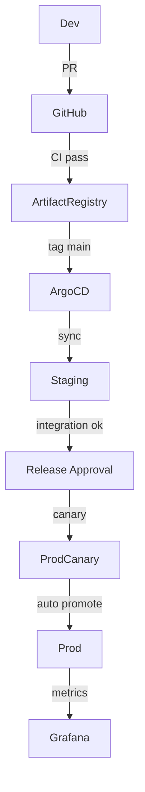
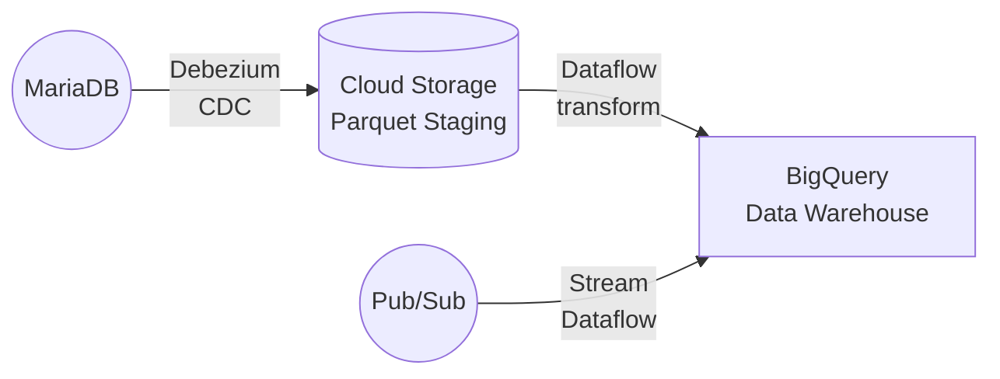

<!-- docs/README.v2.md -->
# DX-VAS Platform – Documentation (v2)

---

## 1. Vision & Scope

### 🎯 Tầm nhìn
Xây dựng **DX-VAS Platform** thành một nền tảng **chuyển đổi số “tất-cả-trong-một”** cho hệ sinh thái Trường Việt Anh, đáp ứng ba mục tiêu cốt lõi:

1. **Kết nối liền mạch** – Hợp nhất quy trình giáo dục, vận hành trường học và tương tác phụ huynh-học sinh trên một nền tảng duy nhất.  
2. **Mở rộng linh hoạt** – Kiến trúc **multi-tenant** cho phép triển khai nhanh nhiều cơ sở/trường, mỗi tenant tự chủ nhưng kế thừa dịch vụ chung.  
3. **Bền vững & bảo mật** – Áp dụng chuẩn 5★ (Service, Data, Interface, OpenAPI, Security) và tuân thủ các ADR để đảm bảo bảo mật, khả năng quan sát, và tiết kiệm chi phí dài hạn.
4. Hệ thống hỗ trợ đa dạng phương thức đăng nhập:
- OAuth2 (Google): Dành cho giáo viên, học sinh, nhân viên – xác thực qua `auth-service/master`.
- Local/OTP: Dành cho phụ huynh và trường không dùng Google Workspace – xử lý qua `auth-service/sub` và reCAPTCHA.

### 📦 Phạm vi tài liệu
Tài liệu này mô tả **toàn bộ kiến trúc và tiêu chuẩn kỹ thuật** của DX-VAS:

| Mảng | Nội dung chính |
|------|----------------|
| **Kiến trúc tổng quan** | Sơ đồ hệ thống, thành phần, luồng dữ liệu |
| **Authentication & Token** | Auth Master/Sub, Token Service, JWT lifecycle |
| **Tenant Stack & SMS** | Mô hình School Management System cho từng tenant |
| **Core/Business Services** | API Gateway, User, Notification, SMS,… |
| **Observability & Security** | Log-tracing, JWKS, key rotation, error codes |
| **CI/CD & Deployment** | Pipeline, auto-scaling, zero-downtime, on-boarding tenant |
| **Data & Reporting** | ELT, event schema governance, báo cáo phân tích |
| **Standards & ADR/CR** | 5★ standards, 30 ADR, các Change Request hiện hành |

### 👥 Đối tượng độc giả
* **Kỹ sư phát triển** (backend/frontend, ML, mobile)  
* **DevOps & SRE** – triển khai, vận hành, giám sát  
* **Kiến trúc sư hệ thống** – thẩm định, mở rộng kiến trúc  
* **Quản lý sản phẩm & ban lãnh đạo** – nắm bức tranh tổng quan và roadmap kỹ thuật

### 🚫 Ngoài phạm vi
* Chiến lược sư phạm, nội dung giảng dạy.  
* Hướng dẫn chi tiết UI/UX cho từng portal (được tài liệu riêng).  
* Báo cáo tài chính và dữ liệu PII cụ thể (chỉ nêu nguyên tắc xử lý).

> **Kết quả mong đợi:** Sau khi đọc xong phần Vision & Scope, độc giả hiểu _“tại sao”_ và _“tài liệu này bao trùm những gì”_ trước khi đi sâu vào chi tiết kỹ thuật.


---

## 2. High-Level Architecture  

## 2.1 Sơ đồ tổng quan (Mermaid) <sup><sub>*Khối màu nhạt = dịch&nbsp;vụ “per tenant”.*</sub></sup>



#### 📝 Chú thích quan trọng

1. **API Gateway** xác thực JWT **offline** qua **JWKS** (RS256); chỉ gọi Token Service khi cần kiểm tra **revoked token** (tra Redis) hoặc các trường hợp đặc biệt.&#x20;
2. **Redis** lưu cache `revoked_tokens` (TTL 15 phút). Token Service đồng bộ cache mỗi khi thu hồi token.
3. **User Sub** & **Notif Sub** là **read-replica**; dữ liệu đồng bộ bất đồng bộ từ các service Master qua **Pub/Sub**.
4. **SMS** là nguồn dữ liệu chính cho báo cáo; dữ liệu được trích xuất vào **Data Warehouse** qua đường **ELT** rồi tiêu thụ bởi **Reporting Service**.&#x20;
5. **Định nghĩa đường nối**

   * `-. https .->`  : Gọi HTTPS từ frontend bên ngoài
   * `-->`  : Gọi API đồng bộ nội bộ
   * `==>`  : Gọi API đồng bộ ưu tiên cao (core routing)
   * `..>`  : Luồng bất đồng bộ (Pub/Sub, ELT)

> Sơ đồ này phản ánh đầy đủ hai Change Request: **Token Service centralization** và **Tenant Stack/SMS simplification**.

---

### 2.2 Component Groups

| Nhóm thành phần | Mô tả ngắn | Ghi chú |
|-----------------|-----------|---------|
| **1. External IdP & Channels** | Google OAuth2, OTP Provider, Email/SMS Gateway. | Nằm ngoài hạ tầng dx-vas; được tích hợp qua HTTPS (OAuth2, REST). |
| **2. Frontend Apps / Portals** | 4 cổng web/mobile: **Admin**, **Teacher**, **Student**, **Parent**. | Gọi API Gateway duy nhất bằng HTTPS. |
| **3. Core Services (Shared)** | API Gateway, Token Service, Auth Master, User Master, Notification Master, Reporting Service. | Chạy **một cụm** cho toàn hệ thống; chịu tải & tách biệt tenant bằng JWT (`tid`). |
| **4. Tenant Stack (per tenant)** | School Management System (**SMS**), Auth Sub, User Sub, Notification Sub. | Mỗi tenant có **một** stack; Sub services là **read-replica** đồng bộ qua Pub/Sub. |
| **5. Infrastructure & Data Plane** | Redis (revoked token cache), Pub/Sub bus, Data Warehouse, Monitoring & Logging stack. | Hỗ trợ bảo mật (JWKS cache, key rotation), observability, ELT báo cáo. |

> **Phân tầng rõ ràng** giúp:  
> • **Isolate** tenant-level logic (stack 4) khỏi vùng shared (stack 3).  
> • **Giảm coupling** – Token Service & Gateway xử lý xác thực tập trung.  
> • **Mở rộng** – thêm tenant = triển khai một SMS + ba Sub services, không ảnh hưởng Core.

---

## 3. Authentication Flow

### 3.1 Các thành phần tham gia
| Actor | Vai trò chính |
|-------|---------------|
| **Frontend / Mobile** | Gửi yêu cầu đăng nhập, lưu JWT, gọi API Gateway. |
| **API Gateway** | Cửa trước duy nhất; xác thực JWT offline bằng JWKS, kiểm tra `revoked_tokens` trong Redis, uỷ quyền RBAC. |
| **Auth Master** | Xác thực Google OAuth2, ánh xạ tenant, gọi Token Service. |
| **Auth Sub (per tenant)** | Xác thực Local/OTP, đồng bộ user với Master, gọi Token Service. |
| **Token Service** | Phát hành / làm mới / thu hồi JWT, đồng bộ cache thu hồi sang Redis, xuất JWKS. |
| **Redis cache** | Cache `revoked_tokens` (TTL 15′) cho Gateway. |

### 3.2 Trình tự đăng nhập & gọi API



*Chú thích sơ đồ*

* **JWKS** là cơ chế xác thực **mặc định**; `introspect` chỉ được gọi khi Gateway cần khẳng định token chưa bị thu hồi hoặc gần hết hạn.
* **Redis** đóng vai trò cache danh sách token bị thu hồi; Token Service đẩy cập nhật ngay khi thu hồi (`POST /token/revoke`).
* Dữ liệu RBAC lấy từ **User Sub** để nhúng vào JWT; giúp Gateway authorize mà không phải gọi lại database.

### 3.3 Vòng đời JWT

| Giai đoạn      | Mô tả                                                                                   | TTL / Lưu trữ            |
| -------------- | --------------------------------------------------------------------------------------- | ------------------------ |
| **Issue**      | Auth Master/Sub gọi `POST /token/issue` → nhận `access` (15 ′) & `refresh` (14 ngày).   | DB (`auth_sessions`)     |
| **Refresh**    | Client gửi `refresh` token tới `POST /token/refresh` → cấp `access` mới, gia hạn phiên. | —                        |
| **Revoke**     | Logout / admin gọi `POST /token/revoke` với `jti` hoặc `sid`.                           | DB + Redis               |
| **Introspect** | Gateway/Service gọi `POST /token/introspect` nếu cần xác minh sâu.                      | Trả `active: true/false` |

### 3.4 Cấu trúc JWT (RS256)

```text
sub   : user_id_global
tid   : tenant_id
roles : ["teacher"]
perms : ["grade.read", "grade.write"]
auth_provider : "google" | "local" | "otp"
jti   : e4c7...  (UUID v4)
sid   : 9ab0...  (session id)
exp   : 1717833000
```

### 3.5 Biện pháp bảo mật bổ sung

* **Rate-limit & CAPTCHA** cho Local/OTP; giới hạn OTP theo IP & user.
* **Key rotation** ≤ 90 ngày; JWKS cache 10 phút tại Gateway/CDN.
* **Error code** tuân thủ `namespace.snake_case` (xem ADR-011).
* **mTLS** cho traffic nội bộ giữa Gateway ↔ Core/Tenant services.

> Phần luồng xác thực này đặt nền tảng cho mọi dịch vụ: JWT cung cấp danh tính & RBAC, còn Gateway bảo vệ biên, giữ latency thấp nhờ xác thực offline.

---

## 4. Token Service & JWT Lifecycle
> **Nguồn thiết kế** – Change Request **03-cr-token-service**:contentReference[oaicite:0]{index=0} & [ADR-006 – Auth Strategy](./ADR/adr-006-auth-strategy.md) :contentReference[oaicite:1]{index=1}  

### 4.1 Vai trò & Ranh giới tin cậy
* **Token Service** là micro-service **duy nhất** phát hành, làm mới (*refresh*), thu hồi (*revoke*) và introspect JWT cho toàn bộ platform.  
* Giữ **private RSA key** (RS256); công khai **JWKS** cho API Gateway xác thực **offline**.  
* Đồng bộ danh sách token bị thu hồi tới **Redis cache** → Gateway truy vấn cục bộ, chỉ gọi `/token/introspect` khi cache miss hoặc token sắp hết hạn.

### 4.2 API Endpoints

| Method | Path | Mô tả | Đối tượng gọi |
|--------|------|-------|---------------|
| `POST` | `/token/issue`        | Phát hành *access* + *refresh* token | **Auth Master / Sub** |
| `POST` | `/token/refresh`      | Làm mới *access* token khi *refresh* hợp lệ | **Client** |
| `POST` | `/token/revoke`       | Thu hồi token theo `jti`/`sid` | **Logout / Admin** |
| `POST` | `/token/introspect`   | Trả `active: true/false` + metadata | **Gateway / Internal** |
| `GET`  | `/.well-known/jwks.json` | JWKS (public keys) | **Gateway / Services / Clients** |

### 4.3 Key Management 🔑  
* Thuật toán **RS256**; giữ **2 key** hoạt động song song (`kid=current|next`).  
* **Luân phiên khóa** tối đa **90 ngày/lần**; triển khai bằng Cloud KMS + GitOps pipeline :contentReference[oaicite:2]{index=2}.  
* **JWKS** có `Cache-Control: public, max-age=600` – Gateway tải lại tự động mỗi 10 phút.

### 4.4 Cấu trúc JWT & TTL

| Claim | Ý nghĩa | Ví dụ |
|-------|---------|-------|
| `sub` | `user_id_global` | `"u-123"` |
| `tid` | `tenant_id`      | `"tenant-abc"` |
| `roles`, `permissions` | RBAC | `["teacher"]`, `["grade.read"]` |
| `auth_provider` | `"google"` / `"local"` / `"otp"` | — |
| `jti` | Token ID (UUID v4) | `"e4c7..."` |
| `sid` | Session ID        | `"9ab0..."` |
| `exp` | Hết hạn ≤ 15′ (access) | `1717833000` |

*Refresh token: TTL 14 ngày, lưu bảng `auth_sessions`.*

### 4.5 Thu hồi token & Redis Cache



* **Redis TTL 15 phút** – đủ nhanh để propagation nhưng không quá tải network.
* Gateway chỉ “rơi về” `/introspect` khi **cache miss** hoặc cần kiểm tra chi tiết phiên (`sid`).

### 4.6 Event Publishing 📡

* Phát sự kiện `token.issued` & `token.revoked` lên **Pub/Sub** → **Audit-Logging** & dashboard “token-per-minute”, “revoked-rate”.
* Sự kiện tuân thủ schema `token.{issued|revoked}.v1` (tham khảo ADR-030 – Event Schema Governance).

### 4.7 Error Codes

* Tất cả response lỗi bao bọc theo `ErrorEnvelope` (ADR-011).
* Quy ước `namespace.snake_case`, ví dụ `token.expired`, `session.not_found` – quản lý trong `docs/standards/error-codes.md`.

### 4.8 KPI & Monitoring

| KPI                           | Mục tiêu       | Alert                |
| ----------------------------- | -------------- | -------------------- |
| **Token issue latency (p95)** | < 100 ms       | > 200 ms 5′ liên tục |
| **Revoked-check hit-ratio**   | > 95 % (Redis) | < 90 % 10′ liên tục  |
| **Key rotation drift**        | ≤ 90 ngày      | 80 ngày → cảnh báo   |

> **Tóm tắt** – Đặt Token Service làm “nhà máy” JWT giúp đảm bảo bảo mật, giảm độ trễ và đơn giản hoá quản lý vòng đời token cho toàn hệ thống.

---

## 5. Tenant Stack & School Management System (SMS)

### 5.1 Khái niệm Tenant Stack
Mỗi **tenant** (trường) có một **stack** dịch vụ biệt lập, triển khai trên **GCP project riêng** theo chiến lược `dx-vas-tenant-<name>` (xem ADR-015, ADR-019) .  
Stack bao gồm:

| Lớp | Thành phần | Ghi chú |
|-----|------------|---------|
| **Frontend** | **Admin / Teacher / Student / Parent Portal** | 4 portal chuẩn hoá, dùng chung mã nguồn; tuỳ biến theme per tenant :contentReference[oaicite:0]{index=0} |
| **Backend** | **School Management System (SMS)** | Ứng dụng Docker tích hợp CRM + SIS + LMS; thay thế hoàn toàn 3 adapter cũ  |
| **Sub Services** | `auth-sub`, `user-sub`, `notif-sub` | *Read-replica* đồng bộ dữ liệu từ các **Master** qua Pub/Sub; chỉ đọc/ghi tối thiểu cho tenant :contentReference[oaicite:1]{index=1} |
| **Data & Cache** | **MariaDB** (SMS DB), Redis (local), Pub/Sub topic-per-tenant | DB bản địa của SMS (MariaDB Galera cluster) + cache phiên bản hoá (`stack_version`, ADR-025) |

### 5.2 Luồng chính
1. **Portal** gọi **API Gateway** kèm header `X-Tenant-ID`.  
2. Gateway định tuyến `/sms/**` tới **SMS** của tenant; chèn thêm header `X-User-ID`, `X-Permissions` để RBAC hoạt động.  
3. **SMS** phục vụ nghiệp vụ trường (điểm danh, học phí, LMS, v.v.).  
4. **User-sub** & **Notif-sub** nhận sự kiện từ **User-master** / **Notif-master** qua Pub/Sub → cập nhật DB cục bộ.  
5. **ELT pipeline** trích xuất dữ liệu SMS → **Data Warehouse**; **Reporting Service** truy vấn DW tạo dashboard đa-tenant .

### 5.3 Lợi ích kiến trúc
* **Đơn giản hoá vận hành** – Loại bỏ ba adapter, giảm số container per tenant ~ 60 %.  
* **On-boarding nhanh** – Thêm tenant = deploy một container SMS + 3 sub services (Terraform module “tenant-stack”).  
* **Trải nghiệm nhất quán** – 4 portal chia sẻ UI/UX và SSO, giảm chi phí hỗ trợ người dùng :contentReference[oaicite:3]{index=3}.  
* **Tách billing & bảo mật** – Project riêng, log/alert dán nhãn `tenant_id` (ADR-022) :contentReference[oaicite:4]{index=4}.

### 5.4 Chuẩn triển khai & versioning
* Docker image SMS gắn thẻ `vX.Y.Z`; thông tin `stack_version` lưu trong secret mỗi tenant (ADR-025).  
* CI/CD hỗ trợ rollout so le; Superadmin Webapp quản lý mapping tenant ↔ version.  
* Pipeline **terraform + github actions** tự động tạo project, DNS, secrets, certs theo template (ADR-015).  

> **TL;DR** – Tenant Stack mới gói gọn nghiệp vụ trường trong **một** SMS, liên kết an toàn vào khung xác thực & quan sát chung, giúp dx-vas “on-board một trường mới trong vài giờ thay vì vài ngày”.

---

## 6. Core & Business Services

> **Mục tiêu** – Liệt kê các dịch vụ chạy **dùng chung** (Core) và **dịch vụ nghiệp vụ** (Business), kèm đường dẫn tài liệu kỹ thuật (ADR / SDD) để tra cứu chi tiết.

### 6.1 Core Services (Shared)

| # | Service | Mục đích chính | ADR / SDD | Ghi chú |
|---|---------|----------------|-----------|---------|
| 1 | **API Gateway** | Cổng vào duy nhất, route & rate-limit, xác thực JWT, gắn RBAC. | ADR-009 – API Governance | Envoy + Lua filter, mTLS nội bộ |
| 2 | **Token Service** | Phát hành / refresh / revoke JWT, JWKS. | ADR-006 – Auth Strategy; CR-03 | RS256, Redis revoked cache |
| 3 | **Auth Master** | Đăng nhập Google OAuth2, ánh xạ tenant. | ADR-006 | Stateless; lưu session bên TokenSvc |
| 4 | **User Master** | Quản lý profile toàn cục, RBAC master. | *SDD-User-Master* (WIP) | Pub/Sub phát sự kiện user.* |
| 5 | **Notification Master** | Orchestrate gửi email/SMS, quản lý template. | ADR-008 – Audit Logging; ADR-028 – Reporting | Fan-out tới Notif-Sub |
| 6 | **Reporting Service** | Truy vấn Data Warehouse, sinh dashboard & export. | ADR-028 – Reporting Architecture | Multi-tenant; BigQuery |
| 7 | **Audit-Logging Service** | Thu thập & ký log truy vết. | ADR-008 | Bắt sự kiện token.*, user.* |
| 8 | **Cost Observability** | Theo dõi chi phí cloud / tenant. | ADR-020 – Cost Observability | Grafana + Cloud Billing API |
| 9 | **External Observability** | Giám sát uptime API bên ngoài. | ADR-021 – External Observability | Synthetic probe, SLA report |
| 10 | **Pub/Sub Bus** | Kênh sự kiện bất đồng bộ. | ADR-030 – Event Schema Gov. | topic=“tenant.*”, schema registry |
| 11 | **Redis Cluster** | Revoked-token cache + transient data. | ADR-022 – SLO & Monitoring | 3-node, cross-zone |

### 6.2 Business Services (per tenant)

| # | Service | Mục đích | ADR / SDD | Ghi chú |
|---|---------|---------|-----------|---------|
| 1 | **School Management System (SMS)** | CRM + SIS + LMS tích hợp. | *SDD-SMS* (WIP) | MariaDB; expose `/sms/**` |
| 2 | **Auth Sub** | Đăng nhập Local/OTP, sync user. | ADR-006 | Bắt buộc nếu dùng Local/OTP |
| 3 | **User Sub** | Read-replica profile + RBAC theo tenant. | *SDD-User-Sub* (WIP) | Đồng bộ qua Pub/Sub |
| 4 | **Notification Sub** | Đẩy thông báo realtime nội bộ tenant. | ADR-008 | Nhận event từ Notif Master |
| 5 | **Local Redis** | Cache session / OTP temp. | (inherit core pattern) | Chỉ trong tenant VPC |

*Các **adapter cũ** `crm-adapter`, `sis-adapter`, `lms-adapter` **đã ngưng** – thay thế hoàn toàn bởi SMS.*

### 6.3 Cross-cutting & Infrastructure

| Thành phần | Vai trò | Liên quan |
|------------|---------|-----------|
| **GitOps / ArgoCD** | Deploy Core + Tenant Stack, môi trường Stage/Prod. | ADR-001 – CI/CD |
| **Terraform Modules** | Provision VPC, CloudSQL (MariaDB), Secrets, DNS. | ADR-015 – Deployment Strategy |
| **Data Warehouse (BigQuery)** | Lưu trữ ELT từ SMS, log phân tách theo `tenant_id`. | ADR-028 |
| **Grafana + Prometheus** | Monitor CPU, latency, SLO dashboard. | ADR-022 |
| **OpenTelemetry Collector** | Trace & log routing → GCP Cloud Logging. | ADR-021 |

### 6.4 Ưu tiên phát triển (Roadmap)

1. **User Service Master – SDD “Legendary++”** (đang viết) → unlock RBAC advance.  
2. **SMS OpenAPI** → chuẩn hoá contract, bật code-gen client cho portal.  
3. **Audit-Logging v2** → blockchain timestamp & zero-trust export.  
4. **Cost Observability automation** → chargeback dòng tiền per tenant.  
5. **External Observability SLA dashboard** → public status.truongvietanh.edu.vn.

> **Ghi nhớ:** Mọi dịch vụ mới **phải** tuân thủ bộ **5★ standards** và được ghi lại dưới dạng **ADR + SDD** trước khi triển khai.

---

## 7. Observability & Security

> **Mục tiêu** – Đảm bảo **tính minh bạch (observability)** cho vận hành và **tính an toàn (security)** cho dữ liệu/nguồn lực của toàn hệ thống DX-VAS. Các nguyên tắc bên dưới lấy căn cứ từ:  
> • `ADR-004 – Security` · `ADR-022 – SLO & Monitoring` · `ADR-020 – Cost Observability` · `ADR-021 – External Observability` · `ADR-011 – API Error Format` · `ADR-003 – Secrets`  

### 7.1 Observability 🔍

| Khía cạnh | Thực hiện | Công cụ / ADR | Cảnh báo & Dashboard |
|-----------|-----------|---------------|----------------------|
| **Logging** | Toàn bộ service log theo chuẩn JSON (`trace_id`, `tenant_id`, `level`, `error.code`). | ADR-011 | Cloud Logging + Log-based Metrics; alert `error.rate > 5 %`/5′ |
| **Metrics** | Prometheus scrape Gateway, Core & Tenant; export qua OTLP. | ADR-022 | Grafana dashboard CPU, latency, p95 |
| **Tracing** | OpenTelemetry inject vào Gateway → trace xuyên suốt tenant. | ADR-022 | Jaeger UI; cảnh báo span > 3 s |
| **SLO / SLA** | Each core API khai báo target (e.g., `availability 99.9 %`). | ADR-022 | Alert khi `error_budget` còn < 5 % |
| **Cost** | Collect GCP Billing + resource tag `tenant_id`. | ADR-020 | “Cost per tenant” / ngày, cảnh báo tăng > 20 % |
| **External Uptime** | Synthetic probe HTTPS 1′/tenant. | ADR-021 | Public status page; SMS alert downtime > 1′ |

#### 7.1.1 Revoked-Token Hit Ratio
* **Metric**: `revoked_token_cache_hit_ratio` (Gateway).  
* **Mục tiêu**: > 95 %. Alert nếu < 90 % liên tục 10 phút → điều tra Redis / sync Token Service.

### 7.2 Security 🛡️

| Thành phần | Biện pháp | ADR / Tài liệu |
|------------|-----------|----------------|
| **JWT** | RS256, `kid` double keys, rotation ≤ 90 ngày; JWKS cache 10′. | ADR-006 |
| **API Gateway** | mTLS nội bộ, WAF rule OWASP top-10, strict CORS. | ADR-004 |
| **Secrets** | GCP Secret Manager, versioning & rotation CI. | ADR-003 |
| **RBAC** | Claims `roles`, `permissions` trong JWT; Gateway Enforcer plugin. | ADR-007 |
| **Data-at-Rest** | Cloud KMS key-encrypted (MariaDB, Redis, BigQuery). | ADR-004 |
| **Network** | VPC-SC, egress whitelisting, Cloud Armor rate-limit. | ADR-004 |
| **Audit Log** | Token, user, admin action → Audit-Logging Service (immutable). | ADR-008 |
| **Error Handling** | `ErrorEnvelope` + `namespace.snake_case`; không lộ PII. | ADR-011 |

#### 7.2.1 Key Rotation & JWKS
* **Rotation job**: Cloud Build pipeline tạo key mới, gắn `kid=next`, deploy Token Service → sau 24 h xoá key cũ.  
* **Fallback**: Nếu JWKS fetch lỗi > 3 lần, Gateway cứng chặn traffic (fail-closed).

#### 7.2.2 Pen-test & Compliance
* **Quarterly** penetration test + SAST/DAST; kết quả lưu **requests/04-cr-tenant-system.md** phụ lục bảo mật.  
* Tuân thủ **GDPR** cho dữ liệu học sinh & phụ huynh; dữ liệu PII được ẩn danh theo `ADR-024`.

### 7.3 Alert Routing & Escalation
| Severity | Trigger ví dụ | Thời gian phản hồi | Kênh |
|----------|---------------|--------------------|------|
| **P1** | API Gateway 5xx surge > 10 % 2′ | 5′ | PagerDuty → Phone |
| **P2** | SLO breach dự báo 4 h | 30′ | Slack #sre-alerts |
| **P3** | Cost ↑ 20 % ngày | 8 h | Email FinOps |
| **P4** | Log anomaly non-critical | 24 h | Jira ticket |

> **Nguyên tắc vàng**: “Bạn không thể bảo vệ điều bạn không quan sát được.” – Observability & Security phải song hành để DX-VAS vận hành tin cậy, tuân thủ, và tối ưu chi phí.

---

## 8. CI/CD & Deployment

> Cơ chế **CI/CD** của DX-VAS áp dụng triệt để triết lý **“Everything-as-Code”** và **GitOps**, bảo đảm triển khai **Zero-Downtime** theo `ADR-014`, ủy quyền phát hành rõ ràng theo `ADR-018`, và hạ tầng bất biến theo `ADR-002` & `ADR-015`.

### 8.1 Nhánh mã & Chính sách PR
| Nhánh | Mục đích | Bảo vệ |
|-------|----------|--------|
| `main` | Mã đã QA, sẵn sàng production | PR bắt buộc 2 reviewer + pass check |
| `develop` | Hội tụ feature; deploy **Staging** tự động | PR 1 reviewer |
| `feature/*` | Tính năng / bugfix | Run CI unit-test |

### 8.2 Pipeline CI (GitHub Actions)
1. **Checkout + Cache**  
   `actions/checkout@v4` → thiết lập cache pnpm / poetry.
2. **Static Analysis & SCA**  
   - **SAST** (SonarQube) – fail nếu *critical*.  
   - **Dependency CVE** (Dependabot).  
3. **Unit & Contract Test**  
   - Python/PyTest + Coverage ≥ 85 %.  
   - **Contract-Testing** theo `ADR-010` (PactFlow).  
4. **Build & SBOM**  
   - Docker multi-arch (`linux/amd64, arm64`).  
   - Tạo **SBOM CycloneDX**; push Artifact Registry.  
5. **Image Scan** (GCP Container Analysis) – block CVE “High”.
6. **Publish**  
   - Tag `main` ⇒ `vX.Y.Z` (semantic-release).  
   - Upload Helm chart → **Helm Repo**.

### 8.3 Pipeline CD (Argo CD + Terraform Cloud)
| Pha | Công cụ | Điều kiện / Phê duyệt |
|-----|---------|-----------------------|
| **Infra-Provision** | Terraform Cloud | PR trên *infra repo* → auto-plan, **Manual Approve** |
| **Staging Deploy** | Argo CD (sync-wave 0) | Auto nếu container tag `v*` push lên `develop` |
| **Integration Test** | GitHub Action + Postman | Pass 95 % → ghi chú vào PR |
| **Release Approval** | Argo CD wave “prod-canary” | Yêu cầu **Product Owner + SRE** (theo `ADR-018`) |
| **Canary 10 %** | Argo Rollouts | 15 min metric check (latency / error rate) |
| **Full Ramp-Up** | Argo Rollouts | Auto nếu canary stable |
| **Rollback** | Argo Rollouts `rollback` | < 2 min; traffic switch 100 → previous |

### 8.4 Zero-Downtime & Chiến lược Triển khai
* **Canary Rollout** (default) – 10 → 25 → 50 → 100 %.  
* **Blue-Green** – dùng cho migration DB lớn (flag `strategy=bluegreen`).  
* **Schema Migration** – **GitOps-DB** chạy `flyway` job → version-controlled (ADR-023).  
* **Auto-Scaling** – HPA theo p95 latency & CPU (ADR-016).  
* **Env Deploy Boundary** – Staging và Prod tách VPC, project (GCP) (ADR-017).

### 8.5 Tenant On-Boarding Pipeline


* **Thời gian**: \~ 25 phút/tenant (99-percentile).
* **Output**: Slack thông báo “Tenant *abc* ready 🎉”.

### 8.6 Quản lý Cấu hình & Secrets

* **ADR-005** – cấu hình qua **ConfigMap/Secret** phân tách `env` và `tenant`.
* **ADR-003** – Secrets (RSA key, OTP provider) lưu **GCP Secret Manager** với rotation cron.

### 8.7 Kiểm soát Chi phí & Carbon

* **FinOps Job** chạy mỗi đêm: truy vấn Cloud Billing API → BigQuery → Grafana “Cost/Tenant/Service”.
* Cảnh báo Slack khi chi phí chệch > 20 % so với trung bình 7 ngày.

### 8.8 Sơ đồ luồng CI/CD tổng quan



> **Nguồn tham chiếu:**
> • `ADR-001 – CI/CD` · `ADR-014 – Zero-Downtime` · `ADR-015 – Deployment Strategy` · `ADR-018 – Release Approval Policy`
> • Terraform module `tenant-stack` · Helm chart `dx-vas-core`.

---

## 9. Data & Reporting

> Phần này trình bày cách **DX-VAS** thu thập, lưu trữ, quản trị và khai thác dữ liệu — từ **SMS** của từng tenant, qua **ELT pipeline**, vào **Data Warehouse**, và cuối cùng hiển thị báo cáo. Các quyết định thiết kế dựa trên:  
> • `ADR-023 Schema Migration` :contentReference[oaicite:0]{index=0} · `ADR-024 Data Anonymization & Retention` :contentReference[oaicite:1]{index=1} · `ADR-026 Hard Delete Policy` :contentReference[oaicite:2]{index=2} · `ADR-027 Data Management Strategy` :contentReference[oaicite:3]{index=3} · `ADR-028 Reporting Architecture` :contentReference[oaicite:4]{index=4} · `ADR-029 Report Template Schema` :contentReference[oaicite:5]{index=5} · `ADR-030 Event Schema Governance` :contentReference[oaicite:6]{index=6}

### 9.1 Nguồn dữ liệu gốc (Source-of-Truth)
| Nguồn | Công nghệ | Phân vùng |
|-------|-----------|-----------|
| **SMS DB (per tenant)** | **MariaDB** Galera cluster | 1 schema/tenant |
| **Event Bus** | Pub/Sub topic `tenant.*` | Schema version =`v1` |
| **Audit Log** | Cloud Logging → BigQuery | Bảng `audit_log_*` (partition date) |

### 9.2 ELT Pipeline (near-real-time)


* **Extract**: Debezium CDC dump **insert/update/delete** mỗi tenant vào Cloud Storage (Parquet).
* **Load**: Scheduled Dataflow job nạp incremental vào **BigQuery** staging.
* **Transform**: dbt chạy nightly tạo **Data Mart** (`fct_enrolment`, `dim_student`, v.v.).
* **Latency mục tiêu**: < 5 phút cho sự kiện, < 30 phút cho batch.

### 9.3 Thiết kế Data Warehouse

| Layer       | Chi tiết                               | Partition / Cluster                 |
| ----------- | -------------------------------------- | ----------------------------------- |
| **Raw**     | 1 bảng thô / table\_source / tenant    | `tenant_id`, `_PARTITIONDATE`       |
| **Staging** | Chuẩn hoá kiểu dữ liệu, thêm `load_ts` | như Raw                             |
| **Mart**    | Fact / Dim theo Kimball (star schema)  | cluster `tenant_id` & business\_key |
| **Sandbox** | Export dataset cho ML / BI             | ACL theo RBAC (teacher, admin)      |

> **Retention**: Raw = 30 ngày (xem `ADR-024`); Mart giữ 5 năm, bản ghi PII được ẩn danh (hash + salt).

### 9.4 Báo cáo & BI

* **Reporting Service** đọc Mart, sinh **dashboard multi-tenant** (Grafana, Superset).
* Mỗi báo cáo tuân thủ **template JSON Schema** v1.0 (định nghĩa tại `ADR-029`).
* **Public API** `/reports/:id/export` trả về CSV / Parquet; Gateway gắn header `X-Tenant-ID`.

### 9.5 Data Governance & Compliance

| Chính sách            | Nội dung then chốt                                                                | ADR |
| --------------------- | --------------------------------------------------------------------------------- | --- |
| **Schema Versioning** | Mọi event/bảng có `schema_version` theo `adr-030`; backward-compatible ≥ 6 tháng. | 030 |
| **Migration**         | Flyway `V__` script, PR review bắt buộc (`adr-023`).                              | 023 |
| **Anonymization**     | Hash + salt cho PII; dạy dữ liệu demo qua `synthetic_*` view.                     | 024 |
| **Hard Delete**       | TTL API `/delete` → soft flag, job purge sau 30 ngày.                             | 026 |
| **Data Lifecycle**    | Tier S3→Nearline→Coldline ≥ 3 năm; policy BQ partition expire.                    | 027 |

### 9.6 Quan sát & SLA dữ liệu

| Metric                     | Mục tiêu               | Alert                         |
| -------------------------- | ---------------------- | ----------------------------- |
| **ELT lag (p95)**          | < 10 phút              | > 20 phút 15′                 |
| **Data Quality test pass** | = 100 %                | bất kỳ lỗi Great Expectations |
| **Warehouse cost/tenant**  | +≤ 15 % so với 30 ngày | Slack FinOps daily            |

### 9.7 Tích hợp Event Schema Governance

* Mọi sự kiện `*.*.v1` phải đăng ký schema Avro trong **Schema Registry** (`ADR-030`).
* Pipeline Dataflow validate schema ID trước khi nạp vào BigQuery; sai lệch → gửi `error.code=data.schema_mismatch`.

> Nền tảng dữ liệu DX-VAS được dựng để **dễ mở rộng**, **tuân thủ** (GDPR) và **tối ưu chi phí** — bảo đảm mỗi tenant truy cập báo cáo kịp thời mà không ảnh hưởng dữ liệu tenant khác.

---

## 10. ADR & CR Index

### 10.1 Architecture Decision Records (ADR)

| ID  | Tên / Chủ đề | Đường dẫn |
|----|--------------|-----------|
| 001 | CI/CD & GitOps Pipeline | [adr-001-ci-cd.md](./ADR/adr-001-ci-cd.md) |
| 002 | Infrastructure-as-Code (Terraform) | [adr-002-iac.md](./ADR/adr-002-iac.md) |
| 003 | Secrets Management & Key Rotation | [adr-003-secrets.md](./ADR/adr-003-secrets.md) |
| 004 | Security Principles & Trust Boundary | [adr-004-security.md](./ADR/adr-004-security.md) |
| 005 | Environment Configuration Strategy | [adr-005-env-config.md](./ADR/adr-005-env-config.md) |
| 006 | Auth Strategy & Token Service | [adr-006-auth-strategy.md](./ADR/adr-006-auth-strategy.md) |
| 007 | Role-Based Access Control (RBAC) | [adr-007-rbac.md](./ADR/adr-007-rbac.md) |
| 008 | Audit Logging | [adr-008-audit-logging.md](./ADR/adr-008-audit-logging.md) |
| 009 | API Governance & Style | [adr-009-api-governance.md](./ADR/adr-009-api-governance.md) |
| 010 | Contract Testing | [adr-010-contract-testing.md](./ADR/adr-010-contract-testing.md) |
| 011 | API Error Format (ErrorEnvelope) | [adr-011-api-error-format.md](./ADR/adr-011-api-error-format.md) |
| 012 | Standard Response Structure | [adr-012-response-structure.md](./ADR/adr-012-response-structure.md) |
| 013 | Path Naming Convention | [adr-013-path-naming-convention.md](./ADR/adr-013-path-naming-convention.md) |
| 014 | Zero-Downtime Deployment | [adr-014-zero-downtime.md](./ADR/adr-014-zero-downtime.md) |
| 015 | Deployment Strategy & Boundary | [adr-015-deployment-strategy.md](./ADR/adr-015-deployment-strategy.md) |
| 016 | Auto-Scaling Policy | [adr-016-auto-scaling.md](./ADR/adr-016-auto-scaling.md) |
| 017 | Environment Deploy Boundary | [adr-017-env-deploy-boundary.md](./ADR/adr-017-env-deploy-boundary.md) |
| 018 | Release Approval Policy | [adr-018-release-approval-policy.md](./ADR/adr-018-release-approval-policy.md) |
| 019 | Project Layout Standard | [adr-019-project-layout.md](./ADR/adr-019-project-layout.md) |
| 020 | Cost Observability | [adr-020-cost-observability.md](./ADR/adr-020-cost-observability.md) |
| 021 | External Observability & SLA | [adr-021-external-observability.md](./ADR/adr-021-external-observability.md) |
| 022 | SLA / SLO Monitoring | [adr-022-sla-slo-monitoring.md](./ADR/adr-022-sla-slo-monitoring.md) |
| 023 | Schema Migration Strategy | [adr-023-schema-migration-strategy.md](./ADR/adr-023-schema-migration-strategy.md) |
| 024 | Data Anonymization & Retention | [adr-024-data-anonymization-retention.md](./ADR/adr-024-data-anonymization-retention.md) |
| 025 | Multi-Tenant Versioning | [adr-025-multi-tenant-versioning.md](./ADR/adr-025-multi-tenant-versioning.md) |
| 026 | Hard-Delete Policy | [adr-026-hard-delete-policy.md](./ADR/adr-026-hard-delete-policy.md) |
| 027 | Data Management Strategy | [adr-027-data-management-strategy.md](./ADR/adr-027-data-management-strategy.md) |
| 028 | Reporting Architecture | [adr-028-reporting-architecture.md](./ADR/adr-028-reporting-architecture.md) |
| 029 | Report Template Schema | [adr-029-report-template-schema.md](./ADR/adr-029-report-template-schema.md) |
| 030 | Event Schema Governance | [adr-030-event-schema-governance.md](./ADR/adr-030-event-schema-governance.md) |

---

### 10.2 Change Requests (CR)

| Mã CR | Mô tả ngắn | Đường dẫn |
|-------|------------|-----------|
| 03-CR | Giới thiệu **Token Service**, chuẩn hóa JWT lifecycle | [03-cr-token-service.md](./requests/03-cr-token-service.md) |
| 04-CR | **Tenant Stack** simplification & School Management System | [04-cr-tenant-system.md](./requests/04-cr-tenant-system.md) |

> **Ghi chú:**  
> * **ADR** = quyết định kiến trúc lâu dài; **CR** = thay đổi lớn được phê duyệt sau giai đoạn thiết kế chi tiết.  
> * Mọi PR mới thay đổi kiến trúc **phải** kèm ADR / CR tương ứng trước khi merge vào `main`.

---

## 11. Standards & Conventions

> **Mục đích** – Bảo đảm **mọi thành phần** của DX-VAS tuân thủ một bộ quy ước thống nhất về thiết kế dịch vụ, dữ liệu, API, mã lỗi, versioning và style code, giúp **giảm sai sót**, **dễ bảo trì** và **đồng nhất trải nghiệm**.

### 11.1 Bộ tiêu chuẩn “5★” (5-Star Standards)

| ⭐ | Tài liệu | Phạm vi | Bắt buộc |
|----|---------|---------|----------|
| ⭐1 | [5s.service.design.standard.md](./standards/5s.service.design.standard.md) | Chiến lược service, boundary, SLA, deploy | ✔ |
| ⭐2 | [5s.data.model.standard.md](./standards/5s.data.model.standard.md) | Quy tắc đặt tên bảng/field, khoá ngoại, index | ✔ |
| ⭐3 | [5s.interface.contract.doc.standard.md](./standards/5s.interface.contract.doc.standard.md) | Cách viết tài liệu Interface Contract (IC) | ✔ |
| ⭐4 | [5s.openapi.standard.md](./standards/5s.openapi.standard.md) | Quy định OpenAPI (tags, schemas, examples) | ✔ |
| ⭐5 | **Security Appendix** (trong ⭐1) | OWASP, mTLS, key rotation | ✔ |

> **Check-list CI**: PR nào chứa file IC/OpenAPI sẽ chạy **linter 5★** – fail nếu vi phạm.

### 11.2 Error Codes & Envelope

| Quy chuẩn | Đường dẫn | Ghi chú |
|-----------|-----------|---------|
| **ErrorEnvelope** | ADR-011 | Field `error`, `meta` bắt buộc |
| **Danh mục mã lỗi** | [error-codes.md](./standards/error-codes.md) | Đặt tên `namespace.snake_case` (vd: `token.expired`) |
| **Thêm mã lỗi mới** | Update PR vào file trên + reviewer “Tech Lead API” | Không trùng namespace |

### 11.3 Naming & Versioning

| Thực thể | Quy tắc chính | ADR / Standard |
|----------|---------------|----------------|
| **API Path** | `/resource/{id}`, verb = HTTP; **không** “/getFoo” | ADR-013 |
| **Event** | `domain.action.v{major}` – vd: `token.issued.v1` | ADR-030 |
| **Docker Image** | `service:MAJOR.MINOR.PATCH` (SemVer) | ADR-015 |
| **Tenant Stack** | `dx-vas-tenant-<slug>` (lower-kebab) | ADR-019 |
| **Branch Git** | `feature/<ticket>`, `fix/<ticket>` | ADR-001 |
| **DB Migration** | `V<yyyyMMddHHmm>__<desc>.sql` (Flyway) | ADR-023 |

### 11.4 Style Guide (Code & Docs)

| Ngôn ngữ | Linter / Formatter | Rule nổi bật |
|----------|-------------------|--------------|
| **Python** | ruff + black | max-line 120, type-hint bắt buộc |
| **TypeScript** | eslint + prettier | strictNullChecks, import alias `@/` |
| **Terraform** | `terraform fmt` + tflint | module version lock |
| **SQL (MariaDB)** | sqlfluff (`ansi`) | snake_case table/column |
| **Markdown** | markdownlint | ATX heading, table alignment |
| **Mermaid** | kroki validate | phải kèm chú thích key đường nối |

> **Docs-as-Code**: Mọi tài liệu (ADR, SDD, IC) lưu trong Git, PR review = code.

### 11.5 Kiểm tra tuân thủ (CI Checks)

1. **5★ Linter** – validate OpenAPI & IC.  
2. **Schema Registry** – event Avro ID phải khớp ADR-030.  
3. **SBOM & CVE Scan** – block CVE High/critical.  
4. **Error code validator** – compare `error.code` xuất hiện trong OpenAPI với danh sách chuẩn.  

### 11.6 Ngoại lệ & Quy trình phê duyệt

* Ngoại lệ **hiếm** (P0 deadline, legacy) ⇒ tạo **RFC** kèm justification, gắn label `standards-waiver`, review bởi **Architecture Board**.  
* Sau 60 ngày, **waiver** hết hạn; service phải retrofit về đúng chuẩn.

> **Nhắc lại** – “Consistency is speed.” Tuân thủ bộ chuẩn trên giúp đội ngũ DX-VAS **ship nhanh hơn** mà không đánh đổi chất lượng hoặc an toàn.

---

## 12. Appendix

### 12.1 Thuật ngữ (Glossary)

| Thuật ngữ | Định nghĩa ngắn |
|-----------|-----------------|
| **Tenant** | Một cơ sở/trường sử dụng DX-VAS; tách biệt bằng `tenant_id`. |
| **Tenant Stack** | Nhóm dịch vụ cục bộ của tenant: SMS + Auth/User/Notif Sub + DB/Cache. |
| **SMS (School Management System)** | Backend tích hợp CRM + SIS + LMS cho từng tenant. |
| **JWT (JSON Web Token)** | Chuỗi ký RS256 mang claim `sub`, `tid`, `roles`, v.v. |
| **JWKS** | Tập public key (JSON) để Gateway xác thực chữ ký JWT. |
| **Token Service** | Micro-service phát hành, làm mới, thu hồi JWT. |
| **RBAC** | Role-Based Access Control – uỷ quyền dựa trên `roles` / `permissions`. |
| **ADR** | Architecture Decision Record – quyết định kiến trúc dài hạn. |
| **CR** | Change Request – thay đổi lớn sau giai đoạn phân tích. |
| **ELT** | Extract-Load-Transform pipeline trích xuất dữ liệu vào DW. |
| **DW (Data Warehouse)** | BigQuery chứa dữ liệu phân tích nhiều tenant. |
| **Pub/Sub** | Hàng đợi sự kiện bất đồng bộ của Google Cloud. |
| **SLO / SLA** | Service Level Objective / Agreement – cam kết chất lượng dịch vụ. |
| **ErrorEnvelope** | Cấu trúc JSON chuẩn để trả lỗi (`error`, `meta`). |

### 12.2 Danh bạ (Contacts)

| Vai trò | Tên / Nhóm | Liên hệ |
|---------|------------|---------|
| **Chief Architect** | John Ng. | `john.ng@dx-vas.io` |
| **SRE Lead** | Linh P. | `sre@dx-vas.io` |
| **Product Owner** | Ms. Thu H. | `po@dx-vas.io` |
| **Architecture Board** | `#arch-board` Slack channel | Họp thứ 5 hàng tuần |
| **Incident Hotline** | PagerDuty (P1) | `+84 28 7100 xxxx` |

*(Địa chỉ email/điện thoại chỉ là ví dụ; cập nhật khi áp dụng thực tế.)*

### 12.3 Changelog (Tóm tắt)

| Phiên bản | Ngày | Thay đổi chính |
|-----------|------|----------------|
| **v2-draft** | 2025-06-09 | *Tạo skeleton README.v2.md* – cấu trúc 12 mục. |
| **v2-beta** | 2025-06-10 | Tích hợp **Token Service CR-03** & **Tenant Stack CR-04**.<br>Viết lại Vision, Architecture, Auth Flow, Token, SMS. |
| **v2-rc1** | 2025-06-11 | Hoàn tất Observability, CI/CD, Data, Standards, Glossary. |

> **Lưu ý:** Changelog chỉ ghi **thay đổi ở cấp kiến trúc/tài liệu**. Thay đổi code chi tiết xem Git commit history.

### 12.4 Tài liệu bổ sung

| Chủ đề | Liên kết |
|--------|---------|
| **Diagrams (SVG/PNG)** | `docs/diagrams/` |
| **Service Design Docs (SDD)** | `docs/services/index.md` |
| **API Reference (OpenAPI)** | `docs/openapi/` *(auto-generated)* |
| **Runbooks & Playbooks** | `ops/runbook/` |
| **Governance RFCs** | `docs/rfc/` |

---

> *DX-VAS Platform Documentation v2.*  
> Phát hành theo giấy phép nội bộ; không sao chép khi chưa có sự đồng ý bằng văn bản.

---
