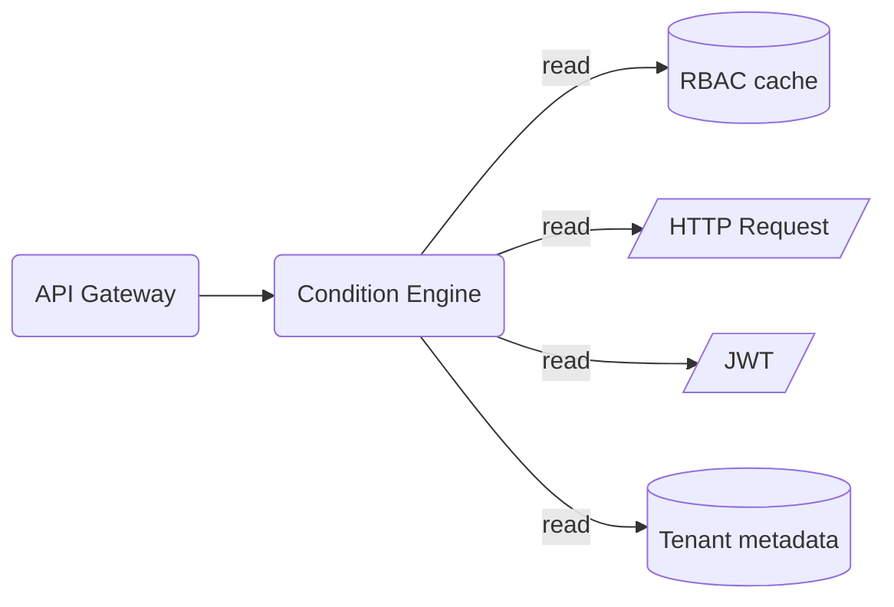
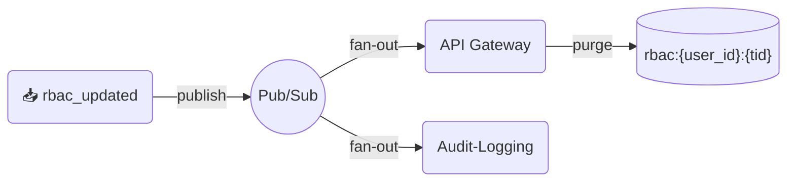
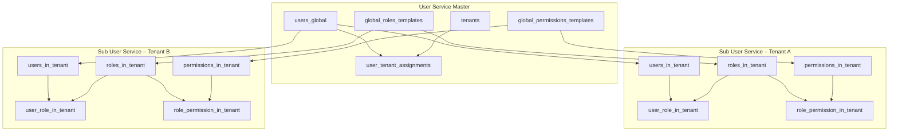
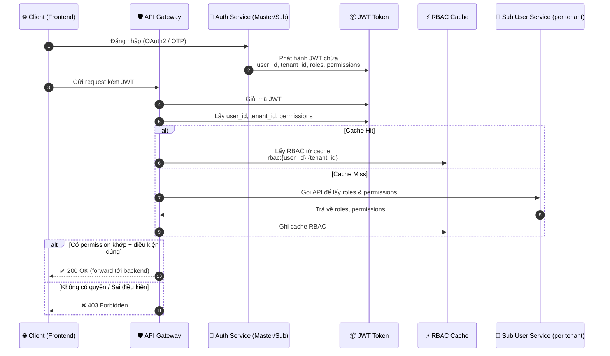
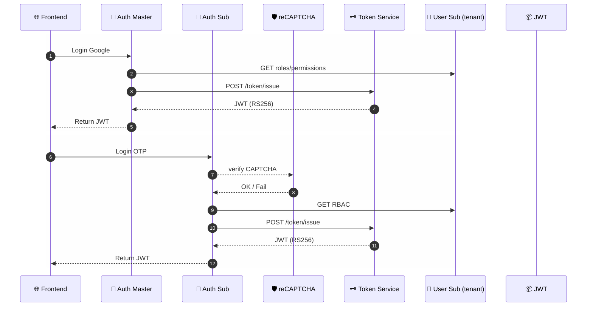

# Phân tích Chuyên sâu: Kiến trúc Phân quyền Động (RBAC) trong Hệ thống dx-vas

## 📚 Mục lục Chi tiết – Phân tích Kiến trúc Phân quyền Động (RBAC)

| STT | Tên mục | Mô tả | Liên kết |
|-----|---------|-------|----------|
| 1️⃣ | **Tổng quan & Định nghĩa RBAC** | Khái niệm role, permission, condition, áp dụng trong kiến trúc đa tenant | [Xem mục](#1-tổng-quan--định-nghĩa-rbac) |
| 2️⃣ | **Phân tầng Quản lý Định danh & Phân quyền** | Vai trò của User Service Master và Sub User Service | [Xem mục](#2-phân-tầng-quản-lý-định-danh--phân-quyền) |
| 3️⃣ | **Luồng Xác thực & Phân quyền (Multi-Tenant)** | Cách JWT được phát hành và RBAC được đánh giá tại Gateway | [Xem mục](#3-luồng-xác-thực--phân-quyền-multi-tenant) |
| 4️⃣ | **Mô hình Dữ liệu RBAC (Master vs Sub)** | Chi tiết các bảng schema tại Master và Sub Service | [Xem mục](#4-mô-hình-dữ-liệu-rbac-master-vs-sub) |
| 5️⃣ | **Permission có điều kiện (Condition JSONB)** | Mô hình `condition` động dựa trên context người dùng & request | [Xem mục](#5-permission-có-điều-kiện-condition-jsonb) |
| 6️⃣ | **Chiến lược Cache RBAC tại API Gateway** | Cách Redis cache giúp tăng hiệu năng và logic invalidation | [Xem mục](#6-chiến-lược-cache-rbac-tại-api-gateway) |
| 7️⃣ | **Chiến lược Đồng bộ RBAC** | Từ template Master đến Sub User Service (kế thừa hoặc clone) | [Xem mục](#7-chiến-lược-đồng-bộ-rbac) |
| 8️⃣ | **Hiệu năng & Khả năng mở rộng** | Kỹ thuật tối ưu cache, pub/sub, autoscale theo tenant | [Xem mục](#8-hiệu-năng--khả-năng-mở-rộng) |
| 9️⃣ | **Bảo mật chuyên sâu trong RBAC** | Isolation theo tenant, JWT trust, định danh vai trò | [Xem mục](#9-bảo-mật-chuyên-sâu-trong-rbac) |
| 🔟 | **Giám sát & Gỡ lỗi** | Audit logs, debug header, metric hệ thống RBAC | [Xem mục](#10-giám-sát--gỡ-lỗi) |
| 1️⃣1️⃣ | **Best Practices cho Quản trị RBAC** | Các khuyến nghị tên role, số lượng role/user, phân quyền tối ưu | [Xem mục](#11-best-practices-cho-quản-trị-rbac) |
| 1️⃣2️⃣ | **Công cụ & Tài liệu liên quan** | Liên kết tới ADR, data-model, sơ đồ, spec JSONB, OpenAPI | [Xem mục](#12-công-cụ--tài-liệu-liên-quan) |

## 1. Tổng quan & Định nghĩa RBAC

RBAC (Role-Based Access Control) trong hệ thống dx-vas cho phép kiểm soát quyền truy cập một cách linh hoạt và có thể mở rộng, dựa trên:

- **Vai trò người dùng** (Role) trong từng trường thành viên (tenant)
- **Tập hợp quyền** (Permission) được gán cho mỗi role
- **Điều kiện thực thi** (Condition, nếu có) áp dụng ở cấp permission

Mô hình RBAC này hoạt động trong bối cảnh **multi-tenant**, nơi mỗi tenant (trường thành viên) có **RBAC độc lập**, nhưng vẫn kế thừa một phần từ **template toàn hệ thống** do User Service Master cung cấp.

---

## 2. Phân tầng Quản lý Định danh & Phân quyền

### 🧠 User Service Master
- Là nguồn chân lý duy nhất cho toàn bộ người dùng (`users_global`)
- Quản lý:
  - Danh sách tenant (`tenants`)
  - Mối quan hệ user ↔ tenant (`user_tenant_assignments`)
  - Các template vai trò và quyền toàn hệ thống:
    - `global_roles_templates`
    - `global_permissions_templates`
- Không trực tiếp đánh giá RBAC, mà cung cấp định danh và template cho Sub Services

### 🧩 Sub User Service (per Tenant)
- Mỗi tenant có 1 instance riêng, quản lý:
  - Người dùng thuộc tenant (`users_in_tenant`) – ánh xạ đến `user_id_global`
  - Trạng thái hoạt động nội bộ: `is_active_in_tenant`
  - Vai trò (`roles_in_tenant`), quyền (`permissions_in_tenant`)
  - Mapping:
    - `user_role_in_tenant`
    - `role_permission_in_tenant`
- Cho phép kế thừa từ template Master hoặc tự định nghĩa

---

## 3. Luồng Xác thực & Phân quyền (Multi-Tenant)

### 🔐 Luồng phát hành JWT
1. Người dùng đăng nhập qua:
   - Google OAuth2 → Auth Master
   - OTP/Local → Sub Auth Service
2. Sau khi xác thực:
   - `tenant_id` được chọn (nếu người dùng thuộc nhiều tenant).
   - Auth Service gọi **User Service Master** → kiểm tra `user_id_global` & quyền truy cập tenant.
   - Gọi **Sub User Service** → lấy `roles`, `permissions`.
   - **Gọi Token Service** `POST /token/issue` → nhận JWT ký **RS256**.
3. JWT được phát hành với:
   - `user_id`, `tenant_id`, `roles`, `permissions`, `auth_provider`,
   - **`jti`, `sid`, `exp`** (phục vụ thu hồi token & quản lý phiên).

### 🛡️ API Gateway đánh giá RBAC
- Xác thực chữ ký JWT **offline** qua **JWKS** cache 10′.
- Kiểm tra `tenant_id`, `exp` và trạng thái người dùng (`is_active`, `is_active_in_tenant`).
- Tra **Redis**: `revoked:{jti}` → nếu *hit* ⇒ trả `403` (`token.revoked`), huỷ cache RBAC.
- Truy vấn Redis cache RBAC: `rbac:{user_id}:{tenant_id}` → nếu *miss* gọi Sub User Service để nạp lại.
- Đánh giá `condition` nếu permission có ràng buộc động.

---

## 4. Mô hình Dữ liệu RBAC (Master vs Sub)

> **Nguyên tắc chung**  
> * **User Service Master** (Core — PostgreSQL) lưu danh tính _toàn cục_ & template RBAC chuẩn.  
> * **Sub User Service** (per-tenant — MariaDB) chỉ lưu RBAC _cục bộ_, đồng bộ bất đồng bộ qua Pub/Sub.  
> * Mọi bảng phải có khoá chính rõ ràng, theo chuẩn ⭐2 Data Model Standard.

---

### 📦 Tại User Service Master (PostgreSQL)

```sql
-- +flyway
-- 4.1  Người dùng toàn hệ thống
CREATE TABLE users_global (
  user_id           UUID PRIMARY KEY,
  full_name         TEXT NOT NULL,
  email             TEXT NOT NULL,
  phone             TEXT,
  auth_provider     TEXT NOT NULL CHECK (auth_provider IN ('google', 'local')),
  local_auth_tenant_id UUID,
  is_active         BOOLEAN DEFAULT TRUE,
  UNIQUE (email, auth_provider)
);

-- 4.2  Danh sách tenant
CREATE TABLE tenants (
  tenant_id   UUID PRIMARY KEY,
  tenant_name TEXT NOT NULL,
  status      TEXT NOT NULL CHECK (status IN ('active', 'inactive'))
);

-- 4.3  Ánh xạ user ↔ tenant
CREATE TABLE user_tenant_assignments (
  user_id    UUID REFERENCES users_global(user_id),
  tenant_id  UUID REFERENCES tenants(tenant_id),
  assigned_by UUID,
  assigned_at TIMESTAMP,
  PRIMARY KEY (user_id, tenant_id)
);

-- 4.4  Template vai trò & quyền toàn cục
CREATE TABLE global_roles_templates (
  template_id  UUID PRIMARY KEY,
  template_code TEXT UNIQUE NOT NULL,
  description  TEXT
);

CREATE TABLE global_permissions_templates (
  template_id     UUID PRIMARY KEY,
  permission_code TEXT UNIQUE NOT NULL,
  action          TEXT NOT NULL,
  resource        TEXT NOT NULL,
  default_condition JSONB   -- PostgreSQL JSONB
);
```

**Ví dụ quyền toàn cục**

| permission_code                 | description                       |
| -------------------------------- | --------------------------------- |
| `report.view_login_by_tenant`    | Xem báo cáo đăng nhập theo tenant |
| `report.view_financial_summary`  | Xem báo cáo tài chính tổng hợp    |
| `report.manage_report_templates` | Tạo/ cập nhật template báo cáo    |

---

### 📦 Tại Sub User Service (mỗi tenant — MariaDB)

```sql
-- +flyway
-- 4.5  Người dùng cục bộ (tham chiếu user_id toàn cục)
CREATE TABLE users_in_tenant (
  user_id UUID PRIMARY KEY,
  is_active_in_tenant BOOLEAN DEFAULT TRUE
);

-- 4.6  Vai trò & quyền trong tenant
CREATE TABLE roles_in_tenant (
  role_id   UUID PRIMARY KEY,
  role_code TEXT UNIQUE NOT NULL,
  role_name TEXT NOT NULL
);

CREATE TABLE permissions_in_tenant (
  permission_id    UUID PRIMARY KEY,
  permission_code  TEXT UNIQUE NOT NULL,
  action           TEXT NOT NULL,
  resource         TEXT NOT NULL,
  condition        JSON        -- MariaDB JSON
, schema_version   INT  NOT NULL DEFAULT 1 COMMENT 'Event-schema version'
);

-- 4.7  Mapping user ↔ role
CREATE TABLE user_role_in_tenant (
  user_id UUID REFERENCES users_in_tenant(user_id),
  role_id UUID REFERENCES roles_in_tenant(role_id),
  PRIMARY KEY (user_id, role_id)
);

-- 4.8  Mapping role ↔ permission
CREATE TABLE role_permission_in_tenant (
  role_id       UUID REFERENCES roles_in_tenant(role_id),
  permission_id UUID REFERENCES permissions_in_tenant(permission_id),
  PRIMARY KEY (role_id, permission_id)
);
```

**Ví dụ quyền trong tenant**

| permission_code                | scope  | is_custom | note                                |
| ------------------------------- | ------ | ---------- | ----------------------------------- |
| `report.view_login_by_tenant`   | tenant | false      | Kế thừa từ Master                   |
| `report.view_financial_summary` | global | false      | Chỉ cấp cho vai trò quản lý         |
| `grade.edit_assignment`         | class  | true       | Quyền tuỳ chỉnh do Admin tenant tạo |

---

### 📘 Tài liệu chi tiết

* [`user-service/master/data-model.md`](../services/user-service/master/data-model.md) – Mô hình & migration PostgreSQL.
* [`user-service/tenant/data-model.md`](../services/user-service/tenant/data-model.md) – Mô hình MariaDB & chiến lược sync Pub/Sub.

> Mô hình này **tách biệt rõ ràng** danh tính toàn cục với RBAC cục bộ, đồng thời hỗ trợ **version schema** (cột `schema_version`) cho hệ thống **Event Schema Governance** (ADR-030).

---

## 5. Permission Có Điều Kiện (Conditional Permission)

> **Mục tiêu** – Cho phép **RBAC linh hoạt** dựa trên *ngữ cảnh* (context-aware).  
> Thay vì gán quyền “cứng”, mỗi **permission** có thể đính kèm trường `condition` dưới dạng **JSON** (`JSONB` trên PostgreSQL Core, `JSON` trên MariaDB Tenant).

### 5.1 Cú pháp & Context

| Placeholder | Nguồn dữ liệu | Ví dụ |
|-------------|--------------|-------|
| `$user.<field>`    | Bản ghi `users_in_tenant` (Sub DB) | `$user.class_id` |
| `$request.<field>` | Body / query-param / header HTTP | `$request.class_id` |
| `$tenant.<field>`  | Metadata của tenant (bảng `tenants`) | `$tenant.tier` |

**Toán tử mặc định**: _so sánh bằng_ (`==`).  
**Toán tử mở rộng** (v2): `$in`, `$contains`, `$gte`, `$lte`.

### 5.2 Ví dụ điều kiện

| Mô tả | JSON điều kiện | Diễn giải |
|-------|---------------|-----------|
| Chỉ xem lớp của chính mình | `{ "class_id": "$user.class_id" }` | `class_id (request)` `==` `class_id (user)` |
| Hạn chế báo cáo theo khối trường | `{ "grade": "$user.grade" }` | So sánh `grade` |
| Quyền admin tenant cao cấp | `{ "$tenant.tier": "premium" }` | Tenant phải ở gói “premium” |

### 5.3 Luồng đánh giá (Evaluation Flow)



1. **API Gateway** đã xác thực JWT & tải RBAC cache.
2. **Condition Engine** lặp qua list permission:

   * Nếu `condition == null` ⇒ pass.
   * Nếu có `condition` ⇒ render placeholder → so sánh.
3. Nếu **bất kỳ** permission pass ⇒ request **được phép**.
4. Kết quả cache `rbac:{user_id}:{tenant_id}` theo TTL.

### 5.4 Kịch bản quan trọng

| Kịch bản              | Handling                                                                |
| --------------------- | ----------------------------------------------------------------------- |
| **Token bị thu hồi**  | Gateway trả `403` `token.revoked` trước khi evaluate.                   |
| **Placeholder thiếu** | Trả `400` `common.validation_failed`.                                   |
| **Type mismatch**     | Trả `400`; log detail vào Audit-Logging.                                |
| **Condition nặng**    | Flag “slow condition” khi eval > 5 ms – metric `rbac_cond_latency_p95`. |

### 5.5 Quản trị & Template

* **Template quyền** (level Master) lưu ở `global_permissions_templates.default_condition`.
* Tenant **override** bằng cách viết `condition` mới trong `permissions_in_tenant`.
* Report-related permission (`report.*`) đi kèm `data_scope` (ADR-029).

> **Lưu ý bảo mật**
>
> * Không cho phép placeholder **tự do**; chỉ whitelist `$user`, `$request`, `$tenant`.
> * Đối với dữ liệu nhạy cảm (PII), placeholder phải **ẩn danh** (hash) trước khi so sánh.

---

## 6. Chiến lược Cache RBAC tại API Gateway

> **Mục tiêu** – Giảm độ trễ uỷ quyền và tải truy vấn RBAC, nhưng vẫn bảo đảm cập nhật tức thời khi quyền thay đổi hoặc token bị thu hồi.

### 6.1 Cơ chế tổng quan  
1. **Gateway** xác thực chữ ký JWT **offline** bằng **JWKS** (cache 10 ′).  
2. Trước khi đánh giá RBAC, Gateway:  
   1. Kiểm tra khoá **`revoked:{jti}`** trong Redis (TTL 15 ′).  
   2. Nếu *miss* cache RBAC (`rbac:{user_id}:{tenant_id}`) → gọi **Sub User Service** nạp lại.  
3. Quyền mới / thu hồi token được **đẩy sự kiện** qua Pub/Sub để Gateway tự xoá cache.

### 6.2 Cấu trúc cache

#### 🔑 **Key**

```text
rbac:{user_id}:{tenant_id}
```

#### 📦 **Value**

```json
{
  "roles": ["teacher"],
  "permissions": ["grade.edit_assignment", "report.view_login_by_tenant"],
  "issued_at": "2025-07-01T12:00:00Z"
}
```

#### ⏱ **TTL & Làm mới**

| TTL            | Mức áp dụng                                         | Ghi chú                    |
| -------------- | --------------------------------------------------- | -------------------------- |
| **10 phút**    | Core services (Gateway → Master)                    | Giá trị mặc định           |
| **5–15 phút**  | Tenant stack (Gateway → Sub)                        | Điều chỉnh theo tải tenant |
| **Invalidate** | Khi JWT mới có RBAC mới *hoặc* event `rbac_updated` | Tức thời xoá cache         |

### 6.3 Kiểm tra token bị thu hồi (revoked)

* **Redis key** `revoked:{jti}` (TTL 15 ′) – **Token Service** đồng bộ ngay sau `/token/revoke`.

* Gateway tra key trước khi đánh giá RBAC:

  ```json
  403
  {
    "error": { "code": "token.revoked", "message": "Token đã bị thu hồi" },
    "meta": { "trace_id": "…", "service": "api_gateway", "timestamp": "…" }
  }
  ```

* Nếu **cache-miss**, Gateway gọi `POST /token/introspect` để xác minh.

* **Metric giám sát**

  * `revoked_token_cache_hit_ratio` ≥ 98 % – alert < 90 % 10′.
  * `rbac_cache_latency_p95` < 5 ms.

### 6.4 Invalidation qua Pub/Sub

| Sự kiện               | Nơi phát          | Hành động Gateway                          |
| --------------------- | ----------------- | ------------------------------------------ |
| `rbac_updated`        | Sub User Service  | Xoá `rbac:{user_id}:{tenant_id}`           |
| `token.revoked`       | Token Service     | Xoá `revoked:{jti}` & cache RBAC liên quan |
| `user_status_changed` | User Master / Sub | Vô hiệu hoá JWT & cache RBAC               |

### 6.5 Quy tắc đặc biệt cho báo cáo

* Các permission `report.*` thường được đánh giá tại Gateway khi **Superadmin Webapp** gọi **Reporting Service**.
* Nếu permission có `condition`, **Condition Engine** so khớp `input_parameters` với context người dùng. (Xem mục 5).

📘 *Định nghĩa schema sự kiện*: [`rbac-events.md`](./rbac-events.md)

---

## 7. Chiến lược Đồng bộ RBAC

> **Mục tiêu** – Cho phép tenant **kế thừa** RBAC chuẩn, **tuỳ chỉnh** khi cần, nhưng vẫn giữ **tính nhất quán & dễ quan sát**. Cơ chế đồng bộ dựa trên **Pub/Sub** và **schema versioning** (ADR-030).

### 7.1 Kế thừa & Tùy chỉnh

| Hành động | API / Sự kiện | Kết quả |
|-----------|---------------|---------|
| **Import template** | `POST /rbac/templates/import` | Tenant lấy bản *snapshot* Role/Permission từ Master (version hiện tại). |
| **Clone template** | `POST /rbac/templates/clone` | Tạo bản sao (`schema_version` kế thừa) → sửa `role_name`, `condition`. |
| **Tạo mới** | `POST /rbac/templates` | Bản trắng hoàn toàn, version mặc định **1**. |
| **Sync định kỳ** | Cron-option (`weekly`, `monthly`) | Chỉ áp dụng **template chưa clone**; diff → update tự động. |

> *Tenant clone = mất đường sync; phải cập nhật thủ công nếu Master đổi.*

### 7.2 Gán Role cho Người dùng

* API **Sub User Service** (được Admin Portal sử dụng):  
  * `PUT /users/{id}/roles` – gán hoặc gỡ `role_id`.  
  * `PATCH /users/{id}` – cập nhật `is_active_in_tenant`.  
  * `POST /roles` – tạo role tuỳ chỉnh (yêu cầu permission `rbac.manage_role`).  
* Mỗi thao tác xuất sự kiện **`rbac_updated`** (payload có `schema_version`).

### 7.3 Đồng bộ & Invalidate (Pub/Sub)



| Sự kiện                   | Phát từ           | Hành động Gateway             |
| ------------------------- | ----------------- | ----------------------------- |
| `rbac_updated.v1`         | Sub User Service  | Xoá cache RBAC liên quan      |
| `rbac_template_cloned.v1` | Tenant Admin      | Chỉ ghi log, không tự sync    |
| `rbac_template_synced.v1` | Job Master→Tenant | Cập nhật `schema_version` mới |

### 7.4 Versioning & Conflict

* Mỗi bản ghi **role / permission** có `schema_version`.
* Khi Master nâng version, pipeline `template_sync` gửi diff; nếu bản tenant đã clone → cảnh báo “*forked template*”.
* Điều kiện **conflict**: `permission_code` trùng nhưng version khác → job flag `status=conflict`, yêu cầu Admin tenant rà soát.

### 7.5 Đồng bộ định kỳ (tùy chọn)

* Tenant chọn trong **Settings → RBAC Sync**: `off` / `weekly` / `monthly`.
* Job **Cloud Scheduler + Cloud Run** gọi `POST /templates/sync` → Master tính diff → phát `rbac_template_synced.v1`.

### 7.6 KPI & Monitoring

| Metric                   | Mục tiêu                | Alert               |
| ------------------------ | ----------------------- | ------------------- |
| `rbac_sync_success_rate` | = 100 %                 | bất kỳ failure      |
| `rbac_conflict_count`    | = 0                     | > 0 tạo Jira ticket |
| `rbac_template_age_days` | < 30 ngày (sync weekly) | > 45 ngày           |

📘 **Schema sự kiện chi tiết** xem [`rbac-events.md`](./rbac-events.md).

---

## 8. Hiệu năng & Khả năng mở rộng

Hệ thống RBAC của **dx-vas** phải phục vụ **200+ tenant** với hàng ngàn người dùng/tenant, đồng thời giữ **p95 latency < 5 ms** cho bước uỷ quyền tại API Gateway.

### 8.1 Kỹ thuật tối ưu

| Kỹ thuật | Mô tả | Lợi ích |
|----------|-------|---------|
| **Gateway RBAC cache** | Lưu `rbac:{user_id}:{tenant_id}` 5–15 phút | Tránh round-trip Sub Service → giảm ~2 ms / request |
| **Redis revoked-token cache** | Key `revoked:{jti}` TTL 15′ | Kiểm tra thu hồi token cục bộ, không gọi `/token/introspect` |
| **Pub/Sub Fan-out invalidate** | Sự kiện `rbac_updated`, `token.revoked` → Gateway xoá cache | Cập nhật gần-real-time (< 1 s) |
| **Condition Engine JSON(B)** | So sánh `$user`, `$request`, `$tenant` tại Gateway | RBAC linh hoạt, không bùng nổ bảng Permission |
| **Batch API** | `POST /users/roles:batchAssign` | Giảm số kết nối DB / network |

### 8.2 Quy mô Cloud (Cloud-Scale)

* **Redis Cluster** 3-node, **namespace theo `tenant_id`** → hạn chế khoá nóng, bảo vệ tenant khác.  
* **Sub User Service** autoscale HPA (CPU + RPS) → tenant bận không ảnh hưởng tenant rảnh.  
* **Message Bus** Pub/Sub topic `tenant.*` chia *partition* = tenant → bảo đảm thứ tự trong tenant.  
* **Data Model** `roles_in_tenant` & `permissions_in_tenant` shard theo `tenant_id` → chỉ quét phạm vi nhỏ.

### 8.3 Monitoring & Alerting

| Metric | Mục tiêu | Alert |
|--------|----------|-------|
| `rbac_cache_hit_ratio` | ≥ 98 % | < 95 % trong 10′ |
| `revoked_token_cache_hit_ratio` | ≥ 95 % | < 90 % trong 10′ |
| `rbac_cond_latency_p95` | < 5 ms | > 10 ms trong 5′ |
| `rbac_conflict_count` | = 0 | bất kỳ > 0 |
| `user_roles_count_p99` | < 50 | user > 100 role → Jira ticket |

_Log sample _:

```json
{
  "tenant_id": "tenant-abc",
  "user_id": "u-123",
  "cache_hit": true,
  "cache_type": "rbac",
  "latency_ms": 1.8,
  "trace_id": "trace-xyz"
}
```

### 8.4 Định hướng tối ưu tiếp theo

* **JWT-signed RBAC claims** (“embedded RBAC”) → TTL 2 ′ + checksum, giảm truy vấn Redis ở mức cực lớn.
* **Edge-Cache (CDN) JWKS** giảm thời gian tải key ở vùng xa.
* **Adaptive TTL** – Gateway kéo dài TTL cho user ít thay đổi, rút ngắn cho admin thao tác nhiều quyền.

> **Kết quả mong đợi:** Với các kỹ thuật trên, dx-vas giữ được hiệu năng ổn định khi mở rộng tenant mới, đồng thời bảo đảm việc thu hồi quyền/token diễn ra trong vài giây – không ảnh hưởng trải nghiệm người dùng.

---

## 9. Bảo mật chuyên sâu trong RBAC

RBAC là lớp kiểm soát truy cập trọng yếu, nên các nguyên tắc bảo mật sau được áp dụng nghiêm ngặt trong hệ thống dx-vas:

### 🔐 Isolation theo Tenant
- Mỗi Sub User Service chỉ truy xuất dữ liệu người dùng và role/permission của chính tenant đó
- Không có API cho phép thao tác chéo tenant

### 🔐 Tên định danh và không gian RBAC
- Các vai trò (`role_code`) và quyền (`permission_code`) phải là duy nhất **trong phạm vi tenant**
- Không cho phép “shadow” vai trò từ tenant khác

### 🔐 Chống giả mạo JWT
- JWT được ký RS256 bởi **Token Service**; Gateway xác thực *offline* qua **JWKS** cache 10′.  
- Gateway thêm bước “check revoked” (Redis) trước khi đánh giá RBAC.

### 🔐 API RBAC luôn bảo vệ bởi Auth + Role
- Mọi thao tác gán quyền, gán vai trò, cập nhật phải có quyền cụ thể (`manage_rbac`, `assign_role`, v.v.)

---

## 10. Giám sát & Gỡ lỗi

Để hỗ trợ vận hành và bảo mật, các hành động liên quan đến RBAC được log và theo dõi chi tiết:

### 🪵 Audit Trail
- Mỗi hành động:
  - Gán vai trò
  - Tạo permission
  - Cập nhật condition
- Được log kèm:
  - `user_id`, `actor_id`, `tenant_id`, `timestamp`, `payload_before`, `payload_after`
- Các hành vi truy cập báo cáo (truy vấn, export, xem cấu hình) được log vào **Audit Logging Stack** để hỗ trợ bảo mật và phân tích hành vi.
- Việc log này tuân thủ định dạng `ADR-008` và có thể được dùng để sinh các báo cáo phân quyền và audit sử dụng hệ thống báo cáo.

### 🧪 Debug Flow tại Gateway
- Gắn `X-RBAC-Trace-ID` vào mỗi request nếu bật debug
- Log các bước đánh giá: permission match, condition eval, cache hit/miss
- Có thể bật chế độ “dry-run” RBAC trên staging để kiểm tra rule mới

### 📈 Metrics
- Số lượng permission theo tenant
- Tỷ lệ cache hit/miss RBAC
- Cảnh báo nếu user có số role vượt ngưỡng
- `revoked_token_cache_hit_ratio`

---

## 11. Best Practices cho Quản trị RBAC

Một số khuyến nghị được áp dụng và kiểm soát qua Superadmin Webapp hoặc Admin Webapp tại tenant:

- ✅ Đặt tên `role_code`, `permission_code` rõ ràng, snake_case
- ✅ Tách vai trò theo domain chức năng: `academic_staff`, `finance_admin`, `class_teacher`
- ✅ Giới hạn số vai trò/user ≤ 10 để dễ kiểm soát
- ✅ Ưu tiên dùng permission có `condition` hơn là tạo thêm role mới
- ✅ Dùng template nếu tenant không có nhu cầu tuỳ chỉnh
- ❌ Không cho phép sửa `role_code` sau khi gán cho user
- ❌ Không cấp quyền `manage_rbac` đại trà – nên gán cho 1–2 người có trách nhiệm
- 🔒 **Phân quyền truy cập báo cáo kỹ lưỡng:** Các permission dạng `report.view_*` nên được gán rõ ràng theo vai trò, giới hạn theo scope (`tenant` hoặc `global`). Những quyền như `report.manage_report_templates` nên **chỉ cấp cho Superadmin hoặc roles đặc biệt**, để tránh nguy cơ rò rỉ thông tin hoặc truy vấn nhạy cảm.

---

## 12. Công cụ & Tài liệu liên quan

📘 Tài liệu kỹ thuật chi tiết liên quan đến RBAC:

| Mục | File |
|-----|------|
| Kiến trúc tổng quan RBAC | [`README.md`](../README.md) |
| Mô hình dữ liệu User Master | [`user-service/master/data-model.md`](../services/user-service/master/data-model.md) |
| Mô hình dữ liệu Sub User Service | [`user-service/tenant/data-model.md`](../services/user-service/tenant/data-model.md) |
| Giao diện quản trị RBAC | [`ic-02-admin-webapp.md`](../interfaces/ic-02-admin-webapp.md) |
| Kiểm soát xác thực & JWT | [`adr-006-auth-strategy.md`](../ADR/adr-006-auth-strategy.md) |
| Quy tắc điều kiện & JSONB | [`rbac-condition-schema.md`](./rbac-condition-schema.md) |
| Sự kiện RBAC & Cache Invalidation | [`rbac-events.md`](./rbac-events.md) |
| Danh sách role mẫu toàn hệ thống | [`global-roles-template.yaml`](../templates/global-roles-template.yaml) |

---

### 🔍 Sơ đồ RBAC Phân tầng – User Master và Sub User Services



📌 **Giải thích:**

* `users_global` là nguồn định danh chung, dùng cho tất cả các tenant.
* Mỗi tenant có Sub User Service quản lý riêng:

  * `users_in_tenant` ánh xạ tới `user_id_global`
  * Vai trò & quyền cục bộ, có thể kế thừa từ Master hoặc tự định nghĩa
* Mapping RBAC (`user ↔ role ↔ permission`) là độc lập giữa các tenant.

📘 Sơ đồ này giúp Superadmin, DevOps và Dev hiểu rõ luồng phân quyền, vị trí source of truth, và cách tách biệt bảo mật giữa các tenant.

---

### 🔐 Sơ đồ Luồng Kiểm tra RBAC tại API Gateway



📌 **Giải thích nhanh:**

* Gateway là nơi trung tâm đánh giá quyền dựa trên JWT và RBAC.
* Dùng cache Redis để tránh gọi Sub User Service quá thường xuyên.
* Hỗ trợ `condition JSONB` được đánh giá tại Gateway bằng context từ JWT và request.

📘 RBAC cache invalidation được điều phối bởi Pub/Sub events từ Sub User Service như `rbac_updated` hoặc `user_status_changed`.

---

### 🔑 Sơ đồ Luồng Phát hành JWT Đa-Tenant



📌 **Điểm chính:**

* Auth Master xử lý Google OAuth2 + lựa chọn tenant.
* Sub Auth xử lý xác thực Local/OTP tại tenant.
* Mọi JWT phát ra đều chứa `user_id_global`, `tenant_id`, `roles`, `permissions`, `jti`, `sid` – phục vụ thu hồi token & quản lý phiên (See CR-03).

📘 Tham khảo chi tiết cấu trúc JWT trong [`adr-006-auth-strategy.md`](../ADR/adr-006-auth-strategy.md)
