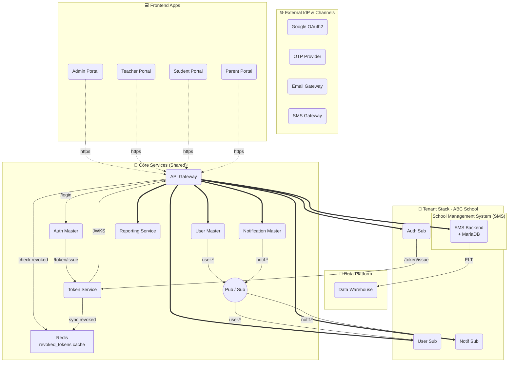
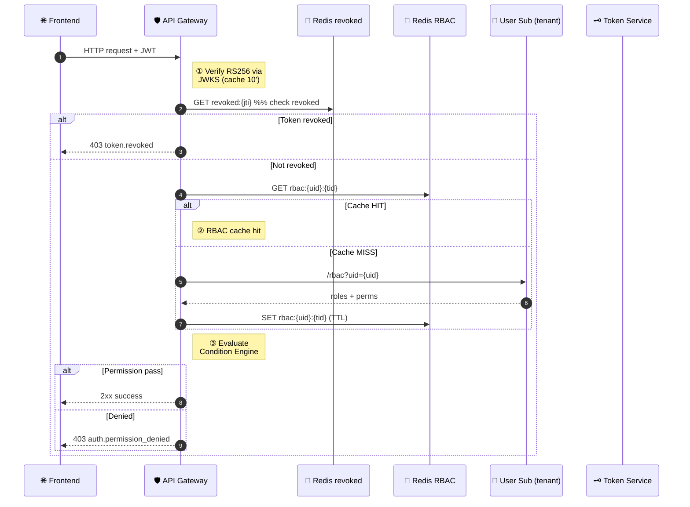
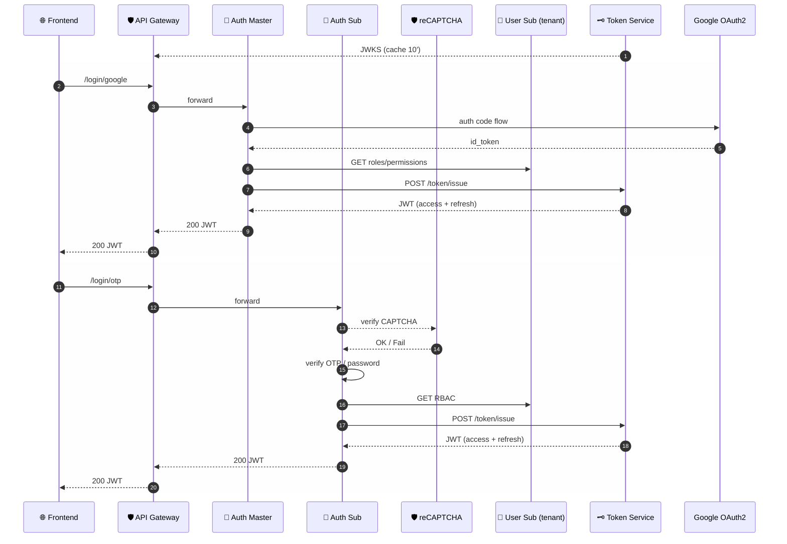
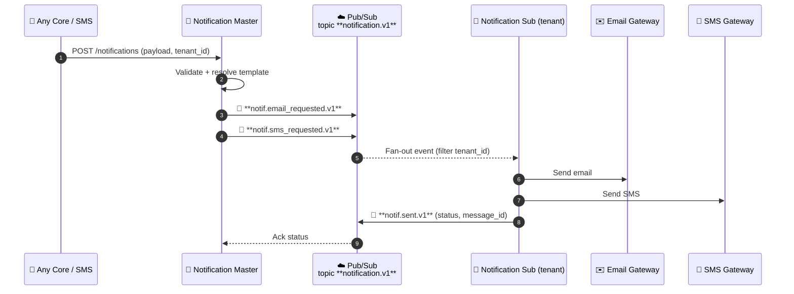
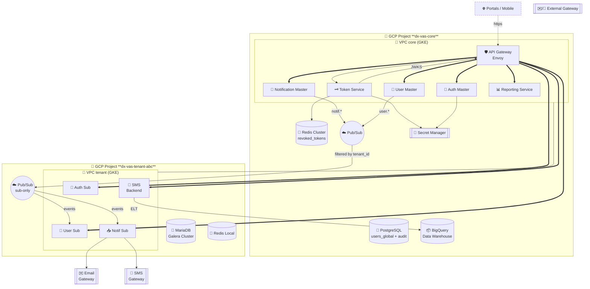
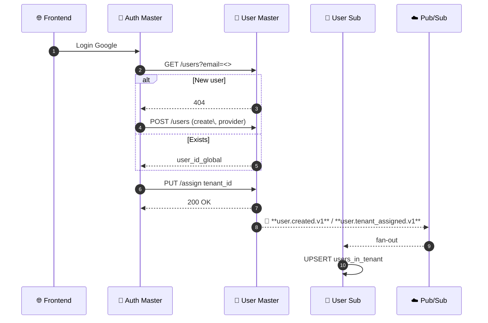
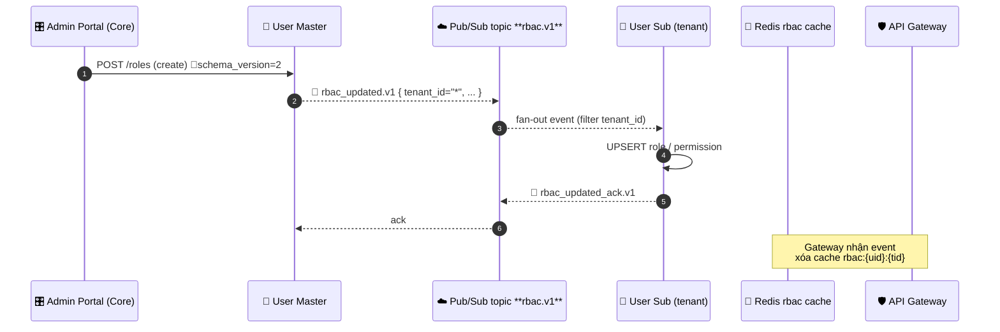
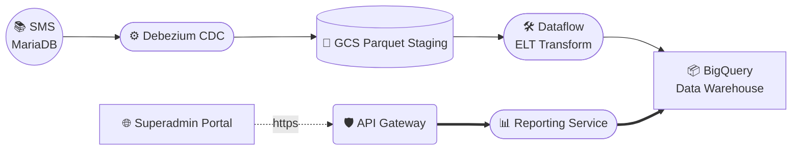
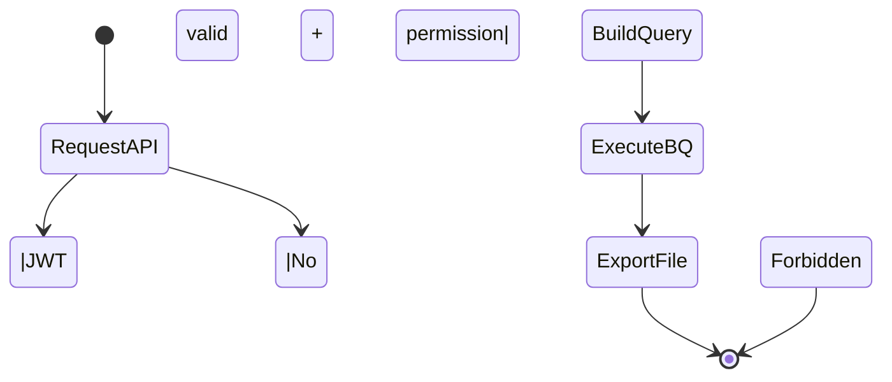
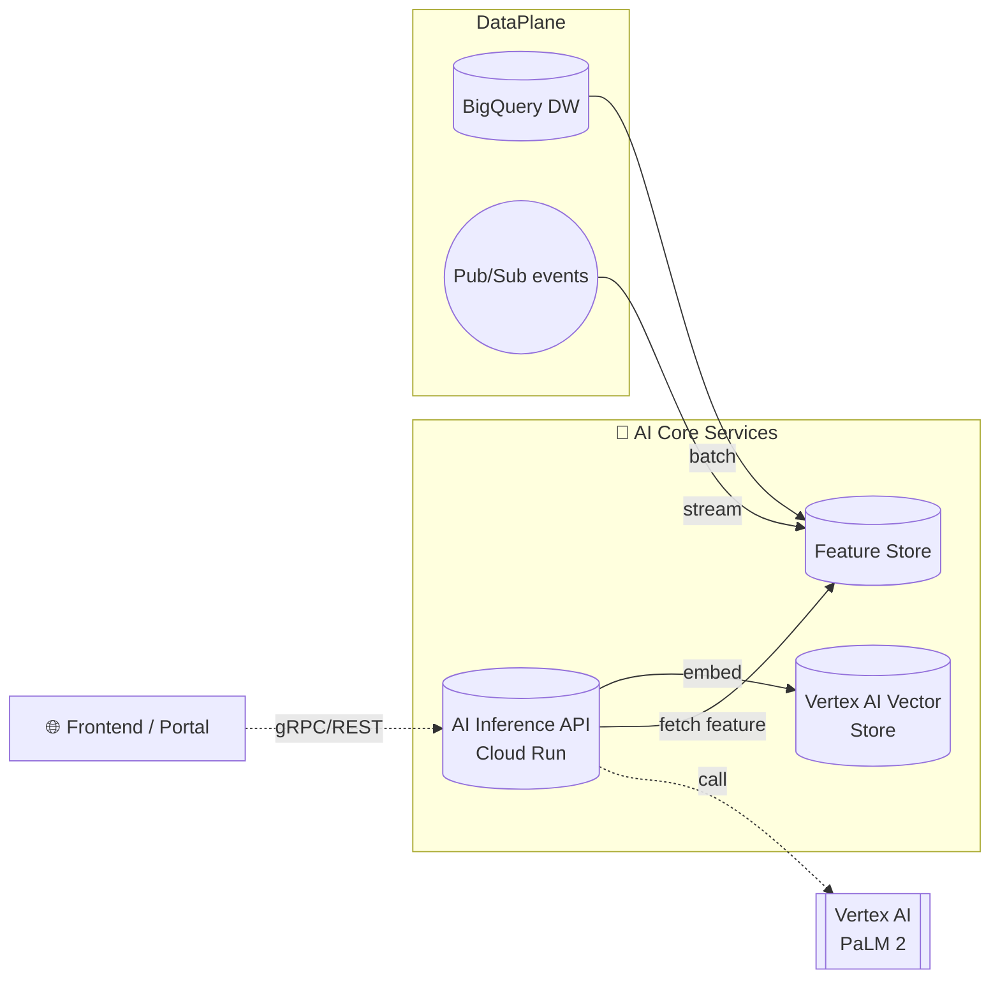

# Sơ đồ Kiến trúc Hệ thống dx-vas

Tài liệu này tập hợp tất cả các sơ đồ kiến trúc quan trọng của hệ thống chuyển đổi số dx-vas, bao gồm:

* Sơ đồ kiến trúc tổng thể
* Diễn giải các khối chức năng
* Các sơ đồ con chi tiết theo từng luồng nghiệp vụ (ví dụ: Tuyển sinh, Thông báo, Phân quyền RBAC...)

## 📚 Mục lục Sơ đồ Kiến trúc Hệ thống dx-vas

| STT | Tên sơ đồ | Mô tả ngắn | Liên kết |
|-----|-----------|------------|----------|
| 1️⃣ | **Kiến trúc tổng quan hệ thống Multi-Tenant** | Tổng thể hệ thống gồm Shared Core và các Tenant Stack | [Xem sơ đồ](#1-kiến-trúc-tổng-quan-hệ-thống-multi-tenant) |
| 2️⃣ | **Luồng đánh giá RBAC tại API Gateway** | Cách Gateway đánh giá quyền động từ JWT + Redis + Sub Service | [Xem sơ đồ](#2-luồng-đánh-giá-rbac-tại-api-gateway) |
| 3️⃣ | **Luồng phát hành JWT đa-tenant** | Quá trình xác thực Google/OTP và phát token | [Xem sơ đồ](#3-luồng-phát-hành-jwt-đa-tenant) |
| 4️⃣ | **Luồng gửi Notification toàn hệ thống (Option B)** | Pub/Sub fan-out từ Master đến Sub Notification Services | [Xem sơ đồ](#4-luồng-gửi-notification-toàn-hệ-thống-pubsub-fan-out) |
| 5️⃣ | **Sơ đồ triển khai hạ tầng (Deployment Diagram)** | Tổ chức project GCP cho core/tenant/monitoring/data | [Xem sơ đồ](#5-sơ-đồ-triển-khai-hạ-tầng-deployment-diagram) |
| 6️⃣ | **Vòng đời tài khoản (Account Lifecycle)** | Từ tạo user → gán tenant → cấp quyền → vô hiệu hóa | [Xem sơ đồ](#6-vòng-đời-tài-khoản-account-lifecycle) |
| 7️⃣ | **Luồng đồng bộ RBAC từ Master → Sub** | Tự động hoặc thủ công sync role/permission template | [Xem sơ đồ](#7-luồng-đồng-bộ-rbac-từ-master--sub-user-services) |
| 8️⃣ | **Phân quyền giao diện người dùng (UI Role Mapping)** | Vai trò được ánh xạ đến các frontend: Superadmin, Admin, GV, PH | [Xem sơ đồ](#8-phân-quyền-giao-diện-người-dùng-ui-role-mapping) |

---

## 1. Kiến trúc tổng quan hệ thống Multi-Tenant

> **Mục tiêu** – Cho thấy bức tranh cao nhất: **Core Services** dùng chung, **Tenant Stack** cô lập; JWT do **Token Service** ký, RBAC cache ở **API Gateway**, dữ liệu nghiệp vụ gói trong **SMS** (per tenant).



### 🗝️ Chú thích mũi tên & đường nét

| Ký hiệu        | Ý nghĩa                                     |
| -------------- | ------------------------------------------- |
| `-. https .->` | Gọi HTTPS từ frontend/browser               |
| `-->`          | Gọi API đồng bộ nội bộ                      |
| `==>`          | Gọi API đồng bộ ưu tiên cao / routing chính |
| `..>`          | Luồng bất đồng bộ (Pub/Sub, ELT)            |
| `-- JWKS -->`  | Gateway tải public key JWKS để xác thực JWT |

* **Token Service** ký JWT (RS256); **API Gateway** xác thực offline qua **JWKS** cache 10 ′ và kiểm tra `revoked:{jti}` trong **Redis** trước khi đánh giá RBAC.
* **SMS** thay thế hoàn toàn các adapter CRM/SIS/LMS cũ, trở thành nguồn dữ liệu nghiệp vụ duy nhất ở mỗi tenant.
* Mỗi tenant stack triển khai độc lập; autoscale không ảnh hưởng Core Services.

> Sơ đồ phản ánh đầy đủ hai Change Request gần nhất: **Token Service centralization** và **Tenant Stack simplification với SMS**.

---

## 2. Luồng đánh giá RBAC tại API Gateway

> **Mục tiêu** – Đảm bảo **mỗi request** được xác thực (JWT) và uỷ quyền (RBAC + Condition) **< 5 ms** p95, đồng thời phản ứng tức thời khi token bị thu hồi hoặc quyền thay đổi.

### 2.1 Sequence Diagram



### 2.2 Bước xử lý chi tiết

| # | Bước                                                           | Thời gian mục tiêu |
| - | -------------------------------------------------------------- | ------------------ |
| ① | Xác thực chữ ký JWT bằng **JWKS** (cache 10 phút)              | < 0.5 ms           |
| ② | Tra **Redis** cache RBAC (`rbac:{uid}:{tid}`)                  | hit ≥ 98 %         |
| ③ | Engine so sánh `condition` (*\$user*, *\$request*, *\$tenant*) | < 4 ms             |

### 2.3 Quy tắc xử lý

1. **Token bị thu hồi** → trả `403 token.revoked`, ghi metric `revoked_token_cache_hit_ratio`.
2. **RBAC cache miss** → tải từ **User Sub** rồi set TTL 5 – 15 phút (tuỳ tenant).
3. **Permission có condition** → nếu placeholder thiếu / type mismatch → `400 common.validation_failed`.
4. **Mọi phản hồi lỗi** dùng `ErrorEnvelope` (ADR-011).

### 2.4 Metrics & Alert

| Metric                          | Mục tiêu | Alert          |
| ------------------------------- | -------- | -------------- |
| `rbac_cache_hit_ratio`          | ≥ 98 %   | < 95 % 10′     |
| `revoked_token_cache_hit_ratio` | ≥ 95 %   | < 90 % 10′     |
| `rbac_cond_latency_p95`         | < 5 ms   | > 10 ms 5′     |
| `rbac_eval_error_rate`          | = 0      | bất kỳ > 0.1 % |

> **Kết quả:** Với cache hai tầng (RBAC & Revoked) và Engine điều kiện chạy tại Gateway, dx-vas uỷ quyền gần-real-time mà không đánh đổi hiệu năng.

---

## 3. Luồng phát hành JWT đa-tenant

> **Mục tiêu** – Tạo **JWT RS256** chứa đầy đủ claim (`sub`, `tid`, `roles`, `permissions`, `jti`, `sid`, `exp`) cho **mọi phương thức đăng nhập** (Google OAuth2 & Local / OTP) và mọi tenant.

### 3.1 Sequence Diagram



### 3.2 Bước xử lý chi tiết

| Bước | Mô tả                                                                       | Thành phần                 |
| ---- | --------------------------------------------------------------------------- | -------------------------- |
| 1    | Frontend gửi yêu cầu đăng nhập (Google hoặc OTP).                           | FE → API Gateway           |
| 2    | **Auth Master** (Google) hoặc **Auth Sub** (OTP) xác thực người dùng.       | AuthM / AuthT              |
| 3    | Gọi **User Sub** lấy `roles`, `permissions` trong tenant đã chọn.           | AuthM / AuthT              |
| 4    | Gọi **Token Service** `POST /token/issue` → nhận cặp token đã ký **RS256**. | AuthM / AuthT → TokenSvc   |
| 5    | Trả JWT cho Frontend qua **API Gateway**.                                   | AuthM / AuthT → APIGW → FE |

### 3.3 Cấu trúc JWT

| Claim                  | Ý nghĩa                               |
| ---------------------- | ------------------------------------- |
| `sub`                  | `user_id_global`                      |
| `tid`                  | `tenant_id`                           |
| `roles`, `permissions` | Danh sách vai trò & quyền (RBAC)      |
| `auth_provider`        | `google` / `local` / `otp`            |
| `jti`                  | UUID duy nhất – dùng thu hồi token    |
| `sid`                  | Session ID tham chiếu `auth_sessions` |
| `exp`                  | Hết hạn ≤ 15 phút (access token)      |

Refresh token TTL 14 ngày; lưu `auth_sessions`.

### 3.4 Kiểm soát & Bảo mật

* **CAPTCHA** bắt buộc trước bước OTP để tránh brute-force.
* **JWKS** công khai cache 10 phút – Gateway xác thực chữ ký offline.
* **Token revocation**: `/token/revoke` thêm `jti` vào Redis (`revoked:{jti}`) → Gateway chặn ngay.

### 3.5 Metric giám sát

| Metric                    | Target   |
| ------------------------- | -------- |
| `token_issue_latency_p95` | < 100 ms |
| `login_success_rate`      | > 98 %   |
| `captcha_failure_rate`    | < 2 %    |

> **Kết quả:** Người dùng nhận JWT trong một vòng request, còn API Gateway sở hữu đủ thông tin (`tid`, RBAC, jti) để xác thực & uỷ quyền siêu nhanh cho từng tenant.

---

## 4. Luồng gửi Notification toàn hệ thống (Pub/Sub fan-out)

> **Mục tiêu** – Tách rời **orchestration** (Notification Master) khỏi **delivery** (Notification Sub per tenant), bảo đảm:  
> • Thống nhất template & tracking ở Core.  
> • Fan-out sự kiện **< 1 s** tới mọi tenant.  
> • Không ràng buộc tenant vào hạ tầng SMTP/SMS chung.  

### 4.1 Sequence Diagram



### 4.2 Định tuyến & Schema

| Chủ đề / Event             | Mô tả                                   | Schema ID (ADR-030)  |
| -------------------------- | --------------------------------------- | -------------------- |
| `notification.v1`          | Topic chung cho mọi sự kiện notificaton | —                    |
| `notif.email_requested.v1` | Master yêu cầu gửi Email                | `notif_email_req_v1` |
| `notif.sms_requested.v1`   | Master yêu cầu gửi SMS                  | `notif_sms_req_v1`   |
| `notif.sent.v1`            | Sub báo cáo kết quả (OK/FAIL)           | `notif_sent_v1`      |

*Tenant Sub* subscribe với filter `attributes.tenant_id == "<tenant>"` → tách biệt luồng.

### 4.3 Xử lý tại Notification Master

1. **Validate** payload & tenant quota.
2. **Merge Template** ↔ data; log `audit_log.notifications`.
3. **Publish** sự kiện `*.requested.v1` kèm `schema_version`.
4. **Track** status qua `notif.sent.v1`; retry nếu kết quả `FAIL`.

### 4.4 Xử lý tại Notification Sub (per tenant)

| Bước | Hành động                                     | Idempotency          |
| ---- | --------------------------------------------- | -------------------- |
| 1    | Nhận event; kiểm tra `dedup_id`               | Redis SETNX 15 m     |
| 2    | Render template (locale)                      | —                    |
| 3    | Gửi Email / SMS                               | 3 lần retry back-off |
| 4    | Publish `notif.sent.v1` (status, message\_id) | —                    |

### 4.5 Khả năng mở rộng & SLA

| Thành phần                      | Autoscale                 | SLA                      |
| ------------------------------- | ------------------------- | ------------------------ |
| Pub/Sub topic `notification.v1` | 100k msg/s                | ≥ 99.9 %                 |
| Notification Sub                | HPA (RPS & queue lag)     | email < 30 s, sms < 10 s |
| Email/SMS Gateway               | Ngoài phạm vi (3rd-party) | —                        |

### 4.6 Monitoring & Alert

* **Metric** `notif_sent_success_rate` ≥ 97 % (per channel).
* **Lag** Pub/Sub `subscription/oldest_unacked_age` < 5 s.
* **Dashboard** số lượng gửi Email/SMS theo tenant, bounce rate, cost.
* **Alert** nếu `notif.sent.v1` FAIL > 2 % trong 5 ′.

> Nhờ Pub/Sub fan-out, DX-VAS gửi thông báo **một lần** ở Core nhưng bảo đảm **mỗi tenant** xử lý & tuỳ biến riêng, đồng thời Master vẫn nắm đầy đủ log & KPI.

---

## 5. Sơ đồ triển khai hạ tầng (Deployment Diagram)

> **Phân tách** rõ hai biên:  
> **Core Project** – chạy duy nhất, chia sẻ cho mọi tenant;  
> **Tenant Project** – nhân bản cho từng trường, độc lập compute/giao thức mạng, chỉ kết nối qua API Gateway & Pub/Sub.



> Node ExtGW[[✉️/📱 External Gateway]] hiển thị biểu tượng ✉️/📱, tượng trưng cho cả Email Gateway và SMS Gateway.
> Đặt trong phần “Legend” giúp người đọc hiểu nhanh ý nghĩa của các nút EmailSvc và SMSSvc đã dùng ở Tenant stack.

### 🔑 Ghi chú & Chính sách

| Thành phần               | SLA / SLO                         | Autoscale          |
| ------------------------ | --------------------------------- | ------------------ |
| **API Gateway**          | p95 < 20 ms                       | HPA RPS + CPU      |
| **Token Service**        | p95 < 50 ms; availability 99.95 % | HPA CPU            |
| **Redis Cluster (core)** | hit ≥ 95 %; failover multi-AZ     | Manged Memorystore |
| **Pub/Sub fan-out**      | latency < 1 s                     | Serverless         |
| **Tenant GKE**           | cô lập VPC; node-pool riêng       | HPA per tenant     |
| **MariaDB Galera**       | RPO = 0; RTO < 5 min              | CloudSQL HA        |

* CI/CD: **Argo CD** sync `core` & `tenant` chart; **Terraform Cloud** dựng VPC, DB, Secret.
* VPC peering + firewall chỉ mở cổng 443/mTLS; traffic giữa tenant ↔ core đi qua **API Gateway**.
* **Secret Manager** lưu RSA key (`kid current|next`) & SMTP creds; rotation ≤ 90 ngày.

> **Kết quả** – Kiến trúc tách bạch giúp mở rộng tenant mới bằng một cụm GKE + MariaDB, không tác động Core, đồng thời Core duy trì single-pane quan sát & bảo mật.

---

## 6. Vòng đời Tài khoản (Account Lifecycle)

> **Định nghĩa**  
> *Tài khoản* = bản ghi **users_global** (User Service Master) + (0…n) bản ghi **users_in_tenant**.  
> Tài khoản có thể **sống** ở nhiều tenant, **đóng băng** (inactive) cục bộ hoặc toàn cục, **được ẩn danh** hoặc **xoá vĩnh viễn** theo ADR-024 & ADR-026.

### 6.1 Luồng khởi tạo (Create / First Login)



* **Provider**: `google` / `local` / `otp` (lưu trong `auth_provider`).
* **Event** `user.created.v1` chứa `schema_version`, dùng để seed tenant DB.

### 6.2 Kích hoạt / Ngưng hoạt động

| Phạm vi             | API                                                         | Trạng thái                 | Event                    |
| ------------------- | ----------------------------------------------------------- | -------------------------- | ------------------------ |
| **Toàn cục**        | `PATCH /users/{id} is_active=false`                         | Khóa đăng nhập mọi tenant  | `user_status_changed.v1` |
| **Cục bộ (tenant)** | `PATCH /users/{id}?tenant_id=... is_active_in_tenant=false` | Khóa trong tenant hiện tại | `user_status_changed.v1` |

Gateway cache **RBAC** bị xoá khi nhận event \&nbsps; token cũ sẽ bị chặn nếu user\_inactive.

### 6.3 Cập nhật thông tin hồ sơ

* **Toàn cục**: `PUT /users/{id}` → bảng `users_global`.
* **Cục bộ** : `PUT /users/{id}` + header `X-Tenant-ID` → bảng `users_in_tenant`.
* Phát event `user.profile_updated.v1`; ETL đồng bộ sang BigQuery.

### 6.4 Vòng đời phiên (Session TTL)

| Loại              | TTL                   | Lưu ở                     |
| ----------------- | --------------------- | ------------------------- |
| **Access token**  | ≤ 15 ′                | JWT claim `exp`           |
| **Refresh token** | 14 ngày               | bảng `auth_sessions`      |
| **Force logout**  | `/token/revoke sid=*` | Xoá Redis `revoked:{jti}` |

### 6.5 Ẩn danh & Xoá vĩnh viễn

| Pha             | Thao tác                                                              | Timeout | ADR       |
| --------------- | --------------------------------------------------------------------- | ------- | --------- |
| **Soft Delete** | User self-delete → `is_active = false`, flag `delete_after = now+30d` | 30 ngày | 026       |
| **Hard Delete** | Job `user_purge` xoá bản ghi, đổi dữ liệu PII → hash                  | —       | 024 & 026 |

* **Audit log** ghi “user purged” kèm `gdpr_request_id`.
* `user.deleted.v1` event bắn lên Pub/Sub → Tenant Sub nhận & purge bản ghi local.

### 6.6 Mapping → JWT & RBAC Cache

| Thuộc tính            | Nguồn                  | Claim / Cache                   |
| --------------------- | ---------------------- | ------------------------------- |
| `user_id`             | users\_global.user\_id | `sub`                           |
| `tenant_id`           | header chọn tenant     | `tid`                           |
| `roles / perms`       | JOIN UserSub           | Cache `rbac:{uid}:{tid}` 5-15 ′ |
| `is_active`           | users\_global          | Gateway chặn nếu false          |
| `is_active_in_tenant` | users\_in\_tenant      | Gateway chặn nếu false          |

### 6.7 KPI & Alert

| Metric                       | Mục tiêu          | Alert        |
| ---------------------------- | ----------------- | ------------ |
| `user_login_success_rate`    | > 98 % tenant-avg | < 95 % 15′   |
| `user_purge_backlog`         | = 0               | > 0 ghi Jira |
| `profile_update_latency_p95` | < 100 ms          | > 200 ms     |

> **Tóm tắt** – Vòng đời tài khoản được quản trị trung tâm nhưng cho phép tenant tự do tuỳ chỉnh RBAC, đồng thời tuân thủ GDPR về xoá và ẩn danh dữ liệu.

---

## 7. Luồng đồng bộ RBAC từ Master → Sub User Services

> **Mục tiêu** – Bảo đảm **Role / Permission** luôn đồng nhất giữa **User Master** và **User Sub** mà vẫn cho phép tenant **tùy chỉnh** khi cần.  
> Cơ chế đồng bộ kết hợp **sự kiện (event-driven)** & **đồng bộ định kỳ (cron sync)**, có kiểm soát *schema_version* (ADR-030).

### 7.1 Sequence Diagram (Event-driven)



### 7.2 Sự kiện & Schema (ADR-030)

| Event                     | Khi nào phát                               | Payload chính                                       | Ghi chú                                |
| ------------------------- | ------------------------------------------ | --------------------------------------------------- | -------------------------------------- |
| `rbac_updated.v1`         | Master thay đổi / tạo mới role, permission | `tenant_id` (`*` = all), `schema_version`, `diff[]` | Fan-out tới tenant Sub                 |
| `rbac_updated_ack.v1`     | Sub xử lý xong diff                        | `tenant_id`, `applied_version`                      | Cho Master tracking                    |
| `rbac_template_synced.v1` | Job sync định kỳ                           | `tenant_id`, `from_version`, `to_version`           | Chỉ khi tenant dùng template “inherit” |

JSON Schema ID lưu trong **Schema Registry**, backward-compat ≥ 6 tháng.

### 7.3 Đồng bộ định kỳ (Cron Sync)

| Chu kỳ             | Trigger                                | Điều kiện chạy                | Hành động                                                            |
| ------------------ | -------------------------------------- | ----------------------------- | -------------------------------------------------------------------- |
| `weekly` (default) | Cloud Scheduler → Cloud Run `sync-job` | Tenant có `sync_mode=inherit` | So sánh `schema_version`; publish `rbac_template_synced.v1` nếu khác |
| `manual`           | Tenant Admin → “Sync Now”              | —                             | Gọi thẳng User Master `POST /templates/sync`                         |

*Nếu tenant đã **clone** template, job ghi log `status=forked` – **không ghi đè**.*

### 7.4 Xử lý conflict

> **Conflict** = `permission_code` trùng nhưng `schema_version` khác.

1. Job `sync-job` phát hiện → flag `conflict=true`, publish `rbac_conflict_detected.v1`.
2. Tenant nhận sự kiện, hiển thị banner “**RBAC template out-of-date**”.
3. Admin tenant có 30 ngày để merge / bump version, nếu không hệ thống sẽ tự động *lock* quyền mới (deny by default).

### 7.5 Cập nhật cache & Gateway

* Gateway subscribe `rbac_updated.v1`, `rbac_template_synced.v1`, `rbac_conflict_detected.v1`.
* Khi sự kiện tới: **xoá** `rbac:{user_id}:{tenant_id}` & `revoked:{jti}` (nếu cần).
* Metric `rbac_cache_invalidate_count` tăng; latency invalidate mục tiêu < 1 s.

### 7.6 KPI & Alert

| Metric                   | Target           | Alert        |
| ------------------------ | ---------------- | ------------ |
| `rbac_sync_success_rate` | 100 %            | bất kỳ lỗi   |
| `rbac_template_age_days` | < 30 d (inherit) | > 45 d       |
| `rbac_conflict_count`    | 0                | > 0 tạo Jira |
| `sync_job_duration_p95`  | < 60 s           | > 120 s      |

> **Kết quả** – Tenant luôn có RBAC mới trong vòng **1 giây** sau khi Master thay đổi, trong khi vẫn có **quyền tự chủ** với template đã clone.

---

## 8. Phân quyền Giao diện Người Dùng (UI Role Mapping)

> **Mục tiêu** – Liên kết **Role / Permission** (RBAC) với **tính năng cụ thể** trên bốn cổng **Admin · Teacher · Student · Parent**, giúp đội frontend hiển thị/ẩn nút và kiểm tra quyền thống nhất giữa UI & Gateway.

### 8.1 Ma trận Portal → Vai trò Chuẩn

| Portal | Role mặc định (`role_code`) | Đối tượng |
|--------|----------------------------|-----------|
| **Admin Portal** | `admin.super`, `admin.finance`, `admin.academic` | Quản trị trường |
| **Teacher Portal** | `teacher.homeroom`, `teacher.subject` | Giáo viên |
| **Student Portal** | `student.default` | Học sinh |
| **Parent Portal** | `parent.default` | Phụ huynh |

*Tenant có thể **clone** và đổi tên role; `schema_version` tăng lên khi sửa.*

### 8.2 Mapping UI → Permission

| Khu vực UI | Hành động | Permission yêu cầu (`permission_code`) |
|------------|-----------|----------------------------------------|
| **Dashboard** | Xem báo cáo đăng nhập | `report.view_login_by_tenant` |
| **Finance** | Xem báo cáo tài chính | `report.view_financial_summary` |
| **Gradebook** | Sửa điểm | `grade.edit_assignment` (teacher) |
| **Attendance** | Điểm danh | `attendance.mark` |
| **User Management** | Gán role | `rbac.manage_role` |
| **Settings** | Đồng bộ RBAC template | `rbac.sync_template` |
| **SMS Broadcast** | Gửi SMS hàng loạt | `notif.broadcast_sms` |

> UI component đọc **JWT claim `permissions`** (đã tối ưu bởi Gateway cache), ẩn nút nếu không đủ quyền.

### 8.3 Kiểm tra quyền (Frontend)

```ts
// React helper
import { useAuth } from "@/hooks/useAuth";

export function Can({ perm, children }) {
  const { permissions } = useAuth();          // lấy từ JWT decode
  if (permissions.includes(perm)) return children;
  return null;                                // ẩn UI nếu thiếu quyền
}
```

*Áp dụng pattern này cho button/menu từng portal; tránh “hard-code” role.*

### 8.4 Dynamic Condition

* Với permission có `condition`, FE gởi `input_parameters` đúng schema:

  ```json
  { "class_id": "10A1" }
  ```

* Gateway sẽ so sánh `$request.class_id` vs `$user.class_id`; FE **không** cần logic phụ.

### 8.5 Quy trình thêm tính năng mới

1. **FE** mở PR tạo UI + flag `TODO_PERMISSION`.
2. **BE** thêm permission vào `global_permissions_templates` (`schema_version+1`).
3. **RBAC Sync Job** fan-out `rbac_updated.v1`; FE lấy JWT mới → chức năng hiển thị.
4. Thêm entry mới vào **bảng 8.2** trong tài liệu này.

### 8.6 KPI UI Authorization

| Metric                         | Target  |
| ------------------------------ | ------- |
| `ui_unauthorized_click_rate`   | < 0.1 % |
| `jwt_permissions_payload_size` | ≤ 4 KB  |

> **Kết quả** – Phân quyền UI lệ thuộc đúng vào **Permission** (không phải Role cứng), cho phép tenant thay đổi Role mà không phải sửa Frontend.

---

## 9. Hệ thống Báo cáo & Phân tích (Reporting & Analytics Architecture)

> **Mục tiêu** – Cung cấp báo cáo **gần real-time**, tách biệt dữ liệu đa-tenant, cho phép **phân quyền chi tiết** (row-level) dựa trên RBAC và `condition` của permission. Kiến trúc tuân thủ `ADR-028 – Reporting Architecture`, `ADR-029 – Report Template Schema`, `ADR-030 – Event Schema Governance`.

### 9.1 Luồng dữ liệu tổng quát



* **CDC** Debezium stream → GCS (parquet) < 1 min lag.
* **Dataflow** load & transform ➜ BQ **Raw → Staging → Mart** (Kimball).
* **Reporting Service** chạy query tham số hoá, thêm `tenant_id` & RBAC filters.
* **Superadmin Portal** tải báo cáo qua Gateway (JWT + permission kiểm tra).

### 9.2 Kiến trúc Data Warehouse (BigQuery)

| Layer              | Ví dụ bảng                      | Partition / Cluster | Bảo mật                    |
| ------------------ | ------------------------------- | ------------------- | -------------------------- |
| **Raw**            | `abc_sms_enrolment_raw`         | `_PARTITIONDATE`    | IAM: read-only             |
| **Staging**        | `abc_sms_enrolment_stg`         | `_PARTITIONDATE`    | —                          |
| **Mart**           | `fct_enrolment` · `dim_student` | cluster `tenant_id` | Row ACL by `tenant_id`     |
| **Reporting View** | `vw_financial_summary`          | —                   | Authorized View per tenant |

*Retention*: Raw 30 ngày, Mart 5 năm (ẩn danh PII theo ADR-024).

### 9.3 RBAC & Row-Level Security

| Cấp truy cập | Điều kiện SQL                     | Permission yêu cầu                                   |
| ------------ | --------------------------------- | ---------------------------------------------------- |
| **Tenant**   | `WHERE tenant_id = $tid`          | `report.view_financial_summary`                      |
| **Class**    | `WHERE class_id = $user.class_id` | `report.view_login_by_tenant` + condition            |
| **Global**   | Không filter                      | `report.view_financial_summary` + role `admin.super` |

*Gateway* gắn `tenant_id`, `roles`, `permissions` vào header; Reporting Service dựng câu lệnh SQL với **parameterized filters** → tránh SQL-Injection.

### 9.4 Template & Export

* Tất cả template JSON schema lưu `report_templates` (version-controlled).
* API:

  * `GET /reports/{id}` – metadata & required params.
  * `POST /reports/{id}/export` – CSV / Parquet; header `Content-Disposition`.
* Quyền `report.manage_report_templates` cho phép admin tenant sửa template clone.

### 9.5 Giám sát chi phí & Hiệu suất

| KPI                      | Mục tiêu         | Alert        |
| ------------------------ | ---------------- | ------------ |
| `bq_query_latency_p95`   | < 5 s            | > 10 s 5′    |
| `bq_cost_per_tenant_day` | +≤ 15 % 30 d-avg | Slack FinOps |
| `elt_lag_minutes_p95`    | < 10′            | > 20′ 15′    |

### 9.6 Sơ đồ quyền truy cập báo cáo



### 9.7 Roadmap mở rộng

1. **Materialized View** cho báo cáo thời gian thực attendance (latency < 30 s).
2. **Pre-computed cube** (BigQuery BI Engine) cho dashboard hiệu năng cao.
3. **Tenant self-service chart builder** – drag-and-drop, dùng row ACL đã sẵn.

> **Kết quả** – Báo cáo phân tách theo tenant, có thể tuỳ biến điều kiện truy cập (row-level), trong khi chi phí và độ trễ được kiểm soát chặt chẽ.

---

## 10. AI Integration Strategy

> **Mục tiêu** – Ứng dụng AI để **nâng cao trải nghiệm** (chat-support, gợi ý học tập), **tối ưu vận hành** (dự báo lỗi, chi phí) và **mở rộng sản phẩm** (phân tích dữ liệu học tập).  
> Chiến lược bám theo 4 trụ: **(1) Use-case rõ ràng → (2) Data foundation sạch → (3) Model lifecycle có kiểm soát → (4) Tuân thủ bảo mật/đạo đức**.

### 10.1 Use-case Ưu tiên (2025-2026)

| Use-case | Mô tả | Mô hình / API |
|----------|-------|---------------|
| **AI Chat Support** | Chatbot hỗ trợ giáo viên & phụ huynh (FAQ, hướng dẫn) | LLM (Vertex AI PaLM 2-Text, context Knowledge-Graph) |
| **Homework Feedback** | Gợi ý sửa câu / giải chi tiết cho học sinh | LLM + Prompt-engineering + Guardrails |
| **Attendance Anomaly** | Dự báo vắng mặt bất thường | LSTM tim-series (BigQuery ML) |
| **Cost Forecast** | Dự đoán chi phí GCP/tenant tháng tới | Prophet ARIMA |
| **Incident Triage** | Phân loại log lỗi → gợi ý fix | Embedding + kNN (Vector Search) |

### 10.2 Kiến trúc triển khai



### 10.3 Model Lifecycle

| Giai đoạn      | Công cụ                                 | Quy trình                                                 |
| -------------- | --------------------------------------- | --------------------------------------------------------- |
| **Experiment** | Vertex AI Workbench + AutoML            | Data Scientist chạy notebook; metadata log ML Metadata    |
| **Train**      | Vertex AI Training                      | Output `model-artifact:hash` kèm `schema_version`         |
| **Validate**   | CI job `ml-test`                        | Accuracy ≥ KPI; bias test; security scan prompt-injection |
| **Deploy**     | Cloud Run (CPU) / GPU endpoint          | Blue-Green 5→50→100 %                                     |
| **Monitor**    | Vertex AI Model Monitoring + Prometheus | Drift, latency, cost, PII leakage alert                   |

*Governance*: PR phải kèm **Model Card** (YAML) → review **AI Guild**.

### 10.4 Bảo mật & Đạo đức

* **PII Masking** trước khi gửi prompt tới LLM (`email`, `phone`, `student_name`).
* **Prompt Firewall** – regex + model-guard không trả lời nội dung cấm (Cheating, PII).
* **Opt-in**: Học sinh < 16 tuổi yêu cầu phụ huynh đồng ý.
* **Data Residency**: Chỉ lưu embedding ở `us-central1` (GDPR SCC).

### 10.5 KPI & Giám sát

| Metric                                   | Target     | Alert           |
| ---------------------------------------- | ---------- | --------------- |
| `ai_inference_latency_p95`               | < 800 ms   | > 1200 ms 5′    |
| `chatbot_answer_helpful_rate` (thumb-up) | > 85 %     | < 70 % ngày     |
| `model_drift_score`                      | < 0.1      | > 0.2 tuần      |
| `cost_ai_per_1000req`                    | ≤ 0.02 USD | > 0.03 USD ngày |

### 10.6 Roadmap

1. **Q3-2025** – Chat Support Alpha (English → Vietnamese).
2. **Q4-2025** – Homework Feedback Pilot ở 2 tenant Premium.
3. **Q1-2026** – Full Cost Forecast + Incident Triage.
4. **Q2-2026** – Fine-tune mini-LLM on-prem (5-7 B params) nếu ROI đạt.

> **Thông điệp chủ đạo:** AI chỉ hữu ích khi *tích hợp mượt* vào luồng dữ liệu & bảo mật sẵn có; DX-VAS lấy **data quality + governance** làm trọng tâm trước khi “bơm” mô hình vào sản phẩm.

---

📌 **Ghi chú:**

* `DataAccessAPI` là lớp trừu tượng (có thể dùng để chuẩn bị dữ liệu cho training hoặc inference)
* `MetadataRegistry` tương ứng với quản trị schema theo `ADR-030`
* Mỗi AI Agent có mục tiêu riêng (hỗ trợ, tổng hợp, dự đoán) và có thể tái sử dụng query/template từ Reporting Service

---

📘 **Ghi chú:**

* UI không nên hard-code role, mà nên kiểm tra theo permission cụ thể (VD: `can_assign_role`, `can_view_tuition`)
* Các permission này được Gateway trả về trong JWT hoặc refresh qua API `GET /me/permissions`
* Việc kiểm tra quyền có thể dùng Hook/Vuex/Redux trung tâm tại frontend để gắn cờ `canAccess[X]`

📎 Liên quan:

* [RBAC Deep Dive](./rbac-deep-dive.md#11-best-practices-cho-quản-trị-rbac)
* [README](../README.md)
