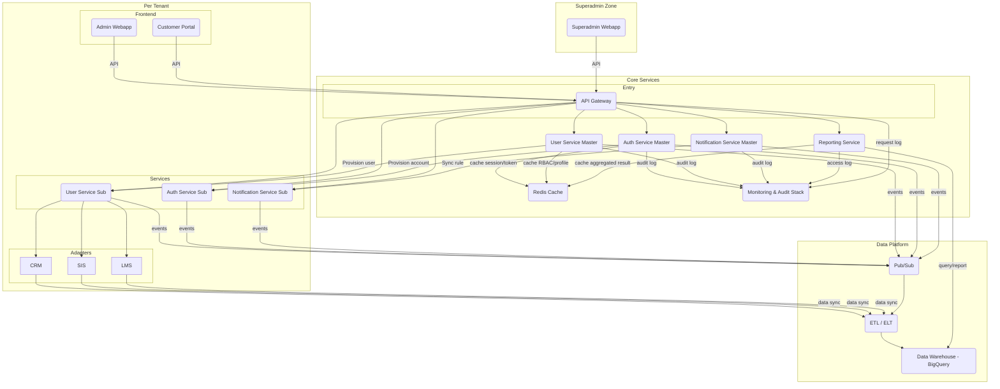
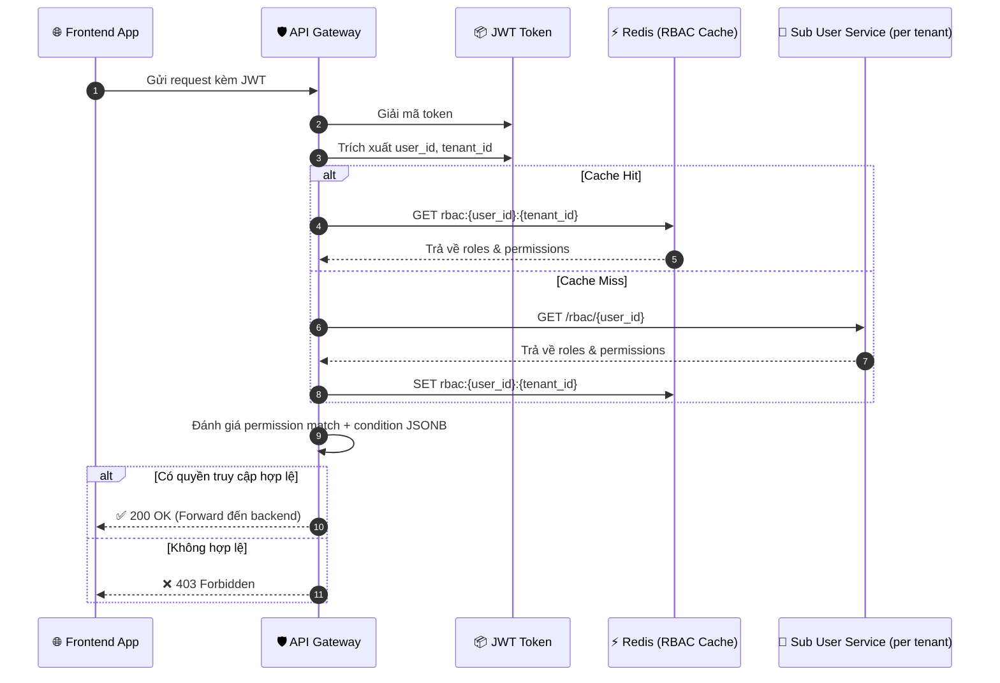
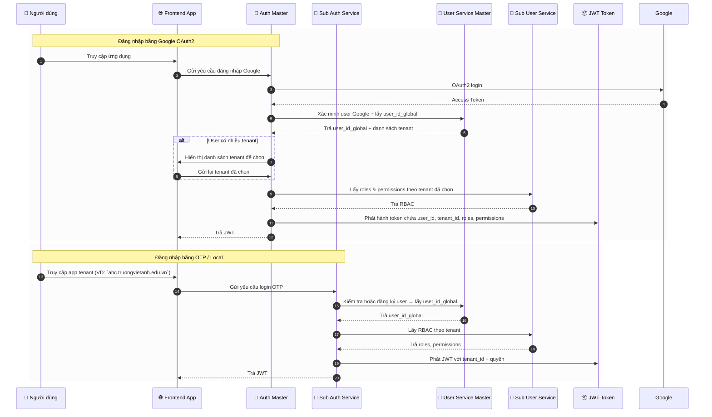
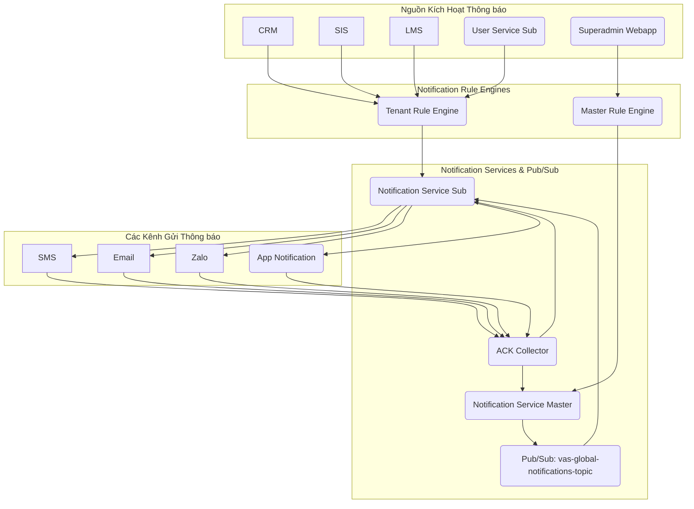
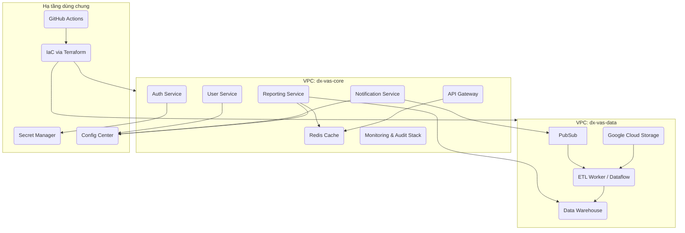
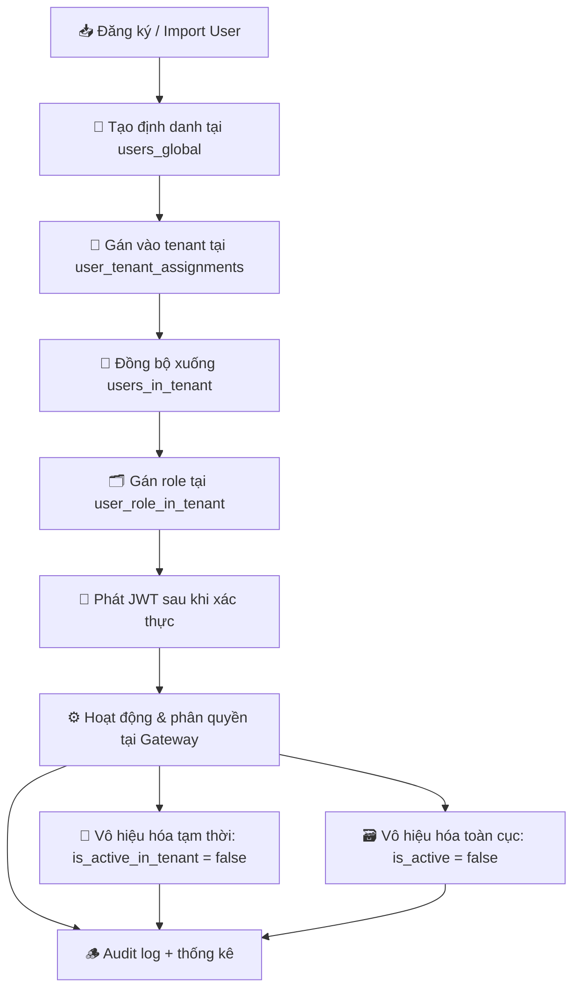
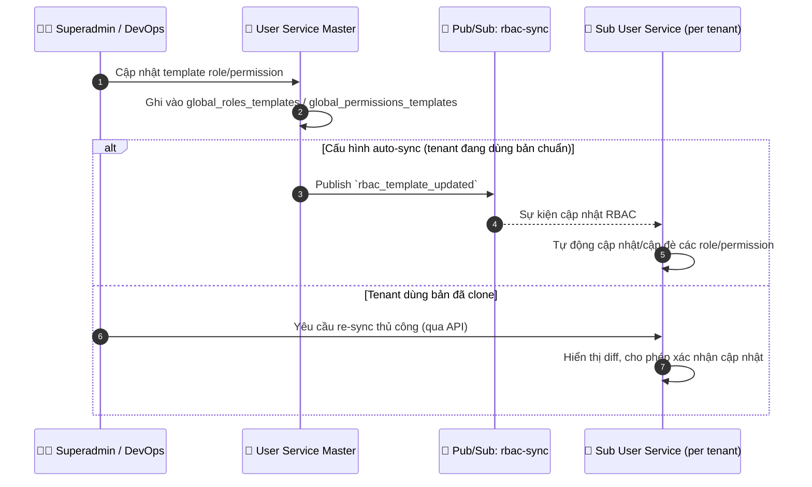
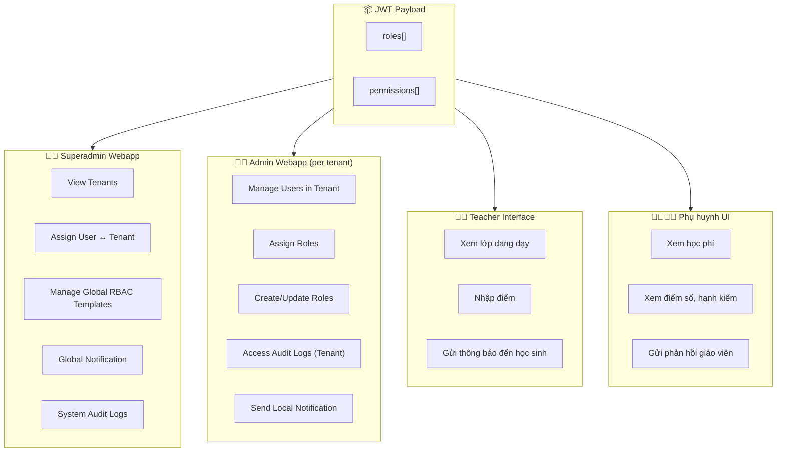
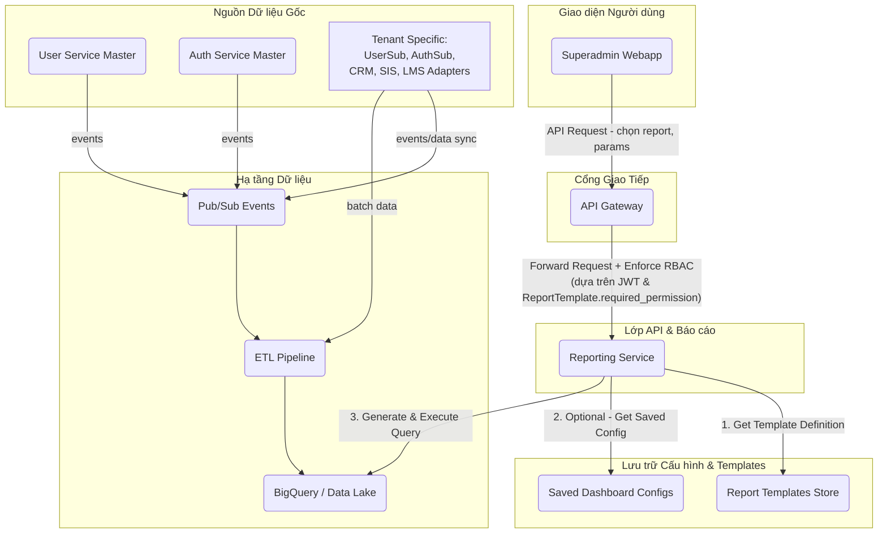
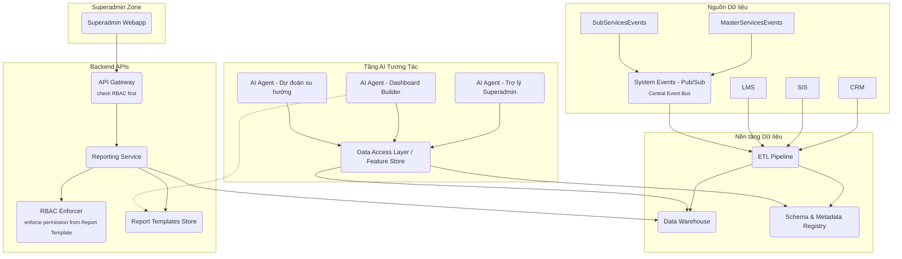

# Sơ đồ Kiến trúc Hệ thống dx-vas

Tài liệu này tập hợp tất cả các sơ đồ kiến trúc quan trọng của hệ thống chuyển đổi số dx-vas, bao gồm:

* Sơ đồ kiến trúc tổng thể
* Diễn giải các khối chức năng
* Các sơ đồ con chi tiết theo từng luồng nghiệp vụ (ví dụ: Tuyển sinh, Thông báo, Phân quyền RBAC...)

## 📚 Mục lục Sơ đồ Kiến trúc Hệ thống dx-vas

| STT | Tên sơ đồ | Mô tả ngắn | Liên kết |
|-----|-----------|------------|----------|
| 1️⃣ | **Kiến trúc tổng quan hệ thống Multi-Tenant** | Tổng thể hệ thống gồm Shared Core và các Tenant Stack | [Xem sơ đồ](#1-kiến-trúc-tổng-quan-hệ-thống-multi-tenant) |
| 2️⃣ | **Luồng đánh giá RBAC tại API Gateway** | Cách Gateway đánh giá quyền động từ JWT + Redis + Sub Service | [Xem sơ đồ](#2-luồng-đánh-giá-rbac-tại-api-gateway) |
| 3️⃣ | **Luồng phát hành JWT đa-tenant** | Quá trình xác thực Google/OTP và phát token | [Xem sơ đồ](#3-luồng-phát-hành-jwt-đa-tenant) |
| 4️⃣ | **Luồng gửi Notification toàn hệ thống (Option B)** | Pub/Sub fan-out từ Master đến Sub Notification Services | [Xem sơ đồ](#4-luồng-gửi-notification-toàn-hệ-thống-option-b--pubsub-fan-out) |
| 5️⃣ | **Sơ đồ triển khai hạ tầng (Deployment Diagram)** | Tổ chức project GCP cho core/tenant/monitoring/data | [Xem sơ đồ](#5-sơ-đồ-triển-khai-hạ-tầng-deployment-diagram) |
| 6️⃣ | **Vòng đời tài khoản (Account Lifecycle)** | Từ tạo user → gán tenant → cấp quyền → vô hiệu hóa | [Xem sơ đồ](#6-vòng-đời-tài-khoản-account-lifecycle) |
| 7️⃣ | **Luồng đồng bộ RBAC từ Master → Sub** | Tự động hoặc thủ công sync role/permission template | [Xem sơ đồ](#7-luồng-đồng-bộ-rbac-từ-master--sub-user-services) |
| 8️⃣ | **Phân quyền giao diện người dùng (UI Role Mapping)** | Vai trò được ánh xạ đến các frontend: Superadmin, Admin, GV, PH | [Xem sơ đồ](#8-phân-quyền-giao-diện-người-dùng-ui-role-mapping) |

---

## 1. Kiến trúc tổng quan hệ thống Multi-Tenant

Sơ đồ dưới đây mô tả kiến trúc tổng thể của hệ thống dx-vas theo mô hình multi-tenant:

- Một công ty quản lý nhiều trường thành viên (tenant), mỗi trường có stack riêng biệt.
- Các stack tenant sử dụng chung các dịch vụ cốt lõi như API Gateway, User Service Master, Auth Master.
- Phân quyền, xác thực, thông báo và định tuyến được thực hiện theo từng `tenant_id`.

📘 **Ghi chú:**

* Các khối `Tenant A`, `Tenant B` có thể mở rộng tùy theo số lượng trường.
* Sub Notification Service lắng nghe từ `Notification Master` thông qua Pub/Sub (`Option B`).
* RBAC, Auth, Notification đều hoạt động theo `tenant_id`, đảm bảo isolation.
* Bổ sung `Reporting Service`, `ETL`, `Data Warehouse`
* Hiển thị quan hệ `Superadmin Webapp → Reporting Service → BigQuery`
* Bao gồm Redis, Pub/Sub, Audit Stack

---

## 2. Luồng đánh giá RBAC tại API Gateway

Sơ đồ dưới mô tả cách API Gateway thực hiện xác thực và đánh giá phân quyền động (RBAC) cho từng request dựa trên JWT, Redis cache, và Sub User Service.

- Gateway giải mã JWT để lấy `user_id`, `tenant_id`, `permissions`.
- Nếu có cache, sử dụng Redis để tra cứu nhanh.
- Nếu không có, gọi Sub User Service tương ứng để lấy quyền theo tenant.
- Đánh giá các điều kiện JSONB nếu có trong permission.

📘 **Tham khảo thêm:**

* [Chi tiết về RBAC Cache](../rbac-deep-dive.md#6-chiến-lược-cache-rbac-tại-api-gateway)
* [Cấu trúc permission có điều kiện](../rbac-deep-dive.md#5-permission-có-điều-kiện-condition-jsonb)

---

## 3. Luồng phát hành JWT đa-tenant

Sơ đồ này mô tả hai luồng xác thực và phát hành JWT:

1. Qua Google OAuth2 – xử lý bởi Auth Service Master
2. Qua Local/OTP – xử lý bởi Sub Auth Service của từng tenant

Sau khi xác thực, JWT được phát hành với thông tin `user_id_global`, `tenant_id`, `roles`, `permissions` – phục vụ phân quyền tại API Gateway.

📘 **Tham khảo thêm:**

* [ADR-006: Chiến lược xác thực](../ADR/adr-006-auth-strategy.md)
* [Cấu trúc token & chuẩn hoá claim](../README.md#5-auth-service)

---

## 4. Luồng gửi Notification toàn hệ thống (Option B – Pub/Sub fan-out)

Sơ đồ dưới đây thể hiện luồng gửi thông báo toàn hệ thống khi Superadmin muốn broadcast đến một hoặc nhiều trường thành viên:

- Notification Master phát sự kiện lên Pub/Sub.
- Mỗi Sub Notification Service lắng nghe topic, lọc theo `tenant_id`, gửi thông báo bằng kênh riêng (Zalo OA, Gmail API…).
- Mỗi Sub Service phản hồi lại trạng thái gửi qua một topic riêng để Master theo dõi và tổng hợp.

📘 **Ghi chú:**

* Mỗi Sub Notification tự chịu trách nhiệm gửi đi và ghi log theo cấu hình tenant riêng.
* Notification Master **không cần biết cấu trúc cụ thể** của từng Sub Service, chỉ cần phát sự kiện chuẩn hoá.
* Hệ thống hỗ trợ cả lọc theo `target_tenant_ids`, `target_roles`, hoặc tiêu chí tùy chỉnh.

📎 Tham khảo thêm:

* [`phat-sinh-va-phuong-an-02.md`](../requirements/phat-sinh-va-phuong-an-02.md)
* [`adr-008-audit-logging.md`](../ADR/adr-008-audit-logging.md)

---

## 5. Sơ đồ triển khai hạ tầng (Deployment Diagram)

Sơ đồ này mô tả kiến trúc triển khai hạ tầng của hệ thống dx-vas trên Google Cloud, theo mô hình chia project rõ ràng giữa core services và các tenant. Mỗi tenant có stack riêng, độc lập về tài nguyên, giúp đảm bảo cách ly và dễ scale.

📘 **Giải thích:**

* Mỗi tenant được tách thành 1 project riêng (theo chuẩn đa tổ chức và quản trị billing).
* Tách `dx-vas-core` và `dx-vas-data` theo mô hình micro-VPC
* `dx-vas-core` chứa các dịch vụ dùng chung: Gateway, Auth/User Master, Redis, Pub/Sub.
* `dx-vas-monitoring` tập trung log/metrics toàn hệ thống.
* `dx-vas-data` lưu trữ Cloud SQL, BigQuery, GCS phục vụ phân tích, lưu trữ tập trung.
* Thể hiện đúng hướng tương tác: Service → Redis, Service → Config/Secrets
* Dễ mở rộng thêm AI stack hoặc Worker nếu cần sau này

📎 Tham khảo chi tiết:

* [`adr-019-project-layout.md`](../ADR/adr-019-project-layout.md)
* [`adr-015-deployment-strategy.md`](../ADR/adr-015-deployment-strategy.md)

---

## 6. Vòng đời tài khoản (Account Lifecycle)

Sơ đồ dưới đây mô tả toàn bộ vòng đời của một người dùng trong hệ thống dx-vas, từ khi được định danh tại User Service Master đến khi được gán vào tenant, phân quyền, hoạt động và (nếu cần) bị vô hiệu hóa.

📌 **Ý nghĩa các bước:**

* **Bước A–C:** User có thể được thêm thủ công (Admin/Superadmin) hoặc import từ hệ thống khác.
* **Bước D–E:** Khi gán vào tenant, user được ánh xạ và gán role tại tenant đó.
* **Bước F–G:** Sau khi đăng nhập, token được phát hành và dùng để phân quyền.
* **Bước H–J:** Quản trị viên có thể vô hiệu hóa tạm thời tại tenant hoặc toàn hệ thống.

📘 Tham khảo chi tiết mô hình dữ liệu:

* [`user-service/master/data-model.md`](../services/user-service/master/data-model.md)
* [`user-service/tenant/data-model.md`](../services/user-service/tenant/data-model.md)

---

## 7. Luồng đồng bộ RBAC từ Master → Sub User Services

Sơ đồ này mô tả cách hệ thống dx-vas thực hiện đồng bộ vai trò và quyền từ User Service Master xuống các Sub User Service của từng tenant.

- Các template vai trò/quyền được quản lý tập trung.
- Tenant có thể chọn kế thừa tự động, hoặc clone để chỉnh sửa nội bộ.
- Việc đồng bộ được thực hiện theo event (Pub/Sub) hoặc API chủ động.

📘 **Ghi chú:**

* Cấu hình `sync_mode` tại mỗi tenant có thể là:

  * `"inherit"`: đồng bộ tự động
  * `"clone"`: chỉ copy 1 lần, sau đó quản lý riêng
* Tenant có thể dùng dashboard để xem chênh lệch giữa template master và local.

📎 Tài liệu liên quan:

* [`rbac-deep-dive.md`](../architecture/rbac-deep-dive.md#7-chiến-lược-đồng-bộ-rbac)

---

## 8. Phân quyền giao diện người dùng (UI Role Mapping)

Sơ đồ dưới mô tả cách các vai trò hệ thống được ánh xạ và kiểm soát hiển thị tính năng trong từng lớp giao diện người dùng.

- Quyền được cấp tại Sub User Service (per tenant)
- UI xác định quyền truy cập chức năng dựa vào các permission đã decode từ JWT

---

## 9. Hệ thống Báo cáo & Phân tích (Reporting & Analytics Architecture)

- phản ánh đầy đủ luồng dữ liệu và các thành phần chính như:
* Superadmin Webapp
* Reporting Service
* Data Warehouse
* ETL pipelines từ Pub/Sub và Adapters
* RBAC + Template

📌 **Ghi chú cho sơ đồ:**

* `ReportingService` truy xuất template + kiểm tra RBAC trước khi truy vấn `DataWarehouse`
* `ETLWorker` nạp dữ liệu từ cả `PubSub` (sự kiện từ các Sub Services) và từ CRM/SIS/LMS qua batch hoặc streaming
* Phân quyền báo cáo được thực thi bởi `RBACEnforcer` theo cấu hình trong template

---

## 10. AI Integration Strategy 

– phản ánh Mục 10 trong `README.md`, kết nối hệ thống hiện tại với khả năng tích hợp các AI Agent trong tương lai. Sơ đồ nhấn mạnh:
* Nền tảng dữ liệu (Data Warehouse) là trung tâm
* AI Agent có thể tương tác qua API hoặc Data Access Layer
* Yêu cầu chuẩn hóa schema, metadata và quản trị data quality

---

📌 **Ghi chú:**

* `DataAccessAPI` là lớp trừu tượng (có thể dùng để chuẩn bị dữ liệu cho training hoặc inference)
* `MetadataRegistry` tương ứng với quản trị schema theo `ADR-030`
* Mỗi AI Agent có mục tiêu riêng (hỗ trợ, tổng hợp, dự đoán) và có thể tái sử dụng query/template từ Reporting Service

---

📘 **Ghi chú:**

* UI không nên hard-code role, mà nên kiểm tra theo permission cụ thể (VD: `can_assign_role`, `can_view_tuition`)
* Các permission này được Gateway trả về trong JWT hoặc refresh qua API `GET /me/permissions`
* Việc kiểm tra quyền có thể dùng Hook/Vuex/Redux trung tâm tại frontend để gắn cờ `canAccess[X]`

📎 Liên quan:

* [RBAC Deep Dive](../architecture/rbac-deep-dive.md#11-best-practices-cho-quản-trị-rbac)
* [README](../README.md#3-admin-webapp-cấp-độ-tenant)
