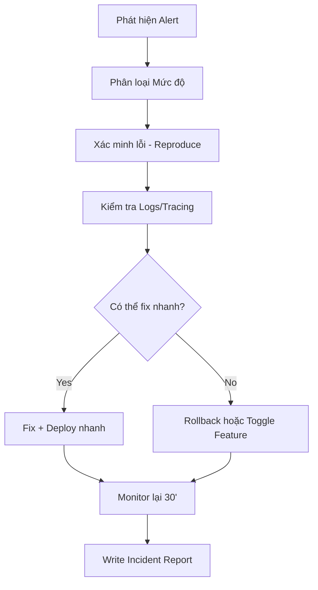

# 🚨 14. Incident Response – Quy trình Phản ứng Sự cố

Tài liệu này cung cấp quy trình tiêu chuẩn để phản ứng nhanh chóng, có tổ chức và hiệu quả khi xảy ra sự cố trong hệ thống DX-VAS, đặc biệt ở môi trường Staging và Production.

---

## 1. 🎯 Mục tiêu

- Xử lý sự cố đúng người – đúng bước – đúng thời điểm.
- Giảm tối thiểu thời gian downtime và ảnh hưởng đến người dùng.
- Ghi lại bài học & cải tiến quy trình sau sự cố.

---

## 2. ⚠️ Phân loại Mức độ Sự cố

| Mức độ | Tiêu chí                                                                 | Ví dụ                                                         |
|--------|--------------------------------------------------------------------------|----------------------------------------------------------------|
| **P0** | Ảnh hưởng nghiêm trọng đến toàn hệ thống / mất dữ liệu / tê liệt chức năng chính | Không thể đăng nhập, ghi nhận điểm, hoặc gửi thông báo khẩn |
| **P1** | Một tính năng quan trọng không hoạt động, nhưng có workaround           | Bị lỗi khi tạo user, nhưng import CSV vẫn dùng được           |
| **P2** | Lỗi nhỏ, không ảnh hưởng luồng chính                                    | Label UI hiển thị sai, link 404 trong email…                  |

---

## 3. 🧭 Quy trình Xử lý Sự cố



---

## 4. 🛠️ Công cụ & Nguồn Quan Sát

| Công cụ                        | Mục đích                            |
| ------------------------------ | ----------------------------------- |
| **Slack #dx-vas-alerts**       | Nhận cảnh báo real-time             |
| **Google Cloud Logging**       | Truy log theo `trace_id`, `service` |
| **Google Cloud Trace**         | Quan sát performance request        |
| **Grafana / Cloud Monitoring** | Dashboards theo dõi metric hệ thống |
| **Postman / curl**             | Kiểm tra nhanh API & token          |

---

## 5. 🔁 Rollback & Phục hồi

### Khi nào rollback?

* API trả 5xx hàng loạt hoặc không response
* Feature mới gây lỗi logic hoặc làm treo service
* Event bị phát sai schema, gây lỗi consumer

### Cách rollback:

1. Vào Cloud Run → Service → Tab `Revisions`
2. Chọn bản ổn định gần nhất → `Roll back to this revision`
3. Kiểm tra lại logs, metrics

---

## 6. 🧾 Mẫu Báo cáo Sự cố (Incident Report)

```md
### 🎯 Sự cố: Không gửi được notification email (P1)
- **Thời gian:** 2025-06-07 09:30
- **Phát hiện bởi:** Slack Alert + Feedback từ phụ huynh
- **Ảnh hưởng:** 60% email gửi qua SMTP bị treo
- **Nguyên nhân:** Redis bị đầy memory → queue consumer treo
- **Hành động:** Restart Redis + tăng max memory
- **Thời gian khắc phục:** 17 phút
- **Bài học:** Cần cảnh báo sớm khi Redis memory vượt 80%
```

---

## 7. 🧠 Thói quen phản ứng chuyên nghiệp

* **Không blame người.** Lỗi là tín hiệu cải tiến hệ thống.
* **Ghi log mọi hành động khôi phục.** Dễ audit & học hỏi.
* **Luôn post-mortem sau P0/P1.** Dù đã fix, nhưng còn phải học.

---

## 8. 🧪 Diễn tập Giả Lập Sự Cố

* Định kỳ 3–6 tháng, nên tổ chức các buổi **"Chaos Day"**
* Mô phỏng các kịch bản:

  * API Gateway down
  * Pub/Sub mất kết nối
  * Token Auth lỗi
* Đánh giá phản ứng của team + cải tiến playbook

---

> 📌 Ghi nhớ: Sự cố không thể tránh – quan trọng là chúng ta **chuẩn bị tốt**, **phản ứng nhanh**, và **học được điều gì sau đó**.
