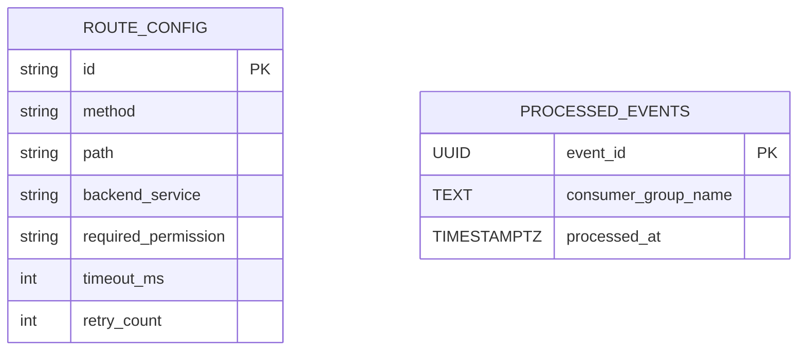

# 📃 API Gateway - Data Model

## 1. Giới thiệu

Tài liệu này mô tả chi tiết mô hình dữ liệu của **API Gateway**, là một core service trong hệ thống `dx-vas`, đóng vai trò trung gian proxy routing các API request từ client tới backend service tương ứng, đồng thời thực thi RBAC, validate JWT, các chính sách cache, rate limit, v.v.

Mô hình dữ liệu của Gateway nhằm hỗ trợ các chức năng chính sau (như mô tả trong `design.md`):
- `route_config`: cung cấp dữ liệu cấu hình cho `Routing Engine`, `RBAC Policy Enforcement`, `Timeout Handler`, `Retry Logic`.
- `processed_events`: phục vụ `Idempotency Module` khi xử lý webhook callback hoặc các tác vụ async sử dụng Pub/Sub (nếu áp dụng trong tương lai).


**API Gateway** không quản lý dữ liệu nghệp vụ phức tạp, nhưng có một số bảng cần thiết cho việc:

* Quản lý cấu hình route và access control.
* Đảm bảo idempotency cho Pub/Sub message.
* Hỗ trợ cache permission rule hoặc metadata từ config center.

## 2. Phạm vi Dữ liệu Quản lý (Scope)

* Route config: mapping URL path → backend, RBAC requirement.
* Cấu hình runtime: throttling, timeout, retry.
* Metadata cache: các permission rule từ User Service Master.
* Audit idempotency: processed\_events.

## 3. Ngoài Phạm Vi (Out of Scope)

* ✖️ Dữ liệu user hoặc session (do Auth Service quản lý).
* ✖️ RBAC runtime context chi tiết (do service backend đồng quyết).
* ✖️ Event log chi tiết (sử dụng Audit Logging Service).

## 4. Mục tiêu của Tài liệu Mô hình Dữ liệu

* Trình bày chi tiết route config và processed event.
* Phục vụ cho module cache và validation route.
* Đồng nhất với `design.md`, `interface-contract.md`, `openapi.yaml` và các ADRs (như ADR-007, ADR-011, ADR-023).

---

## 5. ERD (Entity Relationship Diagram)



---

## 6. Chi tiết Bảng

### 📌 Bảng: `route_config`

#### 📏 Mục đích

Quản lý toàn bộ route được Gateway proxy, kèm theo backend đích danh, quy tắc timeout, retry, và permission yêu cầu.

#### 📜 `CREATE TABLE`

```sql
CREATE INDEX idx_route_path_method ON route_config(path, method);
CREATE TABLE route_config (
    id TEXT PRIMARY KEY,
    method TEXT NOT NULL,
    path TEXT NOT NULL,
    backend_service TEXT NOT NULL,
    required_permission TEXT,
    timeout_ms INTEGER DEFAULT 3000,
    retry_count INTEGER DEFAULT 2,
    created_at TIMESTAMPTZ DEFAULT now() NOT NULL,
    updated_at TIMESTAMPTZ DEFAULT now() NOT NULL
);
```

#### 🧰 Giải thích cột

| Cột                  | Kiểu DL     | Ràng buộc        | Mô tả                                              |
| -------------------- | ----------- | ---------------- | -------------------------------------------------- |
| id                   | TEXT        | PK               | Mã duy nhất cho route (có thể dựa vào path+method) |
| method               | TEXT        | NOT NULL         | HTTP method: GET, POST, ...                        |
| path                 | TEXT        | NOT NULL         | Route path pattern, vd `/users/**`                 |
| backend\_service     | TEXT        | NOT NULL         | Tên service backend đồng hành                      |
| required\_permission | TEXT        | optional         | Mã permission yêu cầu (theo ADR-007)               |
| timeout\_ms          | INTEGER     | DEFAULT          | Timeout theo ms khi gọi backend                    |
| retry\_count         | INTEGER     | DEFAULT          | Số lần retry khi backend timeout                   |
| created\_at          | TIMESTAMPTZ | DEFAULT NOT NULL | Ngày tạo                                           |
| updated\_at          | TIMESTAMPTZ | DEFAULT NOT NULL | Ngày update cuối                                   |

### 🔄 Bảng: `processed_events`

Ghi nhận ID sự kiện đã xử lý để đảm bảo idempotency khi consume Pub/Sub.

#### 🧹 Chính sách lưu trữ & xóa dữ liệu
- Dữ liệu trong bảng `processed_events` được lưu trữ tối đa 30 ngày.
- Batch job định kỳ (ví dụ: mỗi tuần) sẽ xóa các bản ghi cũ hơn 30 ngày nhằm tối ưu dung lượng lưu trữ và tốc độ truy vấn.

```sql
CREATE TABLE processed_events (
    event_id UUID PRIMARY KEY,
    consumer_group_name TEXT NOT NULL,
    processed_at TIMESTAMPTZ DEFAULT now() NOT NULL
);
```

---

## 7. Phụ lục

### A. Chính sách Cache

* Permission rules từ User Service Master được cache theo tenant+path+method
* TTL: 15 phút; Invalidation: TTL, manual flush, và lắng nghe thay đổi Firestore hoặc config file

### B. Liên kết ADRs:

* [ADR-007: RBAC Dynamic Strategy](./adr-007-rbac.md)
* [ADR-011: API Error Format](./adr-011-api-error-format.md)
* [ADR-023: Schema Migration](./adr-023-schema-migration-strategy.md)

### C. Liên kết tài liệu khác:

* [Thiết kế service](./design.md)
* [Interface contract](./interface-contract.md)
* [OpenAPI spec](./openapi.yaml)
