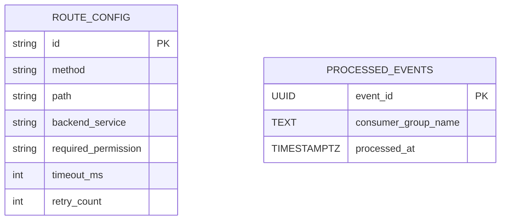

# 📃 API Gateway - Data Model

## 1. Giới thiệu

Tài liệu này mô tả mô hình dữ liệu của **API Gateway**, một core service trong hệ sinh thái DX-VAS đóng vai trò như một điểm vào tập trung cho tất cả các frontend apps. Gateway thực hiện proxy định tuyến đến backend service tương ứng, đồng thời enforce RBAC, xác thực JWT, ghi log và thu thập metrics phục vụ observability.

---

### 🎯 Mục tiêu của mô hình dữ liệu

Khác với các service nghiệp vụ khác, API Gateway không duy trì cơ sở dữ liệu quan hệ phức tạp.  
Thay vào đó, kiến trúc của Gateway phụ thuộc gần như hoàn toàn vào **các lớp cache thông minh**, với thời gian truy xuất siêu nhanh và khả năng invalidate động. Mô hình dữ liệu của Gateway được thiết kế để:

- **Định tuyến chính xác** request đến backend phù hợp qua `route_config`
- **Thực thi phân quyền tốc độ cao** qua `rbac` rule được cache
- **Ngăn chặn token bị thu hồi** thông qua `revoked` token cache
- **Xác thực JWT hiệu quả** bằng cách cache JWKS key từ `token-service`
- **Tự động làm mới** thông tin khi có thay đổi cấu hình nhờ vào TTL hoặc Pub/Sub

---

### 📦 Phân loại state chính

| Loại dữ liệu       | Lưu ở đâu?      | Mục đích chính                                      |
|--------------------|-----------------|-----------------------------------------------------|
| Route config       | Redis (`routes:`) | Tra cứu định tuyến → backend tương ứng              |
| Permission RBAC    | Redis (`rbac:`)   | Kiểm tra phân quyền theo user_id + tenant_id        |
| Token revoked      | Redis (`revoked:`)| Xác minh token đã bị thu hồi chưa (JTI)            |
| JWKS Key           | Redis (`jwks:`)   | Cache public key verify JWT, giảm gọi `token-service` |
| Processed Events   | PostgreSQL        | Ghi nhận các event đã xử lý để đảm bảo idempotency |

---

> 🔍 Gateway có thể hoạt động gần như toàn bộ trên RAM nếu Redis cache đủ hit-rate, giúp đạt hiệu năng tuyến đầu ~10.000 RPS.

## 2. Phạm vi Dữ liệu Quản lý (Scope)

Dữ liệu mà API Gateway quản lý được chia thành hai loại chính:

- **Stateful ngắn hạn (ephemeral cache):** lưu trữ trong Redis, chủ yếu phục vụ hiệu năng thời gian thực, có TTL ngắn và có thể tái tạo từ hệ thống gốc (stateless sync).
- **Stateful dài hạn (persistence):** lưu trữ trong PostgreSQL, chủ yếu phục vụ mục đích đảm bảo tính đúng đắn (idempotency, log) cho các kịch bản async hoặc Pub/Sub.

---

### 2.1. 🔁 Redis Cache – phục vụ hiệu năng thời gian thực

| Key Pattern               | Mục đích                                                          | TTL mặc định |
|---------------------------|-------------------------------------------------------------------|--------------|
| `routes:{path}:{method}`  | Tra cứu định tuyến: route → backend service, timeout, retry      | 300 giây     |
| `rbac:{user_id}:{tenant}` | Danh sách permission đã resolved của user trong tenant           | 300 giây     |
| `revoked:{jti}`           | Kiểm tra token đã bị thu hồi                                      | 180 giây     |
| `jwks:public_key`         | Cache public JWKS key từ `token-service` để xác thực JWT         | 600 giây     |

- Mọi cache đều có thể bị invalidated bởi TTL, hoặc chủ động qua Pub/Sub (ví dụ: `rbac.updated`).
- Gateway sẽ **fallback tự động** nếu cache miss (gọi `user-sub`, `token-service`...).

---

### 2.2. 🗃️ PostgreSQL – phục vụ tính đúng đắn & log kỹ thuật

| Bảng dữ liệu           | Mục đích                                                                |
|------------------------|-------------------------------------------------------------------------|
| `route_config`         | Quản lý route rule, timeout, retry, RBAC yêu cầu cho mỗi endpoint       |
| `processed_events`     | Lưu dấu vết event đã xử lý để chống xử lý lại (idempotency)             |

---

> 📌 Các cấu trúc dữ liệu trong cache luôn được đồng bộ hoặc tái tạo từ các hệ thống gốc (User Service, Token Service, Config Center…).  
> Gateway không sở hữu quyền quyết định cuối cùng với dữ liệu nghiệp vụ – nó chỉ là **cơ chế điều phối tốc độ cao và đáng tin cậy.**

---

###  2.3. Bảng Tổng Hợp Redis Cache – Cấu Trúc & Ví Dụ

Redis là nơi lưu trữ toàn bộ state ngắn hạn để tăng hiệu năng xử lý tuyến đầu của API Gateway. Dưới đây là mô tả chi tiết từng key pattern, cấu trúc dữ liệu và ví dụ minh họa.

---

#### 🔑 Key: `routes:{path}:{method}`

**Mục đích:**  
Tra cứu cấu hình định tuyến của route (timeout, retry, backend, permission…)

**Cấu trúc JSON:**
```json
{
  "backend": "user-service.master",
  "x-required-permission": "user.read",
  "x-condition": {
    "user_id": "{{X-User-ID}}"
  },
  "timeout": 3000,
  "retry": 2
}
```

**TTL mặc định:** 300 giây
**Cơ chế cập nhật:** Polling file `route_config.json` hoặc lắng nghe Pub/Sub `route_config.updated`

---

#### 🔑 Key: `rbac:{user_id}:{tenant_id}`

**Mục đích:**
Lưu danh sách permission của user theo tenant – được resolve từ `user-sub`.

**Cấu trúc JSON:**

```json
{
  "user_id": "u123",
  "tenant_id": "t456",
  "permissions": [
    "user.read",
    "user.update.self",
    "report.view_summary"
  ],
  "resolved_at": "2025-06-10T11:33:00Z"
}
```

**TTL mặc định:** 300 giây
**Cơ chế invalidate:** TTL hoặc lắng nghe sự kiện `rbac.updated` (Pub/Sub)

---

#### 🔑 Key: `revoked:{jti}`

**Mục đích:**
Kiểm tra xem token đã bị thu hồi chưa. Được set sau khi gọi `token/introspect` hoặc khi người dùng logout.

**Giá trị:** `"true"` hoặc `"false"`

**Ví dụ:**

```
Key: revoked:7a99e531-2aeb-4c4d-8440-33513f5fc123
Value: "true"
```

**TTL mặc định:** 180 giây
**Cơ chế ghi:** Ghi khi revoke hoặc sau khi introspect token

---

#### 🔑 Key: `jwks:public_key`

**Mục đích:**
Cache JWKS từ `token-service` để xác thực chữ ký JWT offline.

**Cấu trúc JSON (rút gọn):**

```json
{
  "keys": [
    {
      "kty": "RSA",
      "kid": "key-001",
      "use": "sig",
      "alg": "RS256",
      "n": "...",
      "e": "AQAB"
    }
  ],
  "fetched_at": "2025-06-10T11:40:00Z"
}
```

**TTL mặc định:** 600 giây
**Cơ chế refresh:** TTL hết hạn hoặc trigger từ `jwt.jwks.rotated`

---

> ✅ Tất cả các cache Redis đều có thể bị flush thủ công bằng CLI, hoặc tự động hóa bằng cron/task theo config TTL.
> ✅ Mọi Redis key nên được monitor qua metrics: hit/miss ratio, TTL remaining, size.

---

## 3. Ngoài Phạm Vi (Out of Scope)

API Gateway không sở hữu dữ liệu nghiệp vụ, không quyết định quyền truy cập cuối cùng, cũng không giữ bất kỳ thông tin người dùng hay session nào.  
Dưới đây là các loại dữ liệu hoặc logic **không nằm trong phạm vi quản lý** của mô hình dữ liệu Gateway:

* ✖️ Dữ liệu người dùng, xác thực danh tính

    - Không lưu thông tin user (profile, role, trạng thái...)
    - Không xử lý đăng nhập, cấp token, xác thực danh tính (do `auth-service` và `token-service` đảm nhiệm)

* ✖️ Cơ sở dữ liệu nghiệp vụ

    - Không lưu danh sách lớp, bài học, báo cáo, hợp đồng, học sinh...
    - Gateway chỉ proxy request đến service có DB riêng

* ✖️ Session, trạng thái người dùng

    - Gateway không quản lý phiên làm việc (session) hay token store
    - Không có bảng lưu session hoặc login state

* ✖️ Event log chi tiết

    - Gateway không lưu lại chi tiết log request/response vào DB
    - Việc audit log và phân tích hành vi người dùng được chuyển giao cho `audit-logging-service`

* ✖️ Logic phân quyền tùy ngữ cảnh nghiệp vụ

    - Gateway chỉ enforce permission + `x-condition` đã định nghĩa trong `route_config`
    - Các điều kiện nghiệp vụ nâng cao (ví dụ: “chỉ admin của tổ chức X mới được duyệt báo cáo Y”) sẽ do backend xử lý

---

> ✅ Điều này đảm bảo Gateway giữ được tính chất stateless và hiệu năng cao, không bị lệ thuộc vào state nghiệp vụ hoặc bị phình to không kiểm soát.

---

## 4. Mục tiêu của Tài liệu Mô hình Dữ liệu

Tài liệu này được biên soạn nhằm mô tả đầy đủ, chính xác và dễ hiểu các cấu trúc dữ liệu được sử dụng bởi API Gateway — bao gồm cả phần được lưu trong Redis (cache ngắn hạn) và PostgreSQL (lưu trữ dài hạn, phục vụ idempotency).

---

### 🎯 Mục đích chính

- **Chuẩn hoá kiến thức kỹ thuật** cho toàn bộ đội ngũ (backend, SRE, QA) về cách Gateway sử dụng và tổ chức dữ liệu.
- **Định nghĩa rõ cấu trúc các Redis key** và TTL tương ứng để phục vụ tuning hiệu năng, observability, và scaling.
- **Đảm bảo đồng bộ với thiết kế hệ thống** (`design.md`, `interface-contract.md`, `openapi.yaml`) và các quyết định kiến trúc (`ADR-007`, `ADR-011`, `ADR-023`).
- **Làm tài liệu tham khảo chính thức** cho việc xây dựng các script monitor, alerting, flush CLI, cũng như hướng dẫn SRE khi troubleshooting.

---

### 📚 Mục tiêu phụ trợ

- Là nền tảng để:
  - Viết các test kiểm tra consistency của Redis cache
  - Xây dựng dashboard Prometheus về cache hit/miss theo loại key
  - Thiết kế hệ thống autoscaling dựa trên số lượng key active

---

> 📌 Đây không phải là tài liệu thiết kế schema DB truyền thống, mà là **"Sơ đồ bộ nhớ phân tán"** của một service tuyến đầu — nơi mà cache chính là trung tâm xử lý tốc độ cao.

---

## 5. ERD (Entity Relationship Diagram)


**📎 Ghi chú**

* **`ROUTE_CONFIG`** mô phỏng một bảng cấu hình định tuyến nội bộ.
  Trên thực tế, cấu hình route được load từ file JSON (`route_config.json`) hoặc external source (GCS, Firestore…), sau đó được Gateway parse, cache vào Redis (key `routes:{path}:{method}`) và sử dụng tại runtime.

* **`PROCESSED_EVENTS`** là bảng vật lý trong PostgreSQL.
  Dùng để đảm bảo **idempotency** khi xử lý các sự kiện từ Pub/Sub, đặc biệt với các action bất đồng bộ (async). Việc lưu lại `event_id` theo từng `consumer_group` giúp tránh xử lý trùng khi retry.

* Gateway không có bảng dữ liệu nghiệp vụ, cũng không chứa foreign key hoặc relationship phức tạp — mục tiêu là **truy cập nhanh, định tuyến đúng, không state dài hạn.**

---

## 6. Chi tiết Bảng

Phần này mô tả chi tiết cấu trúc và mục đích của hai bảng dữ liệu chính mà API Gateway sử dụng trong PostgreSQL: `route_config` và `processed_events`.

---

### 6.1. 📌 Bảng: `route_config`

#### 📏 Mục đích
Lưu trữ cấu hình định tuyến được Gateway tải về từ external config (JSON, GCS, Firestore…).  
Phục vụ cho `Routing Engine`, `RBAC Policy`, `Timeout Handler`, và `Retry Logic`.

#### 🧾 Định nghĩa bảng

```sql
CREATE TABLE route_config (
    id TEXT PRIMARY KEY,
    method TEXT NOT NULL,
    path TEXT NOT NULL,
    backend_service TEXT NOT NULL,
    required_permission TEXT,
    timeout_ms INTEGER DEFAULT 3000,
    retry_count INTEGER DEFAULT 2,
    created_at TIMESTAMPTZ DEFAULT now() NOT NULL,
    updated_at TIMESTAMPTZ DEFAULT now() NOT NULL
);

CREATE INDEX idx_route_path_method ON route_config(path, method);
```

#### 🧰 Giải thích cột

| Cột                   | Kiểu DL     | Ràng buộc     | Mô tả                                                          |
| --------------------- | ----------- | ------------- | -------------------------------------------------------------- |
| `id`                  | TEXT        | PK            | Mã định danh duy nhất cho route (có thể dùng hash path+method) |
| `method`              | TEXT        | NOT NULL      | HTTP method áp dụng: GET, POST, PUT...                         |
| `path`                | TEXT        | NOT NULL      | Pattern URL, ví dụ: `/users/**` hoặc `/auth/login`             |
| `backend_service`     | TEXT        | NOT NULL      | Tên định danh backend service (theo định danh nội bộ)          |
| `required_permission` | TEXT        | optional      | Mã permission yêu cầu (áp dụng RBAC)                           |
| `timeout_ms`          | INTEGER     | DEFAULT       | Timeout (milliseconds) khi proxy đến backend                   |
| `retry_count`         | INTEGER     | DEFAULT       | Số lần retry nếu backend không phản hồi                        |
| `created_at`          | TIMESTAMPTZ | DEFAULT NOW() | Timestamp tạo bản ghi                                          |
| `updated_at`          | TIMESTAMPTZ | DEFAULT NOW() | Timestamp cập nhật cuối cùng                                   |

---

### 6.2. 🔄 Bảng: `processed_events`

#### 📏 Mục đích

Ghi nhận các sự kiện Pub/Sub đã được xử lý để **đảm bảo idempotency** – tránh xử lý lặp trong trường hợp message bị gửi lại (retry).

#### 🧾 Định nghĩa bảng

```sql
CREATE TABLE processed_events (
    event_id UUID PRIMARY KEY,
    consumer_group_name TEXT NOT NULL,
    processed_at TIMESTAMPTZ DEFAULT now() NOT NULL
);
```

#### 🧹 Chính sách TTL & Dọn dẹp

* Dữ liệu trong bảng `processed_events` được lưu tối đa **30 ngày**.
* Batch job (cron, Airflow, pg\_cron...) sẽ xóa các bản ghi quá hạn để giữ bảng nhẹ, truy vấn nhanh.

#### 🧰 Giải thích cột

| Cột                   | Kiểu DL     | Ràng buộc     | Mô tả                                               |
| --------------------- | ----------- | ------------- | --------------------------------------------------- |
| `event_id`            | UUID        | PK            | Mã duy nhất của sự kiện từ Pub/Sub hoặc queue       |
| `consumer_group_name` | TEXT        | NOT NULL      | Tên định danh consumer (theo tenant hoặc chức năng) |
| `processed_at`        | TIMESTAMPTZ | DEFAULT NOW() | Thời điểm Gateway đánh dấu sự kiện đã xử lý         |

---

> ✅ Cả hai bảng đều được thiết kế để phục vụ mục tiêu tốc độ, đơn giản hóa kiểm soát và hỗ trợ các batch job vận hành (xóa TTL, reload config…).

---

## 7. Phụ lục

Phần phụ lục này tổng hợp lại toàn bộ chiến lược cache, TTL, và liên kết đến các tài liệu kiến trúc có liên quan, giúp đội ngũ phát triển và vận hành dễ dàng tra cứu, đồng bộ và debug hệ thống Gateway.

---

### 7.1. 🔄 Chiến lược Cache

API Gateway hoạt động theo nguyên tắc **cache ưu tiên – fallback khi cần thiết** để đảm bảo hiệu năng tuyến đầu. Dưới đây là chiến lược cụ thể cho từng loại dữ liệu:

| Cache Key Pattern         | TTL   | Nguồn fallback                     | Cơ chế invalidate                 |
|---------------------------|-------|-------------------------------------|-----------------------------------|
| `routes:{path}:{method}`  | 300s  | File `route_config.json` / GCS     | Reload định kỳ / PubSub `route.updated` |
| `rbac:{uid}:{tid}`        | 300s  | `user-sub` service                  | PubSub `rbac.updated`             |
| `revoked:{jti}`           | 180s  | `token-service/introspect`         | Khi logout hoặc introspect fail  |
| `jwks:public_key`         | 600s  | JWKS endpoint từ `token-service`   | PubSub `jwt.jwks.rotated`         |

---

### 7.2. 🧩 Cấu hình Redis đề xuất

- **Mode:** Redis cluster hoặc Sentinel
- **Eviction Policy:** `volatile-lru` (ưu tiên xóa key gần hết TTL)
- **Monitoring:** Prometheus Redis Exporter: `cache_hit_rate`, `key_expired_total`, `memory_usage`
- **Alert:** TTL xuống thấp bất thường hoặc miss rate > 5%

---

### 7.3. 🔗 Tài liệu liên kết

| Chủ đề                            | File                                     |
|----------------------------------|------------------------------------------|
| Thiết kế tổng thể hệ thống       | `docs/README.md`                         |
| Thiết kế chi tiết Gateway        | `docs/services/api-gateway/design.md`    |
| Giao diện hợp đồng Gateway       | `docs/services/api-gateway/interface-contract.md` |
| Chuẩn hóa lỗi & phản hồi         | `docs/ADR/adr-011-api-error-format.md`, `adr-012-response-structure.md` |
| Phân quyền động RBAC             | `docs/architecture/rbac-deep-dive.md`    |
| Chiến lược JWT & revoked tokens | `docs/services/token-service/design.md`  |
| Quản lý TTL & event cache        | `docs/ADR/adr-023-schema-migration-strategy.md` |

---

### 7.4. 📝 Ghi chú mở rộng

- Redis cache KHÔNG được xem là nguồn dữ liệu chính. Mọi dữ liệu có thể bị mất cache và sẽ được tự động tái tạo từ hệ thống gốc.
- TTL ngắn + kiểm soát thông minh giúp Gateway cân bằng giữa hiệu năng và tính đúng đắn.
- Mọi access tới Redis nên được wrap qua RedisClient có trace + metric Prometheus.

> 📌 Tài liệu này sẽ được cập nhật tự động khi có thay đổi từ các ADR hoặc service phụ thuộc.

