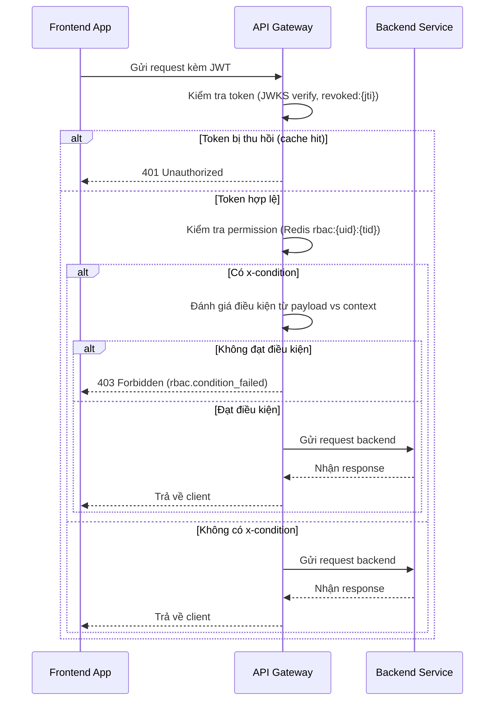

# 📘 Thiết kế chi tiết API Gateway

## 1. 🧭 Phạm vi và Trách nhiệm (Scope & Responsibilities)

### 🌟 Mục tiêu

API Gateway là điểm truy cập duy nhất cho tất cả frontend apps trong hệ thống DX-VAS.  
Nó đóng vai trò trung gian giữa client và backend services với các trách nhiệm chính:

- Xác thực token (JWT) và kiểm tra quyền truy cập (RBAC) trên từng route.
- Định tuyến yêu cầu đến các backend tương ứng dựa trên file cấu hình.
- Chuẩn hóa phản hồi lỗi từ backend theo chuẩn hệ thống (ADR-011).
- Ghi log, xuất metrics và trace phục vụ mục đích observability.

### 📦 Các thực thể dữ liệu quản lý

| Thực thể             | Mô tả                                                                 |
|----------------------|-----------------------------------------------------------------------|
| Route Config         | Định tuyến endpoint → backend service, phương thức, quyền yêu cầu    |
| RBAC Rule Cache      | Permission của user/tenant, lưu tạm trong Redis để xử lý nhanh        |
| Revoked Token Cache  | Danh sách `jti` đã bị thu hồi, để xác định token không còn hợp lệ     |
| JWT JWKS Cache       | Public key JWKS lấy từ Auth Service để xác thực chữ ký JWT           |

> 🔧 File cấu hình route (`ROUTE_CONFIG_PATH`) có định dạng JSON, ví dụ:
```json
{
  "/users/**": {
    "method": ["GET", "POST"],
    "backend": "user-service.master",
    "x-required-permission": "user.view",
    "x-condition": {
      "user_id": "{{X-User-ID}}"
    },
    "timeout": 3000,
    "retry": 2
  }
}
```

### 🔒 Ngoài Phạm Vi (Out of Scope)

API Gateway **không thực hiện các chức năng sau**:

* ❌ Logic nghiệp vụ của backend (ví dụ: xử lý dữ liệu người dùng, báo cáo, v.v.)
* ❌ Lưu trữ dữ liệu domain (user, bài học, điểm danh...)
* ❌ Cấp phát hoặc refresh token (được thực hiện bởi `token-service`)
* ❌ Thay thế hệ thống phân quyền (RBAC logic được enforce dựa trên Redis/cache)
* ❌ Giao tiếp trực tiếp giữa frontend và backend (tất cả đều đi qua Gateway)

---

## 2. 🌐 Thiết kế API chi tiết (Interface Contract)

API Gateway không định nghĩa OpenAPI riêng cho từng route, nhưng phải thực hiện mapping và kiểm soát truy cập theo cấu hình động (Route Config). Các route này có thể thay đổi theo cấu hình JSON bên ngoài (đồng bộ từ GCS, Firestore, hoặc service discovery).

### 📌 Các loại API proxy phổ biến

| Method | Path Pattern      | Mô tả chức năng                           | Quyền yêu cầu               |
|--------|-------------------|--------------------------------------------|-----------------------------|
| ALL    | `/users/**`       | Proxy tới User Service (Master/Sub)        | Theo `x-required-permission` trong route config |
| ALL    | `/auth/**`        | Proxy tới Auth Service (Master/Sub)        | Theo route config           |
| ALL    | `/report/**`      | Proxy tới Reporting Service                | Theo yêu cầu template       |
| ALL    | `/<domain>/**`    | Proxy tới service tương ứng theo config    | Kiểm tra permission động   |

### 🔁 Chuẩn hóa lỗi trả về (theo ADR-011)

Khi backend trả lỗi không đúng chuẩn, Gateway sẽ bắt và biến đổi thành cấu trúc lỗi chuẩn của toàn hệ thống:

#### Ví dụ:
```json
// Lỗi gốc từ backend
{
  "message": "Database down",
  "code": 5021
}

// Gateway biến đổi:
{
  "meta": {
    "code": 502,
    "message": "BAD_GATEWAY",
    "error_type": "upstream.backend_error",
    "trace_id": "abc-123",
    "service": "api-gateway",
    "timestamp": "2025-06-10T12:34:56Z"
  },
  "error": {
    "reason": "Database down",
    "details": null
  }
}
```

### 🧩 Headers được yêu cầu / Forward

| Header          | Mục đích                                          |
| --------------- | ------------------------------------------------- |
| `Authorization` | Chứa JWT token người dùng gửi lên                 |
| `X-User-ID`     | ID người dùng, lấy từ payload JWT                 |
| `X-Tenant-ID`   | ID tenant, dùng để enforce phân quyền đa tenant   |
| `X-Trace-ID`    | Dùng để trace toàn hệ thống                       |
| `X-Service`     | Backend được gọi (thêm vào log hoặc response lỗi) |
| `X-Permissions` | (Tuỳ chọn) danh sách quyền đã resolved từ cache   |

> ⚠️ Lỗi 403 do sai permission hoặc không thoả điều kiện `x-condition` cần ghi rõ trong `meta.error_type = "rbac.permission_denied"` hoặc `"rbac.condition_failed"`.

> **Chi tiết:** [Interface Contract](./interface-contract.md) & [OpenAPI](./openapi.yaml)

---

## 3. 📃 Mô hình dữ liệu chi tiết (Data Model)

API Gateway là một service stateless, không sử dụng cơ sở dữ liệu quan hệ.  
Tuy nhiên, nó phụ thuộc vào các lớp **cache** để xử lý hiệu quả và đảm bảo hiệu năng. Dưới đây là mô hình dữ liệu cấp cache và cấu hình:

### 📦 Redis Cache

| Key Pattern                        | Mô tả                                                                 |
|-----------------------------------|------------------------------------------------------------------------|
| `routes:{path}:{method}`          | Cấu hình định tuyến tương ứng với một endpoint cụ thể (timeout, retry, backend, permission) |
| `rbac:{user_id}:{tenant_id}`      | Danh sách permission đã resolved cho người dùng theo tenant           |
| `revoked:{jti}`                   | Token đã bị thu hồi, dùng để kiểm tra nhanh access token              |
| `jwks:public_key`                 | JWKS caching từ Auth Service để verify token                          |

- TTL mặc định cho mỗi key: **300 giây (5 phút)**  
- Có thể config riêng TTL cho revoked token và permission để tối ưu trade-off giữa hiệu năng và độ cập nhật.

### 🔧 Cấu hình Route động (Route Config)

Được đồng bộ từ file ngoài (Firestore, GCS bucket…) về Gateway.  
File định dạng JSON chứa toàn bộ các định tuyến và quy tắc permission:

#### Ví dụ:
```json
{
  "/users/{id}": {
    "method": ["PATCH"],
    "backend": "user-service.master",
    "x-required-permission": "user.update",
    "x-condition": {
      "user_id": "{{X-User-ID}}"
    }
  }
}
```

* Các biến `{{...}}` được binding runtime từ header hoặc payload để so sánh với `x-condition`.
* Việc binding và kiểm tra logic điều kiện phải thực hiện tại Gateway (theo chuẩn RBAC condition của `rbac-deep-dive.md`).

### 🔄 Chiến lược Invalidation Cache

Để đảm bảo hệ thống luôn dùng permission và route config cập nhật mới nhất:

* Redis cache có TTL tự động hết hạn sau 5 phút
* Admin có thể xóa thủ công bằng CLI/API nội bộ
* **Hỗ trợ Pub/Sub** (khuyến nghị):

  * Khi service `user-sub` phát event `rbac.updated`, Gateway lắng nghe và xóa `rbac:{user_id}:{tenant_id}`
  * Event này được định nghĩa rõ trong ADR-030

#### Ví dụ payload event:

```json
{
  "event": "rbac.updated",
  "user_id": "u-123",
  "tenant_id": "t-456",
  "trace_id": "abc-xyz"
}
```

> **Chi tiết sơ đồ ERD, định nghĩa bảng và chiến lược kiểm thử dữ liệu được trình bày tại**:  
📂 [Data Model](./data-model.md)

---

## 4. 🔄 Luồng xử lý nghiệp vụ chính (Business Logic Flows)

API Gateway thực hiện vai trò trung gian giữa frontend apps và các backend service.  
Dưới đây là các luồng xử lý chính cần mô tả rõ để đảm bảo triển khai thống nhất.

---

### 🚦 Luồng: `Proxy Request API`



---

### 🧠 Luồng: `RBAC với điều kiện động`

* Một số route yêu cầu kiểm tra điều kiện ví dụ `user_id == self`, `org_id in allowed_orgs`.
* Các điều kiện này được định nghĩa trong `x-condition` và binding runtime từ headers/path/body.

Ví dụ cấu hình:

```json
"x-condition": {
  "user_id": "{{X-User-ID}}"
}
```

Quy trình:

1. Gateway parse `x-condition` từ route config
2. Extract giá trị tương ứng từ header/path/body
3. So sánh: nếu không khớp → trả lỗi 403 `rbac.condition_failed`

---

### 📥 Luồng: `Cache Miss → Fallback`

* Nếu Redis `rbac:{uid}:{tid}` **không có**, Gateway có thể fallback gọi tới `user-sub` để lấy permission realtime (tuỳ config).
* Sau đó cache lại với TTL mặc định.

---

### 🔁 Luồng: `Route Config Reload`

* Cấu hình route được tải định kỳ từ GCS/Firestore hoặc cập nhật theo thời gian thực qua subscription.
* Khi có thay đổi, Gateway sẽ:

  * Ghi log `config_change_detected`
  * Làm mới cache `routes:{path}:{method}`
  * (Tuỳ chọn) phát log audit về thay đổi cấu hình.

---

## 5. 📣 Pub/Sub Events

API Gateway là một thành phần **không phát sinh sự kiện nghiệp vụ**, nhưng có vai trò **tiêu thụ (consume)** hoặc **phản ứng** với các sự kiện hệ thống quan trọng để đảm bảo tính nhất quán và cập nhật.

### 🟢 Sự kiện cần lắng nghe

#### 1. `rbac.updated`
- Được phát bởi: `user-sub` khi có thay đổi phân quyền (gán/bỏ role, permission)
- Mục đích: Xoá cache Redis key `rbac:{user_id}:{tenant_id}` để cập nhật quyền truy cập mới

```json
{
  "event": "rbac.updated",
  "user_id": "u-123",
  "tenant_id": "t-456",
  "trace_id": "abc-xyz"
}
```

📌 Gateway cần triển khai 1 trong 2 cơ chế:

* Subscriber nội bộ (Redis Pub/Sub, NATS, GCP Pub/Sub…)
* Webhook receiver thông qua Cloud Run / Function triggered từ Pub/Sub

---

### 🟡 Sự kiện hỗ trợ tiềm năng (khuyến nghị tương lai)

#### 2. `route_config.updated`

* Khi route file trong GCS/Firestore thay đổi (thông qua listener hoặc hash diff)
* Gateway nên:

  * Làm mới cache các entry `routes:*`
  * Log audit: `"Route config reloaded by event"`

#### 3. `jwt.jwks.rotated`

* Khi `token-service` xoay public key (key rotation), cần đảm bảo JWKS cache tại Gateway được làm mới

---

### 🔁 Forward `trace_id` vào context hệ thống

Mặc dù Gateway không phát Pub/Sub event nghiệp vụ, **nó có trách nhiệm truyền `trace_id` xuyên suốt toàn hệ thống**, bao gồm:

| Context                | Hành vi                                                     |
| ---------------------- | ----------------------------------------------------------- |
| Request đến backend    | Thêm header `X-Trace-ID`, `X-User-ID`, `X-Tenant-ID`        |
| Response lỗi chuẩn hóa | Trả trong `meta.trace_id`, `meta.service`, `meta.timestamp` |
| Logging                | Mọi log cần đính kèm trace ID cho mục đích truy vết         |

---

## 6. 🔐 Bảo mật & Phân quyền

API Gateway là tuyến phòng vệ đầu tiên giữa frontend và hệ thống backend, do đó các cơ chế xác thực và kiểm soát truy cập (RBAC) phải được triển khai chặt chẽ, đồng bộ và hiệu quả.

---

### 🔑 Xác thực JWT

- Gateway xác thực token từ header `Authorization` (Bearer JWT)
- Sử dụng JWKS (JSON Web Key Set) lấy từ `token-service` để verify chữ ký
- Cache JWKS trong Redis (key: `jwks:public_key`) và tự động refresh theo TTL hoặc trigger từ `jwt.jwks.rotated` event
- Token được kiểm tra chống revoked qua Redis key `revoked:{jti}`

---

### 🛑 Kiểm tra thu hồi (Revocation Check)

- Nếu `revoked:{jti}` tồn tại → token không hợp lệ → trả về 401 Unauthorized
- Nếu key không tồn tại:
  - Fallback gọi `token-service/introspect` để xác minh
  - Nếu token hợp lệ → cache lại `revoked:{jti}=false` với TTL

---

### 🔐 Kiểm soát phân quyền (RBAC)

- Dựa vào `x-required-permission` trong route config:
  - Gateway lấy danh sách permission từ Redis key: `rbac:{user_id}:{tenant_id}`
  - Nếu không có → gọi `user-sub` để resolve và cache lại

#### Cấu trúc ví dụ:
```json
{
  "/users/{id}": {
    "method": ["PATCH"],
    "x-required-permission": "user.update",
    "x-condition": {
      "user_id": "{{X-User-ID}}"
    }
  }
}
```

* Nếu không có quyền → trả về 403 Forbidden với `meta.error_type = rbac.permission_denied`

---

### 🔎 Điều kiện phân quyền (RBAC Condition)

* Một số route yêu cầu kiểm tra điều kiện động (VD: `user_id == self`)
* Điều kiện được binding từ headers, path, hoặc payload
* Nếu không đạt → trả lỗi 403 với `error_type = rbac.condition_failed`

---

### 🧩 Forward headers quan trọng

| Header          | Mục đích                                |
| --------------- | --------------------------------------- |
| `X-User-ID`     | Định danh người dùng                    |
| `X-Tenant-ID`   | Phân vùng tenant                        |
| `X-Trace-ID`    | Truy vết request                        |
| `X-Permissions` | (Tuỳ chọn) danh sách quyền (đã resolve) |

---

### 📉 Xử lý lỗi chuẩn hoá (ADR-011)

Tất cả lỗi xác thực hoặc phân quyền được chuẩn hoá theo `ErrorEnvelope`:

```json
{
  "meta": {
    "code": 403,
    "message": "FORBIDDEN",
    "error_type": "rbac.condition_failed",
    "trace_id": "xyz-789",
    "service": "api-gateway",
    "timestamp": "2025-06-10T12:34:56Z"
  },
  "error": {
    "reason": "Access denied due to condition mismatch",
    "details": null
  }
}
```

---

## 7. ⚙️ Cấu hình & Phụ thuộc

API Gateway được thiết kế theo nguyên tắc **stateless và dễ cấu hình** qua biến môi trường, không phụ thuộc trực tiếp vào bất kỳ cơ sở dữ liệu nào.

---

### 🔧 Biến môi trường chính

| Biến                  | Mô tả                                                                 |
|------------------------|----------------------------------------------------------------------|
| `JWT_PUBLIC_JWKS_URL` | URL JWKS từ `token-service` để verify chữ ký JWT                    |
| `REDIS_URL`           | Kết nối tới Redis cache cho revoked token, RBAC rule và route config |
| `ROUTE_CONFIG_PATH`   | Đường dẫn tới file JSON định tuyến (GCS URL, Firestore path…)        |
| `RBAC_ENABLED`        | Bật/tắt phân quyền RBAC ở layer gateway (default: true)              |
| `JWKS_CACHE_TTL`      | TTL cache public key JWKS (giây)                                     |
| `REVOCATION_TTL`      | TTL cho cache `revoked:{jti}`                                        |
| `RBAC_CACHE_TTL`      | TTL cho cache `rbac:{uid}:{tid}`                                     |

---

### 🔗 Phụ thuộc hệ thống

| Thành phần           | Mục đích sử dụng                                       |
|----------------------|--------------------------------------------------------|
| **token-service**    | Cung cấp JWKS public key và API `/token/introspect`   |
| **user-sub**         | Cung cấp permission thực tế nếu cache không có        |
| **Redis**            | Lưu trữ cache: revoked token, RBAC, route config      |
| **Firestore / GCS**  | Lưu trữ tệp cấu hình định tuyến động                  |
| **Pub/Sub**          | Lắng nghe `rbac.updated` và các sự kiện khác để invalidation cache |

---

### 7.1 🧩 Thành phần nội bộ

| Module                    | Chức năng chính                                                       |
|---------------------------|------------------------------------------------------------------------|
| `JWT Validation Engine`   | Xác thực token, kiểm tra chữ ký với JWKS                              |
| `RBAC Policy Engine`      | Kiểm tra quyền, evaluate condition từ `x-condition`                   |
| `Route Resolver`          | Mapping path/method → backend, permission                            |
| `Request Filter`          | Gắn thêm header (`X-Trace-ID`, `X-Tenant-ID`, …) vào request          |
| `Response Formatter`      | Biến đổi lỗi từ backend về định dạng chuẩn hóa (ADR-011)              |
| `Revocation Checker`      | Kiểm tra token bị thu hồi (`revoked:{jti}`)                           |
| `Cache Client`            | Đọc/ghi Redis cho route, RBAC, revoked, jwks                         |
| `PubSub Listener`         | Xử lý các sự kiện như `rbac.updated` để tự động xóa cache tương ứng  |

---

## 8. 🧪 Testing

Việc kiểm thử API Gateway cần bao phủ đầy đủ các luồng xử lý chính bao gồm xác thực, phân quyền, định tuyến, xử lý lỗi và observability. Hệ thống cần có cả kiểm thử đơn vị (unit) và tích hợp (integration) để đảm bảo chất lượng.

---

### ✅ Unit Tests

| Thành phần                   | Mục tiêu kiểm thử                                              |
|-----------------------------|---------------------------------------------------------------|
| Route Resolver              | Kiểm tra ánh xạ path/method → backend và permission           |
| JWT Validation Engine       | Kiểm tra verify JWT, cache JWKS và xử lý key rotation         |
| RBAC Policy Engine          | Kiểm tra phân quyền theo `x-required-permission`, `x-condition` |
| Error Formatter             | Kiểm tra chuẩn hóa lỗi từ backend → `ErrorEnvelope`           |
| Revocation Checker          | Kiểm tra cache `revoked:{jti}` và fallback sang introspect    |

---

### 🔁 Integration Tests

| Kịch bản                                    | Mô tả                                                        |
|--------------------------------------------|---------------------------------------------------------------|
| ✅ Proxy thành công                         | Request hợp lệ → định tuyến đúng, trả về response backend     |
| ✅ Token hết hạn / sai chữ ký               | Trả về 401 Unauthorized                                       |
| ✅ Token bị thu hồi                         | Cache hit `revoked:{jti}` → 401 Unauthorized                 |
| ✅ Không đủ permission                      | Trả về 403 Forbidden với `error_type: rbac.permission_denied` |
| ✅ Không đạt điều kiện RBAC                 | Trả về 403 Forbidden với `error_type: rbac.condition_failed`  |
| ✅ Lỗi backend không chuẩn hóa              | Gateway tự động map lỗi về định dạng chuẩn ADR-011           |
| ✅ Forward header                           | Đảm bảo các header như `X-Trace-ID`, `X-User-ID`, `X-Tenant-ID` được chuyển tiếp đúng |
| ✅ Cache miss → fallback RBAC               | Redis miss → gọi `user-sub` để resolve quyền → thành công    |
| ✅ Invalidate cache qua Pub/Sub             | Nhận sự kiện `rbac.updated` → xóa đúng key trong Redis       |

---

### 🧪 Công cụ đề xuất

- **pytest**, **unittest** (Python)
- **WireMock**, **MockServer** cho giả lập backend trong integration test
- **Redis mock** để giả lập các trạng thái cache (revoked, rbac)
- **Postman/Newman**: viết test end-to-end kèm kịch bản lỗi
- **Locust** hoặc **k6**: test hiệu năng/độ trễ khi route tới nhiều backend

---

### 📌 Mục tiêu coverage

- Unit test coverage ≥ **90%**
- Integration test bao phủ toàn bộ **luồng chính + lỗi biên + cache**

---

## 9. 📈 Observability

API Gateway là điểm đầu tiên tiếp nhận mọi request, nên khả năng quan sát (observability) là bắt buộc để đảm bảo hiệu suất, bảo mật và dễ chẩn đoán sự cố.

---

### 📊 Metrics đề xuất (Prometheus hoặc tương đương)

| Tên metric                              | Loại    | Mô tả                                                             |
|----------------------------------------|---------|-------------------------------------------------------------------|
| `api_gateway_request_total`            | Counter | Tổng số request nhận vào Gateway                                 |
| `api_gateway_request_duration_seconds` | Histogram | Thời gian xử lý request chia theo path/backend/status_code     |
| `api_gateway_permission_denied_total`  | Counter | Số lượng request bị từ chối do thiếu permission                 |
| `api_gateway_condition_failed_total`   | Counter | Số lượng request bị từ chối do không đạt điều kiện `x-condition` |
| `api_gateway_revoked_token_total`      | Counter | Số token bị từ chối do đã bị revoke                              |
| `api_gateway_backend_error_total`      | Counter | Số lỗi do backend trả về (5xx)                                   |

> 💡 Nên gắn label theo: `path`, `method`, `tenant_id`, `backend_service`

---

### 📜 Logging

| Thông tin cần log                        | Ghi chú                                                                 |
|------------------------------------------|-------------------------------------------------------------------------|
| `trace_id`                               | Sinh nếu chưa có, xuyên suốt toàn hệ thống                             |
| `user_id`, `tenant_id`                   | Trích xuất từ JWT hoặc header                                           |
| `path`, `method`, `status_code`          | Mỗi request                                                             |
| `duration_ms`                            | Đo thời gian xử lý                                                      |
| `permission_checked`, `rbac_result`      | Thông tin kiểm tra quyền, kể cả pass/fail                              |
| `condition_checked`, `condition_result`  | Nếu có `x-condition`, ghi rõ giá trị kiểm tra và kết quả               |

> ⚠️ Không log access token, refresh token hoặc thông tin nhạy cảm (theo ADR-004 Security)

---

### 📈 Tracing (OpenTelemetry hoặc tương đương)

- Gateway cần tạo span gốc (`root span`) nếu request không có `trace_id`
- Forward trace context qua `X-Trace-ID`, hoặc `traceparent` nếu dùng W3C Trace Context
- Mỗi chặng như `RBAC check`, `Revoked token lookup`, `Proxy call` cần tạo span riêng

---

### 🧪 Alerting (gợi ý rule)

| Tên cảnh báo                       | Điều kiện                                                                 |
|-----------------------------------|---------------------------------------------------------------------------|
| ❗ Backend error rate cao          | `api_gateway_backend_error_total{job="gw"}/api_gateway_request_total > 5%` trong 5 phút |
| ❗ Permission denied spike         | Tăng đột biến trong `api_gateway_permission_denied_total`                |
| ❗ Tốc độ phản hồi giảm mạnh       | P95 `api_gateway_request_duration_seconds` > ngưỡng cho phép              |
| ❗ Redis không phản hồi            | Đếm lỗi Redis connect hoặc latency > 200ms                               |

> Tất cả observability cần được triển khai theo đúng chuẩn **ADR-004 Security** và **ADR-012 Response Structure**, đặc biệt là bảo vệ dữ liệu người dùng khi log hoặc trace.

---

## 10. 🔁 Reliability

API Gateway đóng vai trò trung gian cho mọi giao tiếp frontend → backend, nên phải đảm bảo độ tin cậy cao (high reliability) kể cả khi một phần hệ thống gặp sự cố. Dưới đây là các cơ chế đảm bảo tính sẵn sàng và phục hồi.

---

### ⏱️ Timeout & Retry

- Mỗi route trong cấu hình có thể khai báo `timeout` và `retry` riêng biệt.
- Nếu không khai báo, áp dụng mặc định:  
  - `timeout`: 3000ms  
  - `retry`: 1 lần, theo cơ chế exponential backoff

> ⚠️ Retry chỉ nên áp dụng cho các method **idempotent** như `GET`, `HEAD`, `OPTIONS`.

---

### 🧯 Xử lý lỗi backend

- Gateway tự động bắt lỗi backend trả về (5xx) và chuẩn hóa theo `ADR-011`
- Ghi log chi tiết `trace_id`, backend service, error message
- Metric `api_gateway_backend_error_total` tăng theo từng lỗi

---

### 💥 Isolate từng route/backend

- Nếu một backend service (VD: `report-service`) gặp lỗi liên tục, không ảnh hưởng tới các route khác
- Mỗi route nên chạy trong context độc lập (thread pool hoặc async task per route)

---

### 🧰 Cơ chế fallback (tuỳ chọn mở rộng)

- Cho phép chỉ định `fallback_backend` nếu backend chính không phản hồi
- Hoặc gửi thông báo lỗi có thể hiểu được từ Gateway thay vì lỗi raw 5xx

---

### 🚨 Circuit Breaker (nên tích hợp)

- Sau X lần lỗi liên tục, tạm ngưng gọi backend đó trong Y giây
- Ghi log audit: `"Circuit opened for backend: user-service.master"`

> Có thể dùng thư viện như **resilience4j**, **envoy rate limit**, hoặc Redis lock custom.

---

### 🧼 Graceful Degradation

- Với các lỗi không nghiêm trọng (ví dụ mất log, mất trace) → không ảnh hưởng xử lý chính
- Log cảnh báo thay vì lỗi hệ thống

---

### 🔄 Tự động reload cấu hình

- Khi tệp route config thay đổi (qua polling hoặc Pub/Sub), Gateway reload cấu hình mà không cần restart
- Cấu hình Redis TTL để tránh stale cache

---

### 🔗 Health Check & Ready Check

- `/healthz` – kiểm tra Gateway hoạt động bình thường
- `/readyz` – kiểm tra kết nối Redis, tải route config, JWKS success

Response ví dụ:

```json
{
  "status": "ok",
  "redis": "connected",
  "jwks": "valid",
  "route_config": "loaded"
}
```

---

## 11. ⚡️ Hiệu năng & Scale

API Gateway được thiết kế để phục vụ hàng ngàn request mỗi giây với độ trễ thấp, khả năng mở rộng ngang, và không có điểm nghẽn đơn. Dưới đây là các chiến lược đảm bảo hiệu năng và khả năng mở rộng của Gateway.

---

### 🧱 Kiến trúc stateless

- Mọi state (RBAC, route config, token revoked, JWKS…) đều được cache qua Redis hoặc cấu hình từ ngoài.
- Cho phép **scale ngang dễ dàng** theo mô hình container (Kubernetes, Cloud Run…).

---

### 🔁 Caching chiến lược

- **Redis cache** giúp giảm phụ thuộc vào `user-sub`, `token-service`, GCS/Firestore
- TTL mặc định cho mỗi loại cache:
  - `rbac:{uid}:{tid}` → 300s
  - `revoked:{jti}` → 180s
  - `jwks:public_key` → 600s
  - `routes:{path}:{method}` → 300s
- Có thể invalidate theo event Pub/Sub (`rbac.updated`, `jwt.jwks.rotated`)

---

### 🧠 Xử lý RBAC tại chỗ

- Toàn bộ logic RBAC và điều kiện `x-condition` được xử lý ngay tại Gateway → không cần call backend
- Điều kiện được đánh giá tại runtime, ví dụ: `"user_id": "{{X-User-ID}}"`

---

### 🔀 Load balancing nội bộ

- Với mỗi backend, có thể cấu hình backend alias để Gateway phân tải giữa nhiều địa chỉ nội bộ
- Tùy chọn sticky session hoặc round-robin tùy theo nhu cầu

---

### 📉 Tối ưu phản hồi lỗi

- Thay vì trả lỗi từ backend, Gateway chuẩn hóa lỗi ngay sau bước phân quyền/token fail
- Tránh tốn tài nguyên backend không cần thiết

---

### ⚡ Gợi ý công nghệ triển khai

| Thành phần               | Gợi ý triển khai                         |
|--------------------------|------------------------------------------|
| Server core              | FastAPI, Express.js, Go Fiber…           |
| Reverse proxy (nếu cần)  | NGINX, Envoy (trước Gateway)             |
| Cache                    | Redis cluster                            |
| Trace                    | OpenTelemetry + Tempo / Zipkin / Jaeger  |
| Metrics                  | Prometheus + Grafana                     |

---

### 📏 Benchmark mục tiêu

| Mục tiêu                         | Giá trị khuyến nghị                          |
|----------------------------------|---------------------------------------------|
| P95 latency                      | < 100ms                                      |
| Throughput                       | > 1000 requests/sec trên 1 instance nhỏ      |
| Cache hit rate (RBAC + revoked) | ≥ 95%                                        |
| Redis latency                    | < 5ms                                        |
| Cold start JWKS verify           | < 300ms (trong trường hợp key cache miss)   |

---

## 12. 📚 Tài liệu liên quan

* [Interface Contract](./interface-contract.md)
* [Data Model](./data-model.md)
* [OpenAPI Spec](./openapi.yaml)
- [ADR-011: API Error Format](../../ADR/adr-011-api-error-format.md)
- [ADR-012: Response Structure](../../ADR/adr-012-response-structure.md)
- [RBAC Deep Dive](../../architecture/rbac-deep-dive.md)
