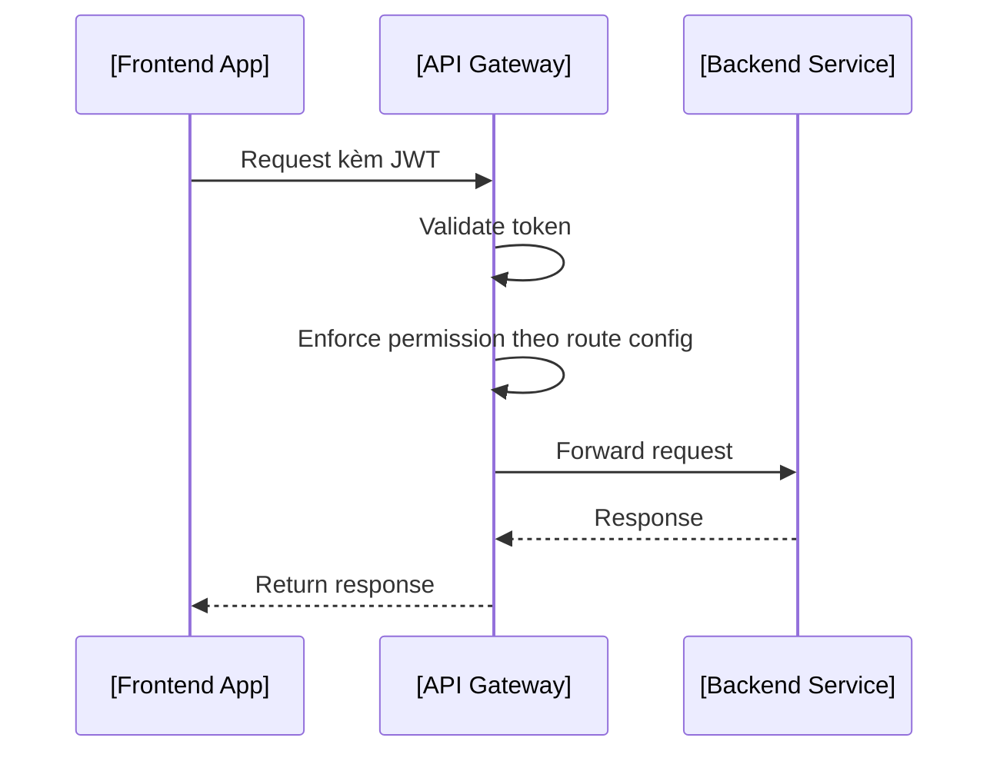

# 📘 Thiết kế chi tiết API Gateway

```
title: Thiết kế chi tiết API Gateway
version: "1.1"
last_updated: "2025-06-03"
author: "VAS Core DX Team"
reviewed_by: "Stephen Le"
```

## 1. 🧭 Phạm vi và Trách nhiệm (Scope & Responsibilities)

### 🌟 Mục tiêu

- Cung cấp một điểm truy cập duy nhất cho toàn bộ các frontend apps của hệ thống dx-vas.
- Đảm nhận vai trò validate JWT, enforce RBAC permission trên các route của backend services.
- Ghi log, audit truy cập và expose metrics về request/API latency.

### 📦 Các thực thể dữ liệu quản lý

| Thực thể | Mô tả |
|----------------|--------|
| Request mapping | Mapping giữa endpoint -> service backend tương ứng |
| Access Control Rule | Danh sách permission yêu cầu cho từng API route |
| Service Registry (cache) | Cache cấu hình routing đồng bộ từ config center |

> 🔎 File cấu hình route (`ROUTE_CONFIG_PATH`) thường ở dạng JSON có format như sau:
```json
{
  "/users/**": {
    "method": ["GET", "POST"],
    "backend": "user-service.master",
    "x-required-permission": "user.view",
    "timeout": 3000,
    "retry": 2
  }
}
```

### 🔒 Ngoài Phạm Vi (Out of Scope)

- ❌ Thực hiện logic nghiệp vụ backend.
- ❌ Lưu trữ trực tiếp dữ liệu người dùng hoặc domain data.
- ❌ Xử lý permission theo ngữu cảnh chi tiết (việc này do gateway thực hiện theo header).
- ❌ Gọi trực tiếp các service backend (chỉ proxy qua Gateway).

## 2. 🌐 Thiết kế API chi tiết (Interface Contract)

| Method | Path                  | Tác vụ proxy                      | Yêu cầu permission          |
|--------|-----------------------|-------------------------------------|-------------------------------|
| ALL    | `/users/**`           | Proxy User Service Master/Sub       | Theo cấu hình route rule     |
| ALL    | `/auth/**`            | Proxy Auth Service Master/Sub       | Theo cấu hình route rule     |
| ALL    | `/report/**`          | Proxy Reporting Service             | Theo template yêu cầu         |

📌 Ví dụ chuyển lỗi không chuẩn từ backend:
```json
// Backend trả lỗi không chuẩn
{
  "message": "Internal failure",
  "code": 5001
}

// Gateway transform thành:
{
  "meta": {
    "code": 500,
    "message": "INTERNAL_SERVER_ERROR",
    "error_type": "upstream.gateway_proxy",
    "trace_id": "abc-123"
  },
  "error": {
    "reason": "Internal failure",
    "details": null
  }
}
```

> ✨ Gateway không cần define schema OpenAPI như backend, nhưng cần mapping error theo ADR-011.

## 3. 📃 Mô hình dữ liệu chi tiết (Data Model)

Gateway không duy trì database mà dùng Redis Cache + Config từ config center (VD: Firestore hoặc GCS).

Cache bao gồm:
- Danh sách permission theo route
- Cấu hình định tuyến (service name, timeout, retry)

Chiến lược invalidation:
- TTL cho mỗi cache key (default 5 phút)
- Cho phép trigger manual flush qua Admin CLI/API nếu cần
- (Khuyến nghị mở rộng) Có thể thiết lập **subscription tới sự kiện thay đổi** trong config center (ví dụ: Firestore listener, GCS Pub/Sub) để **tự động xóa cache** khi cấu hình route được cập nhật.

## 4. 🔄 Luồng xử lý nghiệp vụ chính (Business Logic Flows)

### Luồng: `Proxy Request API`


## 5. 📣 Pub/Sub Events

> Gateway không consume/publish event, tuy nhiên có thể forward trace_id trong header.

## 6. 🔐 Bảo mật & Phân quyền

- Validate JWT với public key từ Auth Service
- Header forwarding: `X-User-ID`, `X-Tenant-ID`, `X-Permissions`
- Permission enforced theo route config (dựa vào path, method)

## 7. ⚙️ Cấu hình & Phụ thuộc

| Biến | Vai trò |
|--------|------|
| `JWT_PUBLIC_KEY` | Dùng để verify JWT |
| `REDIS_URL` | Cache route config & permission rule |
| `ROUTE_CONFIG_PATH` | Tập tin cấu hình routes (VD: GCS json) |

### 7.1 🧩 Thành phần nội bộ

| Module | Chức năng |
|--------|-----------|
| `JWT Validation Engine` | Xác thực token client gửi lên |
| `RBAC Policy Enforcement` | Kiểm tra permission dựa theo route config |
| `Routing Engine` | Mapping endpoint -> service tương ứng |
| `Request/Response Filter` | Biến đổi header hoặc chuẩn hóa lỗi |
| `Rate Limiting Module` | (Tùy chọn) kiểm soát tốc độ truy cập |
| `Cache Client` | Lưu trữ route rule & permission trong Redis |

## 8. 🧪 Testing

- Unit test: Route matching, permission resolver
- Integration: Mock backend, test forward request/response

## 9. 📈 Observability

| Metric | Mô tả |
|--------|------|
| `api_gateway_request_duration_seconds` | Thời gian xử lý request |
| `api_gateway_permission_denied_total` | Số request bị từ chối |

> ✨ Log bao gồm: trace_id, path, status, user_id, tenant_id

## 10. 🔁 Reliability

- Timeout và retry từ client đến backend
- Log lỗi chi tiết và response chuẩn theo ADR-011

## 11. ⚡️ Hiệu năng & Scale

- Stateless, scale ngang dễ dàng
- Redis cố định TTL cho permission

## 12. 📚 Tài liệu liên quan

- [ADR-011: API Error Format](../../ADR/adr-011-api-error-format.md)
- [ADR-012: Response Structure](../../ADR/adr-012-response-structure.md)
- [RBAC Deep Dive](../../architecture/rbac-deep-dive.md)
