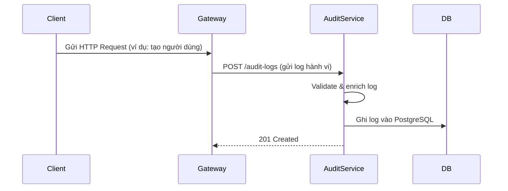
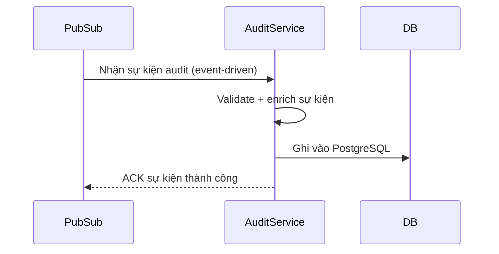
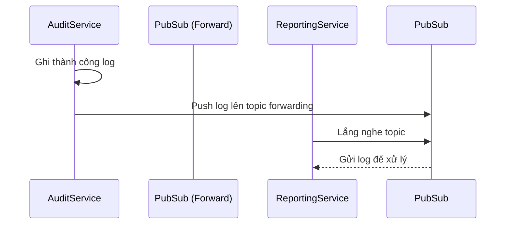
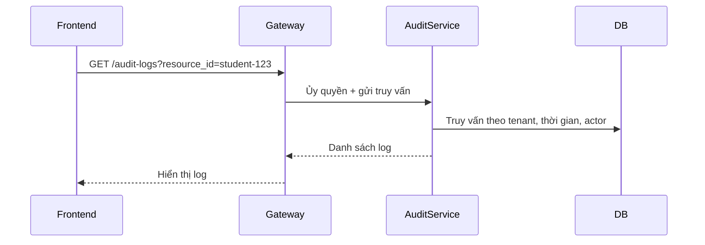
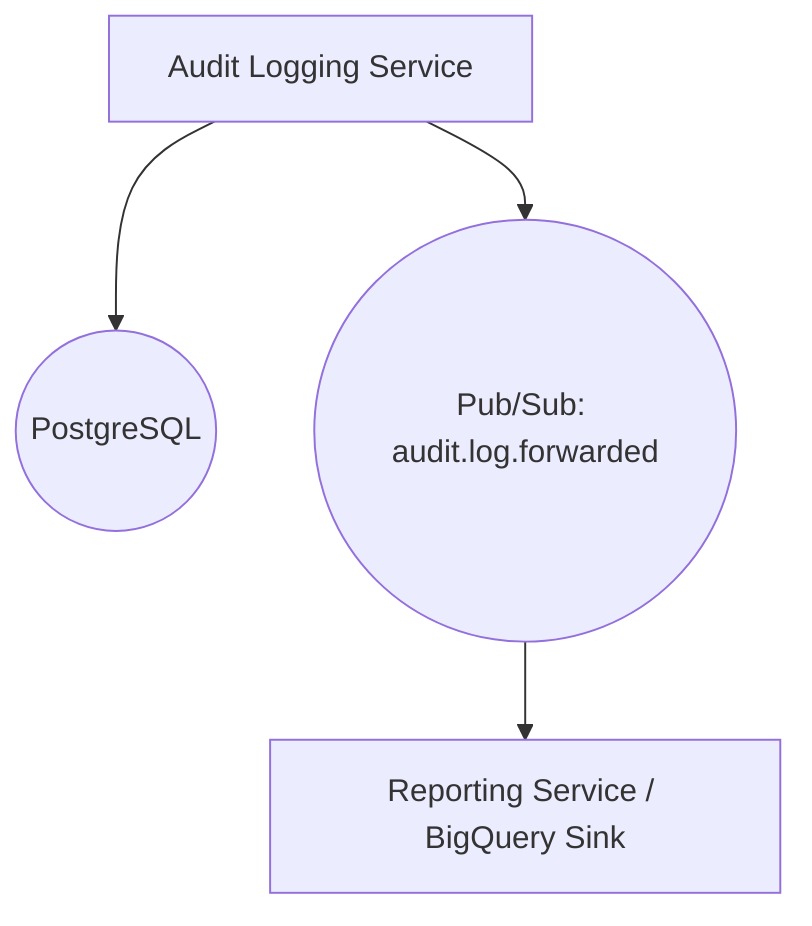
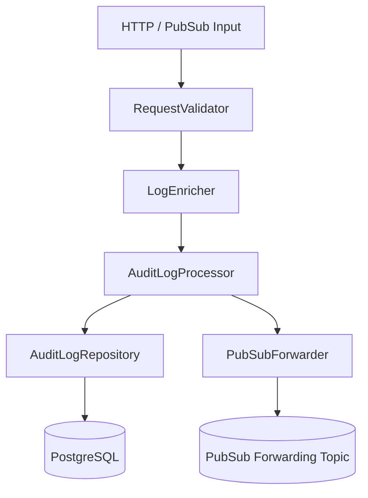

# 📘 Thiết kế chi tiết Audit Logging Service

## 1. 🧭 Phạm vi và Trách nhiệm (Scope & Responsibilities)

### 🎯 Mục tiêu
- Ghi nhận toàn bộ hành vi người dùng và các thay đổi hệ thống dưới dạng log chuẩn.
- Cho phép truy xuất, lọc và phân tích log phục vụ mục tiêu bảo mật, audit và phân tích hành vi.
- Lưu trữ log một cách hiệu quả và có thể mở rộng, tuân thủ chính sách lưu trữ và kiểm tra của nhà trường.

### 📦 Các thực thể dữ liệu quản lý
| Thực thể           | Mô tả                                                                 |
|--------------------|----------------------------------------------------------------------|
| `audit_logs`       | Ghi nhận mọi hành vi truy cập và thay đổi dữ liệu từ user và service khác. |
| `log_event_types`  | Danh mục các loại sự kiện (read, create, update, delete, login, logout, ...). |
| `log_targets`      | Danh mục resource (entity) liên quan đến log (user, student, course, ...). |

### 🔒 Ngoài Phạm Vi
- ❌ Không lưu trữ toàn bộ payload nội dung dữ liệu đã thay đổi.
- ❌ Không thay thế hệ thống logging nội bộ (stderr, stdout).
- ❌ Không cung cấp dashboard phân tích (do Reporting Service đảm nhiệm).
- ❌ Không xử lý authorization.

### 👥 Đối tượng sử dụng / Client chính
- API Gateway (ghi log mỗi request)
- Các service backend (gửi log từ business logic)
- Superadmin Webapp (xem và tra cứu log)

---

## 2. 🌐 Thiết kế API chi tiết

| Method | Path              | Tác vụ                              | Yêu cầu permission (RBAC)      |
|--------|-------------------|-------------------------------------|--------------------------------|
| GET    | /audit-logs       | Lấy danh sách log                   | ✅ `audit.read.logs`           |
| GET    | /audit-logs/{id}  | Lấy chi tiết log                    | ✅ `audit.read.logs`           |
| POST   | /audit-logs       | Ghi log mới (do service khác gọi)  | ✅ `audit.create.logs`         |

> 🔧 Tuân thủ chuẩn API của DX-VAS:
> - [ADR-011 - API Error Format](../../ADR/adr-011-api-error-format.md)
> - [ADR-012 - Response Structure](../../ADR/adr-012-response-structure.md)
> - [ADR-013 - Path Naming Convention](../../ADR/adr-013-path-naming-convention.md)
> - [ADR-030 - Event Schema Governance](../../ADR/adr-030-event-schema-governance.md)

> 📂 Chi tiết đầy đủ sẽ được định nghĩa trong [Interface-Contract](./interface-contract.md)
---

## 3. 🗃️ Mô hình Dữ liệu Chi tiết

Audit Logging Service sử dụng cơ sở dữ liệu **PostgreSQL**, với chiến lược **append-only**, không xoá hay sửa bản ghi log nhằm đảm bảo tính toàn vẹn, truy vết, và audit-ready.

### 🔑 Bảng chính: `audit_logs`

| Cột               | Kiểu DL      | Ràng buộc        | Mô tả                                               |
|------------------|--------------|------------------|-----------------------------------------------------|
| `id`             | UUID         | PRIMARY KEY      | Mã định danh duy nhất cho mỗi bản ghi log           |
| `timestamp`      | TIMESTAMP    | NOT NULL         | Thời gian ghi nhận hành động                        |
| `actor_id`       | TEXT         | NOT NULL         | ID của người thực hiện hành động (user_id, service)|
| `actor_type`     | TEXT         | NOT NULL         | Phân biệt `user`, `system`, `service`              |
| `tenant_id`      | TEXT         | NOT NULL         | Mã tenant – dùng để phân vùng dữ liệu               |
| `action`         | TEXT         | NOT NULL         | Hành động (user.create, course.delete, ...)         |
| `resource`       | TEXT         | NOT NULL         | Tên entity bị tác động (users, classes, ...)        |
| `resource_id`    | TEXT         | NULLABLE         | ID entity bị tác động (nếu có)                      |
| `meta`           | JSONB        | NULLABLE         | Chi tiết bổ sung (thay đổi giá trị, IP, trình duyệt)|
| `request_id`     | TEXT         | NULLABLE         | `X-Request-ID` phục vụ tracing                      |
| `created_by_service` | TEXT     | NOT NULL         | Ghi nhận service gọi log (auth-service, gateway...) |
| `tags`           | TEXT[]       | NULLABLE         | Danh sách nhãn để phân loại log                     |

> ✅ Index trên: `tenant_id`, `timestamp`, `action`, `resource_id`  
> ✅ Dữ liệu truy vấn chính theo: `tenant_id` + `timestamp` hoặc `actor_id`  
> ✅ Có thể extend để lưu log phân tầng theo `context_id` (nếu liên quan đến tenant hierarchy trong tương lai)

---

### 🔧 Bảng phụ trợ (enum cấu hình):

- `log_event_types`: định nghĩa các action hợp lệ
- `log_targets`: danh sách resource hỗ trợ audit
- Có thể mở rộng với bảng `log_tags` để hiển thị màu sắc/label trong UI

## 📦 Ví dụ mẫu `audit_log_entry`

Dưới đây là ví dụ cụ thể của một bản ghi log (`audit_log_entry`) sau khi được ghi nhận bởi hệ thống:

```json
{
  "id": "log_8f2a7c3e73",
  "timestamp": "2025-06-07T14:12:45.301Z",
  "actor_id": "u_12345",
  "actor_type": "user",
  "tenant_id": "vas_hn",
  "action": "user.update",
  "resource": "users",
  "resource_id": "u_12345",
  "meta": {
    "changed_fields": ["email", "role"],
    "old_values": {
      "email": "old@example.com",
      "role": "student"
    },
    "new_values": {
      "email": "new@example.com",
      "role": "admin"
    }
  },
  "ip_address": "203.113.134.23",
  "user_agent": "Mozilla/5.0 (Macintosh; Intel Mac OS X 10_15_7)",
  "request_id": "req-b63cf80f",
  "created_by_service": "user-service",
  "tags": ["critical", "ui-action"]
}
```

> 📂 Chi tiết đầy đủ sẽ được định nghĩa trong [Data Model](./data-model.md)

---

## 4. 🔄 Luồng Xử lý Nghiệp vụ Chính (Core Business Flow)

Audit Logging Service có nhiệm vụ trung tâm là **ghi nhận toàn bộ hành vi quan trọng** trong hệ thống DX-VAS một cách chuẩn hoá, có thể truy vết, phân tầng theo tenant, và phục vụ cho mục đích bảo mật, kiểm toán và phân tích.

Phần này mô tả chi tiết các luồng xử lý chính mà service này thực hiện.

---

### 4.1 🔁 Luồng ghi nhận log từ HTTP API

Được gọi từ các backend (user-service, auth-service, gateway...) khi có hành vi cần ghi lại.



* **Đặc điểm:**

  * Ghi log ngay sau khi hành động chính thành công
  * Có thể gửi song song (non-blocking) nếu service gọi hỗ trợ async
  * Bắt buộc có: `X-Request-ID`, `actor_id`, `tenant_id`, `action`, `resource_type`, `timestamp`

---

### 4.2 📩 Luồng ghi log qua Pub/Sub (event-driven)

Khi các service gửi sự kiện lên Pub/Sub topic `audit.log.requested`, Audit Service sẽ xử lý như sau:



* **Ưu điểm:**

  * Không phụ thuộc đồng bộ giữa các service
  * Cho phép batch log, log nền hoặc delayed log
  * Hạn chế lỗi do service audit quá tải

* **Ràng buộc:**

  * `event_id` là bắt buộc để xử lý idempotency
  * Topic được phân quyền chỉ định danh sách producer (qua IAM)

---

### 4.3 🚚 Luồng forward log sang downstream (BigQuery, Reporting)

Tùy cấu hình (`FORWARD_TO_PUBSUB=true`), sau khi ghi thành công, Audit Service có thể push log sang downstream topic để phục vụ phân tích hoặc báo cáo.



* **Downstream** có thể là:

  * Reporting Service (dùng log để hiển thị dashboard hành vi)
  * BigQuery (lưu trữ dài hạn và query nhanh)
  * Alerting service (phát hiện hành vi bất thường)

---

### 4.4 📄 Truy xuất log (Audit Dashboard hoặc qua API)

Khi người dùng cần truy vấn lại lịch sử hành vi (ví dụ: admin kiểm tra ai đã xoá học sinh), frontend sẽ gọi API như sau:



> 🧠 Frontend nên xử lý `pagination`, `filter`, và hiển thị thời gian + hành vi + actor + mô tả metadata

---

### 4.5 📦 Luồng TTL & Xoá dữ liệu cũ (Retention)

Dữ liệu log sẽ được giữ tối đa **180 ngày** (hoặc theo tenant policy), sau đó được xoá định kỳ bằng batch job hoặc scheduled query.

* PostgreSQL: sử dụng `DELETE FROM audit_logs WHERE timestamp < now() - interval '180 days'`
* Nếu dùng BigQuery: partition + TTL tự động xoá

---

## ✅ Kết luận

Luồng xử lý của Audit Logging Service được thiết kế theo triết lý:

* **API + Event-driven** song song → vừa realtime vừa async
* **Append-only + traceable** → không mất log, không log trùng
* **Hỗ trợ truy vấn dễ dàng** → phục vụ frontend & phân tích nội bộ
* **Tách biệt trách nhiệm ghi log và xử lý phân tích**

> "Log không chỉ để lưu – mà để tìm lại được, đúng lúc, đúng người, đúng hành động."

---

## 5. 📣 Tương tác với các Service khác & Luồng sự kiện

Audit Logging Service hoạt động như một **“blackbox ghi nhớ mọi thứ”** của hệ thống DX-VAS. Service không chủ động gọi đi, mà chỉ **tiếp nhận dữ liệu audit từ các thành phần khác** thông qua API hoặc Pub/Sub, đảm bảo decoupling và khả năng mở rộng về sau.

---

### 5.1 🧩 Tương tác Đồng bộ qua HTTP

| Service Gọi         | Method | Endpoint              | Tình huống Gọi                                                  |
|---------------------|--------|------------------------|------------------------------------------------------------------|
| `user-service`      | POST   | `/audit-logs`         | Khi user được tạo, sửa, xoá                                     |
| `auth-service`      | POST   | `/audit-logs`         | Khi người dùng login, logout, refresh token                     |
| `api-gateway`       | POST   | `/audit-logs`         | Tự động ghi lại toàn bộ truy cập API đầu vào                    |
| `notification-service` | POST | `/audit-logs`        | Khi gửi thông báo quan trọng (chấm điểm, học phí, kỷ luật...)   |
| `reporting-service` | POST   | `/audit-logs`         | Khi có truy vấn dữ liệu nhạy cảm (hồ sơ học sinh, thống kê nội bộ)|

✅ Mọi service phải gửi kèm: `X-Request-ID`, `X-Tenant-ID`, `X-User-ID` trong header hoặc payload → phục vụ traceability & phân quyền audit.

---

### 5.2 🔁 Tương tác Bất đồng bộ qua Pub/Sub

Audit Logging Service cũng hỗ trợ ghi log thông qua kênh sự kiện **Pub/Sub**, đặc biệt cho các hành động bulk hoặc không yêu cầu xác nhận ngay.

| Topic (subscriber)              | Format sự kiện                         | Nguồn phát (publisher)      | Ý nghĩa sử dụng                                  |
|----------------------------------|-----------------------------------------|------------------------------|--------------------------------------------------|
| `audit.log.requested`           | `global_audit_log_created.v1`          | `user-service`, `auth-service`, `api-gateway`...| Đẩy log từ hệ thống lên khi không cần ACK        |
| `audit.log.forwarded` (outbound)| Tương tự như payload POST /audit-logs  | Audit Logging Service        | Forward log cho các hệ thống downstream như BQ   |

> 🧠 Mục tiêu của Pub/Sub là tách luồng ghi log ra khỏi transactional flow → không ảnh hưởng hiệu năng

---

### 5.3 📡 Cấu hình và Chính sách xử lý sự kiện

| Chính sách                      | Mô tả                                                                 |
|---------------------------------|----------------------------------------------------------------------|
| Retry & dead-letter             | Nếu ghi log từ Pub/Sub thất bại → tự động retry và đẩy vào topic lỗi |
| Idempotency                     | Mỗi log cần có `event_id` để tránh log trùng nếu retry               |
| TTL Pub/Sub event               | Mỗi message tồn tại tối đa 24h, sau đó bị xoá nếu chưa xử lý         |
| Header validation (PubSub)      | Header `tenant_id`, `actor_id` phải được đính kèm theo schema chuẩn  |

---

### 5.4 🔄 Forwarding log tới downstream

Đối với các trường hợp cần lưu trữ dài hạn hoặc xử lý phân tích nâng cao (BigQuery, ELK, Data Lake...), Audit Logging Service sẽ **phát lại log đã ghi thành công** qua Pub/Sub outbound:



> ✅ Mọi log forwarded đều giữ nguyên cấu trúc + enrich đầy đủ metadata → hỗ trợ phân tích dễ dàng về sau.

---

## 6. 🔐 Bảo mật & Phân quyền

Audit Logging Service là trung tâm lưu trữ các dữ liệu hành vi nhạy cảm (login, update hồ sơ, xóa dữ liệu, v.v.), vì vậy **bảo mật và kiểm soát truy cập nghiêm ngặt** là yêu cầu bắt buộc. Phần này trình bày rõ các lớp bảo vệ áp dụng theo tiêu chuẩn `ADR-004 - Security Policy`, `ADR-007 - RBAC`, và `rbac-deep-dive.md`.

---

### 6.1 🔐 Xác thực (Authentication)

- Tất cả các endpoint của Audit Logging Service đều **yêu cầu xác thực JWT** (OAuth2 Bearer Token).
- Token phải được phát hành từ **Auth Service** chính thống, và chứa ít nhất các claim sau:
  - `sub` (user ID hoặc service ID)
  - `tenant_id` (bắt buộc để phân tầng dữ liệu)
  - `permissions`: danh sách quyền hiện tại của subject
- Mỗi request cần truyền qua header:
  - `Authorization: Bearer <JWT>`
  - `X-Tenant-ID`, `X-User-ID` (trong service call)

---

### 6.2 🧾 Phân quyền (Authorization - RBAC)

#### ✅ API phân quyền rõ ràng:
| Method | Endpoint           | Quyền yêu cầu (`x-required-permission`) |
|--------|--------------------|------------------------------------------|
| POST   | `/audit-logs`      | `audit.create.logs`                      |
| GET    | `/audit-logs`      | `audit.read.logs`                        |
| GET    | `/audit-logs/{id}` | `audit.read.logs`                        |

#### ✅ Luồng kiểm tra phân quyền:
1. Middleware đọc `permissions[]` từ JWT
2. So khớp với `x-required-permission` của endpoint
3. Nếu thiếu → trả lỗi `403 Forbidden` với thông báo rõ ràng

> 📌 Có thể override bằng `service-account-token` (khi gọi từ internal service) nếu đã được đăng ký qua config đặc biệt (whitelisted)

---

### 6.3 🧬 Phân tầng dữ liệu (Tenant Isolation)

- Mỗi bản ghi log luôn gắn với `tenant_id`
- Service tự động filter log theo `tenant_id` của caller → đảm bảo tenant A không truy cập được log của tenant B
- Truy cập log **multi-tenant (toàn hệ thống)** chỉ dành cho superadmin hoặc role `global.audit.viewer`

---

### 6.4 🔒 Bảo vệ dữ liệu nhạy cảm (Data Protection)

| Rủi ro                             | Biện pháp ứng phó                                              |
|-----------------------------------|-----------------------------------------------------------------|
| Ghi đè/ghi sai actor ID           | Actor ID luôn trích xuất từ JWT, không tin client gửi          |
| Log chứa dữ liệu cá nhân (PII)    | Không ghi `payload` hay dữ liệu gốc — chỉ metadata trong `meta`|
| Log bị sửa/xoá qua API            | API **không hỗ trợ update/delete log** (append-only model)     |
| Truy cập trái phép log nhạy cảm   | Bắt buộc kiểm tra permission và `tenant_id` trong mọi truy vấn  |

---

### 6.5 🧑‍💻 Ghi audit chính bản thân Audit Service

- Mọi truy cập tới endpoint `GET /audit-logs` (dashboard) cũng sẽ được **ghi log audit ngược lại**
- Điều này đảm bảo **không có hành vi tra cứu nào nằm ngoài tầm kiểm soát**, kể cả từ admin

---

### 6.6 🛡️ Các biện pháp bổ sung

| Biện pháp                         | Trạng thái     |
|----------------------------------|----------------|
| Header `X-Request-ID` bắt buộc   | ✅ Bắt buộc trong mọi request |
| JWT exp check & lifetime control | ✅ Theo config từ Auth Service |
| Rate limit API /logs             | ⏳ (khuyến nghị bổ sung sớm) |
| TLS encryption                   | ✅ Mọi traffic bắt buộc qua HTTPS |

---

## 📌 Tổng kết

Audit Logging Service là thành phần **nhạy cảm nhất về bảo mật** trong hệ thống DX-VAS. Thiết kế phân tầng, phân quyền và ghi log không thể sửa/xoá là trụ cột bảo vệ **trách nhiệm pháp lý và an toàn dữ liệu học sinh**.  
Bảo mật là một "bản chất", không phải một tùy chọn trong service này.

---

## 7. ⚙️ Cấu hình & Phụ thuộc (Configuration & Dependencies)

Audit Logging Service cần cấu hình rõ ràng và linh hoạt để hoạt động ổn định trong môi trường production, multi-tenant, và phù hợp với các ADRs về secrets, môi trường, và observability.

Tài liệu này tuân thủ theo:
- [ADR-005 - Environment Configuration](../../../ADR/adr-005-env-config.md)
- [ADR-003 - Secrets Management](../../../ADR/adr-003-secrets.md)
- [5s.dev.guide.standard.md > configuration-and-secrets.md](../../dev-guide/technical-guides/09-configuration-and-secrets.md)

---

### 7.1 🔧 Biến Môi Trường (Environment Variables)

| Biến                          | Bắt buộc | Mặc định      | Mô tả |
|-------------------------------|----------|---------------|-------|
| `ENV`                         | ✅        | `production`  | Chế độ hoạt động (`dev`, `staging`, `production`) |
| `PORT`                        | ✅        | `8000`        | Cổng HTTP lắng nghe |
| `LOG_LEVEL`                   | ❌        | `INFO`        | Mức độ ghi log: DEBUG, INFO, WARNING, ERROR        |
| `DATABASE_URL`                | ✅        | –             | Chuỗi kết nối PostgreSQL                           |
| `MAX_DB_CONNECTIONS`          | ❌        | `10`          | Số lượng kết nối DB tối đa                         |
| `PUBSUB_AUDIT_LOG_TOPIC`      | ✅        | –             | Tên topic Pub/Sub inbound để lắng nghe sự kiện     |
| `PUBSUB_FORWARDING_TOPIC`     | ❌        | –             | Topic outbound dùng forward log cho BigQuery/reporting |
| `FORWARD_TO_PUBSUB`           | ❌        | `false`       | Nếu `true`, service sẽ forward log sang Pub/Sub    |
| `SERVICE_NAME`                | ✅        | `audit-service`| Định danh service trong log/tracing               |
| `JWT_PUBLIC_KEY_PATH`         | ✅        | –             | Đường dẫn đến file chứa public key xác thực JWT   |
| `JWT_ALG`                     | ✅        | `RS256`       | Thuật toán xác thực JWT                            |
| `ALLOWED_SERVICE_CALLERS`     | ✅        | –             | Danh sách service ID được phép ghi log (dạng CSV)  |
| `ENABLE_METRICS_EXPORTER`     | ❌        | `true`        | Bật Prometheus exporter nếu cần                    |
| `TRACE_SAMPLING_RATE`         | ❌        | `0.1`         | Tỉ lệ ghi trace (nếu dùng OpenTelemetry)           |

> 📌 Mọi biến bắt buộc đều phải có `.env.example` kèm theo ghi chú.

---

### 7.2 🔐 Secrets & Bảo mật cấu hình

| Nhóm secrets cần quản lý            | Cách lưu trữ đề xuất             |
|-------------------------------------|----------------------------------|
| JWT public key (xác thực token)     | Lưu trong Secret Manager (GCP)   |
| DATABASE_URL (username + password) | Lưu trong Secret Manager hoặc thông qua environment injection từ CI/CD |
| Pub/Sub credentials (nếu cần)       | Gắn role cho Cloud Run (không hardcode) |

Tuân thủ theo [ADR-003 - Secrets Management](../../../ADR/adr-003-secrets.md)

---

### 7.3 🔄 Cấu hình động theo tenant (Advanced)

> 📌 Có thể bật sau MVP nếu cần hỗ trợ đa tenant mạnh hơn.

| Tính năng                         | Mô tả                                         |
|----------------------------------|-----------------------------------------------|
| TTL riêng cho từng tenant        | Tenant A lưu log 30 ngày, tenant B lưu 365 ngày |
| Bật/tắt forward log theo tenant  | Chỉ tenant cấp cao mới forward sang BigQuery  |
| Tag mapping UI theo tenant       | Label màu riêng cho audit dashboard từng trường|

Cấu hình này có thể được nạp qua `tenant_config_service` hoặc static JSON load theo cache.

---

### 7.4 🔗 Phụ thuộc hệ thống

| Thành phần         | Mục đích                                  | Cách tích hợp           |
|--------------------|--------------------------------------------|--------------------------|
| **PostgreSQL**     | Lưu trữ chính audit_logs                   | Cloud SQL (GCP) hoặc Docker local |
| **Pub/Sub**        | Giao tiếp bất đồng bộ                      | Subscribed topic `audit.log.requested` |
| **Reporting Service** | Downstream nhận forwarding logs        | Qua Pub/Sub hoặc HTTP |
| **Auth Service**   | Xác thực token                             | Public key qua secret |
| **Cloud Logging**  | Ghi log hoạt động của chính Audit Service | stdout/stderr → GCP Logs |
| **OpenTelemetry**  | Tracing request nội bộ (optional)         | Header injection → trace spans |

---

### 7.5 🛠️ Tự động hoá & Quản lý cấu hình

- Sử dụng `terraform` để định nghĩa biến môi trường & secret tại Cloud Run
- CI/CD inject `.env` cho môi trường `staging` & `production` qua GitHub Actions Secrets
- Mọi config thay đổi bắt buộc thông qua **merge request có review** (no manual ops)

---

## ✅ Kết luận

Audit Logging Service được cấu hình theo hướng:
- **An toàn mặc định** (secure-by-default)
- **Tách biệt secrets & config**
- **Dễ mở rộng đa tenant**
- **Tuân thủ nghiêm chuẩn ADR & Dev Guide**

Điều này đảm bảo service có thể triển khai dễ dàng, theo dõi ổn định và scale linh hoạt.

---

## 8. 🧪 Chiến lược Kiểm thử (Testing Strategy)

Audit Logging Service đóng vai trò trung tâm trong việc đảm bảo **tính minh bạch, truy vết và an toàn dữ liệu**. Vì vậy, cần một chiến lược kiểm thử toàn diện bao gồm các lớp từ unit đến integration và security testing.

---

### 8.1 ✅ Unit Tests

| Mục tiêu                         | Mô tả kiểm thử                                             |
|----------------------------------|------------------------------------------------------------|
| Ghi log hợp lệ                   | Kiểm tra `AuditLogProcessor` xử lý payload đúng định dạng |
| Trường bắt buộc thiếu            | Gửi thiếu `actor_id`, `tenant_id` → trả về lỗi rõ ràng    |
| Meta JSON format                 | Kiểm tra tính hợp lệ và lưu đúng của `meta` JSONB         |
| Log enrich từ headers            | Đảm bảo lấy đúng `X-Request-ID`, `X-User-ID`, `X-Tenant-ID`|

---

### 8.2 ✅ Integration Tests

| Tình huống                       | Mục tiêu                                                    |
|----------------------------------|-------------------------------------------------------------|
| POST /audit-logs thành công     | Gửi log từ API Gateway giả lập, lưu đúng vào DB            |
| Truy vấn GET /audit-logs        | Trả đúng kết quả với pagination, filter theo `actor_id`    |
| Xử lý nhiều log liên tiếp       | Kiểm tra khả năng tiếp nhận và ghi nhiều bản ghi liên tục  |
| Xử lý log lớn (meta phức tạp)   | Test khả năng xử lý payload lớn, deep nested JSON          |

---

### 8.3 ✅ RBAC Tests

| Mục tiêu                      | Mô tả                                                       |
|-------------------------------|--------------------------------------------------------------|
| Không có token → 401          | Từ chối mọi request thiếu JWT                               |
| Không có quyền → 403          | User không có `audit.read.logs` bị từ chối truy vấn         |
| Có quyền → 200                | User có `audit.read.logs` truy vấn thành công               |

---

### 8.4 ✅ Contract & OpenAPI Compliance

| Kiểm thử                         | Mô tả kiểm thử                                              |
|----------------------------------|-------------------------------------------------------------|
| Schema response                  | Đáp ứng đúng với `openapi.yaml` (200/403/422/500)           |
| Trường thiếu → 422               | Validate trường thiếu trả lỗi chuẩn `ErrorEnvelope`         |
| Trường dư → 400                  | Validate payload không hợp lệ sẽ bị từ chối rõ ràng         |

---

### 8.5 ✅ Performance & Stress Test (tuỳ giai đoạn)

| Kiểm thử                          | Mô tả kiểm thử                                               |
|-----------------------------------|--------------------------------------------------------------|
| Gửi 10,000 logs trong 10 giây     | Đảm bảo hệ thống không crash, thời gian xử lý ổn định        |
| Truy vấn log với 10+ filters      | Kiểm tra index hiệu quả, phản hồi dưới 2s                    |
| Ghi đồng thời từ 3 service        | Không race condition, DB ổn định                             |

---

### 8.6 ✅ Security Testing

| Mục tiêu                             | Mô tả                                                        |
|--------------------------------------|---------------------------------------------------------------|
| Injection kiểm thử                   | Không thể chèn SQL/JSON vào `meta`, `action`, `tags`          |
| Log tampering detection (manual)     | Dữ liệu không thể bị sửa hoặc xoá bằng API                    |
| Request giả danh actor_id            | Actor luôn được trích từ JWT header, không tin field client gửi|

---

### ✅ CI Integration

- Kiểm thử tích hợp vào GitHub Actions / GitLab CI:
  - `pre-commit lint` ✅
  - `pytest` hoặc `unittest` ✅
  - `contract test` sử dụng Dredd hoặc Schemathesis ✅
  - Có thể fake Pub/Sub input/output bằng mock container ✅

---

### 8.7 🧪 Auto-generated Unit Tests & Linting từ OpenAPI (Bonus)

Nhằm đảm bảo hợp đồng `openapi.yaml` luôn đồng bộ với việc triển khai thực tế, Audit Logging Service hỗ trợ kế hoạch:

#### ✅ Kiểm thử hợp đồng (Contract Test)
- Dùng `schemathesis` hoặc `dredd` để kiểm thử trực tiếp từ file OpenAPI:
```bash
schemathesis run openapi.yaml --base-url=http://localhost:8000
```

* Kiểm tra:

  * Các response đều đúng schema
  * Trường hợp lỗi trả đúng định dạng `ErrorEnvelope`
  * Thực hiện cả negative tests (missing field, wrong type...)

#### ✅ Sinh Unit Test mẫu từ OpenAPI (gợi ý)

* Dùng tool như `openapi-generator` với template Python test:

```bash
openapi-generator-cli generate \
  -i openapi.yaml \
  -g python \
  -o tests/generated/
```

> 📌 Có thể tích hợp vào `pytest` suite chính hoặc chỉ để hỗ trợ viết test thủ công.

#### ✅ Lint & validate file OpenAPI

* Tích hợp vào CI (pre-commit hoặc GitHub Action):

```bash
npx @redocly/cli lint openapi.yaml
```

* Kiểm tra:

  * Các schema phải có `description`
  * Mỗi operation có `summary`, `operationId`
  * Dùng `readOnly`, `writeOnly` cho đúng
  * Sử dụng `x-required-permission` cho RBAC rõ ràng

> 🔁 Lint và test contract nên được chạy **tự động** trong CI trước khi merge.

---

⏱ Dự kiến thời gian tích hợp: \~1 ngày setup ban đầu + cập nhật CI/CD pipeline.

---

### 📌 Kết luận

> Mỗi Pull Request thay đổi logic ghi log hoặc API phải đi kèm:
> - ✅ Unit test cho logic chính
> - ✅ Integration test cho API chính
> - ✅ Contract test đảm bảo không phá vỡ OpenAPI

Điều này giúp duy trì **tính ổn định, bảo mật và tuân thủ ADR** cho hệ thống log — trung tâm của audit trail toàn hệ thống DX-VAS.                |

---

## 9. 📈 Quan sát & Giám sát (Observability & Monitoring)

Audit Logging Service là trục ghi nhận hoạt động cốt lõi trong toàn hệ thống DX-VAS, vì vậy khả năng **giám sát sức khỏe**, **truy vết yêu cầu**, và **phát hiện lỗi sớm** là yêu cầu bắt buộc.

Phần này được thiết kế theo chuẩn:
- [ADR-004 - Security & Observability](../../../ADR/adr-004-security.md)

---

### 9.1 🧭 Logging chuẩn hóa (Application Log)

- Mọi log được ghi theo format JSON, phù hợp cho Cloud Logging (GCP).
- Mỗi bản ghi log phải chứa tối thiểu:
  | Trường                 | Mô tả |
  |------------------------|-------|
  | `timestamp`            | ISO timestamp |
  | `level`                | debug / info / warning / error |
  | `trace_id`             | Từ header `X-Request-ID`, hoặc sinh mới |
  | `request_method`       | GET/POST/... |
  | `path`                 | Path của endpoint |
  | `status_code`          | Kết quả trả về |
  | `user_id` / `actor_id` | Ai gửi request |
  | `tenant_id`            | Phân biệt tenant |
  | `service_name`         | Luôn là `audit-logging-service` |

> 📌 Dữ liệu log có thể được forward sang BigQuery (bản ghi) hoặc Prometheus (metrics)

---

### 9.2 🔍 Tracing (Request Trace)

Audit Logging Service tích hợp với **OpenTelemetry (OTEL)** để sinh ra `trace spans` giúp bạn:
- Theo dõi thời gian xử lý từng bước: validate → save DB → emit Pub/Sub
- Gắn `X-Request-ID` xuyên suốt các service
- Kết nối toàn bộ lifecycle của 1 audit log qua multi-service chain

> ✅ Hỗ trợ trace theo header chuẩn: `X-Request-ID`, `traceparent`

---

### 9.3 📊 Metrics xuất ra Prometheus

Sử dụng thư viện như `prometheus-client` (Python) để expose metrics qua `/metrics` endpoint.

| Metric                             | Loại     | Mục đích |
|------------------------------------|----------|----------|
| `audit_log_total`                  | Counter  | Tổng số log đã ghi |
| `audit_log_failed_total`           | Counter  | Số log ghi thất bại |
| `audit_log_duration_seconds`       | Histogram| Thời gian xử lý log |
| `audit_log_pubsub_forwarded_total` | Counter  | Số log đã gửi lên Pub/Sub |
| `audit_log_by_action_type`         | Counter(labels: action_type) | Phân loại theo hành vi |
| `audit_log_by_tenant`              | Counter(labels: tenant_id)   | Phân loại theo tenant |

> 🧠 Các metrics này có thể trực quan hoá bằng Grafana, hoặc tích hợp alert rules.

---

### 9.4 🚨 Cảnh báo (Alerts)

| Cảnh báo                          | Điều kiện                             | Hành động đề xuất |
|----------------------------------|----------------------------------------|-------------------|
| `log_drop_rate > 5%`             | Ghi log lỗi tăng đột biến              | Thông báo Slack / Email |
| `Pub/Sub backlog > 1000 msg`     | Log từ event chưa xử lý kịp thời       | Scale container hoặc kiểm tra crash |
| `audit_log_duration > 2s (P95)`  | Log mất quá nhiều thời gian để xử lý   | Điều tra bottleneck DB hoặc deadlock |
| `trace_missing_rate > 10%`       | Nhiều request không có trace_id        | Điều chỉnh middleware gateway hoặc OTEL config |

---

### 9.5 🛠 Endpoint hỗ trợ chẩn đoán

| Endpoint         | Mục đích                    | Output      |
|------------------|-----------------------------|-------------|
| `/healthz`       | Kiểm tra sẵn sàng           | 200 OK hoặc lỗi |
| `/metrics`       | Xuất Prometheus metrics     | Prometheus format |
| `/version`       | Trả version + commit hash   | JSON        |
| `/debug/config`  | (Chỉ dev) Dump config       | JSON (ẩn thông tin nhạy cảm) |

---

## ✅ Kết luận

Audit Logging Service là service **phải quan sát tốt từ ngày đầu**:
- Log có trace_id là bắt buộc
- Metrics rõ ràng, dễ cảnh báo sớm
- Tích hợp sẵn Prometheus & OpenTelemetry
- Tối ưu cho đa tenant: filter theo `tenant_id` trong mọi query log hoặc dashboard

> "You can't secure what you can't see." – Đó là lý do observability là nguyên tắc cốt lõi trong service này.

---

## 10. 🚀 Độ tin cậy & Phục hồi (Resilience & Fault Tolerance)

Audit Logging Service là trung tâm lưu trữ các hoạt động quan trọng và nhạy cảm trong toàn bộ hệ thống DX-VAS. Dịch vụ này phải **không được phép mất log**, **không crash khi lỗi tạm thời**, và **khả năng phục hồi nhanh sau sự cố** là điều bắt buộc.

Phần này mô tả các cơ chế đảm bảo độ tin cậy, phục hồi và tính sẵn sàng cao của service.

---

### 10.1 🔁 Idempotency – Đảm bảo không ghi trùng log

| Thành phần              | Cách đảm bảo |
|-------------------------|--------------|
| HTTP API (`POST /logs`) | Nhận kèm `event_id`, lưu trữ nếu chưa tồn tại |
| Pub/Sub receiver        | Sử dụng `event_id` làm dedup key trong DB hoặc Redis |
| DB constraint           | Unique index trên `(event_id, tenant_id)` để tránh ghi trùng |

> ✅ `event_id` có thể là UUIDv7 hoặc hash từ actor_id + timestamp + action

---

### 10.2 🛑 Retry và Backoff logic

| Thành phần     | Retry? | Cấu hình |
|----------------|--------|----------|
| HTTP client gửi log | ❌ Không retry tại client (tránh log duplicate) |
| Pub/Sub receiver | ✅ Có retry logic nội bộ (max 3 lần) |
| Forwarding Pub/Sub | ✅ Retry + dead-letter topic sau 5 lần lỗi |

> Retry áp dụng exponential backoff: `1s -> 5s -> 15s`

---

### 10.3 ⛑ Cơ chế bảo vệ chính

| Rủi ro                           | Biện pháp phòng vệ                                                      |
|----------------------------------|-------------------------------------------------------------------------|
| DB quá tải do nhiều log đồng thời| Giới hạn max connection + batch insert + ghi async                     |
| Outage PostgreSQL                | Circuit breaker + log lỗi vào Pub/Sub để ghi lại sau                   |
| Lỗi format JSON hoặc schema      | Validation nghiêm ngặt trước khi insert + reject rõ ràng (`422`)       |
| Loop gửi log giữa các service    | Kiểm tra `X-Source-Service` để loại bỏ self-loop hoặc forbidden service|
| Ghi log bị mất do scale down     | Graceful shutdown → flush queue, hoặc push vào buffer Redis            |

---

### 10.4 🧯 Phục hồi sau sự cố (Disaster Recovery)

| Tình huống                  | Kế hoạch phục hồi                                                       |
|-----------------------------|-------------------------------------------------------------------------|
| PostgreSQL crash            | Khôi phục từ daily backup GCP Cloud SQL (retention ≥ 7 ngày)           |
| Container bị crash          | GCP Cloud Run tự động restart + giữ nguyên volume + log stdout         |
| Pub/Sub quá tải             | Auto-scaling receiver worker hoặc tăng TTL                            |
| Admin xóa nhầm logs         | Không hỗ trợ delete – append-only DB schema                            |

---

### 10.5 🧪 Test kịch bản lỗi thường xuyên

| Kịch bản                                  | Định kỳ kiểm thử |
|-------------------------------------------|------------------|
| Mô phỏng 10,000 log burst trong 5s        | Hằng quý         |
| Làm chết container PostgreSQL bất ngờ     | Hằng tháng        |
| Tắt Pub/Sub publisher và kiểm tra backlog | Mỗi sprint       |
| Bắn log trùng event_id 3 lần              | CI/CD pipeline   |

---

### 10.6 ⚖️ Tính khả dụng (Availability)

- **Cloud Run + autoscale** đảm bảo uptime > 99.9%
- Dịch vụ được thiết kế để:
  - Không giữ state nội bộ → có thể scale ngang dễ dàng
  - Không phụ thuộc thứ tự sự kiện
  - Chịu được delay tạm thời của Pub/Sub hoặc DB

---

## ✅ Kết luận

> Audit Logging Service không cần phải “siêu nhanh”, nhưng **phải “siêu chắc”**.

- Ghi đúng, ghi đủ, không trùng, không mất.
- Có thể phục hồi từ lỗi bất kỳ mà không ảnh hưởng toàn hệ thống.
- Là nơi bạn có thể "hỏi lại sự thật" sau 1 năm – và nó vẫn ở đó, chính xác từng chi tiết.

---

## 11. ⚡️ Hiệu năng & Khả năng Mở rộng (Performance & Scalability)

Mặc dù Audit Logging Service không yêu cầu tốc độ phản hồi cực nhanh như các dịch vụ giao dịch, nhưng vẫn cần đảm bảo **hiệu năng ổn định dưới tải cao**, đặc biệt khi hệ thống mở rộng lên hàng trăm tenant hoặc hàng triệu bản ghi log mỗi tuần.

Phần này trình bày cách thiết kế service để đảm bảo hiệu năng và khả năng scale tốt trong môi trường multi-tenant và khối lượng lớn.

---

### 11.1 🧪 Hiệu năng xử lý (Throughput)

| Chỉ số                   | Mục tiêu MVP              | Kế hoạch mở rộng          |
|--------------------------|---------------------------|---------------------------|
| Log ghi tối đa           | ≥ 1.000 req/s             | 10.000 req/s qua batch    |
| Thời gian ghi 1 log      | ≤ 100ms (p95)             | ≤ 200ms (p99)             |
| Thời gian truy vấn logs  | ≤ 2s với pagination       | Hỗ trợ filter theo chỉ mục|

> ✅ Ghi log không block: dùng `queue + async insert`  
> ✅ Tối ưu qua batch ghi vào DB (`INSERT INTO ... VALUES (...), (...), ...`) khi cần

---

### 11.2 📦 Thiết kế DB hiệu năng cao

| Kỹ thuật                           | Mô tả |
|------------------------------------|------|
| **Index đa chiều**                 | `(tenant_id, timestamp)` + `(resource_id, action)` giúp query theo nhiều hướng |
| **Partition theo ngày / tenant**  | GCP Cloud SQL hỗ trợ partition → query nhanh, xóa dữ liệu cũ dễ dàng |
| **Chỉ lưu metadata (JSONB)**      | Giảm dung lượng → tốc độ insert/truy vấn tăng |
| **Append-only design**            | Không UPDATE/DELETE → không bị lock, dễ optimize I/O |

> 🔍 Mọi truy vấn nên filter theo `tenant_id` + thời gian (`timestamp >= ...`)

---

### 11.3 📈 Auto-scaling theo tải

- **Cloud Run** tự động scale container theo số lượng request / PubSub backlog
- Cấu hình `max_instances` để tránh bùng nổ log gây nghẽn DB
- Có thể scale DB read-only để phục vụ dashboard hoặc reporting service

---

### 11.4 🔀 Chiến lược phân tầng và caching

| Thành phần                     | Kỹ thuật |
|--------------------------------|----------|
| Log Dashboard UI               | Dùng Redis cache hoặc query DB replica |
| Filter by tenant/action type   | Có thể preload enum/action list cho UI |
| Truy vấn nhiều tenant (superadmin) | Pagination + limit 100/logs per tenant |

---

### 11.5 ⚖️ Mô hình scale theo nhu cầu tenant

| Mức sử dụng           | Phương án mở rộng |
|------------------------|-------------------|
| < 200 tenant           | Cloud SQL + Index |
| 200–1000 tenant        | Shard theo nhóm tenant hoặc DB replica |
| > 1000 tenant / multi-region | Audit stream forward sang BigQuery + dùng as archive |

---

### 11.6 🔁 Tối ưu API để giảm chi phí và tăng throughput

- Cho phép **ghi nhiều log 1 lần**: `POST /audit-logs/bulk` (tối đa 100 log/lần)
- Kết hợp compression (GZIP payload) khi sử dụng từ backend service
- Trả về response ngắn gọn: `{ "status": "ok" }` thay vì echo toàn log

---

### 11.7 🧮 Ước lượng dung lượng lưu trữ

| Giả định                          | Giá trị |
|-----------------------------------|---------|
| 1 log entry trung bình            | 0.5 KB  |
| 10.000 log/ngày/tenant            | 5 MB    |
| 100 tenant / 180 ngày retention   | ~90 GB  |
| Nếu forward lên BigQuery          | BQ chịu tải phân tích, giảm tải DB |

---

## ✅ Kết luận

Audit Logging Service được tối ưu để:
- Ghi log nhanh, không mất
- Scale ngang dễ dàng
- Tận dụng Cloud Run + PostgreSQL + Pub/Sub + BigQuery
- Giữ chi phí thấp trong mô hình multi-tenant nhưng sẵn sàng mở rộng

> “Log thì nhiều, nhưng bạn chỉ cần thấy cái cần – nhanh, đúng, không bị nghẽn.”

---

## 12. 🛠 Kế hoạch Triển khai & Migration

Triển khai Audit Logging Service là một bước quan trọng để đảm bảo **toàn hệ thống DX-VAS có khả năng truy vết và giám sát hành vi một cách đầy đủ và minh bạch**. Dưới đây là lộ trình chi tiết giúp triển khai service này một cách an toàn, từng bước và có khả năng mở rộng về sau.

---

### 12.1 🧱 Giai đoạn 0 – Chuẩn bị & Khởi tạo

| Hạng mục                         | Trạng thái | Mô tả |
|----------------------------------|------------|------|
| Thiết kế hoàn chỉnh (`design.md`) | ✅         | Review và thông qua theo chuẩn 5★ |
| Tạo repo & khởi tạo scaffold     | ✅         | Dựa trên template service chuẩn |
| Viết OpenAPI `openapi.yaml`      | ✅         | Dùng cho contract test & frontend |
| Tạo file `.env.example`          | ✅         | Rõ ràng từng biến cấu hình |
| Terraform config GCP             | ⏳         | Định nghĩa Cloud SQL, Pub/Sub topic, IAM |

---

### 12.2 🚀 Giai đoạn 1 – MVP & Triển khai Production sớm

| Hạng mục                     | Mô tả |
|------------------------------|------|
| DB migration đầu tiên        | Tạo bảng `audit_logs` + index |
| Triển khai lần đầu           | Deploy service lên GCP Cloud Run |
| Kết nối với Pub/Sub          | Lắng nghe topic `audit.log.requested` |
| POST API `/audit-logs`       | Cho phép các service gửi log thủ công |
| Tích hợp tracing + metrics   | `/metrics`, `X-Request-ID`, Prometheus |
| Dashboard đơn giản           | UI filter theo `tenant_id`, `action`, `actor` |

> ✅ Giai đoạn này tập trung vào **độ ổn định và ghi nhận log đúng**, chưa cần UI đẹp hoặc query nâng cao

---

### 12.3 📦 Giai đoạn 2 – Triển khai hoàn chỉnh & nâng cao

| Tính năng nâng cao            | Mô tả |
|-------------------------------|------|
| Forward log → BigQuery        | Dùng Pub/Sub forwarding để phân tích audit trail |
| TTL tự động xóa sau 180 ngày | Theo `Retention Policy` từ `data-model.md` |
| Replay từ DLQ                 | Hệ thống đọc từ dead-letter-topic và ghi lại log bị fail |
| RBAC chi tiết cho dashboard   | Filter logs chỉ theo tenant của user |
| UI cải tiến                   | Giao diện lọc nâng cao, màu theo tags, export CSV |

---

### ✅ Tổng kết

> Audit Logging Service cần được triển khai từ sớm, ngay sau các core services như Auth/User.

- ⚙️ Triển khai đơn giản (stateless, PostgreSQL, Pub/Sub)
- 📈 Mở rộng dễ dàng: chỉ cần thêm producer log

Audit không chỉ để “ghi nhớ” – mà còn để **đảm bảo trách nhiệm và minh bạch trong mọi hành vi có ảnh hưởng đến học sinh và tổ chức.**

---

## 13. 🧩 Kiến trúc Service

Audit Logging Service được thiết kế với nguyên tắc **modular hóa rõ ràng**, **stateless**, **tách biệt I/O**, và tuân thủ mô hình chuẩn của hệ thống DX-VAS. Mục tiêu là đảm bảo **dễ mở rộng**, **dễ bảo trì**, và **dễ thay thế từng thành phần riêng biệt** nếu cần.

---

### 13.1 🧠 Sơ đồ kiến trúc nội bộ



---

### 13.2 🔍 Mô tả các module chính

#### 1. `RequestValidator`

* Kiểm tra format, kiểu dữ liệu, và các trường bắt buộc của log
* Trả lỗi `422` nếu thiếu `actor_id`, `action`, `resource_type`, `event_time`...

#### 2. `LogEnricher`

* Bổ sung thêm thông tin hệ thống:

  * `trace_id` từ `X-Request-ID`
  * `tenant_id`, `actor_id` từ JWT hoặc header
  * `request_ip`, `source_service` nếu có
* Ghi chú: chỉ enrich – không thay đổi dữ liệu gốc

#### 3. `AuditLogProcessor`

* Module chính xử lý logic ghi log
* Ghi DB thông qua `AuditLogRepository`
* Nếu `FORWARD_TO_PUBSUB=true`, gửi thêm log vào topic forwarding
* Đảm bảo **idempotency** nếu có `event_id` lặp lại

#### 4. `AuditLogRepository`

* Truy xuất và ghi dữ liệu vào PostgreSQL
* Hỗ trợ insert đơn hoặc batch
* Filter theo `tenant_id`, `action`, `actor`, `resource`, v.v.
* Không hỗ trợ update/delete (append-only)

#### 5. `PubSubForwarder`

* Gửi log đã ghi thành công sang Pub/Sub
* Dùng cho downstream như Reporting, BigQuery, hoặc audit forwarding

#### 6. `MetricsExporter`

* Xuất metrics về Prometheus
* Bao gồm: số log ghi thành công/thất bại, độ trễ, số log theo loại

---

### 13.3 ⚙️ Giao tiếp nội bộ

| Module gọi | Gọi đến    | Loại       | Mục đích                    |
| ---------- | ---------- | ---------- | --------------------------- |
| Gateway    | HTTP       | Request    | POST `/audit-logs`          |
| SubService | Pub/Sub    | Push event | `audit.log.requested` topic |
| CoreLogic  | PostgreSQL | SQL        | Lưu dữ liệu audit           |
| CoreLogic  | Pub/Sub    | Push event | `audit.log.forwarded`       |
| Metrics    | Prometheus | HTTP       | `/metrics` endpoint         |

---

### 13.4 🧪 Các lớp kiểm thử tương ứng

| Module               | Test        | Ghi chú                          |
| -------------------- | ----------- | -------------------------------- |
| `RequestValidator`   | Unit Test   | Test schema validation           |
| `LogEnricher`        | Unit Test   | Mock header → enrich đúng        |
| `AuditLogProcessor`  | Integration | Test end-to-end insert + PubSub  |
| `AuditLogRepository` | DB Test     | Test SQL & index                 |
| `PubSubForwarder`    | Mock Test   | Test publish thành công/thất bại |

---

### 13.5 🔄 Ưu điểm của kiến trúc module hóa

✅ **Dễ scale độc lập**: Nếu forward nhiều, chỉ cần scale `PubSubForwarder`
✅ **Dễ unit test**: Từng lớp logic đều tách biệt
✅ **Dễ gắn observability**: Trace rõ ràng từng bước từ validate → DB → PubSub
✅ **Dễ maintain**: Có thể thay DB hoặc PubSub mà không ảnh hưởng các phần khác

---

## ✅ Kết luận

> Kiến trúc module hóa không chỉ giúp code sạch – mà còn giúp **team vận hành yên tâm, team frontend truy vết rõ ràng, và hệ thống dễ scale trong tương lai**.

Audit Logging Service không lớn – nhưng cấu trúc của nó cần chặt chẽ và minh bạch hơn bất kỳ service nào trong hệ thống.

---

## 14. 📚 Tài liệu liên quan

* [Interface Contract](./interface-contract.md)
* [Data Model](./data-model.md)
* [OpenAPI Spec](./openapi.yaml)
* [ADR-008 - Audit Logging](../../ADR/adr-008-audit-logging.md)
* [ADR-030 - Event Schema Governance](../../ADR/adr-030-event-schema-governance.md)
