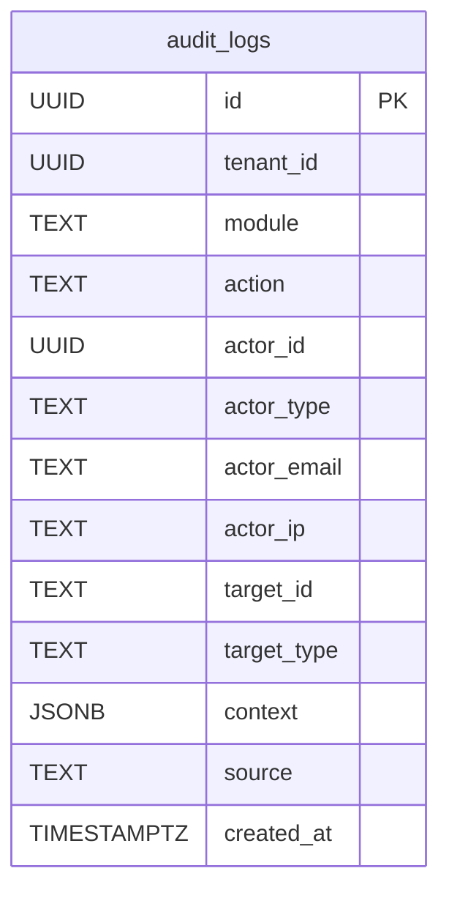
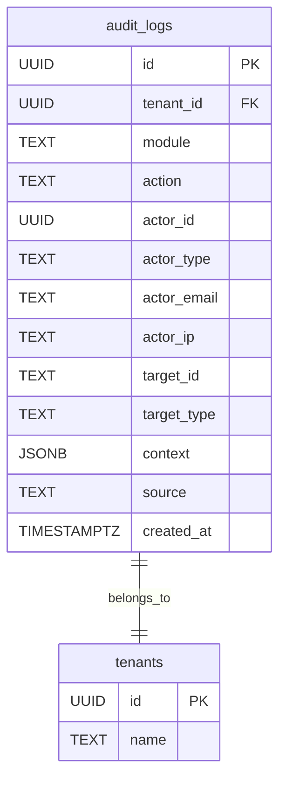

# 🗃️ Audit Logging Service - Data Model

Tài liệu này mô tả chi tiết mô hình dữ liệu của **Audit Logging Service**, một thành phần **cốt lõi** trong hệ thống `dx-vas`, theo kiến trúc **event-driven, multi-tenant, AI-ready**. Service này đảm nhận lưu trữ các hành vi nghiệp vụ (audit logs) để phục vụ kiểm tra, điều tra sự cố, theo dõi hành vi hệ thống, và tuân thủ chính sách bảo mật (ADR-004, ADR-008).

Audit Logging Service chịu trách nhiệm quản lý:
- Lưu trữ các bản ghi nhật ký hành vi (bảng `audit_logs`)
- Đảm bảo tính toàn vẹn dữ liệu log (append-only, immutable)
- Tra cứu log theo thời gian, actor, hành động, module
- Hỗ trợ dashboard kiểm tra truy vết sự kiện người dùng/actor

---

## 1. Phạm vi Dữ liệu Quản lý (Scope)

Audit Logging Service bao gồm:
- Ghi nhận hành vi người dùng liên quan đến dữ liệu (CRUD)
- Ghi nhận thao tác hệ thống có ảnh hưởng đến trạng thái dịch vụ
- Ghi nhận chi tiết context: actor, ip, device, source, thời gian
- Cho phép truy vấn audit log theo nhiều chiều (actor, module, action...)

---

## 2. Ngoài Phạm Vi (Out of Scope)

Audit Logging Service **không** chịu trách nhiệm:
- ❌ Quản lý user/permission (thuộc `user-service`)
- ❌ Ghi nhận log hệ thống hạ tầng (thuộc observability stack)
- ❌ Ghi nhận metrics (thuộc Grafana/Prometheus)

---

## 3. Mục tiêu của Tài liệu Mô hình Dữ liệu

- Làm rõ cấu trúc bảng `audit_logs`, chuẩn hóa cách lưu trữ log.
- Định nghĩa đầy đủ các trường, enum, chỉ mục phục vụ truy vấn hiệu quả.
- Hỗ trợ quy trình review schema, migration, và quản lý lifecycle.
- Tuân thủ các ADR liên quan như:
  - [ADR-008 - Audit Logging](../../ADR/adr-008-audit-logging.md)
  - [ADR-023 - Schema Migration Strategy](../../ADR/adr-023-schema-migration-strategy.md)
  - [ADR-024 - Data Anonymization & Retention](../../ADR/adr-024-data-anonymization-retention.md)
  - [ADR-026 - Hard Delete Policy](../../ADR/adr-026-hard-delete-policy.md)

---

## 4. Sơ đồ ERD (Entity Relationship Diagram)

**Sơ đồ sơ bộ**


**Sơ đồ chi tiết**

Sơ đồ dưới đây mô tả cấu trúc bảng chính của `audit-logging-service` và các mối quan hệ phụ trợ định hướng mở rộng trong tương lai.


---

### 🔎 Giải thích chi tiết

* **`audit_logs`** là bảng trung tâm chứa các bản ghi hành vi.
* **`tenants`**: Bảng quản lý thông tin tenant (dữ liệu phân vùng theo tenant ID).
* Mối quan hệ **`audit_logs.tenant_id → tenants.id`** thể hiện mọi log đều thuộc về một tenant cụ thể (multi-tenant aware).

---

### 🎯 Ghi chú mở rộng (nếu cần về sau)

* Có thể mở rộng thêm bảng:

  * `enum_actor_types`, `enum_action_types`, `enum_target_types`: dùng để mapping ra label cho UI.
  * `actor_lookup`: mapping `actor_id` sang display name/avatar/email từ User Service.
* Có thể normalize `context` (hiện lưu JSONB) nếu cần phân tích sâu (data warehouse).

---

### 📌 Mục tiêu của ERD

* Hỗ trợ các team frontend/backend/BI hiểu mối quan hệ dữ liệu
* Làm cơ sở cho việc thiết kế query, index, báo cáo
* Chuẩn hóa cho việc migrate dữ liệu và phát hiện inconsistency

---

## 5. 📌 Bảng `audit_logs`

Bảng `audit_logs` là thành phần trung tâm của Audit Logging Service. Đây là nơi **ghi nhận toàn bộ hành vi nghiệp vụ** xảy ra trong hệ thống, phục vụ cho các nhu cầu:

- Truy vết hoạt động người dùng
- Đảm bảo tuân thủ quy định nội bộ (compliance)
- Điều tra sự cố bảo mật
- Phân tích hành vi người dùng phục vụ cải tiến sản phẩm

---

### 🧾 Mục đích

- Ghi **immutable log** (không chỉnh sửa/xoá) mọi hành vi liên quan tới dữ liệu, cấu hình, quyền, truy cập.
- Lưu metadata phong phú để hỗ trợ việc phân tích & tìm kiếm.
- Dễ dàng mở rộng để hỗ trợ dashboard hoặc hệ thống phân tích BI.

---

### 🧱 Cấu trúc bảng

```sql
CREATE TABLE audit_logs (
    id UUID PRIMARY KEY,
    tenant_id UUID NOT NULL,
    module TEXT NOT NULL,
    action TEXT NOT NULL,
    actor_id UUID,
    actor_type TEXT,
    actor_email TEXT,
    actor_ip TEXT,
    target_id TEXT,
    target_type TEXT,
    context JSONB,
    source TEXT,
    created_at TIMESTAMPTZ DEFAULT now() NOT NULL
);
```

---

### 📋 Giải thích cột chi tiết

| Cột           | Kiểu DL     | Ràng buộc | Mô tả                                                                       |
| ------------- | ----------- | --------- | --------------------------------------------------------------------------- |
| `id`          | UUID        | PK        | ID duy nhất cho bản ghi log (được tạo bằng UUIDv4)                          |
| `tenant_id`   | UUID        | NOT NULL  | Xác định tenant đang thực hiện hành động                                    |
| `module`      | TEXT        | NOT NULL  | Module trong hệ thống phát sinh hành vi (`auth`, `user`, `notification`...) |
| `action`      | TEXT        | NOT NULL  | Hành vi xảy ra (`CREATE`, `DELETE`, `LOGIN`, `ASSIGN_ROLE`, ...)            |
| `actor_id`    | UUID        | nullable  | ID của người/systems/service thực hiện hành động                            |
| `actor_type`  | TEXT        | nullable  | `user`, `system`, `parent`, `service_account`, ...                          |
| `actor_email` | TEXT        | nullable  | Email/identifier khác giúp phân giải `actor_id`                             |
| `actor_ip`    | TEXT        | nullable  | IP address nơi hành vi được thực hiện                                       |
| `target_id`   | TEXT        | nullable  | ID của đối tượng bị tác động (ví dụ: `user-xyz`)                            |
| `target_type` | TEXT        | nullable  | Loại đối tượng bị tác động (`USER`, `CLASS`, `TEMPLATE`, ...)               |
| `context`     | JSONB       | nullable  | Metadata mở rộng của hành vi (ví dụ: giá trị cũ/mới, lý do...)              |
| `source`      | TEXT        | nullable  | Nguồn thực hiện hành vi (`WebApp`, `Admin`, `Script`, `API Gateway`, ...)   |
| `created_at`  | TIMESTAMPTZ | NOT NULL  | Thời điểm log được ghi nhận, mặc định là `now()`                            |

---

### 🛡️ Các đặc điểm thiết kế chính

| Đặc điểm                 | Mục tiêu                                               |
| ------------------------ | ------------------------------------------------------ |
| **Immutable**            | Không sửa/xoá log sau khi ghi                          |
| **Append-only**          | Chỉ ghi thêm, hỗ trợ phát hiện hành vi bất thường      |
| **Tối ưu truy vấn**      | Có các index cho `tenant_id`, `actor_id`, `created_at` |
| **Mô hình flexible**     | Sử dụng JSONB để linh hoạt mở rộng `context`           |
| **An toàn multi-tenant** | Có phân vùng logic theo `tenant_id`                    |
| **Ready for BI**         | Có thể xuất log sang BigQuery nếu cần                  |

---

### 📌 Ví dụ context (JSONB)

```json
{
  "field_changed": "status",
  "old_value": "draft",
  "new_value": "published",
  "reason": "Approval by admin"
}
```

---

## 6. 🧮 Indexes & Constraints

Việc thiết kế các chỉ mục (index) và ràng buộc (constraints) phù hợp là cực kỳ quan trọng để đảm bảo hiệu năng truy vấn, tính toàn vẹn dữ liệu, và khả năng scale khi dữ liệu log tăng nhanh.

---

### 🎯 Mục tiêu thiết kế index

- Tối ưu các truy vấn phổ biến: theo `tenant_id`, `actor_id`, `module`, `created_at`
- Phục vụ phân trang log (`ORDER BY created_at DESC`)
- Tăng tốc độ lọc theo hành vi (`action`, `target_type`, `target_id`)
- Phân vùng logical theo tenant để dễ quản lý và xóa dữ liệu cũ

---

### 📋 Danh sách Index đề xuất

| Tên Index                     | Cột liên quan                         | Ghi chú |
|-------------------------------|---------------------------------------|--------|
| `idx_audit_logs_tenant_time` | (`tenant_id`, `created_at DESC`)      | Truy vấn theo tenant + thời gian gần nhất |
| `idx_audit_logs_actor_time`  | (`actor_id`, `created_at DESC`)       | Truy vấn theo người dùng thực hiện |
| `idx_audit_logs_module`      | (`module`)                            | Truy vấn theo module hệ thống |
| `idx_audit_logs_target`      | (`target_id`, `target_type`)          | Truy vấn log theo đối tượng bị tác động |
| `idx_audit_logs_action`      | (`action`)                            | Truy vấn theo loại hành động |
| `idx_audit_logs_source`      | (`source`)                            | Phân tích theo kênh thực hiện |
| `idx_audit_logs_tenant_actor`| (`tenant_id`, `actor_id`)             | Kết hợp tenant & actor để phục vụ truy vết chéo |

---

### 🔒 Constraints

| Ràng buộc           | Mô tả |
|---------------------|------|
| `PRIMARY KEY (id)`  | Đảm bảo mỗi bản ghi log là duy nhất (UUID) |
| `NOT NULL` trên `tenant_id`, `module`, `action`, `created_at` | Đảm bảo dữ liệu không bị thiếu thông tin quan trọng |
| `CHECK (created_at <= now())` *(optional)* | Đảm bảo log không ghi nhận timestamp tương lai |
| `FOREIGN KEY (tenant_id) REFERENCES tenants(id)` *(optional)* | Áp dụng nếu muốn enforce mối quan hệ tenant |

---

### 📈 Cân nhắc thêm về Partition

- Trong tương lai nếu số lượng log quá lớn (hàng chục triệu bản ghi mỗi tháng), có thể:
  - **Chia partition theo tháng** (`created_at`)
  - **Hoặc chia theo `tenant_id` (logical sharding)**

---

### 📘 Gợi ý bổ sung

- Các chỉ mục nên được theo dõi hiệu năng với `pg_stat_user_indexes`
- Cần vacuum thường xuyên nếu tần suất ghi log cao
- Với các trường có tính phân tán cao như `actor_email`, tránh tạo index trực tiếp

---

## 7. ♻️ Retention & Data Lifecycle

Dữ liệu log là dạng dữ liệu **append-only** nhưng có thể tăng rất nhanh theo thời gian. Để đảm bảo hiệu năng truy vấn, chi phí lưu trữ tối ưu, và tuân thủ chính sách bảo mật (theo [ADR-024 - Data Retention](../../ADR/adr-024-data-anonymization-retention.md)), Audit Logging Service áp dụng cơ chế **retention** và **lifecycle management** như sau:

---

### 🎯 Mục tiêu chính

- Giữ lại dữ liệu log trong thời gian đủ để phục vụ điều tra & kiểm tra tuân thủ (audit compliance)
- Xoá dữ liệu log cũ theo định kỳ một cách an toàn và hiệu quả
- Cho phép mở rộng retention riêng cho một số tenant đặc biệt (nếu có)

---

### 🗓️ Thời gian lưu (Retention Window)

| Loại log         | Retention mặc định | Ghi chú |
|------------------|--------------------|--------|
| Toàn bộ audit log| **180 ngày (6 tháng)** | Áp dụng cho tất cả tenant |

> ⚠️ Có thể tăng lên 365 ngày cho các tenant yêu cầu compliance cao (trường quốc tế, yêu cầu ISO/IEC 27001).

---

### 🔁 Cơ chế xóa dữ liệu (Data Deletion)

- **Chiến lược:** Xoá theo lô (batch delete), chạy background job định kỳ.
- **Công cụ:** Kết hợp `Cloud Scheduler` (GCP) + `Cloud Function` (hoặc cron job serverless).
- **Tần suất:** Hàng ngày hoặc hàng tuần, tuỳ vào lượng dữ liệu.
- **Logic:** Xoá tất cả bản ghi `WHERE created_at < now() - interval '180 days'`.

---

### 🧪 Kịch bản kiểm thử Retention

| Tình huống                               | Kỳ vọng |
|------------------------------------------|--------|
| Truy vấn log của hơn 180 ngày trước       | Không trả dữ liệu hoặc trả về empty |
| Chạy script xoá thủ công với filter đúng  | Dữ liệu cũ bị xoá, dữ liệu mới còn nguyên |
| Audit log bị xoá đúng nhưng log hệ thống không bị ảnh hưởng | ✔️ OK |

---

### 🔒 An toàn khi xoá

- Log được phân vùng theo `tenant_id`, tránh ảnh hưởng lẫn nhau.
- Batch job sử dụng `LIMIT` để tránh full table scan và lock.
- Có thể áp dụng soft delete nếu cần (hiện tại là hard delete do ghi log không cần khôi phục).

---

### 📊 Lưu trữ lâu dài (Future Option)

- Nếu cần giữ log > 1 năm:  
  - Có thể đẩy vào `BigQuery` hoặc `Cloud Storage` ở định dạng Parquet.
  - Hoặc xuất định kỳ (monthly export) từ PostgreSQL sang bucket archive.

---

## 8. 📚 ENUMs

Trong `audit_logs`, một số trường dạng văn bản (TEXT) thực chất là các **trường liệt kê (ENUM)** mang ý nghĩa định danh cố định. Việc tiêu chuẩn hoá giá trị enum giúp:

- Truy vấn dễ dàng & chính xác
- Hỗ trợ UI mapping label/màu/icon
- Tránh lỗi chính tả hoặc thiếu thống nhất giữa các service
- Chuẩn bị cho khả năng phân tích thống kê

> 💡 Mặc dù hiện tại các giá trị enum được khai báo là `TEXT`, nhưng chúng cần được **quản lý nhất quán**, có thể tách riêng bảng phụ trợ nếu cần.

---

### 1. `action` – Hành động thực hiện

| Giá trị     | Mô tả                        | Loại hành vi |
|-------------|-------------------------------|----------------|
| `CREATE`    | Tạo mới bản ghi               | Thay đổi dữ liệu |
| `UPDATE`    | Cập nhật dữ liệu              | Thay đổi dữ liệu |
| `DELETE`    | Xoá dữ liệu                   | Thay đổi dữ liệu |
| `LOGIN`     | Người dùng đăng nhập          | Hành vi truy cập |
| `LOGOUT`    | Người dùng đăng xuất          | Hành vi truy cập |
| `APPROVE`   | Duyệt hành động               | Thay đổi trạng thái |
| `REJECT`    | Từ chối hành động             | Thay đổi trạng thái |
| `IMPORT`    | Nhập dữ liệu                  | Hành vi hệ thống |
| `EXPORT`    | Xuất dữ liệu                  | Hành vi hệ thống |
| `ASSIGN_ROLE` | Gán vai trò cho người dùng  | Hành vi phân quyền |

> Mỗi hành động có thể được map với biểu tượng UI (ví dụ: CREATE → 🟢➕, DELETE → 🔴🗑️)

---

### 2. `actor_type` – Loại actor thực hiện hành động

| Giá trị        | Mô tả                             |
|----------------|------------------------------------|
| `user`         | Người dùng hệ thống (giáo viên, admin) |
| `parent`       | Phụ huynh                          |
| `system`       | Hệ thống thực hiện tự động         |
| `service_account` | Service hoặc script nội bộ       |
| `superadmin`   | Quản trị hệ thống toàn cục         |

> Giá trị này hỗ trợ xác định mức độ tin cậy, phân quyền, và phân tích hành vi theo nhóm người dùng.

---

### 3. `module` – Module khởi phát hành vi

| Giá trị        | Mô tả                      |
|----------------|-----------------------------|
| `auth`         | Module xác thực             |
| `user`         | Module quản lý người dùng   |
| `reporting`    | Module báo cáo              |
| `notification` | Module gửi thông báo        |
| `audit`        | Module audit nội bộ         |
| `gateway`      | API Gateway                 |
| `crm`          | Hệ quản trị khách hàng      |
| `sis`          | Quản lý thông tin học sinh  |
| `lms`          | Hệ thống quản lý học tập     |

> Các service gửi audit cần thống nhất `module` này để phân tích truy vết dễ dàng.

---

### 4. `target_type` – Loại đối tượng bị tác động

| Giá trị        | Mô tả đối tượng             |
|----------------|------------------------------|
| `USER`         | Người dùng                   |
| `STUDENT`      | Học sinh                     |
| `PARENT`       | Phụ huynh                    |
| `ROLE`         | Vai trò                      |
| `PERMISSION`   | Quyền                        |
| `TEMPLATE`     | Notification template        |
| `SCHEDULE`     | Thời khoá biểu               |
| `REPORT`       | Báo cáo                      |
| `CONFIG`       | Cấu hình hệ thống            |

---

### 5. `source` – Kênh thực hiện hành vi

| Giá trị        | Mô tả                         |
|----------------|--------------------------------|
| `WebApp`       | Giao diện người dùng           |
| `MobileApp`    | Ứng dụng di động               |
| `API Gateway`  | Gateway chuyển tiếp request    |
| `InternalJob`  | Job chạy tự động (batch, cron) |
| `Script`       | Lệnh CLI nội bộ                |

---

### 🧩 Khả năng mở rộng

Trong tương lai:
- Có thể tách thành bảng `enum_actions`, `enum_modules`, ... để hỗ trợ UI (label, icon, color)
- Có thể tạo lookup table gắn `module + action → default permissions`

---

## 9. 🔐 Data Access Control (RBAC & Multi-Tenant Security)

Để đảm bảo tính bảo mật, riêng tư và phân quyền truy cập dữ liệu log, Audit Logging Service tuân thủ nghiêm ngặt mô hình **RBAC phân tầng** và kiểm soát truy cập theo **tenant** như đã nêu trong:

- [ADR-007 - RBAC Strategy](../../ADR/adr-007-rbac.md)
- [rbac-deep-dive.md](../../architecture/rbac-deep-dive.md)

---

### 🎯 Mục tiêu Bảo vệ Dữ liệu

- Người dùng chỉ được phép xem các log thuộc **tenant của họ**
- Không thể truy cập log của **tenant khác**
- Chỉ những người có permission phù hợp mới xem được log
- Hạn chế truy cập trực tiếp database, chỉ thông qua API có kiểm tra RBAC

---

### 🛡️ Cơ chế Bảo vệ

| Cơ chế                             | Mô tả |
|-----------------------------------|-------|
| **Multi-tenant isolation**        | Mỗi bản ghi log gắn với `tenant_id` và chỉ truy vấn được nếu `JWT.token.tenant_id == log.tenant_id` |
| **RBAC kiểm soát theo API**       | Mỗi API được gắn với `x-required-permission` để kiểm tra trong middleware |
| **Header bắt buộc**               | Các request API đều cần có `Authorization` + `X-Tenant-ID` + `X-Request-ID` |
| **Không truy cập DB trực tiếp**   | Truy vấn log chỉ thông qua service, không expose SQL hoặc dashboard nội bộ trực tiếp |

---

### 🔐 Permission Mapping

| Permission Code        | Mô tả                                           |
|------------------------|--------------------------------------------------|
| `audit.read.logs`      | Truy vấn danh sách hoặc chi tiết log (`GET`)     |
| `audit.create.logs`    | Ghi log đơn lẻ (`POST /audit-logs`)              |
| `audit.create.logs.bulk` | Ghi log hàng loạt (`POST /audit-logs/bulk`)   |

> 🔍 Được validate từ JWT → gắn với user hoặc service account.

---

### 🧠 Quy tắc RBAC theo tầng

| Tầng                  | Kiểm soát                           |
|------------------------|--------------------------------------|
| Tầng API Gateway       | Forward headers đầy đủ cho audit-service |
| Tầng Service Middleware| Kiểm tra permission, tenant, scope    |
| Tầng Database          | Không truy cập trực tiếp – chỉ qua API đã kiểm tra |

---

### 🧪 Kịch bản Kiểm thử

| Tình huống                             | Kết quả mong đợi        |
|----------------------------------------|--------------------------|
| JWT thiếu permission `audit.read.logs` | 403 Forbidden            |
| JWT không chứa `tenant_id`             | 400 Bad Request hoặc 403 |
| User cố truy cập log của tenant khác   | Không có dữ liệu trả về  |
| Service account ghi log không kèm tenant| Bị từ chối ghi           |

---

### 🔍 Ví dụ cấu hình RBAC trong `openapi.yaml`

```yaml
paths:
  /audit-logs:
    get:
      x-required-permission: audit.read.logs
      ...
```

---

## 10. 📘 Phụ lục A – Chiến lược Kiểm thử (Testing Strategy)

Audit Logging Service đóng vai trò ghi nhận hành vi hệ thống, nên cần đảm bảo tuyệt đối về tính đúng đắn, ổn định và khả năng truy vết trong mọi hoàn cảnh. Chiến lược kiểm thử cần bao phủ toàn bộ từ unit đến integration và behavior.

---

### 🎯 Mục tiêu Kiểm thử

- Đảm bảo mọi bản ghi log được ghi **chính xác, đầy đủ, không trùng lặp**
- Đảm bảo **API hoạt động đúng** theo hợp đồng (`openapi.yaml`)
- Đảm bảo **RBAC** và phân quyền được kiểm tra đầy đủ
- Đảm bảo khả năng xử lý **bulk write**, **truy vấn phức tạp**, và **retention**

---

### 🧪 Các Cấp độ Kiểm thử

| Cấp độ        | Mục tiêu                             | Công cụ            |
|---------------|--------------------------------------|--------------------|
| **Unit Test** | Kiểm tra từng hàm (validator, utils, factory) | `pytest`, `unittest`, `faker` |
| **Contract Test** | So sánh API thực tế với `openapi.yaml` | `schemathesis`, `dredd`, `pytest-openapi` |
| **Integration Test** | Ghi + đọc log thực trong DB test | `Postman`, `pytest + Docker` |
| **RBAC Test** | Gửi request thiếu permission / sai tenant | `pytest + mock`, `insomnia` |
| **Load Test** | Ghi log khối lượng lớn (`bulk`) | `locust`, `k6` |
| **Migration Test** | Kiểm tra schema migrations | `alembic`, `pytest` |

---

### 🔍 Kiểm thử API (theo Use Case)

| API Endpoint                 | Test Case                                                 |
|-----------------------------|------------------------------------------------------------|
| `POST /audit-logs`          | Gửi 1 bản ghi hợp lệ / thiếu trường / sai định dạng       |
| `POST /audit-logs/bulk`     | Gửi 50, 500, 1000 bản ghi cùng lúc                         |
| `GET /audit-logs`           | Truy vấn theo `actor_id`, `target_type`, `module`         |
| `GET /audit-logs/{id}`      | Truy cập log không tồn tại / khác tenant                  |

---

### 🔐 Kiểm thử RBAC & Header

| Header thiếu                | Kết quả mong đợi    |
|----------------------------|---------------------|
| Thiếu `Authorization`      | `401 Unauthorized`  |
| Thiếu `X-Request-ID`       | `422 Unprocessable` |
| Thiếu `X-Tenant-ID`        | `400 Bad Request` hoặc `403 Forbidden` |
| JWT thiếu permission        | `403 Forbidden`     |

---

### 🔁 Kiểm thử Lifecycle & Retention

- Ghi log cũ hơn 180 ngày, chạy batch xóa → log bị xoá khỏi DB
- Log mới vẫn được giữ nguyên
- Truy vấn trước và sau retention → xác thực đúng behavior

---

### 📦 Auto-generated Tests từ OpenAPI

Chúng ta sẽ:

1. Tự động sinh unit test khung từ `openapi.yaml` (dùng `schemathesis`)
2. Kiểm tra response trả về đúng `ErrorEnvelope` (ADR-011)
3. Kiểm tra các trường response `meta`, `data`, `errors` theo schema

---

## 11. 📘 Phụ lục B – Sự kiện phát ra

Không phát sinh sự kiện ra ngoài. Đây là service sink cuối cho hành vi nghiệp vụ (append-only log).

---

## 12. 📚 Liên kết tài liệu

* [`design.md`](./design.md)
* [`interface-contract.md`](./interface-contract.md)
* [`openapi.yaml`](./openapi.yaml)
* [ADR - 008 Audit Logging](../../ADR/adr-008-audit-logging.md)
* [ADR - 023 Schema Migration Strategy](../../ADR/adr-023-schema-migration-strategy.md)
* [ADR - 024 Data Retention](../../ADR/adr-024-data-anonymization-retention.md)
