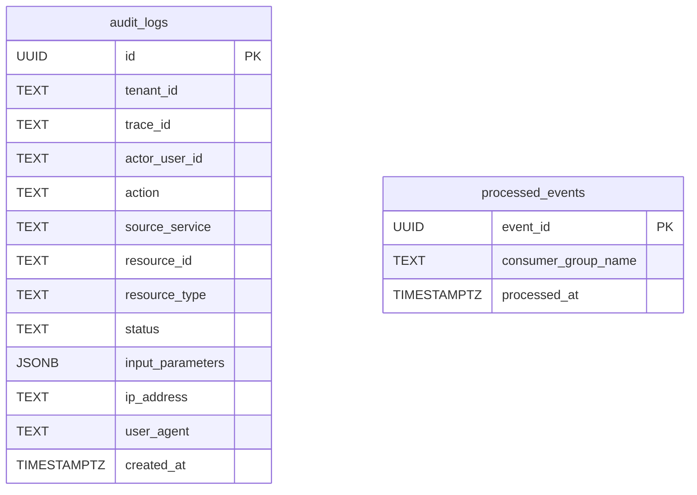

# 🗃️ Audit Logging Service - Data Model

Tài liệu này mô tả chi tiết mô hình dữ liệu của **Audit Logging Service** – một service **cốt lõi** trong hệ thống `dx-vas`, hoạt động theo kiến trúc **event-driven + REST hybrid**, đa tenant.

**Audit Logging Service** chịu trách nhiệm quản lý các loại dữ liệu chính sau:
- Bản ghi hành vi người dùng (`audit_logs`)
- Sự kiện đã xử lý (`processed_events`) – phục vụ kiểm soát idempotency
- Các bảng ENUM mở rộng (trạng thái, loại tài nguyên, v.v.)

---

## 1. Phạm vi Dữ liệu Quản lý (Scope)

Audit Logging Service bao gồm việc quản lý:
- Bản ghi hành vi người dùng hoặc hệ thống từ các nguồn event hoặc HTTP nội bộ
- Metadata liên quan như `trace_id`, `actor_user_id`, `resource_type`, `action`, `input_parameters`
- Các bảng phụ để hỗ trợ lưu dấu `event_id` đã xử lý (Pub/Sub)
- Masking dữ liệu đầu vào theo quyền hạn

---

## 2. Ngoài Phạm Vi (Out of Scope)

Audit Logging Service **không** chịu trách nhiệm quản lý:
- ❌ Log hệ thống ứng dụng (debug/error logs)
- ❌ Quản lý người dùng, vai trò (user/role/permission)
- ❌ Trực tiếp alerting (chỉ phục vụ observability downstream)
- ❌ Phân tích dữ liệu (do hệ thống downstream xử lý)

---

## 3. Mục tiêu của Tài liệu Mô hình Dữ liệu

- Trình bày cấu trúc các bảng dữ liệu cốt lõi (`audit_logs`, `processed_events`)
- Mô tả khóa chính/phụ, chỉ mục, ENUM
- Tuân thủ các nguyên tắc và ràng buộc đã được định nghĩa trong các ADR liên quan:
  - RBAC: [ADR-007](../../ADR/adr-007-rbac.md)
  - Retention & anonymization: [ADR-024](../../ADR/adr-024-data-anonymization-retention.md)
  - Chính sách không xóa vật lý: [ADR-026](../../ADR/adr-026-hard-delete-policy.md)
  - Quản lý schema sự kiện: [ADR-030](../../ADR/adr-030-event-schema-governance.md)
- Cung cấp cơ sở dữ liệu cho việc thiết kế OpenAPI, cấu hình migration, auditing, observability, và tracing
- Phục vụ kiểm thử dữ liệu và tracing

---

## 4. Sơ đồ ERD

### 4.1. Sơ đồ tổng thể



---

### 4.2. Ghi chú mô hình

#### 🔹 `audit_logs`

* Là bảng chính của hệ thống, chứa toàn bộ bản ghi hành vi người dùng và hệ thống.
* Dữ liệu được ghi nhận qua hai nguồn:

  * API nội bộ (`POST /audit-log`)
  * Consumer Pub/Sub (`audit.events.v1`)
* Dữ liệu được **partition theo `created_at`**, phục vụ mục đích retention (xem ADR-024).
* Trường `input_parameters`, `ip_address`, `user_agent` có thể được **mask động** theo role.

#### 🔹 `processed_events`

* Dùng để ghi nhận các sự kiện đã xử lý từ Pub/Sub, giúp đảm bảo **idempotency** và tránh ghi log trùng.
* `event_id` là UUID duy nhất phát sinh bởi producer, lấy từ metadata của event schema (tuân theo ADR-030).
* `consumer_group_name` là tên nhóm consumer định danh cho từng instance hoặc môi trường.
* Không có quan hệ khóa ngoại vật lý đến `audit_logs` do mỗi event có thể ghi nhiều log hoặc không ghi gì (bị reject do validate schema sai).

---

### 4.3. Tương quan thực tế với hệ thống

| Thành phần           | Vai trò liên quan đến dữ liệu                                     |
| -------------------- | ----------------------------------------------------------------- |
| API Gateway          | Gửi log HTTP qua `POST /audit-log`, tạo `audit_logs`              |
| Pub/Sub Consumer     | Ghi log từ event → `audit_logs`, đồng thời ghi `processed_events` |
| BigQuery             | Hệ quản trị lưu trữ chính, dùng cho truy vấn và phân tích         |
| Firestore (optional) | Lưu log tạm thời, phục vụ các dashboard nhỏ hoặc backup           |
| Admin WebApp         | Truy vấn dữ liệu từ bảng `audit_logs` qua API                     |
| Reporting Service    | Đọc `audit_logs` theo `trace_id` để sinh báo cáo bảo mật          |

---

📌 **Lưu ý:** Nếu trong tương lai triển khai tính năng phát sự kiện thứ cấp (`vas.audit.persisted.v1`), log ID từ `audit_logs` sẽ là thành phần chính của payload, nhưng không tạo ràng buộc khóa ngoại vật lý.

---

## 5. Chi tiết Từng Bảng

### 5.1. 📌 Bảng: `audit_logs`

#### 🧾 Mục đích

Lưu trữ các hành vi (audit log) phát sinh từ người dùng hoặc hệ thống nhằm phục vụ các mục tiêu:

- Truy vết hoạt động người dùng & hệ thống
- Phục vụ kiểm toán nội bộ và bên ngoài
- Kết nối với báo cáo bảo mật, cảnh báo hành vi bất thường
- Hỗ trợ hệ thống quan sát (observability), thống kê và AI phân tích

Bảng này là trung tâm của **Audit Logging Service**, tiếp nhận dữ liệu từ 2 nguồn:

- HTTP API (`POST /audit-log`)
- Consumer Pub/Sub (`audit.events.v1`)

---

#### 🧬 Cấu trúc SQL

```sql
CREATE TABLE audit_logs (
    id UUID PRIMARY KEY,
    tenant_id TEXT NOT NULL,
    trace_id TEXT,
    actor_user_id TEXT,
    action TEXT NOT NULL,
    source_service TEXT NOT NULL,
    resource_id TEXT NOT NULL,
    resource_type TEXT NOT NULL,
    status TEXT CHECK (status IN ('success', 'failure', 'warning')) NOT NULL,
    input_parameters JSONB,
    ip_address TEXT,
    user_agent TEXT,
    created_at TIMESTAMPTZ DEFAULT now() NOT NULL
);
```

---

#### 📋 Giải thích các cột

| Cột                | Kiểu dữ liệu | Ràng buộc     | Mô tả                                                   |
| ------------------ | ------------ | ------------- | ------------------------------------------------------- |
| `id`               | UUID         | PRIMARY KEY   | Mã định danh duy nhất cho bản ghi log                   |
| `tenant_id`        | TEXT         | NOT NULL      | Tenant tạo ra hành vi (RBAC được kiểm theo trường này)  |
| `trace_id`         | TEXT         |               | ID truy vết toàn hệ thống (có thể trùng giữa nhiều log) |
| `actor_user_id`    | TEXT         |               | User ID gây ra hành vi (nếu có)                         |
| `action`           | TEXT         | NOT NULL      | Mã hành động (e.g. `user.login.success`)                |
| `source_service`   | TEXT         | NOT NULL      | Tên service phát sinh hành động (e.g. `user-service`, `auth-service`) |
| `resource_id`      | TEXT         | NOT NULL      | ID đối tượng bị tác động (e.g. `u_123`, `t_123`)        |
| `resource_type`    | TEXT         | NOT NULL      | Loại đối tượng bị tác động (e.g. `user`, `tenant`)      |
| `status`           | TEXT         | CHECK ENUM    | Trạng thái kết quả (`success`, `failure`, `warning`)    |
| `input_parameters` | JSONB        |               | Payload ban đầu, có thể bị mask theo role               |
| `ip_address`       | TEXT         |               | IP của actor (nếu có)                                   |
| `user_agent`       | TEXT         |               | User Agent của actor                                    |
| `created_at`       | TIMESTAMPTZ  | DEFAULT now() | Thời điểm ghi nhận hành vi                              |

---

#### 🔐 Masking động theo quyền truy cập

Các trường sau có thể bị **ẩn đi** tùy theo vai trò người xem (`RBAC + masking`):

* `input_parameters`
* `ip_address`
* `user_agent`

Chi tiết về masking được mô tả trong `design.md > #6 Bảo mật`.

---

#### 🔁 Luồng dữ liệu ghi log

```text
HTTP /audit-log
      └──> Validate + Mask
            └──> INSERT INTO audit_logs

Pub/Sub Consumer
      └──> Validate + Mask
            └──> INSERT INTO audit_logs
```

---

#### 🧪 Gợi ý kiểm thử

| Tình huống                                | Kết quả mong đợi                               |
| ----------------------------------------- | ---------------------------------------------- |
| Ghi log từ HTTP                           | Log lưu đúng tenant, đúng actor                |
| Ghi log từ Pub/Sub                        | Có bản ghi log, status hợp lệ                  |
| User không có quyền cao → xem log bị mask | `input_parameters` trả về `"masked"`           |
| Dữ liệu thiếu field bắt buộc              | Bị reject trước khi insert                     |
| Ghi log nhiều tenant khác nhau            | Partition đúng `tenant_id`, truy vấn tách biệt |
| Truy vấn `trace_id` → nhiều log liên quan | OK, hỗ trợ truy xuất trace full flow           |

---

#### 🧠 Ghi chú đặc biệt

* Không nên đặt FK tới `users`, `tenants`, `roles` → tránh coupling schema chặt.
* Nên có **policy partition theo `created_at`** (BigQuery / Postgres partition by time).
* Có thể thêm cột `source` nếu cần phân biệt log từ `http`, `pubsub`, `batch`, v.v.

---

#### 📊 Đề xuất Index

```sql
CREATE INDEX idx_audit_logs_trace_id ON audit_logs(trace_id);
CREATE INDEX idx_audit_logs_created_at ON audit_logs(created_at DESC);
CREATE INDEX idx_audit_logs_actor ON audit_logs(actor_user_id);
```

---

📌 Đây là bảng duy nhất được expose qua `GET /audit-log`, `GET /audit-log/{id}` trong OpenAPI.

---

### 5.2. 📌 Bảng: `processed_events`

#### 🧾 Mục đích

Ghi nhận **danh sách các sự kiện đã xử lý** từ Pub/Sub nhằm:

- Đảm bảo **idempotency**: một sự kiện chỉ được xử lý đúng một lần.
- Giúp **debug** luồng xử lý event: biết event nào đã được xử lý, event nào chưa.
- Phục vụ audit nội bộ và phân tích downtime/retry khi cần.

#### 🧬 Cấu trúc

```sql
CREATE TABLE processed_events (
    event_id UUID PRIMARY KEY,
    consumer_group_name TEXT NOT NULL,
    processed_at TIMESTAMPTZ DEFAULT now() NOT NULL
);
```

#### 🧾 Mô tả các cột

| Cột                   | Kiểu dữ liệu | Ràng buộc     | Mô tả                                                                 |
| --------------------- | ------------ | ------------- | --------------------------------------------------------------------- |
| `event_id`            | UUID         | PRIMARY KEY   | ID sự kiện nhận từ metadata (`event_metadata.event_id`)               |
| `consumer_group_name` | TEXT         | NOT NULL      | Tên consumer (theo service + env) giúp phân biệt source               |
| `processed_at`        | TIMESTAMPTZ  | DEFAULT now() | Thời điểm ALS xử lý thành công sự kiện (ghi log hoặc bỏ qua có lý do) |

#### 🔐 Chính sách bảo mật & xóa

* Bảng chỉ ghi – không có API public, không expose qua REST.
* Truy cập chỉ dành cho **internal operator** hoặc background task.
* Dữ liệu có thể bị xoá theo retention 90 ngày, hoặc xoá thủ công nếu `event_id` không còn dùng để đối chiếu trace.

#### 🔁 Luồng hoạt động

```text
Pub/Sub → Consumer → Validate → Ghi log vào `audit_logs` → Ghi event_id vào `processed_events`
```

#### 🧪 Gợi ý kiểm thử

| Tình huống                                     | Kết quả mong đợi                                                             |
| ---------------------------------------------- | ---------------------------------------------------------------------------- |
| Consumer xử lý event hợp lệ                    | Có bản ghi `event_id` trong bảng                                             |
| Consumer xử lý lại cùng `event_id` (duplicate) | Bị bỏ qua – idempotent, không xử lý lại                                      |
| Gửi sự kiện giả `event_id` nhưng schema sai    | Không tạo `processed_events`, log lỗi nội bộ                                 |
| Bảng không có index                            | Truy vấn chậm – nên có index ở `processed_at` (nếu phân tích theo thời gian) |

#### ⚙️ Đề xuất Index

```sql
CREATE INDEX idx_processed_events_time ON processed_events(processed_at DESC);
```

#### 📎 Ghi chú đặc biệt

* Không có quan hệ FK với `audit_logs` vì một sự kiện có thể:

  * Không tạo log (do bị reject hoặc chỉ ping)
  * Tạo nhiều log cùng lúc (vd: batch import)
* Phần `consumer_group_name` nên chuẩn hóa theo format:

```text
als-sub.<env>.<region>
```

Ví dụ: `als-sub.prod.ap-southeast1`

---

## 6. Indexes & Constraints

Các chỉ mục (indexes) và ràng buộc (constraints) đóng vai trò then chốt trong việc đảm bảo:

- Tốc độ truy vấn nhanh chóng theo nhiều chiều (`trace_id`, `actor_user_id`, `tenant_id`, `created_at`)
- Tính toàn vẹn dữ liệu
- Hạn chế trùng lặp hoặc sai định dạng

---

### 6.1. Bảng: `audit_logs`

#### 🔎 Các chỉ mục chính (Indexes)

| Index Name                        | Cột                  | Mục đích chính                                |
|----------------------------------|-----------------------|-----------------------------------------------|
| `idx_audit_logs_trace_id`        | `trace_id`            | Truy vết theo luồng tương tác                |
| `idx_audit_logs_created_at`      | `created_at DESC`     | Truy vấn thời gian gần nhất (phân trang)     |
| `idx_audit_logs_actor_user_id`   | `actor_user_id`       | Truy xuất log theo người dùng cụ thể         |
| `idx_audit_logs_tenant_id`       | `tenant_id`           | Phân lập dữ liệu theo tenant (RBAC filter)   |
| `idx_audit_logs_action_resource` | `(action, resource_type)` | Truy vấn theo loại hành vi và đối tượng |

> 💡 Nếu sử dụng BigQuery: nên phân vùng (`partition`) theo `DATE(created_at)` và tạo `cluster` theo `tenant_id, trace_id`.

#### 🛡️ Ràng buộc dữ liệu (Constraints)

| Tên Constraint                | Cột / Kiểu         | Ý nghĩa                                                 |
|------------------------------|--------------------|----------------------------------------------------------|
| `pk_audit_logs`              | `id` (PK)          | Mỗi bản ghi log là duy nhất                              |
| `ck_audit_logs_status_enum`  | `status`           | Chỉ cho phép: `success`, `failure`, `warning`            |
| `nn_audit_logs_tenant_id`    | `tenant_id`        | Bắt buộc có tenant                                       |
| `nn_audit_logs_action`  | `action`      | Bắt buộc ghi rõ hành động                                |
| `nn_audit_logs_resource_type`| `resource_type`     | Bắt buộc có loại đối tượng liên quan                     |
| `df_created_at_now`          | `created_at`       | Mặc định là `now()` nếu không được truyền từ producer    |

---

### 6.2. Bảng: `processed_events`

#### 🔎 Index

| Index Name                        | Cột               | Mục đích                                 |
|----------------------------------|-------------------|------------------------------------------|
| `idx_processed_events_time`      | `processed_at DESC` | Truy vấn sự kiện mới nhất                |
| *(PK mặc định)*                  | `event_id`        | Đảm bảo duy nhất – hỗ trợ idempotency    |

#### 🛡️ Ràng buộc

| Tên Constraint                 | Cột / Kiểu        | Ý nghĩa                                    |
|-------------------------------|-------------------|---------------------------------------------|
| `pk_processed_events`         | `event_id`        | Chống xử lý lặp từ cùng 1 sự kiện           |
| `nn_processed_consumer_group` | `consumer_group_name` | Bắt buộc ghi rõ tên consumer xử lý      |

---

### 🔧 Gợi ý nâng cao

- ✅ Sử dụng `covering index` nếu hệ thống hỗ trợ (e.g. PostgreSQL 12+)
- ✅ Trong môi trường có hàng triệu bản ghi mỗi ngày: cân nhắc tạo view phân vùng theo tenant để dễ audit/debug
- ⚠️ Không tạo index trên `input_parameters` (JSONB) nếu không dùng truy vấn filter phức tạp → tốn chi phí

---

> 📌 Toàn bộ index và constraint đều phải được mô tả rõ trong migration script, kèm unit test nếu thao tác schema phức tạp (tuân theo `ADR-023 Schema Migration Strategy`)

---

## 7. Chính sách Lưu trữ & Xóa

Chính sách này nhằm đảm bảo dữ liệu trong bảng `audit_logs` và `processed_events` được lưu trữ đúng thời gian cần thiết, tuân thủ các tiêu chuẩn bảo mật và pháp lý (compliance), đồng thời tối ưu chi phí vận hành.

---

### 7.1. ⏳ Thời gian lưu trữ (Retention Period)

| Bảng               | Mặc định Retention | Ghi chú                                           |
|--------------------|--------------------|--------------------------------------------------|
| `audit_logs`       | 365 ngày           | Dữ liệu hành vi người dùng và hệ thống          |
| `processed_events` | 90 ngày            | Chỉ dùng để idempotency và tracking kỹ thuật    |

> 📌 Các mốc thời gian có thể điều chỉnh cấu hình theo tenant hoặc môi trường (staging vs production)

---

### 7.2. 🧹 Chiến lược Xóa Dữ liệu (Deletion Strategy)

Theo **ADR-026**, hệ thống **không sử dụng hard-delete mặc định** với dữ liệu có thể liên quan đến auditing hoặc forensic analysis. Do đó:

#### 🔸 Bảng `audit_logs`:

- Không xóa bản ghi bằng `DELETE` vật lý.
- Sử dụng chiến lược **partition expiration** (BigQuery) hoặc batch archival (Firestore/Postgres).
- Khi đến hạn retention:
  - Dữ liệu có thể được:
    - Chuyển sang BigQuery Cold Storage hoặc Data Lake
    - Xóa mềm thông qua `archived_at` timestamp (nếu cần)
- Một số trường hợp tuân thủ đặc biệt (e.g. yêu cầu của phụ huynh/học sinh theo luật) có thể kích hoạt pipeline **data anonymization** theo ADR-024.

#### 🔸 Bảng `processed_events`:

- Có thể **xóa vật lý hoàn toàn** sau `processed_at + 90 ngày` vì không ảnh hưởng đến compliance.

---

### 7.3. 🔐 Chính sách Anonymization (Ẩn danh dữ liệu)

Áp dụng theo ADR-024:

- Với các field nhạy cảm trong `audit_logs`:
  - `input_parameters`
  - `ip_address`
  - `user_agent`

Có thể được **mask động theo vai trò người dùng (RBAC)** khi truy vấn, hoặc **anonymize toàn bộ** sau thời gian retention:

| Phương án | Khi nào áp dụng        | Cơ chế thực thi                                 |
|----------|-------------------------|-------------------------------------------------|
| Masking  | Khi query API           | Thực hiện trong service layer (`design.md > #6`) |
| Anonymize| Sau 12 tháng (config)   | Batch job chạy hằng tuần xóa nội dung field     |

> 🔎 Audit log không bao giờ ghi `password`, `OTP`, `JWT`, hoặc các credential nhạy cảm – được loại bỏ ngay từ bước validate đầu vào.

---

### 7.4. ✈️ Dữ liệu tạm thời

- Các dữ liệu debug/log có TTL < 7 ngày (e.g. draft logs, schema error) được lưu trong Firestore hoặc memory store, và tự xóa theo TTL.
- Không đi vào audit_logs chính.

---

### 7.5. 🧪 Kiểm thử & Quan sát Retention

- Viết job giả lập log đã quá hạn → kiểm tra có bị xóa hoặc anonymize đúng
- Viết câu truy vấn validate:
```sql
  SELECT COUNT(*) FROM audit_logs WHERE created_at < now() - INTERVAL '1 year';
```

> Log về hành vi anonymization nên được ghi lại với action = audit.anonymized

---

## 8. Phân quyền Truy cập Dữ liệu

Dữ liệu trong bảng `audit_logs` chứa nhiều trường nhạy cảm liên quan đến hành vi người dùng, IP truy cập, thông tin hành động... Do đó, hệ thống áp dụng chính sách phân quyền chặt chẽ theo mô hình RBAC đa tầng (xem `ADR-007`).

---

### 8.1. Phạm vi truy cập theo vai trò (Role-based Access)

| Vai trò (`role`)     | Truy cập log tenant khác | Nhận dữ liệu không bị mask | Truy vấn nâng cao (`trace_id`, `resource_type`) |
|-----------------------|--------------------------|-----------------------------|-------------------------------------------------|
| `superadmin`          | ✅                        | ✅                           | ✅                                               |
| `tenant_admin`        | ❌                        | ✅                           | ✅                                               |
| `tenant_auditor`      | ❌                        | ❌ *(1)*                     | ✅                                               |
| `teacher`, `staff`    | ❌                        | ❌                           | ❌ *(giới hạn theo actor_user_id)*              |

> *(1)* Các role thấp hơn `tenant_admin` chỉ thấy các trường đã được **mask động** (e.g. `input_parameters: "masked"`)

---

### 8.2. Masking động dữ liệu

Các trường sau sẽ được che khuất (mask) nếu user không có quyền cao:

| Trường bị mask        | Khi nào áp dụng                                    |
|------------------------|----------------------------------------------------|
| `input_parameters`     | Nếu không có `view_sensitive_payload`             |
| `ip_address`           | Nếu không có `view_ip`                             |
| `user_agent`           | Nếu không có `view_device_info`                   |

Ví dụ sau phản ánh kết quả truy vấn đối với 2 vai trò khác nhau:

```json
// Truy cập với quyền thấp
{
  "input_parameters": "masked",
  "ip_address": "masked",
  "user_agent": "masked"
}

// Truy cập với quyền cao
{
  "input_parameters": {
    "email": "john@example.com",
    "name": "John"
  },
  "ip_address": "192.168.1.2",
  "user_agent": "Mozilla/5.0"
}
```

---

### 8.3. Điều kiện ràng buộc theo Tenant

Mọi truy vấn từ client đều phải có header `X-Tenant-ID`. Điều kiện bắt buộc:

```json
{ "tenant_id": "{{X-Tenant-ID}}" }
```

Quản trị viên cấp tenant chỉ được thấy log trong phạm vi tenant của mình.

---

### 8.4. Scope bắt buộc trong JWT

| API                   | Scope yêu cầu                   |
| --------------------- | ------------------------------- |
| `GET /audit-log`      | `audit.read.log`                |
| `GET /audit-log/{id}` | `audit.read.log`                |
| `POST /audit-log`     | `audit.write` *(internal only)* |

> ⚠️ Không bao giờ cấp `audit.write` cho ứng dụng người dùng (frontend/mobile).

---

### 8.5. Policy triển khai trên API Gateway

| Thành phần       | Policy                                    |
| ---------------- | ----------------------------------------- |
| Gateway filter   | Kiểm tra `scope`, `tenant_id`             |
| Middleware ALS   | Check RBAC theo role                      |
| Query Layer (DB) | Gắn filter theo `tenant_id`, mask nếu cần |

---

## 9. Mở rộng trong Tương Lai

Audit Logging Service (ALS) được thiết kế theo nguyên tắc modular & event-driven, sẵn sàng mở rộng trong các giai đoạn sau này. Dưới đây là các hướng mở rộng quan trọng đã được xác định:

---

### 9.1. 🚀 Phát sự kiện thứ cấp `vas.audit.persisted.v1`

- Cho phép ALS phát Pub/Sub event mỗi khi một bản ghi log được lưu thành công.
- Hữu ích cho:
  - **Downstream processing** (ETL → Data Lake, Data Mart)
  - **Phân tích AI behavior**
  - **Realtime monitoring** (như suspicious behavior)
- **Trạng thái hiện tại:** Đã thiết kế schema & flow (xem `design.md > 5.3`)  
  🔒 **Chưa bật mặc định** – cần bật `emit_audit_event_enabled = true` theo môi trường

> Xem thêm: [ADR-030 - Event Schema Governance](../../ADR/adr-030-event-schema-governance.md)

---

### 9.2. 🧠 Tự động phát hiện hành vi bất thường (Anomaly Detection)

- Kết hợp ALS với AI pipeline để phát hiện:
  - Truy cập bất thường vào dữ liệu học sinh
  - Hành vi đăng nhập trái phép hoặc brute-force
- Yêu cầu: tích hợp ALS log với Data Lake + hệ thống cảnh báo (ADR-021)

---

### 9.3. 📦 Hỗ trợ nhiều backend lưu trữ

| Storage         | Trạng thái hiện tại | Ghi chú |
|------------------|----------------------|---------|
| BigQuery         | ✅ Production         | Phân tích & truy vấn |
| Firestore        | 🅾 Optional            | Dùng cho dashboard nhỏ, backup |
| PostgreSQL/Clickhouse | 🔜 Giai đoạn sau | Phù hợp self-hosted hoặc latency thấp |

---

### 9.4. 🧾 Truy vấn nâng cao cho báo cáo

- Hỗ trợ các API nâng cao theo truy vấn:
  - `GET /audit-log/by-trace/{trace_id}`
  - `GET /audit-log/stats?group_by=action`
- Phục vụ trực tiếp cho báo cáo bảo mật (`Reporting Service`) và dashboard.

---

### 9.5. 🔁 Retry cơ chế tiêu thụ Pub/Sub

- Hiện tại: ALS **bỏ qua các event không valid schema**
- Tương lai:
  - Lưu các event lỗi vào hàng chờ tạm thời
  - Cho phép debug & replay event lỗi
  - Tích hợp với alerting system (Grafana Alert, Slack webhook...)

---

### 9.6. 🔒 Kiểm toán các truy vấn nhạy cảm

- Ghi lại cả hành vi **truy vấn log** (ai truy cập log gì, khi nào) như một dạng “meta-audit”
- Cho phép truy vấn theo `trace_id` của truy vấn
- Cần triển khai song song trong Admin WebApp & ALS

---

### 9.7. 🛠 Admin Dashboard Mini

- Tạo 1 dashboard nội bộ gọn nhẹ để:
  - Xem log gần nhất theo trace/user
  - Kiểm tra sự kiện nào đã được ghi vào ALS
  - Xem trạng thái masking theo vai trò
- Có thể dùng Firestore + Firebase Hosting + Tailwind CSS

---

📌 Các hướng mở rộng trên đều nằm trong tầm kiểm soát hiện tại nhờ thiết kế tuân thủ ADR, modular, và có thể bật/tắt theo môi trường bằng `feature flag`.

📎 Gợi ý chi tiết cho triển khai sau này: xem [design.md > 11. Kiến trúc Service](./design.md#11-🧩-Kiến-trúc-Service)

---

## 10. ENUMs

Danh sách các giá trị liệt kê (`enum`) được chuẩn hóa để đảm bảo tính nhất quán xuyên suốt hệ thống. Tất cả giá trị enum đều nên được quản lý tập trung trong schema và OpenAPI, có thể dùng cho codegen và tự động kiểm tra tính hợp lệ.

---

### 10.1. 📌 Trường `status`

| Giá trị     | Mô tả                                                                 |
|-------------|----------------------------------------------------------------------|
| `success`   | Hành động hoàn tất thành công                                          |
| `failure`   | Hành động bị lỗi hoặc không hoàn tất                                  |
| `warning`   | Thành công một phần, hoặc có điều kiện cảnh báo (e.g. timeout, retry) |

---

### 10.2. 📌 Trường `resource_type`

| Giá trị         | Mô tả                                  |
|------------------|------------------------------------------|
| `user`           | Người dùng hoặc tài khoản                |
| `tenant`         | Tenant / trường / đơn vị                |
| `role`           | Vai trò trong RBAC                      |
| `permission`     | Quyền được gán hoặc thu hồi              |
| `token`          | JWT hoặc OAuth token                     |
| `report`         | Báo cáo sinh ra từ Reporting Service     |
| `notification`   | Thông báo được gửi qua Notification Service |
| `system`         | Các tác vụ hệ thống không thuộc thực thể cụ thể |

> 📎 Danh sách này có thể mở rộng nhưng cần cập nhật đồng bộ OpenAPI và schema BQ

---

### 10.3. 📌 Trường `action`

Hệ thống không giới hạn cố định `action`, nhưng có thể gợi ý các giá trị phổ biến dùng để thống kê và sinh báo cáo:

| Giá trị mẫu              | Mô tả                                 |
|--------------------------|----------------------------------------|
| `user.login.success`     | Đăng nhập thành công                   |
| `user.login.failed`      | Đăng nhập thất bại                     |
| `user.created`           | Tạo người dùng                         |
| `user.updated`           | Cập nhật thông tin                     |
| `user.deleted`           | Xóa người dùng                         |
| `role.assigned`          | Gán role cho người dùng                |
| `token.exchanged`        | Đổi token qua refresh                  |
| `report.viewed`          | Xem báo cáo                            |
| `notification.sent`      | Gửi thông báo thành công               |
| `notification.failed`    | Gửi thông báo thất bại                 |
| `audit.anonymized`       | Log đã được ẩn danh hóa (batch masking) |

---

### 🔎 Ghi chú về quản lý ENUMs

- Với các enum có **phạm vi giới hạn và dùng filter** (như `status`, `resource_type`), nên lưu trong schema và OpenAPI.
- Với các giá trị **mở rộng linh hoạt** như `action`, nên quản lý theo `dictionary` nội bộ để hỗ trợ phân tích và báo cáo.
- Các enum cần mô tả kỹ càng trong `event schema` nếu được sử dụng làm field trong Pub/Sub event.

---

## 11. 📚 Liên kết Tài liệu

* [Interface Contract](./interface-contract.md)
* [OpenAPI Spec](./openapi.yaml)
* [Design](./design.md)
* [`adr-023-schema-migration-strategy`](../../ADR/adr-023-schema-migration-strategy.md)
* [`adr-024-data-anonymization-retention`](../../ADR/adr-024-data-anonymization-retention.md)
* [`adr-026-hard-delete-policy`](../../ADR/adr-026-hard-delete-policy.md)
* [`adr-030-event-schema-governance`](../../ADR/adr-030-event-schema-governance.md)
