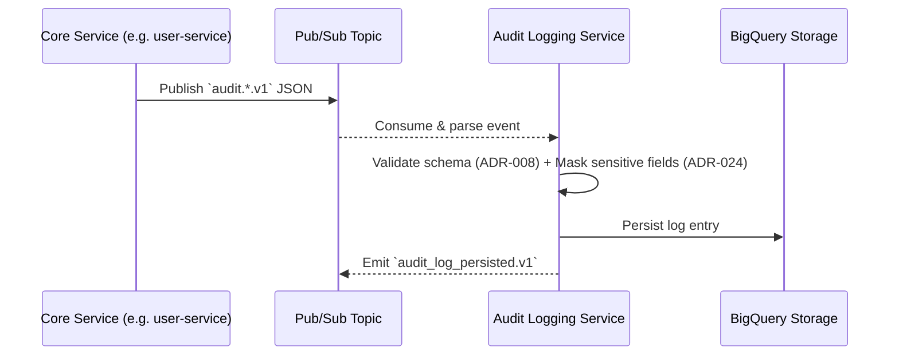
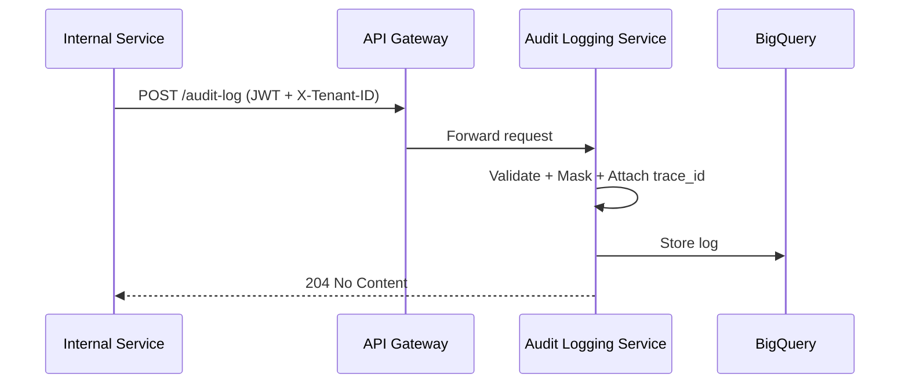
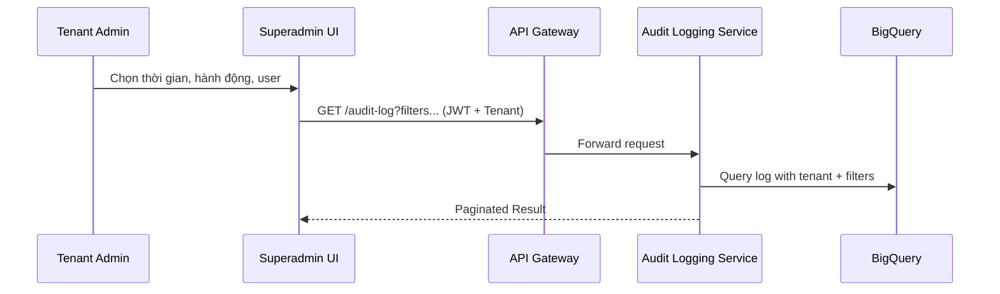
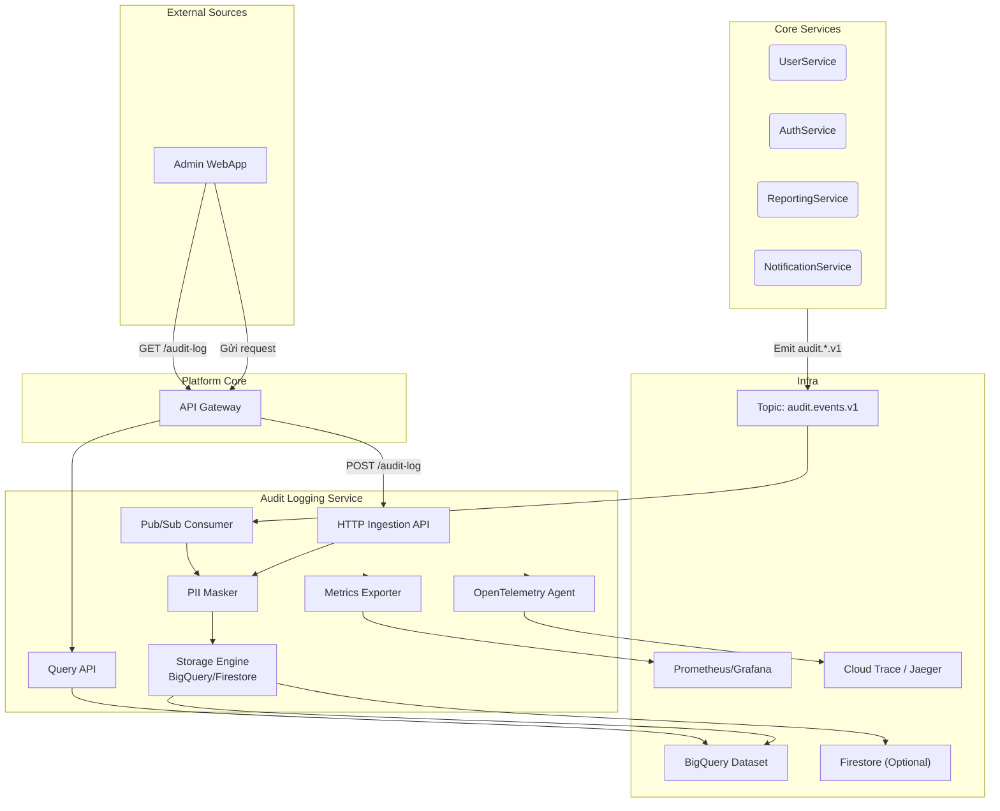

# 📘 Thiết kế chi tiết Audit Logging Service

## 1. 🧭 Phạm vi và Trách nhiệm (Scope & Responsibilities)

### 1.1. 🎯 Mục tiêu

Audit Logging Service (ALS) là một core service thuộc nhóm Platform Stack, chịu trách nhiệm **ghi nhận toàn bộ hành vi có ảnh hưởng đến trạng thái hệ thống**, bao gồm:

- Các thay đổi dữ liệu quan trọng (create/update/delete)
- Các hành động nhạy cảm (đăng nhập, phân quyền, thanh toán, xuất dữ liệu)
- Các thao tác quản trị (cấu hình hệ thống, phê duyệt yêu cầu, đăng ký tenant mới)
- Tương tác của người dùng thông qua các API có side-effect

ALS đóng vai trò như “hộp đen” (blackbox) của hệ thống, giúp truy vết và điều tra các sự cố, đảm bảo tuân thủ chính sách bảo mật, và là nền tảng quan trọng cho phân tích hành vi người dùng hoặc điều tra vi phạm.

---

### 1.2. 📌 Trách nhiệm chính

| Nhóm chức năng | Mô tả |
|----------------|-------|
| **Ingest log** | Nhận log từ các service khác qua HTTP hoặc Pub/Sub, xác thực nguồn và định dạng |
| **Chuẩn hoá & bảo vệ dữ liệu** | Tuân thủ `ADR-008` về định dạng log và `ADR-024` về ẩn danh hóa dữ liệu PII |
| **Lưu trữ dài hạn** | Ghi dữ liệu vào BigQuery hoặc Firestore theo schema chuẩn, có partition theo thời gian và tenant |
| **Hỗ trợ truy vấn** | Cung cấp API để tra cứu audit log theo tiêu chí: thời gian, hành động, người dùng, tenant… |
| **Tương thích đa tenant** | Mỗi bản ghi log gắn `tenant_id` rõ ràng, đảm bảo phân quyền truy cập ở cấp tenant |
| **Quan sát & phân tích** | Cung cấp metric, tracing, alerting theo `ADR-021` để giám sát chất lượng ghi log |
| **Đảm bảo compliance** | Hỗ trợ thời gian lưu trữ (retention), masking PII, export phục vụ audit nội bộ hoặc bên ngoài |

---

### 1.3. ❌ Ngoài phạm vi (Out of Scope)

- Không lưu log hệ thống như stdout/stderr hoặc log ứng dụng thông thường
- Không thay thế hệ thống monitoring như Stackdriver, Prometheus
- Không thực hiện alerting, auto-block hay trigger xử lý từ log – các hệ thống khác có thể phân tích log để thực hiện hành động

---

### 1.4. 👥 Người dùng và client

| Vai trò | Mục đích sử dụng |
|--------|------------------|
| Core Services (Auth, User, API Gateway, Notification...) | Gửi audit log khi có hành động quan trọng |
| DevOps / Security Team | Tra cứu hành vi bất thường, điều tra sự cố bảo mật |
| Tenant Admin | Truy vấn log trong phạm vi tenant để kiểm tra hành động người dùng |
| Auditor (nội bộ hoặc bên thứ ba) | Tải export log phục vụ kiểm toán định kỳ |

---

## 2. 🧱 Kiến trúc nội bộ (Internal Architecture)

### 2.1. 🧠 Tổng quan

Audit Logging Service (ALS) được thiết kế theo mô hình stateless microservice, vận hành trong Core Stack của hệ thống `dx-vas`. Service này tiếp nhận log thông qua cả hai cơ chế: HTTP API và Pub/Sub, xử lý và ghi nhận log vào hệ thống lưu trữ trung tâm, đồng thời cung cấp API để truy vấn log theo tenant và điều kiện lọc.

---

### 2.2. 🏗️ Các thành phần chính

| Thành phần | Mô tả |
|------------|------|
| **Ingestion API** | HTTP endpoint nội bộ dùng để các service gọi trực tiếp gửi log. Xác thực bằng JWT, kiểm tra `x-tenant-id`, áp dụng RBAC (nếu cần) |
| **Pub/Sub Consumer** | Lắng nghe topic `audit.events.v1` (chuẩn hoá theo `ADR-030`). Dùng để xử lý log phát ra dưới dạng sự kiện từ các service khác |
| **Parser & Validator** | Kiểm tra schema của audit event (theo `ADR-008`), lọc các trường không hợp lệ, kiểm tra backward compatibility nếu cần |
| **PII Masker** | Áp dụng chính sách ẩn danh hoá trước khi lưu log (xem `ADR-024`). Có thể cấu hình bật/tắt masking theo môi trường |
| **Storage Layer** | Ghi log vào BigQuery (mặc định). Có thể cấu hình lưu vào Firestore hoặc Cold Storage cho log lâu năm |
| **Query API** | Cung cấp REST API để truy vấn log theo `tenant_id`, `actor_user_id`, `resource`, `action`, `date_range`, `trace_id`... |
| **Retention Cron** | Tự động xóa log theo chính sách thời gian lưu trữ (`retention_days`) cấu hình trong biến môi trường hoặc metadata |
| **Observability Hooks** | Tích hợp logging, metrics (Prometheus), tracing (OpenTelemetry) và alerting (Stackdriver Alerting) theo `ADR-021` |

---

### 2.3. 🔁 Flow xử lý tổng quát

```mermaid
flowchart TD
    subgraph Ingestion
        A1[HTTP Request]
        A2[Pub/Sub Message]
    end
    A1 --> P[Parse & Validate]
    A2 --> P
    P --> M[Mask Sensitive Fields (ADR-024)]
    M --> S[Store to BigQuery]
    S --> E[Emit audit_log_persisted.v1]
```

---

### 2.4. 🔒 Bảo mật nội bộ

* Mọi HTTP request phải đi qua API Gateway, có xác thực JWT và `x-tenant-id`
* Consumer Pub/Sub chỉ nhận từ topic `audit.events.v1` đã đăng ký theo đúng schema (xác minh từ `event-registry`)
* Tất cả log được gắn `tenant_id`, không bao giờ có log “chung” không định danh tenant
* Truy cập log chỉ cho phép người dùng hoặc service có quyền `audit.read`

---

### 2.5. ⚙️ Triển khai và Mở rộng

* Service triển khai trên Google Cloud Run, autoscale theo load
* Mỗi bản ghi log lưu kèm `trace_id`, hỗ trợ liên kết với observability toàn hệ thống
* Trong tương lai có thể hỗ trợ dual storage (BigQuery realtime + Firestore archive)

---

### 2.6. 📌 Liên kết ADR và Kiến trúc

| Thành phần        | ADR liên quan    |
| ----------------- | ---------------- |
| Ingestion API     | ADR-008, ADR-006 |
| Pub/Sub Consumer  | ADR-030, ADR-008 |
| Masking           | ADR-024          |
| Storage           | ADR-027, ADR-020 |
| Tracing & Metrics | ADR-021          |
| Retention Policy  | ADR-026          |

> **Chi tiết:** [Interface Contract](./interface-contract.md) & [OpenAPI](./openapi.yaml)

---

## 3. 🧩 Mô hình Dữ liệu (Data Model)

Audit Logging Service sử dụng mô hình dữ liệu dạng **append-only**, lưu trữ mỗi hành động (event) thành một bản ghi không sửa đổi. Dữ liệu được lưu trong **BigQuery** (mặc định) hoặc có thể cấu hình lưu trữ song song ở **Firestore** cho mục đích truy xuất nhanh theo ID.

---

### 3.1. 📌 Bảng chính: `audit_log_entries`

#### 🔖 Mục đích

Lưu trữ toàn bộ hành vi người dùng hoặc hệ thống có tác động đến trạng thái hoặc cấu hình hệ thống, được ghi nhận theo chuẩn schema sự kiện `*.audit.v1`.

#### 📐 Cấu trúc bảng

| Trường | Kiểu dữ liệu | Mô tả |
|--------|--------------|-------|
| `id` | `STRING` | ID duy nhất của bản ghi (UUID v4) |
| `tenant_id` | `STRING` | Tenant nơi hành động xảy ra |
| `actor_user_id` | `STRING` | ID người thực hiện hành động (có thể là system hoặc service) |
| `resource_type` | `STRING` | Loại đối tượng bị tác động (e.g. `user`, `template`, `config`) |
| `resource_id` | `STRING` | ID đối tượng bị tác động |
| `action` | `STRING` | Loại hành động (`create`, `update`, `delete`, `login`, etc.) |
| `action_scope` | `STRING` | Phạm vi hành động (`global`, `tenant`, `internal`) |
| `timestamp` | `TIMESTAMP` | Thời điểm xảy ra hành động (UTC) |
| `trace_id` | `STRING` | Mã trace toàn cục để liên kết log giữa các service |
| `ip_address` | `STRING` | IP của người thực hiện (có thể đã mask) |
| `user_agent` | `STRING` | Trình duyệt hoặc công cụ thực hiện hành động |
| `payload_before` | `JSON` | Trạng thái đối tượng trước khi thay đổi (nếu có) |
| `payload_after` | `JSON` | Trạng thái đối tượng sau khi thay đổi (nếu có) |
| `input_parameters` | `JSON` | Tham số đầu vào của API tại thời điểm hành động |
| `duration_ms` | `INTEGER` | Thời gian thực hiện hành động (nếu có thể đo) |
| `source_service` | `STRING` | Tên service phát sinh hành động (e.g. `user-service`, `auth-service`) |
| `event_version` | `STRING` | Phiên bản schema sự kiện (e.g. `v1`, `v2`) |
| `is_masked` | `BOOLEAN` | Cờ cho biết trường nhạy cảm đã được ẩn danh hóa chưa |

---

### 3.2. 🔒 Quy tắc Bảo mật & Masking Dữ liệu

Tuân thủ `ADR-024 - Data Anonymization & Retention`:
- Trường `ip_address` → được rút gọn `/24` hoặc SHA256 khi cần.
- Trường `input_parameters`, `payload_*` → lọc theo whitelist field hoặc pattern-based masking.
- Trường `actor_user_id` có thể được thay bằng dạng alias (e.g. `u_x7f8d123`) nếu xuất ra public logs.

---

### 3.3. ⏳ Chính sách lưu trữ và phân vùng (BigQuery)

| Thuộc tính | Giá trị |
|------------|--------|
| Partition | Theo `timestamp` |
| Clustering | `tenant_id`, `source_service` |
| Retention mặc định | 365 ngày (cấu hình qua env) |
| Policy xóa | Tuân theo `ADR-026 - Hard Delete Policy` và `ADR-027 - Data Management Strategy` |

---

### 3.4. 🔍 Các chỉ mục và truy vấn điển hình

| Use case | Field filter |
|----------|--------------|
| Truy vết hành động của người dùng | `actor_user_id`, `tenant_id`, `timestamp` |
| Kiểm tra thay đổi config hệ thống | `resource_type = 'config'` |
| Xem toàn bộ hành động từ một service | `source_service`, `trace_id` |
| Truy xuất theo trace cho incident | `trace_id` |

👉 **Chi tiết sơ đồ ERD, định nghĩa bảng và chiến lược kiểm thử dữ liệu được trình bày tại**:  
📂 [Data Model](./data-model.md)

---

## 4. 🔄 Luồng nghiệp vụ chính (Main Flow)

Audit Logging Service (ALS) hỗ trợ hai luồng chính để ghi nhận log một cách toàn diện và linh hoạt: (1) qua Pub/Sub theo cơ chế sự kiện bất đồng bộ, và (2) qua HTTP API dành cho các trường hợp cần ghi log tức thời hoặc nội bộ. Dữ liệu sau khi nhận được sẽ được chuẩn hoá, xử lý bảo mật và lưu trữ an toàn.

---

### 4.1. 🔁 Luồng 1: Nhận sự kiện log qua Pub/Sub (`audit.events.v1`)

Luồng phổ biến và được khuyến nghị cho các core service phát hành log hành vi dưới dạng sự kiện chuẩn hóa.



**Đặc điểm**:

* **Không blocking** service phát.
* Đảm bảo loosely-coupled và resilient.
* Bắt buộc tuân theo schema trong `event-registry/`.

---

### 4.2. 🔁 Luồng 2: Ghi log trực tiếp qua HTTP API (chỉ nội bộ)

Dành cho các service không tích hợp Pub/Sub hoặc muốn ghi log trong cùng transaction.



**Đặc điểm**:

* Yêu cầu JWT hợp lệ với scope `audit.write`.
* Dành cho log nội bộ hoặc dev tool (e.g. RBAC editor, import tools).
* Có thể bật/tắt per-environment qua config.

---

### 4.3. 🧠 Luồng 3: Truy vấn Audit Log từ WebApp hoặc DevOps

Cho phép người dùng có vai trò phù hợp truy xuất log trong phạm vi tenant để kiểm tra hành vi.



**Đặc điểm**:

* Yêu cầu scope `audit.read` + kiểm tra tenant ID.
* Kết quả được trả dưới dạng `AuditLogEnvelope` (tuân theo `ADR-012`).

---

### 4.4. 🧩 Các hành động phổ biến được log

| Hành động            | Mô tả                         | Nguồn                |
| -------------------- | ----------------------------- | -------------------- |
| `user.created`       | Người dùng mới được tạo       | user-service         |
| `user.login.success` | Đăng nhập thành công          | auth-service         |
| `role.updated`       | Thay đổi role hoặc permission | user-service         |
| `template.deleted`   | Xoá mẫu báo cáo / cấu hình    | reporting-service    |
| `notification.sent`  | Gửi email/SMS thành công      | notification-service |
| `tenant.created`     | Tạo mới tenant                | sms-service          |

---

## 5. 📣 Tương tác với các Service khác & Luồng sự kiện

Audit Logging Service (ALS) hoạt động như một **dịch vụ thụ động (passive listener)**, chủ yếu tiêu thụ sự kiện hoặc nhận lệnh ghi log từ các core service khác.

Mặc định, ALS không phát sinh sự kiện thứ cấp, tuy nhiên trong các môi trường phân tích hoặc tích hợp nâng cao, nó **có thể phát sự kiện** `audit_log_persisted.v1` tới các topic nội bộ để phục vụ hệ thống downstream (e.g. thống kê realtime, xử lý batch).

> 🧭 Mọi tương tác chính vẫn là _one-way ingestion_ từ bên ngoài → ALS → BigQuery/Firestore.

---

### 5.1. 🔁 Tương tác đồng bộ (HTTP)

#### ✅ Ingestion nội bộ

- Các service có thể gọi trực tiếp endpoint `POST /audit-log` (nội bộ) khi muốn ghi log ngay lập tức, đi kèm trace ID.
- Cơ chế này thường dùng cho các admin tool, hệ thống batch import, hoặc khi không tích hợp Pub/Sub.

| Service Gọi | Endpoint | Ghi chú |
|-------------|----------|--------|
| `user-service` | `POST /audit-log` | Khi cập nhật role, xóa user |
| `auth-service/sub` | `POST /audit-log` | Ghi nhận đăng nhập qua OTP |
| `reporting-service` | `POST /audit-log` | Ghi nhận hành vi truy xuất báo cáo |

#### 🔐 Bảo mật HTTP
- Tất cả request phải đi qua API Gateway.
- Yêu cầu JWT chứa scope `audit.write`.
- Kiểm tra `x-tenant-id` và RBAC (nếu cần).

---

### 5.2. 📥 Lắng nghe sự kiện (Pub/Sub)

ALS là **consumer chính** của topic `audit.events.v1` trên Pub/Sub.

| Topic | Schema | Mô tả |
|-------|--------|-------|
| `audit.events.v1` | `vas.<domain>.<event>.v1` | Các sự kiện hành động do các service phát hành |

#### Ví dụ sự kiện tiếp nhận:

```json
{
  "event": "vas.user.updated.v1",
  "tenant_id": "t_1234",
  "trace_id": "abc-xyz",
  "actor_user_id": "u_789",
  "resource_type": "user",
  "resource_id": "u_456",
  "action": "update",
  "payload_before": {...},
  "payload_after": {...},
  ...
}
```

#### Service phát sự kiện audit:

| Service Nguồn              | Sự kiện tiêu biểu                                     |
| -------------------------- | ----------------------------------------------------- |
| `user-service`             | `vas.user.created.v1`, `vas.role.updated.v1`          |
| `auth-service/master`      | `vas.auth.login_success.v1`                           |
| `notification-service/sub` | `vas.notification.sent.v1`                            |
| `reporting-service`        | `vas.report.query_executed.v1`                        |
| `api-gateway`              | `vas.api.request.audit.v1` (nếu bật logging toàn cục) |

---

### 5.3. 📤 Phát sự kiện thứ cấp (tùy chọn)

Audit Logging Service có thể phát sự kiện **`vas.audit.persisted.v1`** sau khi một bản ghi log được lưu thành công, nhằm phục vụ các hệ thống downstream như:

- **ETL pipeline** hoặc **AI analytics**
- **Alerting / Data Lake indexing**
- **Realtime security event bus**

🔒 **Tính năng này hiện đang được tắt trong production.**
Phát sự kiện được điều khiển bởi cấu hình:

```yaml
emit_audit_event_enabled: false
audit_event_topic: audit.log.persisted.v1
```

Việc phát sự kiện không ảnh hưởng luồng xử lý chính, không yêu cầu ACK từ phía downstream, và chỉ thực hiện nếu cấu hình bật.

#### 📦 Ví dụ payload:

```json
{
  "event": "vas.audit.persisted.v1",
  "id": "log_abc123",
  "tenant_id": "vas-sch-01",
  "timestamp": "2025-06-14T08:00:00Z",
  "source_service": "user-service",
  "action": "delete"
}
```

---

## 6. 🔐 Bảo mật & Phân quyền

Audit Logging Service xử lý dữ liệu nhạy cảm và quan trọng, nên phải tuân thủ nghiêm ngặt các chiến lược xác thực, phân quyền và bảo vệ dữ liệu theo toàn hệ thống. Dưới đây là các lớp bảo mật chính:

---

### 6.1. 🔑 Xác thực (Authentication)

- Tất cả các endpoint của ALS đều yêu cầu xác thực JWT hợp lệ.
- Token phải được phát hành bởi hệ thống `auth-service` (master hoặc sub), tuân thủ `ADR-006`.
- Token bắt buộc chứa các claims:
  - `sub`: định danh người dùng/service
  - `aud`: `api.truongvietanh.edu.vn`
  - `x-tenant-id`: ID của tenant đang thao tác
- Đối với Pub/Sub consumer, xác thực được thực hiện qua **IAM binding** giữa ALS và Pub/Sub service account.

---

### 6.2. 🧭 Phân quyền (Authorization – RBAC)

Audit Logging Service thực thi RBAC ở 2 mức:

#### 📥 Khi ghi log (write)

- **Pub/Sub**: chỉ xử lý log đến từ topic `audit.events.v1` đã đăng ký, không yêu cầu RBAC.
- **HTTP API**: yêu cầu scope `audit.write`. Chỉ dành cho call nội bộ (có kiểm tra `x-internal-request: true`).

#### 📤 Khi truy vấn log (read)

- Bắt buộc có scope `audit.read`.
- Thực hiện phân quyền theo template RBAC như sau:

| Resource | Action | Điều kiện bắt buộc |
|----------|--------|-------------------|
| `audit_log_entry` | `read` | `tenant_id == {{X-Tenant-ID}}` |

- Các field trong log như `actor_user_id`, `payload_*`, `input_parameters` sẽ được **mask động** nếu người gọi không có quyền cao (e.g. không phải Superadmin hoặc TenantAdmin).

---

### 6.3. 🔒 Bảo vệ dữ liệu (Data Protection)

- Mọi bản ghi log đều được mã hoá ở trạng thái lưu trữ:
  - BigQuery: sử dụng encryption mặc định hoặc CMEK theo `ADR-005`
  - Firestore (nếu dùng): tự động mã hoá theo GCP
- Dữ liệu truyền qua HTTP đều sử dụng HTTPS (TLS 1.3)
- Trường nhạy cảm (PII) như `ip_address`, `user_agent`, `payload_*` đều được xử lý theo `ADR-024`:
  - Mask cố định hoặc bằng SHA256
  - Xác định field cần ẩn bằng cấu hình hoặc pattern

---

### 6.4. 🚨 Giám sát và bảo vệ runtime

- Tích hợp OpenTelemetry để trace toàn bộ request → ghi log → lưu trữ
- Ghi log mọi request bị từ chối truy cập hoặc vi phạm quyền
- Có cảnh báo nếu phát hiện truy vấn vượt giới hạn tenant, sai scope hoặc lặp lại bất thường

---

## 7. ⚙️ Cấu hình & Triển khai (Configuration & Deployment)

Audit Logging Service (ALS) được triển khai như một dịch vụ độc lập trong **Core Stack** của hệ thống `dx-vas`. Mục tiêu là đảm bảo khả năng hoạt động ổn định, tách biệt tenant, bảo mật cao và dễ dàng mở rộng khi lượng log tăng.

---

### 7.1. 🧱 Mô hình triển khai

- **Nền tảng**: Google Cloud Run
- **Môi trường**: `staging`, `production`, `sandbox` (tuân thủ `ADR-017`)
- **Vùng triển khai**: `asia-southeast1` (mặc định), có thể mở rộng multi-region
- **IAM binding**: chỉ cho phép service account từ `core` services gọi API hoặc push Pub/Sub

---

### 7.2. ⚙️ Biến môi trường chính (Tuân theo ADR-005)

| Tên biến | Mô tả | Ví dụ |
|----------|-------|-------|
| `LOG_RETENTION_DAYS` | Số ngày lưu log trước khi xoá (nếu bật auto-delete) | `365` |
| `AUDIT_STORAGE_BACKEND` | Lựa chọn backend lưu log (`bigquery` / `firestore`) | `bigquery` |
| `ENABLE_PII_MASKING` | Bật/Tắt chức năng ẩn danh dữ liệu đầu vào | `true` |
| `PUBSUB_SUBSCRIPTION_ID` | ID subscription của `audit.events.v1` | `audit-events-sub` |
| `PROJECT_ID` | GCP project code chứa BigQuery dataset | `vas-core` |

---

### 7.3. 🚀 Triển khai CI/CD (Tuân thủ ADR-001 & ADR-014)

- Mỗi lần commit vào nhánh `main` sẽ trigger pipeline build và deploy (zero-downtime).
- Sử dụng `canary deployment` cho môi trường `staging`.
- Smoke test kiểm tra sau khi triển khai: gửi audit log mẫu, kiểm tra khả năng lưu và truy vấn.

---

### 7.4. 📈 Chiến lược Autoscaling (ADR-016)

- **Min instances**: `1` (đảm bảo cold start thấp)
- **Max instances**: `10` (cấu hình ban đầu, có thể mở rộng)
- **Scaling policy**: theo QPS hoặc CPU threshold > 60%
- Pub/Sub consumer có thể tách container riêng nếu cần scale độc lập

---

### 7.5. 📦 Lưu trữ & Quản lý dữ liệu (ADR-027)

- **Primary storage**: BigQuery, phân vùng theo `timestamp`, clustering theo `tenant_id`
- **Backup / Archive**: có thể bật lưu song song sang Firestore hoặc GCS coldline bucket
- **Retention**: chạy cron job hàng ngày để xoá log cũ vượt `LOG_RETENTION_DAYS`

---

### 7.6. 📌 Chính sách xoá dữ liệu (Hard Delete)

Tuân thủ `ADR-026`, ALS sử dụng chính sách:
- **Hard delete** dữ liệu khi vượt thời gian retention
- Xoá theo batch nhỏ, ghi log mỗi lần xóa
- Không hỗ trợ xoá selective thủ công (trừ khi có yêu cầu audit nội bộ với policy riêng)

### 7.7. Cấu hình liên quan đến phát sự kiện

```yaml
# config.yaml

emit_audit_event_enabled: false         # Bật phát event thứ cấp `audit_log_persisted.v1`
audit_event_topic: audit.log.persisted.v1  # Tên topic phát sự kiện
```

> 📌 **Lưu ý:** Tính năng phát sự kiện thứ cấp hiện **chưa được bật trong môi trường production**.
>   Chỉ nên kích hoạt khi đã có hệ thống downstream tiếp nhận và kiểm soát volume event phát sinh.

---

## 8. 🧪 Chiến lược Kiểm thử (Testing Strategy)

Audit Logging Service đóng vai trò trung tâm trong việc ghi nhận và bảo vệ hành vi của hệ thống. Do đó, chiến lược kiểm thử phải đảm bảo tính **đúng đắn, an toàn, và tin cậy** của mỗi bản ghi audit, trong mọi điều kiện tải và môi trường vận hành.

---

### 8.1. ✅ Unit Tests

| Thành phần | Nội dung kiểm thử |
|------------|-------------------|
| Schema Validator | Kiểm tra tính hợp lệ của payload theo `ADR-008` |
| PII Masker | Xác minh dữ liệu nhạy cảm được ẩn đúng cách |
| Query Filter Builder | Kiểm tra logic lọc theo `actor_id`, `tenant_id`, `trace_id`, etc. |
| JWT Claims Parser | Kiểm tra các trường `sub`, `aud`, `tenant_id` được trích xuất chính xác |

> ✅ Yêu cầu độ bao phủ test ≥ 90% cho core logic (`mask`, `validate`, `store`).

---

### 8.2. 🔁 Integration Tests

| Luồng | Kiểm thử |
|-------|----------|
| Gửi log HTTP → lưu | Gửi request ghi log, xác minh log tồn tại trong BigQuery |
| Nhận log từ Pub/Sub → lưu | Gửi message test vào topic `audit.events.v1`, xác minh lưu thành công |
| Truy vấn log | Gọi `GET /audit-log`, kiểm tra phân trang, lọc, và RBAC |
| Truy cập sai scope | Gửi request từ người dùng không có quyền, kiểm tra lỗi 403 |

---

### 8.3. 🤝 Contract Testing (ADR-010)

| Thành phần | Mô tả |
|------------|--------|
| HTTP API | Kiểm tra bằng Pactflow để đảm bảo hợp đồng giữa ALS và các client (e.g. reporting-service, admin UI) không bị phá vỡ |
| Pub/Sub Schema | Dùng JSON Schema Registry hoặc Spectral để xác thực cấu trúc `audit.*.v1` theo `ADR-030` |

> ✅ Mỗi consumer service sẽ có bản hợp đồng riêng để mô phỏng dữ liệu gửi và assert kết quả mong đợi.

---

### 8.4. 📊 Load Testing & Resilience

- Dùng Locust hoặc k6 để kiểm tra:
  - Khả năng xử lý 1000–10000 log/giây (qua HTTP + Pub/Sub)
  - Độ trễ trung bình và P95/P99 dưới 300ms
  - Khả năng scale theo policy Cloud Run (`ADR-016`)
- Mô phỏng lỗi BigQuery tạm thời để kiểm tra fallback hoặc retry logic

---

### 8.5. 🔐 Security Testing

- Fuzz test trường `payload_*` để kiểm tra lỗ hổng xử lý JSON
- Kiểm tra bảo vệ field `tenant_id`, không để user truy cập chéo tenant
- Kiểm tra injection hoặc bypass thông qua trường `user_agent`, `trace_id`

---

### 8.6. 🔁 Regression Testing & CI Automation

- Tích hợp toàn bộ test suite vào pipeline GitHub Actions
- Mỗi PR bắt buộc pass toàn bộ test trước khi deploy staging
- Truy vết lỗi và coverage với badge trong README repo

---

## 9. 🔍 Observability & Monitoring

Audit Logging Service (ALS) là thành phần trọng yếu về bảo mật và truy vết, do đó phải có khả năng quan sát và giám sát toàn diện ở cấp độ **hệ thống, ứng dụng và hành vi dữ liệu**. Thiết kế observability của ALS tuân thủ `ADR-021` và được triển khai theo 4 lớp: logging, metrics, tracing và alerting.

---

### 9.1. 📄 Logging (Nhật ký dịch vụ)

- Toàn bộ log hệ thống và ứng dụng đều được ghi ở định dạng **structured JSON**.
- Các trường bắt buộc trong mỗi dòng log:
  - `timestamp`, `trace_id`, `tenant_id`, `actor_user_id`, `action`, `status`, `duration_ms`
- Các tình huống log:
  - Log tiếp nhận thành công sự kiện audit
  - Log từ chối do vi phạm RBAC hoặc thiếu JWT
  - Log lỗi ghi dữ liệu xuống BigQuery
  - Log masking trường PII (kèm các trường đã bị mask)

> ✅ Tất cả log được gửi về Cloud Logging (Stackdriver) và có thể xuất sang BigQuery để phân tích sâu.

---

### 9.2. 📈 Metrics (Giám sát hiệu năng & số lượng)

Audit Logging Service xuất các chỉ số Prometheus tiêu chuẩn để theo dõi hiệu năng và độ ổn định:

| Tên metric | Nhãn | Mô tả |
|------------|------|-------|
| `auditlog_ingest_total` | `source`, `status` | Số lượng log tiếp nhận theo nguồn và trạng thái |
| `auditlog_ingest_failed_total` | `error_type` | Số log tiếp nhận thất bại (e.g. schema_invalid, rbac_denied) |
| `auditlog_latency_ms` | `operation`, `status` | Thời gian xử lý ghi log và truy vấn log |
| `auditlog_query_count` | `tenant_id`, `actor_user_id` | Số lượt truy vấn log qua API |
| `auditlog_mask_applied_total` | `field` | Số lần áp dụng masking cho mỗi field nhạy cảm |

> ✅ Metrics được scrape định kỳ và hiển thị qua Grafana dashboard chuyên biệt cho audit-log.

---

### 9.3. 🔍 Tracing (Theo dõi hành trình request)

- ALS tích hợp **OpenTelemetry** để trace toàn bộ hành trình từ khi nhận request đến khi ghi log thành công.
- Mỗi request phải có `trace_id`, và trace được gửi đến backend như Cloud Trace hoặc Jaeger.
- Các span chính:
  - `receive_event`
  - `validate_and_mask`
  - `write_to_storage`
  - `emit_persisted_event`
  - `serve_query_result`

> ✅ Dễ dàng truy vết các bottleneck khi hệ thống scale lớn hoặc khi có log ghi chậm.

---

### 9.4. 🚨 Alerting (Cảnh báo tự động)

Định nghĩa cảnh báo chủ động để đảm bảo ALS vận hành ổn định và phát hiện sớm sự cố:

| Cảnh báo | Điều kiện | Mức độ |
|----------|-----------|--------|
| Lỗi ingest tăng bất thường | `auditlog_ingest_failed_total > 100` trong 5 phút | ⚠️ Warning |
| Latency tăng cao | `auditlog_latency_ms{operation="write"}` P95 > 500ms | 🔥 Critical |
| Không có log nào trong 10 phút | `auditlog_ingest_total` = 0 | ❗ Warning |
| Masking failed | Không có metric `auditlog_mask_applied_total` > 0 trong 1h | 🚨 Security |

> ✅ Cảnh báo được cấu hình qua Cloud Monitoring Alerting hoặc Prometheus + Alertmanager tùy môi trường.

---

## 10. 🚀 Độ tin cậy & Phục hồi (Reliability & Resilience)

Audit Logging Service (ALS) được thiết kế với mục tiêu **không đánh mất bản ghi nào**, ngay cả trong điều kiện mạng không ổn định, lỗi hệ thống tạm thời, hoặc tải cao bất ngờ. Khả năng phục hồi và tự động đảm bảo tính toàn vẹn dữ liệu là ưu tiên hàng đầu.

---

### 10.1. 🔁 Cơ chế Retry thông minh

| Luồng | Cơ chế Retry |
|------|--------------|
| HTTP Ingestion | Nếu ghi BigQuery thất bại (e.g. lỗi mạng, quota), retry tối đa 3 lần với backoff |
| Pub/Sub Consumer | Sử dụng ack deadline mở rộng, và chỉ ack khi ghi log thành công. Nếu thất bại → tự động redeliver sau 10s |
| Emit sự kiện `audit_log_persisted.v1` | Gửi lại nếu thất bại tạm thời, log warning nếu fail vĩnh viễn |

> ✅ Đảm bảo không mất log do lỗi tạm thời và không double-count nhờ `id` duy nhất.

---

### 10.2. 🧾 Bảo vệ idempotency (chống log trùng)

- Mỗi log mang `id` duy nhất (UUID v4 hoặc hash(trace_id + action))
- Khi ghi xuống BigQuery/Firestore, ALS kiểm tra tồn tại `id` trước khi ghi
- Cơ chế này đảm bảo:
  - Tránh trùng log do retry
  - Cho phép các client `at-least-once` mà không ảnh hưởng tới tính toàn vẹn dữ liệu

---

### 10.3. 🧠 Phục hồi sau lỗi hệ thống

- Tất cả Pub/Sub consumer đều **stateless**, có thể restart không mất offset
- BigQuery và Firestore là **managed storage** với đảm bảo HA/DR bởi GCP
- Trong trường hợp mất kết nối BigQuery:
  - Tạm thời ghi vào hàng đợi nội bộ (memory ring buffer hoặc Firestore cache)
  - Log warning → gửi alert → retry sau

---

### 10.4. 🧪 Kiểm thử resilience

| Kịch bản | Mô phỏng kiểm thử |
|---------|-------------------|
| BigQuery timeout | Cắt mạng tới BigQuery trong 30s |
| Pub/Sub redelivery | Gửi duplicate event trong Pub/Sub |
| Client retry | Gửi 5 request ghi log giống nhau trong 1 giây |
| Process crash | Kill container giữa chừng khi đang ghi log |
| High load burst | Gửi 50k log trong 1 phút, quan sát P99 latency |

---

## 11. 🧩 Kiến trúc Service (Service Architecture Overview)

Audit Logging Service (ALS) được triển khai dưới dạng **stateless microservice** và là một thành phần độc lập trong `core stack` của hệ thống `dx-vas`. Service này vận hành theo mô hình event-driven kết hợp REST, hỗ trợ ghi nhận log đa nguồn, đa hình thức và đảm bảo toàn vẹn trong môi trường multi-tenant.

---

### 11.1. 🖼 Sơ đồ Kiến trúc Tổng thể



---

### 11.2. 📌 Ghi chú Kiến trúc

| Thành phần             | Vai trò                                               |
| ---------------------- | ----------------------------------------------------- |
| **HTTP Ingestion API** | Nhận log từ các service nội bộ không dùng Pub/Sub     |
| **Pub/Sub Consumer**   | Xử lý sự kiện `audit.events.v1` phát từ core services |
| **PII Masker**         | Áp dụng chính sách masking (ADR-024) trước khi lưu    |
| **Storage Engine**     | Ghi log vào BigQuery (mặc định) hoặc Firestore        |
| **Query API**          | Cho phép Admin, DevOps truy vấn log đa điều kiện      |
| **Observability**      | Kết nối OpenTelemetry + Prometheus theo `ADR-021`     |

---

### 11.3. 🌐 Triển khai dạng tách lớp

Để tối ưu hoá hiệu suất và khả năng mở rộng, các thành phần có thể được tách riêng:

| Module               | Triển khai riêng? | Ghi chú                                 |
| -------------------- | ----------------- | --------------------------------------- |
| HTTP API & Query API | ✅                 | Cùng một container                      |
| Pub/Sub Consumer     | ✅                 | Có thể scale độc lập khi lượng log tăng |
| Storage Adapter      | ⛔                 | Không cần tách (gọi sync từ masker)     |
| Metrics + Tracer     | ⛔                 | Dùng sidecar hoặc thư viện nhúng        |

---

## 12. 📚 Tài liệu liên quan

* [Interface Contract](./interface-contract.md)
* [Data Model](./data-model.md)
* [OpenAPI Spec](./openapi.yaml)
* [Design](./design.md)
* [ADR-001 CI/CD Pipeline](../../ADR/adr-001-ci-cd.md): Quy trình build, test và deploy dịch vụ ALS theo pipeline tự động.
* [ADR-003 Secrets Management](../../ADR/adr-003-secrets.md): Quy trình lưu trữ & xoay khóa bí mật an toàn, áp dụng cho JWT signing và GCP credentials.
* [ADR-004 Security Policy](../../ADR/adr-004-security.md): Chính sách bảo mật tổng thể cho hệ thống dx-vas.
* [ADR-005 Environment Config](../../ADR/adr-005-env-config.md): Cấu hình môi trường và danh sách biến môi trường cần thiết cho ALS.
* [ADR-006 Auth Strategy](../../ADR/adr-006-auth-strategy.md): Cách xác thực người dùng và service tương tác với Audit Logging API.
* [ADR-007 RBAC Strategy](../../ADR/adr-007-rbac.md): Cơ chế kiểm soát quyền truy vấn log theo tenant và vai trò.
* [ADR-008 Audit Logging](../../ADR/adr-008-audit-logging.md): Định nghĩa định dạng bản ghi, trace ID và hành vi logging chuẩn.
* [ADR-010 Contract Testing](../../ADR/adr-010-contract-testing.md): Hướng dẫn kiểm thử hợp đồng API và Pub/Sub giữa ALS và các client.
* [ADR-014 Zero Downtime Deployment](../../ADR/adr-014-zero-downtime.md): Cơ chế triển khai không gián đoạn cho các thay đổi dịch vụ audit.
* [ADR-015 Deployment Strategy](../../ADR/adr-015-deployment-strategy.md): Chiến lược rollout, canary và rollback áp dụng cho ALS.
* [ADR-016 Auto Scaling](../../ADR/adr-016-auto-scaling.md): Cấu hình autoscale Cloud Run dựa trên QPS và CPU threshold.
* [ADR-017 Environment Deployment Boundary](../../ADR/adr-017-env-deploy-boundary.md): Phân tách môi trường audit giữa staging/production.
* [ADR-021 External Observability](../../ADR/adr-021-external-observability.md): Chiến lược quan sát hệ thống audit từ bên ngoài.
* [ADR-024 Data Anonymization & Retention](../../ADR/adr-024-data-anonymization-retention.md): Masking PII và chính sách retention dữ liệu audit.
* [ADR-026 Hard Delete Policy](../../ADR/adr-026-hard-delete-policy.md): Chính sách xóa vĩnh viễn dữ liệu log sau thời gian lưu trữ.
* [ADR-027 Data Management Strategy](../../ADR/adr-027-data-management-strategy.md): Quản lý vòng đời dữ liệu log, phân vùng và clustering.
* [ADR-030 Event Schema Governance](../../ADR/adr-030-event-schema-governance.md): Quản lý schema sự kiện `audit.events.v1` cho Pub/Sub.
