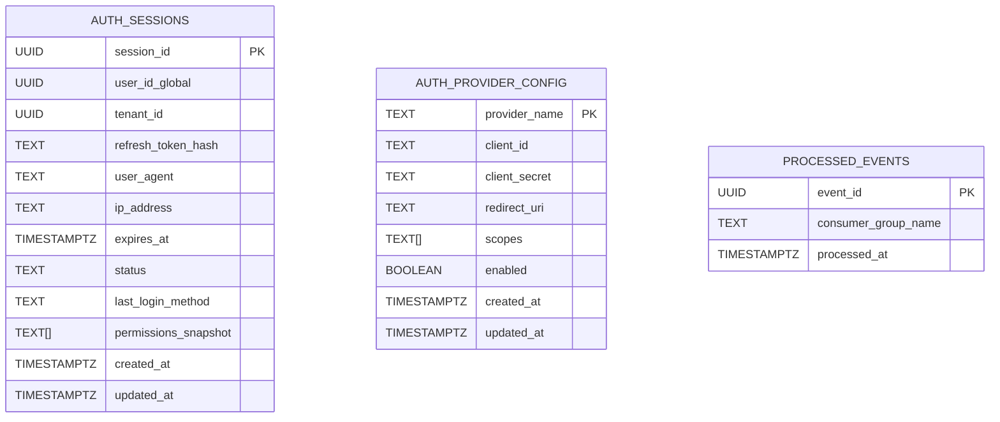

# 🔐 Auth Service Master - Data Model

```
title: Auth Service Master - Data Model
version: 1.1
last_updated: 2025-06-01
author: DX VAS Team
reviewed_by: Stephen Le
```

## 1. Giới thiệu

Tài liệu này mô tả chi tiết mô hình dữ liệu của **Auth Service Master** – một service **cốt lõi** trong hệ thống `dx-vas`, hoạt động theo kiến trúc **multi-tenant** và **stateless**. Service này chịu trách nhiệm quản lý phiên đăng nhập (AuthSession) và cấu hình các nhà cung cấp đăng nhập (AuthProviderConfig) như Google OAuth2.

Các loại dữ liệu chính được quản lý:
-   Phiên đăng nhập của người dùng (`auth_sessions`)
-   Cấu hình OAuth2 provider (`auth_provider_config`)
-   Danh sách sự kiện `processed_events` để đảm bảo idempotency

Mô hình dữ liệu này là nền tảng cho việc phát triển backend, định nghĩa API, thực hiện migration schema, và bảo đảm tính toàn vẹn dữ liệu cho quá trình xác thực và cấp token.

## 2. Phạm vi Dữ liệu Quản lý (Scope)

Auth Service Master bao gồm:
-   Quản lý phiên đăng nhập JWT và refresh-token (`auth_sessions`)
-   Quản lý cấu hình các nhà cung cấp xác thực (`auth_provider_config`)
-   Xác thực OAuth2, làm mới/thu hồi token
-   Ghi nhận sự kiện xử lý token để đảm bảo idempotency (`processed_events`)

## 3. Ngoài Phạm Vi (Out of Scope)

Auth Service Master **không** chịu trách nhiệm quản lý:
-   ❌ Danh tính người dùng toàn cục (quản lý bởi `user-service/master`)
-   ❌ Gán người dùng vào tenant (quản lý bởi `sub-user-service`)
-   ❌ Phân quyền RBAC (quản lý bởi `user-service/master` và hệ thống RBAC template)

## 4. Mục tiêu của Tài liệu Mô hình Dữ liệu

-   Mô tả chi tiết các bảng dữ liệu cốt lõi của Auth Service Master
-   Làm rõ các constraint, khóa chính, khóa ngoại, chỉ mục
-   Hỗ trợ phát triển backend, OpenAPI spec, migration và kiểm thử
-   Liên kết với các tài liệu: `design.md`, `interface-contract.md`, `openapi.yaml`

---

## 5. Sơ đồ ERD (Entity Relationship Diagram)



---

## 6. Chi tiết Từng Bảng

### 📌 Bảng: `auth_sessions`

#### 🧾 Mục đích

Lưu trữ các phiên làm việc người dùng đã xác thực, hỗ trợ refresh-token, audit và phân quyền snapshot.

#### 📜 Câu lệnh `CREATE TABLE`

```sql
CREATE TABLE auth_sessions (
    session_id UUID PRIMARY KEY,
    user_id_global UUID NOT NULL,
    tenant_id UUID NOT NULL,
    refresh_token_hash TEXT NOT NULL,
    user_agent TEXT,
    ip_address TEXT,
    expires_at TIMESTAMPTZ NOT NULL,
    status TEXT NOT NULL CHECK (status IN ('active', 'revoked')),
    last_login_method TEXT,
    permissions_snapshot TEXT[],
    created_at TIMESTAMPTZ DEFAULT now() NOT NULL,
    updated_at TIMESTAMPTZ DEFAULT now() NOT NULL
);
```

#### 🧩 Giải thích cột

| Cột                    | Kiểu dữ liệu | Ràng buộc     | Mô tả                                          |
| ---------------------- | ------------ | ------------- | ---------------------------------------------- |
| `session_id`           | UUID         | PK            | ID của phiên đăng nhập                         |
| `user_id_global`       | UUID         | NOT NULL      | ID người dùng toàn cục (user\_service/master)  |
| `tenant_id`            | UUID         | NOT NULL      | ID của tenant mà phiên này đang hoạt động trong|
| `refresh_token_hash`   | TEXT         | NOT NULL      | Băm của refresh token                          |
| `user_agent`           | TEXT         |               | Trình duyệt thiết bị                           |
| `ip_address`           | TEXT         |               | IP đăng nhập ban đầu                           |
| `expires_at`           | TIMESTAMPTZ  | NOT NULL      | Thời điểm hết hạn của phiên                    |
| `status`               | TEXT         | CHECK (enum)  | `active` hoặc `revoked`                        |
| `last_login_method`    | TEXT         |               | `local` hoặc `google`                          |
| `permissions_snapshot` | TEXT\[]      |               | Snapshot quyền tại thời điểm tạo token         |
| `created_at`           | TIMESTAMPTZ  | DEFAULT now() | Tạo lần đầu                                    |
| `updated_at`           | TIMESTAMPTZ  | DEFAULT now() | Lần cập nhật cuối                              |

#### 🔗 Liên kết và Index

* Index đề xuất:

  * `(user_id_global)`
  * `(status)`
  * `(expires_at)`

---

### 📌 Bảng: `auth_provider_config`

#### 🧾 Mục đích

Cấu hình OAuth2 cho các nhà cung cấp xác thực như Google.

#### 📜 Câu lệnh `CREATE TABLE`

```sql
CREATE TABLE auth_provider_config (
    provider TEXT PRIMARY KEY,
    client_id TEXT NOT NULL,
    client_secret TEXT NOT NULL,
    auth_url TEXT NOT NULL,
    token_url TEXT NOT NULL,
    user_info_url TEXT NOT NULL,
    scopes TEXT[] NOT NULL,
    enabled BOOLEAN DEFAULT true,
    created_at TIMESTAMPTZ DEFAULT now() NOT NULL,
    updated_at TIMESTAMPTZ DEFAULT now() NOT NULL
);
```

#### 🧩 Giải thích cột

| Cột             | Kiểu dữ liệu | Ràng buộc     | Mô tả                               |
| --------------- | ------------ | ------------- | ----------------------------------- |
| `provider`      | TEXT         | PK            | Mã định danh provider (`google`, `github`, ...) |
| `client_id`     | TEXT         | NOT NULL      | Client ID do provider cấp           |
| `client_secret` | TEXT         | NOT NULL      | Bí mật để xác thực                  |
| `auth_url`      | TEXT         | NOT NULL      | URL để client redirect tới xác thực |
| `token_url`     | TEXT         | NOT NULL      | URL để lấy access_token             |
| `user_info_url` | TEXT         | NOT NULL      | URL để lấy profile user             |
| `scopes`        | TEXT\[]      | NOT NULL      | Quyền được yêu cầu                  |
| `enabled`       | BOOLEAN      | DEFAULT true  | Có đang bật provider này không      |
| `created_at`    | TIMESTAMPTZ  | DEFAULT now() | Thời điểm tạo                       |
| `updated_at`    | TIMESTAMPTZ  | DEFAULT now() | Thời điểm cập nhật cuối             |

### 🔗 Ràng buộc khóa ngoại

- `user_id_global` **(logic)** tham chiếu đến `users_global.user_id` từ User Service Master (qua HTTP call, không FK thực trong DB).
- `tenant_id` **(logic)** tham chiếu đến `tenants.tenant_id` từ User Service Master.

---

## 7. Các bảng phụ trợ

### 🔄 Bảng: `processed_events`

#### 📌 Mục đích

Ghi nhận sự kiện đã xử lý để đảm bảo idempotency.

```sql
CREATE TABLE processed_events (
    event_id UUID PRIMARY KEY,
    consumer_group_name TEXT NOT NULL,
    processed_at TIMESTAMPTZ DEFAULT now() NOT NULL
);
```

---

## 8. Phụ lục (Tóm tắt Index, ENUM, Kiểm thử)

### 📘 Phụ lục A – Index

| Bảng                   | Cột được index                           |
| ---------------------- | ---------------------------------------- |
| `auth_sessions`        | `user_id_global`, `status`, `expires_at` |
| `auth_provider_config` | `provider_name`                          |

### 📘 Phụ lục B – Sự kiện Dữ liệu

Auth Service Master có thể phát ra một số sự kiện quan trọng để phục vụ mục đích audit hoặc tương tác hệ thống:

| Sự kiện                 | Trigger                                       | Payload chính               |
|-------------------------|-----------------------------------------------|-----------------------------|
| `session_created`       | Sau khi xác thực thành công (login OAuth2)    | user_id, tenant_id, method  |
| `session_revoked`       | Khi người dùng đăng xuất                      | session_id, revoked_by      |
| `token_refreshed`       | Sau khi dùng refresh token thành công         | user_id, old_session_id     |

### 📘 Phụ lục C – ENUMs

* `status` (auth\_sessions): `active`, `revoked`
* `last_login_method`: `local`, `google`

### 📘 Phụ lục D – Chiến lược Kiểm thử cho Mô hình Dữ liệu

#### 1. Mục tiêu

Đảm bảo rằng các bảng dữ liệu trong Auth Service Master (đặc biệt là `auth_sessions` và `auth_provider_config`) được triển khai đúng cấu trúc, tuân thủ các ràng buộc logic và có thể mở rộng an toàn trong quá trình vận hành.

#### 2. Các cấp độ kiểm thử

| Cấp độ kiểm thử | Mục tiêu | Công cụ | Ghi chú |
|----------------|---------|--------|--------|
| ✅ Unit Test | Kiểm thử hành vi tạo/xóa session, lưu config provider hợp lệ | pytest + FactoryBoy | Mock CSDL |
| ✅ Integration Test | Kiểm thử thao tác với bảng thực tế trong Postgres | pytest + testcontainers | Sử dụng CSDL thật |
| ✅ Migration Test | Đảm bảo schema có thể migrate lên/xuống an toàn | Alembic + pytest | Dùng trên bản sao dữ liệu nhỏ |
| ✅ Constraint Test | Đảm bảo các ràng buộc `NOT NULL`, `UNIQUE`, `CHECK`, FK hoạt động đúng | SQL Test Cases | Gây lỗi có chủ đích |
| ✅ Performance Test (tùy chọn) | Kiểm tra hiệu năng truy vấn session khi có nhiều bản ghi | pgbench, EXPLAIN ANALYZE | Dùng trong staging |

#### 3. Kịch bản kiểm thử tiêu biểu

**AuthSession Table**
- ✅ Tạo session hợp lệ với `user_id`, `tenant_id`, `refresh_token` → thành công
- ✅ Không có `user_id` → bị lỗi `NOT NULL`
- ✅ Gán session cho user không tồn tại → lỗi `FK`
- ✅ Tạo nhiều session cho cùng 1 user → được phép (nhiều device)
- ✅ Truy vấn nhanh theo `refresh_token` (index test)

**AuthProviderConfig Table**
- ✅ Thêm cấu hình mới với `provider = google` → thành công
- ✅ Cập nhật `client_secret` → dữ liệu được cập nhật đúng
- ✅ Thêm `provider` đã tồn tại → bị lỗi `PK`
- ✅ Xóa provider đang được sử dụng → hành vi tùy theo cascade (nên `RESTRICT`)

#### 4. Tuân thủ quy trình CI/CD

- Mỗi thay đổi trong schema phải đi kèm với:
  - ✅ File migration tương ứng (Alembic)
  - ✅ Unit test hoặc integration test kiểm chứng
  - ✅ Được kiểm thử tự động trong GitHub Actions/CI pipeline

#### 5. Kết luận

Việc kiểm thử mô hình dữ liệu là một phần quan trọng để đảm bảo hệ thống Auth Service Master vận hành ổn định, tin cậy và dễ mở rộng. Các kiểm thử cần được duy trì như một phần của quy trình phát triển chuẩn hóa.


### 📘 Phụ lục E – Tài liệu liên kết

✅ Đã tham chiếu từ:

* [Thiết kế tổng quan (`design.md`)](./design.md)
* [Hợp đồng Giao diện API (`interface-contract.md`)](./interface-contract.md)
* [Đặc tả OpenAPI (`openapi.yaml`)](./openapi.yaml)

✅ Tuân thủ các ADR liên quan

- [ADR-011 - API Error Format](../../ADR/adr-011-api-error-format.md)
- [ADR-012 - Response Envelope Structure](../../ADR/adr-012-response-structure.md)
- [ADR-023 - Database Migration Strategy](../../ADR/adr-023-db-migration.md)
- [ADR-024 - Data Retention Policy](../../ADR/adr-024-data-retention.md)
- [ADR-026 - Hard Delete Strategy](../../ADR/adr-026-hard-delete.md)