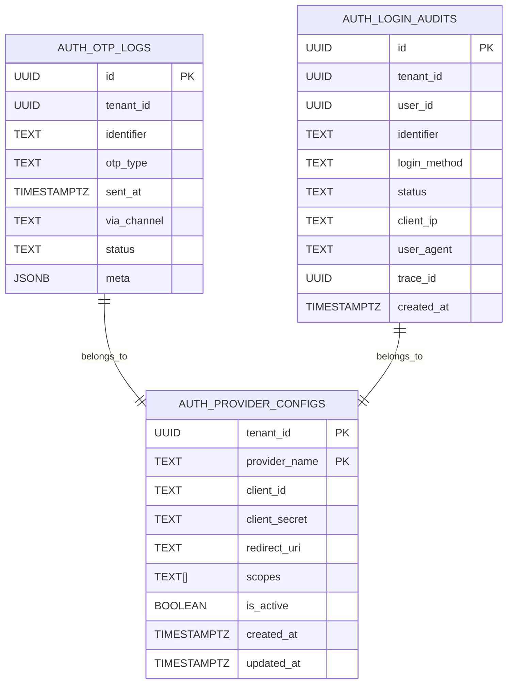

# 🔐 Auth Service Master - Data Model

Tài liệu này mô tả chi tiết mô hình dữ liệu của **Auth Service Master**.

Service này là một thành phần **điều phối xác thực trung tâm** trong hệ thống `dx-vas`, hoạt động theo kiến trúc **request-response** và hỗ trợ **multi-tenant**.

**Auth Service Master** chịu trách nhiệm quản lý các loại dữ liệu chính sau:
- Cấu hình nhà cung cấp xác thực OAuth2 (`auth_provider_configs`)
- Đăng nhập OTP (`auth_otp_logs`)
- Nhật ký xác thực thành công/thất bại (`auth_login_audits`)

---

## 1. 🎯 Phạm vi Dữ liệu Quản lý (Scope)

Auth Service Master không lưu trữ token hoặc session của người dùng. Tất cả các dữ liệu liên quan đến vòng đời token được ủy quyền cho `token-service`.

Dưới đây là các nhóm dữ liệu **có trong phạm vi quản lý của Auth Service Master**:

| Nhóm dữ liệu            | Mô tả ngắn                                                   |
|-------------------------|--------------------------------------------------------------|
| `auth_provider_configs` | Cấu hình OAuth2 cho từng tenant (Google client ID/secret…)  |
| `auth_otp_logs`         | Lịch sử gửi OTP (phone/email), hỗ trợ audit & chống spam     |
| `auth_login_audits`     | Ghi lại log đăng nhập thành công/thất bại và phương thức     |

### ❌ Ngoài phạm vi

| Nhóm dữ liệu                | Ghi chú                                                     |
|-----------------------------|-------------------------------------------------------------|
| `auth_sessions`             | ➤ Được quản lý bởi `token-service`                         |
| `jwks_cache`, `revoked_jti` | ➤ Được cache & xử lý tại `token-service`, không nằm ở đây |
| `route_config`, `rbac`      | ➤ Thuộc phạm vi của `api-gateway`                          |

---

## 2. 🧱 Cấu trúc bảng dữ liệu

### 2.1. `auth_provider_configs`

Cấu hình OAuth2 cho từng tenant. Cho phép Auth Service Master điều hướng người dùng đến đúng nhà cung cấp và kiểm tra tính hợp lệ của thông tin trả về.

| Trường              | Kiểu        | Bắt buộc | Ghi chú                                      |
|---------------------|-------------|----------|----------------------------------------------|
| `tenant_id`         | UUID        | ✅        | Khóa chính (kết hợp với `provider_name`)     |
| `provider_name`     | TEXT        | ✅        | `google`, `apple`, ...                       |
| `client_id`         | TEXT        | ✅        | OAuth2 Client ID                             |
| `client_secret`     | TEXT        | ✅        | Được mã hóa bằng secret backend              |
| `redirect_uri`      | TEXT        | ✅        | URI được redirect từ nhà cung cấp            |
| `scopes`            | TEXT[]      | ❌        | Các scope mặc định, ví dụ: `["email", "openid"]` |
| `is_active`         | BOOLEAN     | ✅        | Cho phép sử dụng hay không                   |
| `created_at`        | TIMESTAMPTZ | ✅        |                                               |
| `updated_at`        | TIMESTAMPTZ | ✅        |                                               |

### 2.2. `auth_otp_logs`

Lưu thông tin các lần gửi OTP để phục vụ chống spam, audit và thống kê.

| Trường         | Kiểu        | Bắt buộc | Ghi chú                                      |
|----------------|-------------|----------|----------------------------------------------|
| `id`           | UUID        | ✅        | Khóa chính                                   |
| `tenant_id`    | UUID        | ✅        | Tenant gửi OTP                               |
| `identifier`   | TEXT        | ✅        | Số điện thoại hoặc email                     |
| `otp_type`     | TEXT        | ✅        | `phone` hoặc `email`                         |
| `sent_at`      | TIMESTAMPTZ | ✅        | Thời điểm gửi                                |
| `via_channel`  | TEXT        | ✅        | `sms`, `email`, hoặc các kênh nội bộ khác    |
| `status`       | TEXT        | ✅        | `success`, `failed`, `rate_limited`...       |
| `meta`         | JSONB       | ❌        | Dữ liệu phụ như IP, user agent               |

### 2.3. `auth_login_audits`

Ghi lại các phiên đăng nhập thành công/thất bại, phục vụ truy vết, thống kê và bảo mật.

| Trường           | Kiểu        | Bắt buộc | Ghi chú                                      |
|------------------|-------------|----------|----------------------------------------------|
| `id`             | UUID        | ✅        | Khóa chính                                   |
| `tenant_id`      | UUID        | ✅        |                                              |
| `user_id`        | UUID        | ✅        | ID người dùng (nếu có)                       |
| `identifier`     | TEXT        | ✅        | Email/SĐT/username đăng nhập                 |
| `login_method`   | TEXT        | ✅        | `google`, `otp`, `local`                     |
| `status`         | TEXT        | ✅        | `success` hoặc `failed`                      |
| `client_ip`      | TEXT        | ✅        | IP người dùng                                |
| `user_agent`     | TEXT        | ✅        | Trình duyệt hoặc app                         |
| `trace_id`       | UUID        | ✅        | Mã trace ID giúp liên kết với hệ thống khác  |
| `created_at`     | TIMESTAMPTZ | ✅        | Thời điểm đăng nhập                          |

---

## 3. 🧬 ERD & sơ đồ minh họa

Sơ đồ dưới đây thể hiện mô hình dữ liệu logic của Auth Service Master, nhấn mạnh các bảng quan trọng như `auth_provider_configs`, `auth_otp_logs` và `auth_login_audits`.



📌 **Ghi chú:**

* Mặc dù các bảng không có liên kết foreign key cứng trong cơ sở dữ liệu (do tính đa tenant), sơ đồ trên giúp trực quan hóa luồng dữ liệu và mối quan hệ logic.
* `tenant_id` là khóa phân vùng (partition key) trong toàn bộ hệ thống dx-vas.
* `user_id` được liên kết ngầm với `user-service` – không có foreign key trực tiếp nhưng mang ý nghĩa tham chiếu ngoài.

---

## 4. 📦 Ví dụ dữ liệu & Case sử dụng

Phần này cung cấp một số ví dụ thực tế về dữ liệu trong các bảng chính và cách hệ thống sử dụng chúng để thực hiện các nghiệp vụ xác thực.

---

### 4.1. Ví dụ: `auth_provider_configs`

```json
{
  "tenant_id": "8a4d6e1f-9007-4f7d-bd9a-12e470e1a123",
  "provider_name": "google",
  "client_id": "1007630212910-xyz.apps.googleusercontent.com",
  "client_secret": "••••••••••",
  "redirect_uri": "https://auth.truongvietanh.edu.vn/oauth2/callback",
  "scopes": ["openid", "email", "profile"],
  "is_active": true,
  "created_at": "2024-10-01T09:00:00Z",
  "updated_at": "2025-06-01T10:00:00Z"
}
```

📌 **Use case:** Khi người dùng nhấn “Đăng nhập bằng Google”, service truy xuất cấu hình này theo `tenant_id` để tạo link ủy quyền (`Google OAuth2 auth URL`).

---

### 4.2. Ví dụ: `auth_otp_logs`

```json
{
  "id": "8d86d9fe-4c25-4268-9560-289e2648fc99",
  "tenant_id": "8a4d6e1f-9007-4f7d-bd9a-12e470e1a123",
  "identifier": "+84981112233",
  "otp_type": "phone",
  "sent_at": "2025-06-10T14:32:20Z",
  "via_channel": "sms",
  "status": "success",
  "meta": {
    "client_ip": "172.16.0.10",
    "user_agent": "Mozilla/5.0"
  }
}
```

📌 **Use case:** Giúp theo dõi lịch sử gửi OTP và kiểm soát rate limit dựa theo `identifier`, `ip`, `user_agent`.

---

### 4.3. Ví dụ: `auth_login_audits`

```json
{
  "id": "f38e38f5-10ab-4db5-980f-8c13b6c888a4",
  "tenant_id": "8a4d6e1f-9007-4f7d-bd9a-12e470e1a123",
  "user_id": "1f409245-cf1a-4a0d-bcf0-91c7e4cbbd41",
  "identifier": "ngocminh@vietanh.edu.vn",
  "login_method": "local",
  "status": "success",
  "client_ip": "172.16.0.10",
  "user_agent": "Mozilla/5.0",
  "trace_id": "3a34de72-0ba3-4e1d-9c0d-bbfb3bbd5e0b",
  "created_at": "2025-06-10T15:10:42Z"
}
```

📌 **Use case:** Hệ thống phân tích log đăng nhập để phát hiện hành vi bất thường, kiểm toán bảo mật và hỗ trợ điều tra khi có sự cố.

---

## 5. 📚 Chi tiết các bảng

Thông tin chi tiết cho từng bảng dữ liệu chính bao gồm mô tả cột, chỉ mục (index), TTL, các cơ chế audit và ghi chú về khả năng migrate:

---

### 5.1. `auth_provider_configs`

```sql
CREATE TABLE auth_provider_configs (
    tenant_id UUID NOT NULL,
    provider_name TEXT NOT NULL,
    client_id TEXT NOT NULL,
    client_secret TEXT NOT NULL,
    redirect_uri TEXT NOT NULL,
    scopes TEXT[],
    is_active BOOLEAN NOT NULL DEFAULT TRUE,
    created_at TIMESTAMPTZ NOT NULL DEFAULT NOW(),
    updated_at TIMESTAMPTZ NOT NULL DEFAULT NOW(),
    PRIMARY KEY (tenant_id, provider_name)
);
```

| Cột             | Kiểu dữ liệu | Index? | Ghi chú |
|----------------|--------------|--------|---------|
| `tenant_id`    | UUID         | ✅     | Phân vùng dữ liệu theo tenant (Partition Key) |
| `provider_name`| TEXT         | ✅     | Cặp (`tenant_id`, `provider_name`) là PK |
| `client_id`    | TEXT         |        | Không index |
| `client_secret`| TEXT         |        | Mã hóa khi lưu |
| `redirect_uri` | TEXT         |        | URI duy nhất cho từng tenant/provider |
| `scopes`       | TEXT[]       |        | Array các scope mặc định |
| `is_active`    | BOOLEAN      | ✅     | Được dùng trong lọc nhanh |
| `created_at`   | TIMESTAMPTZ  |        | - |
| `updated_at`   | TIMESTAMPTZ  |        | - |

**TTL:** Không áp dụng  
**Audit:** Ghi lại sự kiện cập nhật qua log nội bộ hoặc gửi `config.updated` (tuỳ setup)  
**Migration Notes:** Cấu trúc ổn định, không nên đổi tên cột; nếu thay đổi provider phải xoá toàn bộ và insert lại.

---

### 5.2. `auth_otp_logs`

```sql
CREATE TABLE auth_otp_logs (
    id UUID PRIMARY KEY,
    tenant_id UUID NOT NULL,
    identifier TEXT NOT NULL,
    otp_type TEXT NOT NULL CHECK (otp_type IN ('phone', 'email')),
    sent_at TIMESTAMPTZ NOT NULL,
    via_channel TEXT NOT NULL,
    status TEXT NOT NULL CHECK (status IN ('success', 'failed', 'rate_limited')),
    meta JSONB
);
```

| Cột            | Kiểu dữ liệu | Index? | Ghi chú |
|----------------|--------------|--------|---------|
| `id`           | UUID         | ✅     | PK |
| `tenant_id`    | UUID         | ✅     | Index phụ trợ phân tích đa tenant |
| `identifier`   | TEXT         | ✅     | SĐT hoặc email |
| `otp_type`     | TEXT         |        | `phone` hoặc `email` |
| `sent_at`      | TIMESTAMPTZ  | ✅     | Truy vấn gần thời gian thực |
| `via_channel`  | TEXT         |        | `sms`, `email`, etc. |
| `status`       | TEXT         |        | `success`, `failed`, etc. |
| `meta`         | JSONB        |        | IP, user agent... |

**TTL:** Có thể áp dụng TTL 7–30 ngày với các bản ghi cũ  
**Audit:** Tự động sinh log OTP mỗi lần gửi  
**Migration Notes:** Có thể truncate bảng định kỳ nếu đã dùng TTL hoặc archive sang cold storage

---

### 5.3. `auth_login_audits`

```sql
CREATE TABLE auth_login_audits (
    id UUID PRIMARY KEY,
    tenant_id UUID NOT NULL,
    user_id UUID,
    identifier TEXT NOT NULL,
    login_method TEXT NOT NULL CHECK (login_method IN ('google', 'otp', 'local')),
    status TEXT NOT NULL CHECK (status IN ('success', 'failed')),
    client_ip TEXT,
    user_agent TEXT,
    trace_id UUID NOT NULL,
    created_at TIMESTAMPTZ NOT NULL DEFAULT NOW()
);
```

| Cột            | Kiểu dữ liệu | Index? | Ghi chú |
|----------------|--------------|--------|---------|
| `id`           | UUID         | ✅     | PK |
| `tenant_id`    | UUID         | ✅     | - |
| `user_id`      | UUID         | ✅     | Có thể null nếu chưa liên kết được |
| `identifier`   | TEXT         | ✅     | Email/SĐT/username |
| `login_method` | TEXT         | ✅     | `google`, `otp`, `local` |
| `status`       | TEXT         |        | `success`, `failed` |
| `client_ip`    | TEXT         |        | Ghi lại để trace/ban IP |
| `user_agent`   | TEXT         |        | - |
| `trace_id`     | UUID         | ✅     | Liên kết với log toàn hệ thống |
| `created_at`   | TIMESTAMPTZ  | ✅     | Truy vấn theo thời gian đăng nhập |

**TTL:** Không dùng TTL – log cần lưu lâu dài  
**Audit:** Chính bản ghi này **là audit log**  
**Migration Notes:** Nếu cần mở rộng schema, chỉ nên thêm cột nullable. Không nên thay đổi tên cột.

---

## 6. 📎 Phụ lục (Tóm tắt Index, ENUM, Kiểm thử)

### 6.1. 🔎 Chỉ mục (Index Summary)

| Bảng                  | Trường được đánh index                                      | Loại |
|-----------------------|--------------------------------------------------------------|------|
| `auth_provider_configs` | (`tenant_id`, `provider_name`), `is_active`               | PK, BTREE |
| `auth_otp_logs`         | `identifier`, `tenant_id`, `sent_at`                      | BTREE |
| `auth_login_audits`     | `user_id`, `tenant_id`, `identifier`, `trace_id`, `created_at` | BTREE |

---

### 6.2. 📉 ENUMs sử dụng

Dưới đây là các trường có giá trị dạng ENUM được sử dụng trong hệ thống. Việc chuẩn hóa các giá trị này giúp tăng tính nhất quán khi truy vấn, thống kê và phân tích log.

| Trường         | Bảng sử dụng           | Enum Giá trị hợp lệ                 | Ghi chú bổ sung                                    |
|----------------|------------------------|-------------------------------------|----------------------------------------------------|
| `otp_type`     | `auth_otp_logs`        | `phone`, `email`                    | Cho biết loại OTP gửi qua số điện thoại hoặc email |
| `via_channel`  | `auth_otp_logs`        | `sms`, `email`, `internal`, `zalo` | Kênh gửi thực tế – có thể mở rộng thêm             |
| `status`       | `auth_otp_logs`, `auth_login_audits` | `success`, `failed`, `rate_limited`, `expired`, `invalid` | Mô tả kết quả gửi OTP hoặc kết quả đăng nhập |
| `login_method` | `auth_login_audits`    | `google`, `otp`, `local`           | Chuẩn hóa để đồng bộ với `grant_type`, `X-Login-Method` |

📌 **Lưu ý:**

* Các giá trị ENUM trên sẽ được đồng bộ hóa với các hệ thống liên quan như `token-service`, `api-gateway`, và `frontend`.
* Nên dùng giá trị viết thường (`snake_case` nếu cần) để tránh sai sót khi phân tích log và hiển thị.

---

### 6.3. ✅ Chiến lược kiểm thử

Chiến lược kiểm thử dữ liệu cho `auth-service/master` cần đảm bảo:
- Các bảng ghi nhận đúng sự kiện theo từng luồng xác thực.
- Truy vấn dữ liệu hoạt động ổn định theo thời gian và tenant.
- Phát hiện các hành vi bất thường qua log và metadata.

#### 🔍 Kiểm thử luồng OTP

| Tình huống kiểm thử | Bảng liên quan     | Mục tiêu |
|---------------------|--------------------|----------|
| Gửi OTP liên tục     | `auth_otp_logs`    | Đảm bảo ghi log đủ các lần gửi (spam detection) |
| Gửi OTP qua email    | `auth_otp_logs`    | Kiểm tra `via_channel = email`, `otp_type = email` |
| Gửi OTP bị chặn do rate limit | `auth_otp_logs` | Xác nhận `status = rate_limited` |
| OTP gửi thành công nhưng user không đăng nhập | `auth_otp_logs`, `auth_login_audits` | Kiểm tra không có `login.success` tương ứng |

#### 🔐 Kiểm thử đăng nhập

| Tình huống kiểm thử | Bảng liên quan         | Mục tiêu |
|---------------------|------------------------|----------|
| Đăng nhập bằng Google thành công | `auth_login_audits` | Kiểm tra `login_method = google`, `status = success` |
| Đăng nhập OTP thất bại | `auth_login_audits`   | Kiểm tra ghi log với `status = failed`, `trace_id` đúng |
| Đăng nhập local thành công | `auth_login_audits` | Ghi đúng `login_method = local`, có `user_id` |

#### 🔎 Kiểm thử cấu hình OAuth2

| Tình huống kiểm thử | Bảng liên quan         | Mục tiêu |
|---------------------|------------------------|----------|
| Truy xuất config không tồn tại | `auth_provider_configs` | Đảm bảo hệ thống trả lỗi rõ ràng |
| Cập nhật redirect_uri không hợp lệ | `auth_provider_configs` | Kiểm tra reject ở tầng service hoặc migration |

---

📌 **Khuyến nghị CI/CD:**  
- Dùng **fixture giả lập dữ liệu OTP và login logs** để kiểm thử liên tục trong staging.
- Áp dụng kiểm thử snapshot để so sánh cấu trúc bảng không bị thay đổi ngoài ý muốn.
- Theo dõi sự phân bố giá trị của các trường ENUM để phát hiện sai lệch (data drift).

---

### 6.4. 🔗 Liên kết tài liệu hệ thống

✅ Đã tham chiếu từ:

* [Thiết kế tổng quan (`design.md`)](./design.md)
* [Hợp đồng Giao diện API (`interface-contract.md`)](./interface-contract.md)
* [Đặc tả OpenAPI (`openapi.yaml`)](./openapi.yaml)

✅ Tuân thủ các ADR liên quan

- [ADR-011 - API Error Format](../../ADR/adr-011-api-error-format.md)
- [ADR-012 - Response Envelope Structure](../../ADR/adr-012-response-structure.md)
- [ADR-023 - Database Migration Strategy](../../ADR/adr-023-db-migration.md)
- [ADR-024 - Data Retention Policy](../../ADR/adr-024-data-retention.md)
- [ADR-026 - Hard Delete Strategy](../../ADR/adr-026-hard-delete.md)
