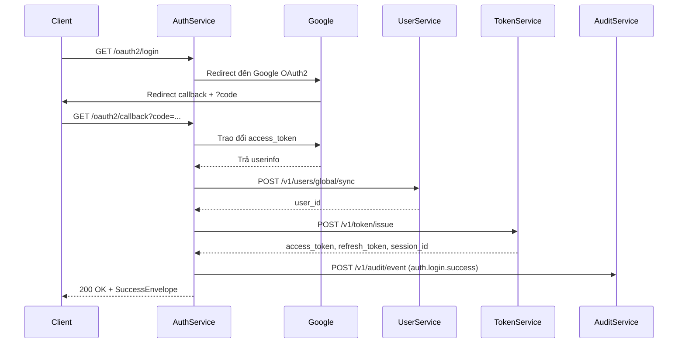

# 📘 Thiết kế chi tiết auth-service/master

## 1. 🧭 Phạm vi & Trách nhiệm

### 1.1. 🎯 Mục đích

`auth-service/master` đóng vai trò là **"Nhà Điều Phối Xác Thực" (Authentication Orchestrator)** trong hệ sinh thái DX-VAS.  
Nó chịu trách nhiệm xác minh danh tính người dùng qua các phương thức được hỗ trợ (Google OAuth2, OTP, Local) và điều phối các thành phần liên quan để hoàn tất quá trình đăng nhập.

### 1.2. ✅ Nằm trong phạm vi

- **Xác thực danh tính người dùng** qua các phương thức được hỗ trợ:
  - ✅ Google OAuth2
  - ✅ OTP (One-Time Password)
  - ✅ Local (username/password)
- **Lấy thông tin người dùng** (email, name, avatar, user_id...) từ Google và đồng bộ với `user-service`.
- **Gửi yêu cầu sinh token** tới `token-service` thông qua API `POST /v1/token/issue`.
- **Lưu audit log đăng nhập** qua `audit-service`.
- **Trả lại phản hồi chuẩn hóa (`SuccessEnvelope`, `ErrorEnvelope`)** cho frontend hoặc API Gateway.

### 1.3. 🚫 Ngoài phạm vi

- ❌ Không tự tạo JWT token (ủy quyền cho `token-service`).
- ❌ Không lưu trữ session/token.
- ❌ Không quản lý RBAC hay introspect permission.
- ❌ Không xử lý logic liên quan đến magic link, OTP, hoặc xác thực 2 bước (2FA).

### 1.4. 👥 Người sử dụng chính

- **Frontend client** (qua OAuth2 redirect flow)
- **API Gateway** (gọi `/me`, `/verify`)
- **token-service** (được gọi tới từ đây)
- **user-service** (được truy vấn hoặc ghi đè user nếu chưa tồn tại)

---

## 2. 🌐 Thiết kế API chi tiết

### 2.1. 🔐 Nhóm: OAuth2 Authentication

| Phương thức | Endpoint           | Mô tả ngắn                                         | Auth | Permission | Ghi chú |
|------------|--------------------|---------------------------------------------------|------|------------|--------|
| GET        | /oauth2/login      | Bắt đầu luồng xác thực với Google OAuth2         | ❌   | ❌         | Redirect đến Google |
| GET        | /oauth2/callback   | Nhận mã `code` từ Google, xử lý lấy access token | ❌   | ❌         | Internal callback endpoint |
| POST       | /auth/exchange     | Xử lý luồng login hoàn chỉnh và cấp JWT token     | ❌   | ❌         | Gọi Google, đồng bộ user, gọi `token-service` |
| POST       | /auth/otp         | Gửi mã OTP đến số điện thoại/email             | ❌   | ❌         | Cho phép public truy cập |
| POST       | /auth/verify-otp  | Xác minh mã OTP và cấp token nếu hợp lệ        | ❌   | ❌         | Gọi `token-service` sau xác thực |
| POST       | /auth/login       | Đăng nhập bằng username/password               | ❌   | ❌         | Gọi `user-service` xác minh, sau đó gọi `token-service` |

> 🔄 Trong luồng `POST /auth/exchange`, sau khi xác thực thành công từ Google:
> 1. Gọi `user-service` để tra cứu/đồng bộ user.
> 2. Gọi `token-service` để phát hành access & refresh token.

---

### 2.2. 🙋 Nhóm: User Identity

| Phương thức | Endpoint     | Mô tả ngắn                                      | Auth | Permission         | Ghi chú |
|------------|--------------|------------------------------------------------|------|--------------------|--------|
| GET        | /me          | Lấy thông tin user hiện tại (từ access token) | ✅   | `user.read.self`   | Trích xuất từ token |
| POST       | /verify      | Xác thực chữ ký và nội dung của access token   | ✅   | `auth.verify.token`| Dành cho API Gateway |

---

### 2.3. 🧪 Nhóm: Internal & Testing

| Phương thức | Endpoint       | Mô tả ngắn                                 | Auth | Permission         | Ghi chú |
|------------|----------------|-------------------------------------------|------|--------------------|--------|
| POST       | /dev/mimic     | Giả lập user login (dành cho dev only)    | ❌   | `auth.mimic.dev`   | Chỉ bật ở `debug_mode` |
| GET        | /oauth2/debug  | In ra thông tin access token từ Google    | ❌   | `auth.oauth.debug` | Internal |

---

### 2.4. 📌 Ghi chú chung

- Các API chính đều tuân theo chuẩn `SuccessEnvelope` và `ErrorEnvelope` như mô tả trong `ADR-011`, `ADR-012`.
- Việc sinh token **không nằm trong auth-service** – thay vào đó, API `/auth/exchange` sẽ gọi `token-service` để lấy JWT và `session_id`.
- Các API `/me` và `/verify` phục vụ frontend và Gateway kiểm tra token.

> **Chi tiết:** [Interface Contract](./interface-contract.md) & [OpenAPI](./openapi.yaml)

---

Dưới đây là phần đã viết lại cho mục `## 3. 📃 Mô hình dữ liệu` trong `auth-service/master/design.md`, phản ánh đúng vai trò "điều phối xác thực", và tuân thủ chỉ thị là **không mô tả session/token nội bộ**, vì phần đó thuộc `token-service`.

---

## 3. 📃 Mô hình dữ liệu

### 3.1. Bảng `auth_provider_config`

Đây là bảng duy nhất `auth-service/master` thực sự quản lý trong DB nội bộ. Nó lưu thông tin cấu hình OAuth2 theo từng tenant, cho phép hệ thống mở rộng hỗ trợ nhiều nhà cung cấp xác thực trong tương lai.

| Trường             | Kiểu dữ liệu | Ghi chú |
|--------------------|--------------|--------|
| `id`               | UUID         | Khóa chính |
| `tenant_id`        | TEXT         | Mã tenant liên kết |
| `provider`         | TEXT         | Hiện tại là `"google"` |
| `client_id`        | TEXT         | Google OAuth2 Client ID |
| `client_secret`    | TEXT         | Google OAuth2 Secret (mã hóa) |
| `redirect_uri`     | TEXT         | Redirect URI khớp với Google config |
| `scopes`           | TEXT[]       | Mảng scopes yêu cầu từ Google |
| `is_active`        | BOOLEAN      | Provider này có đang được kích hoạt không |
| `created_at`       | TIMESTAMPTZ  | Mặc định `now()` |
| `updated_at`       | TIMESTAMPTZ  | Tự động cập nhật |

> 🛡 Mọi access_token của Google sẽ chỉ được lấy nếu provider đó `is_active`.

---

### 3.2. Payload gọi `token-service`

Khi xác thực thành công và cần phát hành token, `auth-service/master` sẽ gửi payload sau đến `token-service` qua API `POST /v1/token/issue`:

```json
{
  "user_id": "u123",
  "tenant_id": "vas-primary",
  "email": "user@example.com",
  "name": "Nguyễn Văn A",
  "avatar": "https://example.com/avatar.png",
  "grant_type": "google",
  "client_ip": "1.2.3.4",
  "user_agent": "Chrome/117"
}
```

📌 Đây là payload chuẩn hóa giữa các dịch vụ. `token-service` sẽ xử lý logic RBAC, sinh JWT, lưu session và trả lại `access_token`, `refresh_token`, `expires_in`, `session_id`.

- `grant_type`: là phương thức xác thực ban đầu của người dùng. Một trong:
  - `google`
  - `otp`
  - `local`

---

### 3.3. Audit Logging

Mọi lần login thành công sẽ gửi event tới `audit-service`:

```json
{
  "event": "auth.login.success",
  "user_id": "u123",
  "tenant_id": "vas-primary",
  "method": "google_oauth2",
  "timestamp": "2025-06-10T12:00:00Z"
}
```

---

📌 **Lưu ý:**
Auth Service **không chứa bảng `users`**, không lưu token, không truy cập trực tiếp Redis. Các dữ liệu đó thuộc trách nhiệm của `user-service` và `token-service`.

👉 **Chi tiết sơ đồ ERD, định nghĩa bảng và chiến lược kiểm thử dữ liệu được trình bày tại**:  
📂 [Data Model](./data-model.md)

---

Dưới đây là nội dung chi tiết cho mục `## 4. 🔄 Luồng xử lý nghiệp vụ chính` của `auth-service/master/design.md`, được viết lại theo mô hình điều phối xác thực hiện tại.

---

## 4. 🔄 Luồng xử lý nghiệp vụ chính

### 4.1. 🎯 Mục tiêu

Luồng xử lý tập trung vào việc xác thực danh tính người dùng qua Google OAuth2 và điều phối các dịch vụ liên quan để:
- Đồng bộ thông tin người dùng vào `user-service`
- Phát hành token thông qua `token-service`
- Gửi log sự kiện xác thực tới `audit-service`

---

### 4.2. 🔁 Luồng: Google OAuth2 Login & Token Issue



> 👉 Các luồng xác thực khác như `OTP`, `Local login` cũng tuân theo quy trình tương tự:  
> Xác minh → đồng bộ user → gọi `token-service` → gửi audit log.

---

### 4.3. 🧠 Diễn giải chi tiết

1. **Bắt đầu OAuth2**:
   `Client` gọi `GET /oauth2/login` → redirect đến Google.

2. **Nhận mã xác thực**:
   Google redirect về `/oauth2/callback?code=...`
   `AuthService` dùng `code` để lấy access\_token và userinfo.

3. **Đồng bộ thông tin người dùng**:
   Gửi thông tin Google profile đến `user-service` để tìm hoặc tạo user (`/v1/users/global/sync`).

4. **Yêu cầu phát hành token**:
   Gửi `user_id`, `tenant_id`, và metadata đến `token-service` để sinh token.

5. **Ghi log audit**:
   Gửi event `auth.login.success` kèm `user_id`, `method`, `tenant_id`.

6. **Trả kết quả cho client**:
   Phản hồi gồm `access_token`, `refresh_token`, `expires_in`, `session_id` trong `SuccessEnvelope`.

---

### 4.4. ⚠️ Lưu ý đặc biệt

* Luồng này **không sử dụng cookie session**, chỉ hoạt động bằng JWT.
* Tất cả token và session đều được phát hành và quản lý bởi `token-service`.
* `auth-service/master` đóng vai trò điều phối thông minh, không giữ state.

---

## 5. 📣 Tương tác giữa các service

`auth-service/master` không hoạt động độc lập, mà là một trung tâm điều phối các tương tác xác thực với các dịch vụ lõi của hệ thống DX-VAS.

---

### 🔗 5.1. `Google OAuth2 Provider`

- Dùng để xác thực danh tính người dùng bằng OAuth2 Authorization Code Flow.
- Giao tiếp thông qua 2 bước:
  - Redirect đến URL xác thực của Google (`/oauth2/login`)
  - Gọi Google API để lấy access token và thông tin người dùng (`/oauth2/callback`)

---

### 🔗 5.2. `user-service`

| API | Vai trò |
|-----|--------|
| `POST /v1/users/global/sync` | Tìm hoặc tạo người dùng từ thông tin Google profile.  
Trả về `user_id`, `tenant_id` |

- Đây là bước đảm bảo mọi người dùng đều có bản ghi đầy đủ trong hệ thống.
- Thao tác này là **idempotent** – có thể gọi nhiều lần mà không sinh bản ghi trùng.

> 🔁 Tất cả các phương thức xác thực (OAuth2, OTP, Local) đều gọi `user-service` để tìm hoặc tạo user.
---

### 🔗 5.3. `token-service`

| API | Vai trò |
|-----|--------|
| `POST /v1/token/issue` | Phát hành JWT token (access + refresh) và session_id. |

- Nhận vào: `user_id`, `tenant_id`, `client_ip`, `user_agent`, `grant_type`.
- Trả ra: `access_token`, `refresh_token`, `session_id`, `expires_in`.

✅ Token chỉ được sinh nếu xác thực danh tính thành công và có `user_id` hợp lệ.

---

### 🔗 5.4. `audit-service`

| API | Vai trò |
|-----|--------|
| `POST /v1/audit/event` | Ghi nhận sự kiện xác thực: `auth.login.success`, `auth.login.failed`... |

- Gửi kèm: `user_id`, `tenant_id`, `timestamp`, `grant_type`, `client_ip`.

---

### 🔗 5.5. `api-gateway`

| API gọi tới | Mục đích |
|-------------|---------|
| `GET /me`   | Lấy thông tin người dùng hiện tại |
| `POST /verify` | Kiểm tra tính hợp lệ và chữ ký của JWT |

- Hai API này giúp Gateway introspect token một cách nhẹ, không cần decode hoặc gọi đến `token-service`.

---

📌 **Tóm lại**, auth-service/master:
- **Không giữ trạng thái**, nhưng **điều phối trạng thái** qua các service khác.
- Là điểm giao tiếp chính giữa thế giới ngoài (Google) và hệ thống nội bộ.

---

## 6. 🔐 Bảo mật & Phân quyền

### 🔐 6.1. Cơ chế bảo mật tổng thể

`auth-service/master` áp dụng mô hình bảo mật theo chuẩn zero-trust:

- ✅ **OAuth2 redirect flow**: sử dụng Google làm Identity Provider.
- ✅ **JWT-based authentication**: mọi truy cập từ frontend hoặc gateway đều dùng `Authorization: Bearer`.
- ✅ **HTTPS-only**: mọi endpoint đều được truy cập qua HTTPS, kể cả redirect và callback.
- ✅ **Không giữ state người dùng**: không dùng session hoặc cookie – mọi thông tin xác thực được kiểm chứng qua JWT.

---

### 🧩 6.2. Kiểm soát truy cập & Phân quyền

| Endpoint        | Yêu cầu Auth | Permission yêu cầu       | Ghi chú |
|----------------|--------------|---------------------------|--------|
| `/oauth2/*`    | ❌           | ❌                        | Cho phép public truy cập |
| `/auth/exchange` | ❌         | ❌                        | Luồng cấp token được bảo vệ bằng OAuth2 code |
| `/me`          | ✅           | `user.read.self`         | Phân quyền nội tại trong token |
| `/verify`      | ✅           | `auth.verify.token`      | Chỉ gọi được nếu token hợp lệ |
| `/dev/mimic`   | ❌ (nếu debug mode) | `auth.mimic.dev` | Chỉ bật trong môi trường dev |
| `/auth/login`     | ❌           | ❌                        | Local login |
| `/auth/otp`       | ❌           | ❌                        | Gửi mã OTP |
| `/auth/verify-otp`| ❌           | ❌                        | Xác minh OTP |

✅ Tất cả phân quyền động đều được kiểm soát ở cấp `api-gateway`. Auth service **không cần** tự tra quyền.

---

### 🧾 6.3. Header kiểm soát & Trace

Auth service xử lý và forward các header sau:

| Header              | Vai trò |
|---------------------|--------|
| `Authorization`     | Bearer token để xác thực người dùng |
| `X-Tenant-ID`       | Mã tenant được trích xuất từ token |
| `X-Trace-ID`        | Dùng để trace toàn bộ luồng xử lý |
| `X-User-ID`         | Inject vào response (ở `/me`, `/verify`) |
| `X-Login-Method` | Phương thức đăng nhập (`google`, `otp`, `local`) – được decode từ JWT, hỗ trợ logging & conditional logic phía backend |

---

### 📜 6.4. Chính sách JWT

- **issuer (`iss`)**: `https://auth.truongvietanh.edu.vn`
- **audience (`aud`)**: `dx-vas`
- **scope**: chưa sử dụng, có thể mở rộng
- **exp**: được thiết lập bởi `token-service`, không can thiệp
- **signature**: sử dụng HS256 hoặc RS256, cấu hình tại `token-service`

---

### ⚠️ 6.5. Biện pháp chống giả mạo

- Không chấp nhận bất kỳ request có `code` hoặc `token` từ Google nếu không được xác thực trực tiếp qua callback URL hợp lệ.
- Callback URL phải match 100% `redirect_uri` đã đăng ký trong bảng `auth_provider_config`.
- Tự động kiểm tra `nonce` nếu triển khai OIDC.

---

✅ Bảo mật hệ thống không nằm ở auth-service riêng lẻ, mà ở **sự phối hợp chuẩn hóa giữa auth-service, token-service và api-gateway**.

---

## 7. ⚙️ Cấu hình & Phụ thuộc

### 🔧 7.1. Cấu hình môi trường (Environment Variables)

| Biến                 | Mô tả                                      | Ví dụ |
|----------------------|---------------------------------------------|--------|
| `ENV`                | Môi trường vận hành                         | `production` / `staging` / `dev` |
| `PORT`               | Cổng service lắng nghe                      | `8080` |
| `OAUTH_CLIENT_ID`    | Google OAuth2 client ID                     | `abc123.apps.googleusercontent.com` |
| `OAUTH_CLIENT_SECRET`| Google OAuth2 client secret (mã hóa)        | `secretXYZ` |
| `OAUTH_REDIRECT_URI` | Redirect URI sau khi xác thực Google       | `https://auth.truongvietanh.edu.vn/oauth2/callback` |
| `AUDIT_SERVICE_URL`  | Endpoint để gửi log tới `audit-service`     | `http://audit-service/v1/audit/event` |
| `USER_SERVICE_URL`   | Endpoint để đồng bộ user                    | `http://user-service/v1/users/global/sync` |
| `TOKEN_SERVICE_URL`  | Endpoint để yêu cầu cấp token               | `http://token-service/v1/token/issue` |
| `DEBUG_MODE`         | Bật các API dành cho môi trường phát triển | `true` / `false` |

---

### 📦 7.2. Phụ thuộc hệ thống

| Thành phần | Vai trò chính | Ghi chú |
|------------|---------------|--------|
| `Google OAuth2`    | Xác thực người dùng | OAuth2 flow |
| `user-service`     | Tra cứu/đồng bộ user | Đồng bộ user_id theo email |
| `token-service`    | Cấp token & quản lý session | Service này giữ trạng thái |
| `audit-service`    | Ghi nhận log xác thực | Gửi sự kiện đăng nhập, debug |

---

### 🧱 7.3. Không phụ thuộc

> Auth Service **không phụ thuộc** vào:

- Database quan hệ cho logic xác thực (chỉ dùng 1 bảng `auth_provider_config`)
- Redis (session và revoked token lưu ở `token-service`)
- Các công cụ 2FA, CAPTCHA (chưa tích hợp)

---

### ☁️ 7.4. Tích hợp triển khai (DevOps)

| Thành phần | Ghi chú |
|------------|--------|
| Dockerfile | Có sẵn, dùng Python + Uvicorn |
| Helm chart | Tùy chọn, dùng để triển khai trong Kubernetes |
| Liveness Probe | `/healthz` |
| Logging | Định dạng JSON theo chuẩn chung |
| Metrics | `/metrics` nếu bật Prometheus exporter |

---

📌 Tất cả cấu hình nhạy cảm nên được inject thông qua Secret Manager hoặc môi trường CI/CD (GitHub Actions, GitLab, v.v.).

---

## 8. 🧪 Testing

Việc kiểm thử `auth-service/master` cần đảm bảo 3 tiêu chí:
1. Xác thực OAuth2 đúng chuẩn
2. Tích hợp đúng với `user-service`, `token-service`
3. Trả lỗi đúng chuẩn `ErrorEnvelope`, đúng `trace_id`

---

### ✅ 8.1. Unit Test

| Thành phần | Mục tiêu kiểm thử |
|------------|-------------------|
| OAuth2 flow redirect | Kiểm tra URL redirect Google đúng cấu hình |
| Callback exchange | Mã hóa/decode `code`, mock Google API |
| Payload gửi user-service | Đúng định dạng, chứa đủ field |
| Payload gửi token-service | Chuẩn hóa theo contract |
| Response formatter | Bao bọc `SuccessEnvelope`, `ErrorEnvelope` |
| Logging & Trace | Log `trace_id`, gọi đúng logger |

- Sử dụng: `pytest`, `pytest-mock`
- Coverage khuyến nghị: ≥ 90% core logic

---

### 🧪 8.2. Integration Test

| Tình huống | Kiểm thử tích hợp với |
|------------|------------------------|
| Login Google thành công | mock Google + user-service + token-service |
| Login thất bại (token không hợp lệ) | `400 Bad Request` |
| Token-service trả lỗi | Đảm bảo lỗi được wrap đúng format |
| user-service timeout | Trả lỗi `503 Service Unavailable` |

- Có thể mock bằng `httpx.MockTransport`, `requests-mock`, hoặc `wiremock` cho local.

---

### 🌐 8.3. End-to-End Test (E2E)

| Môi trường | Test scenario |
|------------|---------------|
| Staging    | Full OAuth2 login with real Google credentials |
| CI Pipeline | Run với service mock hoặc stub containers |
| Debug mode | Test `/dev/mimic` trả token giả lập |

- Khuyến khích dùng tool như `Playwright`, `Postman`, hoặc `k6` để test tự động.

---

### 📋 8.4. Bộ test đặc biệt

| API | Test |
|-----|------|
| `/verify` | Trả lỗi đúng nếu token sai chữ ký, hoặc expired |
| `/me`     | Trả đúng thông tin người dùng từ token payload |
| `/auth/exchange` | Response chứa đủ `access_token`, `session_id`, `expires_in` |

---

### 📦 8.5. CI/CD Check

- ✅ Format chuẩn hóa theo `black`, `flake8`
- ✅ Test chạy qua `pytest` với coverage
- ✅ Swagger linter: `spectral lint openapi.yaml`

---

## 9. 📈 Observability

`auth-service/master` được thiết kế để dễ dàng giám sát, debug và truy vết lỗi, đảm bảo có thể quan sát toàn bộ luồng xác thực từ đầu đến cuối trong môi trường production.

---

### 📍 9.1. Logging

| Thành phần | Ghi chú |
|------------|---------|
| Format | JSON log chuẩn hóa |
| Bắt buộc | `trace_id`, `tenant_id`, `user_id`, `grant_type` |
| Level | `INFO` cho flow, `ERROR` cho exception |
| Logger | Sử dụng `structlog` hoặc `loguru` để có cấu trúc log tốt |

> Mỗi request đều gắn `trace_id` (từ header hoặc sinh mới) và ghi log theo luồng.

---

### 📊 9.2. Metrics (Prometheus)

| Metric | Mô tả |
|--------|------|
| `auth_requests_total` | Tổng số request vào `auth-service` (label theo `endpoint`, `status_code`) |
| `auth_login_success_total` | Số lần login thành công |
| `auth_login_failed_total` | Số lần login thất bại |
| `auth_google_latency_seconds` | Đo thời gian phản hồi của Google OAuth2 |
| `auth_token_issue_latency_seconds` | Latency khi gọi `token-service` |

> Có thể export metrics qua `/metrics` (tuỳ chọn bật qua config `ENABLE_METRICS=true`).

---

### 📝 9.3. Audit Logging

| Event | Gửi tới `audit-service` |
|-------|--------------------------|
| `auth.login.success` | Khi login thành công (kèm user_id, tenant_id, ip) |
| `auth.login.failed`  | Khi login thất bại (lý do: google_error, user_sync_failed…) |
| `auth.token.issue_error` | Khi gọi `token-service` thất bại |
| `auth.login.otp.success`     | Khi OTP login thành công |
| `auth.login.local.success`   | Khi Local login thành công |
| `auth.login.otp.failed`      | Khi OTP không đúng hoặc hết hạn |
| `auth.login.local.failed`    | Khi username/password sai |

> Audit log giúp điều tra post-mortem, phân tích hành vi người dùng và tuân thủ.

---

### 📈 9.4. Trace (OpenTelemetry)

| Trạng thái | Ghi chú |
|------------|--------|
| ✅ Hỗ trợ `X-Trace-ID` xuyên suốt các service |
| ✅ Tích hợp `OTEL_EXPORTER_OTLP_ENDPOINT` để gửi trace ra hệ thống ngoài (tempo/jaeger) |
| ✅ Tag custom: `grant_type`, `user_email`, `provider`, `step=google_exchange/token_issue` |

> Trace giúp hình dung được toàn bộ pipeline login: từ Google → user → token → audit

---

### 🔎 9.5. Alert Rule gợi ý

| Rule | Mô tả |
|------|------|
| `login_success_rate < 80% trong 5 phút` | Cảnh báo login bất thường |
| `auth_google_latency_seconds > 2s` | Google chậm |
| `auth_token_issue_latency_seconds > 1s` | Token-service chậm hoặc lỗi |

---

📌 Tất cả các log, metrics và trace cần phải được gắn `trace_id` để correlate đa chiều.

---

## 10. 🔁 Reliability

`auth-service/master` được thiết kế với triết lý **stateless + fail-fast**, nhằm đảm bảo khả năng phục hồi cao trong mọi tình huống xác thực:

---

### 💡 10.1. Stateless by Design

- Không lưu token, session hay user state.
- Mọi trạng thái được delegate tới `token-service`, `user-service`.
- Có thể scale ngang (`horizontal scaling`) dễ dàng.

---

### 🔄 10.2. Cơ chế Retry & Timeout

| Đối tượng | Timeout | Retry | Ghi chú |
|----------|---------|-------|--------|
| Google OAuth2      | 5s      | ❌     | Chỉ retry thủ công từ phía client |
| user-service       | 3s      | ✅ (1 lần) | Retry soft trên lỗi 5xx hoặc timeout |
| token-service      | 3s      | ✅ (1 lần) | Retry nếu `ECONNREFUSED` hoặc timeout |
| audit-service      | 2s      | ❌ (fire-and-forget) | Log lỗi nếu gửi thất bại, không ảnh hưởng user flow |

> ❗ Mọi retry đều phải gắn `trace_id` để đảm bảo idempotency và debug chính xác.

---

### 🧱 10.3. Fail-Fast Strategy

- Nếu bất kỳ service backend nào trả về lỗi không recover được (Google, token, user), Auth Service sẽ trả lỗi ngay lập tức kèm `ErrorEnvelope`.
- Tránh “hấp hối” nhiều tầng – mọi failure đều rõ ràng.

---

### ⛑ 10.4. Graceful Fallback

- Nếu `audit-service` không khả dụng → ghi log `audit_event_failed` để retry sau (async hoặc batch).
- Nếu `user-service` mất kết nối → trả lỗi rõ ràng `user.sync.failed` với chi tiết trong `error.details`.

---

### 🛡 10.5. Circuit Breaker (Tùy chọn)

- Có thể bật `circuit-breaker` bằng `fastapi_circuitbreaker` hoặc `pybreaker` cho từng service critical.
- Ví dụ: nếu `token-service` thất bại > 5 lần liên tục trong 30s → tạm thời ngắt luồng login để giảm tải.

---

### 🧪 10.6. Chaos Testing (khuyến nghị)

| Kịch bản | Mục tiêu |
|---------|----------|
| Mô phỏng Google timeout | Kiểm tra khả năng fallback và logging |
| Đứt kết nối tới user-service | Kiểm tra lỗi có rõ ràng không |
| Trả lỗi giả từ token-service | Kiểm tra retry và message chính xác |

---

### 🧮 10.7. SLA gợi ý

| API | SLA |
|-----|-----|
| `/auth/exchange` | ≥ 99.95% |
| `/me`, `/verify` | ≥ 99.99% |

---

Dưới đây là nội dung chi tiết cho mục `## 11. ⚡️ Hiệu năng & Scale` trong `auth-service/master/design.md`, tập trung vào đặc thù xử lý nhanh, stateless và khả năng scale ngang dễ dàng:

---

## 11. ⚡️ Hiệu năng & Scale

`auth-service/master` là một trong những dịch vụ nhạy cảm nhất về hiệu năng do:
- Tham gia trực tiếp vào luồng đăng nhập
- Gọi nhiều dịch vụ backend (Google, user, token, audit)
- Phải phản hồi gần như real-time

---

### 🚀 11.1. Đặc điểm hiệu năng

| Thuộc tính | Ghi chú |
|------------|--------|
| Stateless | Không lưu session, cache hay user context |
| I/O bound | Hầu hết thời gian là chờ HTTP response từ bên ngoài |
| CPU-light | Chủ yếu xử lý JSON, không cần CPU mạnh |
| Memory-light | Không giữ nhiều context/lifecycle dài |

> Đây là service lý tưởng để scale theo chiều ngang (horizontal scaling).

---

### 🧮 11.2. Ước lượng hiệu năng

| Loại request | Thời gian xử lý ước tính |
|--------------|---------------------------|
| `/auth/exchange` (full login) | ~400–600ms |
| `/me`, `/verify` | ~5–20ms (decode token + enrich + log) |
| `/oauth2/callback` | ~200ms (Google + prepare payload) |

> Trong môi trường production, thời gian xử lý 99 percentile nên dưới 800ms cho full login.

---

### 📏 11.3. Benchmark cơ bản (tham khảo)

```plaintext
500 concurrent requests
1000 RPS tổng
99.5% success rate
Average latency: ~650ms
Memory usage: ~60MB / instance
```

---

### 📈 11.4. Chiến lược scale

| Kỹ thuật                       | Mô tả                                                                  |
| ------------------------------ | ---------------------------------------------------------------------- |
| Auto-scaling theo CPU hoặc RPS | Khuyến nghị scale từ 2 → 6 instance                                    |
| Zero-downtime deploy           | Sử dụng rolling update trong Kubernetes                                |
| Multi-zone deployment          | Dùng multi-AZ trong GKE / EKS để đảm bảo HA                            |
| Readiness probe                | Đảm bảo chỉ route traffic khi service đã warm-up (Google client ready) |

---

### 📉 11.5. Tối ưu cụ thể

| Mục tiêu                 | Biện pháp                                          |
| ------------------------ | -------------------------------------------------- |
| Giảm độ trễ Google       | Cache metadata Google OAuth2 discovery             |
| Giảm tải `token-service` | Chỉ gọi khi user + tenant hợp lệ (pre-validation)  |
| Giảm cost audit          | Gửi async hoặc batch log login                     |
| Tối ưu `/me`, `/verify`  | Tách riêng route nhẹ không phụ thuộc dịch vụ ngoài |

---

Dưới đây là phần `## 12. 🧩 Triển khai & Migration` dành cho `auth-service/master/design.md`, tập trung vào quy trình triển khai an toàn, không downtime và hỗ trợ nâng cấp cấu hình OAuth2 theo tenant.

---

## 12. 🧩 Triển khai & Migration

### 🚀 12.1. Chiến lược triển khai

`auth-service/master` được thiết kế để:
- Dễ dàng triển khai theo mô hình microservice
- Tách biệt rõ môi trường (`staging`, `production`)
- Hạn chế downtime bằng rolling update

#### 📦 Cách triển khai tiêu chuẩn:

| Thành phần | Công nghệ đề xuất |
|------------|-------------------|
| Containerization | Docker |
| Orchestrator | Kubernetes (GKE / EKS / self-hosted) |
| CI/CD | GitHub Actions / GitLab CI |
| Config | Environment variables + Secret Manager |
| Routing | Ingress Gateway / API Gateway |

---

### ⛳ 12.2. Zero Downtime Strategy

| Kỹ thuật | Ghi chú |
|----------|--------|
| `readinessProbe` | Trả `200 OK` khi OAuth2 config đã load xong |
| `livenessProbe` | `/healthz` để kiểm tra vòng lặp xử lý |
| Rolling Update | Thay thế từng instance 1 cách an toàn |
| Sessionless | Không mất context khi instance bị restart |

---

### 🔄 12.3. Migration Strategy (Dữ liệu & Cấu hình)

#### ✅ Bảng `auth_provider_config`:

- Có thể được khởi tạo qua script SQL hoặc Alembic.
- Hỗ trợ nhiều tenant: mỗi tenant có cấu hình OAuth riêng.

```sql
CREATE TABLE auth_provider_config (
    id UUID PRIMARY KEY,
    tenant_id TEXT NOT NULL,
    provider TEXT DEFAULT 'google',
    client_id TEXT NOT NULL,
    client_secret TEXT NOT NULL,
    redirect_uri TEXT NOT NULL,
    scopes TEXT[] DEFAULT ARRAY['email', 'profile'],
    is_active BOOLEAN DEFAULT TRUE,
    created_at TIMESTAMPTZ DEFAULT now(),
    updated_at TIMESTAMPTZ DEFAULT now()
);
```

#### 📌 Gợi ý Migration bước đầu:

1. Tạo record mặc định cho tenant `vas-primary` từ file `seeds/init_google_oauth.sql`
2. Load config OAuth từ bảng khi service start
3. Dùng cache nội bộ để giảm truy vấn DB (TTL 5 phút)

---

### 🧪 12.4. Chuẩn bị cho production

| Hạng mục                                       | Trạng thái             |
| ---------------------------------------------- | ---------------------- |
| Google OAuth Client đã đăng ký?                | ✅                      |
| `redirect_uri` có khớp với config?             | ✅                      |
| Config OAuth được mã hóa an toàn?              | ✅ (qua Secret Manager) |
| Có kiểm thử `/auth/exchange` thật?             | ✅ staging              |
| Truy vết đầy đủ (`trace_id`, `audit-service`)? | ✅                      |

---

## 13. 📚 Tài liệu liên quan

* [Interface Contract](./interface-contract.md)
* [Data Model](./data-model.md)
* [OpenAPI Spec](./openapi.yaml)
* [ADR-006 - Auth Strategy](../../../ADR/adr-006-auth-strategy.md)
* [ADR-012 - Response Structure](../../../ADR/adr-012-response-structure.md)
* [ADR-011 - API Error Format](../../../ADR/adr-011-api-error-format.md)
