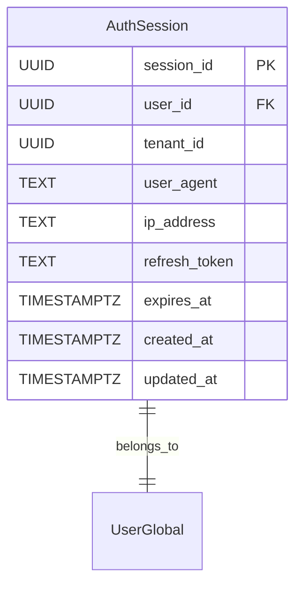
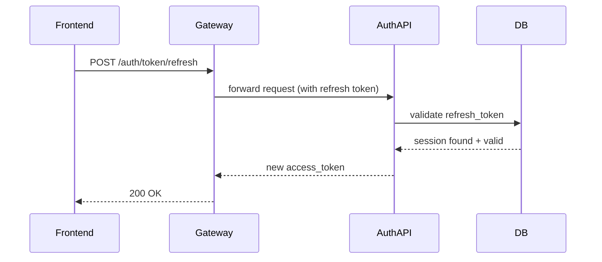
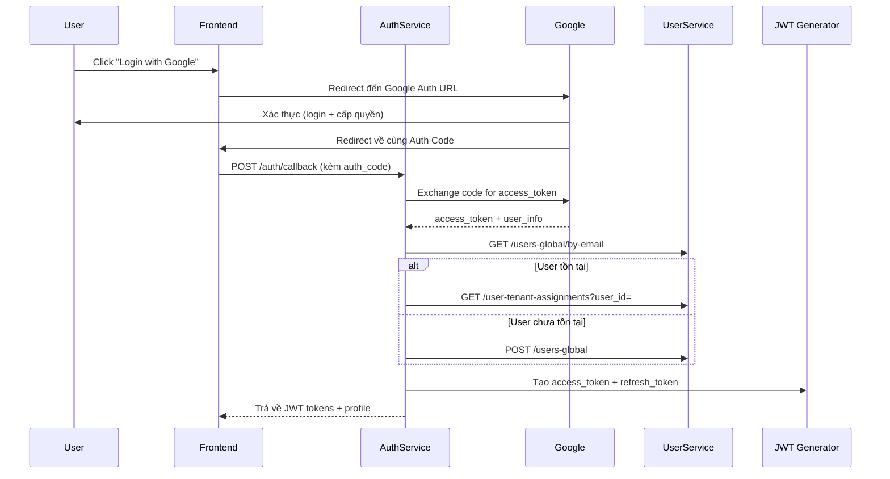
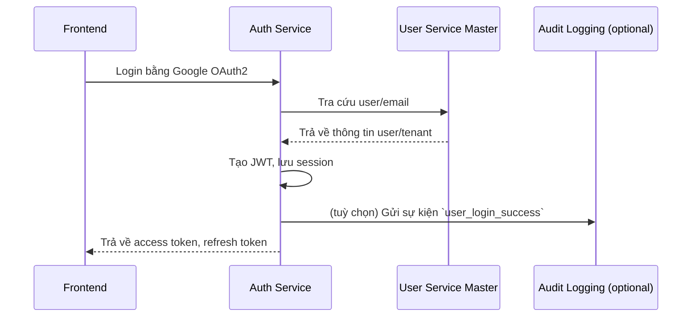

# 📘 Thiết kế chi tiết auth-service/master

```
title: Thiết kế chi tiết auth-service/master
version: 1.2
last_updated: 2025-06-01
author: DX VAS Team
reviewed_by: Stephen Le
```

## 1. 🧭 Phạm vi và Trách nhiệm (Scope & Responsibilities)

### 🌟 Mục tiêu

* Cung cấp khả năng đăng nhập/refresh token cho toàn hệ thống dựa trên JWT.
* Xác thực danh tính user và cung cấp danh sách permission ứng với context tenant.
* Phục vụ cho API Gateway, User Service và Frontend App trong việc xác thực truy cập.

### 📦 Các thực thể dữ liệu quản lý

| Thực thể           | Mô tả                                                                            |
| ------------------ | -------------------------------------------------------------------------------- |
| AuthSession        | Quản lý access token và refresh token của user. Lưu theo cặp user/tenant/device. |
| AuthProviderConfig | Cấu hình các nhà cung cấp đăng nhập OAuth2 (Google...) cho tenant.               |

### 🔒 Ngoài Phạm Vi (Out of Scope)

Service này **không** thực hiện các tác vụ sau:

* ❌ Quản lý vòng đời user (do User Service quản lý).
* ❌ Kiểm tra permission chi tiết cho mỗi API (API Gateway đảm nhiệm).
* ❌ Lưu trữ thông tin danh tính của user (như email, full name...)

---

## 2. 🌐 Thiết kế API chi tiết (Interface Contract)

| Method | Path                   | Tác vụ                                           | Yêu cầu permission |
| ------ | ---------------------- | ------------------------------------------------ | ------------------ |
| POST   | `/auth/token`          | Đăng nhập và nhận access + refresh token         | ❌ (Public)         |
| POST   | `/auth/token/refresh`  | Lấy access token mới từ refresh token            | ❌ (Public)         |
| GET    | `/auth/me`             | Thông tin user đang đăng nhập                    | ✅ (Cần token)      |
| GET    | `/auth/me/permissions` | Danh sách permission theo tenant                 | ✅ (Cần token)      |
| GET    | `/auth/providers`      | Danh sách Auth Provider đang được bật cho tenant | ❌ (Public)         |

> Tuân thủ [ADR-012 Response Structure](../../../ADR/adr-012-response-structure.md) & [ADR-011 Error Format](../../../ADR/adr-011-api-error-format.md)

### 📦 Ví dụ response `GET /auth/me/permissions`

```json
{
  "data": [
    "student.view",
    "classroom.manage"
  ],
  "meta": {
    "request_id": "req-xyz-123",
    "timestamp": "2025-06-01T10:30:00Z"
  }
}
```

---

## 3. 📃 Mô hình dữ liệu chi tiết (Data Model)



| Cột            | Kiểu        | Ghi chú                         |
| -------------- | ----------- | ------------------------------- |
| session\_id    | UUID        | PK, ID duy nhất cho mỗi session |
| user\_id       | UUID        | FK đến UserGlobal               |
| tenant\_id     | UUID        | Tenant hiện tại                 |
| refresh\_token | TEXT        | Đã mã hóa, chỉ dùng server-side |
| expires\_at    | TIMESTAMPTZ | Thời gian hết hạn               |
| created\_at    | TIMESTAMPTZ | Ngày tạo                        |
| updated\_at    | TIMESTAMPTZ | Ngày cập nhật cuối              |

### AuthProviderConfig

| Trường             | Kiểu dữ liệu | Ràng buộc        | Ghi chú                                         |
|--------------------|--------------|------------------|------------------------------------------------|
| id                 | UUID         | PK               |                                                |
| provider_name      | TEXT         | UNIQUE, NOT NULL | Ví dụ: `google`, `facebook`, `microsoft`       |
| client_id          | TEXT         | NOT NULL         | ID do provider cấp                             |
| client_secret      | TEXT         | NOT NULL         | Bí mật tương ứng                               |
| auth_url           | TEXT         | NOT NULL         | URL để redirect tới màn hình đăng nhập OAuth   |
| token_url          | TEXT         | NOT NULL         | URL để lấy access_token từ auth code           |
| scopes             | TEXT[]       | NOT NULL         | Danh sách scope mặc định                       |
| created_at         | TIMESTAMPTZ  | DEFAULT now()    | Thời điểm tạo cấu hình                         |
| updated_at         | TIMESTAMPTZ  | DEFAULT now()    | Thời điểm cập nhật cấu hình                    |

### Bảng: `auth_provider_configs`

Mục đích: Quản lý cấu hình OAuth2 cho từng provider (hiện tại chỉ hỗ trợ Google).

```sql
CREATE TABLE auth_provider_configs (
    provider TEXT PRIMARY KEY,                         -- Ví dụ: 'google'
    client_id TEXT NOT NULL,
    client_secret TEXT NOT NULL,
    auth_url TEXT NOT NULL,
    token_url TEXT NOT NULL,
    user_info_url TEXT NOT NULL,
    scopes TEXT[] NOT NULL,
    is_enabled BOOLEAN DEFAULT TRUE,
    updated_at TIMESTAMPTZ DEFAULT now()
);
```

---

## 4. 🔄 Luồng xử lý nghiệp vụ chính

### Luồng: Refresh Token


### Luồng Đăng nhập qua Google OAuth2


---

## 5. 📣 Tương tác với các Service khác & Luồng sự kiện

* **User Service Master:** Dùng để đồng bộ thông tin người dùng khi login lần đầu (nếu user mới). Auth Service gọi sang `GET /users-global/by-email` để tra cứu theo email từ Google ID Token. Nếu chưa tồn tại, sẽ gọi `POST /users-global` để tạo mới.

* **Audit Logging Service:**
    * Ngay cả trong giai đoạn v1, Auth Service có thể phát các sự kiện audit cơ bản:
        * `user_login_success` – khi người dùng đăng nhập thành công (đầy đủ email, tenant, role).
        * `token_refreshed` – khi refresh token thành công.



---

## 6. 🔐 Bảo mật & Phân quyền

* Authentication: Dựa trên JWT (access\_token) do service phát hành. Token được Gateway validate.
* Authorization: Service cung cấp danh sách permission qua `/auth/me/permissions`. Phân quyền chi tiết được Gateway xử lý.

---

## 7. ⚙️ Cấu hình & Phụ thuộc

| Biến môi trường       | Mục đích                              |
| --------------------- | ------------------------------------- |
| PORT                  | Cổng lắng nghe                        |
| DATABASE\_URL         | Kết nối DB                            |
| JWT\_SECRET\_KEY      | Ký token                              |
| JWT\_EXPIRE\_SECONDS  | Thời gian hết hạn access token        |
| REFRESH\_EXPIRE\_DAYS | Hết hạn refresh token (mặc định: 30d) |

---

## 8. 🧪 Testing

### Unit Test:

* Kiểm tra logic tạo JWT, xác thực refresh token, xử lý lỗi Google OAuth2.
* Mock interaction với Google OAuth2 và Redis.

### Integration Test:

* Test login flow end-to-end:
    * Với Google OAuth2 (sử dụng test credentials)
    * Tương tác với User Service (giả lập các response)

### Contract Test:

* Kiểm tra định dạng JWT và response của `/auth/me/permissions`.

### Security Test:

* Kiểm tra các token giả mạo.
* Kiểm tra rò rỉ thông tin trong log.

### Load Test:

* Mô phỏng 5000 requests/phút cho `/auth/login` và `/auth/refresh`.

---

## 9. Monitoring & Observability

### Metrics chính cần theo dõi:

| Tên Metric                            | Loại   | Ghi chú                                             |
|---------------------------------------|--------|-----------------------------------------------------|
| `auth_login_success_total`            | Counter| Số lượng login thành công                           |
| `auth_login_failed_total`             | Counter| Số lượng login thất bại (theo lỗi, theo provider)   |
| `auth_token_refresh_total`            | Counter| Số lần refresh token                                |
| `auth_active_sessions`                | Gauge  | Số lượng session đang hoạt động                     |
| `auth_request_duration_seconds`       | Histogram | Độ trễ xử lý request theo route/method          |

### Logging:

* **Mức độ:** `INFO`, `WARNING`, `ERROR`
* **Log khi:**
    * Login thành công/thất bại
    * Token được refresh
    * Token bị từ chối do hết hạn hoặc giả mạo
* **Không log:** Thông tin nhạy cảm như `client_secret`, access_token gốc từ Google

### Healthcheck:

* Route: `GET /auth/health`
* Kiểm tra:
    * Kết nối đến Redis (nếu có)
    * Trạng thái nội bộ ứng dụng

---

## 10. 🚀 Độ tin cậy & Phục hồi

* **Retry Logic:**
    * Retry 3 lần khi trao đổi token với Google thất bại do lỗi mạng.
    * Không retry nếu Google trả về lỗi xác thực không hợp lệ.

* **Idempotency:**
    * Refresh token chỉ sử dụng **một lần duy nhất**.
    * Mỗi refresh token được gắn với 1 session ID. Nếu đã bị sử dụng, token sẽ bị thu hồi.

* **Session Expiry:**
    * Session có thời hạn xác định, tự động hết hạn và bị xóa khỏi Redis (nếu có TTL).

* **Fallback:**
    * Nếu `UserService` không phản hồi:
        * Không cho phép login, ghi log lỗi rõ ràng.
        * Trả về mã lỗi `503 Service Unavailable`.

---

## 11. ⚡️ Hiệu năng & Mở rộng

* **Stateless:** Mọi thông tin đều nằm trong JWT hoặc Redis session store. Có thể scale theo chiều ngang dễ dàng.
* **Caching:** Kết quả `GET /auth/me/permissions` có thể được cache tạm thời phía frontend nếu JWT vẫn còn hiệu lực.
* **Expected Load:**
    * Tối đa: 10K login requests/giờ.
    * Refresh token: ~3-4 lần/ngày/user.
* **SLO:**
    * 99% request `/auth/login`, `/auth/refresh` trả kết quả trong <300ms.

---

## 12. Kế hoạch Triển khai & Migration

* **Triển khai lần đầu:**
    * Khởi tạo bảng `auth_sessions`.
    * Nạp config cho `GOOGLE_CLIENT_ID`, `GOOGLE_CLIENT_SECRET`.

* **Công cụ migration schema:**
    * Sử dụng Alembic để quản lý schema.
    * Tuân thủ ADR-023 (Schema Migration Strategy).

* **Zero downtime:**
    * Mỗi thay đổi được kiểm thử backward compatibility trước.
    * Sử dụng rolling update trên Kubernetes cluster.

---

## 13. 📚 Tài liệu liên quan

* [Interface Contract](./interface-contract.md)
* [Data Model](./data-model.md)
* [OpenAPI Spec](./openapi.yaml)
* [ADR-006 - Auth Strategy](../../../ADR/adr-006-auth-strategy.md)
* [ADR-012 - Response Structure](../../../ADR/adr-012-response-structure.md)
* [ADR-011 - API Error Format](../../../ADR/adr-011-api-error-format.md)
