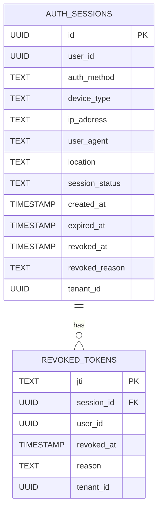
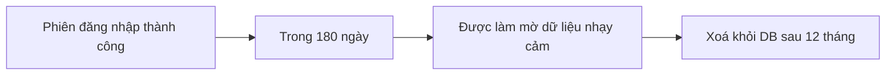

# 🗃️ Auth Service Sub - Data Model v2.0

## 1. 📘 Mục tiêu & Phạm vi

Tài liệu này định nghĩa **mô hình dữ liệu** cho `auth-service/sub`, một service xác thực per-tenant trong hệ thống `dx-vas`. Việc thiết kế mô hình dữ liệu chuẩn xác là nền tảng để:

- Đảm bảo tính toàn vẹn, bảo mật và khả năng mở rộng của dữ liệu xác thực người dùng
- Phục vụ các thao tác xác thực OTP, Local Login, quản lý phiên đăng nhập, và thu hồi token
- Ghi nhận metadata cần thiết cho audit log, bảo vệ hệ thống khỏi gian lận
- Đảm bảo khả năng truy vết (traceability) và phân quyền truy cập theo chính sách RBAC

---

### 🎯 Mục tiêu cụ thể

- Thiết kế bảng dữ liệu `auth_sessions` chuẩn hóa, phản ánh đầy đủ vòng đời một phiên đăng nhập
- Định nghĩa cấu trúc cache `revoked_tokens` trên Redis dùng để thu hồi token chủ động
- Chuẩn hóa metadata gắn với session bao gồm `ip_address`, `user_agent`, `device_type`, `location`
- Phân loại và mô tả các giá trị ENUM quan trọng trong logic xác thực (`auth_method`, `device_type`, v.v.)
- Thiết lập chiến lược Retention & Anonymization nhất quán với toàn hệ thống
- Hỗ trợ kiểm thử và migration schema dễ dàng trên môi trường multi-tenant

---

### 📦 Phạm vi dữ liệu được quản lý

| Loại dữ liệu | Mô tả |
|--------------|------|
| **auth_sessions** | Ghi nhận mỗi phiên đăng nhập thành công của user |
| **revoked_tokens** | Lưu token bị thu hồi chủ động hoặc hết hiệu lực (Redis) |
| **Session metadata** | Thông tin môi trường xác thực: IP, thiết bị, trình duyệt |
| **Login method** | Phân biệt giữa OTP / Local login |
| **Trạng thái phiên** | Được duy trì để phục vụ giao diện quản trị hoặc phân tích |

---

### 🚫 Ngoài phạm vi (Out of Scope)

| Thành phần | Ghi chú |
|------------|---------|
| **OAuth2 / Social login (Google)** | Được xử lý bởi `auth-service/master` theo `adr-006` |
| **Thông tin người dùng (user profile)** | Được quản lý tại `user-service` |
| **Kiểm tra RBAC / quyền truy cập** | Được thực hiện tại `api-gateway` và `rbac-cache` |
| **Refresh token storage** | Không lưu refresh token, chỉ xử lý revoke qua `token-service` |

---

### 🧭 Liên hệ kiến trúc tổng thể

Mô hình dữ liệu được thiết kế để vận hành tốt trong kiến trúc:
- Multi-tenant per-instance (mỗi tenant có DB riêng hoặc schema riêng)
- Stateless microservice (tất cả trạng thái xác thực được externalized)
- Token-based auth (không lưu trạng thái user đăng nhập trong RAM)
- RBAC externalized (quản lý quyền ngoài auth-service/sub)

---

## 2. 🧩 Tổng Quan Dữ Liệu & Mối Quan Hệ

Mô hình dữ liệu của `auth-service/sub` được thiết kế tối giản và hiệu quả, tập trung vào việc quản lý **vòng đời phiên đăng nhập** và **việc thu hồi token**, đồng thời ghi nhận đầy đủ metadata phục vụ cho audit, phân tích bảo mật và giám sát hành vi người dùng.

---

### 2.1. Sơ đồ ERD (Entity Relationship Diagram)



---

### 2.2. Giải thích mối quan hệ

| Quan hệ | Loại | Mô tả |
|--------|------|------|
| `auth_sessions` → `revoked_tokens` | 1:N | Mỗi phiên có thể có nhiều token bị thu hồi liên quan (vd. refresh token, access token thứ cấp) |
| `user_id`, `tenant_id` | Chỉ định người dùng và tenant tương ứng với phiên |
| `session_id` | Được sử dụng để liên kết ngược từ cache hoặc revoke record đến phiên đăng nhập gốc |

✅ Mọi bảng đều có khóa chính rõ ràng, hỗ trợ phân vùng theo `tenant_id` nếu cần.

---

### 2.3. Ký hiệu & conventions

- **UUID**: Toàn bộ các khoá chính và liên kết đều dùng UUID để đảm bảo tính toàn cục và dễ trace.
- **snake_case**: Dùng thống nhất cho tên cột.
- **tenant_id**: Có mặt ở mọi bảng để đảm bảo khả năng lọc, truy xuất và bảo vệ tenant isolation.
- **Timestamp**: Luôn dùng timezone-aware timestamp (`TIMESTAMPTZ` nếu PostgreSQL).
- **Trạng thái logic** (như `revoked_at`, `revoked_reason`, `session_status`) dùng nullable field thay vì boolean flag — đảm bảo mở rộng về sau.

---

### 🧠 Ghi chú thiết kế

- Không có bảng `users` trong service này – mọi thông tin user được đồng bộ từ `user-service`.
- Cache `revoked_tokens` trên Redis có thể phản ánh một phần dữ liệu từ DB để tối ưu tra cứu runtime.
- Session metadata có thể phục vụ cho audit log, tracking đăng nhập bất thường, hoặc security scoring.

---

## 3. 📌 Bảng `auth_sessions`

Bảng `auth_sessions` ghi lại mọi phiên đăng nhập thành công của người dùng (qua OTP hoặc Local login), là cơ sở cho việc quản lý vòng đời xác thực, phục vụ kiểm tra bảo mật, thống kê hành vi người dùng và kiểm soát thu hồi token.

---

### 3.1. 🧾 Mục đích

- Lưu vết mỗi lần đăng nhập thành công
- Gắn metadata liên quan đến môi trường đăng nhập
- Liên kết với `revoked_tokens` để hỗ trợ revoke có mục tiêu
- Phục vụ thống kê đăng nhập và cảnh báo bảo mật
- Là nguồn dữ liệu chính cho hệ thống audit logging & observability

---

### 3.2. 📜 Cấu trúc SQL (PostgreSQL)

```sql
CREATE TABLE auth_sessions (
  id UUID PRIMARY KEY DEFAULT gen_random_uuid(),
  user_id UUID NOT NULL,
  tenant_id UUID NOT NULL,
  auth_method TEXT NOT NULL CHECK (auth_method IN ('otp', 'local')),
  session_status TEXT DEFAULT 'active', -- optional UI status
  ip_address TEXT,
  user_agent TEXT,
  device_type TEXT,
  location TEXT,
  created_at TIMESTAMPTZ DEFAULT now(),
  expired_at TIMESTAMPTZ,
  revoked_at TIMESTAMPTZ,
  revoked_reason TEXT
);
```

---

### 3.3. 📋 Mô tả các cột

| Cột | Kiểu | Mô tả |
|-----|------|------|
| `id` | UUID | ID phiên đăng nhập |
| `user_id` | UUID | ID người dùng đăng nhập |
| `tenant_id` | UUID | Tenant sở hữu phiên này |
| `auth_method` | TEXT | `otp` hoặc `local` |
| `session_status` | TEXT | Optional UI tag (`active`, `revoked`, `expired`, etc.) |
| `ip_address` | TEXT | Địa chỉ IP từ frontend/backend |
| `user_agent` | TEXT | Trình duyệt/thiết bị truy cập |
| `device_type` | TEXT | Phân loại thiết bị: `web`, `mobile`, `kiosk` |
| `location` | TEXT | Ước lượng địa lý nếu có (từ IP) |
| `created_at` | TIMESTAMPTZ | Thời điểm login thành công |
| `expired_at` | TIMESTAMPTZ | Dự kiến thời điểm token hết hạn |
| `revoked_at` | TIMESTAMPTZ | Nếu bị thu hồi thủ công hoặc logout |
| `revoked_reason` | TEXT | Lý do bị thu hồi (nếu có) |

---

### 3.4. 🔐 RBAC & Bảo mật theo cột

- Chỉ **chính user (`self`) hoặc admin nội bộ** có quyền đọc
- Cột `ip_address`, `user_agent`, `location` được đánh dấu là **dữ liệu nhạy cảm** theo `adr-024`
- Tất cả truy cập đọc phải đi qua lớp kiểm tra `x-condition` dựa trên `user_id` hoặc `tenant_id`

---

### 3.5. ⚡ Index & Constraint

| Tên | Kiểu | Mục đích |
|-----|------|----------|
| `idx_auth_sessions_user` | B-tree | Truy xuất nhanh theo `user_id` |
| `idx_auth_sessions_tenant_created` | B-tree | Truy xuất theo `tenant_id` và `created_at` |
| `check_auth_method` | CHECK | Ràng buộc `otp` hoặc `local` |
| `check_not_future_created_at` | CHECK | `created_at` không được lớn hơn `now()` |

---

### 3.6. 💡 Ví dụ bản ghi

```json
{
  "id": "f2b9c6ae-4b78-4d99-b4ea-25db9c91a95c",
  "user_id": "7b6d3f56-25b9-42cf-9c29-631f6fd43a90",
  "tenant_id": "school-abc",
  "auth_method": "otp",
  "ip_address": "118.70.84.12",
  "user_agent": "Mozilla/5.0 (iPhone; CPU iPhone OS 14_6)",
  "device_type": "mobile",
  "location": "Ho Chi Minh, VN",
  "created_at": "2025-06-13T10:32:20Z",
  "expired_at": "2025-06-13T12:32:20Z",
  "session_status": "active"
}
```

---

📌 Ghi chú:

- Trường `expired_at` thường được xác định bởi JWT TTL + policy
- Trường `revoked_at` có thể được gắn khi user logout hoặc bị revoke thủ công qua API
- Trường `location` là tuỳ chọn (nullable), thường được xác định từ IP phía frontend gửi về

---

## 4. 📌 Cache `revoked_tokens` (Redis)

Hệ thống sử dụng Redis như một bộ nhớ đệm phân tán để lưu thông tin các token đã bị thu hồi (revoked), giúp `api-gateway` và các service liên quan kiểm tra nhanh tính hợp lệ của token khi nhận request.

---

### 4.1. 🧾 Mục đích

- Truy vấn nhanh token có bị thu hồi hay không mà không cần truy cập DB
- Hỗ trợ người dùng logout chủ động trên mọi thiết bị
- Hạn chế token reuse hoặc abuse khi xảy ra mất mát thiết bị

---

### 4.2. 🧩 Cấu trúc Redis Key-Value

| Thành phần | Mô tả |
|------------|------|
| **Key** | `revoked:<jti>` (VD: `revoked:1f2e3d4c`) |
| **Value** (JSON) | Metadata về lý do và thời điểm bị thu hồi |
| **TTL** | Bằng hoặc lớn hơn TTL tối đa của token tương ứng |

📌 Ví dụ giá trị Redis:

```json
{
  "revoked_at": "2025-06-13T10:40:00Z",
  "reason": "user_logout",
  "session_id": "f2b9c6ae-4b78-4d99-b4ea-25db9c91a95c",
  "user_id": "7b6d3f56-25b9-42cf-9c29-631f6fd43a90"
}
```

---

### 4.3. ♻️ TTL và chính sách dọn dẹp

- Mỗi token được lưu kèm `TTL = expiration_time - now`
- Token đã hết hạn sẽ **tự động bị Redis xoá**
- Không cần migration hay cleanup định kỳ

📌 Nếu dùng `Sliding TTL` hoặc `Refresh token rotation`, phải bảo đảm TTL đủ dài để bao phủ thời gian kiểm tra replay.

---

### 4.4. 🔁 Tương tác trong lifecycle

| Hành động | Kết quả trên Redis |
|----------|--------------------|
| **Logout thành công** | Ghi `revoked:<jti>` kèm lý do |
| **Token bị force revoke (Admin)** | Ghi `revoked:<jti>` từ background job |
| **Refresh token bị dùng lại** | Ghi `revoked:<jti>` + cảnh báo audit |
| **Login mới** | Không ghi gì vào Redis (token hợp lệ) |

Tất cả service consumer (gateway, audit, CRM adapter…) phải **check revoked cache trước khi xử lý logic** nếu thấy token hợp lệ về mặt signature.

---

### 4.5. 🚨 Lưu ý triển khai

- Redis phải được cấu hình HA, persistence và TTL-aware eviction policy
- Thực hiện bằng Redis Cluster nếu có hơn 50k tenant/token active
- Mọi key đều phải được prefix `revoked:` để phân biệt namespace rõ ràng
- Redis sử dụng db-index riêng nếu chia cho nhiều dịch vụ
- Không dùng để backup token – chỉ để kiểm tra tính hợp lệ tức thời

---

📌 Ghi chú bảo mật:

- Thông tin lưu trong Redis **không chứa JWT gốc**
- Dữ liệu nhạy cảm như `session_id` có thể được ẩn hoặc mã hóa nếu chia sẻ multi-tenant cluster
- Redis phải nằm sau firewall hoặc private subnet trong hạ tầng cloud

---

## 5. 🧩 Session Metadata

Mỗi phiên đăng nhập (`auth_session`) được gắn kèm **metadata** phản ánh ngữ cảnh truy cập của người dùng. Những dữ liệu này giúp tăng cường bảo mật, hỗ trợ phân tích hành vi, và phục vụ cho các hệ thống quan sát (observability) & kiểm toán (audit).

---

### 5.1. 📋 Danh sách các trường metadata

| Trường | Kiểu | Mô tả |
|--------|------|------|
| `ip_address` | TEXT | Địa chỉ IP gốc của client (có thể lấy từ header `X-Forwarded-For`) |
| `user_agent` | TEXT | Chuỗi trình duyệt gửi kèm request |
| `device_type` | TEXT | Phân loại thiết bị: `web`, `mobile`, `kiosk`, `tablet`… |
| `location` | TEXT | Ước lượng địa lý (city/country) từ IP (nếu có) |
| `login_context` | JSONB *(optional)* | Ghi chú mở rộng như: app version, referral, login reason, MFA step |

---

### 5.2. 🧠 Nguồn gốc dữ liệu

- Các trường này được **thu thập từ frontend hoặc middleware tại gateway**
- Sau đó đính kèm vào payload gửi đến `auth-service/sub` trong quá trình login
- Được ghi trực tiếp vào bảng `auth_sessions` hoặc lưu kèm audit log

---

### 5.3. 🛡 Bảo mật & xử lý dữ liệu nhạy cảm

| Dữ liệu | Độ nhạy | Hướng xử lý |
|--------|--------|-------------|
| `ip_address`, `location` | Cao | Có thể ẩn đi khi gửi đến audit log (theo `adr-024`) |
| `user_agent` | Trung bình | Trích xuất thông tin chính (OS, trình duyệt) nếu cần |
| `login_context` | Tuỳ thuộc | Cần xác định cụ thể schema & xếp hạng độ nhạy |

Mọi metadata đều phải tuân theo chiến lược **anonymization hoặc masking** khi lưu lâu dài hoặc gửi sang hệ thống ngoài.

---

### 5.4. 📈 Sử dụng trong hệ thống

- Được gắn vào mỗi bản ghi `auth_sessions`
- Gửi lên Pub/Sub khi phát sinh sự kiện `auth.token.issued` hoặc `auth.token.revoked`
- Làm chỉ số chính trong dashboard theo dõi đăng nhập (Prometheus/Grafana)
- Sử dụng để phát hiện đăng nhập bất thường, login từ quốc gia bất thường, thiết bị lạ

---

### 5.5. 💡 Gợi ý mở rộng tương lai

- Trích xuất fingerprint hoặc session hash để xác định danh tính thiết bị
- Liên kết với alert system khi đăng nhập từ IP blacklist hoặc bị nghi ngờ

```json
{
  "user_agent": "Mozilla/5.0 (Windows NT 10.0; Win64; x64)",
  "ip_address": "203.113.135.42",
  "device_type": "web",
  "location": "Ha Noi, VN",
  "login_context": {
    "app_version": "1.2.3",
    "mfa_completed": true
  }
}
```

> ✅ Việc lưu metadata chính xác và bảo vệ đúng mức sẽ giúp hệ thống `auth-service/sub` vừa an toàn, vừa giàu khả năng quan sát mà không vi phạm quyền riêng tư người dùng.

---

## 6. 🧾 ENUMs & Constants

Các giá trị ENUM giúp chuẩn hóa và giới hạn phạm vi đầu vào hợp lệ trong quá trình xác thực, đồng thời hỗ trợ hiển thị trạng thái rõ ràng trong hệ thống quản trị hoặc giao diện frontend.

---

### 6.1. 📌 `auth_method`

Xác định phương thức xác thực mà người dùng sử dụng để đăng nhập.

| Giá trị | Ý nghĩa |
|--------|--------|
| `otp` | Xác thực qua mã OTP gửi SMS/email |
| `local` | Xác thực bằng username/password nội bộ |

📌 Sử dụng trong: bảng `auth_sessions`, OpenAPI schema `LoginRequest`.

---

### 6.2. 📌 `device_type`

Phân loại thiết bị từ frontend giúp phân tích hành vi và phát hiện đăng nhập bất thường.

| Giá trị | Ý nghĩa |
|--------|--------|
| `web` | Trình duyệt desktop hoặc trình duyệt mobile |
| `mobile` | Ứng dụng mobile native |
| `tablet` | Thiết bị tablet (iPad, Android tablet…) |
| `kiosk` | Thiết bị truy cập cố định (máy điểm danh…) |
| `unknown` | Không xác định được |

📌 Sử dụng trong: `auth_sessions.device_type`

---

### 6.3. 📌 `session_status`

Dùng nội bộ để hiển thị trạng thái phiên đăng nhập trong giao diện admin.

| Giá trị | Ý nghĩa |
|--------|--------|
| `active` | Phiên đang hoạt động bình thường |
| `revoked` | Đã bị thu hồi thủ công |
| `expired` | Hết hạn tự động |
| `locked` | Bị khóa bởi quản trị viên hoặc hệ thống |

📌 Không ảnh hưởng tới xác thực token – token validity được kiểm tra riêng.

---

### 6.4. 📌 `error.code`

Theo chuẩn `adr-011`, mọi response lỗi đều bao gồm `error.code` dạng định danh ngắn, giúp frontend hoặc hệ thống quản trị hiển thị và xử lý dễ dàng hơn.

| Code | Mô tả | HTTP |
|------|------|------|
| `auth.invalid_credentials` | Sai tên đăng nhập hoặc mật khẩu | 401 |
| `auth.otp.expired` | Mã OTP đã hết hạn | 400 |
| `auth.otp.invalid` | Mã OTP không chính xác | 400 |
| `auth.session.revoked` | Phiên đã bị thu hồi | 403 |
| `auth.token.reuse_detected` | Refresh token bị sử dụng lại | 401 |
| `auth.rate_limited` | Gửi OTP quá nhiều lần | 429 |

📌 Tất cả mã lỗi phải nằm trong danh sách được định nghĩa trước (xem thêm `error-codes.md`).

---

### 🧩 Gợi ý mở rộng

- Các enum nên được central hóa trong file `schemas/constants.py` (Python), `constants.ts` (TypeScript), hoặc đặt trong schema validator (OpenAPI/JSON Schema)
- Hỗ trợ tự động sinh document và kiểm thử dựa trên enum list (contract testing)

---

## 7. 🔐 Data Access Control (RBAC)

Tất cả dữ liệu trong `auth-service/sub` đều được bảo vệ bởi cơ chế **Role-Based Access Control (RBAC)** động, với điều kiện (`x-condition`) được kiểm tra tại `api-gateway` hoặc middleware RBAC trước khi request đến được service.

---

### 7.1. 🧩 Chính sách RBAC áp dụng

| Hành động | Permission | Ghi chú |
|----------|------------|--------|
| Xem phiên của chính mình | `session.read:self` | Cho phép user xem lịch sử login của chính họ |
| Admin xem toàn bộ session | `session.read:any` | Dành cho quản trị viên nội bộ (per-tenant) |
| Thu hồi phiên | `session.revoke:any` | Thường dùng cho giao diện quản lý hoặc bảo mật |
| Liệt kê phiên theo user | `session.list:any` | Lọc theo `user_id` – cần admin quyền cao hơn |

---

### 7.2. 📌 Kiểm tra điều kiện (`x-condition`)

Việc cấp quyền không chỉ phụ thuộc vào permission string mà còn phụ thuộc vào điều kiện kèm theo như sau:

| Trường | Ý nghĩa | Ví dụ |
|--------|---------|-------|
| `user_id = {{current_user.id}}` | Chỉ xem được dữ liệu của chính mình | `session.read:self` |
| `tenant_id = {{X-Tenant-ID}}` | Giới hạn trong tenant hiện hành | Áp dụng cho mọi quyền admin |
| `ip_address LIKE "10.%"` | (Advanced) Filter theo vùng mạng nội bộ | Không áp dụng mặc định |

📌 Các `x-condition` được mô tả rõ trong `interface-contract.md` ở phần `x-condition` và được enforced tại `api-gateway`.

---

### 7.3. 🔒 Áp dụng vào mô hình dữ liệu

| Bảng | Quyền đọc | Quyền ghi | Trường nhạy cảm |
|------|-----------|-----------|-----------------|
| `auth_sessions` | `session.read` | Không cho sửa | `ip_address`, `user_agent`, `location` |
| `revoked_tokens` (cache) | Không cho đọc | Chỉ `auth-sub` có thể ghi | `session_id`, `reason` |

Tất cả truy cập trực tiếp vào bảng cần đi qua lớp RBAC filter (hoặc được kiểm tra trước ở gateway).

---

### 7.4. 🧠 Best Practices

- **Không trả session người khác** kể cả admin nếu chưa kiểm RBAC kỹ
- Dùng `x-condition` trên cả tenant và user scope để giảm rủi ro rò rỉ chéo tenant
- Mọi sự kiện đọc/ghi nhạy cảm nên được ghi vào audit log kèm `actor_id`, `trace_id`

---

📌 Ví dụ:

```json
"x-permissions": ["session.read:self"],
"x-condition": {
  "user_id": "{{current_user.id}}",
  "tenant_id": "{{X-Tenant-ID}}"
}
```

> ✅ Hệ thống RBAC động như vậy đảm bảo khả năng kiểm soát tinh vi nhưng vẫn linh hoạt để mở rộng, đặc biệt quan trọng trong hệ thống multi-tenant như `dx-vas`.

---

## 8. 🕒 Data Lifecycle & Retention Policy

Mọi dữ liệu liên quan đến xác thực trong `auth-service/sub` đều được gắn liền với vòng đời xác định rõ ràng và chính sách xử lý dữ liệu sau khi hết hạn. Điều này đảm bảo hệ thống vừa tuân thủ các quy định bảo mật (như GDPR), vừa tối ưu chi phí lưu trữ và hiệu năng.

---

### 8.1. ♻️ Retention Policy theo loại dữ liệu

| Loại dữ liệu | Bảng | TTL đề xuất | Hành động sau TTL |
|--------------|------|-------------|-------------------|
| Phiên đăng nhập (`auth_sessions`) | PostgreSQL | 180 ngày | Ẩn hoặc xóa dữ liệu nhạy cảm (`anonymize`) |
| Token thu hồi (`revoked_tokens`) | Redis | TTL = thời gian sống token | Tự động xoá khi hết TTL |
| Audit Log (`auth.token.*`) | Pub/Sub / log | ≥ 365 ngày | Lưu trữ dài hạn theo cấu hình hệ thống |

📌 Lưu ý: TTL thực tế có thể được cấu hình theo tenant-level policy hoặc quy định hệ thống.

---

### 8.2. 🔐 Anonymization theo `adr-024`

Dữ liệu sau khi hết TTL sẽ được **ẩn một phần (mask)** hoặc **ẩn toàn bộ** như sau:

| Trường | Chiến lược anonymize |
|--------|----------------------|
| `ip_address` | Xoá hoặc hash một chiều (`anonymize(ip)`) |
| `user_agent` | Xoá hoặc rút gọn (`browser:Chrome`, `device:Mobile`) |
| `location` | Xoá hoặc giảm độ chính xác (chỉ giữ country code) |
| `revoked_reason` | Optional: có thể giữ hoặc cắt bỏ tuỳ cấu hình |

📌 Một job nền (`retention_worker`) sẽ thực hiện xoá hoặc làm mờ định kỳ.

---

### 8.3. 🔥 Chính sách xóa cứng (Hard Delete)

Theo `adr-026`, hệ thống không cho phép xóa bản ghi session thủ công từ API. Xoá cứng chỉ được thực hiện:

- Tự động khi đạt TTL
- Qua job batch định kỳ có kiểm soát (background cron job)
- Không cho phép xóa bản ghi riêng lẻ từ phía người dùng

---

### 8.4. 🧠 Gợi ý vận hành

- Nên lưu phiên bản đã anonymize lâu hơn (ví dụ: giữ 12 tháng thay vì 6 nếu đã xoá nhạy cảm)
- Cho phép admin xem dữ liệu anonymized để phục vụ phân tích, thống kê
- Với tenant VIP có yêu cầu lưu lâu hơn, có thể cấu hình TTL riêng (cần mở rộng job)

---

### 8.5. Ví dụ biểu đồ lifecycle



> ✅ Chính sách vòng đời rõ ràng giúp hệ thống vừa tiết kiệm tài nguyên, vừa đảm bảo quyền riêng tư và kiểm soát dữ liệu tốt theo tiêu chuẩn cao nhất.

---

## 9. 🔁 Migration & Schema Evolution

Việc phát triển lâu dài của `auth-service/sub` yêu cầu khả năng mở rộng và cập nhật schema dữ liệu một cách **an toàn, không gián đoạn**, và **tương thích với các tenant đang hoạt động**. Tài liệu này định nghĩa chiến lược migration nhất quán theo ADR-023.

---

### 9.1. 📘 Tuân theo mô hình 3-phase migration

Mọi thay đổi về schema (thêm/sửa/xóa cột, index…) phải tuân thủ mô hình migration an toàn:

| Giai đoạn | Mô tả | Ghi chú |
|-----------|-------|--------|
| **Phase 1: Expand** | Thêm cột mới (nullable), thêm bảng, thêm index | Không ảnh hưởng production |
| **Phase 2: Migrate** | Viết dữ liệu cũ sang format mới, update logic backend | Phải giữ song song format cũ & mới |
| **Phase 3: Contract** | Xóa cột/bảng/index cũ sau khi không còn sử dụng | Luôn có buffer ít nhất 1-2 tuần |

📌 Không bao giờ combine DROP & ADD trong cùng một migration nếu đang chạy trên nhiều tenant.

---

### 9.2. 🧱 Công cụ & best practices

| Yếu tố | Khuyến nghị |
|--------|-------------|
| **Migration tool** | Sử dụng Alembic (Python) hoặc Liquibase (SQL) |
| **Version hóa** | Mỗi schema change gắn version riêng (`v2.1_add_revoked_reason`) |
| **Tenant isolation** | Migration phải chạy riêng cho từng tenant |
| **Idempotent** | Mọi script có thể chạy lại mà không gây lỗi |

---

### 9.3. 🚧 Kiểm thử migration

Mỗi thay đổi phải kèm checklist kiểm thử:

- ✅ Unit test với schema mới
- ✅ Chạy migration test trên sandbox với dữ liệu thật (một số tenant)
- ✅ Snapshot schema trước & sau để kiểm tra diff
- ✅ So khớp rollback (nếu có) hoặc backup trước khi deploy

📌 Các test nên được mô tả cụ thể tại `docs/tests/db-migration/`

---

### 9.4. 🛠 Multi-Tenant Considerations

| Tình huống | Cách xử lý |
|-----------|------------|
| Tenant mới tạo | Áp dụng schema mới ngay lập tức |
| Tenant đang active | Dùng background worker migration chạy dần |
| Lỗi khi migrate | Rollback từng tenant, không rollback toàn hệ thống |

---

### 9.5. 🧠 Gợi ý mở rộng

- Áp dụng flag `db_version` theo tenant để kiểm soát trạng thái migration
- Xây dựng dashboard theo dõi migration status per tenant
- Dùng canary tenant để test trước với schema mới

---

> ✅ Với chiến lược migration bài bản như trên, hệ thống `auth-service/sub` có thể mở rộng và nâng cấp liên tục mà không gây downtime hay mất dữ liệu – đúng định hướng zero-downtime của toàn kiến trúc `dx-vas`.

---

## 10. ✅ Kiểm thử liên quan dữ liệu

Việc kiểm thử toàn diện mô hình dữ liệu là yếu tố bắt buộc để đảm bảo độ ổn định, tính đúng đắn và khả năng mở rộng của `auth-service/sub`. Mục tiêu là đảm bảo mọi thay đổi đều được kiểm soát và phản ánh chính xác qua cả schema, API và hành vi runtime.

---

### 10.1. 🧪 Unit Tests (Database Layer)

| Thành phần | Kiểm thử |
|------------|----------|
| Models (`auth_sessions`) | Tạo, đọc, lọc, sắp xếp, cập nhật trạng thái |
| Constraints | Vi phạm `CHECK`, `NOT NULL`, `FK` phải raise lỗi đúng |
| Enum | Chỉ nhận giá trị nằm trong danh sách hợp lệ |
| Index hiệu quả | Kiểm thử tốc độ truy vấn theo `user_id`, `tenant_id` |

---

### 10.2. 🔁 Integration Tests (Service Logic + DB)

| Luồng nghiệp vụ | Kiểm thử |
|----------------|---------|
| Đăng nhập thành công | Tạo `auth_session`, gán metadata đúng |
| Logout | Cập nhật `revoked_at`, ghi vào Redis đúng TTL |
| Token reuse | Ghi log revoke, kiểm tra Redis key `revoked:<jti>` |
| Audit log | Gửi đúng sự kiện `auth.token.issued`, `auth.token.revoked` kèm metadata |

📌 Cần có pre-seeded data test trên DB test riêng biệt cho các tenant giả lập.

---

### 10.3. 🔐 Security & Access Control Tests

| Kiểm thử | Mục tiêu |
|----------|----------|
| `session.read:self` vs `any` | Đảm bảo không lộ dữ liệu tenant khác |
| Bypass RBAC | Gửi request thiếu `x-condition` → bị từ chối |
| Data masking | Test endpoint khi trả về session bị `anonymize` |
| Rate limit OTP | Test ghi log session không bị abuse / log quá nhiều |

---

### 10.4. 🧾 Contract Testing (Schema & API)

Theo `adr-010`, toàn bộ schema và API phải được kiểm thử bằng:

- ✅ JSON Schema validation (OpenAPI → Test Generator)
- ✅ `revoked_tokens` format đúng key prefix & value
- ✅ Các response luôn theo chuẩn `ErrorEnvelope`, `ResponseMeta`

📌 Test sử dụng tool như `Dredd`, `Schemathesis`, hoặc tích hợp Postman/Newman nếu cần.

---

### 10.5. 🧪 Migration & Data Retention Tests

| Kiểm thử | Mô tả |
|---------|--------|
| Migration `auth_sessions` | Schema mới không ảnh hưởng dữ liệu cũ |
| TTL Redis | Redis xoá `revoked:<jti>` đúng thời điểm |
| Anonymize job | Mask `ip`, `location`, `user_agent` sau TTL |
| Rollback safe | Backup + restore nếu migration lỗi ở 1 tenant |

---

✅ Tất cả các test đều phải được tích hợp CI/CD (GitHub Actions hoặc GitLab CI), chạy tự động theo PR và giai đoạn release, giúp đảm bảo **không ai có thể merge mà không qua kiểm thử dữ liệu đầy đủ**.

---

## 11. 📚 Tài liệu liên quan

* [Interface Contract](./interface-contract.md)
* [OpenAPI Spec](./openapi.yaml)
* [Design](./design.md)
* [ADR-004 - Security](../../../ADR/adr-004-security.md)
* [ADR-012 - Response Structure](../../../ADR/adr-012-response-structure.md)
* [ADR-030 - Event Schema Governance](../../../ADR/adr-030-event-schema-governance.md)