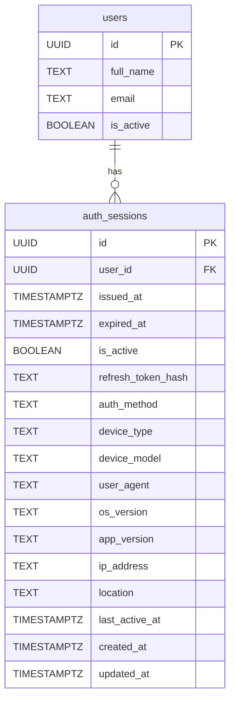

# 🗃️ Auth Service Sub - Data Model

Service này là một thành phần **tenant-specific** trong hệ thống `dx-vas`, hoạt động theo kiến trúc **request-response + token-based authentication**, chịu trách nhiệm xác thực người dùng và duy trì phiên đăng nhập cho từng tenant.

---

## 1. Phạm vi Dữ liệu Quản lý (Scope)

- Thông tin xác thực người dùng (`auth_sessions`)
- Quản lý token đăng nhập và refresh (`auth_sessions`)
- Ghi nhận thiết bị và metadata login (`auth_sessions`)
- Đảm bảo bảo mật và duy trì quyền truy cập theo session

---

## 2. Ngoài Phạm Vi (Out of Scope)

- ❌ Quản lý thông tin người dùng (user profile) – thuộc `user-service/sub`
- ❌ Cấu hình vai trò và quyền (RBAC) – thuộc `auth-service/master`
- ❌ Ghi log hành vi người dùng – thuộc `audit-logging-service`

---

## 3. Mục tiêu của Tài liệu Mô hình Dữ liệu

- Làm rõ schema bảng `auth_sessions` của service
- Chuẩn hóa và hỗ trợ triển khai migration, kiểm thử, phát triển API
- Phản ánh chính xác các luồng nghiệp vụ trong tài liệu `design.md`
- Tuân thủ các ADR sau:
  - [ADR-003 - Secrets Management](../../../ADR/adr-003-secrets.md)
  - [ADR-004 - Security Policy](../../../ADR/adr-004-security.md)
  - [ADR-012 - Response Structure](../../../ADR/adr-012-response-structure.md)

---

Dưới đây là phiên bản **chi tiết và chuẩn hóa hơn** cho mục `## 4. Sơ đồ ERD` trong file `auth-service/sub/data-model.md`, với các điểm nổi bật:

* Sử dụng **Mermaid ERD** thể hiện đầy đủ tất cả các cột chính, bao gồm metadata mới.
* Có chú thích quan hệ rõ ràng giữa `users` và `auth_sessions`.
* Giải thích đầy đủ các ký hiệu, vai trò giữa các thực thể.

---

## 4. Sơ đồ ERD (Entity Relationship Diagram)

Sơ đồ dưới đây mô tả mối quan hệ giữa người dùng (`users`) và các phiên đăng nhập (`auth_sessions`). Đây là quan hệ **1-N**: một người dùng có thể có nhiều phiên đăng nhập.



---

### 🔍 Giải thích quan hệ

* `users.id` là khóa chính của bảng người dùng, được quản lý bởi `user-service/sub`.
* `auth_sessions.user_id` là khóa ngoại (`FK`) trỏ tới người dùng sở hữu phiên đó.
* Một người dùng (`users`) có thể đăng nhập trên nhiều thiết bị/phiên khác nhau ⇒ cần ghi lại metadata chi tiết.

---

### 📌 Ký hiệu sơ đồ

| Ký hiệu | Ý nghĩa                  |        |                           |
| ------- | ------------------------ | ------ | ------------------------- |
| `PK`    | Primary Key (khóa chính) |        |                           |
| `FK`    | Foreign Key (khóa ngoại) |        |                           |
| \`      |                          | --o{\` | Quan hệ 1-N (một - nhiều) |

---

### 📎 Mở rộng trong tương lai

| Tính năng                  | Mở rộng tương ứng                 |
| -------------------------- | --------------------------------- |
| Ghi nhận hoạt động         | Thêm bảng `session_activity_logs` |
| Ghi nhận lỗi bảo mật       | Tích hợp `audit-logging-service`  |
| Hạn chế thiết bị đăng nhập | Cần bảng `trusted_devices`        |

---

## 5. 📌 Bảng: `auth_sessions`

### 🧾 Mục đích

Lưu trữ mọi phiên đăng nhập người dùng, kèm thông tin metadata để phục vụ các chức năng:

* Đăng nhập đa thiết bị
* Theo dõi hoạt động và bảo mật
* Dashboard phiên đăng nhập (giao diện người dùng và quản trị)

---

### 📜 Cấu trúc SQL

```sql
CREATE TABLE auth_sessions (
  id UUID PRIMARY KEY,
  user_id UUID NOT NULL REFERENCES users(id) ON DELETE CASCADE,
  issued_at TIMESTAMPTZ NOT NULL,
  expired_at TIMESTAMPTZ NOT NULL,
  is_active BOOLEAN DEFAULT true,
  refresh_token_hash TEXT NOT NULL,
  auth_method TEXT CHECK (auth_method IN ('password', 'otp', 'magic_link')),

  -- Metadata mở rộng
  device_type TEXT CHECK (device_type IN ('web', 'ios', 'android')),
  device_model TEXT,
  user_agent TEXT,
  os_version TEXT,
  app_version TEXT,
  ip_address TEXT,
  location TEXT,
  last_active_at TIMESTAMPTZ,

  created_at TIMESTAMPTZ DEFAULT now() NOT NULL,
  updated_at TIMESTAMPTZ DEFAULT now() NOT NULL
);
```

---

### 📋 Mô tả các cột chính (bao gồm metadata)

| Cột                  | Kiểu DL     | Ràng buộc     | Mô tả                                   |
| -------------------- | ----------- | ------------- | --------------------------------------- |
| `id`                 | UUID        | PK            | Mã định danh phiên                      |
| `user_id`            | UUID        | FK            | Tham chiếu đến người dùng               |
| `issued_at`          | TIMESTAMPTZ | NOT NULL      | Thời gian phát hành token               |
| `expired_at`         | TIMESTAMPTZ | NOT NULL      | Thời gian hết hạn token                 |
| `is_active`          | BOOLEAN     | DEFAULT TRUE  | Trạng thái còn hiệu lực                 |
| `refresh_token_hash` | TEXT        | NOT NULL      | Hash của refresh token                  |
| `auth_method`        | TEXT ENUM   | CHECK         | Phương thức xác thực                    |
| `device_type`        | TEXT ENUM   | CHECK         | Loại thiết bị (`web`, `ios`, `android`) |
| `device_model`       | TEXT        |               | Tên thiết bị (VD: iPhone 13)            |
| `user_agent`         | TEXT        |               | Trình duyệt hoặc app agent              |
| `os_version`         | TEXT        |               | Phiên bản hệ điều hành                  |
| `app_version`        | TEXT        |               | Phiên bản ứng dụng (mobile)             |
| `ip_address`         | TEXT        |               | Địa chỉ IP client                       |
| `location`           | TEXT        |               | Thông tin địa lý (từ IP hoặc user chọn) |
| `last_active_at`     | TIMESTAMPTZ |               | Thời điểm hoạt động gần nhất            |
| `created_at`         | TIMESTAMPTZ | DEFAULT now() | Tạo bản ghi                             |
| `updated_at`         | TIMESTAMPTZ | DEFAULT now() | Cập nhật gần nhất                       |

---

### 🔐 Lưu ý bảo mật

* Không bao giờ lưu trực tiếp `refresh_token`. Chỉ lưu `hash`.
* Có thể thêm salting + peppering nếu cần tăng cường bảo mật.
* Trường `ip_address` và `user_agent` hỗ trợ phát hiện login đáng ngờ.

---

### 📌 Đặc điểm chính

* ✅ Thiết kế **stateless** cho access token
* ✅ Cho phép **revoke từng session**
* ✅ Dễ mở rộng để lưu metadata thiết bị, vị trí địa lý (nếu cần)
* ✅ Sẵn sàng tích hợp với `audit-logging-service` cho các sự kiện như: login, logout, failed login, revoke

---

## 5.1 📌 Bảng phụ: `revoked_tokens`

### 🧾 Mục đích

Bảng `revoked_tokens` dùng để lưu trữ các **refresh token đã bị thu hồi** (hoặc access token nếu dùng JWT có TTL dài) nhằm:
- Ngăn token bị lạm dụng
- Hỗ trợ logout tất cả thiết bị
- Kiểm tra nhanh trong `middleware` hoặc `auth validator`

---

### 📜 Cấu trúc SQL

```sql
CREATE TABLE revoked_tokens (
  id UUID PRIMARY KEY DEFAULT gen_random_uuid(),
  token_hash TEXT NOT NULL,
  user_id UUID NOT NULL,
  revoked_at TIMESTAMPTZ DEFAULT now(),
  reason TEXT,
  expired_at TIMESTAMPTZ NOT NULL,
  created_at TIMESTAMPTZ DEFAULT now()
);
```

---

### 📋 Mô tả các cột

| Cột          | Kiểu DL     | Ràng buộc     | Mô tả                                   |
| ------------ | ----------- | ------------- | --------------------------------------- |
| `id`         | UUID        | PK            | ID nội bộ                               |
| `token_hash` | TEXT        | NOT NULL      | Giá trị hash của token đã bị revoke     |
| `user_id`    | UUID        | NOT NULL      | Người dùng bị thu hồi token             |
| `revoked_at` | TIMESTAMPTZ | DEFAULT now() | Thời điểm bị revoke                     |
| `reason`     | TEXT        | NULLABLE      | Ghi chú lý do (e.g. logout, suspicious) |
| `expired_at` | TIMESTAMPTZ | NOT NULL      | Khi nào token này hết hạn thật sự       |
| `created_at` | TIMESTAMPTZ | DEFAULT now() | Thời điểm tạo bản ghi                   |

---

### 🧠 Lưu ý triển khai

* Trước khi phát hành token mới hoặc xử lý refresh:

  * Kiểm tra `token_hash` có tồn tại trong `revoked_tokens` hay không.
* Có thể lưu trong Redis để kiểm tra nhanh, xóa khi `expired_at < now()`
* Trường `reason` có thể dùng trong audit log hoặc dashboard Admin

---

### 📊 So sánh nhanh

| Cách                  | Ưu điểm                  | Nhược điểm                         |
| --------------------- | ------------------------ | ---------------------------------- |
| Dùng TTL JWT          | Không cần lưu session    | Không thể revoke theo user         |
| Dùng `revoked_tokens` | Cho phép revoke chọn lọc | Cần thêm query + lưu thêm bảng phụ |

---

📎 Gợi ý thêm:

* Gắn với `audit-logging-service` khi revoke token
* Có thể xem như bảng log bảo mật mức cao

---

## 6. 🧩 Indexes & Constraints

Để đảm bảo **tính toàn vẹn dữ liệu**, **truy vấn nhanh** và **hiệu năng cao**, bảng `auth_sessions` được áp dụng các index và constraint như sau:

---

### 🔐 Constraints

| Tên Ràng buộc           | Mô tả |
|-------------------------|------|
| `PRIMARY KEY (id)`      | Mỗi session có một ID duy nhất |
| `FOREIGN KEY (user_id)` | Ràng buộc tham chiếu tới bảng `users(id)` |
| `CHECK (auth_method)`   | Chỉ cho phép các giá trị enum hợp lệ: `password`, `otp`, `magic_link` |
| `CHECK (device_type)`   | Chỉ chấp nhận `web`, `ios`, `android` |

> 🔎 Gợi ý thêm: Nếu triển khai multi-tenant, có thể thêm ràng buộc `CHECK (tenant_id IS NOT NULL)` (nếu có `tenant_id` trong schema).

---

### ⚡ Indexes

| Tên Index                  | Cột                         | Mục đích |
|---------------------------|------------------------------|----------|
| `idx_auth_sessions_user`  | `user_id`                    | Truy vấn theo user – thường dùng trong bảng quản lý thiết bị |
| `idx_auth_sessions_token` | `refresh_token_hash`         | Kiểm tra token nhanh trong middleware |
| `idx_auth_sessions_active`| `is_active`                  | Lọc các session đang hoạt động |
| `idx_auth_sessions_exp`   | `expired_at`                 | Tự động dọn session hết hạn (batch job) |
| `idx_auth_sessions_last`  | `last_active_at DESC`        | Truy vấn phiên gần nhất |
| `idx_auth_sessions_geo`   | `location`, `ip_address`     | Phân tích truy cập địa lý, hiển thị UI |
| `idx_auth_sessions_device`| `device_type`, `os_version`  | Lọc thiết bị trong phân tích hoặc UI quản trị |

---

### 🔧 Gợi ý nâng cao (tuỳ quy mô)

- **Partial Index:** `WHERE is_active = true` giúp tăng tốc tìm session còn hiệu lực.
- **Composite Index:** `(user_id, device_type, is_active)` cho màn hình quản lý thiết bị người dùng.
- **Unique Constraint:** (chỉ dùng nếu thiết kế giới hạn 1 thiết bị/1 user): `UNIQUE(user_id, device_type, device_model, os_version)`.

---

Dưới đây là phần chi tiết hoá cho mục `## 7. Retention & Data Lifecycle` trong `auth-service/sub/data-model.md`, tuân thủ chuẩn 5★ và phù hợp với ADR-024 về dữ liệu nhạy cảm & vòng đời:

---

## 7. ♻️ Retention & Data Lifecycle

Việc quản lý vòng đời của dữ liệu `auth_sessions` là yếu tố quan trọng giúp hệ thống:
- Giảm thiểu rủi ro bảo mật
- Tối ưu dung lượng lưu trữ
- Đảm bảo tuân thủ các nguyên tắc pháp lý và chính sách nội bộ

---

### 🕒 Thời hạn lưu trữ

| Loại dữ liệu       | Thời gian giữ | Cách xóa |
|--------------------|---------------|----------|
| Phiên đăng nhập (`auth_sessions`) | 30 ngày sau khi `expired_at` | Xoá định kỳ bằng batch job |
| Token bị thu hồi (`revoked_tokens`) | 7 ngày sau `expired_at` | Xoá tự động |
| Token đang hoạt động | Theo TTL – được thiết lập khi phát hành | Hết hạn tự nhiên + thủ công |

---

### 🧹 Cơ chế dọn dẹp (Garbage Collection)

- Tạo 1 cronjob chạy mỗi ngày lúc 2AM:
```sql
  DELETE FROM auth_sessions WHERE expired_at < now() - interval '30 days';
```

* Redis cache nếu dùng cho refresh-token cũng phải thiết lập TTL tương ứng.
* `revoked_tokens` nên có `expired_at` và TTL tương đương JWT gốc.

---

### 🔐 Dữ liệu nhạy cảm

| Trường                       | Nhạy cảm? | Hành động bảo vệ                                 |
| ---------------------------- | --------- | ------------------------------------------------ |
| `refresh_token_hash`         | ✅         | Hash bằng SHA-256, không lưu plain token         |
| `ip_address`, `location`     | ✅         | Có thể xem là PII, hạn chế query không cần thiết |
| `user_agent`, `device_model` | ⚠️        | Không cần ẩn danh nhưng nên hạn chế log thô      |

---

### 🧠 Gợi ý mở rộng

* Bảng `auth_sessions_archive` có thể dùng để lưu session lịch sử hơn 30 ngày nếu cần auditing.
* Nếu dùng multi-tenant, nên có batch xoá theo `tenant_id` độc lập (xoá tenant cũng xoá toàn bộ session).
* Hỗ trợ `manual revocation` (qua admin UI) nên được ghi log sang `audit-logging-service`.

---

## 8. 🧾 ENUMs

Các trường dạng liệt kê (ENUM) giúp đảm bảo dữ liệu chuẩn hóa, dễ validate từ backend tới frontend, đồng thời hỗ trợ mapping UI hiệu quả.

---

### 8.1. `auth_method`

| Giá trị        | Mô tả                             | Trạng thái |
|----------------|------------------------------------|------------|
| `password`     | Xác thực bằng mật khẩu truyền thống | Đang dùng |
| `otp`          | Mã một lần gửi qua SMS/email       | Dự kiến hỗ trợ |
| `magic_link`   | Đăng nhập bằng link (email)        | Dự kiến hỗ trợ |

> 🔮 Có thể mở rộng thêm các phương thức: `sso`, `webauthn`, `biometric` trong tương lai.

---

### 8.2. `device_type`

| Giá trị    | Mô tả             | Áp dụng |
|------------|------------------|---------|
| `web`      | Trình duyệt       | ✅ |
| `ios`      | Ứng dụng iOS      | ✅ |
| `android`  | Ứng dụng Android  | ✅ |

> Các giá trị này giúp UI filter và hiển thị biểu tượng thiết bị tương ứng.

---

### 8.3. `session_status` (nội bộ UI)

| Giá trị     | Mô tả                         | Màu sắc UI (gợi ý) |
|-------------|-------------------------------|--------------------|
| `active`    | Phiên đang hoạt động          | Xanh lá ✅          |
| `expired`   | Hết hạn                        | Xám ⚪               |
| `revoked`   | Bị thu hồi                     | Đỏ ❌               |

> Đây là dạng enum nội bộ dùng cho UI mapping từ logic `expired_at`, `is_active`. Không cần lưu cứng trong DB.

---

### 8.4. `error.code` (theo ADR-011)

Các mã lỗi chuẩn hóa hỗ trợ frontend xử lý i18n, fallback logic tốt hơn:

| Code              | Mô tả                         |
|-------------------|-------------------------------|
| `auth.invalid_credentials` | Đăng nhập thất bại |
| `auth.missing_token`       | Thiếu token          |
| `auth.expired_token`       | Token đã hết hạn     |
| `session.not_found`        | Session không tồn tại |
| `session.already_revoked`  | Session đã bị thu hồi |

> 📌 Nên dùng định dạng `dot-separated` để dễ filter theo module (`auth.*`, `session.*`).

---

## 9. 🔐 Data Access Control

Việc kiểm soát truy cập dữ liệu `auth_sessions` là cực kỳ quan trọng vì:
- Dữ liệu liên quan đến danh tính người dùng và các hành vi xác thực
- Dễ bị khai thác nếu không được bảo vệ kỹ

---

### 🧑‍💻 Cấp độ truy cập theo Role

| Role                | Truy cập phiên (`auth_sessions`) | Hành động được phép             |
|---------------------|----------------------------------|---------------------------------|
| `user:read:self`    | Chỉ phiên của chính họ           | Xem danh sách phiên, thiết bị đang đăng nhập |
| `user:revoke:self`  | Chỉ phiên của chính họ           | Thu hồi session của chính mình |
| `user:read:any`     | Mọi phiên của mọi user           | (Chỉ dành cho admin hoặc hệ thống) |
| `user:revoke:any`   | Thu hồi mọi phiên bất kỳ         | (Chỉ dành cho hệ thống hoặc bảo mật) |

---

### 🔐 Cơ chế kiểm tra RBAC

Mọi truy cập tới session đều phải qua RBAC middleware, được thiết kế theo:
- [ADR-007 - RBAC Strategy](../../../ADR/adr-007-rbac.md)
- [rbac-deep-dive.md](../architecture/rbac-deep-dive.md)

---

### 🛑 Bảo vệ dữ liệu nhạy cảm

| Trường                    | Bảo vệ                        |
|---------------------------|-------------------------------|
| `refresh_token_hash`      | Không bao giờ trả về qua API |
| `ip_address`, `location`  | Chỉ hiển thị cho chủ sở hữu hoặc admin có quyền |
| `user_agent`, `device_model` | Có thể hiện trong bảng quản lý thiết bị |

---

### 🧠 Gợi ý nâng cao

| Tính năng | Giải pháp |
|-----------|-----------|
| Session hijacking prevention | Chỉ cho phép 1 session / thiết bị nếu được bật |
| Tenant isolation (multi-tenant) | Thêm `tenant_id` vào bảng và filter theo `X-Tenant-ID` |

---

## 10. 📘 Phụ lục A – Chiến lược kiểm thử

Chiến lược kiểm thử dành cho `auth_sessions` cần đảm bảo:

- Mỗi phiên login được ghi nhận chính xác.
- Token có vòng đời và tính hợp lệ đúng như thiết kế.
- Không có rò rỉ dữ liệu nhạy cảm trong log, API hoặc response.

---

### 10.1. ✅ Unit Tests

| Module | Test Case chính |
|--------|-----------------|
| Session Model | Khởi tạo phiên đúng cấu trúc |
|              | Hash token đúng định dạng |
|              | Enum không chấp nhận giá trị không hợp lệ |
|              | Trường bắt buộc (NOT NULL) hoạt động đúng |
| Token Utility | Hash + so sánh refresh_token |
|              | TTL tính toán chuẩn |
| Time Logic   | `expired_at` sinh chính xác |
|              | `last_active_at` cập nhật đúng |

> Mục tiêu: đạt 95–100% coverage cho module token/session

---

### 10.2. 🔁 Integration Tests

| API                       | Tình huống kiểm thử chính |
|---------------------------|----------------------------|
| POST `/auth/login`        | Tạo session mới, tạo đúng metadata |
|                           | Trả về `refresh_token` hợp lệ |
| POST `/auth/refresh`      | Token mới → session cũ bị vô hiệu hóa |
| POST `/auth/logout`       | Gọi API sẽ cập nhật `is_active = false` |
| GET `/auth/sessions`      | Trả đúng danh sách session thuộc user |
| GET `/auth/sessions/{id}` | Trả đúng dữ liệu, từ chối nếu không đúng quyền |

> Sử dụng database sandbox + stub JWT tokens để chạy test.

---

### 10.3. 🔐 Security Tests

| Hình thức kiểm thử | Mục tiêu |
|--------------------|----------|
| Token replay       | Một refresh token chỉ dùng được 1 lần |
| Session hijack     | Không truy cập được phiên người khác |
| Token injection    | Token giả không được chấp nhận |
| Invalid device     | Thiết bị giả mạo không ghi nhận được metadata |

---

### 10.4. 🛠 Auto Generated Tests (OpenAPI)

Sử dụng `schemathesis`, `dredd`, hoặc `prance` để:

- Sinh test case từ `openapi.yaml`
- Kiểm tra phản hồi có đúng `status code`, `schema`, `required headers`
- Xác nhận `readOnly`, `writeOnly` hoạt động đúng với field như `id`, `refresh_token`

---

### 10.5. 🧪 Manual QA Scenarios (Frontend / Mobile)

| Tình huống thực tế | Kết quả mong đợi |
|--------------------|------------------|
| Đăng nhập từ 2 thiết bị | Cả 2 phiên được ghi nhận |
| Refresh từ app cũ | App mới thấy token cũ vô hiệu |
| Thu hồi session thủ công | Session đó logout và không dùng lại được |

---

### 10.6. 🧩 Test Cho Migration

- Chạy migration `alembic` trên database trống và database thực tế (có dữ liệu)
- Đảm bảo backward compatibility nếu sửa đổi schema `auth_sessions`

---

## 11. 📚 Liên kết tài liệu

* [Interface Contract](./interface-contract.md)
* [OpenAPI Spec](./openapi.yaml)
* [Design](./design.md)
* [ADR-004 - Security](../../../ADR/adr-004-security.md)
* [ADR-012 - Response Structure](../../../ADR/adr-012-response-structure.md)
* [ADR-030 - Event Schema Governance](../../../ADR/adr-030-event-schema-governance.md)
