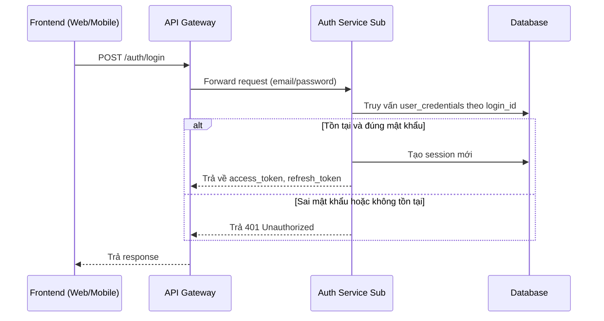
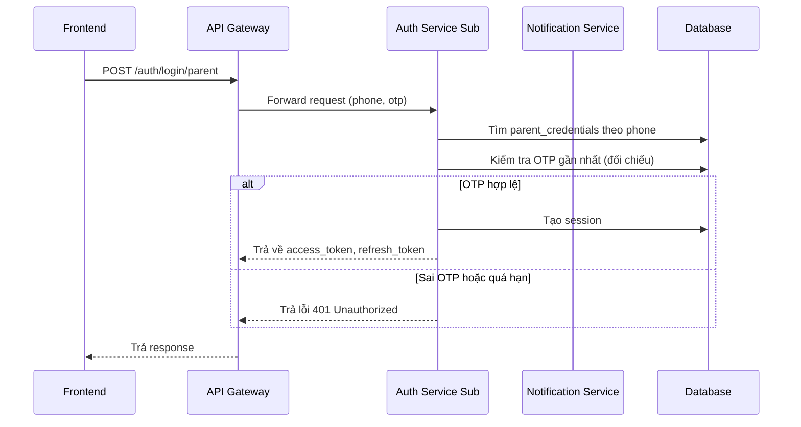
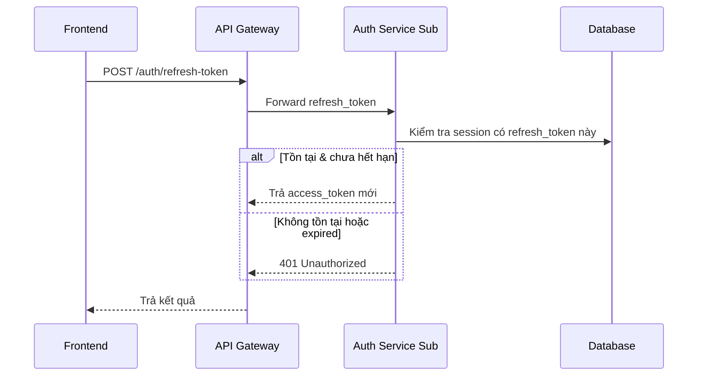
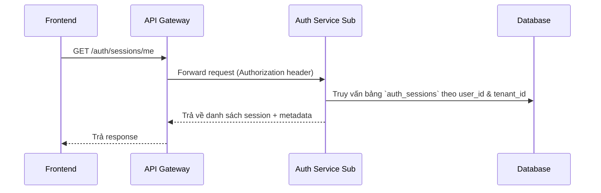
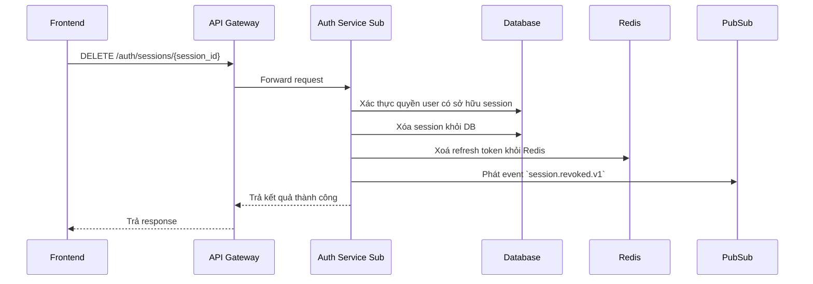
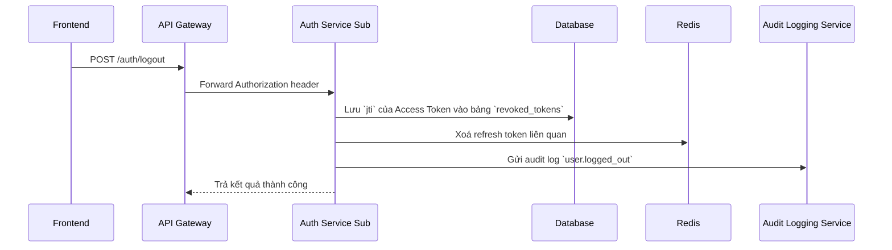
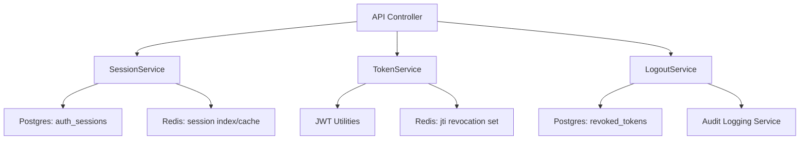

# 📘 Thiết kế chi tiết Auth Service - Sub

## 1. 🧭 Phạm vi và Trách nhiệm (Scope & Responsibilities)

### 🎯 Mục tiêu

- Cung cấp cơ chế xác thực JWT cho user/parent tương ứng với một tenant cụ thể.
- Thực hiện login, refresh token, logout và validate session theo từng tenant.
- Tách biệt hoàn toàn khỏi Auth Master để đảm bảo khả năng scale theo tenant.

### 📦 Các thực thể dữ liệu quản lý

| Thực thể               | Mô tả |
|------------------------|------|
| `UserCredential`       | Thông tin đăng nhập cho từng người dùng (email/phone + hashed password) trong tenant. |
| `Session`              | Ghi nhận thông tin về session, refresh token, user-agent, IP. |
| `ParentCredential`     | Thông tin đăng nhập cho phụ huynh (qua phone hoặc OTP). |

### 🔒 Ngoài Phạm Vi

- ❌ Không lưu trữ thông tin hồ sơ người dùng (User profile → User Service).
- ❌ Không xử lý RBAC (được định nghĩa và kiểm tra tại API Gateway).
- ❌ Không gửi thông báo OTP (giao cho Notification Service).
- ❌ Không xác thực cho Admin hoặc Superadmin (Auth Master đảm nhận).
- ❌ Không tạo/gán permission.

### 👥 Đối tượng sử dụng / Client chính

- WebApp Học sinh và Phụ huynh (qua API Gateway).
- Mobile App học sinh/phụ huynh.
- API Gateway (gọi để validate token hoặc revoke session).

---

## 2. 🌐 Thiết kế API chi tiết (Interface Contract)

| Method | Path                      | Tác vụ                         | Yêu cầu permission (RBAC) |
|--------|---------------------------|--------------------------------|----------------------------|
| POST   | `/auth/login`             | Đăng nhập người dùng           | Public                    |
| POST   | `/auth/login/parent`      | Đăng nhập phụ huynh bằng OTP   | Public                    |
| POST   | `/auth/refresh-token`     | Refresh access token           | Public                    |
| POST   | `/auth/logout`            | Đăng xuất và thu hồi session   | ✅ tenant.logout           |
| GET    | `/auth/sessions/me`       | Lấy danh sách session của tôi  | ✅ tenant.read.sessions    |
| DELETE | `/auth/sessions/{id}`     | Hủy session theo ID            | ✅ tenant.delete.sessions  |

> 🔧 **Tuân thủ chuẩn API của DX-VAS:**
> - [ADR-011 - API Error Format](../../../../ADR/adr-011-api-error-format.md)
> - [ADR-012 - Response Structure](../../../../ADR/adr-012-response-structure.md)
> - [ADR-013 - Path Naming Convention](../../../../ADR/adr-013-path-naming-convention.md)

### 📦 Ví dụ response `POST /auth/login`

```json
{
  "data": {
    "access_token": "eyJhbGciOiJIUzI1NiIs...",
    "refresh_token": "dGVuYW50LXJlZnJlc2gtdG9rZW4=",
    "token_type": "Bearer",
    "expires_in": 3600
  },
  "meta": {
    "request_id": "req-xyz-789",
    "timestamp": "2025-06-07T13:20:00Z"
  },
  "error": null
}
```

> 👉 Xem chi tiết: [Interface Contract.md](./interface-contract.md) – [OpenAPI](./openapi.yaml)

---

## 3. 🗃️ Mô hình dữ liệu chi tiết

Service này sử dụng kiến trúc đơn giản nhưng đủ mạnh để phục vụ xác thực người dùng và quản lý phiên đăng nhập cho từng tenant. Tất cả dữ liệu đều được phân vùng (partitioned) theo `tenant_id`. Các bảng chính bao gồm:

---

### 1. `user_credentials`

Lưu thông tin đăng nhập của học sinh theo email/số điện thoại.

| Cột             | Kiểu DL     | Ràng buộc         | Mô tả                                      |
|-----------------|-------------|-------------------|---------------------------------------------|
| `id`            | UUID        | PK, unique        | Mã định danh credentials                   |
| `tenant_id`     | UUID        | NOT NULL, index   | Mã tenant                                  |
| `user_id`       | UUID        | NOT NULL, unique  | ID người dùng trong hệ thống chính         |
| `login_id`      | TEXT        | NOT NULL, unique  | Tên đăng nhập (email hoặc phone)           |
| `password_hash` | TEXT        | NOT NULL          | Mật khẩu đã mã hóa                         |
| `created_at`    | TIMESTAMP   | DEFAULT now()     | Thời điểm tạo                              |

---

### 2. `parent_credentials`

Dùng cho phụ huynh đăng nhập qua OTP.

| Cột             | Kiểu DL     | Ràng buộc         | Mô tả                                      |
|-----------------|-------------|-------------------|---------------------------------------------|
| `id`            | UUID        | PK                | Mã định danh                               |
| `tenant_id`     | UUID        | NOT NULL          | Mã tenant                                  |
| `parent_phone`  | TEXT        | NOT NULL, unique  | Số điện thoại phụ huynh                    |
| `otp_salt`      | TEXT        | Optional          | Salt dùng khi tạo mã OTP                   |
| `last_otp_sent` | TIMESTAMP   | Optional          | Thời điểm gửi OTP gần nhất                 |

---

### 3. `auth_sessions`

Quản lý phiên đăng nhập, refresh token và metadata.

| Cột               | Kiểu DL   | Ràng buộc              | Mô tả                                       |
|-------------------|-----------|-------------------------|----------------------------------------------|
| `id`              | UUID      | PK                      | Mã định danh session                        |
| `tenant_id`       | UUID      | NOT NULL, index         | Mã tenant                                   |
| `user_id`         | UUID      | NOT NULL                | ID người dùng đăng nhập                     |
| `refresh_token`   | TEXT      | NOT NULL, unique        | Token để làm mới JWT                        |
| `expires_at`      | TIMESTAMP | NOT NULL                | Thời điểm session hết hạn                   |
| `created_at`      | TIMESTAMP | DEFAULT now()           | Thời điểm tạo                               |
| `last_active_at`  | TIMESTAMP | Optional                | Lần cuối hoạt động của session              |
| `ip_address`      | TEXT      | Optional                | IP của thiết bị                              |
| `user_agent`      | TEXT      | Optional                | Thông tin trình duyệt / ứng dụng            |
| `device_type`     | ENUM      | Optional (`web`, `ios`, `android`) | Loại thiết bị               |
| `device_model`    | TEXT      | Optional                | Model thiết bị (ví dụ: iPhone 13, Chrome)   |
| `os_version`      | TEXT      | Optional                | Phiên bản hệ điều hành                      |
| `app_version`     | TEXT      | Optional                | Phiên bản ứng dụng (nếu có)                 |
| `location`        | TEXT      | Optional                | Vị trí địa lý (IP-based hoặc do client gửi) |

> 📌 Một session gắn với 1 user, 1 tenant và có thể đại diện cho một thiết bị duy nhất (để quản lý đa thiết bị).

---

### 4. `revoked_tokens`

Ghi nhận các access token đã bị revoke, phục vụ logout chủ động.

| Cột             | Kiểu DL   | Ràng buộc      | Mô tả                                  |
|-----------------|-----------|----------------|-----------------------------------------|
| `jti`           | UUID      | PK             | JWT ID (unique)                         |
| `tenant_id`     | UUID      | NOT NULL       | Gắn với tenant                         |
| `user_id`       | UUID      | Optional       | Nếu có                                 |
| `revoked_at`    | TIMESTAMP | DEFAULT now()  | Thời điểm bị thu hồi                   |
| `expires_at`    | TIMESTAMP | NOT NULL       | Thời điểm JWT này hết hạn tự nhiên     |

📌 Tất cả JWT có `jti` nằm trong bảng này sẽ bị từ chối ở middleware của API Gateway.

---

> Xem thêm các chi tiết kỹ thuật như **indexing**, **constraints**, **ENUMs**, **retention policy** và **chiến lược kiểm thử dữ liệu** tại [Data Model](./data-model.md)

---

## 4. 🔄 Luồng xử lý nghiệp vụ chính

### 1. Đăng nhập người dùng học sinh qua email/số điện thoại & mật khẩu



---

### 2. Đăng nhập phụ huynh bằng OTP (qua số điện thoại)



---

### 3. Refresh token



---

### 4. Quản lý session người dùng

* Lấy danh sách session hiện tại (`GET /auth/sessions/me`)
* Xóa thủ công một session (`DELETE /auth/sessions/{id}`)
* Auto xóa session hết hạn (qua batch hoặc TTL index)

---

### 5. Quản lý phiên đăng nhập nâng cao




---

### 6. Đăng xuất (Logout) nâng cao



---

📌 Các flow đều được xác thực bằng `JWT` từ Header, kèm theo `X-Tenant-ID` để định danh tenant tương ứng.
Các lỗi trả về tuân theo `ADR-011` và cấu trúc chuẩn của `ErrorEnvelope`.

---

## 5. 📣 Tương tác với các Service khác & Luồng sự kiện

Service `auth-service/sub/` không hoạt động độc lập mà tương tác với nhiều thành phần trong hệ thống để đảm bảo xác thực chính xác và an toàn.

---

### 5.1. Tương tác đồng bộ

| Service liên quan       | API gọi hoặc hành động     | Mục đích sử dụng                                         |
|-------------------------|-----------------------------|----------------------------------------------------------|
| **API Gateway**         | Trao đổi qua HTTP nội bộ    | Là entrypoint cho frontend, forward các request có auth |
| **User Service Sub**    | `GET /users/{id}`           | Xác minh user_id tồn tại, hợp lệ với tenant              |
| **Notification Service**| Gửi OTP qua Pub/Sub         | Gửi OTP khi phụ huynh đăng nhập                          |
| **Redis (hoặc session store)** | Lưu session         | Lưu thông tin refresh token, expire date, device info   |
| **Audit Logging Service**| Gửi audit log              | Ghi lại hành vi đăng nhập, refresh, logout               |

> 📎 Tất cả gọi đồng bộ đều **được trace bằng `X-Request-ID`** và kiểm soát bởi Gateway RBAC.

---

### 5.2. Gửi sự kiện (Event Published)

| Sự kiện phát ra                | Khi nào được phát                | Mục đích                                                 |
|-------------------------------|----------------------------------|----------------------------------------------------------|
| `user.logged_in.v1`           | Sau khi login thành công         | Gửi về hệ thống phân tích hành vi hoặc nhật ký           |
| `user.logged_out.v1`          | Khi người dùng logout            | Ghi nhận hành vi an toàn                                 |
| `otp.login_failed.v1`         | Sai OTP                          | Cho phép xử lý cảnh báo bảo mật                          |
| `session.revoked.v1`          | Khi người dùng tự xoá session    | Cho phép frontend tự động logout khỏi thiết bị khác      |

Tất cả event sử dụng chuẩn schema từ [ADR-030 - Event Schema Governance](../../../ADR/adr-030-event-schema-governance.md), gửi qua Pub/Sub (per-tenant hoặc global topic tùy config).

---

### 5.3. Lắng nghe sự kiện (Event Subscribed)

| Sự kiện                      | Nguồn phát                    | Hành động khi nhận được                                 |
|-----------------------------|-------------------------------|----------------------------------------------------------|
| `user.deleted.v1`           | Từ `user-service/sub`         | Xóa credentials nếu user tương ứng bị xóa                |
| `tenant.deactivated.v1`     | Từ `admin portal` hoặc master | Ngừng hoạt động xác thực cho tenant này (hard fail)      |

---

📌 Mọi sự kiện đều được log lại thông qua `audit-logging-service`. Trường hợp gửi thất bại, hệ thống sẽ **retry theo cơ chế exponential backoff**.

---

## 6. 🔐 Bảo mật & Phân quyền

---

### 6.1. Cơ chế xác thực

- Sử dụng JWT (RS256 hoặc HS256 tùy cấu hình) để xác thực user hoặc parent.
- Token được cấp sau khi xác thực thành công (email/password hoặc OTP) và có TTL mặc định 3600 giây.
- Mỗi token chứa:
  - `sub`: user_id
  - `tenant_id`: định danh tenant
  - `roles`, `permissions`: nếu có (frontend có thể đọc để hiển thị UI phù hợp)

📎 Header: `Authorization: Bearer <token>`

---

### 6.2. Session & Refresh Token

- Mỗi login tạo một session (kèm refresh token) được lưu trong DB hoặc Redis.
- Refresh token có thể dùng để lấy access token mới mà không cần đăng nhập lại.
- Session có TTL rõ ràng (mặc định 7 ngày) và có thể bị revoke (xem API `/auth/logout`, `/auth/sessions/{id}`).
- Mỗi session được log lại để truy vết truy cập.

---

### 6.3. RBAC (Role-Based Access Control)

- Kiểm tra quyền **không diễn ra ở đây**, mà tại **API Gateway**.
- Tuy nhiên, một số API nhạy cảm trong `auth-service/sub/` vẫn áp dụng `x-required-permission` trong OpenAPI để đảm bảo tài liệu hóa rõ:
  - `tenant.logout`
  - `tenant.read.sessions`
  - `tenant.delete.sessions`

📎 Tham khảo chi tiết [`rbac-deep-dive.md`](../../architecture/rbac-deep-dive.md) để hiểu cách permission được gán từ master xuống từng tenant.

---

### 6.4. Validation & Input Sanitization

- Tất cả input đều được validate bằng Pydantic hoặc schema validator:
  - Email, phone → định dạng chuẩn
  - OTP → chỉ chấp nhận chuỗi số cố định 6 chữ số
- Không bao giờ log password, token, hoặc OTP plaintext.
- Mọi API đều được kiểm tra `X-Tenant-ID` là hợp lệ và khớp với JWT.

---

### 6.5. Bảo vệ chống brute-force và abuse

- Mỗi tenant có cấu hình `login_throttle_limit` và `lockout_duration`.
- Nếu vượt quá số lần login thất bại, người dùng sẽ bị lock tạm thời (ghi log vào audit).
- Các endpoint `/auth/login` và `/auth/login/parent` đều giới hạn tốc độ (rate limit).

---

### 6.6. Ghi nhận hành vi người dùng (Audit)

- Mọi thao tác login, refresh, logout, revoke session đều phát sự kiện audit và gửi đến `audit-logging-service`.
- Các audit log này có thể được phân tích để phát hiện hành vi đáng ngờ.

---

### 6.7. Tuân thủ bảo mật chuẩn hệ thống

- Không chứa secret hardcoded – sử dụng `.env` theo `ADR-005`.
- Không lưu thông tin nhạy cảm trong Redis dạng plaintext.
- Hạn chế expose các internal error – trả lỗi theo `ErrorEnvelope`.

---

## 7. ⚙️ Cấu hình & Phụ thuộc

---

### 7.1. Các biến môi trường chính

| Biến                          | Bắt buộc | Mô tả |
|-------------------------------|----------|------|
| `PORT`                        | ✅       | Port mà service lắng nghe |
| `ENV`                         | ✅       | `local`, `staging`, `production` |
| `TENANT_ID`                   | ✅       | Tenant ID tương ứng với service instance này |
| `JWT_SECRET_KEY` hoặc `JWT_PRIVATE_KEY` | ✅ | Dùng để ký JWT (HS256 hoặc RS256) |
| `JWT_ALGORITHM`              | ✅       | `HS256` hoặc `RS256` |
| `JWT_EXPIRES_IN`             | ✅       | Thời gian sống của Access Token (giây) |
| `JWT_REFRESH_EXPIRES_IN`    | ✅       | TTL cho refresh token |
| `DATABASE_URL`               | ✅       | Kết nối tới CSDL Postgres |
| `REDIS_URL`                  | ✅       | Redis dùng cho session và rate limiting |
| `OTP_PUBSUB_TOPIC`           | ✅       | Tên topic gửi OTP qua Pub/Sub |
| `GOOGLE_PROJECT_ID`          | ✅       | Dùng để định danh Pub/Sub |
| `AUDIT_TOPIC`                | ✅       | Topic gửi audit log |
| `RATE_LIMIT_MAX_ATTEMPTS`   | Optional | Số lần đăng nhập sai trước khi khóa tạm |
| `LOCKOUT_DURATION_SECONDS`  | Optional | Thời gian khóa sau khi vượt giới hạn sai |

📎 Biến cấu hình nên được mô tả thêm trong `.env.example` và được kiểm tra trong bước khởi động (fail fast nếu thiếu).

---

### 7.2. Cấu hình JWT

- Phải hỗ trợ cả `HS256` (dành cho local/dev) và `RS256` (cho staging/prod).
- Nếu dùng `RS256`, biến môi trường cần gồm:
  - `JWT_PRIVATE_KEY` – Dạng PEM.
  - `JWT_PUBLIC_KEY` – Dành cho các bên validate (nếu chia sẻ public key).

---

### 7.3. Cấu hình kết nối DB và Redis

- Database Postgres nên có `connection pool` tối thiểu 5, tối đa 20.
- Redis dùng để lưu session (`refresh_token`) và thống kê login (cho lockout & audit).
- Redis key namespace: `auth:<tenant_id>:session:<session_id>`

---

### 7.4. Kết nối Pub/Sub

- Các sự kiện như `otp.login_failed`, `user.logged_in`, `session.revoked` đều được gửi lên các topic định nghĩa trong biến môi trường.
- Định danh theo convention: `dx-vas.tenant.{tenant_id}.auth.*`

---

### 7.5. Phụ thuộc bên ngoài

| Phụ thuộc               | Mục đích                  | Loại kết nối |
|------------------------|---------------------------|--------------|
| **PostgreSQL**         | Lưu credential & session  | TCP          |
| **Redis**              | Lưu session và rate-limit | TCP          |
| **Pub/Sub (GCP)**      | Gửi OTP, Audit, Events    | HTTP(S)      |
| **User Service**       | Kiểm tra `user_id`        | Internal HTTP |
| **Notification Service** | Gửi OTP phụ huynh       | Pub/Sub hoặc HTTP nội bộ |

---

### 7.6. Tự động hóa

- Có thể dùng `docker-compose` để local dev (`postgres`, `redis`).
- Mỗi instance của service sẽ tương ứng với 1 tenant (multi-deploy thay vì multi-tenant logic nội bộ).

---

## 8. 🧪 Chiến lược kiểm thử

---

Chiến lược kiểm thử của `auth-service/sub/` được thiết kế để đảm bảo chất lượng toàn diện từ logic nghiệp vụ, tính đúng đắn bảo mật, tới khả năng tích hợp trong hệ thống phân tán. Bao gồm:

---

### 8.1. Unit Test (Kiểm thử đơn vị)

- Phạm vi: kiểm tra từng hàm logic riêng biệt (xác thực, sinh JWT, lưu session…).
- Mock toàn bộ phụ thuộc (DB, Redis, Pub/Sub).
- Yêu cầu bao phủ:
  - Đăng nhập thành công/thất bại
  - Sinh & validate JWT
  - OTP logic
  - Lockout và rate limit
- ✅ Tối thiểu 90% line coverage

---

### 8.2. Integration Test (Kiểm thử tích hợp)

- Chạy thật với Docker Compose (`PostgreSQL`, `Redis`), nhưng vẫn mock Pub/Sub.
- Kiểm thử:
  - Toàn bộ flow API (`/auth/login`, `/auth/refresh`, `/auth/logout`)
  - Check tạo session, expire, revoke đúng
  - Flow phụ huynh qua OTP
- Kiểm tra đúng chuẩn `ErrorEnvelope` theo `ADR-011`

---

### 8.3. Contract Testing (Kiểm thử hợp đồng)

- Sử dụng file `openapi.yaml` làm nguồn duy nhất sự thật (single source of truth).
- Kiểm tra:
  - Schema response đúng với mô tả OpenAPI
  - Trường hợp lỗi cũng phải tuân thủ schema
  - Thử nghiệm với [schemathesis](https://schemathesis.io/) hoặc [dredd](https://dredd.org)

> 🧪 Kết hợp contract test trong CI pipeline để phát hiện lệch contract sớm.

---

### 8.4. Security Testing

- Tự động kiểm tra các lỗi phổ biến (SQL injection, JWT tampering…)
- Đảm bảo:
  - Password không xuất hiện trong log
  - JWT không bị giả mạo
  - OTP không bị brute-force
- Có thể sử dụng `pytest-security` hoặc ZAP Scanner dạng CLI

---

### 8.5. Load & Stress Testing (Tuỳ chọn)

- Mô phỏng hàng ngàn request login/refresh để kiểm tra rate-limit & Redis bottleneck
- Dùng `k6` hoặc `locust` để benchmark

---

### 8.6. Test Seeding & Reset

- Có script tạo user mẫu, parent phone, OTP test.
- Có thể gọi `POST /__internal/seed` (chỉ local/dev mode)

---

### 8.7. Test Coverage & CI Integration

- Tích hợp test coverage vào CI/CD pipeline.
- Báo cáo hiển thị trên PR thông qua GitHub Actions + Codecov hoặc Coveralls.

---

🧪 Tài liệu tham khảo:
- [ADR-010 - Contract Testing](../../../ADR/adr-010-contract-testing.md)
- [ADR-012 - API Response Structure](../../../ADR/adr-012-response-structure.md)

---

## 9. 📈 Quan sát & Giám sát

---

Service `auth-service/sub/` được thiết kế để dễ dàng giám sát, debug và truy vết toàn bộ luồng xác thực, với khả năng tích hợp sâu vào hệ thống observability tập trung.

---

### 9.1. Logging (Ghi log)

- Chuẩn hóa theo `JSON structured logging`
- Ghi log theo level:
  - `INFO`: request thành công, khởi tạo session
  - `WARNING`: OTP sai, token hết hạn
  - `ERROR`: lỗi DB, Redis, invalid JWT
- Mỗi log đều chứa:
  - `trace_id` / `X-Request-ID`
  - `tenant_id`
  - `user_id` (nếu có)
  - `action`, `status_code`, `error_code`

📎 Tất cả log được export sang Google Cloud Logging (Stackdriver).

---

### 9.2. Tracing (Truy vết request)

- Mỗi request gắn `X-Request-ID` để trace xuyên suốt hệ thống
- Dùng `opentelemetry` để tích hợp vào GCP Cloud Trace hoặc Jaeger
- Mỗi đoạn xử lý (login, query DB, verify JWT) đều là một span
- Có thể truy vết thời gian response toàn flow chỉ trong 1 nơi duy nhất

---

### 9.3. Metrics (Số liệu quan sát được)

Thu thập bằng `Prometheus` hoặc export sang Cloud Monitoring:

| Metric                        | Mô tả |
|------------------------------|-------|
| `auth_login_success_total`   | Tổng số lần login thành công |
| `auth_login_failed_total`    | Tổng số lần login thất bại |
| `auth_otp_sent_total`        | Số lần gửi OTP |
| `auth_token_refreshed_total` | Số lượt refresh token thành công |
| `auth_session_revoked_total` | Số lượt logout thủ công |
| `auth_jwt_invalid_total`     | JWT bị lỗi / giả mạo |
| `auth_latency_seconds`       | Thời gian xử lý trung bình theo endpoint |

---

### 9.4. Alerting (Cảnh báo)

Thiết lập cảnh báo qua GCP Monitoring hoặc Prometheus AlertManager:

| Tình huống bất thường                      | Hành động cảnh báo                      |
|--------------------------------------------|------------------------------------------|
| Tăng đột biến `auth_login_failed_total`    | Có thể là brute-force => gửi email alert |
| `auth_latency_seconds > 2s` trong 5 phút   | Cảnh báo Slack/Email                    |
| `auth_jwt_invalid_total` tăng đột ngột     | Có thể có tấn công hoặc lỗi hệ thống    |

---

### 9.5. Audit Logging

- Tất cả hành vi người dùng được phát event và gửi tới `audit-logging-service`, bao gồm:
  - Đăng nhập / refresh / logout
  - OTP gửi/thất bại
  - Thay đổi session

📎 Chi tiết xem thêm: [audit-logging-service/design.md](../../services/audit-logging-service/design.md)

---

### 9.6. Dashboard

- Tạo dashboard tổng hợp trong Grafana hoặc GCP:
  - Tình trạng session
  - Số lượt login theo thời gian
  - Tỷ lệ lỗi 4xx/5xx
  - Top user theo số lần login

---

### Ví dụ Dashboards & Alerting (Google Cloud Monitoring + Prometheus)

#### 📊 Grafana Dashboard (Prometheus)

| Biểu đồ                        | Mục tiêu giám sát                                    |
|-------------------------------|------------------------------------------------------|
| `Login Attempts (200 vs 4xx)` | Theo dõi số lượng đăng nhập thành công/thất bại     |
| `Token Refresh Success Rate`  | Phát hiện bất thường trong quá trình refresh token  |
| `Session Created/Revoked`     | Thống kê số phiên được tạo, hủy trong 24h           |
| `JWT Revoked Lookup Time`     | Độ trễ truy xuất `jti` từ Redis (cache hit/miss)     |

```promql
rate(auth_login_total{status=~"200|401|403"}[5m])
rate(auth_refresh_errors_total[5m])
rate(auth_session_created_total[1m])
rate(redis_lookup_latency_seconds_sum[1m]) / rate(redis_lookup_latency_seconds_count[1m])
```

---

#### 🔔 Alert Rule (Prometheus + Alertmanager)

1. **Too Many Failed Logins**

```yaml
alert: TooManyLoginFailures
expr: increase(auth_login_total{status="401"}[10m]) > 30
for: 2m
labels:
  severity: warning
annotations:
  summary: "Số lần đăng nhập thất bại tăng bất thường"
  description: "Có trên 30 lượt login thất bại trong 10 phút qua tại tenant {{ $labels.tenant_id }}"
```

2. **Token Refresh Failure Spike**

```yaml
alert: HighTokenRefreshFailures
expr: rate(auth_refresh_errors_total[5m]) > 5
for: 1m
labels:
  severity: critical
annotations:
  summary: "Tăng đột biến lỗi refresh token"
  description: "Số lỗi refresh token vượt quá 5 lần/phút"
```

---

#### 🔍 GCP Cloud Monitoring Alert (nếu không dùng Prometheus)

- **Log-based Alert**:
  - Filter: `"POST /auth/login" AND severity=ERROR`
  - Trigger: > 50 lần trong vòng 5 phút
  - Action: Gửi email + webhook về Slack/Alertmanager

- **Uptime Check + Alert**:
  - Endpoint: `/auth/refresh`
  - Điều kiện: HTTP 5xx > 10% trong vòng 3 phút

---

## 10. 🚀 Độ tin cậy & Phục hồi

---

### 10.1. Triển khai đa vùng (Multi-Zone / Multi-Replica)

- Service được triển khai với `replica > 1`, sử dụng Kubernetes Deployment để đảm bảo tự động failover khi một pod chết.
- Redis và Postgres phải dùng phiên bản HA (High Availability) nếu áp dụng cho production.

---

### 10.2. Stateless Design

- Mọi phiên đăng nhập (session) được lưu trong Redis/Postgres – service hoàn toàn stateless.
- Khi pod bị xoá hoặc scale lên/xuống, session không bị mất.
- Cho phép scale-out theo tenant (multi-instance mỗi tenant nếu cần).

---

### 10.3. Retry và Timeout

- Các request outbound (DB, Redis, Pub/Sub) đều có timeout rõ ràng (thường 1-3 giây).
- Có cơ chế retry cho các lỗi tạm thời (`connection refused`, `timeout`, `429`…).
- Tránh retry vô hạn để không gây thắt cổ chai hoặc DDoS ngược.

---

### 10.4. Graceful Shutdown

- Khi nhận SIGTERM (scale down, rolling update), service sẽ:
  - Từ chối request mới
  - Chờ xử lý xong request đang chạy
  - Đóng kết nối DB/Redis an toàn

---

### 10.5. Health Checks

- Có sẵn 2 endpoint:
  - `GET /healthz`: kiểm tra service lắng nghe và DB/Redis sẵn sàng
  - `GET /readiness`: dùng cho Kubernetes để kiểm tra sẵn sàng trước khi nhận request

---

### 10.6. Giám sát lỗi 5xx & Circuit Breaker

- Các lỗi hệ thống được log và theo dõi qua Prometheus/Grafana
- Có thể triển khai circuit breaker phía Gateway hoặc sidecar (Envoy) để bảo vệ hệ thống khỏi lan truyền lỗi

---

### 10.7. Recovery (Khôi phục sau lỗi)

| Tình huống                         | Hành động phục hồi                                 |
|-----------------------------------|----------------------------------------------------|
| Redis down                        | Chuyển sang mode read-only, tạm thời chặn login    |
| Postgres bị failover              | Sử dụng connection pool tự động retry              |
| Pod chết đột ngột                 | Kubernetes tự khởi động lại trong vài giây         |
| Lỗi phát sinh do rollout version | Có thể rollback qua `kubectl rollout undo`         |

---

### 10.8. SLA & SLO (xem ADR-022)

- **SLO**: 99.9% uptime mỗi tuần (~10 phút downtime/tuần)
- **SLA**: 99.5% trong hợp đồng với tenant
- **Error Budget** được đo dựa trên `5xx`, `latency > 1s`, login thất bại vì lỗi hệ thống

---

### 10.9. Đảm bảo liên tục dịch vụ

- Dù một số service như `notification-service` (OTP) có thể fail tạm thời, `auth-service/sub/` vẫn đảm bảo login truyền thống không bị ảnh hưởng.
- Kết hợp retry logic và `graceful degradation` để giữ trải nghiệm người dùng ổn định.

---

## 11. ⚡️ Hiệu năng & Khả năng mở rộng

---

### 11.1. Mục tiêu hiệu năng

| Tiêu chí                  | Giá trị mục tiêu             |
|---------------------------|------------------------------|
| Thời gian phản hồi trung bình (`P50`) | < 150ms (cho login & refresh token) |
| Thời gian phản hồi tối đa (`P95`)     | < 500ms                       |
| Throughput mục tiêu       | 1000+ login requests/phút    |
| Tải người dùng đồng thời  | 500 users/tenant / 50 tenants cùng lúc |

---

### 11.2. Kiến trúc hỗ trợ scale-out

- **Stateless service** → dễ scale theo chiều ngang (replica).
- **Tách biệt session/token** lưu vào **Redis/PostgreSQL**, không phụ thuộc memory cục bộ.
- Redis được dùng cho:
  - Lưu refresh_token (kèm TTL)
  - Track login attempts per IP/user/tenant (để chống brute-force)

---

### 11.3. Chiến lược scale

| Tầng          | Cơ chế mở rộng            |
|---------------|---------------------------|
| Service layer | Replica trong GKE         |
| Redis         | Redis cluster (nếu cần)   |
| Postgres      | Read replica cho analytic |
| Pub/Sub       | GCP auto-scale            |

- Có thể áp dụng `HorizontalPodAutoscaler (HPA)` dựa trên CPU/latency.
- Mỗi tenant có thể scale độc lập (multi-instance) nếu số lượng lớn.

---

### 11.4. Tối ưu truy vấn DB

- Index trên các cột:
  - `login_id`, `user_id`, `tenant_id`
  - `refresh_token`, `session_id`
- Truy vấn tối đa O(1) hoặc O(log n) (primary key / index-based)
- Không thực hiện join phức tạp – mọi schema đều **denormalized** cho hiệu năng.

---

### 11.5. Cache & TTL

- OTP được lưu Redis với TTL mặc định 5 phút.
- Session có TTL 7 ngày (hoặc tùy theo config).
- Cache login throttle theo IP/phone/user để chặn brute-force.

---

### 11.6. Giới hạn (Rate Limit)

- Rate limit per-user và per-IP bằng Redis:
  - `10 login attempts / 5 phút`
  - `3 OTP fail / 3 phút`
- Có thể mở rộng bằng Cloud Armor hoặc sidecar filter (Envoy, Kong)

---

### 11.7. Stress Testing & Benchmark

- Load test với `k6`, mô phỏng:
  - 10K login requests
  - 1K concurrent sessions
- Mỗi lần rollout mới cần đo lại `P95`, `max`, `success rate`

---

### 11.8. Các ràng buộc cần lưu ý

| Yếu tố        | Giải pháp |
|---------------|-----------|
| High-traffic login vào buổi sáng | Pre-warm cache, auto-scale gateway |
| Tenant quá lớn (>2000 users)     | Chuyển sang multi-instance tenant |
| Redis full hoặc latency cao      | Graceful fallback / retry |

---

## 12. 🛠 Kế hoạch Triển khai & Migration

---

### 12.1. Mô hình triển khai (Deployment Model)

- Mỗi `auth-service/sub/` instance gắn với **một tenant duy nhất** (multi-deploy pattern).
- Tự động deploy khi thêm tenant mới:
  - Service instance được tạo từ Helm chart với biến `TENANT_ID`
  - Tên namespace/pod theo chuẩn: `auth-sub-{tenant_id}`

📌 Có thể áp dụng `template` pipeline CI/CD dùng GitOps để tạo tenant mới bằng pull request.

---

### 12.2. Chiến lược CI/CD

- Mỗi thay đổi trên nhánh `main` của repo `auth-service` sẽ:
  - Build Docker image mới
  - Push image vào Artifact Registry
  - Trigger ArgoCD hoặc GitHub Actions để deploy image theo tenant

| Môi trường     | Triển khai tự động | Quản lý cấu hình |
|----------------|--------------------|------------------|
| `local`        | Thủ công qua docker-compose | `.env` |
| `staging`      | Tự động từ nhánh `dev`     | Helm chart |
| `production`   | Manual approval (PR merge `main`) | GitOps |

---

### 12.3. Chiến lược Migration dữ liệu (nếu có)

- Dữ liệu được tạo mới cho mỗi tenant – không có migration từ hệ thống cũ.
- Trong trường hợp thay đổi schema DB:
  - Sử dụng `alembic` (Python) hoặc công cụ tương ứng
  - Migration script versioned và đi kèm CI test
  - Rollout theo thứ tự: dev → staging → từng tenant production

---

### 12.4. Kế hoạch Rollout Tenant mới

| Bước | Hành động |
|------|-----------|
| 1. ✅ Tạo record tenant mới trong `user-service/master` |
| 2. ✅ Sinh biến cấu hình `.env` theo mẫu |
| 3. ✅ Deploy `auth-service/sub/` instance mới (`auth-sub-<tenant_id>`) |
| 4. ✅ Test login/refresh/token với tài khoản mẫu |
| 5. ✅ Cấu hình frontend để redirect login tới sub domain mới |
| 6. ✅ Giám sát bằng dashboard Grafana, GCP logging |

---

### 12.5. Rollback & Khôi phục

- Triển khai sử dụng `Helm` hoặc `kubectl rollout`, hỗ trợ rollback dễ dàng.
- Trong trường hợp schema DB lỗi:
  - Có script rollback schema version
  - Hoặc phục hồi từ bản snapshot gần nhất

---

### 12.6. Yêu cầu về người vận hành

| Vai trò              | Trách nhiệm chính                        |
|----------------------|------------------------------------------|
| DevOps Engineer      | Build pipeline, đảm bảo Helm chart ổn định |
| Backend Developer    | Viết migration, test release             |
| QA Tester            | Kiểm thử toàn bộ flow login              |
| Tenant Admin Support | Kiểm tra đăng nhập & cấp quyền ban đầu   |

---

### 12.7. Rủi ro & Giảm thiểu

| Rủi ro                            | Cách giảm thiểu                        |
|----------------------------------|----------------------------------------|
| Cấu hình sai JWT key             | Tự động validate và test sau deploy    |
| Tenant deploy nhầm DB            | Isolation mỗi tenant bằng namespace    |
| Lỗi do schema chưa migrate kịp   | CI pipeline chặn nếu chưa apply schema |
| OTP rate-limit bị sai            | Test kỹ logic trên môi trường staging  |

---

## 13. 🧩 Kiến trúc Service

### 13.1. Sơ đồ thành phần



---

### 13.2. Các Module Chính

| Module                | Mô tả chức năng chính |
|------------------------|------------------------|
| `SessionService`       | Tạo, cập nhật, xóa phiên login và lưu `session metadata`. |
| `TokenService`         | Sinh JWT, Refresh Token, tính toán TTL, parse JWT. |
| `LogoutService`        | Ghi `jti` vào `revoked_tokens`, xóa session Redis, phát audit log. |
| `RevokedTokenStore`    | Truy vấn và đồng bộ blacklist token từ Postgres → Redis. |
| `SessionMetadataTracker` | Thu thập metadata từ request header (IP, User-Agent...) và gắn vào session. |
| `SessionQueryHandler`  | Phục vụ cho các API `/sessions`, `/sessions/{id}`. |
| `AuthValidator`        | Kiểm tra token hợp lệ (hết hạn, revoked, chưa đúng `jti`). |

---

### 13.3. Cơ chế Đồng bộ Redis - PostgreSQL

- **Redis Key `auth:<tenant>:revoked`** chứa `jti` bị thu hồi → phục vụ middleware Gateway kiểm tra nhanh.
- **Cron job `sync_revoked_tokens`** đồng bộ dữ liệu mới từ Postgres vào Redis mỗi 1–5 phút, hoặc phát ngay khi logout.
- Session cache (nếu bật) có thể dùng Hash `auth:<tenant>:session:<session_id>` chứa các metadata phổ biến.

---

### 13.4. Quan hệ với Các Service Khác

| Service                | Vai trò tương tác |
|------------------------|--------------------|
| **User Service (Sub)** | Cần xác thực `user_id` thuộc tenant này |
| **Audit Logging**      | Nhận log từ `LogoutService` và các action liên quan |
| **API Gateway**        | Middleware xác thực Access Token và kiểm tra `jti` trong Redis |

📌 Kiến trúc được tối ưu hóa cho multi-tenant, có thể mở rộng với minimal overhead khi tăng số user/device.

---

## 14. 📚 Tài liệu liên quan

* [Interface Contract](./interface-contract.md)
* [Data Model](./data-model.md)
* [OpenAPI Spec](./openapi.yaml)
* [ADR-006 - Auth Strategy](../../../ADR/adr-006-auth-strategy.md)
* [ADR-007 - RBAC](../../../ADR/adr-007-rbac.md)
* [rbac-deep-dive.md](../../architecture/rbac-deep-dive.md)
