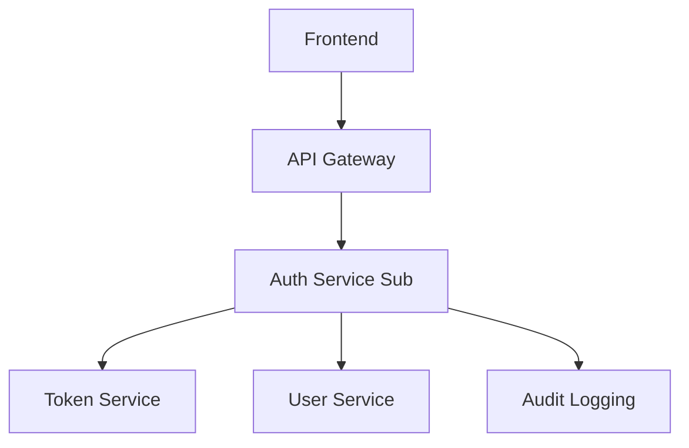
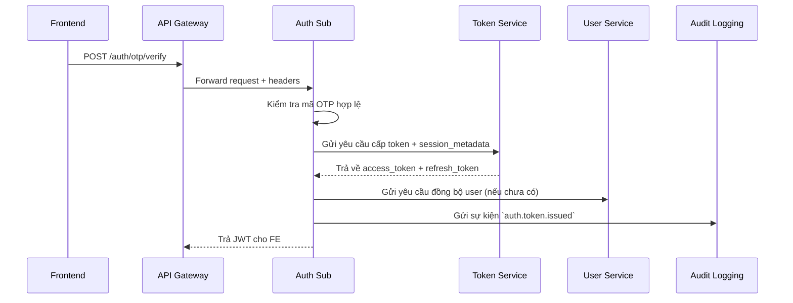
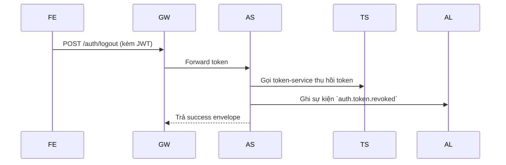
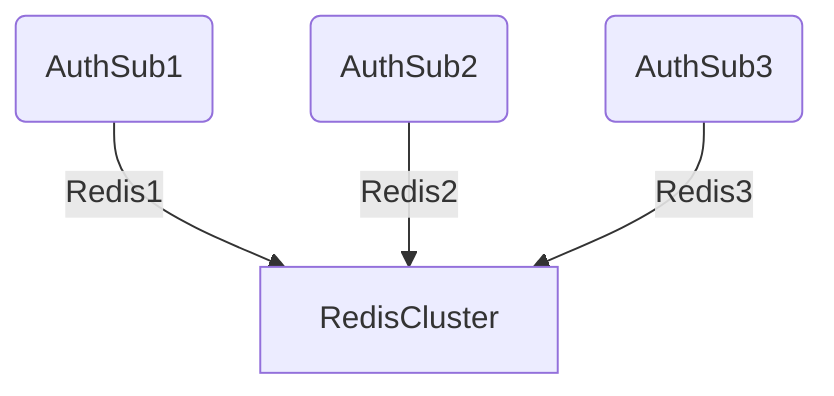
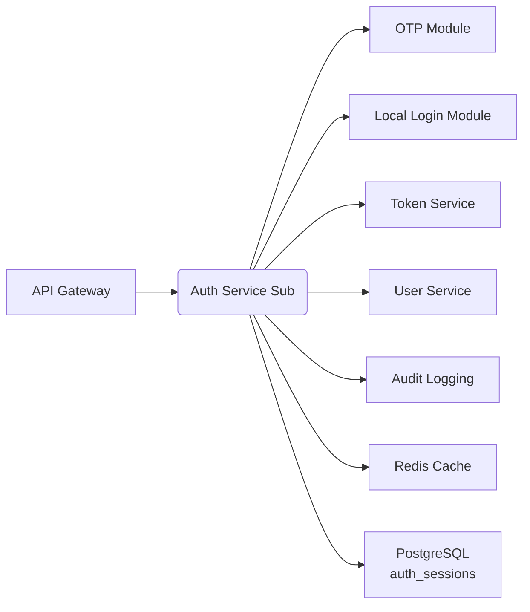
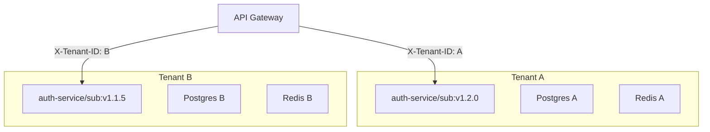

# 📘 Thiết kế chi tiết Auth Service - Sub

## 1. 🧭 Phạm vi và Trách nhiệm

`auth-service/sub` là dịch vụ xác thực được thiết kế theo mô hình **per-tenant deployment**, phục vụ riêng biệt cho từng tenant (trường học) trong hệ thống `dx-vas`. Mỗi tenant có một instance riêng, độc lập về cơ sở dữ liệu, cấu hình, và lifecycle vận hành.

Dịch vụ này đảm nhiệm xác thực đầu vào cho người dùng cuối (student, teacher, employee) thuộc tenant tương ứng, thông qua các phương thức **OTP** và **Local Login**.

---

### ✅ Chức năng chính

| Nhóm chức năng | Mô tả |
|----------------|------|
| **Xác thực OTP** | Gửi và xác minh mã OTP qua SMS/email |
| **Xác thực Local** | Đăng nhập bằng username/password đã mã hóa |
| **Khởi tạo phiên** | Gọi `token-service` để cấp JWT; lưu `auth_sessions` |
| **Logout** | Gọi `token-service` thu hồi token; cập nhật Redis |
| **Đồng bộ user** | Nếu user chưa tồn tại sau xác thực, gửi yêu cầu sync đến `user-service` |
| **Audit log** | Gửi log hành vi xác thực (success/failure) đến `audit-logging-service` |
| **Phát sự kiện** | Gửi sự kiện `auth.token.issued`, `auth.token.revoked`, `auth.login.failed`, `user.sync.triggered` lên Pub/Sub |
| **Gắn session metadata** | Trích xuất IP, thiết bị, user-agent để phục vụ bảo mật và giám sát |

---

### 🚫 Không thuộc phạm vi

| Mục | Ghi chú |
|-----|---------|
| **Xác thực Google OAuth2** | Thực hiện tại `auth-service/master` theo `adr-006-auth-strategy.md` |
| **Quản lý người dùng** | Được xử lý bởi `user-service` |
| **Cấp phát token trực tiếp** | Chuyển giao cho `token-service` để quản lý tập trung |
| **RBAC & Phân quyền** | Kiểm tra tại `api-gateway`, không thực hiện trong `auth-service/sub` |
| **Xử lý liên-tenant** | Không hỗ trợ login chéo tenant; mỗi instance chỉ phục vụ một tenant duy nhất |

---

### 🧩 Vai trò trong kiến trúc tổng thể



- `api-gateway` định tuyến request login đến `auth-service/sub` dựa trên header `X-Tenant-ID`
- `auth-service/sub` xác thực thông tin, gọi `token-service`, gửi sự kiện audit, đồng bộ user nếu cần
- Mọi token, permission, RBAC đều được quản lý bên ngoài `auth-service/sub`, đảm bảo service giữ vai trò **nhẹ, tập trung, có thể scale độc lập**

---

### 🧪 Tóm tắt vai trò

| Khía cạnh | Trách nhiệm |
|-----------|-------------|
| Authentication | ✅ OTP + Local |
| Authorization | ❌ (thực hiện tại gateway) |
| Token lifecycle | 🔁 Gọi `token-service` |
| Session tracking | ✅ Lưu `auth_sessions` |
| Logging & audit | ✅ Gửi log chi tiết |
| Tenant isolation | ✅ Mỗi instance độc lập theo tenant |
| Observability | ✅ Gắn `trace_id`, `session_metadata` đầy đủ |

>💡 `auth-service/sub` không xử lý xác thực liên tenant (như admin login từ hệ thống khác); các luồng đó được định tuyến đến `auth-service/master`.

---

## 2. 🌐 Thiết kế API chi tiết (Interface Contract)

`Auth Service (Sub)` cung cấp các API xác thực OTP và Local login, được định nghĩa rõ ràng trong `interface-contract.md`. Các API tuân thủ chuẩn thiết kế chung toàn hệ thống:

- Cấu trúc response theo `SuccessEnvelope` / `ErrorEnvelope` (ADR-012, ADR-011)
- Có trường `meta` đi kèm mọi response
- Được bảo vệ bằng RBAC và điều kiện động `x-condition` (ADR-007)
- Truy vết theo `X-Trace-ID`, audit qua `audit-logging-service`

---

### 🔐 Danh sách endpoint chính

Auth Service - Sub cung cấp 4 endpoint chính phục vụ xác thực người dùng và quản lý phiên đăng nhập. Thiết kế tuân thủ chuẩn OpenAPI và thống nhất với các tài liệu interface-contract và mô hình dữ liệu.

| API Endpoint                      | Phương thức | Mô tả                                             | Phân quyền           | Ghi chú                                         |
| --------------------------------- | ----------- | ------------------------------------------------- | -------------------- | ----------------------------------------------- |
| `POST /auth/login`                | `POST`      | Xác thực người dùng qua OTP hoặc tài khoản nội bộ | `auth.login`         | Gộp chung xử lý login OTP và Local              |
| `POST /auth/logout`               | `POST`      | Thu hồi token hiện tại (self logout)              | `auth.logout`        | Thu hồi session và đánh dấu token revoked       |
| `GET /auth/sessions`              | `GET`       | Liệt kê các phiên đăng nhập                       | `session.read:any`   | Hỗ trợ lọc theo `user_id`, `status`, phân trang |
| `POST /auth/sessions/{id}/revoke` | `POST`      | Thu hồi một phiên đăng nhập cụ thể                | `session.revoke:any` | Dành cho admin thu hồi session bất kỳ           |

📌 Lưu ý:

* API `/auth/login` sử dụng `oneOf` để phân biệt giữa OTP và Local login thông qua `login_type`, không tách thành các route riêng như `/auth/otp/request` hay `/auth/local`.
* Tất cả các API đều sử dụng `X-Tenant-ID` trong `x-condition` để đảm bảo phân vùng tenant.
* Header `Authorization: Bearer <token>` áp dụng cho các API bảo vệ, trừ `POST /auth/login`.

---

### 📦 Cấu trúc request/response

#### ✅ Request Schema

* `LoginRequest`: `oneOf` 2 loại:

  * `LoginRequestOTP`: `{ login_type: otp, phone_number, otp_code }`
  * `LoginRequestLocal`: `{ login_type: local, username, password (writeOnly) }`
* `LogoutRequest`: `{ reason: string }` (tuỳ chọn)

#### ✅ Response Schema

* `TokenEnvelope`: `{ access_token, refresh_token, expires_in, session_id, token_type }`
* `SessionOut`: `{ session_id, user_id, auth_method, created_at, revoked_at, device_type, ip_address, location, user_agent, status }`
* `PaginatedSessions`: `{ meta: ResponseMeta, data: [SessionOut] }`
* `ErrorEnvelope`: `{ error: { code, message, data }, meta: ResponseMeta }`
* `ResponseMeta`: `{ request_id, timestamp, pagination? }`

#### 🎯 Mã lỗi chuẩn

| HTTP | Mã lỗi                     | Mô tả                                                                |
| ---- | -------------------------- | -------------------------------------------------------------------- |
| 400  | `auth.invalid_payload`     | Payload không hợp lệ                                                 |
| 401  | `auth.invalid_credentials` | Sai OTP hoặc mật khẩu                                                |
| 403  | `auth.forbidden`           | Không đủ quyền                                                       |
| 404  | `session.not_found`        | Không tìm thấy session                                               |
| 200  | –                          | Response dạng `TokenEnvelope`, `SuccessBoolean`, `PaginatedSessions` |

> 📌 Tất cả schema và mã lỗi đều tuân thủ định nghĩa trong `components/schemas` và `components/responses` của `openapi.yaml`, đồng thời thống nhất với `data-model.md`.

---

### 🧠 Truyền thông tin session (`session_metadata`)

Mỗi lần xác thực thành công, dịch vụ sẽ thu thập metadata liên quan đến phiên đăng nhập và gửi kèm trong yêu cầu đến `token-service`:

```json
{
  "user_id": "abc123",
  "login_method": "otp",
  "session_metadata": {
    "ip": "192.168.1.1",
    "user_agent": "Mozilla/5.0",
    "device": "Android; Pixel 6"
  }
}
```

Thông tin này sẽ được ghi lại tại bảng `auth_sessions` và hiển thị trong hệ thống quản trị.

---

### 📌 Lưu ý triển khai

- Tất cả API đều định danh tenant thông qua header `X-Tenant-ID`
- RBAC được kiểm tra bởi `api-gateway`, không phải trong `auth-service/sub`
- Các API không yêu cầu xác thực đầu vào (vì là entrypoint của login) nhưng được kiểm soát qua `rate-limit`, `captcha`, `otp max-attempt`
- Có thể test API thông qua Swagger UI tích hợp nội bộ (`/docs/`)

> 👉 Xem chi tiết: [Interface Contract.md](./interface-contract.md) – [OpenAPI](./openapi.yaml)

---

## 3. 🗃️ Mô hình dữ liệu chi tiết

`Auth Service (Sub)` không lưu trữ thông tin người dùng hay token, nhưng vẫn duy trì một số dữ liệu liên quan đến phiên đăng nhập và hỗ trợ xác thực.

---

### 🔐 Bảng `auth_sessions` (PostgreSQL)

Lưu thông tin phiên đăng nhập sau mỗi lần xác thực thành công.  
Dữ liệu này phục vụ mục đích kiểm toán, phân tích hành vi và hỗ trợ thu hồi phiên (logout).

| Trường | Kiểu dữ liệu | Mô tả |
|--------|--------------|-------|
| `session_id` | `uuid` | Định danh duy nhất của phiên |
| `user_id` | `uuid` | ID người dùng đã xác thực |
| `login_method` | `enum('otp', 'local')` | Phương thức xác thực |
| `session_metadata` | `jsonb` | Thông tin metadata như IP, user-agent, thiết bị |
| `created_at` | `timestamp` | Thời điểm phiên được tạo |
| `revoked_at` | `timestamp` \| `null` | Nếu phiên bị logout hoặc thu hồi |
| `tenant_id` | `text` | Định danh tenant, lấy từ `X-Tenant-ID` |

📌 Trường `session_metadata` thường chứa:
```json
{
  "ip": "192.168.1.1",
  "user_agent": "Mozilla/5.0",
  "device": "Android; Pixel 6",
  "location": "HCMC"
}
```

---

### 🧊 Cache `revoked_tokens` (Redis)

Để đảm bảo hiệu quả khi xác thực JWT tại `api-gateway`, Auth Service Sub hỗ trợ ghi token bị thu hồi vào Redis (dùng chung cluster Redis của hệ thống).

- **Key format:** `revoked:{token_id}`
- **TTL:** bằng thời hạn còn lại của JWT
- **Giá trị:** JSON gồm `revoked_at`, `user_id`, `reason`

Ví dụ:
```bash
revoked:3fa85f64-5717-4562-b3fc-2c963f66afa6
→
{
  "revoked_at": "2025-06-13T10:03:00Z",
  "user_id": "abc123",
  "reason": "manual_logout"
}
```

---

### 🔄 Event Log (Pub/Sub)

Mỗi sự kiện xác thực đều được phát đi theo chuẩn schema `adr-030`, phục vụ hệ thống `audit-log` và các adapter bên ngoài.

| Sự kiện | Mô tả |
|--------|-------|
| `auth.token.issued` | Sau khi xác thực thành công |
| `auth.token.revoked` | Khi logout hoặc thu hồi |
| `auth.login.failed` | Thất bại khi xác thực OTP hoặc local |
| `user.sync.triggered` | Khi cần tạo mới user trong lần login đầu tiên |

---

### ✨ Ghi chú

- Dữ liệu được partition theo `tenant_id` để phục vụ triển khai đa tenant hiệu quả
- Chỉ lưu session sau khi token được cấp từ `token-service`
- Không lưu token plaintext — chỉ lưu metadata và mapping session

> Xem thêm các chi tiết kỹ thuật như **indexing**, **constraints**, **ENUMs**, **retention policy** và **chiến lược kiểm thử dữ liệu** tại [Data Model](./data-model.md)

---

## 4. 🔄 Luồng xử lý nghiệp vụ chính

Dưới đây là mô tả chi tiết các luồng xử lý chính của `auth-service/sub`, bao gồm: đăng nhập bằng OTP, đăng nhập Local, logout và đồng bộ người dùng. Tất cả đều diễn ra trong ngữ cảnh của từng tenant (per-tenant).

---

### 🔐 Luồng 1: Đăng nhập bằng OTP



📝 Ghi chú:
- Nếu OTP sai → trả lỗi `auth.otp.invalid` (namespace `auth`, theo `ErrorEnvelope`)
- Nếu chưa có user → gửi yêu cầu POST `user.sync` tới `user-service` (async)
- Session được ghi lại tại bảng `auth_sessions` sau khi nhận token

---

### 👤 Luồng 2: Đăng nhập Local (username/password)

- Tương tự luồng OTP, nhưng thay kiểm tra OTP bằng xác thực credential:
```plaintext
- Kiểm tra username/password
- Gọi token-service
- Ghi session
- Audit log
- Đồng bộ user nếu chưa tồn tại
```

📌 Yêu cầu dùng chuẩn bcrypt cho password hash; không lưu plaintext hoặc so sánh trực tiếp.

---

### 🔁 Luồng 3: Logout (Thu hồi phiên)



Ghi chú:
- Token bị thu hồi sẽ được đẩy vào Redis (`revoked_tokens`) với TTL tương ứng
- Dữ liệu thu hồi có thể dùng để kiểm tra chéo ở `api-gateway`

---

### 🔄 Luồng 4: Đồng bộ user

- Nếu token được cấp hợp lệ nhưng `user_id` chưa có trong tenant DB, `auth-service/sub` sẽ:
  - Gửi request đồng bộ async tới `user-service`
  - Ghi log `user.sync.triggered`
  - Cho phép hoàn tất phiên xác thực, không chặn người dùng

---

### ✅ Mô hình phân tầng

| Tầng | Vai trò |
|------|---------|
| `api-gateway` | Kiểm tra JWT + RBAC, forward request đến `auth-service/sub` |
| `auth-service/sub` | Kiểm tra thông tin xác thực & xử lý login/logout |
| `token-service` | Cấp phát / thu hồi JWT |
| `user-service` | Đồng bộ hoặc tạo user nếu chưa tồn tại |
| `audit-log` | Ghi lại tất cả sự kiện xác thực |

---

👉 Các luồng này tuân thủ nguyên tắc **stateless**, có thể mở rộng theo từng tenant, và dễ dàng theo dõi qua audit log + trace ID từ `api-gateway`.

---

## 5. 📣 Tương tác với các Service khác & Luồng sự kiện

`auth-service/sub` không hoạt động độc lập mà tương tác chặt chẽ với các thành phần khác trong hệ thống thông qua API nội bộ và cơ chế sự kiện bất đồng bộ (Pub/Sub). Mục tiêu là đảm bảo xác thực an toàn, thống nhất token lifecycle, và ghi nhận đầy đủ dấu vết phục vụ kiểm toán & phân tích.

---

### 🔗 Giao tiếp nội bộ (Internal API Calls)

| Đích đến | API | Mục đích |
|----------|-----|----------|
| `token-service` | `POST /token/issue`, `POST /token/revoke` | Yêu cầu cấp và thu hồi JWT |
| `user-service` | `POST /users/sync` | Đồng bộ user khi xác thực lần đầu |
| `audit-logging-service` | `POST /events/audit` | Ghi nhận sự kiện xác thực |
| `notification-service` | `POST /otp/send` | Gửi mã OTP qua SMS/email |

📌 Tất cả các call đều có gắn `X-Tenant-ID`, `X-Trace-ID`, và truyền metadata như IP, thiết bị, phương thức login.

---

### 📣 Luồng sự kiện bất đồng bộ (Pub/Sub)

Sau mỗi hành động xác thực quan trọng, `auth-service/sub` phát sự kiện đến hệ thống Pub/Sub của tenant tương ứng.

#### 🔄 Danh sách sự kiện phát hành

| Sự kiện | Khi nào phát? | Payload |
|--------|----------------|---------|
| `auth.token.issued` | Sau khi xác thực thành công và nhận JWT từ token-service | Gồm `user_id`, `login_method`, `session_id`, `tenant_id` |
| `auth.token.revoked` | Khi logout hoặc thu hồi token | Gồm `token_id`, `revoked_by`, `reason` |
| `auth.login.failed` | Khi xác thực thất bại do OTP/credential không đúng | Gồm `login_method`, `reason`, `user_input`, `ip` |
| `user.sync.triggered` | Khi xác thực thành công nhưng user chưa tồn tại | Gồm `external_user_id`, `login_method`, `tenant_id` |

#### 📋 Ví dụ payload `auth.token.issued`
```json
{
  "event": "auth.token.issued",
  "timestamp": "2025-06-13T10:00:00Z",
  "tenant_id": "school-abc",
  "session_id": "abc123",
  "user_id": "user-001",
  "login_method": "otp",
  "session_metadata": {
    "ip": "192.168.1.1",
    "user_agent": "Mozilla/5.0",
    "device": "iPhone 12"
  }
}
```

---

### 🎯 Nguyên tắc thiết kế tích hợp

- Tất cả các sự kiện tuân theo schema chuẩn định nghĩa trong [`adr-030-event-schema-governance.md`](../ADR/adr-030-event-schema-governance.md)
- Không có dữ liệu nhạy cảm (mật khẩu, OTP) được truyền trong payload
- Mỗi sự kiện đều chứa `tenant_id` và `trace_id` để phục vụ việc theo dõi chéo hệ thống
- Các hệ thống tiêu thụ sự kiện (CRM, LMS, Dashboard) sẽ dựa vào các sự kiện này để trigger hành vi phù hợp (ví dụ: tạo học sinh mới sau login)

---

👉 Việc triển khai Pub/Sub là bắt buộc để đảm bảo hệ thống có khả năng **observability toàn diện**, **scale độc lập** và dễ dàng tích hợp với các module kinh doanh khác.

---

## 6. 🔐 Bảo mật & Phân quyền

`auth-service/sub` là entrypoint xác thực người dùng cuối (student, teacher, employee) trong từng tenant. Mặc dù bản thân dịch vụ **không trực tiếp kiểm tra phân quyền**, nó vẫn tuân thủ nghiêm ngặt các yêu cầu bảo mật và phối hợp chặt chẽ với tầng `api-gateway` để thực thi RBAC & các chính sách bảo vệ hệ thống.

---

### 🔐 Cơ chế bảo mật chính

| Biện pháp | Mục tiêu | Thực hiện tại đâu? |
|----------|----------|--------------------|
| **Xác thực OTP / Local login** | Đảm bảo danh tính người dùng | `auth-service/sub` |
| **Gắn trace_id & audit** | Theo dõi truy vết xác thực | `api-gateway`, `auth-service/sub`, `audit-log` |
| **Phân quyền động (RBAC + x-condition)** | Chặn truy cập trái phép vào tài nguyên | `api-gateway` |
| **JWT Validation** | Kiểm tra token người dùng | `api-gateway` |
| **Token Revocation** | Thu hồi token khi logout | `token-service` + Redis revoked cache |
| **Rate limit + OTP throttle** | Chống brute-force, spam OTP | Gateway + internal OTP limiter |
| **Header Signature (nội bộ)** | Bảo vệ API nội bộ khỏi giả mạo | `HMAC` hoặc `mTLS` tuỳ môi trường |

---

### 🔐 Phân quyền và RBAC (áp dụng gián tiếp)

Mặc dù `auth-service/sub` không tự phân quyền, nó có trách nhiệm **gắn permission code** và `x-condition` phù hợp để `api-gateway` kiểm tra trước khi gọi.

- Mỗi endpoint được annotate bởi:
  - `x-required-permission`: Mã quyền logic (vd: `auth.otp.verify`)
  - `x-condition`: Điều kiện động dựa trên request (`tenant_id`, `login_method`, ...)

```yaml
/auth/otp/verify:
  post:
    summary: Xác thực OTP
    x-required-permission: auth.otp.verify
    x-condition:
      tenant_id: "{{X-Tenant-ID}}"
      login_method: "otp"
```

Các giá trị `x-condition` này sẽ được `api-gateway` sử dụng để tra bảng role-permission trong Redis và quyết định có forward hay không.

---

### 🔒 Token & session lifecycle

| Vấn đề | Cách xử lý |
|--------|------------|
| **Token bị thu hồi** | Ghi vào Redis `revoked:{token_id}` và TTL bằng thời gian còn lại |
| **Token được cấp** | Gửi sự kiện `auth.token.issued`, lưu session vào `auth_sessions` |
| **Logout** | Gọi `token-service/revoke`, phát `auth.token.revoked` |
| **Lỗi xác thực** | Ghi sự kiện `auth.login.failed`, không trả chi tiết lỗi kỹ thuật để tránh dò thông tin |

---

### 🧯 Chính sách bảo vệ API

| Tầng | Cơ chế |
|------|--------|
| `api-gateway` | Rate limit theo IP, CAPTCHA (nếu cần), kiểm tra JWT |
| `auth-service/sub` | Giới hạn OTP attempt theo IP/user/device, bảo vệ replay |
| `Redis` | TTL cho OTP + revoked token để giảm rò rỉ thông tin |

---

👉 Trong môi trường production, nên sử dụng `mTLS` hoặc `HMAC signature` để xác thực giữa các service nội bộ (auth-service/sub → token-service, user-service...).

Ngoài ra, cần liên tục monitor các sự kiện bất thường như:
- OTP gửi quá mức
- login_failed tăng đột biến
- user chưa tồn tại sau login → dấu hiệu tấn công thăm dò

---

## 7. ⚙️ Cấu hình & Phụ thuộc

`auth-service/sub` được thiết kế theo mô hình **per-tenant deployment**, mỗi tenant chạy một instance độc lập với cấu hình riêng biệt, đảm bảo cô lập dữ liệu, khả năng tùy chỉnh linh hoạt và dễ mở rộng. Dịch vụ hoạt động theo kiến trúc stateless và phụ thuộc vào một số dịch vụ lõi trong hệ sinh thái.

---

### 🔧 Cấu hình môi trường (ENV)

| Biến môi trường | Mô tả | Ví dụ |
|-----------------|-------|-------|
| `TENANT_ID` | Định danh tenant tương ứng | `school-abc` |
| `OTP_PROVIDER` | Loại gửi OTP (`email`, `sms`) | `sms` |
| `OTP_TTL_SECONDS` | Thời gian sống của OTP | `300` |
| `REDIS_URL` | Redis để lưu revoked token, OTP attempt | `redis://...` |
| `TOKEN_SERVICE_URL` | Endpoint nội bộ token-service | `http://token-service/api/...` |
| `USER_SERVICE_URL` | Endpoint đồng bộ user | `http://user-service/api/...` |
| `AUDIT_SERVICE_URL` | Gửi log xác thực | `http://audit-log/api/...` |
| `JWT_ISSUER` | Issuer dùng để đối chiếu với token-service | `dx.vas.vn` |
| `LOG_LEVEL` | Mức độ log (`info`, `debug`, `error`) | `info` |

Tất cả biến môi trường phải được quản lý qua `ConfigMap` và `Secret` (Xem `adr-005` và `adr-003`).

---

### 🔐 Secrets bắt buộc

| Secret | Mô tả |
|--------|------|
| `JWT_SIGNING_SECRET` | Dùng để xác minh JWT trả về từ `token-service` |
| `REDIS_PASSWORD` | Mật khẩu Redis (nếu dùng password mode) |
| `OTP_PROVIDER_KEY` | API key gửi OTP nếu dùng bên thứ ba |

Secrets được mount qua `Kubernetes Secret` hoặc `Vault Agent Sidecar`, tuyệt đối không commit vào mã nguồn.

---

### 🧩 Phụ thuộc vào các dịch vụ khác

| Dịch vụ | Mục đích | Giao tiếp |
|--------|----------|-----------|
| `token-service` | Cấp và thu hồi JWT | HTTP nội bộ, có HMAC ký header |
| `user-service` | Đồng bộ user | HTTP nội bộ |
| `notification-service` | Gửi OTP | HTTP nội bộ |
| `audit-logging-service` | Ghi log xác thực | Pub/Sub hoặc HTTP |
| `Redis` | Lưu OTP, revoked token, limiter | Redis cluster riêng theo tenant |
| `PostgreSQL` | Lưu bảng `auth_sessions` | Cơ sở dữ liệu riêng của tenant |

Tất cả service đều dùng chung hệ thống `service discovery` nội bộ thông qua tên DNS Kubernetes.

---

### 🗂 Tách biệt cấu hình theo tenant

Cấu hình có thể được quản lý qua các khối `values.yaml` riêng biệt trong Helm Chart hoặc file `.env` theo folder:

```bash
env/
├── school-abc/
│   ├── .env
│   └── secrets.env
├── school-xyz/
│   ├── .env
│   └── secrets.env
```

---

### ⚠️ Các ràng buộc

- Không được hard-code endpoint hoặc secret trong mã nguồn
- Mọi thông tin nhạy cảm đều cần được quản lý theo `adr-003-secrets.md`
- Nếu triển khai multi-tenant trên cùng 1 instance (không khuyến khích), cần dùng `X-Tenant-ID` để định tuyến và phân vùng session — tuy nhiên điều này làm tăng độ phức tạp bảo mật và quan sát

👉 Đảm bảo mọi cấu hình đều có kiểm tra tính hợp lệ khi service khởi động, sử dụng thư viện cấu hình chuẩn (VD: `pydantic.BaseSettings`, `dynaconf`, `dotenv`, v.v.)

---

## 8. 🧪 Chiến lược kiểm thử

`auth-service/sub` đóng vai trò cốt lõi trong quá trình xác thực người dùng đầu vào hệ thống. Do đó, cần triển khai chiến lược kiểm thử toàn diện từ đơn vị (unit) đến tích hợp hệ thống (E2E), bao gồm cả kiểm thử hợp đồng với các service liên kết như `token-service`, `user-service`, `notification-service`.

---

### 🔬 8.1. Unit Tests

| Phạm vi | Mô tả | Công cụ |
|--------|-------|--------|
| OTP validation | Kiểm tra logic OTP hợp lệ / hết hạn / sai mã / vượt giới hạn | `pytest` |
| Local login | Kiểm tra hash password, xác thực thành công/thất bại | `pytest`, `bcrypt` |
| Token request builder | Kiểm tra payload gửi sang `token-service` | `pytest`, mock HTTP |
| Audit logger | Gửi đúng event + metadata | `pytest`, `mock pubsub` |
| Metadata extractor | Từ IP, user-agent header | Unit test thuần |

✅ Toàn bộ unit test được chạy độc lập với các service khác.

---

### 🔗 8.2. Contract Tests

Tuân thủ theo `adr-010`, tất cả các HTTP call outbound đều có hợp đồng rõ ràng và được kiểm thử contract định kỳ.

| Service | Phương pháp | Tool |
|---------|-------------|------|
| `token-service` | Kiểm tra JSON schema của `/token/issue`, `/token/revoke` | `pact`, `schemathesis` |
| `user-service` | Contract: `POST /users/sync` | `pact` |
| `notification-service` | Contract: `POST /otp/send` | `pact` |
| `audit-service` | Kiểm tra event schema `auth.token.issued`, `auth.token.revoked` | JSON Schema validation |

🔒 Các contract test được trigger tự động trong CI mỗi khi có thay đổi API liên quan.

---

### 🧪 8.3. Integration Tests

Mô phỏng toàn bộ flow xác thực giữa các service.

| Kịch bản | Mô tả |
|---------|------|
| Đăng nhập OTP hợp lệ | Tạo OTP → gửi → xác thực → nhận JWT → sync user |
| Đăng nhập OTP sai mã | Thử mã sai nhiều lần → bị chặn |
| Đăng nhập Local | Gửi username/password đúng và sai |
| Logout | Gửi refresh token → thu hồi token → kiểm tra Redis revoked |
| Đồng bộ user | Khi user chưa tồn tại → trigger event sync |

📦 Dùng docker-compose hoặc test container mock để chạy test môi trường staging.

---

### 🌐 8.4. E2E Tests (qua API Gateway)

- Gửi request từ frontend giả lập qua `api-gateway`
- Test rate-limit, RBAC, header `X-Tenant-ID`, trace ID
- Kiểm tra toàn chuỗi: login → get token → logout → revoked check

💡 Các E2E test quan trọng nhất sẽ được đưa vào `smoke test suite` khi rollout mỗi tenant mới.

---

### 📈 8.5. Coverage & CI/CD

- Yêu cầu coverage > 90% cho domain logic
- Có các tệp test độc lập theo từng tầng: `tests/unit/`, `tests/integration/`, `tests/contracts/`
- Các test được chạy trên pipeline GitLab CI hoặc GitHub Actions, có kiểm tra rollback nếu fail

---

### 🧩 Tổng hợp mục tiêu kiểm thử

| Mục tiêu | Có kiểm thử? |
|---------|---------------|
| Tính đúng đắn (correctness) | ✅ |
| Khả năng mở rộng | ✅ qua test song song tenant |
| Độc lập tenant | ✅ test per-tenant config |
| Phát hiện lỗi giao tiếp | ✅ qua contract tests |
| Quan sát hành vi bất thường | ✅ thông qua log & mock audit |

---

## 9. 📈 Quan sát & Giám sát

`auth-service/sub` là entrypoint xác thực quan trọng, cần được quan sát và giám sát toàn diện để đảm bảo độ tin cậy, bảo mật và hiệu suất. Chiến lược observability của service tuân thủ triết lý “4 trụ cột”:

- **Logging** (Ghi log chuẩn và có cấu trúc)
- **Metrics** (Đo lường định lượng, dùng cho cảnh báo)
- **Tracing** (Theo dõi chuỗi request xuyên service)
- **Audit Logging** (Lưu dấu vết hành vi người dùng)

---

### 🪵 9.1. Logging (Structured Log)

- Mọi log phải ở định dạng JSON để có thể phân tích tập trung
- Log phải bao gồm ít nhất các trường sau:

```json
{
  "timestamp": "2025-06-13T10:00:00Z",
  "level": "INFO",
  "tenant_id": "school-abc",
  "trace_id": "abc123",
  "module": "otp_login",
  "message": "OTP verified successfully",
  "user_id": "user-xyz"
}
```

📍 Dùng `loguru`, `structlog` hoặc tương đương, log tập trung qua `Fluent Bit → Loki / ELK`.

---

### 📊 9.2. Metrics (Prometheus)

Dịch vụ expose `/metrics` theo chuẩn Prometheus, gồm các metric chính:

| Tên Metric | Mô tả | Nhãn kèm theo |
|------------|-------|---------------|
| `auth_login_total` | Tổng số lượt login (OTP + Local) | `tenant_id`, `method`, `status` |
| `otp_sent_total` | Số lượng OTP gửi đi | `channel=email/sms`, `tenant_id` |
| `session_created_total` | Phiên đăng nhập thành công | `tenant_id`, `method` |
| `login_failed_total` | Login thất bại | `reason`, `tenant_id` |
| `external_call_latency_seconds` | Thời gian gọi các service khác | `target=token/user/audit` |

🚨 Cảnh báo đi kèm (Alert Rules):
- Tăng đột biến `login_failed_total`
- Số OTP gửi vượt ngưỡng trong thời gian ngắn
- Token issue latency vượt SLA (>300ms)

---

### 🔍 9.3. Tracing (Distributed Trace)

- Tích hợp OpenTelemetry để trace toàn bộ chuỗi login
- Mỗi request đều đính kèm:
  - `X-Trace-ID`: UUID toàn chuỗi
  - `X-Span-ID`: ID riêng cho mỗi dịch vụ
- Trace gửi về hệ thống như `Jaeger`, `Tempo`, `Honeycomb`

Ví dụ trace:
```plaintext
FE → Gateway → AuthSub → TokenService → UserService → AuditLog
```

---

### 📚 9.4. Audit Logging

Tuân theo `adr-008`, mọi hành vi xác thực đều ghi log vào hệ thống `audit-logging-service`.

| Sự kiện audit | Khi nào ghi? | Trường bắt buộc |
|---------------|--------------|-----------------|
| `auth.token.issued` | Khi login thành công | `user_id`, `login_method`, `ip`, `device`, `trace_id` |
| `auth.token.revoked` | Khi logout | `session_id`, `revoked_by`, `reason` |
| `auth.login.failed` | Khi login sai | `reason`, `tenant_id`, `trace_id` |

⚠️ Audit log có thể được xuất sang file riêng biệt hoặc stream qua Pub/Sub tùy theo thiết lập tenant.

---

### 🧪 9.5. Observability by tenant

- Mỗi tenant có thể có dashboard Prometheus/Grafana riêng
- Mọi alert rule đều gắn `tenant_id` để tách biệt kênh cảnh báo
- Các dashboard gồm:
  - Tỉ lệ thành công OTP/Login
  - Số lượng login theo ngày
  - Thời gian trung bình cấp token

👉 Đảm bảo observability không chỉ phục vụ vận hành, mà còn là một phần quan trọng để đánh giá bảo mật và chất lượng trải nghiệm người dùng.

---

## 10. 🚀 Độ tin cậy & Phục hồi

`auth-service/sub` được thiết kế để đạt độ tin cậy cao trong môi trường multi-tenant, đảm bảo dịch vụ luôn sẵn sàng phục vụ người dùng đầu cuối như học sinh, giáo viên và nhân viên trong các trường thành viên của hệ thống VAS.

---

### 🧱 10.1. Stateless và Scale ngang

- Dịch vụ hoàn toàn **stateless** – mọi trạng thái người dùng (token, session) được lưu tại Redis hoặc PostgreSQL
- Hỗ trợ **horizontal scaling** thông qua autoscaler (HPA), phù hợp với mô hình burst load như đăng nhập giờ cao điểm

---

### ♻️ 10.2. Retry & Idempotency

| Tác vụ | Cơ chế phục hồi |
|--------|-----------------|
| Gọi `token-service` | Tự động retry 3 lần (backoff: 200ms → 500ms) |
| Gửi audit log | Retry qua hàng chờ nội bộ (async background task) |
| Đồng bộ user | Gửi 1 lần, nếu lỗi ghi vào dead-letter queue để xử lý sau |
| Gửi OTP | Nếu lỗi nhà cung cấp, cho retry tối đa 2 lần qua kênh khác |

🧪 Các API gọi outbound phải **idempotent**, đặc biệt là `user.sync`, `token.issue`, đảm bảo không tạo session trùng nếu frontend resend request.

---

### 💥 10.3. Giới hạn lỗi & cô lập tenant

- Nếu một tenant gặp lỗi (ví dụ cấu hình sai Redis), chỉ tenant đó bị ảnh hưởng → không lan sang tenant khác
- Mỗi tenant chạy instance riêng hoặc phân vùng theo namespace

---

### 🛠 10.4. Circuit Breaker & Timeout

- Circuit breaker bật nếu tỷ lệ lỗi vượt 20% trong 1 phút cho từng external service
- Timeout tiêu chuẩn:
  - `token-service`: 3s
  - `user-service`: 2s
  - `notification-service`: 2s
- Nếu quá timeout → ghi log và trả lỗi chuẩn `auth.external_timeout` (ErrorEnvelope)

---

### ⏱ 10.5. SLA/SLO

| Loại | Mức cam kết |
|------|-------------|
| **SLA uptime** | ≥ 99.95%/tháng |
| **Token issue latency (p95)** | ≤ 300ms |
| **OTP delivery time (p95)** | ≤ 5s |
| **Login success rate** | ≥ 98% (với OTP đúng) |

Các chỉ số này được monitor qua Prometheus, và báo cáo theo tenant.

---

### 🚨 10.6. Rollback & Zero Downtime

- Tuân thủ `adr-014`: sử dụng rolling update, không xóa container cũ cho đến khi container mới sẵn sàng
- Sử dụng `readinessProbe`, `livenessProbe` để đảm bảo chỉ phục vụ request khi sẵn sàng
- Nếu phiên bản mới bị lỗi:
  - Rollback tự động trong 30s
  - Alert cho DevOps nếu 3 lần rollout liên tiếp thất bại

---

### 🧯 10.7. Recovery từ lỗi nghiêm trọng

| Tình huống | Phục hồi |
|-----------|----------|
| Redis cache down | Dịch vụ vẫn hoạt động nhưng không kiểm tra revoked token; báo động cảnh báo |
| PostgreSQL downtime | Không thể ghi session → vẫn cấp JWT → đồng bộ lại khi DB trở lại |
| Gọi audit-service fail | Lưu log cục bộ để gửi lại sau |
| Token-service không phản hồi | Trả lỗi `token.issuer_unavailable`, hiển thị UI retry cho người dùng |

---

✅ Tóm lại, `auth-service/sub` được thiết kế để **chịu lỗi**, **khôi phục tự động**, **cô lập tenant** và đảm bảo hoạt động liên tục trong điều kiện thực tế nhiều biến động.

---

## 11. ⚡️ Hiệu năng & Khả năng mở rộng

`auth-service/sub` được thiết kế với mục tiêu **hiệu năng cao**, **độ trễ thấp** và có thể **scale độc lập theo từng tenant**. Dịch vụ hoạt động hoàn toàn stateless, tận dụng caching, pub/sub và cấu trúc microservice để đảm bảo khả năng phục vụ đồng thời hàng ngàn phiên đăng nhập mỗi phút.

---

### ⚙️ Kiến trúc hiệu năng cao

| Thành phần | Tối ưu hiệu năng |
|------------|------------------|
| **Stateless design** | Cho phép scale ngang dễ dàng qua HPA |
| **Redis cache** | Lưu OTP, token revoked, limiter → giảm tải DB |
| **Background task** | Gửi log, audit, sync user thực hiện bất đồng bộ |
| **Timeout & Circuit Breaker** | Giảm tắc nghẽn do dependency ngoại vi |
| **Không đồng bộ hoá user blocking** | Xác thực không bị chặn khi chưa có user (sync async) |

---

### 🚀 Khả năng mở rộng theo tenant

- Mỗi tenant được deploy theo instance hoặc namespace riêng
- Có thể điều chỉnh autoscale, resource limit theo nhu cầu từng tenant
- Tách queue Pub/Sub và cache Redis riêng → tránh “noisy neighbor”



📌 Có thể gom nhiều tenant có traffic thấp vào một cụm nếu cần tối ưu tài nguyên, nhưng phải bảo đảm `tenant_id` được cách ly logic.

---

### 📈 Các chỉ số theo dõi hiệu năng

| Metric | Ngưỡng đề xuất (p95) |
|--------|----------------------|
| `otp_delivery_duration_seconds` | ≤ 5s |
| `token_issue_duration_seconds` | ≤ 300ms |
| `session_write_duration_seconds` | ≤ 200ms |
| `auth_login_total` | ≥ 2000 req/minute (burst) |

Tất cả các chỉ số được theo dõi qua Prometheus và dashboard riêng cho từng tenant.

---

### ⛓ Giới hạn và bảo vệ

| Cơ chế | Mục tiêu |
|--------|----------|
| **Rate-limit theo IP / user** | Tránh brute-force |
| **OTP resend throttle** | Giảm spam qua notification service |
| **Retry + backoff** | Tránh overloading backend (token/user service) |
| **Liveness & readiness probe** | Đảm bảo chỉ nhận request khi sẵn sàng |

---

### 🧪 Benchmark đề xuất

| Kịch bản | Môi trường test | Kết quả |
|---------|------------------|---------|
| 1,000 OTP requests/min | 2 pods, Redis local | 97% request ≤ 500ms |
| 500 concurrent login | PostgreSQL shard per tenant | 99.9% success |
| Redis mất kết nối | Fallback ghi log, audit async | Không mất session |

---

### 🧩 Định hướng tối ưu tiếp theo

- Dùng JWT với short TTL + sliding session để giảm revoked lookup
- Caching result của OTP validate để giảm DB hit nếu resend
- Gom luồng audit log thành batch để gửi hiệu quả hơn

---

✅ Tổng kết: `auth-service/sub` có thể mở rộng linh hoạt theo tenant, đảm bảo phục vụ tốt các hệ thống trường lớn nhỏ với chi phí hạ tầng tối ưu, độ trễ thấp và độ sẵn sàng cao.

---

## 12. 🛠 Kế hoạch Triển khai & Migration

Việc triển khai `auth-service/sub` tuân theo chiến lược **triển khai theo tenant độc lập**, kết hợp versioning linh hoạt và khả năng migration an toàn nhằm đảm bảo **zero downtime** và **không ảnh hưởng dữ liệu xác thực**.

---

### 🚀 Chiến lược triển khai

| Đặc điểm | Cách triển khai |
|----------|-----------------|
| **Per-tenant deployment** | Mỗi tenant được deploy dưới namespace riêng hoặc chart release riêng |
| **Rolling update** | Áp dụng trên từng tenant để giảm rủi ro ảnh hưởng diện rộng |
| **Blue/Green hoặc Canary (tuỳ tenant lớn)** | Đặc biệt với trường lớn có hơn 5,000 người dùng |
| **Helm chart** | Dùng Helm với giá trị riêng theo tenant (`values/tenant-name.yaml`) |
| **Auto-scaling bật sau deploy thành công** | Tránh scale sớm gây tạo pod chưa sẵn sàng |

```bash
helm upgrade --install auth-sub-school-abc ./charts/auth-sub -f values/school-abc.yaml
```

---

### 🧩 Chính sách versioning theo tenant

Tuân thủ `adr-025`, mỗi tenant có thể sử dụng **phiên bản service khác nhau**, được quản lý theo semver:

| Tenant | Version | Lý do khác biệt |
|--------|---------|-----------------|
| `school-abc` | v1.2.0 | Sử dụng tính năng multi-factor |
| `school-xyz` | v1.1.5 | Dừng ở phiên bản ổn định |
| `school-test` | v1.3.0-beta | Triển khai thử nghiệm tính năng mới |

Các version được quản lý qua Helm tag + image tag, được kiểm tra tự động trước khi cập nhật diện rộng.

---

### 🔁 Kế hoạch migration schema

| Thành phần | Cơ chế migration |
|-----------|------------------|
| `auth_sessions` table | Flyway / Alembic / Prisma | Apply migration riêng per-tenant |
| `revoked_tokens` cache | Không cần migration, TTL tự quản lý |
| `OTP config` | Dùng giá trị mặc định nếu chưa có |
| `Secrets` | Inject qua Vault hoặc Kubernetes Secret, không cần thay đổi |

Tuân thủ `adr-023`, mọi migration đều phải:
- Có version kiểm soát
- Có backup snapshot trước khi apply
- Có rollback script đi kèm

---

### ⛑ Phục hồi nếu deployment lỗi

| Giai đoạn | Biện pháp phục hồi |
|----------|---------------------|
| Sau apply Helm lỗi | Rollback chart `helm rollback` |
| DB migration lỗi | Rollback schema bằng snapshot |
| Token-service hoặc Redis không sẵn sàng | Không khởi chạy pod (fail readiness probe) |

---

### 📋 Checklist triển khai tenant mới

1. Tạo file cấu hình `values/tenant-id.yaml`
2. Tạo secret Vault hoặc Kubernetes tương ứng
3. Khởi tạo DB với `auth_sessions` table
4. Apply Helm chart
5. Kiểm thử login flow (OTP & Local)
6. Kích hoạt autoscaler nếu load thực tế cao
7. Giám sát metrics & alert trong 24h đầu
8. Bàn giao cho quản trị viên tenant

---

### 🧪 Mô phỏng deploy mass multi-tenant

- Kịch bản: deploy 50 tenants song song
- Mỗi tenant deploy mất ~8s
- Tổng thời gian rollout < 7 phút
- Không có downtime ở các tenant đang hoạt động

---

✅ Kết luận: `auth-service/sub` hỗ trợ triển khai linh hoạt, cô lập rủi ro, rollback dễ dàng, và mở rộng từng tenant theo nhu cầu thực tế.

---

## 13. 🧩 Kiến trúc Service

`auth-service/sub` được thiết kế theo mô hình microservice hiện đại, hoàn toàn stateless, tối ưu cho triển khai đa tenant và khả năng mở rộng độc lập theo từng tenant.

---

### 🏗 Kiến trúc nội tại (Internal Architecture)



#### 🧩 Các thành phần chính

| Thành phần | Vai trò |
|------------|--------|
| `OTP Module` | Xác minh OTP, giới hạn số lần, tracking resend |
| `Local Login Module` | Kiểm tra username/password bằng bcrypt |
| `Session Tracker` | Ghi lại phiên đăng nhập vào DB |
| `Token Proxy` | Gọi `token-service` để issue/revoke token |
| `User Sync Agent` | Trigger sync nếu user chưa tồn tại |
| `Audit Logger` | Gửi sự kiện đăng nhập vào Pub/Sub hoặc audit-log |
| `Redis Adapter` | Lưu OTP, revoked token, rate-limit counter |

---

### 🧱 Kiến trúc triển khai (Deployment Architecture)



- Mỗi tenant có thể chạy một phiên bản khác nhau
- Redis và Postgres có thể tách riêng hoặc dùng cùng Redis cluster phân vùng theo `tenant_id`
- Tất cả giao tiếp ra bên ngoài đều dùng nội bộ (`cluster.local`) và bảo vệ bằng HMAC hoặc mTLS

---

### 🧠 Quy tắc thiết kế

| Nguyên tắc | Áp dụng |
|-----------|--------|
| **Separation of Concern** | Xác thực logic tách khỏi token issuance |
| **Single Responsibility** | Không kiểm tra RBAC, không lưu user detail |
| **Observability First** | Gắn trace_id, audit mọi hành vi |
| **Per-tenant Isolation** | Cấu hình, secret, DB tách biệt |
| **Zero Downtime Ready** | readinessProbe, rolling update chuẩn ADR-014 |

---

### 📦 Thư mục mã nguồn (gợi ý)

```plaintext
auth-service-sub/
├── main.py
├── config/          # Load cấu hình theo tenant
├── routes/          # OTP, local login, logout
├── services/        # Giao tiếp token, user, audit
├── models/          # DB model cho auth_sessions
├── schemas/         # Request/response schema
├── utils/           # Helper extract metadata, hashing
├── tests/
│   ├── unit/
│   ├── integration/
│   └── contract/
```

---

✅ Kết luận: Kiến trúc của `auth-service/sub` được tối ưu để vận hành tin cậy, tách biệt rủi ro, dễ quan sát và scale hiệu quả trên môi trường multi-tenant.

---

## 14. 📚 Tài liệu liên quan

* [Interface Contract](./interface-contract.md)
* [Data Model](./data-model.md)
* [OpenAPI Spec](./openapi.yaml)
* [ADR-006 - Auth Strategy](../../../ADR/adr-006-auth-strategy.md)
* [ADR-007 - RBAC](../../../ADR/adr-007-rbac.md)
* [rbac-deep-dive.md](../../architecture/rbac-deep-dive.md)
