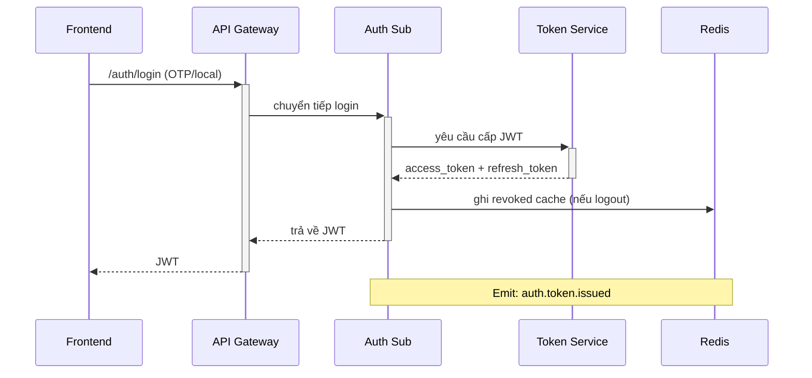

# 📘 Auth Service Sub – Interface Contract

## 1. 🎯 Mục tiêu & Phạm vi tài liệu

Tài liệu này định nghĩa rõ các **hợp đồng giao tiếp (interface contract)** của `auth-service/sub` – một service chịu trách nhiệm xác thực người dùng theo từng tenant, bao gồm:

- Đăng nhập qua OTP hoặc tài khoản nội bộ (Local login)
- Quản lý vòng đời phiên đăng nhập (`auth_sessions`)
- Thu hồi phiên hoặc token đã cấp
- Cung cấp metadata và audit cho các service khác

---

### 🎯 Mục tiêu chính

- Là cơ sở chính thức cho việc **triển khai backend** và **frontend tích hợp**
- Chuẩn hoá request/response theo OpenAPI
- Áp dụng các quy tắc phân quyền và bảo mật theo chuẩn `RBAC động`
- Làm cơ sở cho contract testing, CI/CD và monitoring

---

### 📦 Các API được định nghĩa tại đây

| Nhóm chức năng | Mô tả |
|----------------|------|
| `POST /auth/login` | Đăng nhập người dùng (OTP / Local) |
| `POST /auth/logout` | Đăng xuất và thu hồi token |
| `GET /auth/sessions` | Truy vấn lịch sử phiên đăng nhập |
| `POST /auth/sessions/{id}/revoke` | Thu hồi một phiên cụ thể |

---

### 🚫 Ngoài phạm vi (Out of Scope)

Các chức năng sau **không nằm trong tài liệu này** và được định nghĩa ở nơi khác:

| Chức năng | Nơi định nghĩa |
|-----------|----------------|
| Xác thực Google (OAuth2) | `auth-service/master` |
| Cấp phát JWT token | `token-service` |
| Kiểm tra RBAC động | `api-gateway` |
| Quản lý người dùng | `user-service` |

---

### 🧭 Định hướng kiến trúc

Tài liệu này được xây dựng dựa trên nguyên lý:

- **Stateless Service**: mọi trạng thái phiên đều externalized
- **Multi-tenant per-instance**: mọi request bắt buộc đi kèm `X-Tenant-ID`
- **RBAC Externalized**: mọi permission và điều kiện truy cập được xử lý tại gateway hoặc middleware
- **Auditability**: mọi hành vi phát sinh đều gửi sự kiện để trace và giám sát

> 📌 Mọi API trong tài liệu đều đồng bộ 100% với file OpenAPI (`openapi.yaml`) của `auth-service/sub`.

---

## 2. 🔐 Chính sách Bảo mật & Phân quyền

Toàn bộ các endpoint trong `auth-service/sub` yêu cầu xác thực và phân quyền chặt chẽ dựa trên:

- **JWT token** được cấp từ `token-service`
- **X-Tenant-ID** để định danh tenant hiện hành
- **Permission động (RBAC)** để giới hạn quyền truy cập theo vai trò và ngữ cảnh

---

### 2.1. 🛡 Security Scheme

| Thành phần | Bắt buộc | Ghi chú |
|------------|----------|---------|
| `Authorization` header | ✅ | Dạng Bearer JWT |
| `X-Tenant-ID` header | ✅ | Mọi request đều phải xác định tenant |
| JWT payload | ✅ | Chứa `user_id`, `roles`, `tenant_id`… theo chuẩn hệ thống |

> ⚠️ Token phải được cấp hợp lệ từ `token-service`, ký bằng khóa `RS256`.

---

### 2.2. 🧩 Cơ chế kiểm soát phân quyền

Hệ thống RBAC theo mô hình `permission + condition`, được xử lý **ngoài service** (tại `api-gateway` hoặc middleware) và được kiểm tra lại trong audit/logic nếu cần.

#### Ví dụ:

```json
"x-permissions": ["session.read:self"],
"x-condition": {
  "user_id": "{{current_user.id}}",
  "tenant_id": "{{X-Tenant-ID}}"
}
```

---

### 2.3. 📋 Bảng mapping permission

| Endpoint | Permission | x-condition |
|----------|------------|-------------|
| `POST /auth/login` | `auth.login` | `{ "tenant_id": "{{X-Tenant-ID}}" }` |
| `POST /auth/logout` | `auth.logout` | `{ "tenant_id": "{{X-Tenant-ID}}" }` |
| `GET /auth/sessions` | `session.read:self` \| `session.read:any` | `{ "user_id": ..., "tenant_id": ... }` |
| `POST /auth/sessions/{id}/revoke` | `session.revoke:any` | `{ "tenant_id": ... }` |

> Nếu user không thoả `x-condition`, hệ thống sẽ trả lỗi `403 Forbidden`.

---

### 2.4. 🔐 Bảo vệ dữ liệu nhạy cảm

- Các trường như `ip_address`, `user_agent`, `location` trong session chỉ trả về nếu có quyền `session.read:any`
- Với quyền `session.read:self`, một số trường có thể bị cắt bỏ để bảo vệ quyền riêng tư

---

### 2.5. 🧠 Gợi ý triển khai

| Vấn đề | Giải pháp |
|--------|-----------|
| Người dùng quên gửi `X-Tenant-ID` | Gateway trả lỗi 400 với lỗi `missing_tenant_id` |
| Quản trị viên muốn xem session của user khác | Cần `session.read:any` và điều kiện tenant match |
| Hạn chế truy cập chéo giữa tenant | Mọi truy vấn đều bắt buộc `tenant_id = {{X-Tenant-ID}}` |

> ✅ Cơ chế bảo mật và phân quyền được thiết kế để hoạt động an toàn trong môi trường multi-tenant, đồng thời linh hoạt cho quản trị hệ thống trên từng tenant cụ thể.

---

## 3. 📌 Tổng quan API & Luồng nghiệp vụ

Các API trong `auth-service/sub` tập trung phục vụ việc xác thực người dùng theo từng tenant. Tất cả đều tuân thủ kiến trúc phân tầng rõ ràng, hoạt động theo luồng chuẩn xác thực – phát token – quản lý session – thu hồi token.

---

### 3.1. 🔁 Các nhóm chức năng chính

| Nhóm API | Mô tả | Endpoint |
|----------|------|----------|
| 🧑‍💼 Xác thực | Đăng nhập bằng OTP hoặc Local login | `POST /auth/login` |
| 🚪 Đăng xuất | Thu hồi token đang dùng (logout) | `POST /auth/logout` |
| 📜 Lịch sử phiên | Liệt kê các phiên đăng nhập trước đó | `GET /auth/sessions` |
| 🔒 Thu hồi phiên | Huỷ bỏ session cụ thể (manual revoke) | `POST /auth/sessions/{id}/revoke` |

---

### 3.2. 🧭 Luồng xử lý chính



---

### 3.3. 🌐 Mối liên hệ với các service khác

| Service liên quan | Vai trò |
|-------------------|--------|
| `token-service` | Sinh & thu hồi access/refresh token |
| `api-gateway` | Enforce RBAC, forward `x-condition`, kiểm tra revoked token |
| `user-service` | Đồng bộ thông tin user (id, trạng thái) nếu cần |
| `notification-service` | Gửi OTP (trong tương lai nếu tách khỏi frontend) |

---

### 3.4. 📣 Sự kiện được phát ra

| Tên sự kiện | Khi nào? | Payload |
|-------------|----------|---------|
| `auth.token.issued` | Sau khi login thành công | Thông tin session, token, user metadata |
| `auth.token.revoked` | Khi logout hoặc bị revoke | Session ID, user ID, lý do |
| `user.sync.triggered` | (optional) Khi cần đồng bộ user qua tenant khác | user_id, tenant_id |

> 📌 Luồng nghiệp vụ trong `auth-service/sub` được thiết kế đơn giản, dễ mở rộng, và phù hợp tuyệt đối với mô hình multi-tenant per-instance của `dx-vas`.

---

## 4. 📬 Chi tiết các Endpoint

### 4.1. `POST /auth/login`

Đây là endpoint chính để xác thực người dùng thông qua OTP hoặc tài khoản nội bộ (local). Sau khi xác thực thành công, hệ thống sẽ tạo session, phát JWT, lưu metadata và phát sự kiện `auth.token.issued`.

---

#### 📥 Request

**Header yêu cầu**:

| Header | Bắt buộc | Ghi chú |
|--------|----------|--------|
| `Authorization` | ❌ | Không cần (chưa login) |
| `X-Tenant-ID` | ✅ | Xác định tenant đang xử lý |

**Body** (`LoginRequest`, dùng discriminator `login_type`):

```json
{
  "login_type": "otp",  // hoặc "local"
  "phone_number": "+84901234567", // OTP
  "otp_code": "123456"
}
```

Hoặc:

```json
{
  "login_type": "local",
  "username": "admin",
  "password": "123456"
}
```

> Các field cụ thể phụ thuộc vào `login_type`. Tài liệu `schemas/LoginRequest` sẽ định nghĩa cụ thể.

---

#### 📤 Response

```json
{
  "meta": {
    "request_id": "xyz",
    "timestamp": "..."
  },
  "data": {
    "access_token": "<JWT>",
    "refresh_token": "<JWT>",
    "expires_in": 3600,
    "session_id": "f2b9c6ae-...95c",
    "token_type": "Bearer"
  }
}
```

- Response luôn bọc trong `ResponseMeta + TokenEnvelope`
- `session_id` là UUID phiên login được lưu trong `auth_sessions`
- Token được phát từ `token-service`, không phải nội bộ auth-sub

---

#### 🔐 Phân quyền & Điều kiện

| Yếu tố | Giá trị |
|--------|--------|
| `x-required-permission` | `auth.login` |
| `x-condition` | `{ "tenant_id": "{{X-Tenant-ID}}" }` |

---

#### 📣 Sự kiện phát ra

- `auth.token.issued`
- Payload gồm: `user_id`, `tenant_id`, `auth_method`, `session_id`, `ip_address`, `user_agent`, `device_type`, `location`

---

#### ❌ Mã lỗi có thể trả về

| error.code | HTTP | Mô tả |
|------------|------|------|
| `auth.invalid_credentials` | 401 | Sai username/password |
| `auth.otp.invalid` | 400 | Mã OTP không đúng |
| `auth.otp.expired` | 400 | Mã OTP đã hết hạn |
| `auth.rate_limited` | 429 | Gửi OTP quá nhiều lần |
| `auth.tenant_not_found` | 400 | Thiếu hoặc sai `X-Tenant-ID` |

---

#### 🧪 Gợi ý kiểm thử

- Đăng nhập đúng/sai OTP
- Đăng nhập local đúng/sai
- Thiếu `X-Tenant-ID` → lỗi
- Session phải được ghi vào bảng `auth_sessions`
- Token phải có claim đúng (`sub`, `session_id`, `tenant_id`, `exp`...)

> 📌 Đây là endpoint duy nhất tạo JWT trong `auth-service/sub`. Mọi cấp phát token đều được uỷ quyền sang `token-service`.

---

### 4.2. `POST /auth/logout`

Endpoint này cho phép người dùng hoặc hệ thống **thu hồi token hiện tại** (access hoặc refresh) và đánh dấu session tương ứng là đã bị huỷ. Đồng thời phát sự kiện `auth.token.revoked` để các service khác cập nhật trạng thái.

---

#### 📥 Request

**Header yêu cầu**:

| Header | Bắt buộc | Ghi chú |
|--------|----------|--------|
| `Authorization` | ✅ | JWT hiện tại |
| `X-Tenant-ID` | ✅ | Tenant tương ứng với token |

**Body** (`LogoutRequest`, optional):

```json
{
  "reason": "user_logout"
}
```

> Nếu không truyền `reason`, mặc định là `"user_logout"`.

---

#### 📤 Response

```json
{
  "meta": {
    "request_id": "...",
    "timestamp": "..."
  },
  "data": {
    "success": true
  }
}
```

- Trả về 200 OK với success flag
- Không cần trả lại token

---

#### 🔐 Phân quyền & Điều kiện

| Yếu tố | Giá trị |
|--------|--------|
| `x-required-permission` | `auth.logout` |
| `x-condition` | `{ "tenant_id": "{{X-Tenant-ID}}" }` |

---

#### 🧩 Hành vi nội bộ

- Token hiện tại được decode → lấy `jti` (JWT ID), `session_id`, `user_id`
- Tạo key `revoked:<jti>` trong Redis với TTL đúng bằng thời gian còn lại
- Cập nhật bản ghi `auth_sessions` tương ứng: `revoked_at`, `revoked_reason`
- Ghi log audit và phát sự kiện `auth.token.revoked`

---

#### 📣 Sự kiện phát ra

- `auth.token.revoked`
- Payload gồm: `session_id`, `user_id`, `tenant_id`, `revoked_reason`, `revoked_at`, `ip_address`, `device_type`

---

#### ❌ Mã lỗi có thể trả về

| error.code | HTTP | Mô tả |
|------------|------|------|
| `auth.token.invalid` | 401 | Token không hợp lệ hoặc đã hết hạn |
| `auth.token.already_revoked` | 400 | Token đã bị thu hồi trước đó |
| `auth.tenant_mismatch` | 403 | Token không thuộc tenant đang gửi |

---

#### 🧪 Gợi ý kiểm thử

- Logout access token đang dùng → Redis có key `revoked:<jti>`
- Logout refresh token → cũng phải bị revoke
- Check Redis TTL và dữ liệu
- Truy vấn `GET /auth/sessions` → session đổi trạng thái
- Replay token sau logout → phải bị từ chối tại Gateway

> 📌 Đây là cơ chế chính để thực hiện session termination chủ động, phục vụ cả frontend và admin console. Các revoke xảy ra tại đây là **soft revoke** (qua Redis), không xóa token vật lý.

---

### 4.3. `GET /auth/sessions`

Endpoint này cho phép người dùng truy vấn danh sách phiên đăng nhập trước đó của chính mình, hoặc truy xuất của người dùng khác (nếu có quyền). Hỗ trợ lọc theo `user_id`, `trạng thái`, phân trang.

---

#### 📥 Request

**Header yêu cầu**:

| Header | Bắt buộc | Ghi chú |
|--------|----------|--------|
| `Authorization` | ✅ | JWT hợp lệ |
| `X-Tenant-ID` | ✅ | Tenant hiện hành |

**Query Parameters** (tùy chọn):

| Tham số | Kiểu | Ghi chú |
|---------|------|--------|
| `user_id` | UUID | Chỉ định user cụ thể (chỉ khi có quyền `read:any`) |
| `status` | ENUM | `active`, `revoked`, `expired`, `locked` |
| `limit` | Integer | Số dòng mỗi trang (default: 20) |
| `offset` | Integer | Bỏ qua bao nhiêu dòng đầu tiên |

---

#### 📤 Response

```json
{
  "meta": {
    "request_id": "...",
    "pagination": {
      "total": 82,
      "limit": 20,
      "offset": 0
    }
  },
  "data": [
    {
      "session_id": "f2b9c6ae-...",
      "user_id": "de56...",
      "auth_method": "otp",
      "created_at": "2024-06-01T10:45:00Z",
      "revoked_at": null,
      "ip_address": "203.113.12.1",
      "device_type": "web",
      "user_agent": "Mozilla/5.0 ...",
      "location": "Ho Chi Minh, VN",
      "status": "active"
    }
  ]
}
```

- Trả về mảng `SessionOut` theo chuẩn schema
- Metadata gồm pagination info và `request_id`

---

#### 🔐 Phân quyền & Điều kiện

| Yếu tố | Giá trị |
|--------|--------|
| `x-required-permission` | `session.read:self` hoặc `session.read:any` |
| `x-condition` | `{ "user_id": "{{current_user.id}}", "tenant_id": "{{X-Tenant-ID}}" }` |

> Nếu user gửi `user_id` ≠ chính họ → cần `session.read:any`.

---

#### 🔎 Lưu ý về bảo mật

- Nếu chỉ có `read:self`, hệ thống sẽ **ẩn** hoặc **mask** một số metadata (`ip_address`, `location`, `user_agent`)
- Nếu có `read:any`, sẽ thấy đầy đủ thông tin các session

---

#### ❌ Mã lỗi có thể trả về

| error.code | HTTP | Mô tả |
|------------|------|------|
| `auth.forbidden` | 403 | Không đủ quyền truy cập dữ liệu |
| `auth.invalid_query` | 400 | Truy vấn không hợp lệ (sai user_id, offset âm...) |

---

#### 🧪 Gợi ý kiểm thử

- Gọi không truyền `user_id` → trả session chính mình
- Gọi `user_id = self` nhưng thiếu quyền → 403
- Phân trang: limit/offset hoạt động chính xác
- So sánh số lượng session khớp DB `auth_sessions`
- Mask metadata khi dùng quyền `read:self`

> 📌 Đây là API quan trọng để người dùng tự kiểm tra lịch sử hoạt động hoặc để quản trị viên giám sát đăng nhập trong tenant của họ.

---

### 4.4. `POST /auth/sessions/{id}/revoke`

Endpoint này cho phép quản trị viên thu hồi một phiên đăng nhập cụ thể của người dùng trong tenant. Hành động này vô hiệu hóa token tương ứng nếu còn hiệu lực, cập nhật trạng thái session và phát sự kiện `auth.token.revoked`.

---

#### 📥 Request

**Header yêu cầu**:

| Header | Bắt buộc | Ghi chú |
|--------|----------|--------|
| `Authorization` | ✅ | JWT có quyền quản trị |
| `X-Tenant-ID` | ✅ | Tenant của phiên cần revoke |

**Path Parameter**:

| Param | Kiểu | Ghi chú |
|-------|------|--------|
| `id` | UUID | ID của session (`session_id`) cần thu hồi |

**Body** (`RevokeSessionRequest`, optional):

```json
{
  "reason": "admin_forced"
}
```

> Nếu không cung cấp `reason`, hệ thống dùng mặc định `"manual"`.

---

#### 📤 Response

```json
{
  "meta": {
    "request_id": "...",
    "timestamp": "..."
  },
  "data": {
    "success": true
  }
}
```

- Trả về 200 OK nếu thu hồi thành công hoặc đã bị thu hồi trước đó

---

#### 🔐 Phân quyền & Điều kiện

| Yếu tố | Giá trị |
|--------|--------|
| `x-required-permission` | `session.revoke:any` |
| `x-condition` | `{ "tenant_id": "{{X-Tenant-ID}}" }` |

> Chỉ cho phép thao tác với các session thuộc tenant hiện tại.

---

#### 🧩 Hành vi nội bộ

- Truy vấn `auth_sessions` để xác định session hợp lệ
- Nếu session đã bị revoke → trả success idempotent
- Nếu session còn hoạt động:
  - Ghi `revoked_at`, `revoked_reason`
  - Ghi Redis key `revoked:<jti>` nếu token còn hiệu lực
  - Emit sự kiện `auth.token.revoked`

---

#### 📣 Sự kiện phát ra

- `auth.token.revoked`
- Payload gồm: `session_id`, `user_id`, `tenant_id`, `revoked_reason`, `revoked_by`, `ip_address`

---

#### ❌ Mã lỗi có thể trả về

| error.code | HTTP | Mô tả |
|------------|------|------|
| `session.not_found` | 404 | Không tìm thấy session |
| `auth.forbidden` | 403 | Không đủ quyền hoặc sai tenant |
| `session.already_revoked` | 400 | Phiên đã bị thu hồi từ trước (có thể cho phép idempotent success) |

---

#### 🧪 Gợi ý kiểm thử

- Revoke một session chưa bị thu hồi → cập nhật DB, Redis
- Revoke lại cùng session → không lỗi (idempotent)
- Truy vấn `GET /auth/sessions` → thấy trạng thái `revoked`
- Xác minh sự kiện `auth.token.revoked` được phát đúng metadata
- Check token tương ứng → bị từ chối khi dùng lại

> 📌 Đây là API quản trị quan trọng cho phép vô hiệu hóa các phiên nghi ngờ hoặc chấm dứt truy cập ngay lập tức trong các tình huống khẩn cấp về bảo mật.

---

## 5. 📦 Schema sử dụng trong request/response

Tài liệu này mô tả các schema dữ liệu chính được sử dụng trong body của các request và response của `auth-service/sub`. Tất cả schema đều được định nghĩa và version hóa rõ ràng trong file OpenAPI (`openapi.yaml`) đi kèm.

---

### 5.1. 📨 `LoginRequest`

```json
{
  "login_type": "otp",  // hoặc "local"
  "phone_number": "+84901234567",
  "otp_code": "123456"
}
```

- `login_type`: `enum` (`otp`, `local`)
- Nếu `otp` → yêu cầu `phone_number` và `otp_code`
- Nếu `local` → yêu cầu `username` và `password`
- Được định nghĩa bằng `oneOf` trong OpenAPI với discriminator `login_type`

---

### 5.2. 📤 `TokenEnvelope`

```json
{
  "access_token": "eyJhbGciOiJSUzI1NiIsIn...",
  "refresh_token": "eyJhbGciOiJSUzI1NiIsIn...",
  "expires_in": 3600,
  "session_id": "3b61237d-...",
  "token_type": "Bearer"
}
```

- Bao gói thông tin token được cấp
- Trả về trong mọi response `login`

---

### 5.3. 📥 `LogoutRequest`

```json
{
  "reason": "user_logout"
}
```

- `reason`: string, optional, các giá trị gợi ý: `user_logout`, `expired`, `device_lost`, `admin_forced`

---

### 5.4. 📜 `SessionOut`

```json
{
  "session_id": "b6a1d437-...",
  "user_id": "1e332...",
  "auth_method": "local",
  "created_at": "2024-06-01T10:45:00Z",
  "revoked_at": null,
  "ip_address": "192.168.1.1",
  "device_type": "web",
  "user_agent": "Mozilla/5.0 ...",
  "location": "Ho Chi Minh, VN",
  "status": "active"
}
```

- Trả về trong `GET /auth/sessions`
- Có thể bị ẩn/mask bớt nếu quyền chỉ là `session.read:self`

---

### 5.5. 🛑 `ErrorEnvelope`

```json
{
  "error": {
    "code": "auth.invalid_credentials",
    "message": "Tên đăng nhập hoặc mật khẩu không đúng",
    "data": {
      "attempts_left": 1
    }
  },
  "meta": {
    "request_id": "xyz",
    "timestamp": "2024-06-13T07:22:30Z"
  }
}
```

- Được chuẩn hóa theo `adr-011-api-error-format.md`
- Tất cả response lỗi đều bọc trong `ErrorEnvelope`

---

### 5.6. 📦 `ResponseMeta`

```json
{
  "request_id": "req_abc123",
  "timestamp": "2024-06-13T07:22:30Z",
  "pagination": {
    "total": 120,
    "limit": 20,
    "offset": 0
  }
}
```

- Có mặt trong mọi response thành công
- `pagination` chỉ có khi dùng response dạng danh sách

> 📌 Tất cả schema đều versioned và test tự động bằng contract testing tools (`schemathesis`, `dredd`, etc.) trong CI pipeline.

---

## 6. 🎯 Quy ước response & mã lỗi

Mọi API trong `auth-service/sub` tuân thủ nghiêm ngặt định dạng phản hồi chuẩn hoá của hệ thống VAS DX. Điều này đảm bảo tính nhất quán, dễ debug và khả năng mở rộng các công cụ tự động hoá (contract testing, monitoring, tracing).

---

### 6.1. 📦 Cấu trúc phản hồi thành công

Mỗi response thành công đều phải bọc trong:

```json
{
  "meta": {
    "request_id": "abc123",
    "timestamp": "2024-06-13T08:00:00Z"
  },
  "data": {
    // Nội dung tuỳ API
  }
}
```

- `meta`: luôn có `request_id` (traceable), `timestamp`, và optional `pagination`
- `data`: chứa payload thực tế (token, session list, success flag...)

> Cấu trúc này được chuẩn hóa theo `adr-012-response-structure.md`

---

### 6.2. 🛑 Cấu trúc phản hồi lỗi

Tất cả lỗi đều trả về định dạng chuẩn `ErrorEnvelope`:

```json
{
  "error": {
    "code": "auth.invalid_credentials",
    "message": "Sai tên đăng nhập hoặc mật khẩu",
    "data": {
      "attempts_left": 1
    }
  },
  "meta": {
    "request_id": "abc123",
    "timestamp": "2024-06-13T08:01:30Z"
  }
}
```

- `code`: mã lỗi dạng snake-case (bắt buộc)
- `message`: mô tả ngắn gọn, có thể dùng đa ngôn ngữ
- `data`: optional – dùng để truyền thêm context (ví dụ: `attempts_left`, `lockout_duration`)

---

### 6.3. 📋 Danh sách mã lỗi phổ biến

| Mã lỗi | HTTP | Mô tả |
|--------|------|------|
| `auth.invalid_credentials` | 401 | Sai username/password |
| `auth.otp.invalid` | 400 | Mã OTP sai |
| `auth.otp.expired` | 400 | OTP đã hết hạn |
| `auth.token.invalid` | 401 | Token không hợp lệ hoặc đã thu hồi |
| `auth.token.already_revoked` | 400 | Token đã bị thu hồi từ trước |
| `session.not_found` | 404 | Không tìm thấy phiên |
| `auth.forbidden` | 403 | Không đủ quyền theo RBAC |
| `auth.tenant_mismatch` | 403 | Tenant không khớp |
| `auth.rate_limited` | 429 | Gửi OTP/quá nhiều yêu cầu |

> Danh sách đầy đủ được định nghĩa trong file `error-codes.md` và `adr-011-api-error-format.md`

---

### 6.4. 🧪 Contract testing yêu cầu

- Mỗi mã lỗi đều phải có test tương ứng
- Hành vi sai phải trả đúng mã HTTP + `error.code`
- CI pipeline không cho phép thay đổi `error.code` hoặc `ResponseMeta` format nếu không có migration

> ✅ Cách tiếp cận nhất quán giúp tăng khả năng giám sát tự động, phân tích lỗi chính xác, hỗ trợ frontend hiển thị rõ ràng và giảm thiểu lỗi tích hợp giữa các đội.

---

## 7. 🧪 Hỗ trợ kiểm thử & tích hợp

Tài liệu này hỗ trợ đầy đủ cho các hoạt động kiểm thử thủ công, kiểm thử tự động, tích hợp CI/CD và contract testing nhằm đảm bảo độ tin cậy và tính đúng đắn của `auth-service/sub`.

---

### 7.1. ✅ Mẫu request thực tế

| Mục đích | Method & URL | Gợi ý curl |
|---------|--------------|------------|
| Đăng nhập OTP | `POST /auth/login` | `curl -X POST ... -H "X-Tenant-ID: t1" -d '{...}'` |
| Logout | `POST /auth/logout` | `curl -H "Authorization: Bearer ..."` |
| Liệt kê session | `GET /auth/sessions` | `curl -G ... --data-urlencode 'user_id=...'` |
| Thu hồi phiên | `POST /auth/sessions/{id}/revoke` | `curl -X POST ... -d '{ "reason": "admin_forced" }'` |

📎 Gợi ý: Sử dụng [Postman Collection] hoặc [Insomnia Export] đính kèm dự án.

---

### 7.2. 🧪 Contract Testing

| Mục tiêu | Công cụ đề xuất |
|---------|----------------|
| Kiểm tra schema đúng với OpenAPI | `Dredd`, `Schemathesis`, `Stoplight Prism` |
| Kiểm tra định dạng lỗi & mã lỗi | `pytest + snapshot test`, `jest + supertest` |
| So khớp `response.meta` & pagination | Tích hợp test CI/CD |
| Đảm bảo backward compatibility | Contract test snapshot lockfile |

> ✅ Tài liệu này đồng bộ 100% với `openapi.yaml` – có thể dùng để sinh test auto.

---

### 7.3. 🧪 Kiểm thử phân quyền & điều kiện

- Test thiếu `X-Tenant-ID` → trả lỗi 400
- Test `session.read:self` vs `read:any` → khác nhau về metadata
- Test `session.revoke:any` → không được phép thu hồi phiên tenant khác
- Test `auth.token.revoked` → emit event đúng metadata

---

### 7.4. 🛠 Tích hợp CI/CD

- Mỗi PR bắt buộc chạy test schema → không cho phép thay đổi `ErrorEnvelope`, `ResponseMeta`
- Có rule YAML kiểm tra presence của `x-required-permission`, `x-condition` trong mỗi path

---

### 7.5. 📡 Tích hợp observability

- Mỗi request được gán `request_id` và trace ID để debug xuyên service
- Response chuẩn hóa hỗ trợ APM/monitoring như Datadog, Grafana Tempo, OpenTelemetry

> ✅ Với tài liệu này, đội frontend, backend, QA, và devops đều có thể tự động hoá quá trình kiểm thử và kiểm tra hợp đồng tích hợp xuyên tầng một cách chính xác và hiệu quả.

---

## 8. 📚 Tài liệu liên quan

* [Data Model](./data-model.md)
* [OpenAPI Spec](./openapi.yaml)
* [Design](./design.md)
