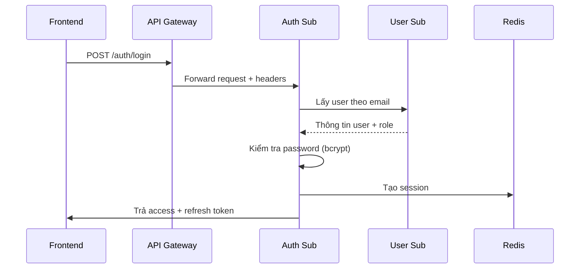
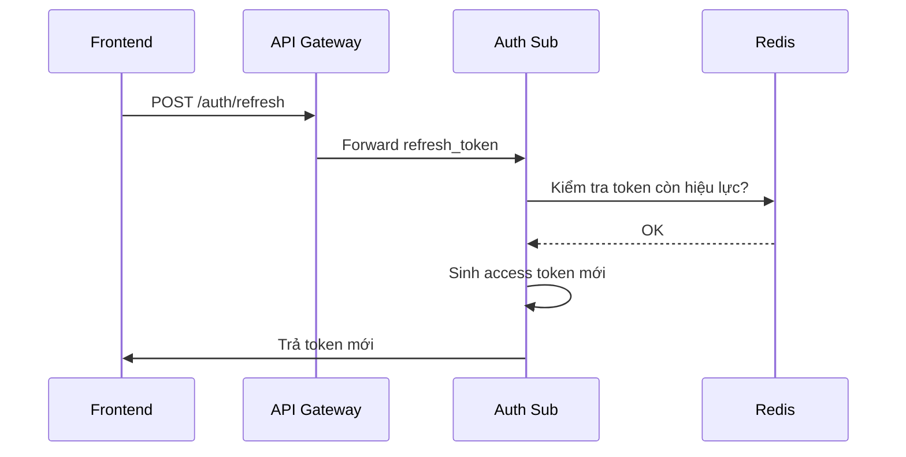
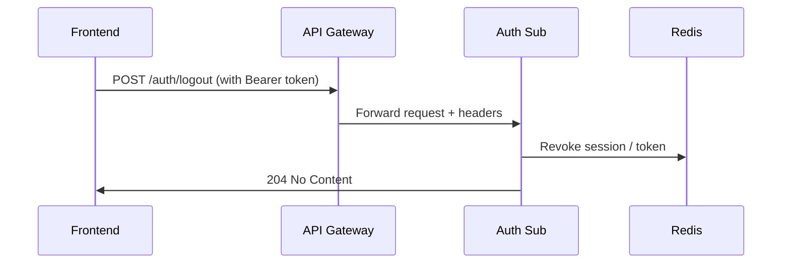
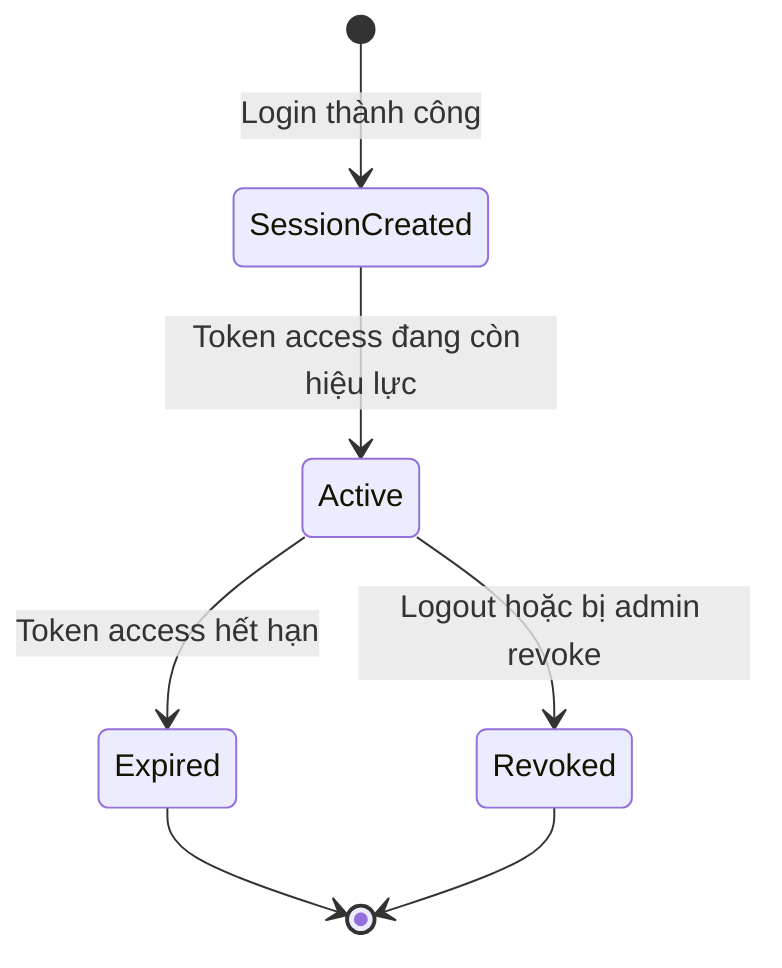

# 📘 Auth Service Sub – Interface Contract

Auth Sub Service là thành phần thuộc tenant domain, chịu trách nhiệm xác thực người dùng cục bộ theo từng tenant – bao gồm học sinh, phụ huynh và nhân viên tenant. Mỗi tenant có 1 instance riêng biệt được triển khai để đảm bảo độc lập về dữ liệu và xác thực.

Phạm vi:
- ✅ Quản lý đăng nhập cục bộ (email/password, mã OTP, liên kết Magic Link).
- ✅ Cấp phát JWT token (access, refresh).
- ✅ Đăng xuất và làm mới token.
- ❌ Không quản lý user profile, role hay permission (xem User Service Sub).
- ❌ Không quản lý danh sách tenant (xem Auth Service Master).

> 🧭 **Nguyên tắc chung:**
> - Tất cả API yêu cầu header `Authorization: Bearer <JWT>` ngoại trừ các API công khai như `/login`, `/refresh-token`.
> - Response body tuân thủ [ADR-012 Response Structure](../../../ADR/adr-012-response-structure.md).
> - Lỗi tuân theo [ADR-011 Error Format](../../../ADR/adr-011-api-error-format.md).
> - Các token do Sub Auth Service cấp có `aud=tenant:[tenant_id]`.

---

## 📌 API: `/auth`

Danh sách các API xác thực nội bộ cho tenant:

| Method | Path             | Mô tả                                    | Quyền (RBAC Permission Code) |
|--------|------------------|-------------------------------------------|-------------------------------|
| POST   | `/auth/login`    | Đăng nhập tenant bằng email/mật khẩu      | `public`                      |
| POST   | `/auth/refresh`  | Làm mới access token từ refresh token     | `public`                      |
| POST   | `/auth/logout`   | Thu hồi refresh token                     | `auth.logout.self`            |

---

### 🧪 Chi tiết API

Dưới đây là phần mở rộng chi tiết cho API:

---

#### 1. POST `/auth/login`

---

Đăng nhập nội bộ vào hệ thống theo tenant bằng email/mật khẩu hoặc OTP (nếu được cấu hình). Đây là điểm khởi đầu quan trọng cho mọi hành vi người dùng trong hệ thống Sub.

---

**📥 Request**

```json
{
  "email": "student@example.com",
  "password": "Abcd1234"
}
```

> 📝 **Ghi chú**:
>
> * Trường `email` là định danh đăng nhập chính. Với phụ huynh hoặc học sinh, có thể là số điện thoại nếu được cấu hình OTP.
> * Trường `password` không được lưu plaintext; sẽ được hash để kiểm tra với CSDL.

---

**📤 Response – 200 OK**

```json
{
  "data": {
    "access_token": "<JWT-access>",
    "refresh_token": "<JWT-refresh>",
    "expires_in": 3600,
    "token_type": "Bearer"
  },
  "meta": {
    "request_id": "df1291b2-....",
    "timestamp": "2025-06-07T12:34:56Z"
  },
  "error": null
}
```

---

**🔐 JWT access\_token**

```json
{
  "sub": "user-12345",
  "aud": "tenant:vas_t001",
  "iat": 1717784096,
  "exp": 1717787696,
  "permissions": ["student.read.self", "notification.receive"]
}
```

* **`sub`**: ID người dùng
* **`aud`**: Ràng buộc tenant
* **`permissions`**: Mảng quyền được lấy từ Sub User Service (role-based)

---

**❌ Các lỗi có thể gặp**

| Status Code | Điều kiện xảy ra                          | Mã lỗi (error.code)        | Mô tả                     |
| ----------- | ----------------------------------------- | -------------------------- | ------------------------- |
| 400         | Thiếu trường bắt buộc                     | `auth.missing_fields`      | Thiếu email hoặc password |
| 401         | Sai mật khẩu hoặc không tồn tại tài khoản | `auth.invalid_credentials` | Không thể xác thực        |
| 403         | Tài khoản bị khoá                         | `auth.account_locked`      | Không cho phép truy cập   |
| 429         | Quá nhiều lần thử                         | `auth.rate_limited`        | Tạm khóa đăng nhập        |

---

**🧩 Headers**

| Tên header     | Bắt buộc | Mô tả                                    |
| -------------- | -------- | ---------------------------------------- |
| `X-Request-ID` | ✅        | ID truy vết request, dùng cho logging    |
| `X-Tenant-ID`  | ✅        | Mã định danh tenant (do API Gateway gắn) |

---

**🔄 Flow tổng quát**



---

Dưới đây là phần mở rộng chi tiết cho endpoint:

---

#### 2. POST `/auth/refresh`

---

Cấp mới một access token hợp lệ dựa trên refresh token còn hiệu lực. Đây là phần quan trọng trong cơ chế duy trì phiên đăng nhập dài hạn (session longevity) mà không cần người dùng nhập lại mật khẩu.

---

**📥 Request**

```json
{
  "refresh_token": "<JWT-refresh-token>"
}
```

> 📝 **Ghi chú**:
>
> * `refresh_token` phải là token hợp lệ được cấp từ endpoint `/auth/login`.
> * Refresh token có thời hạn dài hơn access token (mặc định 7–14 ngày).
> * Token này **không được dùng để truy cập API** mà chỉ dùng để xin access token mới.

---

**📤 Response – 200 OK**

```json
{
  "data": {
    "access_token": "<JWT-access-new>",
    "expires_in": 3600,
    "token_type": "Bearer"
  },
  "meta": {
    "request_id": "af2b90dd-...",
    "timestamp": "2025-06-07T13:45:12Z"
  },
  "error": null
}
```

---

**🔐 JWT access\_token (mới)**

```json
{
  "sub": "user-12345",
  "aud": "tenant:vas_t001",
  "iat": 1717785096,
  "exp": 1717788696,
  "permissions": ["student.read.self", "notification.receive"]
}
```

---

**❌ Các lỗi có thể gặp**

| Status Code | Tình huống                           | error.code             | Mô tả                            |
| ----------- | ------------------------------------ | ---------------------- | -------------------------------- |
| 400         | Thiếu refresh\_token                 | `auth.missing_token`   | Không cung cấp refresh\_token    |
| 401         | Token hết hạn, sai chữ ký, bị revoke | `auth.invalid_token`   | Không thể xác thực token         |
| 403         | User bị khóa hoặc đã logout trước đó | `auth.session_revoked` | Phiên đăng nhập không còn hợp lệ |
| 500         | Lỗi hệ thống trong khi xử lý         | `auth.internal_error`  | Lỗi không xác định               |

---

**🧩 Headers**

| Tên header     | Bắt buộc | Mô tả                                    |
| -------------- | -------- | ---------------------------------------- |
| `X-Request-ID` | ✅        | ID truy vết request, dùng cho logging    |
| `X-Tenant-ID`  | ✅        | Mã định danh tenant (do API Gateway gắn) |

---

**📦 Lưu ý về Refresh Token**

* Lưu trong Redis (hoặc DB) với TTL tương ứng.
* Có thể thu hồi (`blacklist`) khi logout, hoặc khi vi phạm.
* Mỗi lần dùng `refresh_token`, hệ thống có thể chọn cấp **refresh mới** hoặc **tiếp tục dùng token cũ** tùy cấu hình.

---

**🔄 Flow tổng quát**



---

Dưới đây là phần chi tiết hoàn chỉnh cho endpoint:

---

#### 3. POST `/auth/logout`

---

Thu hồi refresh token hiện tại để kết thúc phiên làm việc của người dùng. Đây là cách chính thống để **chủ động kết thúc phiên**, xóa session khỏi hệ thống, đảm bảo bảo mật khi người dùng rời khỏi thiết bị.

---

**📥 Request**

- Không có body.
- Dựa hoàn toàn vào `Authorization` header mang `access_token`.

---

**📤 Response – 204 No Content**

```http
HTTP/1.1 204 No Content
X-Request-ID: 63a9e3af-....
```

> ✅ Không trả về `data` hoặc `error`. Nếu thành công, token hiện tại sẽ bị revoke.

---

**🧩 Headers**

| Header          | Bắt buộc | Mô tả                                                  |
| --------------- | -------- | ------------------------------------------------------ |
| `Authorization` | ✅        | `Bearer <access_token>` – xác định người dùng hiện tại |
| `X-Request-ID`  | ✅        | Mã truy vết request                                    |
| `X-Tenant-ID`   | ✅        | Tenant đang thao tác                                   |

---

**📦 Hành vi**

* Trích xuất `user_id` từ access token.
* Xác định `session_id` hoặc `refresh_token` từ Redis hoặc DB.
* Thu hồi (revoke) token bằng cách:

  * Xoá khỏi Redis cache.
  * Hoặc đánh dấu đã thu hồi trong DB.
* Có thể log lại hành vi này vào `audit-logging-service`.

---

**❌ Các lỗi có thể gặp**

| Status Code | Tình huống                           | error.code           | Ghi chú                       |
| ----------- | ------------------------------------ | -------------------- | ----------------------------- |
| 401         | Không có access token hoặc token sai | `auth.invalid_token` | Không thể xác thực người dùng |
| 403         | Token bị khóa, user bị vô hiệu hóa   | `auth.token_revoked` | Không cho phép logout         |

---

**🔄 Flow tổng quát**



---

**🛡️ Ghi chú Bảo mật**

* Logout thành công nên vô hiệu hóa `refresh_token` ngay lập tức.
* Nếu nhiều session cho 1 user: nên chỉ thu hồi session hiện tại.
* Kết hợp tốt với tracking: `audit_logs` có thể ghi lại hành vi logout.

---

Dưới đây là phần mở rộng Mermaid Diagram mô tả **luồng tổng quát trạng thái session** trong `auth-service/sub`, phù hợp nếu bạn dự định mở rộng tính năng quản lý nhiều phiên (multi-device session tracking, logout từ xa, audit session, v.v.).

---

### 📊 Mermaid – Luồng Trạng thái Session



---

#### 🧠 Giải thích:

* **SessionCreated**: Khi người dùng đăng nhập lần đầu (tạo refresh\_token + session entry)
* **Active**: Access token còn hiệu lực, session hợp lệ
* **Expired**: Token tự hết hạn (TTL)
* **Revoked**: Khi gọi `/auth/logout`, hoặc bị force logout từ Admin
* Mỗi phiên có thể được lưu trong Redis hoặc Postgres để phục vụ:

  * Theo dõi đăng nhập đa thiết bị
  * Thu hồi chọn lọc
  * Audit session

---

> 📌 **Nếu bạn mở rộng quản lý session nâng cao**, hãy bổ sung bảng `sessions` vào `data-model.md` và bổ sung API:
>
> * `GET /auth/sessions`
> * `DELETE /auth/sessions/{id}`

---

## 📎 ENUM sử dụng

Các trường ENUM được dùng trong `auth-service/sub` giúp chuẩn hóa dữ liệu trả về và đảm bảo frontend có thể hiển thị chính xác.

| Tên Trường        | Enum Giá Trị                 | Ý nghĩa & Gợi ý UI                                        |
|-------------------|------------------------------|------------------------------------------------------------|
| `token_type`      | `Bearer`                     | Kiểu token được cấp, mặc định là `Bearer` trong toàn hệ thống |
| `error.code`      | `auth.invalid_credentials`<br>`auth.missing_token`<br>`auth.token_revoked`<br>`auth.account_locked`<br>`auth.internal_error` | Mã lỗi trả về theo chuẩn [ADR-011](../../../ADR/adr-011-api-error-format.md) |
| `auth_method`     | `password`<br>`otp`<br>`magic_link` | Phương thức xác thực được hệ thống hỗ trợ (cho tương lai) |
| `grant_type`      | `refresh_token`              | Mô tả flow `POST /auth/refresh`, phù hợp chuẩn OAuth2      |
| `session_status`  | `active`, `revoked`, `expired` | Trạng thái của phiên làm việc – dùng trong tương lai nếu mở endpoint `/sessions` |

---

### 📌 Enum: `auth_method`

| Giá trị        | Mô tả                               | Ghi chú triển khai hiện tại            |
|----------------|--------------------------------------|----------------------------------------|
| `password`     | Xác thực bằng email/phone + mật khẩu | ✅ Đang được sử dụng                    |
| `otp`          | Xác thực một lần bằng mã gửi qua SMS/email | ⛔ Chưa hỗ trợ – sẽ triển khai sau (gắn Notification Service) |
| `magic_link`   | Xác thực qua link gửi qua email      | ⛔ Chưa hỗ trợ – cần triển khai thêm Auth Flow đặc biệt |

> 📌 Ghi chú:  
> Trong thời điểm hiện tại, hệ thống `auth-service/sub` **chỉ hỗ trợ phương thức `password`**.  
> Các phương thức như `otp` và `magic_link` được thiết kế sẵn trong schema để chuẩn bị cho tương lai, khi hệ thống mở rộng thêm xác thực thân thiện hơn cho học sinh, phụ huynh hoặc người dùng có kỹ năng số thấp.

---

### 📌 Enum: `error.code`

#### Nhóm `auth.*` – Lỗi xác thực

| Mã lỗi                  | Mô tả người dùng (VI)                | Mô tả kỹ thuật                        |
|-------------------------|---------------------------------------|---------------------------------------|
| `auth.invalid_credentials` | Sai thông tin đăng nhập              | Email/mật khẩu không đúng             |
| `auth.account_locked`      | Tài khoản bị khóa                   | Flag khóa từ phía hệ thống quản trị   |
| `auth.missing_token`       | Thiếu refresh token                 | Không gửi refresh token trong request |
| `auth.invalid_token`       | Token không hợp lệ                  | Hết hạn, sai chữ ký, cấu trúc sai     |

#### Nhóm `session.*` – Lỗi phiên làm việc

| Mã lỗi                  | Mô tả người dùng (VI)                | Mô tả kỹ thuật                        |
|-------------------------|---------------------------------------|---------------------------------------|
| `session.revoked`         | Phiên đăng nhập không còn hợp lệ     | Refresh token đã bị thu hồi           |
| `session.expired`         | Phiên làm việc đã hết hạn            | TTL Redis đã hết                      |
| `session.already_logged_out` | Bạn đã đăng xuất                   | Gửi lại logout khi token đã bị revoke |

#### Nhóm `common.*` – Lỗi hệ thống chung

| Mã lỗi                  | Mô tả người dùng (VI)                | Mô tả kỹ thuật                        |
|-------------------------|---------------------------------------|---------------------------------------|
| `common.internal_error`  | Lỗi hệ thống. Vui lòng thử lại sau   | Exception chưa được bắt / xử lý       |
| `common.rate_limited`    | Quá nhiều yêu cầu. Vui lòng chờ...   | Bị throttling hoặc limit từ upstream  |

---

> 📌 **Gợi ý i18n**:  
> Với cấu trúc này, frontend chỉ cần:
> ```ts
> t(`error.auth.invalid_credentials`) → “Sai thông tin đăng nhập”
> ```
> Dễ tổ chức file dịch JSON đa ngôn ngữ:
> ```json
> {
>   "error": {
>     "auth": {
>       "invalid_credentials": "Sai thông tin đăng nhập",
>       ...
>     },
>     "session": {
>       ...
>     }
>   }
> }
> ```

---

### 🧩 Gợi ý UI (từ Enum)

> Một số enum như `session_status` hoặc `error.code` có thể được mapping ra label + màu sắc cho frontend dễ hiển thị:

| error.code               | Label (VI)                    | Màu đề xuất |
|--------------------------|-------------------------------|-------------|
| `auth.invalid_credentials` | Sai thông tin đăng nhập        | `red`       |
| `auth.account_locked`      | Tài khoản bị khóa              | `orange`    |
| `auth.missing_token`       | Thiếu refresh token            | `gray`      |
| `auth.token_revoked`       | Phiên làm việc đã kết thúc      | `gray`      |

---

📎 **Tham khảo thêm**:
- `openapi.yaml` → `components.schemas.ErrorEnvelope`, `LoginResponse`, ...
- `data-model.md` → bảng `sessions`, `auth_logs`, các enum đi kèm.

---

Dưới đây là nội dung chi tiết hóa phần **📎 Permission Mapping** cho `auth-service/sub/interface-contract.md`, đảm bảo tuân thủ chuẩn 5★ Interface Contract Standard và gắn kết chặt chẽ với RBAC từ `rbac-deep-dive.md` và [ADR-007](../../../ADR/adr-007-rbac.md):

---

## 📎 Permission Mapping

Tài liệu này mô tả các quyền (RBAC permissions) được áp dụng trong `auth-service/sub`, nhằm kiểm soát hành vi truy cập API theo từng người dùng.

> 🔐 Lưu ý:
> - Các quyền này **không thể hardcode trong frontend**, mà phải được kiểm tra từ JWT.
> - Sub Auth Service không tự quản lý role hay permission, mà nhận từ Sub User Service khi cấp JWT.

---

### 🧩 Bảng Mapping

| `permission_code`     | API Endpoint                   | Hành động | Đối tượng       | Mô tả & Ghi chú                                         |
|------------------------|--------------------------------|-----------|------------------|---------------------------------------------------------|
| `public`               | `POST /auth/login`             | `login`   | `N/A`            | Không cần xác thực – dùng cho đăng nhập ban đầu         |
| `public`               | `POST /auth/refresh`           | `refresh` | `N/A`            | Không yêu cầu token access – dùng refresh token         |
| `auth.logout.self`     | `POST /auth/logout`            | `delete`  | `session`        | Chỉ cho phép người dùng thu hồi token của chính mình    |

---

### 🔄 Ánh xạ `permission` trong JWT

Ví dụ JWT payload sau:

```json
{
  "sub": "user-456",
  "permissions": [
    "auth.logout.self",
    "student.read.self",
    "notification.receive"
  ]
}
```

---

### 🔒 Chính sách kiểm tra

* `auth.logout.self` → bắt buộc phải có trong `permissions` khi gọi `/auth/logout`.
* Dùng `condition`: `{ "user_id": "$CURRENT" }` – nghĩa là chỉ được thao tác trên chính mình.
* Ánh xạ sẽ được lưu tại Auth Master và sync về từng tenant qua cơ chế schema `permission` riêng biệt.

---

📎 Xem thêm:

* [Data Model](./data-model.md)
* [OpenAPI Spec](./openapi.yaml)
* [Design](./design.md)
