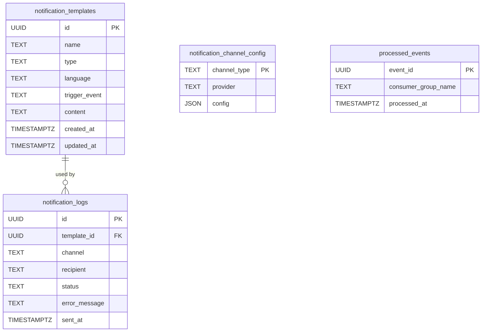
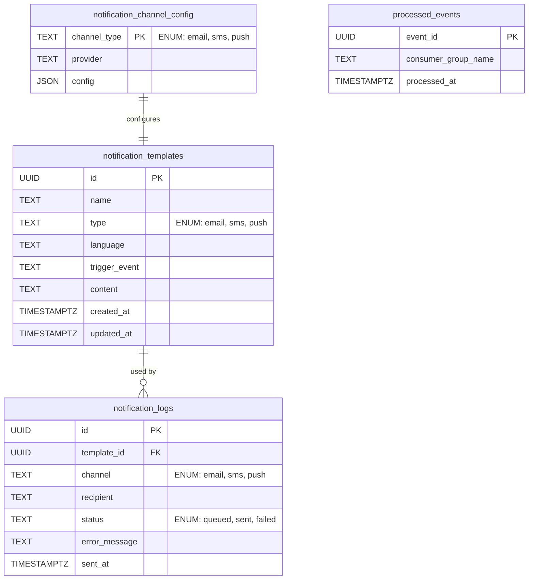

# 🗃️ Notification Service (Master) - Data Model

Tài liệu này mô tả chi tiết mô hình dữ liệu của **Notification Service (Master)**.  
Service này là một thành phần **cốt lõi** trong hệ thống `dx-vas`, hoạt động theo kiến trúc **event-driven + multi-tenant-aware (quản lý kênh gửi theo tenant)**.

Notification Service chịu trách nhiệm quản lý các loại dữ liệu chính sau:
- Cấu hình template gửi thông báo (`notification_templates`)
- Lịch sử gửi thông báo (`notification_logs`)
- Cấu hình kênh gửi theo từng loại (`notification_channel_config`)
- Ghi nhận sự kiện đã xử lý để tránh gửi trùng (`processed_events`)

---

## 1. Phạm vi Dữ liệu Quản lý (Scope)

Notification Service bao gồm việc quản lý:
- Template thông báo theo loại sự kiện và ngôn ngữ
- Lịch sử gửi thông báo và trạng thái thành công/thất bại
- Cấu hình kênh gửi (SMTP, SMS, push) theo loại
- Sự kiện đã xử lý từ Kafka để đảm bảo idempotency

---

## 2. Ngoài Phạm Vi (Out of Scope)

Notification Service **không** chịu trách nhiệm quản lý:
- ❌ Người nhận thông báo (được lấy từ sự kiện hoặc hệ thống khác)
- ❌ Quản lý user/role (thuộc về user-service)
- ❌ Logging audit (đã có service riêng)

---

## 3. Mục tiêu của Tài liệu Mô hình Dữ liệu

- Trình bày cấu trúc bảng cốt lõi: template, log, channel config
- Mô tả khóa chính, khóa ngoại, unique constraint, indexing, enum
- Phục vụ backend dev, schema migration, OpenAPI, testing
- Tuân thủ các ADR: `adr-007`, `adr-027`, `adr-030`

---

## 4. Sơ đồ ERD

**Sơ đồ ERD sơ bộ**


**Sơ đồ ERD Chi tiết**


### 🧠 Ghi chú:
- `notification_logs.template_id` có thể `NULL` nếu template bị xoá sau khi log vẫn còn.
- `processed_events` dùng cho idempotency theo `ADR-030`.
- `channel_type`, `type`, `status` đều dùng ENUM để enforce tính nhất quán.

---

## 5. Chi tiết Từng Bảng

### 📌 notification_templates

#### 🧾 Mục đích
Lưu thông tin template cho từng loại sự kiện và ngôn ngữ.

```sql
CREATE TABLE notification_templates (
    id UUID PRIMARY KEY,
    name TEXT NOT NULL,
    type TEXT CHECK (type IN ('email', 'sms', 'push')) NOT NULL,
    language TEXT DEFAULT 'vi' NOT NULL,
    trigger_event TEXT NOT NULL,
    content TEXT NOT NULL,
    created_at TIMESTAMPTZ DEFAULT now() NOT NULL,
    updated_at TIMESTAMPTZ DEFAULT now() NOT NULL
);
```

#### 📋 Giải thích cột

| Cột           | Kiểu DL    | Ràng buộc | Mô tả |
|---------------|------------|-----------|-------|
| id            | UUID       | PK        | ID duy nhất |
| name          | TEXT       |           | Tên template |
| type          | TEXT       | CHECK     | email/sms/push |
| language      | TEXT       | DEFAULT   | Ngôn ngữ (vi, en...) |
| trigger_event | TEXT       | NOT NULL  | Sự kiện kích hoạt (ví dụ: `user.created`) |
| content       | TEXT       | NOT NULL  | Nội dung có chứa placeholder |
| created_at    | TIMESTAMPTZ| DEFAULT   | Thời điểm tạo |
| updated_at    | TIMESTAMPTZ| DEFAULT   | Thời điểm cập nhật |

---

### 📌 notification_logs

#### 🧾 Mục đích
Ghi log trạng thái gửi, bao gồm template đã dùng, người nhận, kênh gửi.

```sql
CREATE TABLE notification_logs (
    id UUID PRIMARY KEY,
    template_id UUID REFERENCES notification_templates(id) ON DELETE SET NULL,
    channel TEXT NOT NULL,
    recipient TEXT NOT NULL,
    status TEXT CHECK (status IN ('queued', 'sent', 'failed')) NOT NULL,
    error_message TEXT,
    sent_at TIMESTAMPTZ
);
```

#### 📋 Giải thích cột

| Cột            | Kiểu DL     | Ràng buộc                          | Mô tả                                      |
| -------------- | ----------- | ---------------------------------- | ------------------------------------------ |
| id             | UUID        | PK                                 | ID log gửi duy nhất                        |
| template\_id   | UUID        | FK → `notification_templates`      | Liên kết với template được dùng (nullable) |
| channel        | TEXT        | CHECK (`email`, `sms`, `push`)     | Kênh gửi thông báo                         |
| recipient      | TEXT        | NOT NULL                           | Email/số điện thoại người nhận             |
| status         | TEXT        | CHECK (`queued`, `sent`, `failed`) | Trạng thái gửi                             |
| error\_message | TEXT        | NULLABLE                           | Mô tả lỗi nếu có                           |
| sent\_at       | TIMESTAMPTZ | NULLABLE                           | Thời điểm gửi thông báo (nếu thành công)   |

---

### 📌 notification_channel_config

#### 🧾 Mục đích
Lưu cấu hình gửi cho từng loại kênh (SMTP, SMS, push).

```sql
CREATE TABLE notification_channel_config (
    channel_type TEXT PRIMARY KEY CHECK (channel_type IN ('email', 'sms', 'push')),
    provider TEXT NOT NULL,
    config JSON NOT NULL
);
```

#### 📋 Giải thích cột

| Cột           | Kiểu DL | Ràng buộc                          | Mô tả                                              |
| ------------- | ------- | ---------------------------------- | -------------------------------------------------- |
| channel\_type | TEXT    | PK, CHECK (`email`, `sms`, `push`) | Loại kênh gửi (primary key)                        |
| provider      | TEXT    | NOT NULL                           | Tên nhà cung cấp dịch vụ gửi (SendGrid, Twilio...) |
| config        | JSON    | NOT NULL                           | Thông tin cấu hình chi tiết (host, token, v.v.)    |

---

### 📌 processed_events

#### 🧾 Mục đích
Tránh xử lý lại các event đã nhận qua Kafka.

```sql
CREATE TABLE processed_events (
    event_id UUID PRIMARY KEY,
    consumer_group_name TEXT NOT NULL,
    processed_at TIMESTAMPTZ DEFAULT now() NOT NULL
);
```

#### 📋 Giải thích cột

| Cột                   | Kiểu DL     | Ràng buộc     | Mô tả                                                              |
| --------------------- | ----------- | ------------- | ------------------------------------------------------------------ |
| event\_id             | UUID        | PK            | ID sự kiện duy nhất (`metadata.event_id` trong schema sự kiện)     |
| consumer\_group\_name | TEXT        | NOT NULL      | Tên nhóm tiêu dùng (dành cho việc phân biệt consumer theo service) |
| processed\_at         | TIMESTAMPTZ | DEFAULT now() | Thời điểm đã xử lý, phục vụ audit hoặc retry tracking              |

---

## 6. Phụ lục – ENUMs & Constraints

### 📋 ENUMs

| Trường     | Giá trị              |
|------------|----------------------|
| type       | email, sms, push     |
| status     | queued, sent, failed |
| channel_type | email, sms, push   |

---

## 7. Phụ lục – Index & Idempotency

| Bảng                  | Index                              | Mục đích |
|-----------------------|-------------------------------------|----------|
| notification_templates| (trigger_event, language, type)     | Tìm template nhanh |
| notification_logs     | (template_id, sent_at)              | Truy vấn log theo thời gian |
| processed_events      | (event_id)                          | Đảm bảo không xử lý trùng |

---

## 8. ♻️ Retention & Data Lifecycle

### 🔄 Bảng: `notification_logs`

- **Retention policy:** dữ liệu log sẽ được lưu tối đa **180 ngày** kể từ thời điểm gửi (`sent_at`).
- **Lý do:** giảm dung lượng lưu trữ và tránh ảnh hưởng đến hiệu năng truy vấn khi khối lượng log lớn.
- **Chiến lược xoá:**
  - Thi hành bởi **batch job định kỳ hàng ngày** (dùng cron + SQL DELETE).
  - Câu lệnh mẫu:
    ```sql
    DELETE FROM notification_logs
    WHERE sent_at < now() - interval '180 days';
    ```
  - Có thể mở rộng dùng **partition theo tháng** để xoá hiệu quả hơn trong tương lai.

### 🔒 Lưu ý về bảo mật & audit:

- Các log bị xoá không thể khôi phục – service này **không giữ bản backup nội bộ**.
- Nếu cần trace hành vi người dùng lâu dài phục vụ kiểm toán, nên **ghi lại bản sao dạng audit log** tại `audit-logging-service` (xem ADR-008).

---

## 9. 🧩 Bảng phụ trợ cho UI (UI Metadata Tables)

Để phục vụ dashboard quản trị template và log (dành cho admin nội bộ), các giá trị ENUM sẽ được **chuẩn hóa thành bảng phụ trợ** nhằm:

- Cho phép mapping UI label, icon, màu sắc (cho frontend)
- Hỗ trợ localization nếu cần đa ngôn ngữ
- Tránh hard-code giá trị ENUM ở frontend

---

### 📦 `ui_enum_channel_types`

```sql
CREATE TABLE ui_enum_channel_types (
    code TEXT PRIMARY KEY CHECK (code IN ('email', 'sms', 'push')),
    label TEXT NOT NULL,        -- Label cho UI
    icon TEXT,                  -- Tên icon (nếu có)
    color TEXT                  -- Mã màu (hex)
);
```

| code  | label        | icon      | color   |
|-------|--------------|-----------|---------|
| email | Email        | mail      | #1D4ED8 |
| sms   | SMS          | message   | #059669 |
| push  | Push Message | bell      | #F59E0B |

---

### 📦 `ui_enum_statuses`

```sql
CREATE TABLE ui_enum_statuses (
    code TEXT PRIMARY KEY CHECK (code IN ('queued', 'sent', 'failed')),
    label TEXT NOT NULL,
    color TEXT,
    is_error BOOLEAN DEFAULT false
);
```

| code    | label    | color   | is_error |
|---------|----------|---------|----------|
| queued  | Đang xử lý | #E0E7FF | false    |
| sent    | Đã gửi     | #A7F3D0 | false    |
| failed  | Thất bại   | #FCA5A5 | true     |

---

📚 Ghi chú:

- Các bảng này **không dùng trong xử lý nghiệp vụ**, chỉ phục vụ frontend quản trị.
- Có thể sử dụng API riêng `/ui-enum/channel-types` hoặc `/ui-enum/statuses` để trả về mapping JSON.

---

## 🔔 Phụ lục – Các sự kiện do Service này phát ra (Outbound Events)

Notification Service (Master) không chỉ **consume** từ các service khác, mà còn **phát ra sự kiện** lên Pub/Sub sau khi xử lý hoàn tất.

Tất cả sự kiện phát ra đều tuân thủ schema chuẩn [ADR-030](../../../ADR/adr-030-event-schema-governance.md).

---

### 📤 Sự kiện: `global_notification_requested`

> Được phát ra khi Notification Master nhận sự kiện từ service khác và quyết định gửi xuống Sub Service để xử lý theo tenant-specific rule.

| Trường       | Kiểu DL    | Mô tả |
|--------------|------------|--------|
| `event_type` | string     | `global_notification_requested` |
| `data`       | object     | Thông tin cần thiết để Sub service render & gửi |
| `metadata`   | object     | Gồm `event_id`, `timestamp`, `source_service`, `tenant_id` nếu có |

#### 📦 Payload mẫu

```json
{
  "event_type": "global_notification_requested",
  "data": {
    "template_id": "tpl-001",
    "recipient": "parent@vas.edu.vn",
    "channel": "email",
    "params": {
      "name": "Phụ huynh A",
      "code": "ABC123"
    }
  },
  "metadata": {
    "event_id": "evt-vas-789",
    "timestamp": "2025-06-05T13:00:00Z",
    "source_service": "notification-service.master",
    "tenant_id": "tenant-001"
  }
}
```

---

### 🧠 Ghi chú

- Event này đóng vai trò làm cầu nối giữa master → sub theo cơ chế multi-tenant.
- Sub Service lắng nghe topic `global_notification_requested` để:
  - Kiểm tra cấu hình override theo tenant
  - Gửi thật đến người dùng cụ thể
  - Ghi log riêng biệt trong vùng dữ liệu tenant-local
- Nếu hệ thống có nhu cầu tích hợp với 3rd-party (CRM, Firebase Cloud Messaging…), adapter cũng có thể subscribe sự kiện này.

---

## 10. 📚 Liên kết Tài liệu
- [Design](./design.md)
- [Interface Contract](./interface-contract.md)
- [OpenAPI](./openapi.yaml)
- [ADR-008 – Audit Logging](../../../ADR/adr-008-audit-logging.md)
- [ADR-027 - Data Management](../../../ADR/adr-027-data-management-strategy.md)
- [ADR-030 - Event Schema Governance](../../../ADR/adr-030-event-schema-governance.md)
