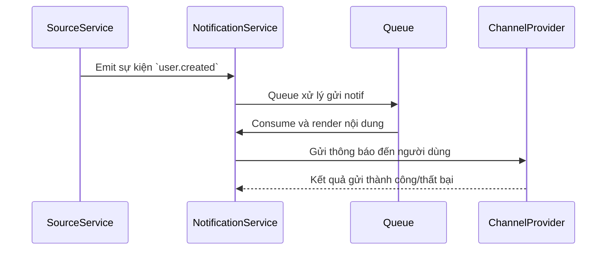
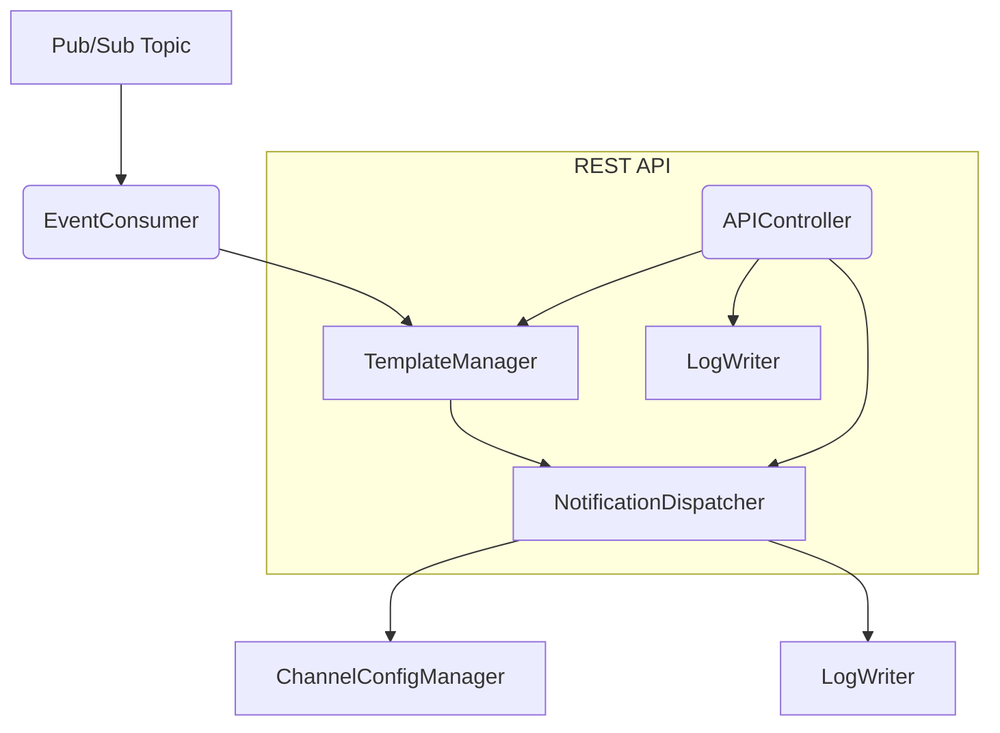

# 📘 Thiết kế chi tiết Notification Service (Master)

## 1. 🧭 Phạm vi và Trách nhiệm (Scope & Responsibilities)

### 🎯 Mục tiêu

- Gửi thông báo đa kênh (email, SMS, push) theo cấu hình template.
- Cho phép quản trị hệ thống tạo và cập nhật template thông báo theo loại sự kiện.
- Cung cấp API và Pub/Sub để các service khác sử dụng gửi thông báo thông qua cấu hình chuẩn hóa.

### 📦 Các thực thể dữ liệu quản lý

| Thực thể               | Mô tả                                                                 |
|------------------------|----------------------------------------------------------------------|
| NotificationTemplate   | Định nghĩa các mẫu thông báo (template) theo loại kênh và loại sự kiện. |
| NotificationLog        | Ghi nhận lịch sử gửi thông báo thành công/thất bại.                  |
| NotificationChannelCfg | Cấu hình gửi theo kênh: SMTP, SMS provider, push gateway.           |

### 🔒 Ngoài Phạm Vi (Out of Scope)

- ❌ Không quản lý người dùng nhận thông báo (do User Service đảm nhiệm).
- ❌ Không thực hiện xử lý nội dung cá nhân hóa ngoài các placeholder đã được backend đổ vào.
- ❌ Không lưu trữ nội dung email đầy đủ (chỉ metadata và status).
- ❌ Không phát hành/sinh sự kiện nghiệp vụ (chỉ nhận và gửi).
- ❌ Không thực hiện retry phân tán – retry nằm trong queue hoặc xử lý lỗi riêng biệt.

---

## 2. 🌐 Thiết kế API chi tiết (Interface Contract)

| Method | Path                       | Tác vụ                                | Yêu cầu permission               |
|--------|----------------------------|---------------------------------------|----------------------------------|
| GET    | /templates                 | Lấy danh sách template hiện có        | ✅ `notif.read_template`         |
| POST   | /templates                 | Tạo template mới                      | ✅ `notif.write_template`        |
| PUT    | /templates/{id}           | Cập nhật nội dung template            | ✅ `notif.write_template`        |
| POST   | /send                      | Gửi một thông báo thủ công (manual)   | ✅ `notif.send_manual`           |

> Tuân thủ:
> - `ADR-011` – định dạng lỗi chuẩn.
> - `ADR-012` – chuẩn cấu trúc response.
> - `ADR-030` – quản lý schema event gửi đi.

### 📦 Ví dụ response `POST /send`

```json
{
  "data": {
    "status": "queued",
    "notification_id": "notif-123"
  },
  "meta": {
    "request_id": "req-xyz-789",
    "timestamp": "2025-06-05T13:20:00Z"
  }
}
```

> **Chi tiết** tại [Interface Contract](./interface-contract.md) & [OpenAPI Spec](./openapi.yaml)

---

## 3. 🗃️ Mô hình dữ liệu chi tiết (Data Model)

### 🗺️ Sơ đồ ERD (Mermaid)

```mermaid
erDiagram
  NotificationTemplate ||--o{ NotificationLog : uses
  NotificationChannelCfg ||--o{ NotificationTemplate : configures

  NotificationTemplate {
    UUID id PK
    STRING name
    STRING type  // email, sms, push
    TEXT content
    STRING language
    STRING trigger_event
  }

  NotificationLog {
    UUID id PK
    UUID template_id FK
    STRING recipient
    STRING status // success, failed
    TEXT error_message
    DATETIME sent_at
  }

  NotificationChannelCfg {
    STRING channel_type PK // email, sms, push
    STRING provider
    JSON config
  }
```
> **Chi tiết** tại [Data Model](./data-model.md)
---

## 4. 🔄 Luồng xử lý nghiệp vụ chính (Business Logic Flows)

### Luồng: Gửi thông báo qua sự kiện nội bộ



> 1. Dịch vụ khác phát sự kiện (VD: user.created)
> 2. Notification Service consume từ queue và render template
> 3. Gửi đến kênh tương ứng (email/SMS/push)
> 4. Log lại kết quả gửi

---

## 5. 📣 Các sự kiện Pub/Sub (Events)

| Sự kiện nhận/phát         | Nguồn phát / Đích nhận | Hành động tại Service này                    |
|---------------------------|------------------------|----------------------------------------------|
| `user.created`            | user-service.master     | Gửi welcome email dựa trên template cấu hình |
| `password.reset_requested`| auth-service.master     | Gửi email reset password                     |

### 📦 Payload mẫu `user.created`

```json
{
  "event_type": "user.created",
  "data": {
    "user_id": "u123",
    "email": "newuser@vas.edu.vn",
    "full_name": "Nguyễn Văn A"
  },
  "metadata": {
    "event_id": "evt-555",
    "timestamp": "2025-06-05T09:00:00Z",
    "source_service": "user-service.master"
  }
}
```

---

## 6. 🔐 Bảo mật & Phân quyền (Security & Authorization)

- Authentication: thông qua JWT được Gateway xác thực
- Authorization:
  - enforce bởi API Gateway qua header `X-Permissions`
  - permission liên quan: `notif.read_template`, `notif.send_manual`, `notif.write_template`
  - các API public qua event không cần token

---

## 7. ⚙️ Cấu hình & Phụ thuộc

| Thành phần              | Mục đích                         | Ghi chú                       |
|-------------------------|----------------------------------|-------------------------------|
| `NOTIF_DB_URL`          | Kết nối CSDL                     | PostgreSQL                    |
| `KAFKA_BROKERS`         | Consume sự kiện                  | Tham khảo config chung        |
| `SMTP_CONFIG`           | Gửi email                        | JSON hoặc secrets             |
| `SMS_API_KEY`           | Gửi SMS                          | secrets                       |
| `PUSH_API_TOKEN`        | Gửi push notification            | optional                      |
| `TOPIC_user.created`    | Topic nhận event user            | Từ user-service.master        |

---

## 8. 🧪 Testing

- Unit Test: TemplateRenderer, LogWriter
- Integration Test: Consume event `user.created`, assert log gửi email đúng
- Mock provider: gửi giả lập qua SMTP hoặc sandbox mode

---

## 9. 📈 Khả năng Giám sát (Observability)

| Metric                          | Mô tả                                      | Loại     |
|----------------------------------|---------------------------------------------|----------|
| `notif_event_consumed_total`     | Tổng event đã xử lý                        | Counter  |
| `notif_send_duration_seconds`    | Thời gian gửi mỗi thông báo                | Histogram|
| `notif_send_failure_total`       | Thống kê gửi lỗi                           | Counter  |
| `notif_template_used_total`      | Thống kê template được dùng                | Counter  |

---

## 10. 🔁 Độ tin cậy & Phục hồi

- Retry 3 lần nếu gửi lỗi (SMTP timeout...)
- Có DLQ cho các event lỗi không xử lý được
- Idempotent theo `event_id`
- Health check tại `/healthz`

---

## 11. ⚡️ Hiệu năng & Khả năng mở rộng

- Stateless → scale theo instance
- SLO: gửi 95% thông báo trong 1s
- Caching template: TTL 10 phút trong memory

---

## 12. 🧩 Kiến trúc Service

Notification Service (Master) được chia thành các module logic rõ ràng, tách biệt trách nhiệm để đảm bảo dễ bảo trì, test, và mở rộng.

### 🧱 Thành phần chính

| Module                   | Trách nhiệm chính                                                                 |
|--------------------------|------------------------------------------------------------------------------------|
| `TemplateManager`        | Quản lý CRUD template, hỗ trợ render nội dung với placeholder & multi-language   |
| `EventConsumer`          | Lắng nghe sự kiện từ Pub/Sub (Kafka), validate payload, và dispatch gửi notif    |
| `NotificationDispatcher` | Xử lý gửi thông báo đến kênh phù hợp (email, sms, push), retry nếu lỗi tạm thời   |
| `ChannelConfigManager`   | Quản lý cấu hình SMTP, SMS provider, token cho các kênh gửi                        |
| `LogWriter`              | Ghi log gửi thông báo (thành công/thất bại), phục vụ audit & thống kê            |
| `APIController`          | Xử lý các API RESTful (template CRUD, gửi thủ công), enforce RBAC                |

---

### 🧭 Sơ đồ kiến trúc nội bộ (Mermaid)



---

### 🔗 Tương tác chính

- `EventConsumer` sử dụng `TemplateManager` để lấy nội dung template, gọi `NotificationDispatcher` để thực thi gửi.
- `Dispatcher` truy cập `ChannelConfigManager` để lấy thông tin provider và gửi message.
- Mọi kết quả gửi được ghi lại bởi `LogWriter` kèm `trace_id`, `status`, `template_id`.
- `APIController` cung cấp giao diện quản lý template, gửi thủ công, dùng chung module bên trong.

---

📚 **Xem thêm:**
- Luồng sequence event gửi trong mục 4
- Mô hình dữ liệu trong mục 3
- Event schema và permission liên quan trong ADR-007, 030

---

## 13. 📚 Tài liệu liên kết

- [Interface Contract](./interface-contract.md)
- [Data Model](./data-model.md)
- [OpenAPI Spec](./openapi.yaml)
- [ADR-028 – Reporting Architecture (liên quan việc tiêu chuẩn hóa template)]
- [ADR-030 – Event Schema Governance]
- [ADR-007 – RBAC phân tầng]
