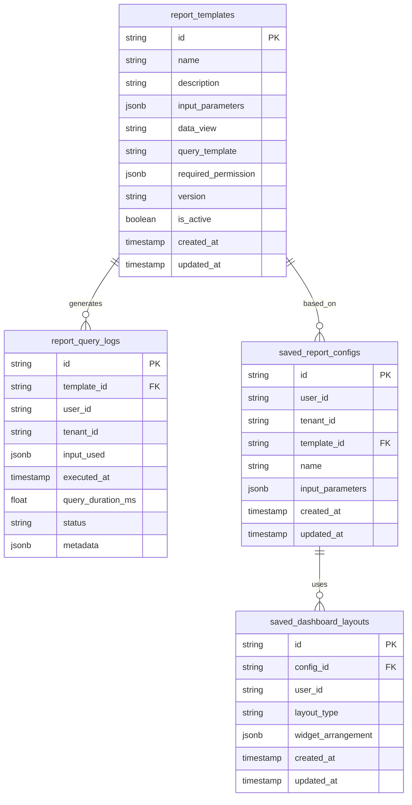
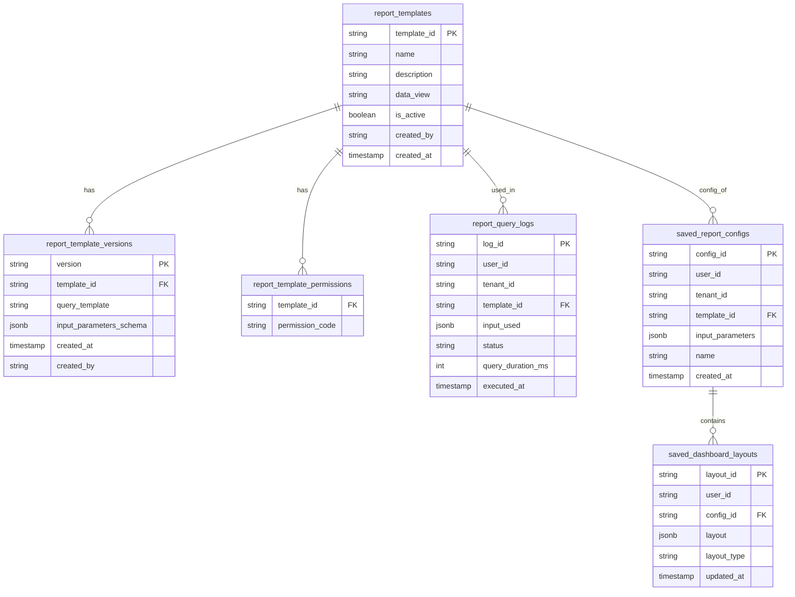

# 🗃️ Reporting Service - Data Model

## 1. Giới thiệu

Tài liệu này mô tả chi tiết mô hình dữ liệu của **Reporting Service**. Service này là một thành phần **cốt lõi** trong hệ thống `dx-vas`, hoạt động theo kiến trúc **multi-tenant**, phục vụ nhu cầu báo cáo và phân tích hệ thống của cả cấp Superadmin lẫn từng tenant riêng biệt.

**Reporting Service** chịu trách nhiệm quản lý các loại dữ liệu chính sau:
-   Các cấu hình mẫu báo cáo (`report_templates`)
-   Lịch sử truy vấn và kết quả báo cáo (`report_query_logs`)
-   Cấu hình báo cáo đã lưu của người dùng (`saved_report_configs`)
-   Cấu hình hiển thị dashboard (`saved_dashboard_layouts`)

Mô hình dữ liệu này là cơ sở cho việc phát triển backend, định nghĩa API, thực hiện schema migration, đảm bảo tính nhất quán dữ liệu, và đồng thời phục vụ cho việc truy vấn tới hệ thống Data Warehouse như BigQuery.

## 2. Phạm vi Dữ liệu Quản lý (Scope)

Reporting Service bao gồm việc quản lý:
-   Danh sách các mẫu báo cáo được định nghĩa sẵn (`report_templates`)
-   Các truy vấn được thực thi dựa trên các template (`report_query_logs`)
-   Cấu hình báo cáo được người dùng lưu lại (`saved_report_configs`)
-   Cấu hình dashboard của người dùng (`saved_dashboard_layouts`)

## 3. Ngoài Phạm Vi (Out of Scope)

Reporting Service **không** chịu trách nhiệm quản lý:
-   ❌ Dữ liệu thô (raw data) từ các hệ thống nguồn – đã được ETL đưa vào Data Warehouse.
-   ❌ Truy cập trực tiếp vào các table nghiệp vụ cụ thể của CRM/SIS/LMS – được truy vấn gián tiếp qua BigQuery.
-   ❌ Quản lý quyền truy cập người dùng – thực hiện thông qua API Gateway và RBAC Service.

## 4. Mục tiêu của Tài liệu Mô hình Dữ liệu

-   Trình bày cấu trúc các bảng dữ liệu cốt lõi của Reporting Service.
-   Mô tả các ràng buộc dữ liệu (constraints), khóa chính/ngoại, chỉ mục (indexes).
-   Hỗ trợ cho quá trình phát triển backend, viết đặc tả OpenAPI, thực hiện schema migration, kiểm thử và bảo trì service.
-   Làm nền tảng để đảm bảo tính nhất quán schema với các tài liệu liên quan như `design.md`, `interface-contract.md`, `openapi.yaml`, và các ADRs như [ADR-028 Reporting Architecture], [ADR-029 Report Template Schema], và [ADR-030 Event Schema Governance].

---

## 5. Sơ đồ ERD (Entity Relationship Diagram)

**Sơ đồ sơ bộ**


> 📝 Ghi chú:
>
> * `report_templates`: Định nghĩa mẫu báo cáo, do Superadmin tạo hoặc hệ thống cài sẵn.
> * `report_query_logs`: Ghi nhận các lần người dùng truy vấn theo mẫu.
> * `saved_report_configs`: Cho phép người dùng lưu cấu hình để tái sử dụng.
> * `saved_dashboard_layouts`: Cho phép người dùng tự cấu hình dashboard từ nhiều config.

**Sơ đồ chi tiết**


---

## 6. Mô tả chi tiết từng bảng

### 6.1. `report_templates`

```sql
CREATE TABLE report_templates (
  template_id VARCHAR PRIMARY KEY,
  name TEXT NOT NULL,
  description TEXT,
  data_view TEXT NOT NULL,
  is_active BOOLEAN DEFAULT true,
  created_by TEXT,
  created_at TIMESTAMP DEFAULT CURRENT_TIMESTAMP
);
```

| Trường               | Kiểu        | Bắt buộc | Mô tả |
|----------------------|-------------|----------|-------|
| `id`                 | `string`    | ✅        | Mã định danh duy nhất của template |
| `name`               | `string`    | ✅        | Tên hiển thị của template |
| `description`        | `string`    | ⛔        | Mô tả ngắn về báo cáo |
| `input_parameters`   | `jsonb`     | ✅        | Danh sách các tham số người dùng cần nhập |
| `data_view`          | `string`    | ✅        | View/table trong Data Warehouse mà query_template sử dụng |
| `query_template`     | `string`    | ✅        | Câu truy vấn động với placeholder |
| `required_permission`| `jsonb`     | ✅        | Danh sách quyền cần có để truy cập |
| `version`            | `string`    | ✅        | Phiên bản của template, ví dụ: "v1", "v2" |
| `is_active`          | `boolean`   | ✅        | Đánh dấu template đã bị vô hiệu hóa chưa |
| `created_at`         | `timestamp` | ✅        | Ngày tạo |
| `updated_at`         | `timestamp` | ✅        | Ngày cập nhật cuối cùng |

---

### 6.2. `report_query_logs`

```sql
CREATE TABLE report_query_logs (
  log_id UUID PRIMARY KEY,
  user_id TEXT NOT NULL,
  tenant_id TEXT NOT NULL,
  template_id VARCHAR,
  input_used JSONB,
  status TEXT CHECK (status IN ('success', 'error', 'timeout', 'unauthorized', 'validation_failed')),
  query_duration_ms INT,
  executed_at TIMESTAMP DEFAULT CURRENT_TIMESTAMP,
  FOREIGN KEY (template_id) REFERENCES report_templates(template_id) ON DELETE SET NULL
);
```
>📝 Giải thích: Chúng ta dùng ON DELETE SET NULL cho logs để vẫn giữ log truy vấn dù template bị xóa.

| Trường              | Kiểu        | Bắt buộc | Mô tả |
|---------------------|-------------|----------|-------|
| `id`                | `string`    | ✅        | ID của log |
| `template_id`       | `string`    | ✅        | Template mà truy vấn dựa trên |
| `user_id`           | `string`    | ✅        | ID người dùng thực hiện truy vấn |
| `tenant_id`         | `string`    | ✅        | ID tenant |
| `input_used`        | `jsonb`     | ✅        | Tham số truy vấn sử dụng |
| `executed_at`       | `timestamp` | ✅        | Thời điểm thực hiện truy vấn |
| `query_duration_ms` | `float`     | ✅        | Thời gian thực thi |
| `status`            | `string`    | ✅        | `success`, `error`, `timeout` |
| `metadata`          | `jsonb`     | ⛔        | Thông tin thêm: source IP, user-agent, etc. |

---

### 6.3. `saved_report_configs`

```sql
CREATE TABLE saved_report_configs (
  config_id UUID PRIMARY KEY,
  user_id TEXT NOT NULL,
  tenant_id TEXT NOT NULL,
  template_id VARCHAR NOT NULL,
  input_parameters JSONB NOT NULL,
  name TEXT,
  created_at TIMESTAMP DEFAULT CURRENT_TIMESTAMP,
  FOREIGN KEY (template_id) REFERENCES report_templates(template_id) ON DELETE CASCADE
);
```

| Trường             | Kiểu        | Bắt buộc | Mô tả |
|--------------------|-------------|----------|-------|
| `id`               | `string`    | ✅        | ID cấu hình |
| `user_id`          | `string`    | ✅        | Người tạo |
| `tenant_id`        | `string`    | ✅        | Tenant tương ứng |
| `template_id`      | `string`    | ✅        | Template được sử dụng |
| `name`             | `string`    | ✅        | Tên cấu hình người dùng tự đặt |
| `input_parameters` | `jsonb`     | ✅        | Tham số điền sẵn |
| `created_at`       | `timestamp` | ✅        | Ngày tạo |
| `updated_at`       | `timestamp` | ✅        | Ngày cập nhật gần nhất |

---

### 6.4. `saved_dashboard_layouts`

```sql
CREATE TABLE saved_dashboard_layouts (
  layout_id UUID PRIMARY KEY,
  user_id TEXT NOT NULL,
  config_id UUID NOT NULL,
  layout JSONB NOT NULL,
  layout_type TEXT CHECK (layout_type IN ('chart', 'table', 'dashboard_grid')),
  updated_at TIMESTAMP DEFAULT CURRENT_TIMESTAMP,
  FOREIGN KEY (config_id) REFERENCES saved_report_configs(config_id) ON DELETE CASCADE
);
```

| Trường              | Kiểu        | Bắt buộc | Mô tả |
|---------------------|-------------|----------|-------|
| `id`                | `string`    | ✅        | ID layout |
| `config_id`         | `string`    | ✅        | Liên kết tới `saved_report_configs` |
| `user_id`           | `string`    | ✅        | Người sở hữu |
| `layout_type`       | `string`    | ✅        | `grid`, `tabbed`, etc. |
| `widget_arrangement`| `jsonb`     | ✅        | JSON định nghĩa layout UI |
| `created_at`        | `timestamp` | ✅        | Thời điểm tạo |
| `updated_at`        | `timestamp` | ✅        | Lần cập nhật cuối |

---

## 7. Các bảng phụ trợ

### 7.1. `report_template_versions`

```sql
CREATE TABLE report_template_versions (
  version TEXT NOT NULL,
  template_id VARCHAR NOT NULL,
  query_template TEXT NOT NULL,
  input_parameters_schema JSONB NOT NULL,
  created_by TEXT,
  created_at TIMESTAMP DEFAULT CURRENT_TIMESTAMP,
  PRIMARY KEY (template_id, version),
  FOREIGN KEY (template_id) REFERENCES report_templates(template_id) ON DELETE CASCADE
);
```

| Trường             | Kiểu        | Bắt buộc | Mô tả |
|--------------------|-------------|----------|-------|
| `id`               | `string`    | ✅        | ID bản ghi |
| `template_id`      | `string`    | ✅        | Liên kết tới template chính |
| `version`          | `string`    | ✅        | Số phiên bản (ví dụ: "v1", "v2") |
| `query_template`   | `string`    | ✅        | Nội dung query tương ứng với phiên bản này |
| `input_parameters` | `jsonb`     | ✅        | Định nghĩa tham số tương ứng |
| `created_at`       | `timestamp` | ✅        | Thời điểm tạo bản này |
| `created_by`       | `string`    | ✅        | Người tạo phiên bản này |

> 🎯 Dùng để lưu trữ các phiên bản cũ của report template, giúp rollback dễ dàng hoặc theo dõi lịch sử.

---

### 7.2. `report_template_permissions`

```sql
CREATE TABLE report_template_permissions (
  template_id VARCHAR NOT NULL,
  permission_code TEXT NOT NULL,
  PRIMARY KEY (template_id, permission_code),
  FOREIGN KEY (template_id) REFERENCES report_templates(template_id) ON DELETE CASCADE
);
```

| Trường            | Kiểu     | Bắt buộc | Mô tả |
|-------------------|----------|----------|-------|
| `template_id`     | `string` | ✅        | ID template |
| `permission_code` | `string` | ✅        | Mã quyền yêu cầu (ví dụ: `report.view_finance`) |
| `is_required`     | `bool`   | ✅        | `true` = bắt buộc, `false` = tùy chọn |
| `created_at`      | `timestamp` | ✅     | Ngày thêm quyền này vào template |

> 🎯 Cho phép tách riêng quyền kiểm soát truy cập với từng template thay vì nhét toàn bộ trong 1 cột JSON.

---

### 7.3. `report_query_status_logs`

| Trường         | Kiểu        | Bắt buộc | Mô tả |
|----------------|-------------|----------|-------|
| `id`           | `string`    | ✅        | ID log |
| `query_id`     | `string`    | ✅        | ID từ bảng `report_query_logs` |
| `status`       | `string`    | ✅        | `started`, `running`, `success`, `error`, `timeout` |
| `timestamp`    | `timestamp` | ✅        | Thời điểm log |
| `message`      | `string`    | ⛔        | Mô tả chi tiết hoặc lỗi |

> 🎯 Ghi nhận chi tiết lifecycle của truy vấn để phục vụ debug và audit.

---

## 8. Indexes & Constraints

Dưới đây là các chỉ mục và ràng buộc quan trọng nhằm đảm bảo hiệu năng truy vấn và tính toàn vẹn dữ liệu trong hệ thống.

---

### 8.1. `report_templates`

**Indexes:**
- `idx_report_templates_active`: (`is_active`)
- `idx_report_templates_name`: (`name`)
- `idx_report_templates_data_view`: (`data_view`)

**Constraints:**
- `UNIQUE(template_id, version)`
- `CHECK (version ~ '^v[0-9]+$')` – đảm bảo version hợp lệ

---

### 8.2. `report_query_logs`

**Indexes:**
- `idx_query_logs_user`: (`user_id`)
- `idx_query_logs_template`: (`template_id`)
- `idx_query_logs_tenant_time`: (`tenant_id`, `executed_at` DESC)

**Constraints:**
- `CHECK (query_duration_ms >= 0)`
- `CHECK (status IN ('success', 'error', 'timeout'))`

---

### 8.3. `saved_report_configs`

**Indexes:**
- `idx_saved_config_user`: (`user_id`)
- `idx_saved_config_tenant`: (`tenant_id`)
- `idx_saved_config_template`: (`template_id`)

**Constraints:**
- `UNIQUE(user_id, name)` – mỗi người dùng không được đặt tên trùng nhau cho cấu hình đã lưu
- `CHECK (input_parameters IS NOT NULL)`

---

### 8.4. `saved_dashboard_layouts`

**Indexes:**
- `idx_dashboard_layout_user`: (`user_id`)
- `idx_dashboard_layout_config`: (`config_id`)

**Constraints:**
- `CHECK (layout_type IN ('grid', 'tabbed', 'freeform'))`

---

### 8.5. `report_template_versions`

**Indexes:**
- `idx_versions_template`: (`template_id`)
- `idx_versions_created_by`: (`created_by`)

**Constraints:**
- `UNIQUE(template_id, version)`
- `CHECK (version ~ '^v[0-9]+$')`

---

### 8.6. `report_template_permissions`

**Indexes:**
- `idx_permissions_template`: (`template_id`)
- `idx_permissions_code`: (`permission_code`)

**Constraints:**
- `UNIQUE(template_id, permission_code)`

---

## 9. Chính sách Lưu trữ & Xóa dữ liệu (Retention)

Hệ thống Reporting Service cần áp dụng các chính sách lưu trữ phù hợp để cân bằng giữa truy xuất hiệu quả, chi phí lưu trữ và yêu cầu tuân thủ pháp lý.

---

### 9.1. `report_query_logs`

- **Thời gian giữ:** 12 tháng
- **Cơ chế xóa:** Tự động thông qua batch job định kỳ (ví dụ: Cloud Scheduler + Cloud Function)
- **Lý do:** Log này phục vụ thống kê hiệu năng và truy vết người dùng. Sau 12 tháng, dữ liệu cũ ít giá trị sử dụng.

---

### 9.2. `report_template_versions`

- **Thời gian giữ:** Vĩnh viễn (hoặc cho đến khi template chính bị xóa)
- **Cơ chế xóa:** Chỉ xóa khi Superadmin hoặc hệ thống quyết định xóa template chính
- **Lý do:** Cần lưu lịch sử để rollback hoặc kiểm tra thay đổi.

---

### 9.3. `saved_report_configs` & `saved_dashboard_layouts`

- **Thời gian giữ:** Vĩnh viễn (miễn là user còn hoạt động)
- **Cơ chế xóa:** Theo yêu cầu người dùng hoặc khi user bị xóa khỏi hệ thống
- **Lý do:** Đây là dữ liệu do người dùng lưu thủ công, nên cần tôn trọng quyền sở hữu.

---

### 9.4. `report_template_permissions`

- **Thời gian giữ:** Vĩnh viễn
- **Lý do:** Là một phần cấu trúc quyền của template, luôn cần cho xác thực truy cập.

---

### 9.5. Tuân thủ ADR-024

Tất cả các bảng log và dữ liệu có thể chứa thông tin cá nhân (như `user_id`, `input_used`, `tenant_id`) đều:
- Tuân thủ chính sách ẩn danh hóa theo [ADR-024 - Data Anonymization & Retention](../../../ADR/adr-024-data-anonymization-retention.md)
- Cần kiểm tra masking hợp lý trước khi lưu log truy vấn hoặc log dashboard

---

## 10. Phân quyền truy cập dữ liệu

Toàn bộ hệ thống Reporting Service tuân thủ mô hình phân quyền động (RBAC) đã được mô tả trong [ADR-007](../../../ADR/adr-007-rbac.md) và [rbac-deep-dive.md](../../../rbac-deep-dive.md).

---

### 10.1. Truy vấn báo cáo (`/reports/query`)

- **Kiểm tra quyền truy cập:**
  * Mỗi `report_template` khai báo một hoặc nhiều `required_permission`.
  * Tại thời điểm truy vấn, `RBAC Validator` sẽ kiểm tra xem user có đủ các permission cần thiết trong context tenant hay không.
  * Việc này được thực hiện **ở tầng API Gateway** (dựa trên `x-required-permission`) và **ở tầng Reporting Service** như lớp kiểm tra bổ sung (fail-safe).
- **Ví dụ permission code:**
  * `report.view_financial_summary`
  * `report.view_user_growth`

---

### 10.2. Quản lý Template (`/report-templates/**`)

- **Chỉ Superadmin** có quyền thực hiện các thao tác tạo, cập nhật, vô hiệu hóa template.
- Permission áp dụng:
  * `report.manage_templates`
  * `report.view_templates`

---

### 10.3. Saved Report Configs & Dashboards (`/saved-configs`, `/dashboards`)

- **Quyền theo người dùng:**
  * Người dùng chỉ được phép xem/chỉnh sửa/lưu dashboard của chính mình (`user_id`)
- **RBAC nâng cao (nếu áp dụng):**
  * Có thể thêm permission như `report.save_config`, `report.share_dashboard` nếu muốn mở rộng chia sẻ trong tương lai.

---

### 10.4. Logging & Truy vết

- Dữ liệu log (`report_query_logs`) được ghi lại cho mỗi truy vấn nhưng chỉ Superadmin và các Auditor mới có quyền truy cập để xem toàn bộ.
- API log truy vấn không public trong OpenAPI.

---

### 10.5. Cơ chế kiểm soát phân quyền

| Tầng kiểm soát | Vai trò |
|----------------|--------|
| API Gateway | Enforce `x-required-permission` từ template |
| Reporting Service | Kiểm tra lại bằng RBACValidator nội bộ |
| Database | Không để lộ dữ liệu nhạy cảm; xác thực ở tầng truy vấn |

---

### 10.6. Liên kết ADR

* [ADR-007 - RBAC Architecture](../../../ADR/adr-007-rbac.md)
* [ADR-028 - Reporting Architecture](../../../ADR/adr-028-reporting-architecture.md)
* [ADR-029 - Report Template Schema](../../../ADR/adr-029-report-template-schema.md)

---

## 11. Mở rộng trong tương lai

Hệ thống dữ liệu của Reporting Service được thiết kế với khả năng mở rộng cao nhằm đáp ứng các nhu cầu mới của tổ chức và tích hợp các công nghệ hiện đại như AI, multi-tenant reporting, và dashboard động.

---

### 11.1. Mở rộng Schema Template

- **Thêm các loại input parameter mới:**
  * `multi-select enum`, `daterange`, `autocomplete query`, `dynamic metric`
- **Support các rule validate nâng cao:**
  * Theo `regex`, `min/max`, hoặc phụ thuộc lẫn nhau giữa các parameter

---

### 11.2. Cấu trúc Template động theo từng nhóm báo cáo

- Tách các bảng `report_templates` và `report_template_versions` thành các nhóm (module hóa) theo lĩnh vực: `user_growth`, `revenue`, `admissions`, v.v.
- Hỗ trợ đa ngôn ngữ cho `name`, `description`

---

### 11.3. Dashboard Config nâng cao

- Cho phép:
  * Lưu dashboard chia sẻ được giữa nhiều người
  * Có trạng thái "private/public"
  * Dashboard phân quyền theo role

---

### 11.4. Audit Log nâng cao

- Mở rộng thêm bảng `report_audit_logs`:
  * Lưu lại truy vấn, hành động chỉnh sửa template, quyền truy cập dữ liệu theo user
- Tuân thủ [ADR-008 - Audit Logging](../../../ADR/adr-008-audit-logging.md)

---

### 11.5. Chuẩn bị cho AI Agent

- Thiết kế schema `report_query_logs` và `saved_configs` có thể phục vụ recommendation engine:
  * Dự đoán báo cáo thường dùng
  * Tự động đề xuất dashboard cho từng nhóm người dùng
- Lưu metadata đủ phong phú để AI dễ phân tích hành vi

---

### 11.6. Truy vấn thời gian thực (Streaming Report)

- Kết nối với BigQuery Streaming hoặc hệ thống OLAP (Clickhouse, Pinot) để hỗ trợ báo cáo gần real-time.
- Thêm cột `is_streaming_enabled` trong `report_templates`

---

### 11.7. Tích hợp tổ chức thứ 3 (External Systems)

- Cho phép ghi `report_query_logs` vào hệ thống giám sát như:
  * GCP Cloud Logging
  * Elastic Stack
- Cho phép gọi webhook khi một loại báo cáo được truy cập đủ nhiều (dùng cho cảnh báo hệ thống)

---

## 12. ENUM

Dưới đây là các giá trị ENUM được sử dụng trong schema của Reporting Service. Các enum này nên được lưu trữ tập trung trong file schema hoặc table config (nếu cần mở rộng động).

---

### 12.1. `status` trong `report_query_logs`

| Giá trị | Ý nghĩa |
|--------|---------|
| `success` | Truy vấn thành công |
| `error` | Lỗi trong quá trình truy vấn |
| `timeout` | Truy vấn bị timeout |
| `unauthorized` | Người dùng không có quyền |
| `validation_failed` | Sai định dạng hoặc thiếu tham số |

---

### 12.2. `layout_type` trong `saved_dashboard_layouts`

| Giá trị | Ý nghĩa |
|--------|---------|
| `chart` | Biểu đồ đơn |
| `table` | Dạng bảng |
| `dashboard_grid` | Giao diện nhiều biểu đồ |

---

### 12.3. `input_type` trong `report_template_versions.input_parameters_schema`

| Giá trị | Mô tả |
|--------|--------|
| `string` | Chuỗi văn bản |
| `number` | Số |
| `date` | Ngày |
| `enum` | Tập giá trị lựa chọn |
| `multi-select` | Chọn nhiều giá trị |
| `boolean` | Đúng/Sai |
| `daterange` | Khoảng thời gian |
| `autocomplete` | Gợi ý từ danh sách |
| `query-select` | Truy vấn động danh sách từ data_view |

---

### 12.4. `permission_code` (ví dụ)

| Giá trị | Mô tả |
|--------|-------|
| `report.view_financial_summary` | Xem báo cáo tài chính tổng quan |
| `report.manage_report_templates` | Quản lý mẫu báo cáo |
| `report.view_user_growth` | Xem tăng trưởng người dùng |
| `report.save_config` | Lưu cấu hình báo cáo cá nhân |

---

**Lưu ý:** Các enum này được dùng trong schema `report_template_versions.input_parameters_schema`, các cấu hình template, và cơ chế phân quyền động.

---

Dưới đây là **MARKDOWN BLOCK** cho phần mới `📑 13. ENUM dưới dạng bảng phụ trợ`, giúp bạn quản lý các enum dưới dạng bảng dữ liệu thay vì chỉ là `CHECK`. Cách này giúp:

* Dễ cập nhật, tra cứu, hỗ trợ dashboard quản trị.
* Cho phép mapping mô tả và metadata (ngôn ngữ, màu sắc, v.v.).
* Thân thiện hơn nếu bạn dùng BigQuery hoặc dashboard tùy biến.

---

## 📑 13. ENUM dưới dạng bảng phụ trợ

Thay vì sử dụng `CHECK constraint`, hệ thống sẽ quản lý các giá trị enum quan trọng dưới dạng bảng phụ trợ (lookup tables). Điều này tăng tính linh hoạt và khả năng mở rộng.

---

### 13.1. 📄 report_statuses

Trạng thái trả về khi thực hiện một truy vấn báo cáo.

```sql
CREATE TABLE report_statuses (
  status TEXT PRIMARY KEY,
  description TEXT,
  color TEXT  -- ví dụ: dùng cho dashboard UI
);

INSERT INTO report_statuses (status, description, color) VALUES
  ('success', 'Truy vấn thành công', 'green'),
  ('error', 'Lỗi không xác định', 'red'),
  ('timeout', 'Quá thời gian xử lý', 'orange'),
  ('unauthorized', 'Không đủ quyền truy cập', 'gray'),
  ('validation_failed', 'Tham số đầu vào không hợp lệ', 'yellow');
```

Bảng này thay thế `CHECK(status IN ...)` trong `report_query_logs`.

---

### 13.2. 📄 dashboard\_layout\_types

Các kiểu layout dashboard cho phép.

```sql
CREATE TABLE dashboard_layout_types (
  layout_type TEXT PRIMARY KEY,
  description TEXT
);

INSERT INTO dashboard_layout_types (layout_type, description) VALUES
  ('chart', 'Hiển thị dạng biểu đồ'),
  ('table', 'Hiển thị dạng bảng'),
  ('dashboard_grid', 'Dạng lưới kết hợp');
```

Thay thế `CHECK(layout_type IN ...)` trong `saved_dashboard_layouts`.

---

### 🔗 Áp dụng

Các bảng như `report_query_logs`, `saved_dashboard_layouts` sẽ tham chiếu qua `FOREIGN KEY`:

```sql
FOREIGN KEY (status) REFERENCES report_statuses(status)
FOREIGN KEY (layout_type) REFERENCES dashboard_layout_types(layout_type)
```

---

🎯 Lợi ích:

* Hỗ trợ hiển thị UI phong phú (label, color, v.v.).
* Dễ thay đổi, mở rộng mà không cần ALTER TABLE.
* Có thể đồng bộ và quản lý qua giao diện admin.

## 14. 📚 Tài liệu liên kết

* [Interface Contract](./interface-contract.md)
* [OpenAPI Spec](./openapi.yaml)
* [Design](./design.md)