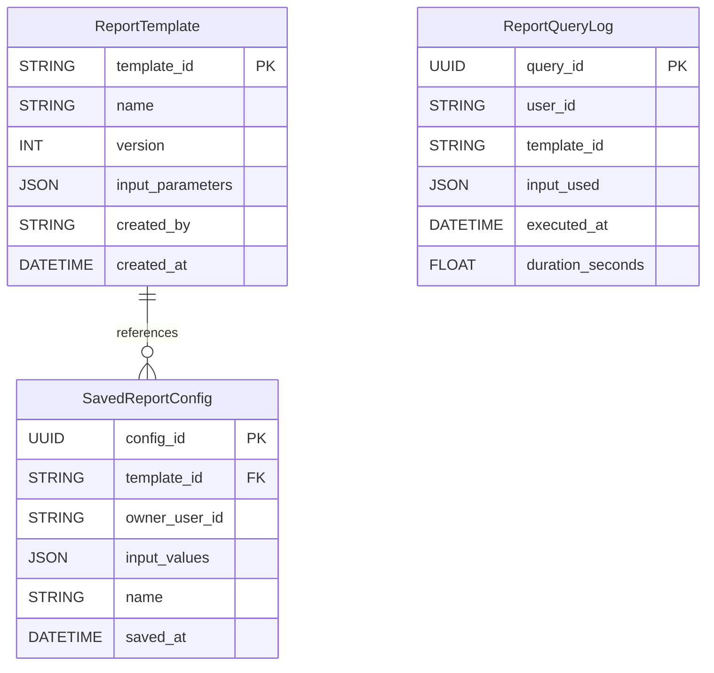
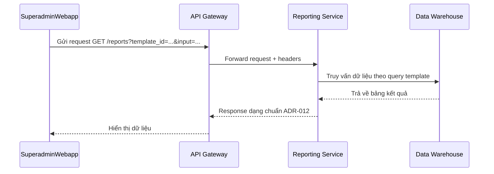
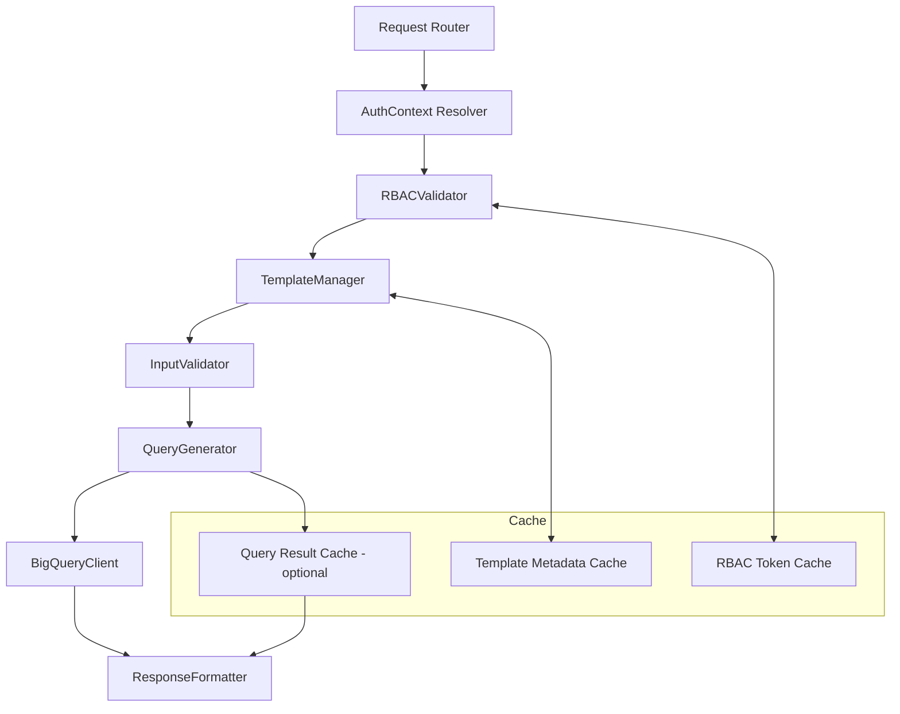

# 📘 Thiết kế chi tiết Reporting Service

---

## 1. 🧭 Phạm vi và Trách nhiệm (Scope & Responsibilities)

### 🎯 Mục tiêu

- Cung cấp hệ thống báo cáo tổng hợp cho Superadmin với khả năng tùy biến cao dựa trên các mẫu báo cáo được cấu hình.
- Truy vấn dữ liệu phân tích từ Data Warehouse (BigQuery) dựa trên template đã được định nghĩa và các tham số đầu vào.
- Quản lý vòng đời của Report Templates, hỗ trợ versioning và phân quyền chi tiết.

### 📦 Các thực thể dữ liệu quản lý

| Thực thể            | Mô tả                                                                 |
|---------------------|----------------------------------------------------------------------|
| ReportTemplate      | Mẫu báo cáo định nghĩa truy vấn và metadata, có versioning.          |
| SavedReportConfig   | Cấu hình báo cáo cụ thể mà người dùng đã lưu với tham số đầu vào.    |
| ReportQueryLog      | Log chi tiết các truy vấn thực hiện qua service (cho auditing/monitoring). |

⚠️ Service này không lưu dữ liệu thô, dữ liệu kết quả báo cáo hay dữ liệu phân tích – tất cả đến từ BigQuery.

### 🔒 Ngoài Phạm Vi (Out of Scope)

Service này **không** thực hiện các tác vụ sau:

- ❌ Lưu trữ dữ liệu phân tích gốc (do Data Warehouse đảm nhận).
- ❌ Trực tiếp truy cập các service như CRM, SIS, LMS.
- ❌ Sinh báo cáo thời gian thực từ dữ liệu giao dịch gốc.
- ❌ Gửi thông báo khi báo cáo hoàn thành (giao cho Notification Service).
- ❌ Phân tích AI hoặc ML trên dữ liệu (chuẩn bị cho giai đoạn sau).

---

## 2. 🌐 Thiết kế API chi tiết (Interface Contract)

| Method | Path                         | Tác vụ                                | Yêu cầu permission                   |
|--------|------------------------------|----------------------------------------|--------------------------------------|
| GET    | `/templates`                 | Danh sách Report Template              | ✅ `report.view_templates`           |
| POST   | `/templates`                 | Tạo template mới                       | ✅ `report.manage_templates`         |
| GET    | `/reports`                   | Lấy kết quả báo cáo (theo template + input) | ✅ `report.view_report`        |
| POST   | `/reports/save-config`       | Lưu cấu hình báo cáo cá nhân hóa       | ✅ `report.save_report_config`       |
| GET    | `/reports/saved-configs`     | Danh sách cấu hình đã lưu              | ✅ `report.view_report_config`       |

🔧 Tuân thủ: [ADR-011](../../ADR/adr-011-api-error-format.md), [ADR-012](../../ADR/adr-012-response-structure.md)

### 📦 Ví dụ response `GET /templates`

```json
{
  "data": [
    {
      "template_id": "fin-summary-001",
      "name": "Tổng hợp tài chính theo tháng",
      "version": 2,
      "input_parameters": [
        { "name": "month", "type": "string", "description": "Tháng báo cáo (MM-YYYY)" }
      ]
    }
  ],
  "meta": {
    "request_id": "req-123",
    "timestamp": "2025-06-04T10:30:00Z"
  }
}
```

---

## 3. 🗃️ Mô hình dữ liệu chi tiết (Data Model)


> **Chi tiết:** [Data Model](./data-model.md)

---

## 4. 🔄 Luồng xử lý nghiệp vụ chính (Business Logic Flows)

### Luồng: Sinh báo cáo theo template



---

## 5. 📣 Các sự kiện Pub/Sub (Events)

| Sự kiện nhận/phát    | Nguồn phát / Đích nhận | Hành động tại Service này                |
| -------------------- | ---------------------- | ---------------------------------------- |
| report.query\_logged | (Service này phát ra)  | Ghi log để phục vụ auditing và phân tích |

### 📦 Ví dụ Payload

```json
{
  "event_type": "report.query_logged",
  "data": {
    "template_id": "fin-summary-001",
    "user_id": "admin123",
    "input": { "month": "05-2025" },
    "duration": 2.45
  },
  "metadata": {
    "event_id": "evt-abc-123",
    "timestamp": "2025-06-04T10:30:00Z"
  }
}
```

---

## 6. 🔐 Bảo mật & Phân quyền chi tiết

### 6.1. Xác thực & Định danh

Reporting Service không xử lý xác thực trực tiếp, mà **nhận thông tin định danh từ API Gateway** thông qua các HTTP headers chuẩn:

| Header              | Mô tả                                      |
|---------------------|---------------------------------------------|
| `x-user-id`         | Mã định danh duy nhất của người dùng       |
| `x-tenant-id`       | Mã định danh tenant                        |
| `x-user-role`       | Vai trò hệ thống (`superadmin`, `staff`,...) |
| `x-auth-scope`      | Nếu dùng OAuth2/OIDC, thông tin scope token |

Tất cả các request phải đi qua Gateway và được xác thực trước đó bởi Auth Service.

---

### 6.2. Kiểm soát Truy cập (RBAC)

Mọi API trong Reporting Service **bắt buộc khai báo `x-required-permission` tại Gateway** (tuân thủ `ADR-007`), và Reporting Service **sẽ kiểm tra chi tiết** quyền truy cập theo logic sau:

| Hành động                       | `x-required-permission`                    |
|--------------------------------|--------------------------------------------|
| Truy vấn danh sách template    | `report.view_templates`                   |
| Tạo/sửa report template        | `report.manage_templates`                 |
| Sinh báo cáo từ template       | `report.view_report`                      |
| Lưu cấu hình báo cáo cá nhân   | `report.save_report_config`               |

#### 🎯 Chi tiết hóa kiểm soát nội bộ

Ngoài `x-required-permission`, hệ thống còn áp dụng:

- ✅ Kiểm tra `tenant_id` của template khớp với context người dùng
- ✅ Kiểm tra `owner_user_id` cho Saved Config để tránh truy cập chéo
- ✅ (Tùy chọn) Gắn permission riêng cho từng `template_id` trong metadata, cho phép RBAC theo báo cáo cụ thể

---

### 6.3. Masking thông tin đầu vào & Nhật ký truy vấn

- Trường `input_values` trong bảng `SavedReportConfig` hoặc event log sẽ được **mask một phần hoặc toàn bộ** nếu chứa thông tin nhạy cảm.
- Việc masking tuân thủ `ADR-024 - Data Anonymization & Retention`.
- Trường hợp ví dụ cần masking: mã số học sinh, số điện thoại, email...

---

### 6.4. Kiểm soát API Template độc hại

- Các query template được kiểm duyệt thủ công bởi Superadmin hoặc sử dụng trình kiểm tra định dạng query để tránh truy vấn tốn chi phí hoặc gây lỗi.
- Các API có cấu trúc động (như `/reports?template_id=...`) bắt buộc phải kiểm tra input theo `validation_rules` định nghĩa sẵn trong template.

---

## 7. ⚙️ Cấu hình & Biến môi trường

### 7.1. Các biến môi trường chính

| Biến môi trường             | Mô tả                                                                 |
|-----------------------------|------------------------------------------------------------------------|
| `ENV`                       | Môi trường triển khai (`development`, `staging`, `production`)        |
| `PORT`                      | Cổng service sẽ lắng nghe                                             |
| `BQ_PROJECT_ID`             | GCP project chứa BigQuery                                             |
| `BQ_DATASET_NAME`           | Tên dataset mặc định để query dữ liệu                                 |
| `TEMPLATE_STORAGE_BUCKET`  | GCS bucket dùng để lưu trữ template (nếu có dạng file)                |
| `PUBSUB_TOPIC_REPORT_LOG`   | Tên topic Pub/Sub để phát sự kiện sinh báo cáo                       |
| `REDIS_URI`                 | URI kết nối Redis (dùng để cache metadata template hoặc token RBAC)  |
| `JWT_PUBLIC_KEY_URL`        | URL đến public key dùng để xác thực JWT từ API Gateway               |
| `LOG_LEVEL`                 | Mức độ log (`DEBUG`, `INFO`, `WARNING`, `ERROR`)                     |
| `TRACING_ENABLED`           | Bật/tắt tracing (giám sát) với OpenTelemetry                         |
| `MAX_QUERY_TIMEOUT_SEC`     | Timeout tối đa cho mỗi truy vấn BigQuery                              |

---

### 7.2. Quản lý cấu hình runtime

Reporting Service sử dụng thư viện `dynaconf` (hoặc `pydantic.BaseSettings`) để load biến từ:

- ✅ `.env` file trong local dev
- ✅ Secret Manager (hoặc runtime Env Vars) trong production
- ✅ GCS config file (tùy chọn mở rộng trong tương lai)

---

### 7.3. Cấu hình cache

- Redis được dùng để cache:
  - ✅ Metadata các `Report Template`
  - ✅ Thông tin RBAC đã được resolve (token → permission list)
  - ✅ (Tùy chọn) Cached query result (nếu query đắt giá và lặp lại)
- TTL mặc định: 5–10 phút tùy loại, có thể cấu hình qua ENV

---

### 7.4. Cấu hình bảo vệ truy vấn

- Cấu hình giới hạn:
  - Thời gian tối đa thực thi truy vấn (configurable)
  - Kích thước tối đa result set
  - Số dòng tối đa cho export

---

## 8. 🧪 Chiến lược kiểm thử

### 8.1. Các lớp kiểm thử

Reporting Service được kiểm thử theo nhiều lớp để đảm bảo chất lượng và tính tin cậy:

| Lớp kiểm thử           | Mô tả                                                                 |
|------------------------|----------------------------------------------------------------------|
| Unit Test              | Kiểm thử từng hàm xử lý (template parser, RBAC validator, cache layer) |
| Integration Test       | Kiểm thử với BigQuery mock hoặc dataset thử nghiệm, kiểm tra end-to-end |
| Contract Test          | Kiểm thử tuân thủ Interface Contract và định dạng phản hồi (ADR-011/012) |
| RBAC Rule Test         | Kiểm tra việc từ chối truy cập nếu không có quyền phù hợp (403)        |
| Template Validation    | Kiểm tra logic kiểm soát `input_parameters`, `query_template`, `x-required-permission` |

---

### 8.2. Mô phỏng BigQuery & Pub/Sub

- ✅ Sử dụng `BigQuery Emulator` hoặc dataset test riêng (nếu emu không hỗ trợ đủ tính năng)
- ✅ Dùng thư viện `google-cloud-pubsub` với mock/subscription giả lập để kiểm thử fanout
- ✅ Redis sử dụng test instance hoặc `fakeredis` trong unit test

---

### 8.3. Kiểm thử Template động

- Bộ kiểm thử đặc biệt với nhiều mẫu template:
  - Với input thiếu, sai định dạng
  - Với query template lỗi cú pháp
  - Với quyền truy cập không đủ
  - Với input chứa dữ liệu nhạy cảm (để kiểm tra masking)

---

### 8.4. Báo cáo và Coverage

- Công cụ: `pytest`, `coverage`, `tox`
- Target coverage:
  - >90% cho logic business
  - 100% cho RBAC kiểm tra chéo
- Báo cáo coverage tích hợp trong GitHub Actions (workflow CI/CD)

---

### 8.5. Load Test (cho truy vấn phức tạp)

- Sử dụng `Locust` hoặc `k6` để mô phỏng truy vấn đồng thời từ Superadmin Webapp
- Kịch bản test bao gồm:
  - Truy vấn cùng lúc nhiều báo cáo có range lớn
  - Truy vấn với cấu hình filter phức tạp
  - Lặp lại truy vấn để test caching

---

## 9. 📈 Quan sát & Giám sát

### 9.1. Logging

- Tất cả truy vấn đến Reporting Service đều được log với các thông tin:
  - `user_id`, `tenant_id`, `template_id`, `query_duration`, `row_count`
  - `status`: `success`, `validation_error`, `permission_denied`, `bq_error`, ...
- Log định dạng JSON, tuân thủ `ADR-008 - Audit Logging`
- Log nhạy cảm sẽ được masking (tuân thủ `ADR-024`)
- Gửi log về Stackdriver Logging (GCP) hoặc ELK (tuỳ môi trường)

---

### 9.2. Metric & Monitoring

- Hệ thống xuất Prometheus metrics:
  | Metric                          | Nhãn                        | Mô tả                                              |
  |----------------------------------|------------------------------|----------------------------------------------------|
  | `report_query_duration_seconds` | `template_id`, `status`     | Thời gian truy vấn BigQuery                       |
  | `report_query_count_total`      | `status`, `template_id`     | Tổng số lần truy vấn                              |
  | `report_template_cache_hit`     | `template_id`               | Số lần cache metadata template được dùng          |
  | `report_result_cache_hit`       | `template_id`               | (tuỳ chọn) số lần kết quả query được dùng lại     |
  | `rbac_denied_total`             | `permission_code`           | Số lần bị từ chối do thiếu quyền truy cập         |

- Tích hợp với Grafana để giám sát realtime

---

### 9.3. Tracing

- Hỗ trợ OpenTelemetry (`trace_id`, `span_id`) gắn vào tất cả log và response
- Truy vết toàn bộ pipeline từ Superadmin → Gateway → Reporting Service → BigQuery

---

### 9.4. Alerting

- Các cảnh báo được cấu hình cho:
  - Truy vấn chậm bất thường
  - Tăng đột biến lỗi truy vấn hoặc lỗi quyền truy cập
  - Cache miss rate quá cao

- Cảnh báo được gửi qua Slack/Webhook, theo ngưỡng cấu hình

---

## 10. 🚀 Độ tin cậy & Phục hồi

### 10.1. Phân lớp lỗi & thông báo lỗi

- Mọi lỗi đều được chuẩn hóa theo định dạng `ADR-011`.
- Phân loại lỗi:
  - `400 Bad Request`: Input sai format, thiếu tham số
  - `403 Forbidden`: Không đủ quyền (RBAC)
  - `404 Not Found`: Template ID không tồn tại hoặc không thuộc quyền truy cập
  - `429 Too Many Requests`: Quá giới hạn truy vấn định kỳ
  - `500 Internal Error`: Lỗi hệ thống (BigQuery, Redis, etc.)

---

### 10.2. Khả năng phục hồi khi mất dịch vụ phụ trợ

| Thành phần phụ trợ | Phản ứng của hệ thống                                  |
|--------------------|----------------------------------------------------------|
| Redis              | Tự động reconnect. Nếu lỗi, fallback sang truy vấn gốc  |
| BigQuery           | Có retry strategy cho lỗi tạm thời. Ghi log nếu thất bại |
| GCS (template)     | Nếu DB lỗi, fallback sang bản cache GCS nếu có          |
| Pub/Sub            | Ghi đệm sự kiện và retry theo batch nếu mất kết nối     |

---

### 10.3. Xử lý tình huống truy vấn tốn tài nguyên

- Mỗi template đều có metadata để giới hạn:
  - Maximum bytes billed
  - Timeout per query
  - Số dòng kết quả trả về (limit)
- Kết hợp với caching để giảm tải khi nhiều người dùng truy vấn trùng nội dung

---

### 10.4. Kiểm soát tài nguyên & giới hạn truy cập

- Sử dụng token bucket rate limiter (tuỳ chọn, tích hợp tại Gateway)
- Truy vấn quá mức được trả về `429` và log lại

---

### 10.5. Graceful shutdown & Deployment safe

- Triển khai theo rolling update
- Kết hợp readiness probe để ngăn nhận request khi chưa sẵn sàng
- Ghi log mọi tình huống shutdown hoặc lỗi gói gọn trong `trace_id`

---

## 11. ⚡️ Hiệu năng & Mở rộng

### 11.1. Caching chiến lược

- **Metadata Caching (Redis):**
  - Các thông tin được cache:
    - Danh sách `report_templates`
    - Chi tiết `input_parameters` của mỗi template
    - RBAC token đã resolve (danh sách permission người dùng)
  - TTL: 5–10 phút, hoặc cache theo tenant

- **Query Result Caching (tuỳ chọn):**
  - Những báo cáo thường xuyên truy vấn lặp (theo tenant + template + input) sẽ được cache
  - TTL tùy theo tần suất truy cập, thường 60–300s

---

### 11.2. Scale ngang dễ dàng

- Reporting Service là **stateless**, dễ dàng scale bằng Kubernetes hoặc Cloud Run
- Redis và BigQuery đều hỗ trợ truy cập song song từ nhiều instance

---

### 11.3. Giới hạn truy vấn & quota

- Giới hạn kích thước dữ liệu có thể truy vấn mỗi lần (bytes billed)
- Giới hạn thời gian xử lý truy vấn
- Giới hạn số lượng dòng trả về
- Tùy chỉnh theo `template_type` hoặc gán theo `tier` của tenant

---

### 11.4. Horizontal sharding (tương lai)

- Khi số lượng tenant lớn, có thể tách template, config, audit log ra theo shard
- Có thể sử dụng BigQuery `dataset per tenant` hoặc filter trên trường `tenant_id`

---

### 11.5. Dự phòng sự cố (High Availability)

- Dữ liệu template có backup định kỳ trên GCS
- Health check Redis, Pub/Sub, BigQuery định kỳ để đảm bảo truy cập ổn định
- Cảnh báo real-time nếu tỷ lệ lỗi tăng hoặc thời gian truy vấn tăng bất thường

---

## 12. 🛠 Kế hoạch Triển khai & Migration

### 12.1. Giai đoạn 1 – MVP nội bộ

- ✅ Xây dựng core Reporting Service với API `/reports/query`, `/reports/templates`
- ✅ Sử dụng một số report template cố định (từ file JSON)
- ✅ Chạy truy vấn trên BigQuery test dataset
- ✅ Tích hợp với API Gateway, Superadmin Webapp (phiên bản thô)
- ✅ Logging truy vấn, RBAC cơ bản
- ⚠️ Chưa có caching hoặc template dynamic

---

### 12.2. Giai đoạn 2 – Dynamic Templates & Metadata

- ✅ Chuyển storage template sang Cloud SQL/PostgreSQL
- ✅ API `/reports/templates/:id` hoạt động với metadata động
- ✅ Cơ chế validate input + permission check động
- ✅ Redis caching cho template & RBAC
- ✅ Bổ sung audit log cho mỗi truy vấn (tuân theo ADR-008)

---

### 12.3. Giai đoạn 3 – Production-ready & Phân quyền nâng cao

- ✅ RBAC theo từng template (`x-required-permission`)
- ✅ Giao diện cấu hình & tạo template (trong Superadmin Webapp)
- ✅ API `/reports/saved-configs` (optional)
- ✅ Alert & dashboard monitoring
- ✅ Kịch bản retry/resilience/timeout hoàn thiện

---

### 12.4. Giai đoạn 4 – Tối ưu hóa & Chuẩn bị cho AI

- ✅ Chuẩn hóa metadata template theo ADR-029
- ✅ Index query performance trong BigQuery
- ✅ Cấu trúc schema dataset BigQuery cho AI agent dễ truy cập
- ✅ Export log + truy vấn ra GCS làm training data (nếu cần)
- ✅ Thử nghiệm AI Agent với một số câu hỏi truy vấn đơn giản

---

### 12.5. Migration dữ liệu

- ✅ Nếu trước đó có template dạng file JSON (static), viết tool migrate sang schema mới
- ✅ Đồng bộ từ GCS → PostgreSQL theo batch

---

## 13. 🧩 Kiến trúc Service

Reporting Service được thiết kế với các thành phần logic riêng biệt, theo hướng mô-đun hóa để đảm bảo dễ bảo trì và mở rộng. Dưới đây là sơ đồ tổng quát các module chính:



### Thành phần chi tiết

| Module                | Vai trò chính                                                                       |
| --------------------- | ----------------------------------------------------------------------------------- |
| `AuthContextResolver` | Trích xuất `user_id`, `tenant_id`, và `permissions` từ token JWT hoặc API Gateway   |
| `RBACValidator`       | Kiểm tra quyền truy cập dựa trên `x-required-permission` từ report template         |
| `TemplateManager`     | Tải template từ DB/cache, validate version và trạng thái active                     |
| `InputValidator`      | Kiểm tra `input_parameters` dựa trên schema template (type, format, required, etc.) |
| `QueryGenerator`      | Render SQL query từ `query_template` và `input_parameters` đã validate              |
| `BigQueryClient`      | Gửi truy vấn tới BigQuery, giới hạn chi phí/time, xử lý lỗi, retry                  |
| `ResponseFormatter`   | Chuẩn hóa kết quả trả về theo ADR-012, thêm metadata (trace\_id, timestamp)         |
| `CacheManager`        | Quản lý các lớp cache: permission, template metadata, query result (optional)       |

### Điểm mở rộng

* Các module có thể được gọi độc lập để phục vụ các API khác nhau (`/query`, `/templates`, `/validate`, v.v.)
* Cấu trúc module tách biệt cho phép dễ dàng viết unit test và mock từng phần
* Các bước xử lý đều sinh `trace_id` và log chi tiết để phục vụ observability

---

## 14. 📚 Tài liệu liên quan

* [Interface Contract](./interface-contract.md)
* [Data Model](./data-model.md)
* [OpenAPI Spec](./openapi.yaml)
* [ADR-006 - Auth Strategy](../../../ADR/adr-006-auth-strategy.md)
* [ADR-007 - RBAC](../../../ADR/adr-007-rbac.md)
* [ADR-008 - Audit Logging](../../../ADR/adr-008-audit-logging.md)
* [ADR-011 - API Error Format](../../../ADR/adr-011-api-error-format.md)
* [ADR-012 - Response Structure](../../../ADR/adr-012-response-structure.md)
* [ADR-024 - Data Anonymization & Retention](../../../ADR/adr-024-data-anonymization-retention.md)
* [ADR-028 - Reporting Architecture](../../../ADR/adr-028-reporting-architecture.md)
* [ADR-029 - Report Template Schema](../../../ADR/adr-029-report-template-schema.md)
* [ADR-030 - Event Schema Governance](../../../ADR/adr-030-event-schema-governance.md)
