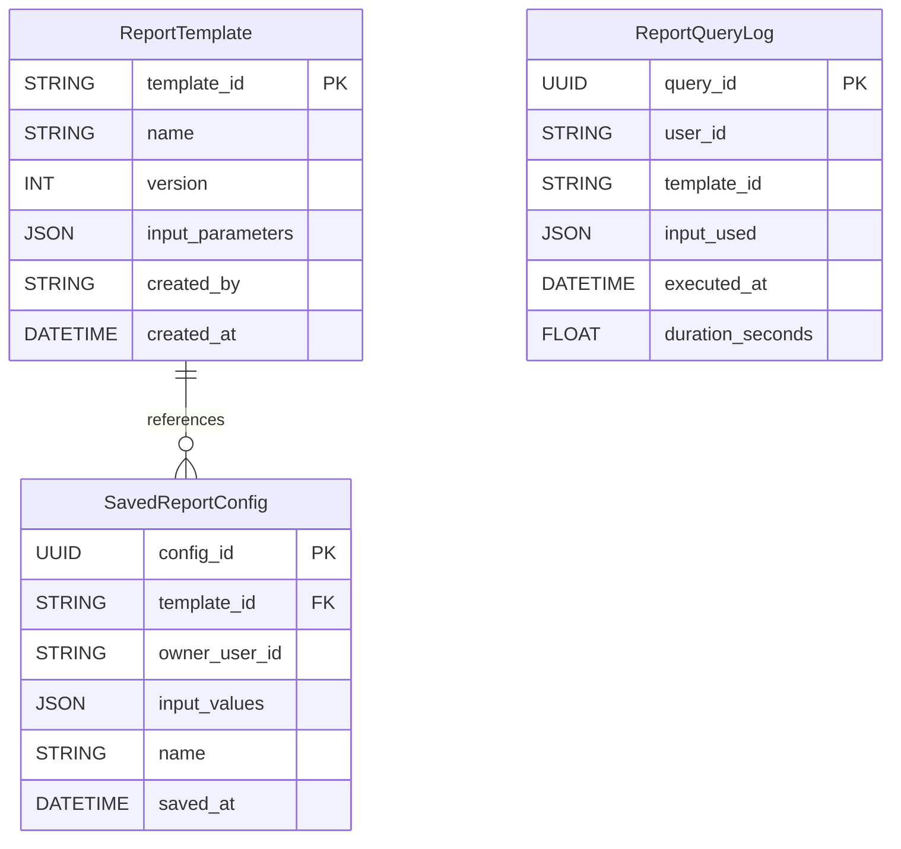
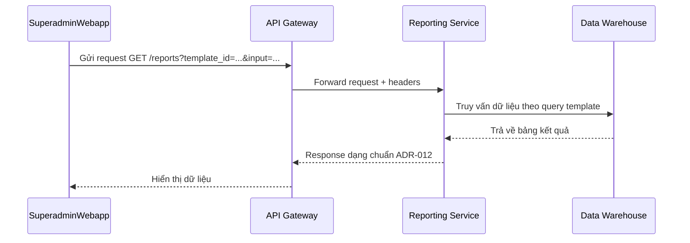

# 📘 Thiết kế chi tiết Reporting Service

```

title: Thiết kế chi tiết Reporting Service
version: "1.0"
last\_updated: "2025-06-04"
author: "dx-vas core team"
reviewed\_by: "Bill Nguyen"

````

---

## 1. 🧭 Phạm vi và Trách nhiệm (Scope & Responsibilities)

### 🎯 Mục tiêu

- Cung cấp hệ thống báo cáo tổng hợp cho Superadmin với khả năng tùy biến cao dựa trên các mẫu báo cáo được cấu hình.
- Truy vấn dữ liệu phân tích từ Data Warehouse (BigQuery) dựa trên template đã được định nghĩa và các tham số đầu vào.
- Quản lý vòng đời của Report Templates, hỗ trợ versioning và phân quyền chi tiết.

### 📦 Các thực thể dữ liệu quản lý

| Thực thể            | Mô tả                                                                 |
|---------------------|----------------------------------------------------------------------|
| ReportTemplate      | Mẫu báo cáo định nghĩa truy vấn và metadata, có versioning.          |
| SavedReportConfig   | Cấu hình báo cáo cụ thể mà người dùng đã lưu với tham số đầu vào.    |
| ReportQueryLog      | Log chi tiết các truy vấn thực hiện qua service (cho auditing/monitoring). |

⚠️ Service này không lưu dữ liệu thô, dữ liệu kết quả báo cáo hay dữ liệu phân tích – tất cả đến từ BigQuery.

### 🔒 Ngoài Phạm Vi (Out of Scope)

Service này **không** thực hiện các tác vụ sau:

- ❌ Lưu trữ dữ liệu phân tích gốc (do Data Warehouse đảm nhận).
- ❌ Trực tiếp truy cập các service như CRM, SIS, LMS.
- ❌ Sinh báo cáo thời gian thực từ dữ liệu giao dịch gốc.
- ❌ Gửi thông báo khi báo cáo hoàn thành (giao cho Notification Service).
- ❌ Phân tích AI hoặc ML trên dữ liệu (chuẩn bị cho giai đoạn sau).

---

## 2. 🌐 Thiết kế API chi tiết (Interface Contract)

| Method | Path                         | Tác vụ                                | Yêu cầu permission                   |
|--------|------------------------------|----------------------------------------|--------------------------------------|
| GET    | `/templates`                 | Danh sách Report Template              | ✅ `report.view_templates`           |
| POST   | `/templates`                 | Tạo template mới                       | ✅ `report.manage_templates`         |
| GET    | `/reports`                   | Lấy kết quả báo cáo (theo template + input) | ✅ `report.view_report`        |
| POST   | `/reports/save-config`       | Lưu cấu hình báo cáo cá nhân hóa       | ✅ `report.save_report_config`       |
| GET    | `/reports/saved-configs`     | Danh sách cấu hình đã lưu              | ✅ `report.view_report_config`       |

🔧 Tuân thủ: [ADR-011](../../../ADR/adr-011-api-error-format.md), [ADR-012](../../../ADR/adr-012-response-structure.md)

### 📦 Ví dụ response `GET /templates`

```json
{
  "data": [
    {
      "template_id": "fin-summary-001",
      "name": "Tổng hợp tài chính theo tháng",
      "version": 2,
      "input_parameters": [
        { "name": "month", "type": "string", "description": "Tháng báo cáo (MM-YYYY)" }
      ]
    }
  ],
  "meta": {
    "request_id": "req-123",
    "timestamp": "2025-06-04T10:30:00Z"
  }
}
````

---

## 3. 🗃️ Mô hình dữ liệu chi tiết (Data Model)



---

## 4. 🔄 Luồng xử lý nghiệp vụ chính (Business Logic Flows)

### Luồng: Sinh báo cáo theo template



---

## 5. 📣 Các sự kiện Pub/Sub (Events)

| Sự kiện nhận/phát    | Nguồn phát / Đích nhận | Hành động tại Service này                |
| -------------------- | ---------------------- | ---------------------------------------- |
| report.query\_logged | (Service này phát ra)  | Ghi log để phục vụ auditing và phân tích |

### 📦 Ví dụ Payload

```json
{
  "event_type": "report.query_logged",
  "data": {
    "template_id": "fin-summary-001",
    "user_id": "admin123",
    "input": { "month": "05-2025" },
    "duration": 2.45
  },
  "metadata": {
    "event_id": "evt-abc-123",
    "timestamp": "2025-06-04T10:30:00Z"
  }
}
```
