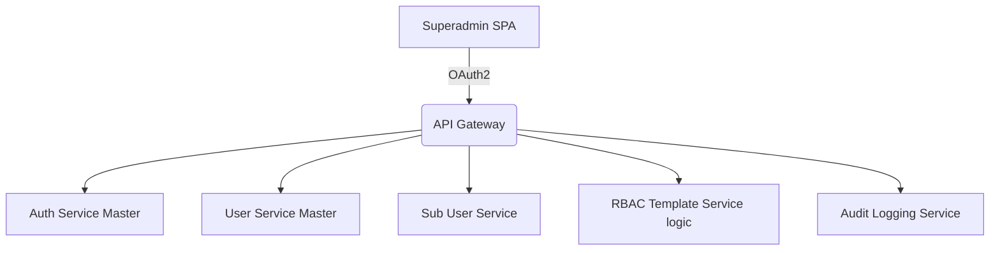

# 📘 Thiết kế chi tiết Superadmin Webapp

```
title: Thiết kế chi tiết superadmin-webapp
description: Service Design Document cho SPA quản trị hệ thống VAS DX
version: 1.0
author: DX VAS Team
last_updated: 2025-06-03
reviewed_by: Stephen Le
```

## 1. 🧭 Phạm vi và Trách nhiệm (Scope & Responsibilities)

Superadmin Webapp là một **Single Page Application (SPA)** dành riêng cho **ban quản trị hệ thống VAS DX**, dùng để:

- Tạo và cấu hình tenant mới.
- Quản lý người dùng toàn cục (`user-service/master`).
- Gán user vào tenant và vai trò tương ứng (`sub-user-service`).
- Quản lý template role & permission (`rbac-deep-dive.md`).
- Theo dõi audit log, trạng thái đồng bộ, hệ thống (`audit-logging`, `adr-008`, `adr-021`).

> Tuân thủ nghiêm ngặt [ADR-006 Auth Strategy], [ADR-007 RBAC], [ADR-013 Path Naming], [ADR-012 Response Structure], [ADR-011 API Error Format], [ADR-027 Data Strategy], và các ADR liên quan.

## 2. 🏗️ Thành phần Kiến trúc (Architecture Overview)



- SPA triển khai frontend hoàn toàn static, giao tiếp qua API Gateway
- Xác thực OAuth2 qua Google (theo ADR-006)
- Phân quyền động dựa trên RBAC template (theo ADR-007)
- Giao diện sử dụng TailwindCSS + Vue/React + AuthContext

## 3. 🔍 Các Tính năng Chính (Functional Specs)

### 3.1. Quản lý Tenant
- Tạo mới tenant (POST /tenants)
- Bật/tắt tenant, cấu hình `subdomain`, giới hạn người dùng

### 3.2. Quản lý User Global
- Tra cứu user toàn cục (`GET /users-global`)
- Gán user vào tenant (`POST /user-tenant-assignments`)
- Gỡ user khỏi tenant (`DELETE /user-tenant-assignments`)

### 3.3. Quản lý RBAC Template
- Tạo/sửa/xoá role template (`POST /rbac/templates/roles`...)
- Gán permission cho role (`PATCH /rbac/templates/roles/:id`)
- Quản lý permission template (`POST /rbac/templates/permissions`...)

### 3.4. Theo dõi hoạt động & đồng bộ
- Xem audit log theo người dùng, hành động, service (`GET /audit-logs`)
- Kiểm tra trạng thái đồng bộ sub-service (`GET /sync-status`)

### 3.5. Thiết lập hệ thống
- Cấu hình OAuth2 Providers (`GET/POST /auth/providers`)
- Quản lý domain, redirect, email system

## 4. 🔐 Bảo mật & Phân quyền

- Xác thực: OAuth2 Google (ADR-006), toàn bộ SPA yêu cầu login
- Phân quyền: theo RBAC Template từ `user-service/master` với permission như:
  - `system.manage_tenant`
  - `system.manage_rbac_template`
  - `system.view_audit_log`

## 5. 🧪 Kiểm thử & Đảm bảo chất lượng

| Loại kiểm thử        | Công cụ                | Ghi chú                                    |
|----------------------|------------------------|---------------------------------------------|
| Unit Test            | Vitest/Jest            | Kiểm thử từng component + logic permission |
| Integration Test     | Cypress / Playwright   | Kiểm thử end-to-end qua API Gateway        |
| Accessibility Test   | axe-core + Lighthouse  | Tuân thủ WCAG AA                           |
| Contract Test        | Dredd + OpenAPI        | Kiểm tra đúng cấu trúc response            |
| Load Test (UI)       | k6 + Puppeteer         | Mô phỏng 500 user login                    |

## 6. 📈 Observability & Audit

- **Audit Events:** `tenant_created`, `user_assigned`, `role_template_updated` (ADR-008)
- **Frontend Log:** error boundary + Sentry/LogRocket
- **Metrics:** route time, error count, login success rate

## 7. 🚀 Triển khai & CI/CD

- Triển khai trên Netlify/Vercel hoặc Nginx SPA hosting
- CI: kiểm thử + lint + kiểm tra accessibility (GitHub Actions)
- CD: push to main → build & deploy tự động

## 8. 🧩 Phụ lục: Các Tài liệu Liên quan

- [ADR-006 - Auth Strategy](../../../ADR/adr-006-auth-strategy.md)
- [ADR-007 - RBAC](../../../ADR/adr-007-rbac.md)
- [ADR-011 - Error Format](../../../ADR/adr-011-api-error-format.md)
- [ADR-012 - Response Structure](../../../ADR/adr-012-response-structure.md)
- [ADR-027 - Data Strategy](../../../ADR/adr-027-data-management-strategy.md)
- [rbac-deep-dive.md](../../rbac-deep-dive.md)
- [system-diagrams.md](../../system-diagrams.md)
- [user-service/master/design.md](../../user-service/master/design.md)
- [auth-service/master/design.md](../../auth-service/master/design.md)
