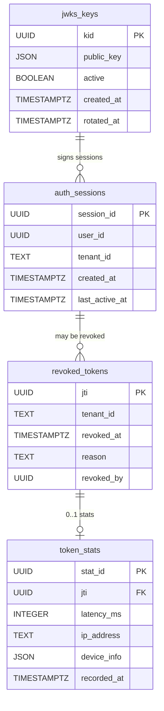
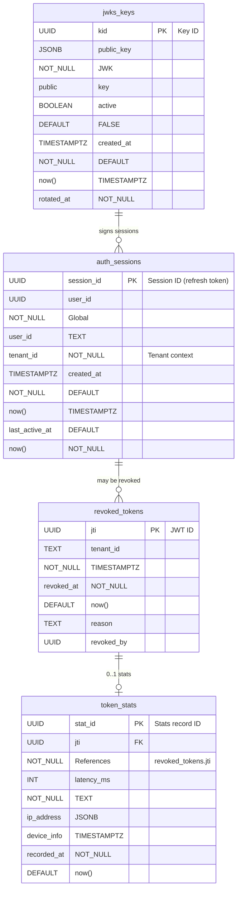

# 🗃️ Token Service - Data Model

<!-- toc -->

> **Token Service** là thành phần trung tâm trong kiến trúc DX-VAS, chịu trách nhiệm quản lý các dữ liệu sau:
> - **JWKS keys** (`jwks_keys`) – lưu metadata key để API Gateway xác thực JWT offline (RS256) theo ADR-006.  
> - **Auth sessions** (`auth_sessions`) – session_id, user_id, tenant_id, TTL refresh token.  
> - **Revoked tokens** (`revoked_tokens`) – jti, tenant_id, revoked_at, reason (CR-03).  
> - **Token stats** (`token_stats`) – latency, ip_address, device, chỉ khi `enable_token_stats=true`.  

---

## 1. Phạm vi Dữ liệu Quản lý (Scope)

**Token Service** quản lý dữ liệu liên quan đến luồng phát hành, thu hồi và introspect JWT, bao gồm:
- Cấu hình và metadata JWKS.
- Lịch sử phiên (session) cho refresh token.
- Danh sách token đã bị thu hồi để chặn offline.
- Thống kê (tuỳ chọn) cho mỗi token (latency, IP, v.v.).

## 2. Ngoài Phạm Vi (Out of Scope)

**Token Service** **không** quản lý:
- ❌ Thông tin người dùng / role / permission (thuộc User Service).  
- ❌ Dữ liệu SMS / Email (thuộc Notification Service).  
- ❌ Lịch sử audit chi tiết ngoài các sự kiện token.*.v1 (đã publish Pub/Sub).

## 3. Mục tiêu của Tài liệu Mô hình Dữ liệu

- Mô tả chi tiết cấu trúc bảng phục vụ Issuance, Revocation, Introspection.  
- Thể hiện rõ ràng ràng buộc PK/FK, index, ENUM (nếu có).  
- Đảm bảo tuân thủ các ADR quan trọng:  
  - ADR-023 (Schema Migration Strategy)  
  - ADR-024 (Data Anonymization & Retention)  
  - ADR-026 (Hard Delete Policy)  

---

## 4. Sơ đồ ERD (Entity Relationship Diagram)

**Sơ đồ sơ bộ**



> **Chú thích:**
>
> * `revoked_tokens → token_stats` là quan hệ 1-to-0..1 (một revoke có thể không có stat).
> * `jwks_keys.active` chỉ one-hot active key; các key cũ giữ để verify until TTL.


**Sơ đồ ERD chi tiết**



> **Chú thích & Best Practices**
>
> * **Cardinality**
>
>   * `jwks_keys (1) → auth_sessions (0..*)` – một key có thể sign nhiều phiên.
>   * `auth_sessions (1) → revoked_tokens (0..*)` – không phải mọi session đều bị revoke.
>   * `revoked_tokens (1) → token_stats (0..1)` – stats chỉ sinh khi `enable_token_stats=true`.
> * **Indexes**
>
>   * `jwks_keys(active)` for fast lookup of current key.
>   * `auth_sessions(user_id, tenant_id)` for session validation.
>   * `revoked_tokens(tenant_id)` để Gateway check revoked nhanh.
> * **Retention & Delete**
>
>   * `jwks_keys`: giữ 30 ngày sau rotation → Cron purge (ADR-024/026).
>   * `revoked_tokens`: TTL 30d → auto-purge (ADR-024/026).
>   * `token_stats`: TTL 90d → anonymize & delete (ADR-024).

---

## 5. Chi tiết Từng Bảng

### 5.1 Bảng `jwks_keys`

```sql
CREATE TABLE jwks_keys (
  kid UUID PRIMARY KEY,
  public_key JSONB NOT NULL,
  active BOOLEAN NOT NULL DEFAULT FALSE,
  created_at TIMESTAMPTZ NOT NULL DEFAULT now(),
  rotated_at TIMESTAMPTZ
);
```

| Cột          | Kiểu dữ liệu  | Ràng buộc     | Default | Mô tả                              |
| ------------ | ------------- | ------------- | ------- | ---------------------------------- |
| `kid`        | `UUID`        | `PRIMARY KEY` |         | Key ID, khớp JWT header `kid`      |
| `public_key` | `JSONB`       | `NOT NULL`    |         | JWK Public Key                     |
| `active`     | `BOOLEAN`     | `NOT NULL`    | `FALSE` | True nếu đang dùng để verify       |
| `created_at` | `TIMESTAMPTZ` | `NOT NULL`    | `now()` | Thời điểm tạo key                  |
| `rotated_at` | `TIMESTAMPTZ` |               |         | Thời điểm key được rotate lần cuối |

#### Indexes & Constraints

* **Primary Key:** `pk_jwks_keys` on `(kid)`
* **Unique Constraint:** `uq_jwks_keys_active` on `(active)` – chỉ một key được active tại một thời điểm
* **B-tree Index:** `idx_jwks_created_at` on `(created_at)` – tối ưu truy vấn key mới nhất

### 5.2 Bảng `auth_sessions`

```sql
CREATE TABLE auth_sessions (
  session_id UUID PRIMARY KEY,
  user_id UUID NOT NULL,
  tenant_id TEXT NOT NULL,
  created_at TIMESTAMPTZ NOT NULL DEFAULT now(),
  last_active_at TIMESTAMPTZ NOT NULL DEFAULT now()
);
```

| Cột              | Kiểu dữ liệu  | Ràng buộc     | Default | Mô tả                               |
| ---------------- | ------------- | ------------- | ------- | ----------------------------------- |
| `session_id`     | `UUID`        | `PRIMARY KEY` |         | ID phiên dùng cho refresh token     |
| `user_id`        | `UUID`        | `NOT NULL`    |         | `user_id_global` từ User Service    |
| `tenant_id`      | `TEXT`        | `NOT NULL`    |         | Tenant context                      |
| `created_at`     | `TIMESTAMPTZ` | `NOT NULL`    | `now()` | Thời điểm phiên được tạo            |
| `last_active_at` | `TIMESTAMPTZ` | `NOT NULL`    | `now()` | Thời điểm phiên hoạt động cuối cùng |

#### Indexes & Constraints

* **Primary Key:** `pk_auth_sessions` trên (`session_id`)
* **B-tree Index:** `idx_auth_sessions_user_tenant` trên (`user_id`, `tenant_id`) – tối ưu lookup session theo user & tenant
* **B-tree Index:** `idx_auth_sessions_last_active` trên (`last_active_at`) – hỗ trợ purge phiên cũ và thống kê session còn sống

### 5.3 Bảng `revoked_tokens`

```sql
CREATE TABLE revoked_tokens (
  jti UUID PRIMARY KEY,
  tenant_id TEXT NOT NULL,
  revoked_at TIMESTAMPTZ NOT NULL DEFAULT now(),
  reason TEXT,
  revoked_by UUID
);
```

| Cột          | Kiểu dữ liệu  | Ràng buộc     | Default | Mô tả                              |
| ------------ | ------------- | ------------- | ------- | ---------------------------------- |
| `jti`        | `UUID`        | `PRIMARY KEY` |         | JWT ID để thu hồi (claim `jti`)    |
| `tenant_id`  | `TEXT`        | `NOT NULL`    |         | Tenant context                     |
| `revoked_at` | `TIMESTAMPTZ` | `NOT NULL`    | `now()` | Thời điểm token bị thu hồi         |
| `reason`     | `TEXT`        |               |         | Lý do (`logout`, `rotation`, v.v.) |
| `revoked_by` | `UUID`        |               |         | ID người/thực thể thực hiện revoke |

#### Indexes & Constraints

* **Primary Key:** `pk_revoked_tokens` trên (`jti`)
* **B-tree Index:** `idx_revoked_tokens_tenant_revoked_at` trên (`tenant_id`, `revoked_at`) – tối ưu truy vấn và purge theo tenant & thời gian
* **Check Constraint:** `chk_revoked_tokens_reason` CHECK (`reason` IN ('logout','rotation','breach','expired'))

### 5.4 Bảng `token_stats`

```sql
CREATE TABLE token_stats (
  stat_id UUID PRIMARY KEY,
  jti UUID NOT NULL REFERENCES revoked_tokens(jti) ON DELETE CASCADE,
  latency_ms INTEGER NOT NULL,
  ip_address TEXT,
  device_info JSONB,
  recorded_at TIMESTAMPTZ NOT NULL DEFAULT now()
);
```

| Cột           | Kiểu dữ liệu  | Ràng buộc                              | Default | Mô tả                                             |
| ------------- | ------------- | -------------------------------------- | ------- | ------------------------------------------------- |
| `stat_id`     | `UUID`        | `PRIMARY KEY`                          |         | ID bản ghi thống kê                               |
| `jti`         | `UUID`        | `NOT NULL`, FK → `revoked_tokens(jti)` |         | Tham chiếu tới token đã bị thu hồi                |
| `latency_ms`  | `INTEGER`     | `NOT NULL`                             |         | Thời gian (ms) thực hiện issuance/revoke          |
| `ip_address`  | `TEXT`        |                                        |         | Địa chỉ IP client                                 |
| `device_info` | `JSONB`       |                                        |         | Thông tin thiết bị (type, user\_agent, phiên bản) |
| `recorded_at` | `TIMESTAMPTZ` | `NOT NULL`                             | `now()` | Thời điểm ghi nhận thống kê                       |

#### Indexes & Constraints

* **Primary Key:** `pk_token_stats` trên (`stat_id`)
* **Foreign Key:** `fk_token_stats_revoked`

  ```sql
  ALTER TABLE token_stats
    ADD CONSTRAINT fk_token_stats_revoked
      FOREIGN KEY (jti) REFERENCES revoked_tokens(jti) ON DELETE CASCADE;
  ```
* **B-tree Index:** `idx_token_stats_jti_recorded` trên (`jti`, `recorded_at`) – tối ưu lookup stats cho mỗi token và purge theo thời gian

---

## 6. Indexes & Constraints

Để đảm bảo hiệu năng truy vấn và tính toàn vẹn dữ liệu, mỗi bảng trong Token Service được trang bị các chỉ mục (index) và ràng buộc (constraint) như sau:

| Bảng              | Tên Index / Constraint           | Loại              | Định nghĩa                                           | Mục đích                                                            |
|-------------------|----------------------------------|-------------------|------------------------------------------------------|---------------------------------------------------------------------|
| **jwks_keys**     | `pk_jwks_keys`                   | Primary Key       | `(kid)`                                              | Đảm bảo `kid` là duy nhất, dùng làm PK                              |
|                   | `uq_jwks_keys_active`            | Unique Constraint | `(active)`                                           | Chỉ một public key được đánh dấu `active = TRUE`                   |
|                   | `idx_jwks_created_at`            | B-tree Index      | `(created_at)`                                       | Tìm key mới nhất khi rotate                                         |
| **auth_sessions** | `pk_auth_sessions`               | Primary Key       | `(session_id)`                                       | Định danh phiên                                                   |
|                   | `idx_auth_sessions_user_tenant`  | B-tree Index      | `(user_id, tenant_id)`                               | Lookup sessions theo người dùng & tenant                            |
|                   | `idx_auth_sessions_last_active`  | B-tree Index      | `(last_active_at)`                                   | Xóa session cũ, thống kê session còn “sống”                        |
| **revoked_tokens**| `pk_revoked_tokens`              | Primary Key       | `(jti)`                                              | Định danh token bị thu hồi                                         |
|                   | `idx_revoked_tokens_tenant_at`   | B-tree Index      | `(tenant_id, revoked_at)`                            | Tìm tokens đã thu hồi theo tenant và thời gian, tối ưu purge job   |
|                   | `chk_revoked_tokens_reason`      | Check Constraint  | `reason IN ('logout','rotation','breach','expired')` | Giới hạn giá trị `reason` theo ENUM                               |
| **token_stats**   | `pk_token_stats`                 | Primary Key       | `(stat_id)`                                          | Định danh record thống kê                                          |
|                   | `fk_token_stats_revoked_tokens`  | Foreign Key       | `(jti) REFERENCES revoked_tokens(jti) ON DELETE CASCADE` | Đảm bảo mỗi stat liên kết tới một revoked token                  |
|                   | `idx_token_stats_jti_recorded`   | B-tree Index      | `(jti, recorded_at)`                                 | Lookup stats cho một token và purge theo thời gian                |

### Chi tiết & Best Practices

- **Primary Key & Unique**:  
  - PK đặt trên cột định danh duy nhất (`kid`, `session_id`, `jti`, `stat_id`).  
  - Unique cho `jwks_keys.active` để chỉ 1 key được active.

- **B-tree Index**:  
  - Dùng cho cột thường xuyên filter/sort: `created_at`, `last_active_at`, `revoked_at`, `recorded_at`.  
  - Composite index `(user_id, tenant_id)` giúp tìm session theo tenant nhanh.

- **Check Constraint**:  
  - Sử dụng `CHECK` để validate ENUM-like (`reason`), không phụ thuộc ENUM type DB, giữ tính di động.

- **Foreign Key**:  
  - `token_stats.jti` tham chiếu `revoked_tokens.jti` với `ON DELETE CASCADE` để tự cleanup stats khi token bị xóa.

- **Retention & Purge**:  
  - Các cron/job purge dựa trên chỉ mục `(tenant_id, revoked_at)` và `(jti, recorded_at)` để xóa dữ liệu quá hạn nhanh.

> Các tên index/constraint tuân chuẩn **5★ Data Model Standard**: có prefix tương ứng bảng, rõ ràng loại index, dễ tra cứu khi debugging và tuning.

---

## 7. Chính sách Lưu trữ & Xóa Dữ liệu

> Tuân theo ADR-024 (Data Anonymization & Retention) và ADR-026 (Hard-Delete Policy), mọi dữ liệu cũ đều được xóa hoặc ẩn danh theo TTL định sẵn.

### 7.1 TTL & Job Purge

| Bảng               | TTL                              | Job                           | Tần suất   | Hành động                                                         |
|--------------------|----------------------------------|-------------------------------|------------|-------------------------------------------------------------------|
| `jwks_keys`        | 30 ngày kể từ `rotated_at`       | `purge_jwks_keys`             | Hàng ngày 02:00 UTC | `DELETE FROM jwks_keys WHERE rotated_at < now() - INTERVAL '30 days';` |
| `auth_sessions`    | 14 ngày kể từ `last_active_at`   | `purge_auth_sessions`         | Hàng giờ   | `DELETE FROM auth_sessions WHERE last_active_at < now() - INTERVAL '14 days';` |
| `revoked_tokens`   | 30 ngày kể từ `revoked_at`       | `purge_revoked_tokens`        | Hàng ngày 03:00 UTC | `DELETE FROM revoked_tokens WHERE revoked_at < now() - INTERVAL '30 days';` |
| `token_stats`      | 90 ngày kể từ `recorded_at`      | `anonymize_token_stats` & `purge_token_stats` | Hàng ngày 04:00 UTC | 1) `UPDATE token_stats SET ip_address = NULL, device_info = NULL WHERE recorded_at < now() - INTERVAL '90 days';`<br>2) `DELETE FROM token_stats WHERE recorded_at < now() - INTERVAL '90 days';` |

### 7.2 Audit & Event Notification

- Mỗi job purge/anonymize ghi vào bảng `audit_log.purge_history` (schema v1: `resource`, `deleted_count`, `run_at`, `initiator='system'`).  
- Sau khi hoàn thành, phát sự kiện **`data.purged.v1`** lên Pub/Sub topic `data.v1` với payload:
```json
  {
    "event": "data.purged.v1",
    "resource": "revoked_tokens",
    "deleted_count": 12345,
    "timestamp": "2025-06-09T02:00:00Z"
  }
```

### 7.3 Hard-Delete & Rollback

* **Hard-Delete**: Không có cơ chế soft-delete—dữ liệu vượt TTL bị xóa vĩnh viễn.
* **Undo Migration**: Nếu cần khôi phục, sử dụng Flyway `U20250617__recreate_revoked_tokens.sql` (ADR-023).

### 7.4 Kiểm soát & Giám sát

* Job purge/anonymize phải log metric:

  * `purge_revoked_tokens_count`
  * `purge_auth_sessions_count`
  * `anonymize_token_stats_count`
* Alert nếu job thất bại hoặc `deleted_count = 0` bất thường (kịch bản dữ liệu quá nhiều hoặc quá ít).

---

## 8. Data Synchronization & Events

> **Mục tiêu** – Phát hành **sự kiện bất đồng bộ** để các thành phần khác (API Gateway, Audit Service, Monitoring) nhận biết ngay thay đổi liên quan JWT, đồng thời đảm bảo **đồng nhất** và **có thể mở rộng** theo ADR-030.

---

### 8.1 Pub/Sub Topic & Event Names

- **Topic chung**: `token.v1`  
- **Tên sự kiện** (theo ADR-030 – Event Schema Governance):  
  - `token.issued.v1`  
  - `token.revoked.v1`  
  - `token.introspect_fail.v1`  

> *Mỗi event có attribute `tenant_id`, dùng để **filter** fan-out tới các subscription.*

---

### 8.2 JSON Schema & Registry

| Event                            | Schema ID              | Ghi chú                         |
|----------------------------------|------------------------|---------------------------------|
| `token_issued_v1`                | `token_issued_v1`      | Invariants: `jti`, `session_id` |
| `token_revoked_v1`               | `token_revoked_v1`     | Invariants: `jti`, `revoked_by` |
| `token_introspect_fail_v1`       | `token_introspect_fail_v1` | Invariants: `token`, `error`    |

Schemas được lưu trong **Schema Registry** (backward-compatible ≥ 6 tháng).

---

### 8.3 Payload Examples

#### 8.3.1 `token.issued.v1`

```json
{
  "event": "token.issued.v1",
  "timestamp": "2025-06-09T08:00:00Z",
  "tenant_id": "school-xyz",
  "user_id": "user-123",
  "jti": "uuid-abc-123",
  "session_id": "sess-456-def",
  "ip_address": "203.0.113.5",
  "device": {
    "type": "web",
    "user_agent": "Mozilla/5.0"
  }
}
```

#### 8.3.2 `token.revoked.v1`

```json
{
  "event": "token.revoked.v1",
  "timestamp": "2025-06-09T09:15:30Z",
  "tenant_id": "school-xyz",
  "user_id": "user-123",
  "jti": "uuid-abc-123",
  "revoked_by": "admin-789",
  "reason": "logout",
  "ip_address": "203.0.113.5"
}
```

#### 8.3.3 `token.introspect_fail.v1`

```json
{
  "event": "token.introspect_fail.v1",
  "timestamp": "2025-06-09T09:16:00Z",
  "tenant_id": "school-xyz",
  "token": "eyJhbGciOiJSUzI1NiIs…",
  "error": {
    "code": "token.revoked",
    "message": "Token đã bị thu hồi"
  }
}
```

---

### 8.4 Consumers & Subscriptions

| Subscriber             | Subscription ID     | Xử lý chính                                           |
| ---------------------- | ------------------- | ----------------------------------------------------- |
| **API Gateway**        | `sub-token-revoked` | Xoá cache `revoked:{jti}` khi nhận `token.revoked.v1` |
| **Audit Logging**      | `sub-token-audit`   | Ghi log event vào bảng `audit_log.token_events`       |
| **Monitoring Service** | `sub-token-monitor` | Tính metrics - hit/miss, latency, fail rates          |

* **Filter**: subscription lọc attribute `tenant_id` để phân vùng riêng cho mỗi tenant.

---

### 8.5 Delivery Semantics & Ordering

* **At-least-once** delivery, idempotent consumers.
* **Ordering**: Pub/Sub đảm bảo ordering trong cùng `orderingKey=tenant_id`.
* **Retries**: DLQ (Dead-Letter Queue) cho event thất bại sau 5 lần xử lý.

---

### 8.6 Governance & Versioning

* Mỗi event tích hợp field `schema_version` (mặc định = 1).
* Khi schema thay đổi, tăng suffix: `token.issued.v2`, giữ backward-compat trong ≥ 6 tháng.
* Theo ADR-030, mọi consumer phải kiểm tra `schema_version` trước khi deserialize.

---

## 9. Data Access Control

> **Mục tiêu** – Đảm bảo chỉ **Token Service** và các thành phần đã xác thực mới được phép truy cập dữ liệu, tuân **principle of least privilege** và tuân chuẩn bảo mật mạng/Dữ liệu.

### 9.1 Authentication & Database Users

- **Cloud SQL IAM Authentication**  
  - Admin sử dụng IAM role `cloudsql.admin` để kết nối với instance.  
- **Application user**  
  - Tài khoản DB `token_service` (mapping Workload Identity `svc-token-db@dx-vas-core.iam.gserviceaccount.com`).  
  - Không có quyền SUPERUSER.

### 9.2 Network & Encryption

- **Kết nối Private IP** qua VPC Peering (GKE ↔ Cloud SQL).  
- **SSL/TLS bắt buộc**: `sslmode=require`, verify server cert.  
- **Firewall** chỉ mở cổng 5432 cho subnet GKE core.

### 9.3 Privilege Matrix (Least Privilege)

| DB User        | Bảng / Schema         | Quyền                                |
|----------------|-----------------------|--------------------------------------|
| `token_service`| `jwks_keys`           | SELECT, INSERT, UPDATE               |
|                | `auth_sessions`       | SELECT, INSERT, UPDATE, DELETE       |
|                | `revoked_tokens`      | SELECT, INSERT, DELETE               |
|                | `token_stats`         | SELECT, INSERT, DELETE               |
|                | `audit_log.*`         | INSERT                               |
| **DB Admin**   | **Tất cả**            | ALL PRIVILEGES                       |

```sql
-- Ví dụ GRANT trong migration
GRANT SELECT, INSERT, UPDATE ON jwks_keys TO token_service;
GRANT SELECT, INSERT, UPDATE, DELETE ON auth_sessions TO token_service;
GRANT SELECT, INSERT, DELETE ON revoked_tokens TO token_service;
GRANT SELECT, INSERT, DELETE ON token_stats TO token_service;
GRANT INSERT ON audit_log.* TO token_service;
```

---

## 10. Mở rộng trong Tương lai

> Định hướng các cải tiến tiếp theo nhằm tăng khả năng quan sát, hiệu suất và tuân thủ quy mô lớn hơn, đồng thời giữ vững tính mở rộng & an toàn theo **5★ Data Model Standard** và các **ADR** liên quan.

### 10.1 Embedded RBAC Claims

- **Mục tiêu**: Cho phép lưu trực tiếp bảng `rbac_claims` vào JWT để giảm truy vấn DB/Redis khi phân quyền.  
- **Thiết kế**:  
```sql
  CREATE TABLE token_rbac_claims (
    jti            UUID PRIMARY KEY REFERENCES revoked_tokens(jti),
    rbac_payload   JSONB NOT NULL,        -- roles & perms tại thời điểm issue
    issued_at      TIMESTAMPTZ NOT NULL
  );
```

* **Constraint & Index**:

  * `idx_token_rbac_claims_issued_at` on `(issued_at)` cho purge.
* **Retention**: TTL 2 phút (purge nhanh), theo ADR-024.

### 10.2 Key Usage Logging

* **Mục tiêu**: Thu thập chi tiết mỗi lần JWKS key signing/verification để phân tích và audit.
* **Thiết kế**:

  ```sql
  CREATE TABLE key_usage_log (
    log_id       UUID PRIMARY KEY,
    kid          UUID NOT NULL REFERENCES jwks_keys(kid),
    operation    TEXT NOT NULL CHECK (operation IN ('sign','verify')),
    jti          UUID,                    -- nếu operation='sign'
    timestamp    TIMESTAMPTZ NOT NULL DEFAULT now(),
    tenant_id    TEXT,
    result       BOOLEAN NOT NULL
  );
  ```
* **Indexes**:

  * Composite `(kid, timestamp)` cho phân tích key hot-path.
* **Purge**: TTL 7 ngày, job `purge_key_usage_log`.

### 10.3 Partitioning & Sharding

* **Partitioned Tables**:

  * `revoked_tokens` theo `tenant_id` hash → tăng tốc lookup.
  * `token_stats` partition by date period (monthly) cho purge hiệu quả.
* **Shard Key**: Sử dụng `tenant_id` + `jti` làm composite shard key khi mở rộng Multi-Region.

### 10.4 Cross-Region Replication

* **JWKS Replicas**:

  * Tạo bảng `jwks_keys_replica` tại region phụ, sử dụng **Logical Replication** hoặc **Cloud SQL read replicas**.
* **Failover**: API Gateway có thể fallback verify từ replica nếu primary unreachable (theo ADR-004).

### 10.5 Real-time Analytics Feed

* **CDC Stream**: Dùng Debezium → Pub/Sub topic `dw.token_changes.v1` → Data Platform.
* **Mart Tables**:

  ```sql
  CREATE TABLE fct_token_issuance (
    tenant_id TEXT,
    date DATE,
    issued_count BIGINT,
    revoked_count BIGINT
  ) PARTITION BY RANGE (date);
  ```
* **Use-case**: Báo cáo issuance/revocation theo tenant, kết hợp BI Engine.

### 10.6 Audit History & Versioning

* **Temporal Tables**:

  * Mở rộng `revoked_tokens` thành `revoked_tokens_history` lưu phiên bản trước khi xóa/ẩn danh.
* **Schema Versioning**:

  * Ghi `schema_version` vào setiap bản ghi để support ADR-023 khi migration tiếp theo.

> Với khung mở rộng này, Token Service sẽ sẵn sàng đón đầu các yêu cầu mở rộng lớn (10k tenant), tuân chuẩn ADR-023, ADR-024, ADR-030 và giữ p95 latency < 5 ms cho mọi truy vấn dữ liệu.

---

## 11. ENUMs

> **Mục đích** – Định nghĩa tập giá trị cố định để đảm bảo tính nhất quán và giảm lỗi đầu vào. Theo **5★ Data Model Standard**, chúng ta dùng `CHECK` constraints thay vì loại ENUM DB riêng để giữ tính di động giữa PostgreSQL và MariaDB.

### 11.1 `reason` trong `revoked_tokens`

Token có thể bị thu hồi bởi các nguyên nhân sau:

| Giá trị    | Mô tả                              |
|------------|------------------------------------|
| `logout`   | Người dùng thực hiện đăng xuất     |
| `rotation` | Token bị thu hồi do xoay khóa JWT  |
| `breach`   | Token bị thu hồi do phát hiện vi phạm bảo mật |
| `expired`  | Token tự hết hạn                  |

**SQL (PostgreSQL / MariaDB)**

```sql
ALTER TABLE revoked_tokens
  ADD CONSTRAINT chk_revoked_tokens_reason
    CHECK (reason IN (
      'logout',
      'rotation',
      'breach',
      'expired'
    ));
```

### 11.2 (Tùy chọn) `event` trong Pub/Sub

Để đồng bộ với **ADR-030**, các tên event cũng là “enum” trên Pub/Sub:

| Giá trị                    | Mô tả                                           |
| -------------------------- | ----------------------------------------------- |
| `token.issued.v1`          | Sự kiện khi JWT mới được phát hành              |
| `token.revoked.v1`         | Sự kiện khi JWT bị thu hồi                      |
| `token.introspect_fail.v1` | Sự kiện khi introspect trả kết quả không hợp lệ |

> **Lưu ý:** Việc validate event name thường diễn ra ở **Consumer** (API Gateway, Audit Service) qua schema registry, không qua DB.

### 11.3 Best Practices

* **Không** hard-code giá trị trong ứng dụng; tham chiếu qua `CHECK` hoặc enum type trong codegen.
* Khi mở rộng thêm lý do hoặc event mới, luôn **update** `CHECK` constraint và **publish** event schema mới (`v2`).
* Đảm bảo **migration** theo **3-phase** (ADR-023): Prepare → Transition → Cleanup khi thay đổi giá trị enum.

---

## 12. Phụ lục Kiểm thử

> Để đảm bảo **tính toàn vẹn**, **tính đúng đắn** và **hiệu năng** của Data Model, chúng ta áp dụng đa tầng kiểm thử theo 5★ Data Model Standard.

### 12.1 Unit Tests

- **Framework**: pgTAP (PostgreSQL) / SQLUnit (MariaDB)
- **Các kịch bản**:
  1. **Schema validation**  
     - Kiểm tra các bảng tồn tại với đúng cột, kiểu, NOT NULL.  
     - `SELECT column_name FROM information_schema.columns WHERE table_name='revoked_tokens'` → so với spec.
  2. **Constraints**  
     - Thử chèn `revoked_tokens` với `reason='invalid'` → phải fail `CHECK chk_revoked_tokens_reason`.  
     - Thử chèn hai bản ghi `jwks_keys` cùng `active=TRUE` → phải fail unique.
  3. **Default values**  
     - Thử insert không cung cấp `created_at` → giá trị mặc định là `now()`.  
     - Thử insert `auth_sessions` không cung cấp `last_active_at` → default `now()`.

### 12.2 Integration Tests

- **Môi trường**: Docker Compose với PostgreSQL và MariaDB, seed dữ liệu mẫu.
- **Các kịch bản**:
  1. **Full Issuance → Revocation → Stats**  
     - Gọi API `/v1/token/issue` → kiểm tra `auth_sessions`, `jwks_keys` dùng đúng `kid`.  
     - Gọi `/v1/token/revoke` → bản ghi `revoked_tokens` tồn tại → thử insert `token_stats`.  
     - Xác nhận `token_stats.jti` FK → khi xóa `revoked_tokens`, `token_stats` tự cascade delete.
  2. **Migration Script**  
     - Chạy Flyway từ v1.0 → v1.2 → v1.3 → v1.4 trong môi trường test.  
     - Kiểm tra bảng `revoked_tokens_v2` tồn tại ở pha Prepare, sau Transition chỉ đọc từ v2, sau Cleanup chỉ còn v2.
  3. **Event Publication**  
     - Sau each DML trên DB, theo dõi Pub/Sub mock → đảm bảo event `token.*.v1` được publish đúng payload.

### 12.3 Retention & Purge Tests

- **Framework**: Scheduled job runner + test data expiration.
- **Các kịch bản**:
  1. **TTL revoke**  
     - Insert `revoked_tokens.revoked_at = now() - '31 days'` → chạy `purge_revoked_tokens` → bản ghi bị xóa.  
     - Bảo đảm `purge_revoked_tokens_count` metric tăng chính xác.
  2. **Anonymize stats**  
     - Insert `token_stats.recorded_at = now() - '91 days'` với `ip_address`, `device_info`.  
     - Chạy `anonymize_token_stats` → các trường PII phải null; sau đó chạy `purge_token_stats` → bản ghi bị xóa.

### 12.4 Performance Tests

- **Công cụ**: pgbench / sysbench / JMeter
- **Chỉ số mục tiêu**:
  - **p95 SELECT revoked_tokens** ≤ 5 ms (with index).  
  - **p95 INSERT auth_sessions** ≤ 10 ms.  
  - **Bulk purge** 100k records in < 30s.
- **Kịch bản**:
  1. Thực hiện 10k concurrent selects `SELECT 1 FROM revoked_tokens WHERE jti=?`.  
  2. Thực hiện 1k inserts `auth_sessions`/s với batch size 50.  
  3. Chạy purge job trên 1M revoked_tokens.

### 12.5 Security & Privilege Tests

- **Verify least privilege**:
  - Kết nối DB bằng role `token_service` → thử `DROP TABLE jwks_keys` → phải bị DENY.  
  - Kết nối bằng `db_admin` → có quyền ALL.
- **SSL enforcement**:
  - Kết nối không dùng SSL → thất bại với `sslmode=require`.
- **Audit Logging**:
  - Khi purge hoặc rotation chạy, kiểm tra `audit_log.purge_history` có bản ghi.

### 12.6 Concurrency & Consistency

- **Kịch bản**:
  1. **Race Condition**: 2 clients cùng revoke `jti` → chỉ một bản ghi được insert, không duplicate.  
  2. **Dual-write migration**: Trong pha Prepare, record inserted vào cả bảng cũ & bảng v2, sau phase Transition chỉ dùng v2.

### 12.7 CI/CD Integration

- **Pipeline**:
  1. Stage **Unit Test** (pgTAP).  
  2. Stage **Integration Test** (Dockerized DB).  
  3. Stage **Migration Test** (Flyway).  
  4. Stage **Performance Test** (light load).  
- **Bảo đảm**: 100 % test must pass before merge.

---

> Với suite kiểm thử trên, Data Model của Token Service đảm bảo **đúng**, **an toàn**, **hiệu năng** và **dễ mở rộng**, đáp ứng toàn bộ ADR và 5★ Data Model Standard.  

---

## 13. 📚 Liên kết Tài liệu

* [Interface Contract](./interface-contract.md)
* [Data Model](./data-model.md)
* [OpenAPI Spec](./openapi.yaml)

### 🔖 Các Quyết định Kiến trúc (ADR)

- [ADR-003 Secrets Management](../../ADR/adr-003-secrets.md): Quy trình lưu trữ & xoay khóa bí mật an toàn.  
- [ADR-004 Security Policy](../../ADR/adr-004-security.md): Chính sách bảo mật tổng thể.  
- [ADR-005 Environment Configuration Strategy](../../ADR/adr-005-env-config.md): Chuẩn tách cấu hình – `SERVICE__SECTION__KEY`.  
- [ADR-006 Auth Strategy](../../ADR/adr-006-auth-strategy.md): Chiến lược xác thực người dùng và cấp phát token.  
- [ADR-009 API Governance](../../ADR/adr-009-api-governance.md): Quy tắc versioning, naming và style REST.  
- [ADR-011 API Error Format](../../ADR/adr-011-api-error-format.md): Quy ước mã lỗi & thông điệp lỗi (`namespace.snake_case`).  
- [ADR-012 Response Structure](../../ADR/adr-012-response-structure.md): Chuẩn hóa cấu trúc JSON response cho API.
- [ADR-018 Release Approval Policy](../../ADR/adr-018-release-approval-policy.md): Quy trình phê duyệt phát hành.
- [ADR-022 SLA & SLO Monitoring](../../ADR/adr-022-sla-slo-monitoring.md): Khung giám sát & định nghĩa SLO.
- [ADR-023 Schema Migration Strategy](../../ADR/adr-023-schema-migration-strategy.md): 3-phase migration (Prepare → Transition → Cleanup).  
- [ADR-024 Data Anonymization & Retention](../../ADR/adr-024-data-anonymization-retention.md): Ẩn danh PII và TTL dữ liệu.  
- [ADR-026 Hard-Delete Policy](../../ADR/adr-026-hard-delete-policy.md): Quy trình xoá vĩnh viễn & purge log.  
- [ADR-030 Event Schema Governance](../../ADR/adr-030-event-schema-governance.md): Đặt tên & version sự kiện `*.v{n}`.
