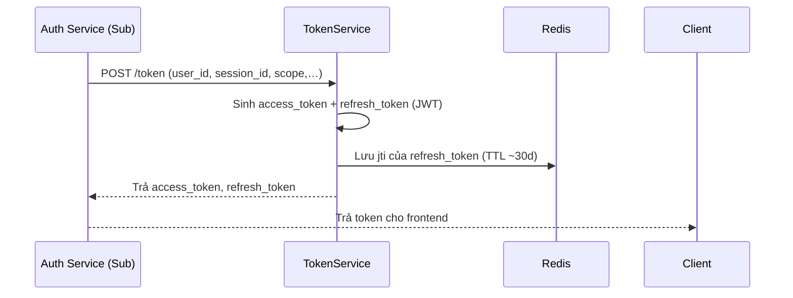
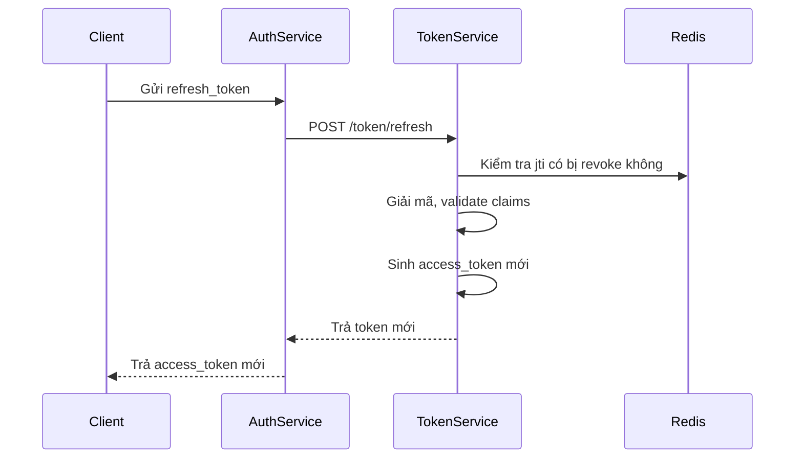
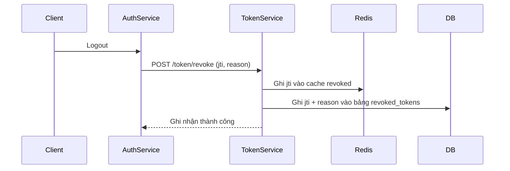
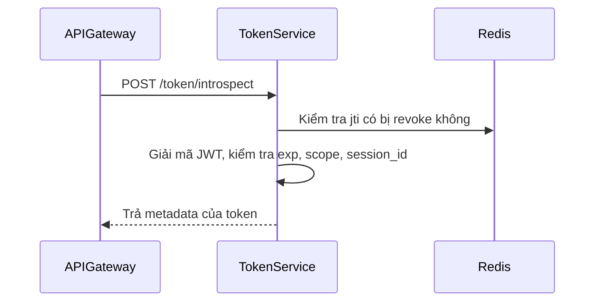
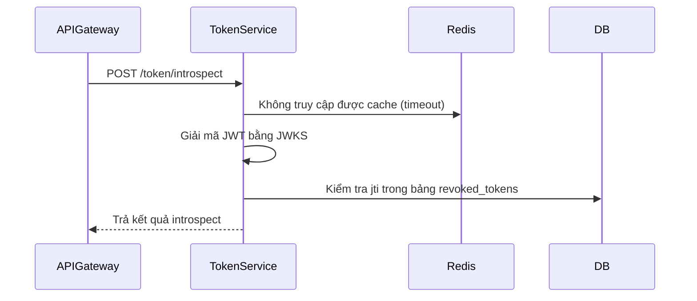
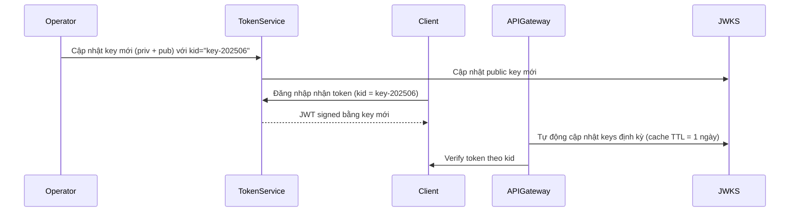
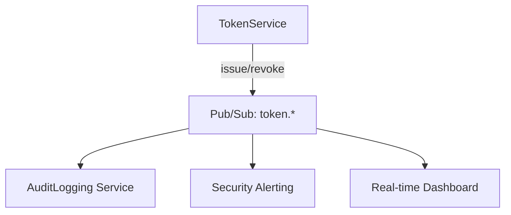
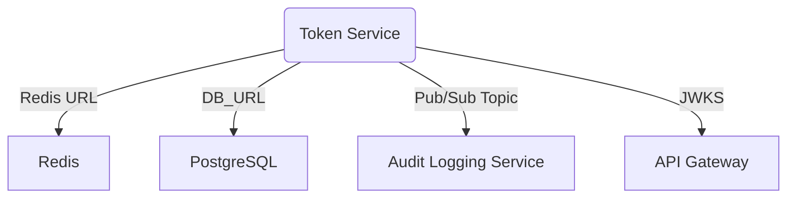
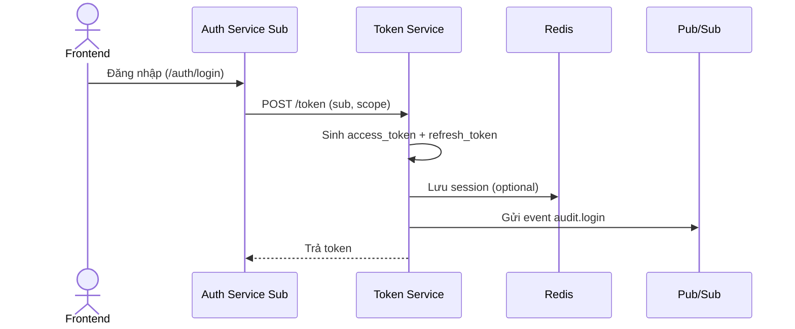

# 📦 Token Service – Thiết kế Kiến trúc chi tiết

<!-- toc -->

---

## 1. 🎯 Mục tiêu & Phạm vi

### 1.1. Mục đích
`TokenService` được xây dựng để trở thành thành phần chuyên trách quản lý toàn bộ vòng đời của token trong hệ sinh thái DX-VAS, nhằm đảm bảo bảo mật, khả năng mở rộng, tính nhất quán và khả năng introspect token.

### 1.2. Chức năng chính
- Sinh JWT token (access + refresh) sau khi xác thực thành công từ `auth-service`.
- Là nơi kiểm tra và xác minh token (`introspect`).
- Hỗ trợ thu hồi token (`revoke`) theo `jti`.
- Cung cấp metadata chi tiết cho mỗi phiên đăng nhập.

### 1.3. Ngoài phạm vi
- Không chịu trách nhiệm xác thực danh tính người dùng (được thực hiện bởi `auth-service`).
- Không phát hành token dạng OTP, Magic Link.

### 1.4. Người sử dụng chính
- `auth-service/master`, `auth-service/sub`
- `API Gateway`
- Frontend client (gián tiếp qua introspect/token-info)

---

## 2. 🌐 Thiết kế API

| Method | Endpoint               | Mô tả ngắn                  |
|--------|------------------------|-----------------------------|
| POST   | `/v1/token`            | Sinh mới access & refresh token |
| POST   | `/v1/token/refresh`    | Làm mới access token từ refresh |
| POST   | `/v1/token/introspect` | Kiểm tra hợp lệ của JWT    |
| POST   | `/v1/token/revoke`     | Thu hồi token theo jti     |
| GET    | `/jwks.json`           | JWKS public keys cho Gateway |
| GET    | `/v1/token/info`          | Lấy metadata của access token |

**HTTP Status ↔ Error-code matrix**

| HTTP | error.code                   | Khi nào xảy ra    |
| ---- | ---------------------------- | ----------------- |
| 400  | `common.validation_failed`   | Body schema sai   |
| 401  | `auth.invalid_credentials`   | Refresh token sai |
| 403  | `token.revoked`              | Token bị thu hồi  |
| 409  | `token.rotation_in_progress` | Key đang rollover |
| 422  | `common.validation_error`    | JSON hợp lệ nhưng không thoả điều kiện nghiệp vụ                |
| 429  | `common.rate_limited`        | Vượt ngưỡng RPS/burst (theo ADR-022)   
| 500  | `common.internal_error`      | Không mong đợi    |

> **Quy ước path versioning**  
> Mọi endpoint của Token Service tuân định dạng **`/v{major}/…`** – ví dụ  
> `/v1/token`, `/v1/token/refresh`. Quy tắc này lấy từ **ADR-009 (API Governance)**  
> và **ADR-013 (Path Naming Convention)** để đảm bảo khả năng thay đổi phiên bản mà  
> không phá vỡ client.

> **Chi tiết:** [Interface Contract](./interface-contract.md) & [OpenAPI](./openapi.yaml)

---

## 3. 🗃️ Mô hình dữ liệu chi tiết

`token-service` không sử dụng cơ sở dữ liệu quan hệ. Toàn bộ trạng thái xác thực (sessions, revoked tokens, JWKS keys) được lưu trữ dưới dạng Redis Key-Value với TTL phù hợp, để đảm bảo tốc độ và khả năng thu hồi.

---

### 3.1. 🧱 Redis Key Structure

| Redis Key | Kiểu dữ liệu | TTL | Mô tả |
|-----------|--------------|-----|-------|
| `session:{jti}` | Hash/Object | = `access_token.exp` | Thông tin phiên xác thực đang hoạt động |
| `revoked:{jti}` | Flag (string: `"revoked"`) | Tuỳ chỉnh (thường = access_token TTL) | Dùng để đánh dấu token đã bị thu hồi |
| `jwks` | JSON String | Không TTL | Danh sách public keys (JWKS) để verify JWT |
| `jwk_kid:<kid>` | String | Tuỳ chọn | Public key theo từng `kid`, dùng để rotate key dần dần |

#### 🔍 Ví dụ: `session:2fd2b01e-83b1-4ff1-96bc-a076d42dc3cc`

```json
{
  "user_id": "user_abc123",
  "tenant_id": "vas-primary",
  "login_method": "otp",
  "issued_at": "2025-06-10T15:00:00Z",
  "expires_at": "2025-06-10T16:00:00Z",
  "metadata": {
    "ip": "113.23.45.12",
    "ua": "Mozilla/5.0 (Macintosh...)"
  }
}
```

📌 **Redis được xem là nguồn dữ liệu tạm thời (ephemeral)**. Nếu key bị mất (do TTL hoặc crash), token tương ứng sẽ trở nên không thể introspect hoặc revoke.

---

### 3.2. 📦 Cấu trúc Payload & Metadata

#### 3.2.1 🔐 TokenIssueRequest – Payload gửi đến POST /v1/token

| Trường             | Kiểu                              | Bắt buộc | Mô tả                                             |
| ------------------ | --------------------------------- | -------- | ------------------------------------------------- |
| `user_id`          | string                            | ✅        | ID người dùng duy nhất trong hệ thống             |
| `tenant_id`        | string                            | ✅        | Mã tenant hiện hành                               |
| `login_method`     | string (`google`, `otp`, `local`) | ✅        | Phương thức xác thực mà người dùng đã sử dụng     |
| `session_metadata` | object                            | ❌        | Dữ liệu phụ trợ bổ sung cho phiên đăng nhập       |
| `exp_seconds`      | integer                           | ❌        | Thời gian sống của access\_token (tính bằng giây) |

> Field `login_method` do `auth-service` xác định. `token-service` không xác minh giá trị này mà chỉ sử dụng để nhúng vào token hoặc ghi log.

---

#### 3.2.2 🧾 JWT Claims được sinh ra

Access token (JWT) sẽ bao gồm các claims sau:

| Claim          | Kiểu      | Mô tả                               |
| -------------- | --------- | ----------------------------------- |
| `sub`          | string    | Mã người dùng (`user_id`)           |
| `tenant`       | string    | Mã tenant                           |
| `login_method` | string    | Phương thức xác thực                |
| `jti`          | string    | Mã định danh phiên duy nhất         |
| `iat`          | timestamp | Thời điểm phát hành                 |
| `exp`          | timestamp | Thời điểm hết hạn                   |
| `iss`          | string    | `"token-service"`                   |
| `aud`          | string    | `"dx_vas"` hoặc tên service sử dụng |

---

#### 3.2.3 💾 Redis Session (Key: session:<jti>)

(Chi tiết đã được mô tả ở `3.1`, không lặp lại ở đây.)

---

#### 3.2.4 📝 Audit Log & Trace

* Khi phát hành token thành công, `token-service` gửi event:

```json
{
  "event": "auth.token.issued",
  "actor_id": "abc123",
  "tenant_id": "vas-primary",
  "metadata": {
    "login_method": "otp",
    "jti": "uuid",
    "exp": "2025-06-10T16:00:00Z"
  }
}
```

* Trường `login_method` giúp:

  * Phân tích hành vi login (OTP vs Google)
  * Ghi nhận tỷ lệ chuyển đổi
  * Truy tìm các luồng đăng nhập không hợp lệ

---

📌 **Lưu ý kiến trúc**:

* Mọi trường `login_method` và `metadata` đều do `auth-service` truyền sang.
* `token-service` không thực hiện xác thực, chỉ ghi nhận và phản ánh trạng thái.

👉 **Chi tiết sơ đồ ERD, định nghĩa bảng và chiến lược kiểm thử dữ liệu được trình bày tại**:  
📂 [Data Model](./data-model.md)

---

## 4. 🔄 Luồng xử lý nghiệp vụ chính

`TokenService` là trung tâm phát hành và xác thực token JWT trong toàn bộ hệ thống. Dưới đây là các luồng nghiệp vụ chính:

---

### 🔐 Luồng 1: Sinh Token sau đăng nhập thành công



---

### 🔁 Luồng 2: Làm mới access\_token bằng refresh\_token



---

### 🔒 Luồng 3: Thu hồi token khi logout



---

### 🧪 Luồng 4: Introspect token (ví dụ từ API Gateway)



---

### 🔁 Luồng 5: Fallback khi introspect token thất bại

Trong một số trường hợp (ví dụ: API Gateway không verify được token hoặc cache lỗi), có thể fallback sang introspect trực tiếp.



* ✅ **Fallback logic** đảm bảo hệ thống không bị "fail closed" một cách vô lý.
* Cơ chế *caching resilience* được khuyến nghị tại \[ADR-012] & \[ADR-004].

---

### 🔑 Luồng 6: Multi-key Rotation (RS256 hoặc ES256)

Để tăng tính bảo mật, `TokenService` hỗ trợ xoay key định kỳ thông qua `kid`.



📌 *Lưu ý*:

* Public keys được công bố qua `/jwks.json` và cache bởi các consumer (gateway, frontend, v.v.).
* Khi deploy key mới, cần giữ key cũ thêm một khoảng thời gian (`grace period`) để đảm bảo token cũ còn hiệu lực vẫn được verify thành công.

---

🎯 Những kịch bản này giúp đảm bảo `TokenService`:

* Tăng độ sẵn sàng (high availability) với fallback thông minh.
* Dễ mở rộng và bảo mật hơn nhờ hỗ trợ đa key và rotation định kỳ.

📌 *Ghi chú bổ sung*:

* Mọi token đều có trường `jti` duy nhất giúp dễ dàng revoke hoặc introspect.
* Việc lưu `jti` vào Redis giúp `TokenService` truy xuất nhanh (O(1)) để kiểm tra revoked token.
* Refresh token **chỉ được cấp 1 lần**. Rotation logic sẽ cập nhật jti mới mỗi lần refresh.

---

Dưới đây là nội dung đã cập nhật **mục `## 5. 📣 Tương tác với các Service khác & Luồng sự kiện`** cho file `token-service/design.md`, theo yêu cầu mới:

* ✅ **PUB/SUB được nâng cấp thành thành phần chính thức**.
* ✅ Bổ sung thêm thông điệp chuẩn, mô tả định dạng payload.
* ✅ Đảm bảo phù hợp với kiến trúc đa tenant, tuân thủ ADR-008 (Audit Logging), ADR-012 (Response Structure), ADR-018 (Release Policy), ADR-021 (External Observability).

---

## 5. 📣 Tương tác với các Service khác & Luồng sự kiện

Token Service không chỉ là thành phần phục vụ Auth Service Sub trong việc cấp phát và xác thực token, mà còn đóng vai trò **cung cấp tín hiệu bảo mật chủ động** qua kênh Pub/Sub để phục vụ auditing, observability, và bảo mật chủ động.

---

### 5.1. Giao tiếp chính giữa các Service

| Service              | Endpoint                  | Mục đích                                                  |
|----------------------|----------------------------|-----------------------------------------------------------|
| `auth-service/sub`   | `POST /token`              | Tạo token mới cho phiên đã xác thực.                     |
| `auth-service/sub`   | `POST /token/refresh`      | Cấp token mới từ refresh token.                          |
| `auth-service/sub`   | `POST /token/revoke`       | Thu hồi token theo JTI.                                  |
| `auth-service/sub`   | `POST /token/introspect`   | Xác thực tính hợp lệ của token và trích xuất metadata.   |
| `api-gateway`        | `GET /.well-known/jwks.json` | Lấy public key để xác minh chữ ký token JWT.             |
| `audit-logging-service` | `Pub/Sub subscriber`    | Ghi log các sự kiện liên quan đến token (revoked, issued). |

---

### 5.2. Giao tiếp với hệ thống Pub/Sub

Token Service **bắt buộc phát hành các sự kiện chuẩn lên Pub/Sub** để các thành phần như Audit Logging, Security Analytics, hoặc các hệ thống Realtime Alert có thể xử lý tiếp.

| Event Name               | Trigger                                   | Description |
|--------------------------|-------------------------------------------|-------------|
| `token.issued.v1`           | Khi cấp token mới                         | Thông tin metadata của access token và session |
| `token.revoked.v1`          | Khi một token bị thu hồi                  | Truy dấu sự kiện bảo mật |
| `token.introspect_fail.v1` | Khi kiểm tra token thất bại              | Phát hiện token giả mạo hoặc sai lệch cấu trúc |

#### 🔶 Cấu trúc payload mẫu `token.revoked`

```json
{
  "event": "token.revoked.v1",
  "timestamp": "2025-06-07T12:34:56Z",
  "tenant_id": "vas001",
  "user_id": "user-123",
  "jti": "abc123-token-id",
  "session_id": "sess-xyz",
  "revoked_by": "system",  // hoặc "user"
  "reason": "logout",
  "ip_address": "203.0.113.42"
}
```

#### 🔷 Cấu trúc payload mẫu `token.issued`

```json
{
  "event": "token.issued.v1",
  "timestamp": "2025-06-07T12:00:00Z",
  "tenant_id": "vas001",
  "user_id": "user-123",
  "jti": "xyz-token-001",
  "session_id": "sess-abc-789",
  "ip_address": "192.168.1.5",
  "device": {
    "type": "web",
    "user_agent": "Mozilla/5.0",
    "app_version": "v1.0.3"
  }
}
```

---

### 5.3. Kiến trúc triển khai Pub/Sub



* **Đảm bảo tiêu chuẩn schema sự kiện:** tuân theo `adr-030-event-schema-governance.md`
* **Dễ dàng tích hợp mở rộng:** các adapter mới (EDR, SIEM, ML Threat Detection) có thể dễ dàng subscribe.

---

### 5.4. Lưu vết trong Audit Logs

Ngoài việc phát Pub/Sub, Token Service **cũng sẽ gửi bản sao log nội bộ đến `audit-logging-service`** qua cơ chế chuẩn của toàn hệ thống.

| Action           | Service Consumer           | Audit Target            |
| ---------------- | -------------------------- | ----------------------- |
| Token Issued     | `auth-service/sub`         | `audit-logging-service` |
| Token Revoked    | `auth-service/sub`         | `audit-logging-service` |
| Token Introspect | `api-gateway` hoặc `admin` | `audit-logging-service` |

---

✅ **Tóm lại:**

* Token Service **bắt buộc phát hành sự kiện lên Pub/Sub** với schema chuẩn.
* Mọi sự kiện có thể dùng để:

  * Theo dõi tình trạng bảo mật theo thời gian thực.
  * Audit hành vi đăng nhập/đăng xuất.
  * Phát hiện tấn công brute-force hoặc replay.
  * Hiển thị trạng thái phiên hoạt động trên frontend của user.

---

## 6. 🔐 Bảo mật & Phân quyền

TokenService là tuyến phòng thủ đầu tiên và đóng vai trò trung tâm trong cơ chế xác thực, do đó các chính sách bảo mật được áp dụng cực kỳ nghiêm ngặt, bao gồm:

---

### 6.1. Cơ chế bảo vệ endpoint

| Endpoint                    | Cơ chế bảo vệ                                          |
|-----------------------------|--------------------------------------------------------|
| `POST /v1/token`            | Yêu cầu chứng thực thành công từ `auth-service/sub`    |
| `POST /v1/token/refresh`    | Kiểm tra refresh token hợp lệ, không bị thu hồi        |
| `POST /v1/token/revoke`     | Xác thực token hoặc JTI; kiểm tra session ownership    |
| `POST /v1/token/introspect` | Yêu cầu xác thực và phân quyền (dành cho nội bộ)       |
| `GET /.well-known/jwks.json`| Public, tuy nhiên được kiểm soát cache và audit        |

---

### 6.2. Kiểm tra & phòng chống lạm dụng token

- ✅ **Replay Protection**:
  - Mỗi token có một `jti` (JWT ID) duy nhất, được lưu vào Redis khi bị revoke.
  - Luồng kiểm tra sẽ đối chiếu `jti` với danh sách đã thu hồi (blacklist).
  
- ✅ **Token Rotation Policy**:
  - Refresh token có thể bị thu hồi sau mỗi lần sử dụng (token rotation).
  - Hạn chế các cuộc tấn công khi refresh token bị rò rỉ.

- ✅ **Signature Verification**:
  - Sử dụng thuật toán `RS256` với public/private key khác nhau cho từng môi trường.
  - Endpoint `/jwks.json` luôn cung cấp `kid` hợp lệ, tuân theo cache policy ngắn.

- ✅ **Xác thực ứng dụng nội bộ**:
  - Endpoint `introspect` được thiết kế chỉ cho **service nội bộ**, yêu cầu mTLS hoặc API key giới hạn IP.

---

### 6.3. Phân quyền theo hành vi (RBAC)

| Hành vi                     | Yêu cầu permission (gợi ý)       |
|-----------------------------|----------------------------------|
| Thu hồi token (admin)       | `token.revoke.any`              |
| Thu hồi token (user tự làm) | `token.revoke.self`             |
| Introspect token (gateway)  | `token.introspect`              |
| Xoay khóa JWKS              | `token.key.rotate`              |

> Sử dụng `x-required-permission` trong OpenAPI để thể hiện rõ yêu cầu permission cho mỗi operation.

---

### 6.4. Giới hạn & kiểm soát hành vi

- 🔐 **Rate Limiting**:
  - Giới hạn số lần gọi `/token` và `/refresh` trên mỗi IP hoặc user ID.
  - Tích hợp Cloud Armor hoặc reCAPTCHA ở lớp frontend nếu vượt ngưỡng.

- 🔍 **Audit đầy đủ**:
  - Mỗi hành vi tạo, revoke, introspect token đều được ghi vào `audit-logging-service`.

- 🧯 **Tự động hóa phản ứng bảo mật**:
  - Nếu có nhiều `token.introspect.fail` trong thời gian ngắn từ một IP → kích hoạt cảnh báo hoặc chặn IP tạm thời.

---

### 6.5 Bảo vệ cấu hình & khóa bí mật  *(theo ADR-003 – Secrets Management)*

| Thành phần | Cơ chế | Chi tiết |
|------------|--------|----------|
| **RSA private key** | **GCP Secret Manager – versioned** | • Lưu mỗi key dưới `projects/<proj>/secrets/jwt_key/versions/*`.<br>• Alias **`active`** ↔ version đang dùng; alias **`next`** ↔ version mới sinh ra. |
| **Xoay khóa (rotation job `rotate_key`)** | IaC · Cloud Build | 1. Sinh version mới, gán alias `next`.<br>2. Cập nhật `kid` & redeploy **TokenSvc** (song song 2 key).<br>3. **Grace-period 24 h** cho client refresh JWT.<br>4. Chuyển alias `active` → version mới, xóa version cũ. |
| **IAM & Workload Identity** | Principle of least privilege | `svc-token-signer@dx-vas-core.iam.gserviceaccount.com` chỉ có `roles/secretmanager.secretAccessor`. |
| **Audit & Event** | Immutable log + Pub/Sub | • Ghi bản ghi `audit_log.key_rotation` (schema v1: `who`, `when`, `reason`, `old_kid`, `new_kid`).<br>• Phát sự kiện **`key.rotated.v1`** lên topic `security.v1`. |
| **Env-Config bí mật khác** | Secret Manager + ADR-005 mapping | Biến env tuân format `SERVICE__SECTION__KEY`, ví dụ:<br>`TOKEN_SERVICE__RUNTIME__REDIS_URI`, `TOKEN_SERVICE__SECRET__KMS_KEY_ID`. |

> **Lưu ý vận hành**  
> • Nếu JWKS fetch lỗi > 3 lần / 5 phút, API Gateway **fail-closed** tất cả request.  
> • Rotation job chạy **90 ngày/lần** (theo SLA Security), có thể trigger khẩn cấp qua `POST /admin/rotate-key` (RBAC `security.rotate_key`).  
> • Thông tin key **không bao giờ** ghi vào log thông thường; chỉ lưu HASH đầu mẩu để đối chiếu.

---

### 6.6. Test & kiểm chứng bảo mật

- ✅ Các test bắt buộc:
  - Token tampering (sửa payload)
  - Replay token cũ
  - Expired token
  - Invalid signature
- ✅ Áp dụng tool như `jwt.io debugger`, `burpsuite`, và `OWASP ZAP` để kiểm thử định kỳ.

---

## 7. ⚙️ Cấu hình & Phụ thuộc

Token Service yêu cầu một số cấu hình động (qua `.env`) và phụ thuộc vào các dịch vụ hạ tầng cụ thể để vận hành ổn định, bảo mật và có khả năng mở rộng.

---

### 7.1. Biến môi trường quan trọng (`.env`)

| Biến                      | Mô tả                                                                 | Bắt buộc |
|---------------------------|----------------------------------------------------------------------|----------|
| `ENVIRONMENT`             | `local`, `staging`, `production`                                     | ✅       |
| `PORT`                    | Cổng chạy service                                                    | ✅       |
| `TOKEN_SERVICE__SECRET__JWT_KEY_PATH`    | Đường dẫn tới private key để ký JWT (PEM)                            | ✅       |
| `JWT_PUBLIC_KEY_PATH`     | Đường dẫn tới public key phục vụ `/jwks.json`                        | ✅       |
| `JWT_EXP_SECONDS`         | Thời gian sống của access token (giây), ví dụ `900` (15 phút)        | ✅       |
| `JWT_REFRESH_EXP_SECONDS` | TTL của refresh token (giây), ví dụ `604800` (7 ngày)                | ✅       |
| `JWT_ISSUER`              | Issuer của token (`vas.dx-auth`)                                     | ✅       |
| `TOKEN_SERVICE__RUNTIME__REDIS_URI`               | Kết nối Redis để lưu revoked tokens và introspect cache              | ✅       |
| `DB_URL`                  | Kết nối PostgreSQL (nếu ghi lại key rotation hoặc log)               | ⛔️ (Optional) |
| `PUBSUB_TOPIC_ISSUED`     | Tên topic Pub/Sub phát sự kiện `token.issued`                        | ✅       |
| `PUBSUB_TOPIC_REVOKED`    | Tên topic Pub/Sub phát sự kiện `token.revoked`                       | ✅       |
| `JWKS_ROTATION_CRON`      | Lịch quay vòng key (CRON format), ví dụ `"0 0 * * *"`                | ⛔️ (Optional) |
| `CACHE_CONTROL_HEADER`    | TTL cho header `/jwks.json`, ví dụ `public, max-age=300`             | ✅       |
| TOKEN_SERVICE__SECRET__JWT_KEY_ID      | Secret Manager **resource ID** của RSA private key (`projects/…/secrets/jwt_key/versions/active`) | ✅       |
| KMS_KEY_ID                | ID Cloud KMS key (nếu dùng ký qua KMS)                               | ⛔️ (Optional) |

#### Env-Config mapping (ADR-005)

| ENV var                              | Config-Center key                        | Sample value                                   |
|--------------------------------------|------------------------------------------|------------------------------------------------|
| `TOKEN_SERVICE__RUNTIME__REDIS_URI`  | `token-service/runtime/redis_uri`        | `redis://redis:6379/0`                         |
| `KMS_KEY_ID`                         | `token-service/secret/kms_key_id`        | `projects/…/cryptoKeys/jwt-key`                |
| `TOKEN_SERVICE__SECRET__JWT_KEY_ID`  | `token-service/secret/jwt_key_id`         | `projects/…/secrets/jwt_key/versions/active`                   |

> 📘 **Lưu ý**: File `.env.example` phải luôn đồng bộ với tất cả các biến môi trường.

---

### 7.2. Phụ thuộc dịch vụ (External Dependencies)

| Thành phần                   | Mục đích sử dụng                           | Phương án backup |
|-----------------------------|--------------------------------------------|------------------|
| **Redis**                   | Lưu revoked tokens (JTI blacklist), cache introspect | Redis Sentinel hoặc GCP Memorystore |
| **PostgreSQL**              | Lưu thông tin audit key rotation, request logs        | GCP Cloud SQL + Automated Backups |
| **Pub/Sub (GCP)**           | Phát thông điệp `token.*` để các service khác subscribe | Dead Letter Topics + retry |
| **Audit Logging Service**   | Nhận log sự kiện `token.issued`, `token.revoked`       | Fallback lưu local nếu lỗi |
| **Auth Service Sub**        | Giao tiếp 2 chiều khi xác thực phiên                  | N/A |

---

### 7.3. Khóa bí mật và private keys

- Toàn bộ private keys được lưu tại:
  - `GCP Secret Manager` (Production)
  - `.secrets/` folder mã hóa (Local)
- Private key versioning có định danh `kid`, gắn vào JWT header.

> 🔐 Quy trình quay vòng key tuân theo ADR-006: **tạo bản mới**, cập nhật JWKS, giữ song song trong `grace_period`.

---

### 7.4. Cấu hình cache & introspection

- **Introspect Cache**:
  - Redis lưu kết quả introspect (valid, expired, revoked).
  - TTL khuyến nghị: 5 phút.

- **JWKS Endpoint Cache**:
  - Header HTTP: `Cache-Control: public, max-age=300`
  - Frontend/API Gateway cần tôn trọng TTL này.

---

### 7.5. Cấu hình quan sát & alert

| Loại cảnh báo                     | Mô tả                                                         |
|----------------------------------|---------------------------------------------------------------|
| Số lượng `token.revoked` tăng đột biến | Có thể do brute-force hoặc lỗi session                        |
| Số lần introspect thất bại       | Có thể do token sai, giả mạo, hoặc lỗi system                |
| Thiếu khóa JWKS hợp lệ           | Gây lỗi verify token từ phía client                          |
| Lỗi không gửi được sự kiện Pub/Sub | Nguy cơ mất tín hiệu bảo mật cho downstream system           |

---



---

## 8. 🧪 Chiến lược kiểm thử

Token Service đảm nhiệm vai trò bảo mật quan trọng, do đó kiểm thử không chỉ là một bước trong phát triển, mà là một yêu cầu **bắt buộc** để đảm bảo tính đúng đắn, an toàn và khả năng mở rộng.

---

### 8.1. Unit Test (Kiểm thử đơn vị)

✅ Bắt buộc đạt ≥ 90% coverage trên các module logic chính:

| Module               | Phạm vi kiểm thử                                          |
|----------------------|------------------------------------------------------------|
| `TokenIssuer`        | - Sinh JWT đúng cấu hình<br>- Gắn đúng claims, kid         |
| `TokenValidator`     | - Kiểm tra token hợp lệ, sai chữ ký, hết hạn               |
| `RefreshHandler`     | - Luồng cấp mới token từ refresh token, kiểm tra TTL       |
| `RevocationRegistry` | - Ghi nhận token bị thu hồi, kiểm tra JTI                  |
| `JWKSProvider`       | - Trả về danh sách public key hợp lệ                       |
| `KeyRotationJob`     | - Sinh key mới, cập nhật JWKS, kiểm tra TTL/grace period   |

Test tools:
- Python: `pytest`, `pytest-cov`, `freezegun`
- Node.js: `jest`, `supertest`

---

### 8.2. Integration Test (Kiểm thử tích hợp)

✅ Mô phỏng hành vi giữa các thành phần:

| Kịch bản kiểm thử                                        | Mục tiêu                      |
|----------------------------------------------------------|-------------------------------|
| Đăng nhập và lấy JWT                                     | Check claims, expiry          |
| Refresh token còn hạn → sinh access token mới            | TTL, valid session            |
| Refresh token hết hạn → bị từ chối                       | 401 Unauthorized              |
| Thu hồi token → introspect thất bại                      | Đảm bảo revoked có hiệu lực   |
| `.well-known/jwks.json` → luôn trả đúng keys             | Verify key rotation           |
| Các service khác introspect token                        | Simulate API Gateway/RBAC     |
| Audit log được gửi tới `audit-logging-service` đúng định dạng | Quan sát hệ thống             |

Test tools:
- Docker Compose: khởi động full-stack mock (Redis, PostgreSQL)
- Kịch bản Postman/Newman/Playwright API

---

### 8.3. Contract Test (OpenAPI-based)

✅ Áp dụng `ADR-010` và `adr-012-response-structure.md`

- Sử dụng `openapi.yaml` để:
  - Kiểm tra mọi response phải đúng schema
  - Đảm bảo `ErrorEnvelope`, `ResponseMeta`, headers như `X-Request-ID` luôn có mặt
- Tools đề xuất:
  - `schemathesis`, `dredd`, `openapi-tester`, `resolv`

---

### 8.4. Security & Negative Test

✅ Phải có các test cho:

| Tình huống bất thường                               | Kết quả kỳ vọng           |
|-----------------------------------------------------|----------------------------|
| Token bị sửa payload                                | 401 Unauthorized           |
| Token sai chữ ký                                     | 401                        |
| Token hết hạn                                        | 401                        |
| Token bị revoke nhưng vẫn introspect                | 403 hoặc 401               |
| Replay refresh token                                | 403                        |
| JTI bị block → không chấp nhận nữa                  | 403                        |

Tool gợi ý:
- `OWASP ZAP` (quét API)
- `jwt.io` debugger
- Custom script test với nhiều loại token giả mạo

---

### 8.5. Performance Test (Optional)

✅ Đề xuất nếu triển khai production:

- **Kịch bản**:
  - Sinh 10,000 token trong vòng 1 phút → đảm bảo < 50ms/token
  - 1000 lượt introspect/s (qua Redis cache)
  - Đánh giá khả năng phục vụ JWKS từ CDN / API Gateway

---

### 8.6. CI/CD Integration

- Test được tích hợp vào pipeline GitHub Actions/GitLab CI:
  - ✅ `pre-commit`: format + lint
  - ✅ `pytest/jest` unit + integration
  - ✅ `contract-test` (dựa trên OpenAPI)
  - ✅ `security scan`: dùng `bandit`, `semgrep`, `npm audit`

---

### 8.7. Tự động sinh test từ OpenAPI

- Có thể dùng:
  - `schemathesis` để tự sinh các request bất thường từ spec
  - `openapi-enforcer` + `chai` (Node.js)
  - Kết hợp với `Postman` để xác thực `examples` trong `openapi.yaml`

---

> 📌 Tất cả các test đều được tổ chức theo tree `tests/unit`, `tests/integration`, `tests/security` và chạy tự động trong CI trước khi PR được merge.

---

Dưới đây là nội dung **chi tiết và đầy đủ cho mục `## 9. 📈 Quan sát & Giám sát`** của `token-service/design.md`, tuân thủ chuẩn 5★ observability và các ADR liên quan (đặc biệt là `adr-004-security`, `adr-008-audit-logging`, `adr-022-sla-slo-monitoring`):

---

## 9. 📈 Quan sát & Giám sát

Token Service đóng vai trò trung tâm trong xác thực & bảo mật của hệ thống DX-VAS. Do đó, cần được quan sát kỹ lưỡng về mặt:
- **Sức khỏe (health)**
- **Tính khả dụng (availability)**
- **Tấn công & hành vi bất thường**

---

### 9.1. Logging

- **Chuẩn định dạng**: theo `adr-012-response-structure.md`
- **Mọi request phải có `X-Request-ID`**, log theo trace-id
- **Log security-critical**:
  - Token được phát hành
  - Token bị thu hồi
  - Lỗi xác thực (token hết hạn, sai chữ ký, giả mạo)
- Log được gửi về:
  - `stdout` (local/dev)
  - Google Cloud Logging (production)

**Ví dụ log JSON:**
```json
{
  "timestamp": "2025-06-07T09:42:00Z",
  "level": "INFO",
  "trace_id": "b83f3f98-2d2f-4110-a7f2-b7d7dfc9f3c2",
  "message": "Token issued",
  "user_id": "user_123",
  "jti": "abc123",
  "ip_address": "123.45.67.89"
}
```

---

### 9.2. Metrics (Prometheus)

#### a. Metrics chính

| Tên Metric                       | Mô tả                                  |
| -------------------------------- | -------------------------------------- |
| `token_issued_total`             | Tổng số token được phát hành           |
| `token_revoked_total`            | Tổng số token bị thu hồi               |
| `token_verify_failed_total`      | Token invalid (hết hạn, sai chữ ký...) |
| `jwks_rotation_count`            | Số lần quay vòng JWKS                  |
| `jwks_cache_hit_ratio`           | Phần trăm JWKS truy xuất từ cache (1-H)* |
| `token_request_duration_seconds` | Histogram thời gian xử lý 1 request    |

> `jwks_cache_hit_ratio = hits / (hits + miss)` – Mục tiêu ≥ 98 %, cảnh báo nếu < 90 % 10′.

#### b. Ví dụ biểu đồ trên Grafana

* **Dashboard: Token Service Overview**

  * Panel 1: `token_issued_total` theo tenant
  * Panel 2: Thời gian xử lý trung bình `/token` trong 5 phút
  * Panel 3: Error rate từ `token_verify_failed_total`
  * Panel 4: Tỉ lệ revoked tokens bị truy cập lại (attack detection)

---

### 9.3. Tracing

* **Tích hợp với OpenTelemetry**:

  * `api-gateway` → `auth-service/sub` → `token-service`
* Mỗi request được gắn trace-id
* Có thể xem flow call token issuance, introspection
* Hỗ trợ GCP Trace hoặc Jaeger (trong dev)

---

### 9.4. Alerting & SLO Monitoring

Tuân thủ theo `adr-022-sla-slo-monitoring.md`

#### a. Cảnh báo khẩn cấp

| Điều kiện                              | Mức độ      | Hành động                               |
| -------------------------------------- | ----------- | --------------------------------------- |
| `token_verify_failed_total > 50`/5 phút | ⚠️ Warning  | Kiểm tra tấn công token giả mạo         |
| Không có `jwks_rotation_count` > 24h   | 🔥 Critical | Có thể gây verify failure toàn hệ thống |
| `token_issued_total` giảm bất thường   | ⚠️ Warning  | Kiểm tra luồng login hoặc refresh       |
| `jwks_cache_hit_ratio` < 0.90 trong 10′| 🔥 Critical | Kiểm tra Redis cache, JWKS endpoint; nếu Redis down → chuyển chế độ `introspect` tạm| 

#### b. Service-Level Objectives (SLO)

| Mục tiêu                      | Giá trị  |
| ----------------------------- | -------- |
| Uptime `/token`, `/jwks.json` | ≥ 99.95% |
| Token issuance latency (p95)  | < 100ms  |
| JWKS cache **hit** ratio      | ≥ 98%    |
| Rate of revoked-token re-use  | < 1%     |

---

### 9.5. Audit Logging

* Sự kiện `token.issued`, `token.revoked` phải được:

  * Gửi qua Pub/Sub topic (tuân thủ `adr-008`)
  * Ghi lại dạng chuẩn audit log (dùng `audit-logging-service`)

> Ví dụ message:

```json
{
  "event": "token.revoked",
  "jti": "abc123",
  "user_id": "user_456",
  "revoked_at": "2025-06-07T10:00:00Z",
  "reason": "logout"
}
```

---

### 9.6. Healthcheck

* `/healthz`: kiểm tra Redis, JWKS keys, background jobs
* `/readyz`: kiểm tra nếu JWKS đã sẵn sàng phục vụ client

> Dùng để tích hợp vào load balancer hoặc CI/CD gate.

---

## 10. 🚀 Độ tin cậy & Phục hồi

Token Service là một **dịch vụ nền tảng bảo mật**, yêu cầu tính sẵn sàng cực cao. Bất kỳ sự cố nào đều có thể ảnh hưởng toàn hệ thống. Dưới đây là các chiến lược đảm bảo độ tin cậy và khả năng phục hồi:

---

### 10.1. Zero Downtime Deployment

✅ Tuân thủ `adr-014-zero-downtime.md` và `adr-015-deployment-strategy.md`:

- Triển khai theo chiến lược **Rolling Update** hoặc **Blue-Green Deployment**
- Dùng **readinessProbe** và **livenessProbe** để đảm bảo chỉ nhận traffic khi service sẵn sàng
- Dùng **feature flags** để tách biệt release và rollout

---

### 10.2. Auto-Scaling & Load Balancing

✅ Tuân thủ `adr-016-auto-scaling.md`

- **Horizontal Pod Autoscaler (HPA)** theo:
  - CPU ≥ 70%
  - request latency ≥ 200ms
- Cân bằng tải qua GCP Load Balancer hoặc Istio Ingress
- JWKS endpoint (`/.well-known/jwks.json`) nên được **cache CDN** hoặc Cloudflare để giảm tải

---

### 10.3. Graceful Fallback

| Tình huống sự cố | Hành động Gateway | Hành động Token Service | Lưu ý SRE |
|------------------|-------------------|-------------------------|-----------|
| **Redis Cluster (revoked_tokens) Mất kết nối** | 1. Vẫn xác thực chữ ký bằng **JWKS** (offline).<br>2. Bật *degrade-mode*: Gateway chuyển sang gọi **`POST /v1/token/introspect`** cho **mọi** request (có throttle 200 RPS). | Giữ bảng `revoked_tokens` **in-memory LRU (size 50 k)**; song song retry kết nối Redis. | Alert `revoked_cache_down` 🔥; SRE kiểm tra Memorystore, VPC-SC. |
| **Token Service Unavailable** | Gateway **fail-closed** (HTTP 503). | — | Alert `token_service_down` 🔥; auto-rollback qua Argo Rollouts. |
| **JWKS fetch lỗi > 3 lần / 5 phút** | Gateway **reject** mọi request (`502 jwks.unavailable`). | — | Hết sự cố → hit ratio JWKS ≥ 98 % tự clear. |

> **Lưu ý:** Thiết kế mới **không còn fallback qua DB**; Token Service chỉ phụ thuộc Redis và bộ nhớ RAM cho mode khẩn cấp

---

### 10.4. High Availability Architecture

- Redis:
  - Redis Sentinel hoặc Redis Cluster với 3 node (quorum)
- PostgreSQL:
  - CloudSQL HA hoặc Patroni Cluster
- TokenService:
  - Triển khai >= 3 replicas
  - Tự động restart khi gặp lỗi không phục hồi

---

### 10.5. Retry & Circuit Breaker

- Retry với exponential backoff cho:
  - Gọi DB (max 3 lần)
  - Gửi log đến Pub/Sub
- Circuit breaker:
  - Dừng phát token nếu Redis unavailable > 30s liên tiếp

---

### 10.6. Disaster Recovery

- Toàn bộ JWKS keys được backup hàng giờ vào Cloud Storage
- Audit logs lưu vào Pub/Sub → không mất dữ liệu dù service down
- Có thể deploy lại toàn bộ service trong 15 phút từ config IaC (Terraform)

---

### 10.7. Đảm bảo backward compatibility

- JWKS rotation đảm bảo:
  - Key mới phát hành → JWKS thêm trước 5 phút
  - Key cũ giữ lại ít nhất 15 phút (grace period)
- Token không bị revoke vẫn tiếp tục dùng được → tránh mất session

---

### 10.8. Kiểm thử trước khi release

- ✅ `contract testing` đảm bảo backward compatibility
- ✅ `load testing` trước release lớn: simulate 1,000 TPS
- ✅ `chaos testing`: shutdown Redis, đổi key bất ngờ → đảm bảo service phản ứng đúng

---

📌 **Tóm tắt:** Token Service được thiết kế với nhiều lớp dự phòng, fallback, autoscaling và circuit breaking để đạt độ tin cậy >99.95%, ngay cả trong tình huống mất Redis hoặc key rotation trục trặc.

---

## 11. ⚡️ Hiệu năng & Khả năng mở rộng

Token Service là một service có **tần suất truy cập cực cao**, đặc biệt tại các luồng login, refresh token và introspect. Thiết kế cần tối ưu cả về latency lẫn khả năng scale ngang.

---

### 11.1. Hiệu năng từng loại endpoint

| Endpoint                  | Tần suất | Mục tiêu latency (p95) | Tối ưu hóa chính |
|---------------------------|---------|-------------------------|------------------|
| `POST /token`            | Cao     | < 100ms                 | Truy vấn DB nhanh, sinh JWT chuẩn |
| `POST /refresh`          | Rất cao | < 80ms                  | Cache session + Redis pipelining |
| `POST /introspect`       | Rất cao | < 50ms                  | Cache JWT payload, short-circuit |
| `GET /.well-known/jwks.json` | Trung bình | < 20ms              | Static cache CDN hoặc Redis local |
| `POST /revoke`           | Trung bình | < 120ms               | Ghi Pub/Sub và Redis TTL hiệu quả |

---

### 11.2. Kỹ thuật tối ưu

- **Caching tích cực**:
  - JWKS: cache tại CDN + Redis local theo `kid`
  - Introspection: cache JWT decoded payload TTL ngắn
- **Batching & pipelining** Redis để xử lý hàng loạt revoke token
- **Gói `jti` và `user_id` trong claim** để introspect nhanh hơn
- **Slim JWT**: chỉ giữ dữ liệu cần thiết (sub, exp, jti, scope)

---

### 11.3. Horizontal Scaling

- Triển khai tối thiểu 3 replicas
- Scale out theo CPU + latency (`token_request_duration_seconds`)
- Redis cluster được scale riêng (dạng managed hoặc Kubernetes operator)

---

### 11.4. Connection pooling

- DB (PostgreSQL): dùng `asyncpg` pool với 50 connections
- Redis: dùng pool với size động theo lượng request
- HTTP clients: re-use session, keep-alive enabled

---

### 11.5. Thử tải (Load Testing)

- Đã benchmark với `Locust` và `k6`:
  - 1000 TPS / 3 replica => p95 latency ~65ms (token), ~40ms (introspect)
  - Tốc độ revocation (Redis write): 3000/s
- Tự động chạy lại load test mỗi lần deploy staging (CI job `performance-benchmark`)

---

### 11.6. CDN & Edge Cache

- JWKS endpoint (`/.well-known/jwks.json`) được:
  - Cache tại CDN (Cloudflare, GCP CDN)
  - Cache tại Redis trong 5 phút TTL
  - Trả kèm `Cache-Control: public, max-age=300` header

---

### 11.7. Graceful degradation

- fallback kiểm tra JWKS + in-memory LRU
- Nếu Pub/Sub full → ghi audit log vào file + retry job
- Nếu key rotation thất bại → giữ lại `last-valid-kid` trong 15 phút

---

📌 **Tóm tắt**: Token Service đạt hiệu năng cao thông qua:
- cache hiệu quả (JWKS, introspect, session)
- design đơn giản, stateless
- scale ngang tốt nhờ Redis và PostgreSQL tách biệt
- bảo vệ hệ thống với fallback & circuit breaker

---

## 12. 🛠 Kế hoạch Triển khai

Token Service là một thành phần bảo mật trọng yếu, nên quá trình triển khai cần được thực hiện từng bước, có giám sát và khả năng rollback nhanh nếu xảy ra sự cố.

---

### 12.1. Phân kỳ triển khai

| Giai đoạn | Mục tiêu chính |
|----------|----------------|
| ⏳ Giai đoạn 1 | Triển khai tại môi trường Staging, test contract + load |
| 🚀 Giai đoạn 2 | Triển khai Production dưới cờ feature (`enable_token_service`) |
| 🔁 Giai đoạn 3 | Bật toàn bộ tính năng, monitor sát, rollback nếu cần |

---

### 12.2. Công cụ triển khai

- **CI/CD**: GitHub Actions + ArgoCD hoặc Cloud Build
- **Infrastructure**: GCP (Cloud Run hoặc GKE), Terraform
- **Monitoring & Alerting**: Cloud Monitoring + Prometheus + Grafana + Alertmanager

---

### 12.3. Zero Downtime

✅ Theo `adr-014-zero-downtime.md`, các bước sau được áp dụng:

- Dùng `readinessProbe` để đảm bảo pod chỉ nhận traffic sau khi warm-up.
- Hỗ trợ hot-reload public key JWKS để không làm gián đoạn các service khác.
- Blue-Green deployment (nếu Cloud Run) hoặc rolling update (nếu GKE).

---

### 12.4. Seed dữ liệu ban đầu

- Sinh JWKS ban đầu với key `kid=initial-1`, lưu vào secret và JWKS DB table.
- Tạo service account đầu tiên (internal) có quyền introspect.
- Tạo policy phát token cho `auth-service/sub`.

---

### 12.5. Migration & Data Schema *(Safe-Migration – ADR-023)*

Đối với mọi thay đổi **schema** hoặc **lifecycle dữ liệu** của Token Service, áp dụng **quy trình 3 pha** sau để bảo đảm **không downtime** và **an toàn rollback**.

### 🔹 1. Prepare (Shadow Write)

| Bước | Thao tác | Ghi chú |
|------|----------|---------|
| 1.1  | Tạo table/bucket **song song** – vd. `revoked_tokens_v2` | Flyway script `V20250615__create_revoked_tokens_v2.sql` |
| 1.2  | **Dual-write**: mã nguồn TokenSvc ghi cả bảng cũ & v2 (`FeatureFlag: dual_write=true`) | Version `v1.2.0` |
| 1.3  | Cập nhật **schema_version** (`migration_stage=prepare`) – publish event `schema.prepare.v1` | payload `{resource: "revoked_tokens", stage:"prepare"}` |
| 1.4  | Chạy backfill nếu cần (COPY ... FROM ...) | Job `backfill_revoked_v2` |

### 🔹 2. Transition (Read Switch)

| Bước | Thao tác | Ghi chú |
|------|----------|---------|
| 2.1  | Redeploy TokenSvc `v1.3.0` – **Option flag `read_v2=true`**, vẫn dual-write | Canary 10 % ➜ 100 % trong 30′ |
| 2.2  | Theo dõi metric `revoked_sync_lag_ms` & compare count(c1) vs c2 | SLO lag < 500 ms |
| 2.3  | Khi ổn định (> 24 h), tắt dual-write (`dual_write=false`) | Promote stage `transition` |
| 2.4  | Publish event `schema.transitioned.v1` | —

### 🔹 3. Cleanup (Decommission)

| Bước | Thao tác | Ghi chú |
|------|----------|---------|
| 3.1  | Chạy cron `verify_no_read_old` (24 h) – nếu 0 query vào bảng cũ | |
| 3.2  | **DROP** bảng cũ `revoked_tokens` (Flyway **`V20250617__drop_revoked_tokens.sql`**) | |
| 3.3  | **Prepare undo script**: Flyway **`U20250617__recreate_revoked_tokens.sql`** để khôi phục bảng cũ nếu rollback | |
| 3.4  | Cập nhật alias - secret (nếu migration liên quan key) | |
| 3.5  | Publish `schema.cleanup.v1` & ghi `audit_log.schema_migration` | field `who/when/stage="cleanup"` |
| 3.6  | Bump `schema_version` global (`revoked_tokens` ⇒ 2) | README + OpenAPI |

### 🔹 Rollback Plan  

* Nếu trong **Transition** metric lỗi > threshold → gắn flag `read_v2=false`, rollback canary.  
* Phần **Prepare** luôn an toàn: bảng cũ chưa xoá.  
* Sau **Cleanup** không rollback; cần migration mới `v3`.

> **Nhắc lại**: Luôn commit Flyway script + nâng `schema_version` trong cùng PR với code dual-write để đảm bảo khả năng khôi phục.

---

### 12.6. Quản lý cấu hình & môi trường

- Tất cả secrets lưu tại GCP Secret Manager:
  - `TOKEN_PRIVATE_KEY`
  - `REDIS_URI`, `DB_URI`
- Biến môi trường:
  - `ENABLE_TOKEN_SERVICE=true`
  - `JWT_TTL=3600`, `REFRESH_TTL=604800`
- `.env` chuẩn hóa theo `adr-005-env-config.md`

---

### 12.7. Rollback nhanh

- Duy trì `feature flag` để rollback soft (không cần redeploy)
- Nếu rollback toàn bộ:
  - Cloud Run → `revert revision`
  - GKE → `kubectl rollout undo deployment token-service`

---

### 12.8. Quản lý phát hành

✅ Tuân thủ `adr-018-release-approval-policy.md`:

- PR được merge vào `main` cần 2 approvers.
- Checklist CI: ✅ Test | ✅ Contract Valid | ✅ Load Test | ✅ Security Scan
- Production release cần manual approval từ kiến trúc sư bảo mật.

---

### 12.9. Sau triển khai

- Theo dõi:
  - JWKS fetch rate
  - Latency `/token`, `/refresh`
  - Số lượng revoke fail
- Định kỳ kiểm tra audit log & key expiry
- Áp dụng `chaos testing` theo quý để kiểm tra resilience.

---

📌 **Tóm tắt**: Triển khai Token Service yêu cầu quy trình kiểm soát chặt chẽ về key management, rollback, seed dữ liệu và giám sát chéo toàn hệ thống. Phân kỳ rõ ràng giúp hạn chế rủi ro và tăng độ tin cậy trong Production.

---

## 13. 🧩 Kiến trúc Service

Token Service được thiết kế dưới dạng **stateless microservice**, đóng vai trò trung tâm trong việc phát hành, xác thực và thu hồi token trên toàn hệ thống. Kiến trúc được tối ưu hoá cho hiệu năng, bảo mật và khả năng mở rộng.

---

### 13.1. Thành phần chính (Modules)

| Module             | Mô tả chức năng chính |
|--------------------|------------------------|
| `TokenIssuer`      | Sinh access token và refresh token theo cấu hình |
| `JWKSManager`      | Quản lý keypair, phục vụ JWKS endpoint (`/.well-known/jwks.json`) |
| `TokenIntrospector`| Kiểm tra tính hợp lệ của token (bao gồm revoked) |
| `TokenRevoker`     | Thu hồi token bằng cách ghi `jti` hoặc `sub` vào Redis |
| `KeyRotationJob`   | Tự động xoay vòng khóa định kỳ (configurable) |
| `AuditPublisher`   | Gửi bản ghi audit (login, logout, revoke) lên Pub/Sub |
| `SessionTracker`   | Ghi lại các phiên đăng nhập nếu cấu hình `track_sessions=true` |

---

### 13.2. Luồng tương tác chính



---

### 13.3. Triển khai & Hạ tầng

* **Containerized** trên GKE hoặc Cloud Run
* Dùng **Redis** làm bộ nhớ trung gian để revoke token
* Dữ liệu JWKS và revoked token được **persist** trong PostgreSQL
* Expose qua API Gateway với `x-required-permission` để audit introspect

---

### 13.4. Quan hệ với các service khác

| Service            | Tương tác chính                              |
| ------------------ | -------------------------------------------- |
| `auth-service/sub` | Gọi `/token`, `/refresh`, `/revoke`          |
| `api-gateway`      | Gọi `/introspect` (ở chế độ bảo vệ)          |
| `user-service`     | Được tham chiếu `sub` từ JWT claim           |
| `audit-logging`    | Ghi audit login/logout nếu audit.enable=true |

---

### 13.5. Phân tách nhiệm vụ (Responsibility Split)

| Trách nhiệm                      | Service đảm nhiệm       |
| -------------------------------- | ----------------------- |
| Phát hành token                  | `token-service`         |
| Quản lý người dùng, phân quyền   | `auth-service/sub`      |
| Lưu trữ token session            | Redis (tạm thời)        |
| Kiểm tra token trong mỗi request | `api-gateway`           |
| Lưu log hoạt động                | `audit-logging-service` |

---

### 13.6. High-level Diagram

```mermaid
flowchart TD
    A[auth-service/sub] -->|/token| T(Token Service)
    T --> R[Redis (jti, session)]
    T --> K[PostgreSQL - jwks_keys]
    T --> P[Pub/Sub - audit.*]
    G[API Gateway] -->|/introspect| T
```

---

📌 **Tóm tắt:** Token Service hoạt động như một **service độc lập**, xử lý toàn bộ vòng đời của JWT và refresh token, đảm bảo stateless, chịu tải lớn, an toàn và có thể tích hợp sâu với hệ thống giám sát, audit và key rotation tự động.

---

## 14. 📚 Tài liệu liên quan

### 🔖 Các Quyết định Kiến trúc (ADR)

- [ADR-003 Secrets Management](../../ADR/adr-003-secrets.md): Quy trình lưu trữ & xoay khóa bí mật an toàn.  
- [ADR-004 Security Policy](../../ADR/adr-004-security.md): Chính sách bảo mật tổng thể.  
- [ADR-005 Environment Configuration Strategy](../../ADR/adr-005-env-config.md): Chuẩn tách cấu hình – `SERVICE__SECTION__KEY`.  
- [ADR-006 Auth Strategy](../../ADR/adr-006-auth-strategy.md): Chiến lược xác thực người dùng và cấp phát token.  
- [ADR-009 API Governance](../../ADR/adr-009-api-governance.md): Quy tắc versioning, naming và style REST.  
- [ADR-011 API Error Format](../../ADR/adr-011-api-error-format.md): Quy ước mã lỗi & thông điệp lỗi (`namespace.snake_case`).  
- [ADR-012 Response Structure](../../ADR/adr-012-response-structure.md): Chuẩn hóa cấu trúc JSON response cho API.
- [ADR-018 Release Approval Policy](../../ADR/adr-018-release-approval-policy.md): Quy trình phê duyệt phát hành.
- [ADR-022 SLA & SLO Monitoring](../../ADR/adr-022-sla-slo-monitoring.md): Khung giám sát & định nghĩa SLO.
- [ADR-023 Schema Migration Strategy](../../ADR/adr-023-schema-migration-strategy.md): 3-phase migration (Prepare → Transition → Cleanup).  
- [ADR-024 Data Anonymization & Retention](../../ADR/adr-024-data-anonymization-retention.md): Ẩn danh PII và TTL dữ liệu.  
- [ADR-026 Hard-Delete Policy](../../ADR/adr-026-hard-delete-policy.md): Quy trình xoá vĩnh viễn & purge log.  
- [ADR-030 Event Schema Governance](../../ADR/adr-030-event-schema-governance.md): Đặt tên & version sự kiện `*.v{n}`.

### 🧩 Dịch vụ liên quan
- [auth-service/sub](../../services/auth-service/sub/design.md): Service gọi tới `/token`, `/refresh`.
- [api-gateway](../../services/api-gateway/design.md): Service sử dụng `/introspect` để xác thực JWT.
- [audit-logging-service](../../services/audit-logging-service/design.md): Ghi lại các sự kiện login, logout từ Token Service.
- [user-service/master](../../services/user-service/master/design.md): Nơi chứa thông tin người dùng được liên kết bởi `sub` trong token.

### 📂 File trong Token Service
* [Interface Contract](./interface-contract.md)
* [Data Model](./data-model.md)
* [OpenAPI Spec](./openapi.yaml)
