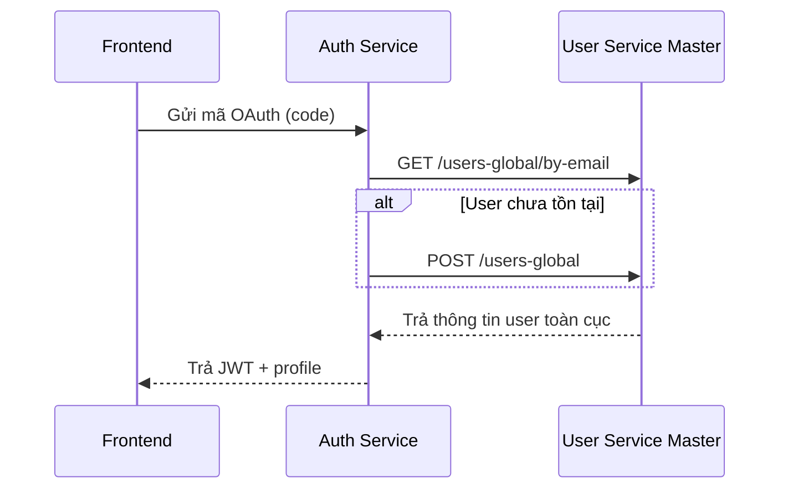
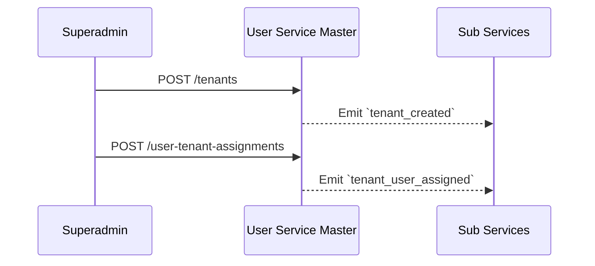
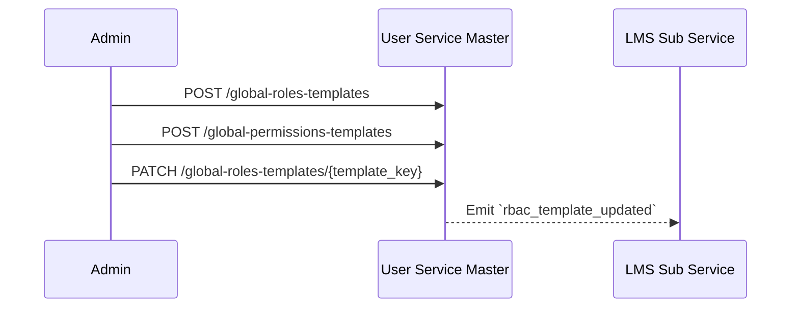
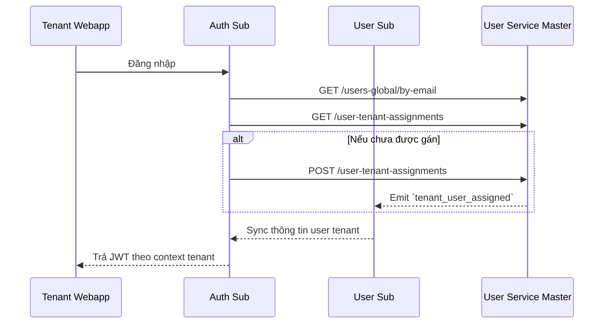

# 📘 User Service Master – Interface Contract

Tài liệu này định nghĩa giao diện API của dịch vụ `user-service/master`, phục vụ cho các hệ thống sử dụng toàn cục như Superadmin Webapp, Auth Service, và các Sub Service. Dịch vụ này chịu trách nhiệm quản lý người dùng toàn cục, gán người dùng vào tenant, và điều phối RBAC template.

---

## 1. 🎯 Mục đích

Cung cấp các API để:
- Tra cứu hoặc tạo người dùng toàn cục theo từng provider.
- Tạo và quản lý tenant (trường học).
- Gán người dùng vào tenant cụ thể.
- Quản lý hệ thống role/permission template toàn cục phục vụ RBAC phân tầng.
- Phát sự kiện để đồng bộ hóa tới các Sub Service.

---

## 2. 🧭 Phạm vi & Đối tượng sử dụng

| Đối tượng gọi API | Mục đích |
|-------------------|----------|
| Superadmin Webapp | Quản lý người dùng & phân quyền toàn cục |
| Auth Service      | Tra cứu hoặc tạo người dùng khi login |
| Sub User Service  | Đồng bộ danh sách assignment, RBAC template |

---

## 3. 📂 Phân loại API

| Nhóm chức năng | Mô tả |
|----------------|------|
| User Lookup    | Tra cứu người dùng toàn cục |
| User Creation  | Tạo người dùng mới theo provider |
| Tenant Mgmt    | Tạo và quản lý tenant |
| Assignment     | Gán user vào tenant |
| RBAC Template  | Quản lý role/permission mẫu toàn cục |
| Event Emit     | Phát sự kiện Pub/Sub theo tiêu chuẩn ADR-030 |

---

## 4. 📋 Danh sách endpoint chính

| Method | Path                                      | Mô tả ngắn                                                | Quyền yêu cầu            |
|--------|-------------------------------------------|------------------------------------------------------------|--------------------------|
| GET    | `/users-global/by-email`                 | Tra cứu người dùng toàn cục theo email + auth_provider     | `user.read`              |
| POST   | `/users-global`                          | Tạo người dùng toàn cục nếu chưa tồn tại                  | `user.create`            |
| GET    | `/tenants`                               | Liệt kê các tenant hiện có                                 | `tenant.read`            |
| POST   | `/tenants`                               | Tạo tenant mới (chỉ dùng cho Superadmin)                  | `tenant.create`          |
| GET    | `/user-tenant-assignments`               | Liệt kê các tenant mà một user đã được gán                 | `tenant_user.read`       |
| POST   | `/user-tenant-assignments`               | Gán người dùng vào tenant cụ thể                           | `tenant_user.assign`     |
| GET    | `/global-roles-templates`                | Liệt kê các role template toàn cục                         | `rbac.template.read`     |
| POST   | `/global-roles-templates`                | Tạo role template mới toàn cục                             | `rbac.template.create`   |
| GET    | `/global-permissions-templates`          | Liệt kê các permission template toàn cục                   | `rbac.template.read`     |
| POST   | `/global-permissions-templates`          | Tạo permission template mới toàn cục                       | `rbac.template.create`   |
| PATCH  | `/global-roles-templates/{template_key}` | Cập nhật danh sách quyền trong một role template cụ thể    | `rbac.template.update`   |
| PATCH  | `/global-permissions-templates/{perm_key}`| Cập nhật mô tả hoặc scope của permission template          | `rbac.template.update`   |

---

## 5. 📌 Chi tiết từng API

### 5.1. `GET /users-global/by-email`

Tra cứu người dùng toàn cục theo `email` và `auth_provider`. Được sử dụng bởi Auth Service để kiểm tra người dùng đã tồn tại hay chưa trước khi tạo mới.

---

#### 📥 Request

**Query parameters:**
- `email` (string, bắt buộc) – email người dùng cần tra cứu
- `auth_provider` (enum, bắt buộc) – nhà cung cấp xác thực  
  Giá trị hợp lệ: `"google"`, `"local"`, `"otp"`

**Headers:**
- `Authorization: Bearer <JWT>`

---

#### 📤 Response

```json
{
  "data": {
    "id": "usr_abc123",
    "email": "alice@vas.edu.vn",
    "auth_provider": "google",
    "full_name": "Alice B",
    "status": "active",
    "created_at": "2025-06-01T12:00:00Z"
  },
  "meta": {
    "trace_id": "abc-xyz"
  }
}
```

---

#### 🔐 Phân quyền & Điều kiện

* **Yêu cầu:** Bearer JWT hợp lệ (do Token Service phát hành)
* **Quyền:** `user.read` (global scope)
* **Điều kiện:**

  * `auth_provider` phải hợp lệ
  * Truy cập từ service được cấp quyền truy vấn toàn cục (ví dụ: Auth Master)

---

#### 📣 Sự kiện phát ra

* ❌ Không phát sự kiện.
  Đây là thao tác tra cứu (read-only).

---

#### ❌ Mã lỗi có thể trả về

| Mã lỗi | Mô tả                                             |
| ------ | ------------------------------------------------- |
| 400    | Thiếu `email` hoặc `auth_provider`, sai định dạng |
| 401    | Thiếu hoặc JWT không hợp lệ                       |
| 403    | Không có quyền `user.read`                        |
| 404    | Không tìm thấy người dùng phù hợp                 |
| 422    | Giá trị `auth_provider` không hợp lệ              |

---

#### 🧪 Gợi ý kiểm thử

* ✅ Truy vấn user hợp lệ → trả về thông tin chính xác
* ❌ Truy vấn email không tồn tại → trả `404`
* ❌ Thiếu `auth_provider` → trả `400`
* ❌ Sử dụng JWT không có quyền `user.read` → trả `403`
* ✅ Log trace\_id trong `meta` để đảm bảo observability

---

### 5.2. `POST /users-global`

Tạo người dùng toàn cục mới nếu chưa tồn tại, dựa trên `email` và `auth_provider`.  
Sử dụng bởi Auth Service hoặc Superadmin để khởi tạo người dùng global trong lần đăng nhập đầu tiên.

---

#### 📥 Request

**Headers:**
- `Authorization: Bearer <JWT>`

**Request body (JSON):**
```json
{
  "email": "alice@vas.edu.vn",
  "auth_provider": "google",
  "full_name": "Alice B"
}
```

**Field mô tả:**

* `email` (string, bắt buộc): email người dùng, duy nhất theo `auth_provider`
* `auth_provider` (enum, bắt buộc): `"google"` | `"local"` | `"otp"`
* `full_name` (string, tùy chọn): tên đầy đủ

---

#### 📤 Response

**201 Created**

```json
{
  "data": {
    "id": "usr_xyz789",
    "email": "alice@vas.edu.vn",
    "auth_provider": "google",
    "full_name": "Alice B",
    "status": "active"
  },
  "meta": {
    "trace_id": "abc-xyz"
  }
}
```

---

#### 🔐 Phân quyền & Điều kiện

* **Yêu cầu:** Bearer JWT hợp lệ
* **Quyền:** `user.create` (global scope)
* **Điều kiện:**

  * Nếu user đã tồn tại → trả `409`
  * Phải xác thực qua Auth Service có quyền global

---

#### 📣 Sự kiện phát ra

* `user_global_created`
  Schema: `vas.user.created.v1`
  Nội dung chứa: `user_id`, `email`, `auth_provider`, `created_at`

---

#### ❌ Mã lỗi có thể trả về

| Mã lỗi | Mô tả                                           |
| ------ | ----------------------------------------------- |
| 400    | Thiếu field bắt buộc (`email`, `auth_provider`) |
| 401    | Thiếu JWT hoặc không hợp lệ                     |
| 403    | Không có quyền `user.create`                    |
| 409    | Người dùng đã tồn tại                           |
| 422    | `auth_provider` không hợp lệ                    |

---

#### 🧪 Gợi ý kiểm thử

* ✅ Tạo user mới với email + provider hợp lệ → trả 201 + event
* ❌ Tạo trùng user → trả 409
* ❌ Thiếu `email` hoặc `auth_provider` → trả 400
* ✅ Kiểm tra sự kiện `user_global_created` được phát đúng schema
* ✅ Gọi 2 lần liên tiếp → chỉ 1 record được tạo (idempotency kiểm soát bằng unique key)

---

### 5.3. `GET /tenants`

Liệt kê danh sách tất cả các tenant (trường học) hiện có trong hệ thống.  
Endpoint này được sử dụng bởi Superadmin Webapp và các hệ thống đồng bộ (Sub Service, SMS) để tra cứu danh sách tenant toàn cục.

---

#### 📥 Request

**Headers:**
- `Authorization: Bearer <JWT>`

**Query parameters (tuỳ chọn):**
- `page`: số trang (default = 1)
- `page_size`: số lượng bản ghi mỗi trang (default = 20, tối đa 100)
- `search`: chuỗi tìm kiếm theo `name` hoặc `project_id` (optional)

---

#### 📤 Response

```json
{
  "data": [
    {
      "id": "tenant_abc123",
      "name": "Trường Việt Anh",
      "project_id": "vas-tenant-001",
      "created_at": "2025-06-01T12:00:00Z"
    }
  ],
  "meta": {
    "page": 1,
    "page_size": 20,
    "total": 5,
    "trace_id": "abc-xyz"
  }
}
```

---

#### 🔐 Phân quyền & Điều kiện

* **Yêu cầu:** Bearer JWT hợp lệ
* **Quyền:** `tenant.read`
* **Điều kiện:**

  * Chỉ có Superadmin hoặc hệ thống trung tâm mới được xem tất cả tenant

---

#### 📣 Sự kiện phát ra

* ❌ Không phát sinh sự kiện – thao tác đọc dữ liệu

---

#### ❌ Mã lỗi có thể trả về

| Mã lỗi | Mô tả                                    |
| ------ | ---------------------------------------- |
| 401    | Không có hoặc JWT không hợp lệ           |
| 403    | Không có quyền `tenant.read`             |
| 422    | Tham số `page`, `page_size` không hợp lệ |

---

#### 🧪 Gợi ý kiểm thử

* ✅ Gọi với quyền `tenant.read` hợp lệ → trả danh sách tenant
* ❌ Gọi không JWT hoặc quyền không đúng → trả 401 / 403
* ✅ Kiểm tra paging hoạt động đúng (meta.total, meta.page)
* ✅ Kiểm tra filter `search` trả về đúng tenant liên quan
* ✅ Log trace\_id trong mỗi phản hồi

---

### 5.4. `POST /tenants`

Tạo mới một tenant (trường học) trong hệ thống.  
Chỉ được sử dụng bởi Superadmin Webapp để khởi tạo môi trường độc lập cho một trường.  
Sau khi tạo, sẽ phát sự kiện `tenant_created` để các Sub Service (Auth, User, Notification, SMS...) khởi tạo stack tương ứng.

---

#### 📥 Request

**Headers:**
- `Authorization: Bearer <JWT>`

**Request body (JSON):**
```json
{
  "name": "Trường Việt Anh",
  "project_id": "vas-tenant-001"
}
```

**Mô tả trường dữ liệu:**

* `name` (string, bắt buộc): tên hiển thị của tenant (ví dụ: “Trường Việt Anh”)
* `project_id` (string, bắt buộc): mã duy nhất dùng để cấu hình môi trường (cloud resource, codebase,...)

---

#### 📤 Response

**201 Created**

```json
{
  "data": {
    "id": "tenant_xyz789",
    "name": "Trường Việt Anh",
    "project_id": "vas-tenant-001",
    "created_at": "2025-06-13T08:00:00Z"
  },
  "meta": {
    "trace_id": "abc-xyz"
  }
}
```

---

#### 🔐 Phân quyền & Điều kiện

* **Yêu cầu:** Bearer JWT hợp lệ
* **Quyền:** `tenant.create`
* **Điều kiện:**

  * `project_id` phải duy nhất toàn hệ thống (unique index)
  * Chỉ Superadmin có quyền gọi

---

#### 📣 Sự kiện phát ra

* `tenant_created`
  Schema: `vas.tenant.created.v1`
  Payload: `{ tenant_id, name, project_id, created_at }`
  Consumer: tất cả các Sub Service khởi tạo schema, role mapping theo tenant mới

---

#### ❌ Mã lỗi có thể trả về

| Mã lỗi | Mô tả                                             |
| ------ | ------------------------------------------------- |
| 400    | Thiếu `name` hoặc `project_id`                    |
| 401    | Thiếu hoặc sai JWT                                |
| 403    | Không có quyền `tenant.create`                    |
| 409    | `project_id` đã tồn tại                           |
| 422    | `project_id` sai định dạng (`snake-case` yêu cầu) |

---

#### 🧪 Gợi ý kiểm thử

* ✅ Tạo tenant với `project_id` hợp lệ → trả 201 + phát event
* ❌ Gọi lặp lại với `project_id` đã tồn tại → trả 409
* ❌ Thiếu JWT hoặc quyền → trả 401 / 403
* ✅ Kiểm tra log trace\_id trong meta
* ✅ Kiểm tra Sub Service nhận event và tạo schema đúng

---

### 5.5. `GET /user-tenant-assignments`

Liệt kê tất cả các tenant mà một người dùng toàn cục đã được gán vào.  
Được sử dụng bởi Auth Service trong quá trình xác định “scope” khi login, hoặc bởi Superadmin để kiểm tra trạng thái phân quyền.

---

#### 📥 Request

**Headers:**
- `Authorization: Bearer <JWT>`

**Query parameters:**
- `user_global_id` (string, bắt buộc): ID người dùng toàn cục cần truy vấn
- `status` (optional): `active` | `revoked`

---

#### 📤 Response

```json
{
  "data": [
    {
      "tenant_id": "tenant_abc123",
      "project_id": "vas-tenant-001",
      "assigned_by": "admin@vas.edu.vn",
      "assigned_at": "2025-06-01T10:00:00Z",
      "status": "active"
    }
  ],
  "meta": {
    "trace_id": "abc-xyz"
  }
}
```

---

#### 🔐 Phân quyền & Điều kiện

* **Yêu cầu:** Bearer JWT hợp lệ
* **Quyền:** `tenant_user.read`
* **Điều kiện:**

  * `user_global_id` phải tồn tại
  * Gọi từ hệ thống trung tâm có quyền truy cập thông tin phân quyền toàn cục

---

#### 📣 Sự kiện phát ra

* ❌ Không phát sinh sự kiện – đây là thao tác chỉ đọc

---

#### ❌ Mã lỗi có thể trả về

| Mã lỗi | Mô tả                                     |
| ------ | ----------------------------------------- |
| 400    | Thiếu `user_global_id` hoặc sai định dạng |
| 401    | Thiếu hoặc JWT không hợp lệ               |
| 403    | Không có quyền `tenant_user.read`         |
| 404    | Không tìm thấy người dùng                 |

---

#### 🧪 Gợi ý kiểm thử

* ✅ Gọi hợp lệ → trả danh sách tenant user đã được gán
* ✅ Gọi với `status=revoked` → chỉ trả assignment đã bị thu hồi
* ❌ Không có `user_global_id` → trả 400
* ✅ Kiểm tra trace\_id có trong phản hồi
* ❌ Gọi với JWT không có quyền → trả 403

---

### 5.6. `POST /user-tenant-assignments`

Gán một người dùng toàn cục (`user_global_id`) vào một tenant cụ thể.  
Được sử dụng bởi Superadmin để phân người dùng (học sinh, giáo viên, nhân viên) vào trường.  
Sau khi gán, hệ thống sẽ phát sự kiện để các Sub Service tạo tài khoản tương ứng cho user trong môi trường tenant.

---

#### 📥 Request

**Headers:**
- `Authorization: Bearer <JWT>`

**Request body (JSON):**
```json
{
  "user_global_id": "usr_abc123",
  "tenant_id": "tenant_xyz789",
  "assigned_by": "admin@vas.edu.vn"
}
```

**Mô tả field:**

* `user_global_id` (string, bắt buộc): ID người dùng toàn cục
* `tenant_id` (string, bắt buộc): ID tenant mà người dùng sẽ được gán vào
* `assigned_by` (string, tùy chọn): email hoặc ID của người thực hiện thao tác

---

#### 📤 Response

**201 Created**

```json
{
  "data": {
    "assignment_id": "assign_001",
    "user_global_id": "usr_abc123",
    "tenant_id": "tenant_xyz789",
    "status": "active",
    "assigned_at": "2025-06-13T08:30:00Z"
  },
  "meta": {
    "trace_id": "abc-xyz"
  }
}
```

---

#### 🔐 Phân quyền & Điều kiện

* **Yêu cầu:** Bearer JWT hợp lệ
* **Quyền:** `tenant_user.assign`
* **Điều kiện:**

  * Gán trùng (`user_global_id` đã thuộc `tenant_id`) → trả `409`
  * Sub Service chỉ đồng bộ khi trạng thái là `active`

---

#### 📣 Sự kiện phát ra

* `tenant_user_assigned`
  Schema: `vas.tenant_user.assigned.v1`
  Payload: `{ user_global_id, tenant_id, assigned_by, assigned_at }`
  Consumer: Sub User Service, Auth Sub, Notification Sub, LMS Sub...

---

#### ❌ Mã lỗi có thể trả về

| Mã lỗi | Mô tả                                                |
| ------ | ---------------------------------------------------- |
| 400    | Thiếu field bắt buộc (`user_global_id`, `tenant_id`) |
| 401    | Không có hoặc sai JWT                                |
| 403    | Không có quyền `tenant_user.assign`                  |
| 404    | Không tìm thấy user hoặc tenant                      |
| 409    | Người dùng đã được gán vào tenant này                |

---

#### 🧪 Gợi ý kiểm thử

* ✅ Gán user chưa từng thuộc tenant → 201 Created + phát event
* ❌ Gán lặp lại user vào cùng tenant → 409 Conflict
* ✅ Kiểm tra sự kiện `tenant_user_assigned` được phát đúng schema
* ❌ Gọi thiếu field → trả 400
* ✅ Gọi sai tenant hoặc user không tồn tại → 404
* ✅ Kiểm tra trace\_id có trong meta phản hồi

---

### 5.7. `GET /global-roles-templates`

Liệt kê tất cả các role template toàn cục.  
Được sử dụng bởi Superadmin Webapp và các Sub Service để tham chiếu khi áp dụng RBAC template cho user trong từng tenant.

---

#### 📥 Request

**Headers:**
- `Authorization: Bearer <JWT>`

**Query parameters (optional):**
- `is_system` (boolean): lọc theo role mặc định hệ thống (`true`) hoặc do người dùng tạo (`false`)

---

#### 📤 Response

```json
{
  "data": [
    {
      "template_key": "student_basic",
      "name": "Học sinh cơ bản",
      "is_system": true,
      "description": "Quyền cơ bản cho học sinh",
      "permissions": ["report.view", "notification.read"]
    }
  ],
  "meta": {
    "trace_id": "abc-xyz"
  }
}
```

---

#### 🔐 Phân quyền & Điều kiện

* **Yêu cầu:** Bearer JWT hợp lệ
* **Quyền:** `rbac.template.read`
* **Điều kiện:**

  * Được sử dụng trong context Superadmin hoặc hệ thống đồng bộ

---

#### 📣 Sự kiện phát ra

* ❌ Không có sự kiện – thao tác đọc

---

#### ❌ Mã lỗi có thể trả về

| Mã lỗi | Mô tả                                         |
| ------ | --------------------------------------------- |
| 401    | Không có hoặc JWT không hợp lệ                |
| 403    | Không có quyền `rbac.template.read`           |
| 422    | `is_system` không hợp lệ (phải là true/false) |

---

#### 🧪 Gợi ý kiểm thử

* ✅ Gọi bình thường → trả danh sách role template toàn cục
* ✅ Gọi với `is_system=true` → chỉ trả role mặc định hệ thống
* ❌ Gọi không quyền → trả 403
* ✅ Kiểm tra trace\_id trong phản hồi
* ✅ Dùng thông tin `template_key` để tra cứu permission tương ứng

---

### 5.8. `POST /global-roles-templates`

Tạo mới một role template toàn cục.  
Được sử dụng bởi Superadmin để định nghĩa các nhóm quyền chuẩn áp dụng cho user trong tenant.  
Khi template được tạo, Sub Service sẽ có thể tra cứu và áp dụng tương ứng khi cấu hình RBAC.

---

#### 📥 Request

**Headers:**
- `Authorization: Bearer <JWT>`

**Request body (JSON):**
```json
{
  "template_key": "teacher_advanced",
  "name": "Giáo viên nâng cao",
  "description": "Quyền đầy đủ cho giáo viên bộ môn",
  "permissions": ["report.view", "lms.grade.edit"]
}
```

**Mô tả field:**

* `template_key` (string, bắt buộc): định danh duy nhất cho template (snake\_case)
* `name` (string, bắt buộc): tên hiển thị
* `description` (string, tùy chọn): mô tả chức năng của role
* `permissions` (array string, bắt buộc): danh sách `permission_key` liên kết với role

---

#### 📤 Response

**201 Created**

```json
{
  "data": {
    "template_key": "teacher_advanced",
    "name": "Giáo viên nâng cao",
    "permissions": ["report.view", "lms.grade.edit"]
  },
  "meta": {
    "trace_id": "abc-xyz"
  }
}
```

---

#### 🔐 Phân quyền & Điều kiện

* **Yêu cầu:** Bearer JWT hợp lệ
* **Quyền:** `rbac.template.create`
* **Điều kiện:**

  * `template_key` duy nhất (unique)
  * Các `permission_key` phải tồn tại trong danh sách permission template toàn cục

---

#### 📣 Sự kiện phát ra

* ❌ Không phát sự kiện ngay.
  Chỉ phát khi có cập nhật (`PATCH`) template (`rbac_template_updated`)

---

#### ❌ Mã lỗi có thể trả về

| Mã lỗi | Mô tả                                            |
| ------ | ------------------------------------------------ |
| 400    | Thiếu field bắt buộc hoặc định dạng sai          |
| 401    | Thiếu hoặc JWT không hợp lệ                      |
| 403    | Không có quyền `rbac.template.create`            |
| 409    | `template_key` đã tồn tại                        |
| 422    | `permissions` chứa `permission_key` không hợp lệ |

---

#### 🧪 Gợi ý kiểm thử

* ✅ Tạo mới role template với `template_key` hợp lệ → trả 201
* ❌ Tạo trùng `template_key` → trả 409
* ✅ Kiểm tra `permission_key` hợp lệ → chấp nhận
* ❌ Chèn `permission_key` không có → trả 422
* ✅ Kiểm tra trace\_id trong phản hồi

---

### 5.9. `GET /global-permissions-templates`

Liệt kê tất cả các permission template toàn cục.  
Được sử dụng để cấu hình role template hoặc để gợi ý quyền trong UI Superadmin Webapp.  
Là nguồn dữ liệu chuẩn để cấu trúc RBAC cho toàn hệ thống theo tầng dịch vụ.

---

#### 📥 Request

**Headers:**
- `Authorization: Bearer <JWT>`

**Query parameters (optional):**
- `service_scope` (string): lọc các permission theo tên service, ví dụ `"report"`, `"lms"`  
- `keyword` (string): tìm kiếm theo `permission_key` hoặc mô tả

---

#### 📤 Response

```json
{
  "data": [
    {
      "permission_key": "report.view",
      "service_scope": "report",
      "description": "Xem báo cáo học tập"
    },
    {
      "permission_key": "lms.grade.edit",
      "service_scope": "lms",
      "description": "Chấm điểm học viên"
    }
  ],
  "meta": {
    "trace_id": "abc-xyz"
  }
}
```

---

#### 🔐 Phân quyền & Điều kiện

* **Yêu cầu:** Bearer JWT hợp lệ
* **Quyền:** `rbac.template.read`
* **Điều kiện:**

  * Gọi từ Superadmin Webapp hoặc hệ thống nội bộ trung tâm

---

#### 📣 Sự kiện phát ra

* ❌ Không có – đây là thao tác tra cứu tĩnh

---

#### ❌ Mã lỗi có thể trả về

| Mã lỗi | Mô tả                                       |
| ------ | ------------------------------------------- |
| 401    | Không có hoặc JWT không hợp lệ              |
| 403    | Không có quyền `rbac.template.read`         |
| 422    | `service_scope` không hợp lệ (nếu validate) |

---

#### 🧪 Gợi ý kiểm thử

* ✅ Trả danh sách đầy đủ permission template nếu không có filter
* ✅ Gọi với `service_scope=report` → chỉ trả các permission liên quan
* ✅ Gọi với `keyword=grade` → trả các permission có liên quan
* ❌ Gọi sai quyền hoặc JWT → trả 403 hoặc 401
* ✅ Kiểm tra trace\_id có trong phản hồi

---

### 5.10. `POST /global-permissions-templates`

Tạo một permission template mới ở cấp toàn cục.  
Được sử dụng bởi Superadmin để mở rộng hệ thống quyền theo từng dịch vụ (service_scope).  
Các permission này là đơn vị cơ bản để gán vào role template và áp dụng cho RBAC tenant.

---

#### 📥 Request

**Headers:**
- `Authorization: Bearer <JWT>`

**Request body (JSON):**
```json
{
  "permission_key": "finance.invoice.view",
  "service_scope": "finance",
  "description": "Xem hóa đơn học phí"
}
```

**Mô tả field:**

* `permission_key` (string, bắt buộc): định danh quyền (theo định dạng `scope.action`, ví dụ: `report.view`)
* `service_scope` (string, bắt buộc): tên dịch vụ liên quan (ví dụ: `report`, `lms`, `finance`)
* `description` (string, tùy chọn): mô tả rõ hành vi gắn với quyền

---

#### 📤 Response

**201 Created**

```json
{
  "data": {
    "permission_key": "finance.invoice.view",
    "service_scope": "finance",
    "description": "Xem hóa đơn học phí"
  },
  "meta": {
    "trace_id": "abc-xyz"
  }
}
```

---

#### 🔐 Phân quyền & Điều kiện

* **Yêu cầu:** Bearer JWT hợp lệ
* **Quyền:** `rbac.template.create`
* **Điều kiện:**

  * `permission_key` phải duy nhất
  * `permission_key` tuân định dạng `service_scope.action` (snake\_case)
  * `service_scope` phải được định nghĩa hợp lệ trong hệ thống

---

#### 📣 Sự kiện phát ra

* ❌ Không phát – permission chỉ có hiệu lực khi gán vào role template

---

#### ❌ Mã lỗi có thể trả về

| Mã lỗi | Mô tả                                               |
| ------ | --------------------------------------------------- |
| 400    | Thiếu field hoặc sai định dạng                      |
| 401    | Không có hoặc sai JWT                               |
| 403    | Không có quyền `rbac.template.create`               |
| 409    | `permission_key` đã tồn tại                         |
| 422    | `permission_key` sai định dạng (`<scope>.<action>`) |

---

#### 🧪 Gợi ý kiểm thử

* ✅ Tạo permission mới hợp lệ → trả 201
* ❌ Tạo permission trùng `permission_key` → trả 409
* ❌ `permission_key` thiếu dấu chấm hoặc sai kiểu → trả 422
* ✅ Kiểm tra trace\_id trong phản hồi
* ✅ Dùng permission mới để gán vào role template và kiểm tra hiệu lực

---

### 5.11. `PATCH /global-roles-templates/{template_key}`

Cập nhật danh sách quyền (permissions) của một role template toàn cục.  
Sau khi cập nhật, hệ thống sẽ phát sự kiện `rbac_template_updated` để các Sub Service đồng bộ lại RBAC cache cho các tenant.

---

#### 📥 Request

**Headers:**
- `Authorization: Bearer <JWT>`

**Path parameters:**
- `template_key` (string, bắt buộc): định danh của role template cần cập nhật

**Request body (JSON):**
```json
{
  "permissions": ["report.view", "lms.grade.edit"]
}
```

**Mô tả field:**

* `permissions` (array string, bắt buộc): danh sách `permission_key` mới cho template này.
  Danh sách cũ sẽ bị thay thế hoàn toàn.

---

#### 📤 Response

**200 OK**

```json
{
  "data": {
    "template_key": "teacher_advanced",
    "updated_permissions": ["report.view", "lms.grade.edit"]
  },
  "meta": {
    "trace_id": "abc-xyz"
  }
}
```

---

#### 🔐 Phân quyền & Điều kiện

* **Yêu cầu:** Bearer JWT hợp lệ
* **Quyền:** `rbac.template.update`
* **Điều kiện:**

  * `template_key` phải tồn tại
  * Các `permission_key` cung cấp phải tồn tại trong global permissions template
  * Không cho phép chỉnh sửa các template có `is_system = true` (nếu áp dụng)

---

#### 📣 Sự kiện phát ra

* `rbac_template_updated`
  Schema: `vas.rbac.template.updated.v1`
  Payload: `{ template_key, updated_permissions, updated_at }`
  Consumer: tất cả Sub Service sử dụng RBAC caching (User Sub, LMS Sub, CRM Sub...)

---

#### ❌ Mã lỗi có thể trả về

| Mã lỗi | Mô tả                                            |
| ------ | ------------------------------------------------ |
| 400    | Thiếu hoặc sai định dạng `permissions`           |
| 401    | Không có hoặc JWT không hợp lệ                   |
| 403    | Không có quyền `rbac.template.update`            |
| 404    | `template_key` không tồn tại                     |
| 422    | Có `permission_key` không tồn tại trong hệ thống |

---

#### 🧪 Gợi ý kiểm thử

* ✅ Cập nhật role template với quyền hợp lệ → trả 200 + phát event
* ❌ Sử dụng `template_key` không tồn tại → trả 404
* ❌ Chèn `permission_key` sai → trả 422
* ✅ Kiểm tra event `rbac_template_updated` phát đúng schema
* ✅ Kiểm tra trace\_id có trong phản hồi

---

### 5.12. `PATCH /global-permissions-templates/{perm_key}`

Cập nhật thông tin mô tả hoặc `service_scope` của một permission template toàn cục.  
Sử dụng trong trường hợp cần điều chỉnh mô tả cho rõ ràng hơn, hoặc chuyển scope sang dịch vụ khác trong quá trình refactor hệ thống.

---

#### 📥 Request

**Headers:**
- `Authorization: Bearer <JWT>`

**Path parameters:**
- `perm_key` (string, bắt buộc): định danh của permission cần cập nhật

**Request body (JSON):**
```json
{
  "description": "Quyền xem hóa đơn học phí",
  "service_scope": "billing"
}
```

**Mô tả field:**

* `description` (string, optional): mô tả cập nhật
* `service_scope` (string, optional): tên service mới (nếu cần đổi)

---

#### 📤 Response

**200 OK**

```json
{
  "data": {
    "permission_key": "finance.invoice.view",
    "description": "Quyền xem hóa đơn học phí",
    "service_scope": "billing"
  },
  "meta": {
    "trace_id": "abc-xyz"
  }
}
```

---

#### 🔐 Phân quyền & Điều kiện

* **Yêu cầu:** Bearer JWT hợp lệ
* **Quyền:** `rbac.template.update`
* **Điều kiện:**

  * `perm_key` phải tồn tại
  * Không cho phép đổi `permission_key` (immutable)
  * Nếu cập nhật `service_scope`, giá trị mới phải hợp lệ theo quy ước hệ thống

---

#### 📣 Sự kiện phát ra

* ❌ Không phát sự kiện – vì không ảnh hưởng logic phân quyền runtime
  (permission được áp dụng thông qua role template đã cache riêng)

---

#### ❌ Mã lỗi có thể trả về

| Mã lỗi | Mô tả                                            |
| ------ | ------------------------------------------------ |
| 400    | Body rỗng hoặc không có field hợp lệ để cập nhật |
| 401    | Thiếu hoặc JWT không hợp lệ                      |
| 403    | Không có quyền `rbac.template.update`            |
| 404    | `perm_key` không tồn tại                         |
| 422    | `service_scope` mới không hợp lệ                 |

---

#### 🧪 Gợi ý kiểm thử

* ✅ Cập nhật mô tả permission → trả 200
* ✅ Cập nhật `service_scope` → trả 200, kiểm tra hiển thị đúng nơi dùng
* ❌ Gọi với `perm_key` sai → trả 404
* ❌ Body rỗng hoặc không hợp lệ → trả 400
* ✅ Kiểm tra trace\_id trong phản hồi

---

## 6. 📡 Sự kiện phát ra (Pub/Sub)

`user-service/master` là nguồn phát sinh một số sự kiện quan trọng phục vụ cho quá trình đồng bộ dữ liệu người dùng và RBAC phân tầng trong toàn bộ hệ thống.  
Các sự kiện đều tuân theo chuẩn định danh `vas.<domain>.<action>.v1` theo `adr-030-event-schema-governance.md`.

| Event Name                   | Trigger                                | Schema                         | Consumer (ví dụ)                  |
|-----------------------------|----------------------------------------|---------------------------------|-----------------------------------|
| `user_global_created`       | Khi tạo user toàn cục (`POST /users-global`) | `vas.user.created.v1`           | `user-service/sub`, `audit-log`  |
| `tenant_created`            | Khi tạo tenant mới (`POST /tenants`)        | `vas.tenant.created.v1`         | `user-service/sub`, `sms-service`|
| `tenant_user_assigned`      | Khi gán user vào tenant (`POST /user-tenant-assignments`) | `vas.tenant_user.assigned.v1` | `user-service/sub`, `auth-service/sub` |
| `rbac_template_updated`     | Khi cập nhật role template (`PATCH /global-roles-templates/{template_key}`) | `vas.rbac.template.updated.v1` | `user-service/sub`, `lms-service/sub`  |

---

**Lưu ý:**
- Mỗi sự kiện đều kèm `trace_id` để phục vụ cho audit và trace liên dịch vụ.
- Toàn bộ schema được định nghĩa rõ trong `event-schema.yaml` của `eventing standard` (tham khảo `adr-030`).
- Các Sub Service sẽ dùng consumer riêng biệt để xử lý sự kiện theo `tenant_id`.

---

### 6.1. 📦 Ví dụ: Sự kiện `user_global_created`

- **Được phát bởi:** `POST /users-global`
- **Tiêu chuẩn định danh:** `vas.user.created.v1`
- **Mục đích:** Đồng bộ tạo user tới các Sub Service (User Sub, Notification, LMS, Audit...)

---

#### 📤 Payload mẫu

```json
{
  "event_name": "vas.user.created.v1",
  "trace_id": "abc-xyz-123",
  "emitted_at": "2025-06-13T08:35:00Z",
  "data": {
    "user_id": "usr_xyz789",
    "email": "alice@vas.edu.vn",
    "auth_provider": "google",
    "full_name": "Alice B",
    "status": "active",
    "created_at": "2025-06-13T08:30:00Z"
  }
}
```

---

#### 🧾 Mô tả schema

| Trường               | Kiểu                            | Bắt buộc | Mô tả                                     |
| -------------------- | ------------------------------- | -------- | ----------------------------------------- |
| `event_name`         | string                          | ✅        | Định danh sự kiện theo chuẩn ADR-030      |
| `trace_id`           | string                          | ✅        | ID trace phục vụ observability            |
| `emitted_at`         | datetime                        | ✅        | Thời điểm sự kiện được phát               |
| `data.user_id`       | string                          | ✅        | ID người dùng toàn cục                    |
| `data.email`         | string                          | ✅        | Email đăng nhập                           |
| `data.auth_provider` | enum (`google`, `local`, `otp`) | ✅        | Nhà cung cấp xác thực                     |
| `data.full_name`     | string                          | ✅        | Họ tên người dùng                         |
| `data.status`        | string                          | ✅        | Trạng thái ban đầu (`active`, `inactive`) |
| `data.created_at`    | datetime                        | ✅        | Thời điểm khởi tạo                        |

---

#### ✅ Gợi ý kiểm thử sự kiện

* Tạo user mới → kiểm tra message được đẩy vào message broker (Kafka, NATS...)
* Kiểm tra trace\_id có mặt ở cả phía caller lẫn message
* Sub Service nhận đúng schema và xử lý đúng logic khởi tạo user nội bộ

---

### 6.2. 📦 Ví dụ: Sự kiện `tenant_user_assigned`

- **Được phát bởi:** `POST /user-tenant-assignments`
- **Tiêu chuẩn định danh:** `vas.tenant_user.assigned.v1`
- **Mục đích:** Đồng bộ việc gán user vào tenant tới các Sub Service để khởi tạo user nội bộ trong tenant context.

---

#### 📤 Payload mẫu

```json
{
  "event_name": "vas.tenant_user.assigned.v1",
  "trace_id": "trace-xyz-456",
  "emitted_at": "2025-06-13T09:15:00Z",
  "data": {
    "user_global_id": "usr_abc123",
    "tenant_id": "tenant_vas001",
    "project_id": "vas-tenant-001",
    "assigned_by": "admin@vas.edu.vn",
    "assigned_at": "2025-06-13T09:14:00Z"
  }
}
```

---

#### 🧾 Mô tả schema

| Trường                | Kiểu     | Bắt buộc | Mô tả                                                         |
| --------------------- | -------- | -------- | ------------------------------------------------------------- |
| `event_name`          | string   | ✅        | Định danh sự kiện (theo ADR-030)                              |
| `trace_id`            | string   | ✅        | Trace ID liên kết với luồng tương tác                         |
| `emitted_at`          | datetime | ✅        | Thời điểm phát sự kiện                                        |
| `data.user_global_id` | string   | ✅        | ID người dùng toàn cục                                        |
| `data.tenant_id`      | string   | ✅        | ID tenant đích                                                |
| `data.project_id`     | string   | ✅        | Mã định danh duy nhất của tenant (dùng cho context isolation) |
| `data.assigned_by`    | string   | ✅        | Người thực hiện thao tác gán (email hoặc ID)                  |
| `data.assigned_at`    | datetime | ✅        | Thời điểm thao tác gán được thực hiện                         |

---

#### ✅ Gợi ý kiểm thử sự kiện

* Thực hiện `POST /user-tenant-assignments` → kiểm tra event được đẩy đúng định dạng
* Sub Service kiểm tra context `tenant_id + project_id` để tạo schema hoặc account nội bộ
* Audit Service ghi nhận `assigned_by` + `trace_id` để phục vụ tra soát
* Kiểm tra event không phát trùng khi gán lại user cũ

---

## 7. 🧠 Cách sử dụng phổ biến (business flow)

Dưới đây là các luồng nghiệp vụ chính có sự tham gia của `user-service/master`, đóng vai trò trung tâm trong quản lý định danh toàn cục, RBAC phân tầng, và đồng bộ user đến từng tenant.

---

### 7.1. 🌐 Đăng nhập lần đầu & tạo user toàn cục (qua Auth Service)



---

### 7.2. 🏫 Superadmin tạo tenant mới & phân quyền



---

### 7.3. 🔐 Quản trị RBAC toàn cục



---

### 7.4. 🧩 Đồng bộ user cho tenant mới (qua Sub Service)



---

### 🔎 Ghi chú

* Mỗi luồng đều gắn chặt với các API đã định nghĩa và sự kiện phát ra tương ứng trong mục 5–6.
* Trace ID luôn được truyền theo toàn luồng, phục vụ audit và debug.
* Các luồng luôn đi từ dịch vụ trung tâm (`master`) xuống dịch vụ con (`sub`), đúng với kiến trúc phân tầng multi-tenant đã định nghĩa trong `system-diagrams.md`.

---

## 8. 📎 Phụ lục

- [Design](./design.md)
- [Data Model](./data-model.md)
- [OpenAPI](./openapi.yaml)
- [ADR-030 – Event Schema Governance](../../../ADR/adr-030-event-schema-governance.md)
